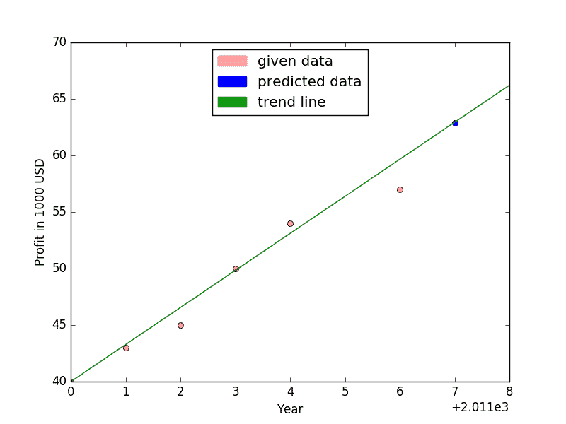
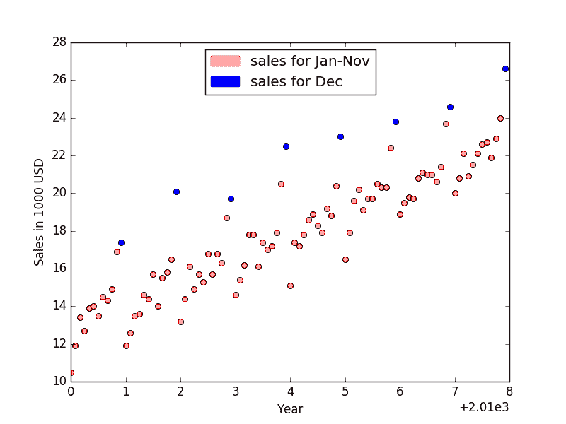
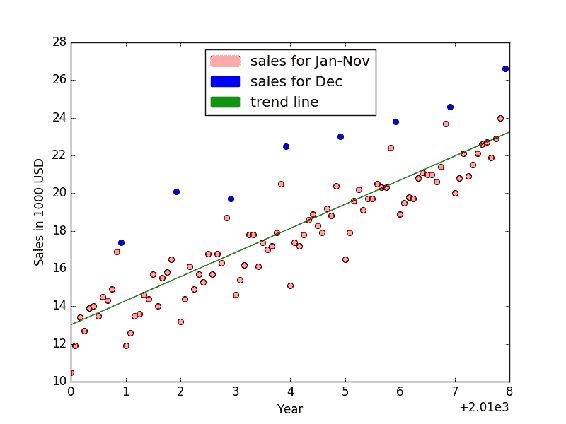
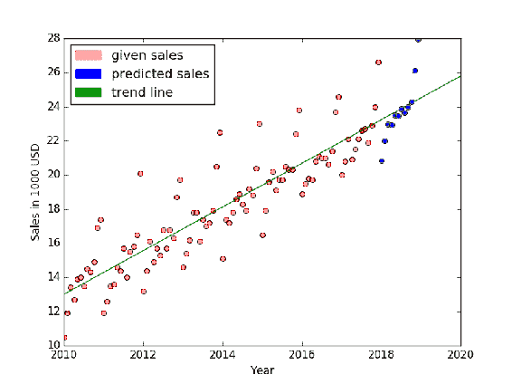
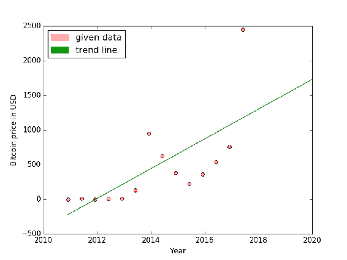
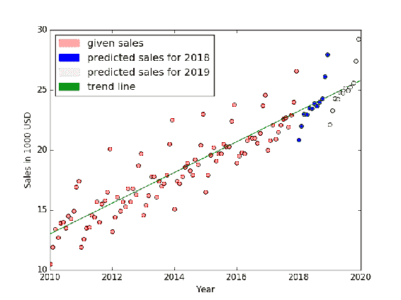

# 七、时间序列分析

时间序列分析是对时间相关数据的分析。给定某一时期的数据，目的是预测不同时期的数据，通常是未来的数据。例如，时间序列分析用于预测金融市场、地震和天气。

在这一章中，我们主要关心的是预测某些数量的数值，例如，2030 年的人口数量。

基于时间的预测的主要元素如下:

*   趋势:变量倾向于上升还是下降久而久之？例如，人类人口是增长还是减少？
*   **季节性**:数据在时间上是如何依赖于某些规律事件的？例如，餐馆的利润在周五比周二高吗？

将时间序列分析的这两个要素结合起来，为我们提供了一种强有力的方法来进行与时间相关的预测。

在本章中，您将了解以下主题:

*   通过商业利润示例使用回归分析数据趋势
*   通过电子商店的销售示例，以季节性的形式观察和分析数据中的重复模式
*   以一家电子商店的销售为例，您将学习如何结合趋势和季节性分析来预测与时间相关的数据
*   使用商业利润和电子商店销售额的示例在 Python 中创建时间相关模型


# 商业利润——分析趋势

我们有兴趣预测一家企业在 2018 年的利润，前提是该企业前几年的利润:

| **年** | **美元利润** |
| Two thousand and eleven | $40,000 |
| Two thousand and twelve | $43,000 |
| Two thousand and thirteen | $45,000 |
| Two thousand and fourteen | $50,000 |
| Two thousand and fifteen | $54,000 |
| Two thousand and sixteen | $57,000 |
| Two thousand and seventeen | $59,000 |
| Two thousand and eighteen | ？ |


# 分析

在这个例子中，利润总是在增加，所以我们可以把利润看作一个依赖于时间变量的增长函数，时间变量用年来表示。随后几年间的利润差异为 3，000 美元、2，000 美元、5，000 美元、4，000 美元、3，000 美元和 2，000 美元。这些差异似乎不受时间的影响，它们之间的变化相对较低。因此，我们可以通过线性回归来预测未来几年的利润。我们用一个线性方程来表示利润， *p* ，用一年来表示， *y* ，这个线性方程也被称为趋势线:


我们可以用线性回归法求出常数，a*和 T2 b*。


# 在 Python 中使用最小二乘法分析趋势

**输入**:

我们将上表中的数据存储在 Python 代码中的`year`和`profit`向量中:

```py
# source_code/7/profit_year.py #Predicting profit based on the year
import numpy as np
from scipy.linalg import lstsq

year = np.array([2011,2012,2013,2014,2015,2016,2017])
profit = np.array([40,43,45,50,54,57,59])

M = year[:, np.newaxis]**[0, 1]
model, _, _, _ = lstsq(M,profit)
print "Intercept =", model[0]
print "year coefficient =", model[1]
```

**输出**:

```py
$ python profit_year.py Intercept = -6711.571428570175
year coefficient = 3.3571428571422364
```


# 形象化

现在，我们将趋势线添加到图表中:



商业利润-数据分析


# 结论

公司利润的趋势线方程如下:


根据这个等式，我们可以预测 2018 年的利润如下:


这个例子很简单——我们只需在趋势线上使用线性回归就能做出预测。

在下一个示例中，我们将查看受趋势和季节性影响的数据。


# 电子商店的销售——分析季节性

我们有一家小型电子商店 2010 年至 2017 年每月以千美元计的销售额数据。我们希望预测 2018 年每个月的销售额:

| **月/年** | **2010 年** | **2011 年** | **2012 年** | **2013 年** | **2014 年** | **2015 年** | **2016 年** | **2017 年** | **2018** |
| 一月 | Ten point five | Eleven point nine | Thirteen point two | Fourteen point six | Fifteen point one | Sixteen point five | Eighteen point nine | Twenty |  |
| 二月 | Eleven point nine | Twelve point six | Fourteen point four | Fifteen point four | Seventeen point four | Seventeen point nine | Nineteen point five | Twenty point eight |  |
| 三月 | Thirteen point four | Thirteen point five | Sixteen point one | Sixteen point two | Seventeen point two | Nineteen point six | Nineteen point eight | Twenty-two point one |  |
| 四月 | Twelve point seven | Thirteen point six | Fourteen point nine | Seventeen point eight | Seventeen point eight | Twenty point two | Nineteen point seven | Twenty point nine |  |
| 五月 | Thirteen point nine | Fourteen point six | Fifteen point seven | Seventeen point eight | Eighteen point six | Nineteen point one | Twenty point eight | Twenty-one point five |  |
| 六月 | Fourteen | Fourteen point four | Fifteen point three | Sixteen point one | Eighteen point nine | Nineteen point seven | Twenty-one point one | Twenty-two point one |  |
| 七月 | Thirteen point five | Fifteen point seven | Sixteen point eight | Seventeen point four | Eighteen point three | Nineteen point seven | Twenty-one | Twenty-two point six |  |
| 八月 | Fourteen point five | Fourteen | Fifteen point seven | Seventeen | Seventeen point nine | Twenty point five | Twenty-one | Twenty-two point seven |  |
| 九月 | Fourteen point three | Fifteen point five | Sixteen point eight | Seventeen point two | Nineteen point two | Twenty point three | Twenty point six | Twenty-one point nine |  |
| 十月 | Fourteen point nine | Fifteen point eight | Sixteen point three | Seventeen point nine | Eighteen point eight | Twenty point three | Twenty-one point four | Twenty-two point nine |  |
| 十一月 | Sixteen point nine | Sixteen point five | Eighteen point seven | Twenty point five | Twenty point four | Twenty-two point four | Twenty-three point seven | Twenty-four |  |
| 十二月 | Seventeen point four | Twenty point one | Nineteen point seven | Twenty-two point five | Twenty-three | Twenty-three point eight | Twenty-four point six | Twenty-six point six |  |

表中的数据是以千美元计的销售额


# 分析

为了能够对此进行分析，我们将首先绘制数据图表，以便我们可以观察模式并对其进行分析:



从图表中，我们注意到，从长远来看，销售是线性增长的。这是趋势。然而，我们也可以看到，12 月份的销售额往往高于其他任何月份。因此，我们有理由相信销售也会受到月份的影响。

我们如何预测接下来几年的月销售额？首先，我们确定数据的准确长期趋势。然后，我们分析几个月来的变化。


# 在 Python 中使用最小二乘法分析趋势

**输入**:

年列表包含以十进制数字*年+月/12* 表示的一年的周期。销售清单包含年度清单中相应时期的销售额(以千美元计)。我们将使用线性回归来建立趋势线。从最初的图表中，我们观察到趋势本质上是线性的:

```py
# source_code/6/sales_year.py
#Predicting sales based on the period in the year
import numpy as np
from scipy.linalg import lstsq

year = np.array([2010.000000, 2010.083333, 2010.166667, 2010.250000,
    2010.333333, 2010.416667, 2010.500000, 2010.583333,
    2010.666667, 2010.750000, 2010.833333, 2010.916667,
    2011.000000, 2011.083333, 2011.166667, 2011.250000,
    2011.333333, 2011.416667, 2011.500000, 2011.583333,
    2011.666667, 2011.750000, 2011.833333, 2011.916667,
    2012.000000, 2012.083333, 2012.166667, 2012.250000,
    2012.333333, 2012.416667, 2012.500000, 2012.583333,
    2012.666667, 2012.750000, 2012.833333, 2012.916667,
    2013.000000, 2013.083333, 2013.166667, 2013.250000,
    2013.333333, 2013.416667, 2013.500000, 2013.583333,
    2013.666667, 2013.750000, 2013.833333, 2013.916667,
    2014.000000, 2014.083333, 2014.166667, 2014.250000,
    2014.333333, 2014.416667, 2014.500000, 2014.583333,
    2014.666667, 2014.750000, 2014.833333, 2014.916667,
    2015.000000, 2015.083333, 2015.166667, 2015.250000,
    2015.333333, 2015.416667, 2015.500000, 2015.583333,
    2015.666667, 2015.750000, 2015.833333, 2015.916667,
    2016.000000, 2016.083333, 2016.166667, 2016.250000,
    2016.333333, 2016.416667, 2016.500000, 2016.583333,
    2016.666667, 2016.750000, 2016.833333, 2016.916667,
    2017.000000, 2017.083333, 2017.166667, 2017.250000,
    2017.333333, 2017.416667, 2017.500000, 2017.583333,
    2017.666667, 2017.750000, 2017.833333, 2017.916667])
sale = np.array([10.500000, 11.900000, 13.400000, 12.700000, 13.900000,
    14.000000, 13.500000, 14.500000, 14.300000, 14.900000,
    16.900000, 17.400000, 11.900000, 12.600000, 13.500000,
    13.600000, 14.600000, 14.400000, 15.700000, 14.000000,
    15.500000, 15.800000, 16.500000, 20.100000, 13.200000,
    14.400000, 16.100000, 14.900000, 15.700000, 15.300000,
    16.800000, 15.700000, 16.800000, 16.300000, 18.700000,
    19.700000, 14.600000, 15.400000, 16.200000, 17.800000, 
    17.800000, 16.100000, 17.400000, 17.000000, 17.200000,
    17.900000, 20.500000, 22.500000, 15.100000, 17.400000,
    17.200000, 17.800000, 18.600000, 18.900000, 18.300000,
    17.900000, 19.200000, 18.800000, 20.400000, 23.000000,
    16.500000, 17.900000, 19.600000, 20.200000, 19.100000,
    19.700000, 19.700000, 20.500000, 20.300000, 20.300000, 
    22.400000, 23.800000, 18.900000, 19.500000, 19.800000,
    19.700000, 20.800000, 21.100000, 21.000000, 21.000000,
    20.600000, 21.400000, 23.700000, 24.600000, 20.000000,
    20.800000, 22.100000, 20.900000, 21.500000, 22.100000,
    22.600000, 22.700000, 21.900000, 22.900000, 24.000000,
    26.600000])

M = year[:, np.newaxis]**[0, 1]
model, _, _, _ = lstsq(M,sale)
print "Intercept =", model[0]
print "year coefficient =", model[1]
```

**输出**:

```py
$ python sales_year.py Intercept = -2557.777649371433
year coefficient = 1.2789880745818643
```

因此，趋势线的方程式如下:


# 形象化

现在，我们将趋势线添加到图表中:



# 分析季节性

现在，我们可以分析季节性，也就是说，数据在几个月内是如何变化的。从我们的观察中，我们知道，在某些月份，销售额往往较高，而在其他月份，销售额往往较低。我们评估线性趋势和实际销售额之间的差异。根据这些差异中观察到的模式，我们制作了一个季节性模型，以更准确地预测每个月的销售额:

| **一月销售额** |  |  |  |  |  |  |  |  |  |
| 年 | Two thousand and ten | Two thousand and eleven | Two thousand and twelve | Two thousand and thirteen | Two thousand and fourteen | Two thousand and fifteen | Two thousand and sixteen | Two thousand and seventeen | 平均的 |
| 实际销售额 | Ten point five | Eleven point nine | Thirteen point two | Fourteen point six | Fifteen point one | Sixteen point five | Eighteen point nine | Twenty |  |
| 趋势线上的销售 | Thirteen point zero one two | Fourteen point two nine one | Fifteen point five seven | Sixteen point eight four nine | Eighteen point one two eight | Nineteen point four zero seven | Twenty point six eight six | Twenty-one point nine six five |  |
| 差异 | -2.512 | -2.391 | -2.37 | -2.249 | -3.028 | -2.907 | -1.786 | -1.965 | -2.401 |
|  |  |  |  |  |  |  |  |  |  |
| **二月销售额** |  |  |  |  |  |  |  |  |  |
| 年 | Two thousand and ten | Two thousand and eleven | Two thousand and twelve | Two thousand and thirteen | Two thousand and fourteen | Two thousand and fifteen | Two thousand and sixteen | Two thousand and seventeen | 平均的 |
| 实际销售额 | Eleven point nine | Twelve point six | Fourteen point four | Fifteen point four | Seventeen point four | Seventeen point nine | Nineteen point five | Twenty point eight |  |
| 趋势线上的销售 | 13.1185833333 | 14.3975833333 | 15.6765833333 | 16.9555833333 | 18.2345833333 | 19.5135833333 | 20.7925833333 | 22.0715833333 |  |
| 差异 | -1.2185833333 | -1.7975833333 | -1.2765833333 | -1.5555833333 | -0.8345833333 | -1.6135833333 | -1.2925833333 | -1.2715833333 | -1.3575833333 |
|  |  |  |  |  |  |  |  |  |  |
| **三月销售额** |  |  |  |  |  |  |  |  |  |
| 年 | Two thousand and ten | Two thousand and eleven | Two thousand and twelve | Two thousand and thirteen | Two thousand and fourteen | Two thousand and fifteen | Two thousand and sixteen | Two thousand and seventeen | 平均的 |
| 实际销售额 | Thirteen point four | Thirteen point five | Sixteen point one | Sixteen point two | Seventeen point two | Nineteen point six | Nineteen point eight | Twenty-two point one |  |
| 趋势线上的销售 | 13.2251666667 | 14.5041666667 | 15.7831666667 | 17.0621666667 | 18.3411666667 | 19.6201666667 | 20.8991666667 | 22.1781666667 |  |
| 差异 | 0.1748333333 | -1.0041666667 | 0.3168333333 | -0.8621666667 | -1.1411666667 | -0.0201666667 | -1.0991666667 | -0.0781666667 | -0.4641666667 |
|  |  |  |  |  |  |  |  |  |  |
| **四月份的销售额** |  |  |  |  |  |  |  |  |  |
| 年 | Two thousand and ten | Two thousand and eleven | Two thousand and twelve | Two thousand and thirteen | Two thousand and fourteen | Two thousand and fifteen | Two thousand and sixteen | Two thousand and seventeen | 平均的 |
| 实际销售额 | Twelve point seven | Thirteen point six | Fourteen point nine | Seventeen point eight | Seventeen point eight | Twenty point two | Nineteen point seven | Twenty point nine |  |
| 趋势线上的销售 | 13.33175 | 14.61075 | 15.88975 | 17.16875 | 18.44775 | 19.72675 | 21.00575 | 22.28475 |  |
| 差异 | -0.63175 | -1.01075 | -0.98975 | 0.63125 | -0.64775 | 0.47325 | -1.30575 | -1.38475 | -0.60825 |
|  |  |  |  |  |  |  |  |  |  |
| **五月销售额** |  |  |  |  |  |  |  |  |  |
| 年 | Two thousand and ten | Two thousand and eleven | Two thousand and twelve | Two thousand and thirteen | Two thousand and fourteen | Two thousand and fifteen | Two thousand and sixteen | Two thousand and seventeen | 平均的 |
| 实际销售额 | Thirteen point nine | Fourteen point six | Fifteen point seven | Seventeen point eight | Eighteen point six | Nineteen point one | Twenty point eight | Twenty-one point five |  |
| 趋势线上的销售 | 13.4383333333 | 14.7173333333 | 15.9963333333 | 17.2753333333 | 18.5543333333 | 19.8333333333 | 21.1123333333 | 22.3913333333 |  |
| 差异 | 0.4616666667 | -0.1173333333 | -0.2963333333 | 0.5246666667 | 0.0456666667 | -0.7333333333 | -0.3123333333 | -0.8913333333 | -0.1648333333 |
|  |  |  |  |  |  |  |  |  |  |
| **六月销售额** |  |  |  |  |  |  |  |  |  |
| 年 | Two thousand and ten | Two thousand and eleven | Two thousand and twelve | Two thousand and thirteen | Two thousand and fourteen | Two thousand and fifteen | Two thousand and sixteen | Two thousand and seventeen | 平均的 |
| 实际销售额 | Fourteen | Fourteen point four | Fifteen point three | Sixteen point one | Eighteen point nine | Nineteen point seven | Twenty-one point one | Twenty-two point one |  |
| 趋势线上的销售 | 13.5449166667 | 14.8239166667 | 16.1029166667 | 17.3819166667 | 18.6609166667 | 19.9399166667 | 21.2189166667 | 22.4979166667 |  |
| 差异 | 0.4550833333 | -0.4239166667 | -0.8029166667 | -1.2819166667 | 0.2390833333 | -0.2399166667 | -0.1189166667 | -0.3979166667 | -0.3214166667 |
|  |  |  |  |  |  |  |  |  |  |
| **七月销售额** |  |  |  |  |  |  |  |  |  |
| 年 | Two thousand and ten | Two thousand and eleven | Two thousand and twelve | Two thousand and thirteen | Two thousand and fourteen | Two thousand and fifteen | Two thousand and sixteen | Two thousand and seventeen | 平均的 |
| 实际销售额 | Thirteen point five | Fifteen point seven | Sixteen point eight | Seventeen point four | Eighteen point three | Nineteen point seven | Twenty-one | Twenty-two point six |  |
| 趋势线上的销售 | 13.6515 | 14.9305 | 16.2095 | 17.4885 | 18.7675 | 20.0465 | 21.3255 | 22.6045 |  |
| 差异 | -0.1515 | 0.7695 | 0.5905 | -0.0885 | -0.4675 | -0.3465 | -0.3255 | -0.0045 | -0.003 |
|  |  |  |  |  |  |  |  |  |  |
| **八月销售额** |  |  |  |  |  |  |  |  |  |
| 年 | Two thousand and ten | Two thousand and eleven | Two thousand and twelve | Two thousand and thirteen | Two thousand and fourteen | Two thousand and fifteen | Two thousand and sixteen | Two thousand and seventeen | 平均的 |
| 实际销售额 | Fourteen point five | Fourteen | Fifteen point seven | Seventeen | Seventeen point nine | Twenty point five | Twenty-one | Twenty-two point seven |  |
| 趋势线上的销售 | 13.7580833333 | 15.0370833333 | 16.3160833333 | 17.5950833333 | 18.8740833333 | 20.1530833333 | 21.4320833333 | 22.7110833333 |  |
| 差异 | 0.7419166667 | -1.0370833333 | -0.6160833333 | -0.5950833333 | -0.9740833333 | 0.3469166667 | -0.4320833333 | -0.0110833333 | -0.3220833333 |
|  |  |  |  |  |  |  |  |  |  |
| **九月销售额** |  |  |  |  |  |  |  |  |  |
| 年 | Two thousand and ten | Two thousand and eleven | Two thousand and twelve | Two thousand and thirteen | Two thousand and fourteen | Two thousand and fifteen | Two thousand and sixteen | Two thousand and seventeen | 平均的 |
| 实际销售额 | Fourteen point three | Fifteen point five | Sixteen point eight | Seventeen point two | Nineteen point two | Twenty point three | Twenty point six | Twenty-one point nine |  |
| 趋势线上的销售 | 13.8646666667 | 15.1436666667 | 16.4226666667 | 17.7016666667 | 18.9806666667 | 20.2596666667 | 21.5386666667 | 22.8176666667 |  |
| 差异 | 0.4353333333 | 0.3563333333 | 0.3773333333 | -0.5016666667 | 0.2193333333 | 0.0403333333 | -0.9386666667 | -0.9176666667 | -0.1161666667 |
|  |  |  |  |  |  |  |  |  |  |
| **10 月份的销售额** |  |  |  |  |  |  |  |  |  |
| 年 | Two thousand and ten | Two thousand and eleven | Two thousand and twelve | Two thousand and thirteen | Two thousand and fourteen | Two thousand and fifteen | Two thousand and sixteen | Two thousand and seventeen | 平均的 |
| 实际销售额 | Fourteen point nine | Fifteen point eight | Sixteen point three | Seventeen point nine | Eighteen point eight | Twenty point three | Twenty-one point four | Twenty-two point nine |  |
| 趋势线上的销售 | 13.97125 | 15.25025 | 16.52925 | 17.80825 | 19.08725 | 20.36625 | 21.64525 | 22.92425 |  |
| 差异 | 0.92875 | 0.54975 | -0.22925 | 0.09175 | -0.28725 | -0.06625 | -0.24525 | -0.02425 | 0.08975 |
|  |  |  |  |  |  |  |  |  |  |
| **11 月份的销售额** |  |  |  |  |  |  |  |  |  |
| 年 | Two thousand and ten | Two thousand and eleven | Two thousand and twelve | Two thousand and thirteen | Two thousand and fourteen | Two thousand and fifteen | Two thousand and sixteen | Two thousand and seventeen | 平均的 |
| 实际销售额 | Sixteen point nine | Sixteen point five | Eighteen point seven | Twenty point five | Twenty point four | Twenty-two point four | Twenty-three point seven | Twenty-four |  |
| 趋势线上的销售 | 14.0778333333 | 15.3568333333 | 16.6358333333 | 17.9148333333 | 19.1938333333 | 20.4728333333 | 21.7518333333 | 23.0308333333 |  |
| 差异 | 2.8221666667 | 1.1431666667 | 2.0641666667 | 2.5851666667 | 1.2061666667 | 1.9271666667 | 1.9481666667 | 0.9691666667 | 1.8331666667 |
|  |  |  |  |  |  |  |  |  |  |
| **12 月份的销售额** |  |  |  |  |  |  |  |  |  |
| 年 | Two thousand and ten | Two thousand and eleven | Two thousand and twelve | Two thousand and thirteen | Two thousand and fourteen | Two thousand and fifteen | Two thousand and sixteen | Two thousand and seventeen | 平均的 |
| 实际销售额 | Seventeen point four | Twenty point one | Nineteen point seven | Twenty-two point five | Twenty-three | Twenty-three point eight | Twenty-four point six | Twenty-six point six |  |
| 趋势线上的销售 | 14.1844166667 | 15.4634166667 | 16.7424166667 | 18.0214166667 | 19.3004166667 | 20.5794166667 | 21.8584166667 | 23.1374166667 |  |
| 差异 | 3.2155833333 | 4.6365833333 | 2.9575833333 | 4.4785833333 | 3.6995833333 | 3.2205833333 | 2.7415833333 | 3.4625833333 | 3.5515833333 |

在实际销售额和趋势线上的销售额之间的差异上，我们观察不到任何明显的趋势。因此，我们只需计算每个月这些差异的算术平均值。

例如，我们注意到，与趋势线上预测的销售额相比，12 月的销售额往往会高出约 3，551.58 美元。类似地，与趋势线上预测的销售额相比，一月份的销售额往往较低，平均为 2401 美元。

根据我们对各月销售额变化的观察，假设该月对实际销售额有影响，我们采用我们的预测规则:


然后我们将其更新为新规则:


这里， *sales* 是预测中所选月份和年份的销售额， *month_difference* 是我们给定数据中实际销售额和趋势线上销售额的平均差值。更具体地说，我们得到了 2018 年销售额(以千美元计)的以下 12 个等式和预测:


# 结论

该表根据之前的季节公式，填写了 2018 年的销售额。

我们可以将预测的数据可视化在图表上:



# 摘要

在这一章中，我们研究了时间相关数据的分析。这一分析中最重要的两个因素是趋势和季节性。

趋势分析可以被认为是确定数据分布的函数。利用数据依赖于时间的事实，可以使用回归来确定该函数。许多现象有一条线性趋势线，而其他现象可能不遵循线性模式。

我们还了解到，季节性分析试图检测定期重复发生的模式，例如圣诞节前的高销售额。要检测季节性模式，必须将数据划分为不同的季节，以使模式在同一季节重复出现。这种划分可以把一年分成几个月，把一周分成几天，或者分成工作日和周末，等等。对季节进行适当的划分并分析其中的模式是做好季节分析的关键。

一旦对数据中的趋势和季节性进行了分析，综合结果就是对与时间相关的数据在未来将遵循的模式的预测。

本章代表了本书中介绍的最后一种数据分析方法。在本章之后，你可以找到关于统计学、Python 编程语言概念的参考资料，以及数据科学中算法和方法的词汇表。


# 问题

**问题 1** : **决定比特币价格走势**:

a)我们得到了一个包含 2010-2017 年比特币美元价格的表格。确定这些价格的线性趋势线。月价格从每月的第一天开始计算:

| 日期:年-月-日 | 以美元计算的比特币价格 |
| 2010-12-01 | Zero point two three |
| 2011-06-01 | Nine point five seven |
| 2011-12-01 | Three point zero six |
| 2012-06-01 | Five point two seven |
| 2012-12-01 | Twelve point five six |
| 2013-06-01 | One hundred and twenty-nine point three |
| 2013-12-01 | Nine hundred and forty-six point nine two |
| 2014-06-01 | Six hundred and twenty-nine point zero two |
| 2014-12-01 | Three hundred and seventy-eight point six four |
| 2015-06-01 | Two hundred and twenty-three point three one |
| 2015-12-01 | Three hundred and sixty-two point seven three |
| 2016-06-01 | Five hundred and thirty-six point four two |
| 2016-12-01 | Seven hundred and fifty-three point two five |
| 2017-06-01 | Two thousand four hundred and fifty-two point one eight |

b)根据 a)部分的线性趋势线，2020 年比特币的预期价格是多少？

c)讨论一条线性线是否是比特币未来价格的良好指标。

**问题二** : **电子商店的销售额:**利用电子商店的销售示例中的数据，预测 2019 年各月的销售额。


# 分析

**问题 1** :

输入:

```py
source_code/7/year_bitcoin.py #Determining a linear trend line for Bitcoin
import numpy as np
from scipy.linalg import lstsq

year = np.array([2010.91666666666, 2011.41666666666, 2011.91666666666,
             2012.41666666666, 2012.91666666666, 2013.41666666666,
             2013.91666666666, 2014.41666666666, 2014.91666666666,
             2015.41666666666, 2015.91666666666, 2016.41666666666,
             2016.91666666666, 2017.41666666666])
btc_price = np.array([0.23, 9.57, 3.06, 5.27, 12.56, 129.3, 946.92, 629.02,
                378.64, 223.31, 362.73, 536.42, 753.25, 2452.18])

M = year[:, np.newaxis]**[0, 1]
model, _, _, _ = lstsq(M,btc_price)
print "Intercept =", model[0]
print "year coefficient =", model[1]
```

输出:

```py
$ python year_bitcoin.py Intercept = -431962.903846178
year coefficient = 214.69081318682586
```

趋势线:

从 Python 代码的输出中，我们发现以美元计算的比特币价格的线性趋势线如下:


这为我们提供了以下趋势线图表:



根据趋势线，2020 年 1 月 1 日比特币的预期价格为 1731.10 美元。

对于比特币来说，线性趋势线可能不是一个好的指标或价格预测器。这是因为有许多因素在起作用，也因为在技术趋势中经常看到的潜在指数性质；例如，活跃的脸书用户数量和 1000 美元以下的最佳消费 CPU 中的晶体管数量。

有三个重要因素可以促进比特币的指数级采用，从而推动其价格上涨:

*   **技术成熟度(可扩展性)**:每秒的交易次数可以保证即时转账，即使很多人使用比特币进行支付和接收支付
*   稳定性:一旦卖家不用担心收到比特币付款后会损失利润，他们就会更愿意接受比特币作为货币
*   用户友好性:一旦普通用户能够以自然的方式使用比特币进行支付和收款，使用比特币将不再有技术障碍，就像使用他们习惯的任何其他货币一样

为了分析比特币的价格，我们必须考虑更多的数据，它的价格很可能不会遵循线性趋势。

**问题 2** :我们使用示例中的 12 个公式，每个月一个，来预测 2019 年每个月的销售额:

*sales_january = 1.279*(年+0/12) - 2557.778 - 2.401*

*= 1.279 *(2019+0/12)-2557.778-2.401 = 22.122*

*销售 _ 二月= 1.279 *(2019+1/12)-2557.778-1.358 = 23.272*

*sales _ March = 1.279 *(2019+2/12)-2557.778-0.464 = 24.272*

*sales _ April = 1.279 *(2019+3/12)-2557.778-0.608 = 24.234*

*sales _ may = 1.279 *(2019+4/12)-2557.778-0.165 = 24.784*

*sales _ June = 1.279 *(2019+5/12)-2557.778-0.321 = 24.735*

*sales _ July = 1.279 *(2019+6/12)-2557.778-0.003 = 25.160*

*sales _ August = 1.279 *(2019+7/12)-2557.778-0.322 = 24.947*

*销售 _ 九月= 1.279 *(2019+8/12)-2557.778-0.116 = 25.259*

*销售 _ 十月= 1.279 *(2019+9/12)-2557.778+0.090 = 25.572*

*销售 _ 十一月= 1.279 *(2019+10/12)-2557.778+1.833 = 27.422*

*销售 _ 十二月= 1.279 *(2019+11/12)-2557.778+3.552 = 29.247*



电子商店的销售数据分析