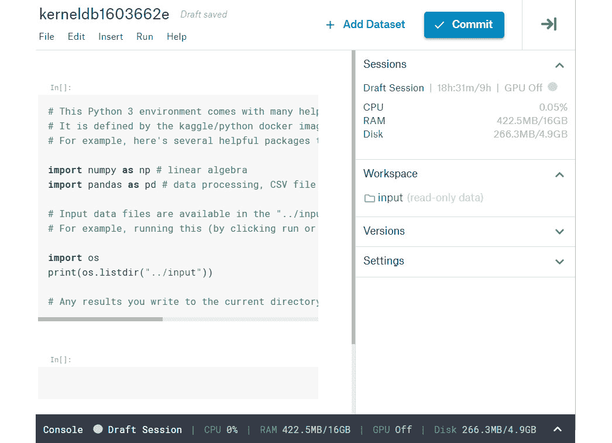

# 零、前言

## 关于

本节简要介绍作者、本书涵盖的内容、入门所需的技能，以及完成所有包含的活动和练习所需的硬件和软件要求。

## 关于这本书

*使用 Python 的数据科学*首先向您介绍数据科学，然后教您安装创建数据科学编码环境所需的软件包。你将学习机器学习中的三种主要技术:无监督学习、监督学习和强化学习。您还将探索基本的分类和回归技术，如支持向量机、决策树和逻辑回归。

在学习本章的过程中，您将学习用于轻松处理大型数据集的 Python 语言的基本函数、数据结构和语法。您将了解用于矩阵计算和数据操作的 NumPy 和 pandas 库，学习如何使用 Matplotlib 创建高度可定制的可视化，并应用 boosting 算法 XGBoost 进行预测。在最后几章中，你将探索卷积神经网络(CNN)，这是一种深度学习算法，用于预测图像中的内容。您还将了解如何将人类句子输入神经网络，使模型处理上下文信息，并创建人类语言处理系统来预测结果。

到本书结束时，你将能够理解和实现任何新的数据科学算法，并有信心用书中没有涉及的工具或库进行实验。

### 关于作者

**Rohan Chopra** 毕业于韦洛尔理工学院，获得计算机科学学士学位。Rohan 在设计、实施和优化端到端深度神经网络系统方面拥有超过 2 年的经验。他的研究围绕着使用深度学习来解决计算机视觉相关问题，并拥有在自动驾驶汽车上工作的实践经验。他是 Absolutdata 的数据科学家。

#### 致谢:

“这本书是我 Rohan Chopra 写的，Aaron England 和 Mohamed Noordeen Alaudeen 合著。非常感谢我的导师桑吉班·塞卡尔·罗伊对我的支持；此外，感谢 Packt 的所有团队。”

Aaron England 获得了犹他大学锻炼和运动科学博士学位，并获得了生物统计学的同源学位。目前，他居住在亚利桑那州的斯科茨代尔，在 Natural Partners Fullscript 担任数据科学家。

Mohamed Noordeen Alaudeen 是罗技公司的首席数据科学家。Noordeen 在构建和开发端到端大数据和深度神经网络系统方面拥有超过 7 年的经验。这一切都是从他决定一辈子从事数据科学开始的。

他是经验丰富的数据科学和大数据培训师，在 Imarticus Learning 和 Great Learning 工作，这两个机构都是印度著名的数据科学机构。除了教学之外，他还为开源做出了贡献。他在 GitHub 上有超过 90 个存储库，这些存储库开源了他的技术工作和数据科学材料。他在 Linkedin 上是一名活跃的影响者(拥有超过 22，000 个联系)，为数据科学社区提供帮助。

### 学习目标

*   预处理数据，使其可以用于机器学习
*   使用 Matplotlib 创建数据可视化
*   使用 scikit-learn 使用主成分分析(PCA)进行降维
*   解决分类和回归问题
*   使用 XGBoost 库获得预测
*   处理图像并创建机器学习模型来解码它们
*   为预测和分类处理人类语言
*   使用 TensorBoard 实时监控训练指标
*   使用 AutoML 为您的模型查找最佳超参数

### 观众

*使用 Python 的数据科学*专为希望使用 Python 和机器学习技术来分析数据和预测结果的数据分析师、数据科学家、数据库工程师和业务分析师而设计。Python 和数据分析的基础知识将帮助你理解本书中解释的各种概念。

### 接近

*使用 Python 的数据科学*采用实用的方法，为初学者和有经验的数据科学家提供掌握数据科学和机器学习技术所需的最基本的工具。它包含多种活动，使用真实的业务场景，让您在高度相关的环境中练习和应用新技能。

### 最低硬件要求

为了获得最佳的学生体验，我们建议采用以下硬件配置:

*   英特尔酷睿 i5 处理器或同等产品
*   4 GB 内存(8 GB 优先)
*   15 GB 可用硬盘空间
*   互联网连接

### 软件要求

您还需要预先安装以下软件:

*   操作系统:Windows 7 SP1 64 位、Windows 8.1 64 位或 Windows 10 64 位、Ubuntu Linux 或最新版本的 OS X
*   浏览器:谷歌 Chrome/Mozilla Firefox 最新版本
*   Notepad++/Sublime Text as IDE(可选，因为您可以在浏览器中使用 Jupyter Notebook 练习所有内容)
*   Python 3.4+(最新版本是 Python 3.7)安装(https://python.org)
*   蟒蛇(https://www.anaconda.com/distribution/)
*   转到(https://git-scm.com/

### 安装和设置

打开 Anaconda 提示符，按照以下步骤让您的系统为数据科学做好准备。我们将在 Anaconda 上创建一个新环境，在其中安装所有需要的库并运行我们的代码:

1.  要创建一个新的环境并安装所有的库，从 https://github . com/TrainingByPackt/Data-Science-with-Python/blob/master/environment . yml 下载环境文件并运行下面的命令:

    ```py
    conda env create -f environment.yml
    ```

2.  To activate the environment, run this command:

    ```py
    conda activate DataScience
    ```

    对于这本书，每当要求您打开终端时，您都需要打开 Anaconda 提示符，激活环境，然后继续。

3.  Jupyter Notebook allows us to run code and experiment in code blocks. To start Jupyter Notebook run the following inside the `DataScience` environment:

    ```py
    jupyter notebook
    ```

    将会打开一个新的浏览器窗口，带有 Jupyter 界面。然后，您可以导航到项目位置并运行 Jupyter 笔记本。

### 使用 Kaggle 进行更快的实验

Kaggle 内核平台提供对 GPU 的免费访问，这将机器学习的训练速度提高了大约 **10x** 。GPU 是专门的芯片，可以非常快速地执行矩阵计算，比 CPU 快得多。在本节中，我们将了解如何利用这项免费服务来更快地训练我们的模型:

1.  在浏览器中打开 https://www.kaggle.com/kernels 并登录。
2.  Click on the **New Kernel** button and select **Notebook** in the popup. The screen that is loaded, which is where you can run your code, looks like this:

    ###### 图 0.1:笔记本电脑屏幕

    左上角是笔记本的名称，您可以更改。

3.  点击**设置**，激活这台笔记本上的 GPU。要通过笔记本使用互联网，你必须用手机进行认证:

    ###### 图 0.2:设置屏幕

4.  要将 Jupyter 笔记本上传到 Kaggle，点击**文件**，然后点击**上传笔记本**。要为该笔记本加载数据集，请点击右上角的**添加数据集**按钮。从这里，您可以添加托管在 Kaggle 上的任何数据集或上传您自己的数据集。您可以从以下路径访问上传的数据集:

    ```py
    ../input/
    ```

5.  运行完代码后，要下载带有结果的笔记本，点击**文件**并选择**下载笔记本**。要将此笔记本及其结果保存在您的 Kaggle 帐户中，请点击右上角的**提交**按钮。

每当你觉得你的机器学习模型需要花费大量时间来训练时，你可以利用这个 Kaggle 环境。

这本书使用了来自 http://archive.ics.uci.edu/ml UCI 机器学习知识库的数据集。加州欧文:加州大学信息与计算机科学学院。

### 习俗

文本中的码字、数据库表名、文件夹名、文件名、文件扩展名、路径名、伪 URL、用户输入和 Twitter 句柄如下所示:“要读取 CSV 数据，可以通过将`filename.csv`作为参数传递来使用`read_csv()`函数。”

代码块设置如下:

```py
model.fit(x_train, y_train, validation_data = (x_test, y_test), 
epochs=10, batch_size=512)
```

新术语和重要单词用粗体显示。您在屏幕上看到的单词，例如，在菜单或对话框中，会出现在文本中，如下所示:“有些单元格要么有 **NA** ，要么就是空的。”

### 安装代码包

这本书的代码包托管在 https://github.com/TrainingByPackt/Data-Science-with-Python 的 GitHub 上。

我们在 https://github.com/PacktPublishing/也有丰富的书籍和视频目录中的其他代码包。看看他们！