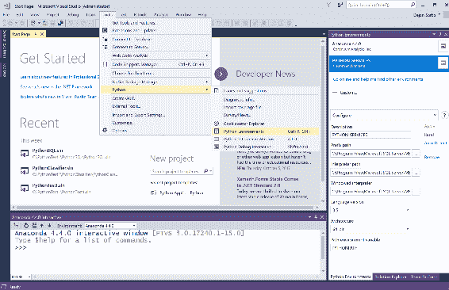
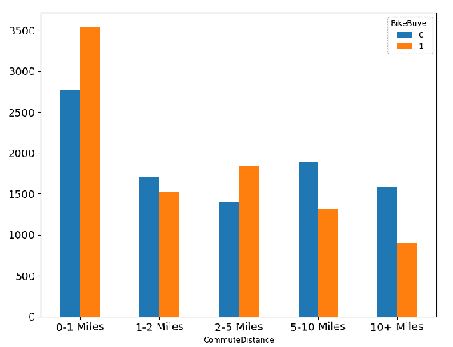
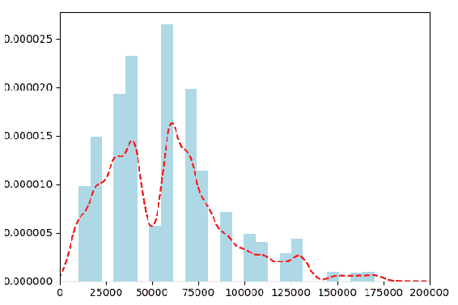
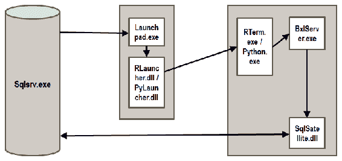

# 三、熟练掌握 Python

Python 是一种通用的高级解释语言。因为它是一种通用语言，所以它可能比 R 或 T-SQL 更受欢迎。Python 由吉多·范·罗苏姆创建，并于 1991 年首次发布。SQL Server 2016 开始支持 r。此外，SQL Server 2016 提供了支持其他语言所需的所有基础架构。因此，SQL Server 2017 很容易添加对 Python 的支持。将来，SQL Server 可能会支持更多的编程语言。我将在本章的后面解释 SQL Server 基础结构。无论如何，现在由您来选择数据科学项目的首选语言。

Python 背后最重要的思想之一是代码可读性。在 Python 中，空格是用来分隔代码块的，而不是特殊字符，缩进非常重要。作为一种解释型语言，Python 具有自动内存管理功能。为了简单起见，它有一个动态类型系统。Python 语法允许您使用您喜欢的编程范式— **过程式**、**面向对象式**或**函数式**编程。和 R 一样，所有主要的操作系统都有 Python 解释器。非营利的 Python 软件基金会管理着 Python 的参考实现 CPython。虽然可能没有 R 中的丰富，但是 Python 还有大量的附加库。然而，SQL Server 附带的 Python 安装中包含的标准库对于大多数数据科学项目来说通常足够强大。与 R 不同，我不会为我为这本书编写的演示代码安装任何额外的 Python 库。

本章将涵盖以下主题:

*   选择 Python 环境
*   从基本的 Python 开始
*   了解 Python 数据结构
*   机器学习服务与 SQL Server 的集成


# 选择 Python 环境

一旦你在[第一章](36745e86-bbf5-4300-9a36-86795b03485e.xhtml)、*用 T-SQL* 写查询、在[第二章](f7cccd93-a1d1-4e38-b9ef-91172d7f8eb6.xhtml)、*介绍 R* 安装了 ML 服务(数据库内)、Visual Studio 2017 用于数据科学和分析应用，你就需要创建合适的 VS 2017 Python 环境。VS 2017 安装 Anaconda Python，这是一个开源的 Python 发行版，不包括微软的库。您需要选择 SQL Server 附带的 Python 发行版，ML Services (In-database)。R 不需要这么一步，因为 VS 2017 也安装了微软 R 客户端。你应该还记得[第二章](f7cccd93-a1d1-4e38-b9ef-91172d7f8eb6.xhtml)，*介绍 R* ，微软 R Client 是微软发布的开放式 R 引擎，这个版本包含了微软可扩展库。

安装 VS 2017 后，默认的 Python 环境是 Anaconda。您需要添加额外的 Python 环境。这个新环境必须指向解释器的可伸缩版本。如果您在安装 SQL Server 时使用了默认值，则路径为`C:\Program Files\Microsoft SQL Server\MSSQL14.MSSQLSERVER\PYTHON_SERVICES\python.exe`。下面的屏幕截图显示了如何设置这个额外的 Python 环境:



设置额外的 Python 环境

您还可以考虑将这个环境标记为新 Python 项目的默认环境。你已经准备好了。启动一个新项目，并从`Python`文件夹中选择 Python 应用程序模板。您可以花些时间探索 Python 机器学习模板。对于 R，VS 2017 中没有特定的模板可用。对于 Python，除了其他通用编程模板，您还可以找到用于分类器、聚类和回归项目的模板。为了执行本书中的演示代码，请使用 Python 应用程序模板，在该模板中，您将获得一个空的 Python 脚本，其默认名称与项目名称相同，默认扩展名为`.py`。与 R 脚本一样，您可以使用这个 Python 脚本来编写和交互执行 Python 代码。


# 编写您的第一个 python 代码

让我从注释您的代码开始。在 Visual Studio 中，使用 *Ctrl* 和 *Enter* 键来执行光标所在的一行代码，或者执行标记的代码块。我将从`print()`命令开始打印一些字符串。单引号和双撇号都是字符串分隔符。下面是第一段 Python 代码:

```sql
# This is a comment
print("Hello World!")
# This line is ignored - it is a comment again
print('Another string.')
print('O"Brien') # In-line comment
print("O'Brien")
```

执行代码时，Python 交互式窗口会打开(如果尚未打开)，默认情况下，该窗口位于屏幕底部的脚本窗口下方。这也非常类似于 R，类似于 R 控制台窗口。

您可以在单个`print()`语句中组合多个字符串和表达式。对于表达式，Python 支持所有常规的数学和比较运算符，并像其他编程语言一样，根据数学和逻辑的规则来执行它们。以下代码显示了一些表达式:

```sql
3 + 2
print("The result of 5 + 30 / 6 is:", 5 + 30 / 6)
10 * 3 - 6
11 % 4
print("Is 8 less or equal to 5?", 8 <= 5)
print("Is 8 greater than 5?", 8 > 5)
```

这是结果。如果您自己执行代码，您可能会注意到 Python 在控制台窗口中重复每一行代码，然后才显示这一行的结果。我删除了带有代码的行，以获得更易读的结果:

```sql
5
The result of 5 + 30 / 6 is: 10.0
24
3
Is 8 less or equal to 5? False
Is 8 greater than 5? True
```

Python 是区分大小写的，就像 r 一样。对于变量名也是如此。您可以看到如何给变量赋值，然后在下面的代码中使用这些变量。请注意，在 Python 中，您使用了一个赋值运算符，即等号(`=`)运算符:

```sql
# Integer
a = 3
b = 4
a ** b
# Float
c = 6.0
d = float(7)
print(c, d)
```

如您所见，双引号和单引号都用作字符串分隔符。你可以在双引号字符串中使用单引号，反之亦然，正如我已经展示的，写 O'Brien。当您在`print()`语句中格式化一个字符串时，您可以使用`%?`操作符来包含变量。此语法中的问号是一个通配符，用来代替表示变量数据类型的单个字母。使用`s`表示字符串，使用`d`表示数字。你可以用字符串数据类型的`str.format()`方法替换字符串中的变量。以下是一些例子:

```sql
# Variables in print()
e = "repeat"
f = 5
print("Let's %s string formatting %d times." % (e, f))
# String.format()
four_par = "String {} {} {} {}"
print(four_par.format(1, 2, 3, 4))
print(four_par.format('a', 'b', 'c', 'd'))
```

前面代码的结果如下:

```sql
Let's repeat string formatting 5 times.
String 1 2 3 4
String a b c d
```

一个字符串可以跨多行。你需要用一对三个双引号把这么长的字符串括起来。如果您想在字符串中使用特殊字符，如制表符和换行符，您需要用一个反斜杠字符对它们进行转义，然后使用一个特定的字母。你用字母`t`表示制表符，用`n`表示换行符。您可以在以下代码中看到一些示例:

```sql
print("""Three double quotes
are needed to delimit strings in multiple lines.
You can have as many lines as you wish.""")
a = "I am 5'11\" tall"
b = 'I am 5\'11" tall'
print("\t" + a + "\n\t" + b)
```

结果如下:

```sql
Three double quotes
are needed to delimit strings in multiple lines.
You can have as many lines as you wish.
  I am 5'11" tall
  I am 5'11" tall
```

在 Python 中，帮助总是唾手可得，只需使用`help()`命令。

你可以创建你的代码模块。Python 模块是一个包含 Python 代码的文本文件，使用。默认为 py 扩展名。您可以使用`import`命令将一个模块导入到您当前的脚本中。导入模块后，该模块中定义的函数和变量就可以在脚本中使用了。模块是重用代码的好方法。


# 使用函数、分支和循环

您可以将代码封装在函数中。`def name():`命令定义了一个函数名，并且是函数定义中的第一个代码。函数包含零个或多个参数，并且可以返回值。以下是两个函数的示例。第一个没有参数。第二个有两个参数并返回值。函数体没有特殊的结束标记——如你所知，正确的缩进很重要。缩进告诉 Python 解释器一个函数体在哪里结束，下一个命令在哪里开始:

```sql
def nopar():
    print("No parameters")
def add(a, b):
    return a + b
```

当您调用函数时，您可以将参数作为文字传递，或者通过变量传递。您甚至可以在将参数传递给函数时对它们进行一些操作。以下代码显示了这些可能性:

```sql
# Call without arguments
nopar()
# Call with variables and math
a = 10
b = 20
add(a / 5, b / 4)
```

结果如下:

```sql
No parameters
7.0
```

在 Python 中,`if..elif..else:`语句用于对代码流进行分支。下面是一个不太基本的分支示例:

```sql
a = 10
b = 20
c = 30
if a > b:
    print("a > b")
elif a > c:
    print("a > c")
elif (b < c):
    print("b < c")
    if a < c:
        print("a < c")
    if b in range(10, 30):
        print("b is between a and c")
else:
    print("a is less than b and less than c")
```

这里显示了分支代码的结果。您能在不执行代码或不查看结果的情况下确定输出吗？看一看以下内容:

```sql
b < c
a < c
b is between a and c
```

在下一节之前，我将介绍 Python 中最简单的数据结构`list`，在下一节中，您将了解数据帧和其他结构。我需要它来告诉你如何创建循环。

Python 列表是一组方括号内的逗号分隔值(或项目)。您可以使用`for each`循环来遍历一个列表。列表支持多种方法。例如，您可以使用`list.append()`方法将一个元素添加到列表中。您还可以使用基本的`for`循环来迭代特定次数的代码。下面的代码显示了如何创建列表。然后显示`for element in list`回路(每个)和`for`回路。最后是`while`循环:

```sql
animals = ["bee", "whale", "cow"]
nums = []
for animal in animals:
    print("Animal: ", animal)
for i in range(2, 5):
    nums.append(i)
print(nums)
i = 1
while i <= 3:
    print(i)
    i = i + 1
```

结果如下:

```sql
Animal: bee
Animal: whale
Animal: cow
[2, 3, 4]
1
2
3
```

另一个基本的数据结构是`dictionary`。这是一组**键**–**值**对。下面是一本字典的例子:

```sql
CtyCou = {
    "Paris": "France",
    "Tokyo": "Japan",
    "Lagos": "Nigeria"}
for city, country in CtyCou.items():
    print("{0} is in {1}.".format(city, country))
```

结果如下:

```sql
Lagos is in Nigeria.
Paris is in France.
Tokyo is in Japan.
```

我提到过在 Python 中你也可以使用面向对象的范例。然而，深入研究 Python 的面向对象编程超出了本书的范围，正如您所知，本书侧重于使用 SQL Server 和相关工具的数据科学。


# 组织数据

在本节开始时，我想向您展示 Python 的一些分析和图形功能。我在这里只是简单地解释一下代码；你将很快学到更多关于 Python 数据结构的知识。开始编码吧！首先，我需要导入必要的库:

```sql
import numpy as np
import pandas as pd
import pyodbc
import matplotlib.pyplot as plt
```

对于我将要分析的数据，我使用来自`AdventureWorksDW2017`演示数据库的数据，从`dbo.vTargetMail`视图中选择，就像我在[第 2 章](f7cccd93-a1d1-4e38-b9ef-91172d7f8eb6.xhtml)、*介绍* R 中介绍 R 语言时所做的那样。我还使用 ODBC 连接到 SQL Server，使用与当时相同的数据源名称和 SQL Server 登录名:

```sql
con = pyodbc.connect('DSN=AWDW;UID=RUser;PWD=Pa$$w0rd')
query = """SELECT CustomerKey, 
             Age, YearlyIncome, 
             CommuteDistance, BikeBuyer
           FROM dbo.vTargetMail;"""
TM = pd.read_sql(query, con)
```

您可以使用下面的代码快速获取数据信息，该代码显示了前五行以及行数和列数:

```sql
TM.head(5)
TM.shape
```

现在我需要将`CommuteDistance`定义为一个具有内部顺序的离散或分类变量:

```sql
TM['CommuteDistance'] = TM['CommuteDistance'].astype('category')
TM['CommuteDistance'].cat.reorder_categories(
 ["0-1 Miles", 
 "1-2 Miles","2-5 Miles", 
 "5-10 Miles", "10+ Miles"], inplace=True)
```

下一步是用`BikeBuyer`变量交叉制表`CommuteDistance`变量:

```sql
cdbb = pd.crosstab(TM.CommuteDistance, TM.BikeBuyer)
cdbb
```

第一个有用的结果是两个交叉列表变量的`pivot`表:

```sql
BikeBuyer           0    1
CommuteDistance 
0-1 Miles        2772 3538
1-2 Miles        1703 1529
2-5 Miles        1395 1839
5-10 Miles       1896 1318
10+ Miles        1586  908
```

图表比`pivot`表格可读性强得多。让我画一张图表:

```sql
cdbb.plot(kind = 'bar',
          fontsize = 14, legend = True, 
          use_index = True, rot = 1)
plt.show()
```

你可以在下面的截图中看到我制作的图表:



交叉列表中的图表

让我们深入了解我使用的代码的细节。我导入了`NumPy`库，是`Numerical Python`的简称；图书馆的名字是`numpy`。该库提供了使用高效存储的阵列。它们的工作速度比基本的列表和字典快得多。numpy 数组必须有单一数据类型的元素，就像 R 数组一样。我导入了别名为`np`的`numpy`包。现在我将检查库的版本，然后从两个列表中创建两个一维数组，一个具有隐式元素数据类型 integer，另一个具有显式 float 数据类型:

```sql
np.__version__
np.array([1, 2, 3, 4])
np.array([1, 2, 3, 4], dtype = "float32")
```

结果如下:

```sql
'1.12.1'
array([1, 2, 3, 4])
array([ 1., 2., 3., 4.], dtype=float32)
```

数组可以是多维的。我将创建三个新数组，每个数组有三行五列。我将用 0 填充第一个，用 1 填充第二个，用数字 pi 填充第三个。我使用 numpy 函数来完成这些任务:

```sql
np.zeros((3, 5), dtype = int)
np.ones((3, 5), dtype = int)
np.full((3, 5), 3.14)
```

这里我只展示最后一个数组:

```sql
array([[ 3.14,  3.14,  3.14,  3.14,  3.14],
       [ 3.14,  3.14,  3.14,  3.14,  3.14],
       [ 3.14,  3.14,  3.14,  3.14,  3.14]])
```

numpy 库包括更多的函数来帮助您填充数组。`arange()`函数创建一个序列。数组中不包括上限；该范围是一个左边封闭，右边开放的区间。使用`random.random()`函数生成均匀分布的数字。`random.normal()`函数生成具有特定平均值和标准偏差的正态(高斯)分布的数字。`random.randint()`函数生成均匀分布的整数。以下是一些例子:

```sql
np.arange(0, 20, 2)
np.random.random((1, 10))
np.random.normal(0, 1, (1, 10))
np.random.randint(0, 10, (3, 3))
```

这里显示了生成的数组。请注意，除了第一个数组之外，您应该得到与我不同的数字，因为如前所述，它们是随机数:

```sql
array([ 0, 2, 4, 6, 8, 10, 12, 14, 16, 18])
array([[ 0.9259839 , 0.14149764, 0.40489916, 0.29531834, 0.91569126,
         0.93224104, 0.91185772, 0.11457454, 0.51763041, 0.95998268]])
array([[ 0.64050407, 0.13393019, 0.03176633, -0.42997222, -0.29441129,
         0.06254568, 0.73507341, -0.68556645, -1.07465048, 0.61561997]])
array([[3, 6, 3],
       [0, 6, 2],
       [1, 7, 8]])
```

`numpy`库还包括对标量值进行操作的基本函数和操作符的**矢量化**版本。矢量化方法将向量和矩阵作为一个整体来操作。这比遍历数组并使用基本操作符逐个元素地操作要快得多。下面是一个 numpy 矢量化函数的示例:

```sql
x = np.arange(0, 9).reshape((3, 3))
x
np.sin(x)
```

结果如下:

```sql
array([[0, 1, 2],
       [3, 4, 5],
       [6, 7, 8]])
array([[ 0\.        ,  0.84147098,  0.90929743],
       [ 0.14112001, -0.7568025 , -0.95892427],
       [-0.2794155 ,  0.6569866 ,  0.98935825]])
```

您也可以使用 numpy 聚合函数。对于数据科学项目，理解数据至关重要。你需要对你的数据做一个概述。描述性统计对于这项任务来说非常方便。Numpy 包括常规聚合函数和统计函数。下面是一个数组示例:

```sql
x = np.arange(1,6)
x
```

该数组的内容如下:

```sql
array([1, 2, 3, 4, 5])
```

我使用 numpy 函数来计算元素的和与积、最小值和最大值、平均值和标准偏差:

```sql
np.sum(x), np.prod(x)
np.min(x), np.max(x)
np.mean(x), np.std(x)
```

结果如下:

```sql
(15, 120)
(1, 5)
(3.0, 1.4142135623730951)
```

您还可以计算累计，例如累计总数:

```sql
np.add.accumulate(x)
```

运行总结果如下:

```sql
array([ 1,  3,  6, 10, 15], dtype=int32)
```

numpy 包的可能性还没有穷尽。然而，我正在切换到下一个重要的库，即`Pandas`库。

`pandas`库建立在 numpy 库的基础上——它使用 numpy 数组和函数。要进口熊猫，需要先进口 numpy。熊猫图书馆带来了用于数据科学数据集的数据结构。第一个重要的是熊猫**系列**对象。这是一个一维数组，类似于 numpy 数组，但功能更强大。除了隐式位置索引之外，还可以定义显式命名的索引。然后，您可以引用该名称来检索数据。熊猫系列对象类似于关系模型中的元组。以下示例代码创建了一个简单的 pandas `Series`，没有显式索引，因此您只能通过位置索引来引用元素:

```sql
ser1 = pd.Series([1, 2, 3, 4])
ser1[1:3]
```

这是结果。请注意，结果可能会有点混乱。不包括上限，索引从零开始。因此，位置 1:3 指的是第二和第三元素；不包括位置为 0 的第一个元素，位置为 3 的第四个元素也不在结果中:

```sql
1    2
2    3
```

使用显式索引更容易理解，如下面的代码所示:

```sql
ser1 = pd.Series([1, 2, 3, 4],
                 index = ['a', 'b', 'c', 'd'])
ser1['b':'c']
```

正如您在最后一个示例中看到的，您可以使用索引的名称来引用元素，这些名称充当 SQL Server 行中的列名。请注意，范围的上限，即名为`c`的索引位置，在结果中包含了一个显式命名的索引:

```sql
b    2
c    3
```

pandas **DataFrame** 对象就像一个多重序列，每个序列都有相同数量的元素，像表格中的列一样排列。Pandas 数据帧与 R 数据帧非常相似。您使用 pandas 数据框进行分析。当您从关系源(如 SQL Server)读取数据时，您将它存储在数据框中。您可以将数据框导出到表格目的地，如关系数据库。当我在本节开始时读取 SQL Server 数据时，我读取的是 Python 数据框中的表格数据。与 SQL Server 表相比，其主要区别在于数据框是一个矩阵，这意味着您仍然可以通过位置来引用数据，并且数据的顺序是有意义的并且得到保留。

熊猫数据框有许多方法。在本节的开始，当我使用`plot()`方法创建一个条形图时，您已经看到了它的图形功能。此外，您可以使用数据框的描述性统计函数进行数据概览。下一个示例演示了在整个数据框上使用`describe()`函数来计算每一列的基本描述性统计数据。然后，我计算平均值、标准差、偏度和峰度，即前四个总体矩，并使用特定函数进行计算:

```sql
TM.describe()
TM['YearlyIncome'].mean(), TM['YearlyIncome'].std()
TM['YearlyIncome'].skew(), TM['YearlyIncome'].kurt()
```

让我用另一张图来结束这一部分。以下代码显示了 YearlyIncome 变量在直方图的 25 个箱中的分布，并带有一个核密度图:

```sql
(TM['YearlyIncome']).hist(bins = 25, normed = True, 
                          color = 'lightblue')
(TM['YearlyIncome']).plot(kind='kde', 
                          style='r--', xlim = [0, 200000])
plt.show()
```

请看下图:



图 3.3:直方图和内核密度图

在结束本章之前，让我解释一下 R 和 Python 语言支持是如何集成到 SQL Server 中的。


# 集成 SQL Server 和 ML

当然，您已经知道可以从 T-SQL 代码中执行 R 和 Python 代码。借助 SQL Server 2016 和 2017，您可以获得高度可扩展的 ML 引擎。正如我在第 1 章*使用 T-SQL* 编写查询中所解释的，您可以通过选择 ML 服务(在数据库中)来安装这个引擎。借助微软库，您可以获得许多利用这种可扩展引擎的并行化功能。您可以将这些函数用于大型数据集。您可以将使用 R 或 Python 创建的机器学习模型存储在 SQL Server 表的二进制列中。您使用存储的模型对新数据进行预测。如果您将 R 或 Python 图形保存到二进制列，您可以在**SQL Server Reporting Services**(**SSRS**)报告中使用它。除了 SQL Server，其他微软产品和服务支持 Python 和 R Power BI Desktop，Power BI Service，以及 Azure Machine Learning，或 Azure ML，支持这两种语言。

您可以获得两个版本的 Microsoft ML:

*   **ML Services (In-database)** :这是与 SQL Server 集成的引擎，我在[第一章](36745e86-bbf5-4300-9a36-86795b03485e.xhtml)、*用 T-SQL 编写查询*中解释了如何安装。它添加了另一个在 SQL Server 数据库引擎之外运行的服务，并提供了数据库引擎和 ML 引擎之间的通信。
*   微软 ML 服务器:这是一个独立的 ML 服务器。如果不需要 SQL Server，可以获取这个。它包括相同的开放和可扩展的包，并且可以在多种平台上运行。

SQL Server ML 服务附带的最重要的 Microsoft 包如下:

*   **RevoScaleR(对于 R)和 Revoscalepy(对于 Python)** :一个并行化的可伸缩函数库，可以用于数据处理、数据概述和数据科学模型。这个包中的过程不需要立即将所有数据加载到内存中。他们知道如何一次处理大量数据。这样，他们可以消耗非常大的数据集。
*   **MicrosoftML(用于 R)和 MicrosoftML(用于 Python)** :这是一个更新的包，带来了许多额外的可扩展机器学习算法。

SQL Server 引擎和 ML 引擎之间的通信过程如下图所示:



SQL Server 和 ML 服务(数据库内)

以下是组件及其在通信中的角色的简要描述:

*   首先，在 SQL Server 中使用`sys.sp_execute_external_script`系统存储过程运行 R 或 Python 脚本。
*   SQL Server 将请求发送给`Launchpad`服务。该服务是在 SQL Server 2016 中引入的。它支持外部脚本的执行。
*   Launchpad 服务启动适合您的脚本语言的启动器，可以是`RLauncher.dll`或`PyLauncher.dll`。该基础结构准备在需要时启用其他编程语言。
*   RLauncher 或 PyLauncher 启动用于执行 R 脚本的 R 终端应用程序`RTerm.exe`，或 Python 终端应用程序`Python.exe`。
*   两种语言中任意一种语言的终端应用程序将脚本发送到 **BxlServer** 或**二进制交换语言服务器**。它管理数据库和机器学习引擎之间的通信。
*   BxlServer 使用 SQL Satellite，这是一种用于在 SQL Server 和外部运行时之间快速传输数据的 API。

在结束本章之前，我想向您展示如何在 SQL Server 中执行 Python 和 R 代码。现在你需要切换到**SQL Server Management Studio**(**SSMS**)。首先，您需要配置您的 SQL Server 以允许外部脚本:

```sql
-- Configure SQL Server to allow external scripts
USE master;
EXEC sys.sp_configure 'show advanced options', 1;
RECONFIGURE WITH OVERRIDE;
EXECsys.sp_configure'external scripts enabled', 1;
RECONFIGURE WITH OVERRIDE;
GO
-- Restart SQL Server
-- Check the configuration
EXEC sys.sp_configure;
GO
```

您可以立即检查是否可以使用`sys.sp_execute_external_script`过程运行 Python 代码。下面的代码返回一个 1 x 1 的表格，在单个单元格中有一个值`1`:

```sql
-- Check whether Python code can run
EXECUTE sys.sp_execute_external_script
@language =N'Python',
@script=N'
OutputDataSet = InputDataSet
```

```sql
print("Input data is: \n", InputDataSet)
',
@input_data_1 = N'SELECT 1 as col';
GO
```

最后，让我也在 SQL Server 内部执行一些 R 代码。使用下面的代码，我正在检查已安装的 R 包:

```sql
-- Check the installed R packages
EXECUTE sys.sp_execute_external_script
 @language=N'R'
,@script =
 N'str(OutputDataSet)
   packagematrix <- installed.packages()
   NameOnly <- packagematrix[,1]
   OutputDataSet <- as.data.frame(NameOnly)'
,@input_data_1 = N'SELECT 1 AS col'
WITH RESULT SETS (( PackageName nvarchar(250) ));
GO
```

如果您执行前面的代码，请检查您是否得到了本节中提到的 R 可伸缩库。


# 摘要

在学习了 T-SQL 和 R 的基础知识之后，您也对 Python 语言有了一个大致的了解。当执行数据科学任务时，Python 与 R 非常相似。您使用与 r 中相同的数据框对象来存储要分析的数据。您还看到了 SQL Server 和 ML services 之间的集成是如何工作的。现在真正的工作可以开始了。在接下来的两章中，您将了解如何理解您的数据，以及如何为更高级的分析做准备。