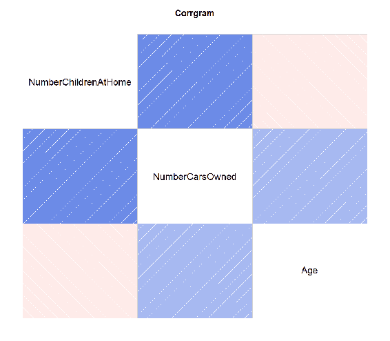
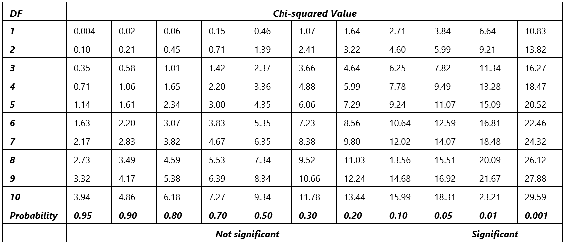
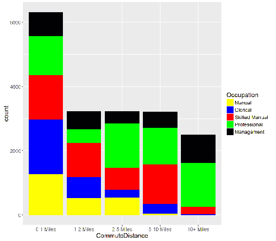
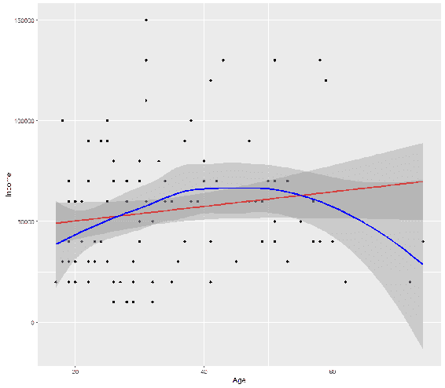

# 六、进阶统计学和图表

在[第四章](718600a3-329b-42f5-9653-d00f664c375f.xhtml)、*数据概述*中，我们分析了单个变量。我们以图解的方式展示了变量对之间可能的联系，从而结束了这一章。在这一章中，我将简要解释背后的统计数据，然后开发代码来测量两个变量之间可能的关联。我还将包括更多的图形示例。

统计学中一个非常重要的概念是**零假设**。这是你开始分析的地方；你假设两个变量之间没有联系。一个问题的例子可能是*上班的通勤距离与职业相关吗？*这里的零假设是*通勤距离和职业之间没有关联*。通过统计分析，你试图证明或者拒绝无效假设。但是，你永远不可能对结果有 100%的把握；因此，你以某种概率证明或拒绝零假设。

在本章中，我们将讨论以下主题:

*   探索连续变量之间的关联
*   测量离散变量之间的相关性
*   发现连续变量和离散变量之间的关联
*   用线性回归公式表示相关性


# 探索连续变量之间的关联

对于单个连续变量，我引入了几个衡量价差的指标。衡量价差的一个基本指标是方差。如果有两个连续变量，每个变量都有自己的方差。然而，你可以问问自己，这两个变量是否一起变化。例如，如果某个案例的第一个变量的值非常高，远远高于第一个变量的平均值，则同一案例的第二个变量的值也可能高于其自身的平均值。这将是一个积极的联系。如果第二个变量的值比第一个变量的值高，而第二个变量的值比第一个变量的值低，那么你就会有一个负关联。如果两个变量的均值正负偏差之间没有联系，那么您可以接受零假设—这两个变量之间没有关联。**协方差**的公式如下，这是我在本章中介绍的关联的第一个度量:


在公式中，*【μ(X)*代表变量 *X* 的均值， *μ(Y)* 代表变量 Y 的均值，从公式中可以看出，在很多情况下，当两个变量的偏差为正或负时，协方差为正，呈现正相关关系；当一个变量的偏差大部分为负，而另一个变量的偏差为正时，协方差为负，显示负关联。如果两个变量的偏差没有模式，如果两个变量的偏差随机为正或负，那么协方差接近于零，表明在分析中两个变量之间没有关联。

如果您还记得第 4 章、*数据概述*中的内容，那么一个变量的绝对测量值并不适合用于比较两个变量之间的差异。我引入了一个相对量度，变异系数。可以将协方差除以两个变量的标准差的乘积，得到**相关系数**，如下式所示:


相关性可以取-1 和 1 之间的任何值。高负值意味着负关联；高正值意味着正关联，当值在零附近时，意味着所分析的变量对之间没有关联。问题是，当你可以说这两个变量相关时，分界点在哪里。高于 0.40 甚至 0.50 的绝对值是相当安全的选择。更安全的做法是将这个定义了**决定系数**的值平方，以减少小值并获得更安全的切割点。决定系数的公式如下:


当这个系数的绝对值大于 0.20 时，您可以安全地拒绝零假设，并解释这两个变量是相关的。

现在是时候来计算我介绍的三个措施了。下面的 T-SQL 查询检查拥有的汽车数量是否与收入相关。注意，这次我使用的是连续变量`NumberCarsOwned`。只有五个介于 0 和 4 之间的不同整数值，您可以自己决定如何使用它——作为离散序数还是连续序数:

```sql
USE AdventureWorksDW2017;
GO
WITH CoVarCTE AS
(
SELECT 1.0*NumberCarsOwned as val1,
 AVG(1.0*NumberCarsOwned) OVER () AS mean1,
 1.0*YearlyIncome AS val2,
 AVG(1.0*YearlyIncome) OVER() AS mean2
FROM dbo.vTargetMail
)
SELECT
 SUM((val1-mean1)*(val2-mean2)) / COUNT(*) AS Covar,
 (SUM((val1-mean1)*(val2-mean2)) / COUNT(*)) /
 (STDEVP(val1) * STDEVP(val2)) AS Correl,
 SQUARE((SUM((val1-mean1)*(val2-mean2)) / COUNT(*)) /
 (STDEVP(val1) * STDEVP(val2))) AS CD
FROM CoVarCTE;
GO
```

结果如下:

```sql
Covar        Correl            CD
------------ ----------------- -----------------
17150.222413 0.466647174389393 0.217759585365604
```

正如你可能预料的那样，这两个变量之间存在正相关。

在 R 中，我将测试相当多的变量的相关性。让我从阅读数据开始:

```sql
library(RODBC)
con <- odbcConnect("AWDW", uid = "RUser", pwd = "Pa$$w0rd")
TM <-
sqlQuery(con,
 "SELECT CustomerKey, CommuteDistance,
 TotalChildren, NumberChildrenAtHome, 
 Gender, HouseOwnerFlag,
 NumberCarsOwned, MaritalStatus,
 Age, BikeBuyer, Region,
 YearlyIncome AS Income,
 EnglishEducation AS Education,
 EnglishOccupation AS Occupation
 FROM dbo.vTargetMail")
close(con)
```

接下来，我将检查协方差以及收入和年龄之间的相关性。我正在使用基本 R 安装中的`cov()`和`cor()`函数:

```sql
x <- TM[, c("Income", "Age")]
cov(x)
cor(x)
```

结果如下:

```sql
       Income       Age
Income 1.042376e+09 53669.9443
Age    5.366994e+04 132.6713
       Income Age
Income 1.0000000 0.1443214
Age    0.1443214 1.0000000
```

你可以看到结果以矩阵的形式出现。如果一个变量与自身相关，那么相关系数通常为 1。您可以从结果中的下方矩阵的右上角或左下角读取这两个变量的实际相关系数。系数小于 0.15。这是一个相当小的值。你可能期望更高的相关性，即老年人比年轻人挣得多。这是怎么回事？敬请期待；我将在本章的最后一节解释年龄和收入之间的实际联系。

我可以计算两个变量向量之间的相关性，如下所示:

```sql
y <- TM[, c("NumberCarsOwned", "NumberChildrenAtHome")]
cor(y, x)
```

这是相关系数的完整矩阵:

```sql
                     Income    Age
NumberCarsOwned      0.4666472 0.18380481
NumberChildrenAtHome 0.4521331 -0.01007598
```

你可以说，拥有汽车的数量和家里孩子的数量都与收入正相关，而与年龄的相关性并不那么明显。尤其是家里孩子的数量，你可以放心的说，在这个数据集中和年龄没有关联。

您可以很好地可视化与来自`corrgram`包的`corrgram()`函数的相关性。仅当您之前没有安装该软件包时才安装它:

```sql
z <- TM[, c("NumberCarsOwned", "NumberChildrenAtHome", "Age")]
# install.packages("corrgram")
library(corrgram)
corrgram(z, order = TRUE, lower.panel = panel.shade,
 upper.panel = panel.shade, text.panel = panel.txt,
 cor.method = "pearson", main = "Corrgram")
```

您可以在下图中看到结果:



图 6.1:图表显示的相关性

蓝色表示积极的联想，红色表示消极的联想。颜色越深，关联度越高。

让我也用 Python 来计算同样的系数。首先，我必须导入本章所需的库并读取数据:

```sql
# Imports
import numpy as np
import pandas as pd
import pyodbc
import matplotlib as mpl
import matplotlib.pyplot as plt
import seaborn as sns
# Reading the data from SQL Server
con = pyodbc.connect('DSN=AWDW;UID=RUser;PWD=Pa$$w0rd')
query = """SELECT CustomerKey, CommuteDistance,
 TotalChildren, NumberChildrenAtHome, 
 Gender, HouseOwnerFlag,
 NumberCarsOwned, MaritalStatus,
 Age, BikeBuyer, Region,
 YearlyIncome AS Income,
 EnglishEducation AS Education,
 EnglishOccupation AS Occupation
 FROM dbo.vTargetMail"""
TM = pd.read_sql(query, con)
```

现在，我可以使用`numpy`库中的`cov()`函数和`corrcoef()`函数:

```sql
np.cov(TM.Age, TM.Income)
np.corrcoef(TM.Age, TM.Income)
```

结果如下:

```sql
array([[ 1.32671264e+02, 5.36699443e+04],
 [ 5.36699443e+04, 1.04237557e+09]])
array([[ 1\. , 0.14432135],
 [ 0.14432135, 1\. ]])
```

同样，您可以在二维数组或矩阵中看到结果。以下代码显示了如何选择单个值:

```sql
np.cov(TM.Age, TM.Income)[0][1]
np.corrcoef(TM.Age, TM.Income)[0][1]
```

我在本节中介绍的三个度量对离散变量没有用。因此，我需要讨论不同的。


# 测量离散变量之间的相关性

您可以对两个离散变量进行透视或交叉制表。您测量两个变量的每对数值组合的计数或绝对频率。您可以将表中的**实际值**与**预期值**进行比较。那么，期望值是什么呢？您再次从零假设开始——您正在检查的两个变量之间没有关联。对于零假设，您会期望一个变量在另一个变量的每个类中的分布是相同的，并且与数据集中的总体分布相同。例如，如果数据集中有一半已婚、一半单身的人，那么每个教育级别都会有这样的分布。显示实际和预期频率的表格被称为**列联表**。

列联表只显示直观的依赖关系。两个离散变量关联的数值度量是**卡方**值。通过计算实际频率与预期频率的偏差的平方来计算该值，然后用该值除以预期频率。公式如下:


您还需要使用以下公式计算自由度:


列联表的自由度就是列和行的自由度的乘积。现在你有两个数字，卡方和自由度。如何解读它们？对于特定的自由度，您可以使用带有预先计算的**卡方临界点**值的表格。下面的截图显示了这样一个表:



图 6.2:卡方临界点

概率行告诉您卡方值大于或等于两个随机变量特定自由度临界点的概率。例如，如果您有六个自由度，并且卡方大于或等于 12.59，那么观察频率和预期频率之间的差异是随机的可能性不到 5%。你可以以 95%或更高的概率拒绝零假设。通常，当接受零假设的概率小于百分之五时，你说这种关联是显著的。如今，你不再需要阅读表格；你可以在网上找到很多免费的卡方计算器，比如这个:[https://www.mathsisfun.com/data/chi-square-calculator.html](https://www.mathsisfun.com/data/chi-square-calculator.html)。

我不是想为任何特定的网站做广告；我只是用了我找到的第一个有用的链接。

下面的 T-SQL 代码测试职业和性别之间的关联:

```sql
WITH
ObservedCombination_CTE AS
(
SELECT EnglishOccupation AS OnRows,
 Gender AS OnCols, 
 COUNT(*) AS ObservedCombination
FROM dbo.vTargetMail
GROUP BY EnglishOccupation, Gender
),
ExpectedCombination_CTE AS
(
SELECT OnRows, OnCols, ObservedCombination
 ,SUM(ObservedCombination) OVER (PARTITION BY OnRows) AS ObservedOnRows
 ,SUM(ObservedCombination) OVER (PARTITION BY OnCols) AS ObservedOnCols
 ,SUM(ObservedCombination) OVER () AS ObservedTotal
 ,CAST(ROUND(SUM(1.0 * ObservedCombination) OVER (PARTITION BY OnRows)
 * SUM(1.0 * ObservedCombination) OVER (PARTITION BY OnCols) 
 / SUM(1.0 * ObservedCombination) OVER (), 0) AS INT) AS ExpectedCombination
FROM ObservedCombination_CTE
)
SELECT SUM(SQUARE(ObservedCombination - ExpectedCombination)
 / ExpectedCombination) AS ChiSquared,
 (COUNT(DISTINCT OnRows) - 1) * (COUNT(DISTINCT OnCols) - 1) AS DegreesOfFreedom
FROM ExpectedCombination_CTE
```

结果如下:

```sql
ChiSquared       DegreesOfFreedom
---------------- ----------------
8.73118071755612 4
```

你可以从上图的表格中看出这种联系并不显著，尽管这种不显著性并不能真正令人信服。

在展示 R 中的例子之前，我在问自己职业是否真的是一个分类变量，或者我是否可以定义一些内在的顺序。顺序对卡方计算没有任何影响，但将来可能会有所帮助。我可以根据其他变量来定义顺序，比如收入。让我来检验这两个变量在职业类别中的意义:

```sql
SELECT EnglishOccupation,
 AVG(YearlyIncome) AS Income
 FROM dbo.vTargetMail
 GROUP BY EnglishOccupation
 ORDER BY Income;
```

以下是查询的结果:

```sql
EnglishOccupation Income
----------------- ----------
Manual            16451.3422
Clerical          30710.3825
Skilled Manual    51715.0972
Professional      74184.7826
Management        92325.2032
```

你可以看到不同职业之间的收入差距很大。因此，将职业定义为序数变量可能是有意义的。让我在 R 中这样做，同时定义通勤距离的正确顺序:

```sql
# Order CommuteDistance
TM$CommuteDistance = factor(TM$CommuteDistance, order = TRUE,
 levels = c("0-1 Miles",
 "1-2 Miles", "2-5 Miles",
 "5-10 Miles", "10+ Miles"))
# Let's order the Occupation according to the Income
TM$Occupation = factor(TM$Occupation, order = TRUE,
 levels = c("Manual", 
 "Clerical","Skilled Manual", 
 "Professional", "Management"))
```

现在，让我交叉列出这两个变量:

```sql
xtabs(~TM$Occupation + TM$CommuteDistance)
```

结果如下:

```sql
                TM$CommuteDistance
TM$Occupation  0-1 Miles 1-2 Miles 2-5 Miles 5-10 Miles 10+ Miles
Manual         1271       529       541        43          0
Clerical       1706       656       239       300         27
Skilled Manual 1373      1053       695      1226        230
Professional   1217       425      1373      1142       1363
Management      743       569       386       503        874
```

你可能会注意到，职业级别越高，通勤距离就越长。因此，看起来这两个变量是相关联的。让我们计算这两者的卡方，以及职业和性别:

```sql
# Storing tables in objects
tEduGen <- xtabs(~TM$Education + TM$Gender)
tOccCdi <- xtabs(~TM$Occupation + TM$CommuteDistance)
# Test of independece
chisq.test(tEduGen)
chisq.test(tOccCdi)
```

结果如下:

```sql
data: tEduGen
X-squared = 5.8402, df = 4, p-value = 0.2114
data: tOccCdi
X-squared = 4587.7, df = 16, p-value < 2.2e-16
```

正如你可能从交叉列表中所料，通勤距离与职业有关。让我也用图表展示一下。这一次，我将使用来自`ggplot2`包的`ggplot()`函数，这可能是 R:

```sql
# install.packages("ggplot2")
library(ggplot2)
ggplot(TM, aes(x = CommuteDistance, fill = Occupation)) +
 geom_bar(stat = "count") +
 scale_fill_manual(values = c("yellow", "blue", "red", "green", "black")) +
 theme(text = element_text(size = 15));
```

关于功能参数的详细信息，请参考`ggplot()`功能的帮助。

下图显示了输出:



图 6.3:职业和通勤距离的关联

您可能已经知道，下面是 Python 的例子。让我来定义通勤距离和职业值的正确顺序:

```sql
# Define CommuteDistance as ordinal
TM['CommuteDistance'] = TM['CommuteDistance'].astype('category')
TM['CommuteDistance'].cat.reorder_categories(
 ["0-1 Miles", 
 "1-2 Miles","2-5 Miles", 
 "5-10 Miles", "10+ Miles"], inplace=True)
# Define Occupation as ordinal
TM['Occupation'] = TM['Occupation'].astype('category')
TM['Occupation'].cat.reorder_categories(
 ["Manual", 
 "Clerical","Skilled Manual", 
 "Professional", "Management"], inplace=True)
```

接下来，我可以用 pandas `crosstab()`函数将这两个变量交叉列表:

```sql
cdo = pd.crosstab(TM.Occupation, TM.CommuteDistance)
cdo
```

结果与 r 中的交叉制表相同。现在，我可以使用`scipy`库中的`chi2_contingency()`函数计算卡方值、自由度和概率，或`p-value`:

```sql
from scipy.stats import chi2_contingency
chi2, p, dof, expected = chi2_contingency(cdo)
chi2
dof
p
```

Python 结果如下:

```sql
chi2 4587.6766118547503
dof  16
p    0.0
```

当然，结果与 r 中的相同。注意，`chi2_contingency()`函数也返回预期的频率，我在这里没有显示。


# 用线性回归公式表示相关性

两个连续变量最简单的**线性回归**公式如下:


这个线性函数的斜率用 *b* 表示，截距用 *a* 表示。计算这些值时，您会尝试找到与数据点最匹配的直线，该直线与直线的偏差最小。斜率的公式如下:


一旦有了斜率，就很容易计算截距，如下所示:


关于哪个变量是因变量，哪个变量是自变量，这取决于你。当然，这也取决于你要解决的问题，取决于常识。例如，你可能不会将性别建模为收入的因变量，而是相反。公式不会告诉你这些。您实际上计算了两个公式，命名为第一条回归线和第二条回归线，两个变量在每个方程中扮演不同的角色。

以下是对拥有汽车数量和年收入变量的斜率和截距的计算:

```sql
WITH CoVarCTE AS
(
SELECT 1.0*NumberCarsOwned as val1,
 AVG(1.0*NumberCarsOwned) OVER () AS mean1,
 1.0*YearlyIncome AS val2,
 AVG(1.0*YearlyIncome) OVER() AS mean2
FROM dbo.vTargetMail
)
SELECT Slope1=
 SUM((val1 - mean1) * (val2 - mean2))
 /SUM(SQUARE((val1 - mean1))),
 Intercept1=
 MIN(mean2) - MIN(mean1) *
 (SUM((val1 - mean1)*(val2 - mean2))
 /SUM(SQUARE((val1 - mean1)))),
 Slope2=
 SUM((val1 - mean1) * (val2 - mean2))
 /SUM(SQUARE((val2 - mean2))),
 Intercept2=
 MIN(mean1) - MIN(mean2) *
 (SUM((val1 - mean1)*(val2 - mean2))
 /SUM(SQUARE((val2 - mean2))))
FROM CoVarCTE;
```

结果如下:

```sql
Slope1           Intercept1       Slope2               Intercept2
---------------- ---------------- -------------------- ----------------------
13234.5218173496 37418.1958624597 1.64539065625099E-05 0.55980108378968
```

第二部分是把汽车数量表示为收入的线性函数。在 Python 中，相同计算的代码要短得多:

```sql
# Import linear regression 
from sklearn.linear_model import LinearRegression
# Hyperparameters
model = LinearRegression(fit_intercept = True)
# Arrange the data - feature matrix and target vector (y is already vector)
X = TM[['Income']]
y = TM.NumberCarsOwned
# Fit the model to the data
model.fit(X, y)
# Slope and intercept
model.coef_; model.intercept_
```

代码从`sklearn`库中导入`LinearRegression()`函数。然后，它为模型定义所谓的**超参数**，或用于计算的通用参数。在这种情况下，`fit_intercept = True`超参数意味着您也要计算截距，而不仅仅是斜率。您可以向该函数提供一个数据帧，该数据帧由自变量和因变量组成，自变量称为特征矩阵，向量也称为目标向量。在我的例子中，特征矩阵包含一个变量，即`Income`变量。然后，你开始计算，或者用模型的`fit()`方法拟合模型。最后，我展示结果:

```sql
1.64539066e-05
0.55980112596358134
```

一旦你有了公式，你就可以对新数据进行预测。我们将在本书第八章、*监督机器学习*中更多地处理预测和评估模型。这里只是一个在 Python 中对用于拟合模型的相同数据集进行预测的简单示例，这通常不是一个好的做法。然后，我将预测添加到数据集中，并显示五种随机情况下的实际值和预测值:

```sql
# Predictions
ypred = TM[['Income']]
yfit = model.predict(ypred)
TM['CarsPredicted'] = yfit
# Results
TM[['CustomerKey', 'NumberCarsOwned', 'CarsPredicted']].sample(5)
```

这是结果。请注意，您可能会得到稍微不同的数字:

```sql
     CustomerKey NumberCarsOwned CarsPredicted
2223 13223       1               1.711575
9694 20694       2               1.547036
6371 17371       2               1.217957
4364 15364       3               2.040653
1269 12269       0               1.053418
```

从 Python 代码中，您可以看到您可以向`LinearRegression()`函数提供多个输入，或者独立变量。你用一个**多元线性回归**公式。然而，你可以让事情变得更复杂。你可以在回归方程中使用一些独立变量作为 n ^阶多项式。这样，你就得到一个**多项式回归**。很多时候，两个变量之间的关系不仅仅是简单的线性关系。如果你还记得本章的第一节，在我的数据集中，年龄和收入之间的相关性出奇的低。如果关系不是线性的呢？让我用图表来展示这种关系。

在下面的 R 代码中，我从我的数据集中随机选择 100 行。然后，我使用`ggplot()`函数创建一个散点图。我在图中添加了线性回归线和平滑线或多项式线:

```sql
TMSample <- TM[sample(nrow(TM), 100), c("Income", "Age")];
ggplot(data = TMSample, aes(x = Age, y = Income)) +
 geom_point() +
 geom_smooth(method = "lm", color = "red") +
 geom_smooth(color = "blue")
```

这是图表。请注意，由于样本是随机的，您可能会得到稍微不同的图表:



图 6.7:收入和年龄的关系

您可以立即看到平滑线比直线更适合数据。

在 R 中，您可以使用基础安装中的`lm()`函数来查找线性回归公式系数。在下面的代码中，我将收入表示为年龄的多项式函数，在公式中一次在二次上使用`Age`变量，一次在一次上使用:

```sql
lrPoly <- lm(TM$Income ~ TM$Age + I(TM$Age ^ 2));
summary(lrPoly);
```

我在这里只展示了`lm()`函数的部分结果，只有系数:

```sql
Coefficients:
            Estimate
(Intercept) -1823.705
TM$Age      3094.791
I(TM$Age^2) -35.608
```

你可以解释这个结果，因为在第一级上，随着年龄的增长，收入上升得相当快，而在第二级上，随着年龄的增长，收入下降。因为随着年龄的增长，第二部分，即二级学位上的年龄，开始比一级学位上的年龄增长得更快；收入在某个年龄开始减少。

您还可以用 R 语言进行预测，并将结果与 Python 中的结果进行比较。你可以试着在公式中加上年龄。您可以创建许多额外的模型。然后，您需要衡量模型预测的质量，以选择最佳模型用于生产。正如我已经提到的，我将在本书第八章、*监督机器学习*中向你展示如何评估预测模型。


# 摘要

在本章中，在概述了数据并完成了数据准备之后，您学习了一些更复杂的统计，我称之为中级统计，用于分析您的数据。您学习了如何探索具有不同可能内容的变量对之间的关系:两个都是连续的，两个都是离散的，一个连续一个离散。您还看到了如何将因变量表示为一个或多个自变量的线性或多项式函数。您看到了如何使用公式进行预测，也看到了一些高级的数据可视化。

在[第 7 章](9851c891-5d6e-42b5-8df7-2494cd6aa427.xhtml)、*无监督机器学习*中，我们将远离预测模型。我们将讨论最流行的无监督或无方向的数据科学算法，以及如何用不同的语言创建基于这些算法的模型。