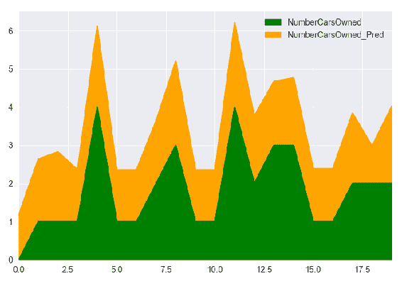
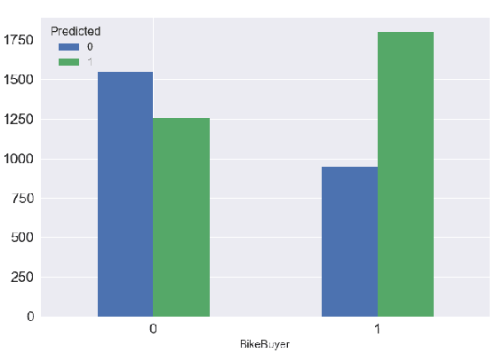
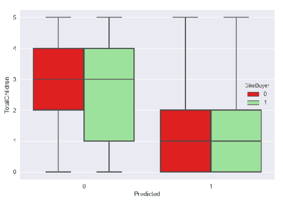
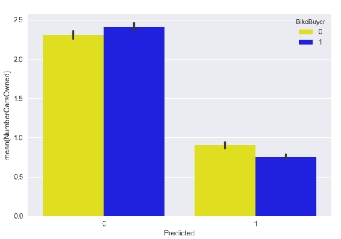
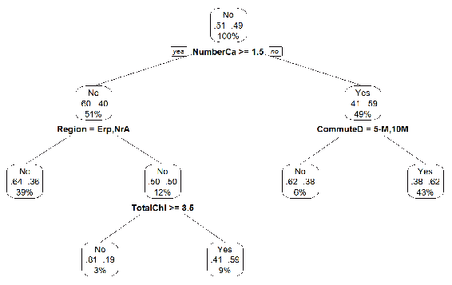
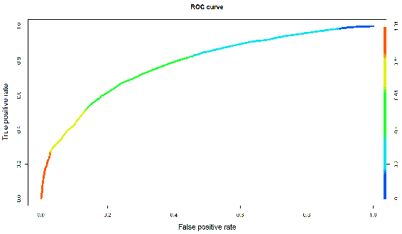

# 八、监督机器学习

在[第 6 章](c292a26b-3b0d-4a83-bc53-734fabc07743.xhtml)、*中间统计和图表*中，我们读到了关于线性回归的中间统计。我将从那一点继续这一章。线性回归已经是一种可以用于预测的算法。您可以使用定向或监督算法进行预测。监督算法有一个目标，或因变量。他们试图用公式和自变量的值来解释那个变量的值。该解释存储在模型中，您可以使用该模型来预测新数据集的目标变量值。因变量监督模型的发展。在真实的项目中，您创建许多模型，然后部署最适合您的业务需求的模型。因此，您需要在部署之前评估模型。

在本章中，我将解释以下内容:

*   评估预测模型
*   使用朴素贝叶斯算法
*   用逻辑回归预测
*   树木、森林和更多的树木
*   使用 T-SQL 进行预测


# 评估预测模型

为了评估预测模型，首先要将数据集分成两个分离的子集:一个**训练集**和一个**测试集**。关于如何执行这种划分，没有严格的规则。可以先用 70%的数据进行训练，30%进行测试。您在训练集上训练模型。模型定型后，您可以在测试集上使用它来预测目标变量的值。但是，因为测试集也包含目标变量值已知的数据，所以您可以测量模型的预测能力，并比较不同的模型。

有很多可行的措施，我将在下面几段中解释。请注意，您也可以将相同的数据用于训练和测试。虽然通常你得到的预测太好了，比单独的测试集要好，但是你仍然可以比较不同的模型。

让我从 T-SQL 代码开始，它从测试集的`dbo.vTargetMail`视图中选择 30%的数据。重要的部分是随机选择数据。在 T-SQL 中，您可以使用`CRYPT_GEN_RANDOM()`函数来生成随机数，您可以用它来选择随机行，如下面的代码所示:

```sql
USE AdventureWorksDW2017;
GO
-- Test set
SELECT TOP 30 PERCENT
 CustomerKey, CommuteDistance,
 TotalChildren, NumberChildrenAtHome, 
 Gender, HouseOwnerFlag,
 NumberCarsOwned, MaritalStatus,
 Age, Region,
 YearlyIncome AS Income,
 EnglishEducation AS Education,
 EnglishOccupation AS Occupation,
 BikeBuyer, 2 AS TrainTest
 INTO dbo.TMTest
FROM dbo.vTargetMail
ORDER BY CAST(CRYPT_GEN_RANDOM(4) AS INT);
```

现在，在`NOT EXISTS`过滤器的帮助下，很容易为训练集选择剩余的 70%的行:

```sql
-- Training set
SELECT 
 CustomerKey, CommuteDistance,
 TotalChildren, NumberChildrenAtHome, 
 Gender, HouseOwnerFlag,
 NumberCarsOwned, MaritalStatus,
 Age, Region,
 YearlyIncome AS Income,
 EnglishEducation AS Education,
 EnglishOccupation AS Occupation,
 BikeBuyer, 1 AS TrainTest
INTO dbo.TMTrain
FROM dbo.vTargetMail AS v
WHERE NOT EXISTS
 (SELECT * FROM dbo.TMTest AS t
 WHERE v.CustomerKey = t.CustomerKey);
GO
```

在 R 和 Python 中进行拆分有很多可能性。我使用 T-SQL 是因为我将在两种语言中使用相同的训练集，以便能够比较不同语言之间的模型。

让我们从一个简单的评估例子开始。我将使用 Python 和`revoscalepy`微软可扩展库来创建一个线性模型。首先，让我们导入基本的数据科学库并读取数据:

```sql
import numpy as np
import pandas as pd
import pyodbc
import matplotlib as mpl
import matplotlib.pyplot as plt
import seaborn as sns
# Reading the data from SQL Server
con = pyodbc.connect('DSN=AWDW;UID=RUser;PWD=Pa$$w0rd')
query = """SELECT CustomerKey, CommuteDistance,
 TotalChildren, NumberChildrenAtHome, 
 Gender, HouseOwnerFlag,
 NumberCarsOwned, MaritalStatus,
 Age, Region, Income,
 Education, Occupation,
 BikeBuyer, TrainTest
 FROM dbo.TMTrain
 UNION
 SELECT CustomerKey, CommuteDistance,
 TotalChildren, NumberChildrenAtHome, 
 Gender, HouseOwnerFlag,
 NumberCarsOwned, MaritalStatus,
 Age, Region, Income,
 Education, Occupation,
 BikeBuyer, TrainTest
 FROM dbo.TMTEST
 """
TM = pd.read_sql(query, con)
```

请注意，我再次将训练集和测试集合并为一个。稍后我将在 R 和 Python 中使用 TrainTest 变量分割数据，该变量是定义案例集合成员的标志。

线性回归只使用数字变量。我有一些分类变量。有些是普通人。让我们用下面的代码正确地定义它们:

```sql
# Define Education as ordinal
TM['Education'] = TM['Education'].astype('category')
TM['Education'].cat.reorder_categories(
 ["Partial High School", 
 "High School","Partial College", 
 "Bachelors", "Graduate Degree"], inplace=True)
TM['Education']
# Define CommuteDistance as ordinal
TM['CommuteDistance'] = TM['CommuteDistance'].astype('category')
TM['CommuteDistance'].cat.reorder_categories(
 ["0-1 Miles", 
 "1-2 Miles","2-5 Miles", 
 "5-10 Miles", "10+ Miles"], inplace=True)
# Define Occupation as ordinal
TM['Occupation'] = TM['Occupation'].astype('category')
TM['Occupation'].cat.reorder_categories(
 ["Manual", 
 "Clerical","Skilled Manual", 
 "Professional", "Management"], inplace=True)
```

从序数中，很容易创建整数:

```sql
TM['EducationInt'] = TM['Education'].cat.codes
TM['CommuteDistanceInt'] = TM['CommuteDistance'].cat.codes
TM['OccupationInt'] = TM['Occupation'].cat.codes
```

现在我可以从`revoscalepy`包中导入`rx_lin_mod()`和`rx_predict()`函数。然后我可以创建一个线性模型。在模型中，我将`NumberCarsOwned`变量表示为`TotalChildren`、`NumberChildrenAtHome`、`BikeBuyer`、`Occupation`、`Education`和`CommuteDistance`变量的线性函数。注意，对于最后三个顺序变量，我使用了我刚刚创建的三个整数版本:

```sql
from revoscalepy import rx_lin_mod, rx_predict
linmod = rx_lin_mod(
 """NumberCarsOwned ~ TotalChildren + OccupationInt + NumberChildrenAtHome +
 EducationInt + CommuteDistanceInt + BikeBuyer""", 
 data = TM)
```

从代码中可以看出，我在训练过程中使用了整个数据集。这意味着我将使用用于训练的相同数据进行预测。稍后我将展示如何使用单独的训练集和测试集。让我们做预测，展示前几个:

```sql
TMPredict = rx_predict(linmod, data = TM, output_data = TM)
TMPredict[["NumberCarsOwned", "NumberCarsOwned_Pred"]].head(5)
```

结果如下:

```sql
NumberCarsOwned NumberCarsOwned_Pred
0 0               1.170255
1 1               1.639562
2 1               1.826767
3 1               1.356994
4 4               2.108748
```

乍一看，你可能会对这些预测感到失望。但是，请注意，对于较低的实际汽车数量，预测数量也较低。因此，分布的形状得以保留。如果将预测标准化到从`0`到`4`的范围内，数字会更接近原始值。我可以用面积图向你们展示，分布形状保持不变:

```sql
TMPredict[["NumberCarsOwned", "NumberCarsOwned_Pred"]].head(20).plot(kind = "area",
 color = ('green','orange'))
plt.show()
```

您可以在下图中看到面积图:



汽车原始拥有量和预测拥有量的面积图

通常，您的目标变量是离散的，只有两个可能的值，可能是/否或真/假，表示一些决定，或者是否发生了一些动作。显示预测质量的最重要方式是在**分类矩阵**中，也称为**混淆矩阵**。下表显示了分类矩阵:

|  | **预测的** | **预测的** |
| **实际** | 不 | 是 |
| 不 | 长吨 | 冰点 |
| 是 | 【数学】函数 | 东帝汶的网络域名代号 |

这是一个 2 x 2 矩阵(在上表中，还有行和列的标题)。行中是实际值，而列中是预测值。混淆矩阵值用粗体和斜体书写。在左上角，有一些预测值为否，而实际值也为否的情况。这些是**真否定**。在右上角，预测值是肯定的，而实际值是否定的。这些是**误报**。我希望你现在可以看到矩阵的逻辑，并理解底部两个单元格中的值的含义:**假阴性**左下角，和**真阳性**右下角。

矩阵中的四个值哪一个对你最重要取决于业务问题。例如，对于一个营销活动，你可能最感兴趣的是真正的积极因素。对于欺诈检测，除了真阳性，您还需要特别注意假阳性。您可能不希望取消最佳客户的信用卡，因为您的模型错误地预测到该信用卡的最后一次交易是欺诈性的。现在考虑预测滑坡的区域。在这种情况下，假阴性起了很大的作用。想象一下，你预测某个地区不会发生滑坡，人们在那里建造房屋，然后滑坡发生了。

从分类矩阵中的四个值，您可以派生出许多将它们组合在一起的其他度量。一些最重要的是:

*   敏感度，或召回率，命中率，或真阳性率，定义为 *TP / (TP + FN)*
*   脱落或假阳性率，定义为 *FN / (FN + TP)*
*   精度，定义为 *(TP + TN) / (TP + TN + FP + FN)*

也有一些流行的预测图表。**接收器工作特性** ( **ROC** )曲线绘制了不同阈值设置下的真阳性率与假阳性率。例如，这种曲线对于欺诈检测问题非常有用。另一个流行的图表是**升降图**。在电梯图中，你可以用随机猜测的方式比较不同的型号。我将在本章后面给出具体的例子。


# 使用朴素贝叶斯算法

**朴素贝叶斯**算法是一种非常快速的算法，对于离散变量的初始分析非常有用。该算法为可预测变量的每个状态中的每个输入变量的每个可能状态计算频率或概率。概率用于对具有已知输入属性的新数据集进行预测。如前所述，该算法只支持离散(当然也可以是离散化)属性。每个输入属性都与其他输入属性分开使用。因此，输入属性被认为是独立的。我将用 Python 展示一个例子。让我们从必要的导入开始:

```sql
from sklearn.metrics import accuracy_score
from sklearn.naive_bayes import GaussianNB
```

下一步是根据我前面读到的 SQL Server 数据创建训练集和测试集。此外，与来自`sklearn`库中的其他算法一样，我需要准备特征矩阵和目标向量:

```sql
Xtrain = TM.loc[TM.TrainTest == 1,
 ['TotalChildren', 'NumberChildrenAtHome',
 'HouseOwnerFlag', 'NumberCarsOwned',
 'EducationInt', 'OccupationInt',
 'CommuteDistanceInt']]
ytrain = TM.loc[TM.TrainTest == 1, ['BikeBuyer']]
Xtest = TM.loc[TM.TrainTest == 2,
 ['TotalChildren', 'NumberChildrenAtHome',
 'HouseOwnerFlag', 'NumberCarsOwned',
 'EducationInt', 'OccupationInt',
 'CommuteDistanceInt']]
ytest = TM.loc[TM.TrainTest == 2, ['BikeBuyer']]
```

现在让我们初始化并训练模型:

```sql
model = GaussianNB()
model.fit(Xtrain, ytrain)
```

模型定型后，我们可以用它来预测测试集中的 BikeBuyer 变量。我还展示了准确性得分，这是我在本章上一节中介绍的衡量标准:

```sql
ymodel = model.predict(Xtest)
accuracy_score(ytest, ymodel)
```

结果如下:

```sql
0.6034980165885323
```

这不太好。朴素贝叶斯算法对于初步分析很有用，可以检查哪些变量对输入有用。在用更复杂的算法分析数据之前使用它，因为它很快。让我将`BikeBuyer`变量的实际值和预测值添加到测试集:

```sql
Xtest['BikeBuyer'] = ytest
Xtest['Predicted'] = ymodel
```

现在我可以用数字和图形向你们展示分类矩阵:

```sql
cdbb = pd.crosstab(Xtest.BikeBuyer, Xtest.Predicted)
cdbb
cdbb.plot(kind = 'bar',
 fontsize = 14, legend = True, 
 use_index = True, rot = 1)
plt.show()
```

这是数值结果。您可以注意到真正的积极因素非常高:

```sql
Predicted     0    1
BikeBuyer 
0          1546 1255
1           944 1801
```

下图用条形图显示了分类矩阵:



用条形图表示的分类矩阵

最后，我可以分析输入变量在`BikeBuyer`变量的实际值和预测值类别中的分布。首先，这是一个`TotalChildren`变量的箱线图:

```sql
sns.boxplot(x = 'Predicted', y = 'TotalChildren', 
 hue = 'BikeBuyer', data = Xtest,
 palette = ('red', 'lightgreen'))
plt.show()
```

这导致了下图:



分析实际和预测 BikeBuyer 变量类别中的儿童总数

我还将为`NumberCarsOwned`变量绘制一个箱线图:

```sql
sns.barplot(x="Predicted", y="NumberCarsOwned", 
 hue="BikeBuyer", data=Xtest,
 palette = ('yellow', 'blue'))
plt.show()
```

以下是图表:



图 8.4:分析实际和预测 BikeBuyer 变量的类中拥有的数字

在接下来的分析中，我将切换到 r。


# 用逻辑回归预测

下一步是也在 r 中做一些分析。我将从逻辑回归开始。首先，我们需要读取 R:

```sql
library(RODBC)
con <- odbcConnect("AWDW", uid = "RUser", pwd = "Pa$$w0rd")
TM <-
 sqlQuery(con,
 "SELECT CustomerKey, CommuteDistance,
 TotalChildren, NumberChildrenAtHome, 
 Gender, HouseOwnerFlag,
 NumberCarsOwned, MaritalStatus,
 Age, Region, Income,
 Education, Occupation,
 BikeBuyer, TrainTest
 FROM dbo.TMTrain
 UNION
 SELECT CustomerKey, CommuteDistance,
 TotalChildren, NumberChildrenAtHome, 
 Gender, HouseOwnerFlag,
 NumberCarsOwned, MaritalStatus,
 Age, Region, Income,
 Education, Occupation,
 BikeBuyer, TrainTest
 FROM dbo.TMTEST")
close(con)
```

与 Python 类似，下一步是相应地定义因素及其级别:

```sql
# Define Education as ordinal
TM$Education = factor(TM$Education, order = TRUE,
 levels = c("Partial High School",
 "High School", "Partial College",
 "Bachelors", "Graduate Degree"))
# Define CommuteDistance as ordinal
TM$CommuteDistance = factor(TM$CommuteDistance, order = TRUE,
 levels = c("0-1 Miles",
 "1-2 Miles", "2-5 Miles",
 "5-10 Miles", "10+ Miles"))
# Define Occupation as ordinal
TM$Occupation = factor(TM$Occupation, order = TRUE,
 levels = c("Manual",
 "Clerical", "Skilled Manual",
 "Professional", "Management"))
```

准备工作仍未结束。我需要从序数中定义整数:

```sql
TM$EducationInt = as.integer(TM$Education)
TM$CommuteDistanceInt = as.integer(TM$CommuteDistance)
TM$OccupationInt = as.integer(TM$Occupation)
```

我还将为自行车购买者因素变量的级别添加标签:

```sql
TM$BikeBuyer <- factor(TM$BikeBuyer,
 levels = c(0, 1),
 labels = c("No", "Yes"))
```

我将数据分为训练集和测试集:

```sql
TMTrain <- TM[TM$TrainTest == 1,]
TMTest <- TM[TM$TrainTest == 2,]
```

现在我准备介绍一下**逻辑回归**算法。在逻辑回归模型中，输入变量称为输入单位。该算法将输入值组合成一个值。该组合可以用一个**加权和**来完成。然后用**逻辑函数**将这个单个数字转换成另一个数字，也称为 **sigmoid 函数**。转换后的值是输出单位。这两个部分，利用加权和与逻辑函数的组合和变换，一起被称为**激活函数**。输出值就是预测值。逻辑函数返回 0 到 1 之间的值。大于 0.5 的值可视为正预测，小于 0.5 的值可视为负预测。以下是 sigmoid 函数的公式:

``

逻辑回归是相当流行的。您可以在基础包中找到已经存在的`glm()`函数。使用下面的代码，我正在训练一个以`BikeBuyer`为目标变量并且只有三个输入变量的模型:

```sql
TMLogR <- glm(BikeBuyer ~
 Income + Age + NumberCarsOwned,
 data = TMTrain, family = binomial())
```

模型训练好之后，我就可以用`predict()`函数来做预测了。我还将结果离散化为两个值:是和否。然后我创建混淆矩阵:

```sql
probLR <- predict(TMLogR, TMTest, type = "response")
predLR <- factor(probLR > 0.5,
 levels = c(FALSE, TRUE),
 labels = c("No", "Yes"))
perfLR <- table(TMTest$BikeBuyer, predLR,
 dnn = c("Actual", "Predicted"))
perfLR
```

这是结果。将此与上一节中的朴素贝叶斯算法结果进行比较:

```sql
       Predicted
Actual No   Yes
No     1769 1032
Yes    1173 1572
```

如果你比较结果，你可以看到逻辑回归结果对真阴性更好，但对真阳性更差。让我在公式中包含更多的输入变量，并再次测试模型:

```sql
TMLogR <- glm(BikeBuyer ~
 Income + Age + NumberCarsOwned +
 EducationInt + CommuteDistanceInt + OccupationInt,
 data = TMTrain, family = binomial())
# Test the model
probLR <- predict(TMLogR, TMTest, type = "response")
predLR <- factor(probLR > 0.5,
 levels = c(FALSE, TRUE),
 labels = c("No", "Yes"))
perfLR <- table(TMTest$BikeBuyer, predLR,
 dnn = c("Actual", "Predicted"))
perfLR
```

这是结果。他们只是稍微好一点:

```sql
       Predicted
Actual No   Yes
No     1784 1017
Yes    1147 1598
```

也许是时候尝试用另一种算法来分析数据了。


# 树木、森林和更多的树木

可能最流行的分类和预测算法是**决策树**算法。该算法给出了相当好的结果，并且易于理解。该算法也被称为**递归分割**。你从一组中的所有数据开始。然后，用每个输入变量的值逐个分割数据。每次分割后，检查目标变量在新子组中的分布。就目标变量而言，您保留了为您提供最纯粹的子组的分割，而忽略了所有其他分割。然后你一次又一次地分裂子群，直到目标变量的纯度增加，或者直到其他一些停止条件。

决策树使用离散变量。如果一些变量是连续的，目标变量也是连续的，那么你就得到**回归树**。在树的每个分支中，离散变量用于拆分，连续变量用于回归公式。你得到一个**渐进线性回归**。线性回归只是一棵简单的回归树，没有任何分裂。

好了，介绍够了。让我们使用基础安装中的`rpart()`函数来生成树，并立即将其用于预测和分类矩阵:

```sql
TMRP <- rpart(BikeBuyer ~ MaritalStatus + Gender +
              Education + Occupation +
              + NumberCarsOwned + TotalChildren +
              CommuteDistance + Region,
              data = TMTrain)
# Test the model
predDT <- predict(TMRP, TMTest, type = "class")
perfDT <- table(TMTest$BikeBuyer, predDT,
                dnn = c("Actual", "Predicted"))
perfDT
```

结果如下:

```sql
       Predicted
Actual No   Yes
No     1678 1123
Yes     939 1806
```

结果比我之前使用的任何算法都要好。在继续分析之前，我们先画一下树。我正在使用`rpart.plot`包中的`prp()`函数:

```sql
# install.packages("rpart.plot")
library(rpart.plot)
prp(TMRP, type = 2, extra = 104, fallen.leaves = FALSE);
```

您可以在下图中看到该树:



自行车购买者变量的决策树

决策树在许多包中实现。一个非常流行的版本是`rpart`包中的`ctree()`函数:

```sql
# install.packages("party")
library(party)
TMDT <- ctree(BikeBuyer ~ MaritalStatus + Gender +
 Education + Occupation +
 NumberCarsOwned + TotalChildren +
 CommuteDistance + Region,
 data = TMTrain)
# Test the model
predDT <- predict(TMDT, TMTest, type = "response")
perfDT <- table(TMTest$BikeBuyer, predDT,
 dnn = c("Actual", "Predicted"))
perfDT
```

以下是`ctree()`函数的结果:

```sql
       Predicted
Actual No   Yes
No     2110  691
Yes     894 1851
```

你可以看到一个实质性的改善。尤其是误报相对于我做的其他模型来说还是相当可观的。让我将预测添加到测试集中，并计算准确性度量:

```sql
TMTest$Predicted <- predict(TMDT, newdata = TMTest)
# Calculate the overall accuracy.
TMTest$CorrectP <- TMTest$Predicted == TMTest$BikeBuyer
print(paste("Correct predictions: ",
 100 * mean(TMTest$CorrectP), "%"))
```

精确度如下:

```sql
Correct predictions: 71.4208438514245 %
```

这比我用朴素贝叶斯模型得到的准确度高得多。由于真阳性和假阳性之间的良好比率，我将为该模型绘制 ROC 曲线。首先，我需要得到预测概率，而不仅仅是预测值。我可以用`treeresponse()`函数获取它们，并将它们存储在测试数据框中:

```sql
TMTest$Probabilities <-
 1 - unlist(treeresponse(TMDT, newdata = TMTest),
 use.names = F)[seq(1, nrow(TMTest) * 2, 2)]
```

现在我可以使用`ROCR`库来获得能够绘制 ROC 曲线的`plot()`函数的版本:

```sql
# install.packages("ROCR")
library(ROCR)
pred <- prediction(TMTest$Probabilities, TMTest$BikeBuyer)
perf <- performance(pred, "tpr", "fpr")
plot(perf, main = "ROC curve", colorize = T, cex.axis = 1.3, cex.lab = 1.4, lwd = 6)
```

您可以在下图中看到 ROC 曲线:



ctree()模型的 ROC 曲线

看起来我创建的最后一个模型对欺诈检测问题很有帮助。您也可以为其他模型创建 ROC 曲线，然后直观地比较它们；曲线越高，模型越好。

决策树还有许多其他版本。**随机森林**算法使用训练集中的随机子集，在同一个训练集上构建许多决策树。然后对所有模型的预测进行平均。

可以想象这个算法是非常耗费资源的。它可以并行处理多个树。我将使用内置在`RevoScaleR`包的`rxDForest()`函数中的这个算法的可伸缩版本。代码如下:

```sql
library(RevoScaleR)
# Decision forest
rxDF <- rxDForest(BikeBuyer ~ CommuteDistance +
 NumberCarsOwned + Education,
 data = TMTrain, cp = 0.01)
# Test the model
predDF <- rxPredict(rxDF, data = TMTest, type = 'response')
TMDF <- cbind(TMTest['BikeBuyer'], predDF)
perfDF <- table(TMDF$BikeBuyer, TMDF$BikeBuyer_Pred,
 dnn = c("Actual", "Predicted"))
perfDF
```

该模型的混淆矩阵如下:

```sql
       Predicted
Actual No   Yes
No     1874  927
Yes    1273 1472
```

您可以看到结果比以前的模型更差。但是，请注意，我只使用了一堆输入变量。总之，这就是你在一个真实项目中的工作方式:你尝试不同的算法，不同的输入，不同的参数。

我将尝试另一个版本的决策树。**梯度推进树**也构建了许多决策树。然而，它们一个接一个地、连续地构建。对于每棵树，该算法再次从训练集中选择案例的随机子集。但是，在每一步中，它都会添加一些在前一步中预测错误的情况。这样，算法降低了错误预测。我正在展示一个使用来自`RevoScaleR`包的`rxBTree()`函数的例子:

```sql
rxBT <- rxBTrees(BikeBuyer ~ CommuteDistance +
 TotalChildren + NumberChildrenAtHome +
 Gender + HouseOwnerFlag +
 NumberCarsOwned + MaritalStatus +
 Age + Region + Income +
 Education + Occupation,
 data = TMTrain, cp = 0.01)
# Test the model
predBT <- rxPredict(rxBT, data = TMTest, type = 'response')
predBT['BBPredicted'] <- as.integer(predBT['BikeBuyer_prob'] >= 0.5)
TMBT <- cbind(TMTest['BikeBuyer'], predBT)
# Giving labels to BikeBuyer values
TMBT$BBPredicted <- factor(TMBT$BBPredicted,
 levels = c(0, 1),
 labels = c("No", "Yes"))
# View(predBT)
perfBT <- table(TMBT$BikeBuyer, TMBT$BBPredicted,
 dnn = c("Actual", "Predicted"))
perfBT
```

请注意，该算法以概率的形式返回预测，就像逻辑回归一样。因此，为了测试这个模型，我必须添加两个中间步骤:将概率转换为数字 0 和 1，并给数字加上标签。结果如下:

```sql
       Predicted
Actual No   Yes
No     1820  981
Yes    1134 1611
```

我现在要结束我的模特课程了。对于这个例子，我将来自`party`包的`rpart()`函数声明为获胜者。


# 使用 T-SQL 进行预测

最后一个要回答的问题是如何在 T-SQL 中使用 R 和 Python 模型。当然，您可以创建模型并用`sys.sp_execute_external_script`存储过程直接训练它们。然而，对于每个新的预测，在相同的训练集上重新训练完整的模型是没有意义的，即使它是对单个情况的预测。SQL Server 2017 引入了`PREDICT()`函数。使用这个函数意味着在 SQL Server 中执行**本机预测**。

为了使用`PREDICT()`函数，您需要在 SQL Server 表的`VARBINARY(MAX)`列中序列化模型。您甚至不必在 SQL Server 中安装 ML 服务(在数据库中),您可以在 SQL Server 中序列化您的模型来进行本机预测。以下代码为模型创建表:

```sql
CREATE TABLE dbo.dsModels
(Id INT NOT NULL IDENTITY(1,1) PRIMARY KEY,
 ModelName NVARCHAR(50) NOT NULL,
 Model VARBINARY(MAX) NOT NULL);
GO
```

不幸的是，并不是所有的模型都支持原生预测，或者支持**实时评分**。目前，2018 年夏天，我在写这本书的时候，只支持 RevoScaleR 和 MicrosoftML 库中的一些算法。

然而，受支持算法的列表在不断增长。你可以在[https://Docs . Microsoft . com/en-us/SQL/advanced-analytics/real-time-scoring 查看微软文档中支持的算法列表？view=sql-server-2017](https://docs.microsoft.com/en-us/sql/advanced-analytics/real-time-scoring?view=sql-server-2017) 。

下面的代码使用 RevoScaleR 包中的`rxDtrees()`函数创建了一个决策树模型，并在我刚刚创建的表中序列化了这个模型:

```sql
DECLARE @model VARBINARY(MAX);
EXECUTE sys.sp_execute_external_script
 @language = N'R'
 ,@script = N'
 rxDT <- rxDTree(BikeBuyer ~ NumberCarsOwned +
 TotalChildren + Age + YearlyIncome,
 data = TM);
 model <- rxSerializeModel(rxDT, realtimeScoringOnly = TRUE);'
 ,@input_data_1 = N'
 SELECT CustomerKey, NumberCarsOwned,
 TotalChildren, Age, YearlyIncome,
 BikeBuyer
 FROM dbo.vTargetMail;'
 ,@input_data_1_name = N'TM'
 ,@params = N'@model VARBINARY(MAX) OUTPUT'
 ,@model = @model OUTPUT;
INSERT INTO dbo.dsModels (ModelName, Model)
VALUES('rxDT', @model);
GO
```

您可以查询该表以检查模型是否已成功存储:

```sql
SELECT *
FROM dbo.dsModels;
```

现在您可以使用`PREDICT()`函数来获得预测:

```sql
DECLARE @model VARBINARY(MAX) = 
(
 SELECT Model
 FROM dbo.dsModels
 WHERE ModelName = 'rxDT'
);
SELECT d.CustomerKey, d.Age, d.NumberCarsOwned,
 d.BikeBuyer, p.BikeBuyer_Pred
FROM PREDICT(MODEL = @model, DATA = dbo.vTargetMail AS d)
WITH(BikeBuyer_Pred FLOAT) AS p
ORDER BY d.CustomerKey;
```

下面是结果中的几行。上面的预测值`0.50`表示预测的自行车购买者。请注意，这些行中已经有一些不正确的预测:

```sql
CustomerKey Age NumberCarsOwned BikeBuyer BikeBuyer_Pred
----------- --- --------------- --------- -----------------
11000       31  0               1         0.680851063829787
11001       27  1               1         0.424242424242424
11002       32  1               1         0.424242424242424
11003       29  1               1         0.636594663278272
11004       23  4               1         0.241935483870968
```

您可以使用下面的代码来清理`AdventureWorkDW2017`演示数据库:

```sql
DROP TABLE IF EXISTS dbo.TMTrain;
DROP TABLE IF EXISTS dbo.TMTest;
DROP TABLE IF EXISTS dbo.dsModels;
GO
```


# 摘要

在本章中，您学习了预测模型。您学习了线性回归、朴素贝叶斯、逻辑回归、决策树、决策树和梯度推进树。您学习了如何评估模型。最后，您了解了如何在 SQL Server 中存储模型并将其用于本机预测。

现在我们在这本书的结尾。谢谢你阅读它。我真的希望这本书能帮助你成为一名更好的数据科学家。