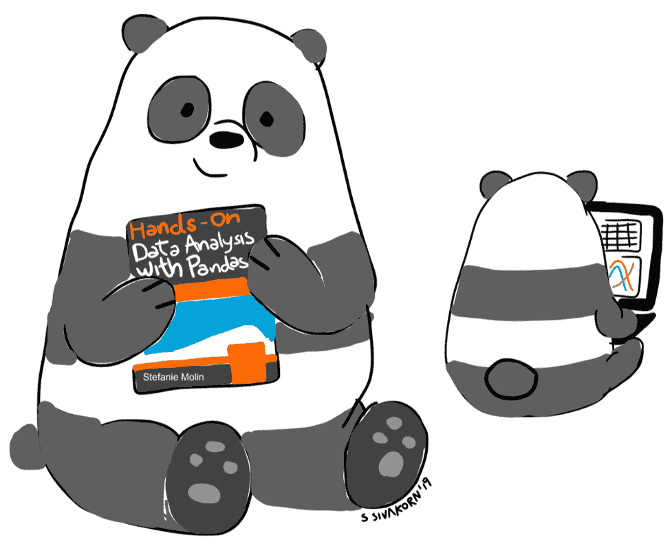

# 十二、前路漫漫

在本书中，我们已经涵盖了许多材料，现在您已经能够完全用 Python 来执行数据分析和机器学习任务。我们通过学习一些介绍性的统计数据以及如何在 Python 中设置数据科学环境开始了我们的旅程。然后，我们学习了使用`pandas`的基础知识，以及如何将数据引入 Python。有了这些知识，我们就能够使用 API、读取文件和查询数据库来获取数据进行分析。

在我们收集了数据之后，我们学习了如何进行数据辩论，以便清理我们的数据并将其转换成可用的格式。接下来，我们学习了如何处理时间序列，以及如何组合不同来源的数据并进行汇总。一旦我们很好地处理了数据争论，我们就转移到可视化上，使用`pandas`、`matplotlib`和`seaborn`来创建各种各样的绘图类型，我们也学会了如何定制它们。

有了这些知识，我们能够通过查看比特币和 FAANG 股票的金融数据来处理一些现实世界的分析，并试图检测试图验证 web 应用的黑客。此外，我们还学习了如何构建自己的 Python 包、编写自己的类以及模拟数据。

最后，我们用`scikit-learn`得到了机器学习的介绍。我们讨论了如何构建模型管道，从预处理数据到模型拟合。之后，我们讨论了如何评估模型的性能，以及如何尝试改进它们的性能。我们对机器学习的讨论最终以使用机器学习模型来检测试图通过暴力攻击获得 web 应用访问权限的黑客而告终。

既然你已经获得了所有这些知识，重要的是要培养它，以便你能记住它。这意味着你必须抓住每一个机会练习。本章为您继续数据科学之旅提供了以下资源:

*   查找各种主题数据的资源
*   练习使用数据的网站和服务
*   提高 Python 技能的编码挑战和教育内容

# 数据资源

和任何技能一样，要变得更好，我们需要练习，对我们来说，这意味着我们需要找到数据来练习。没有最佳数据集可供练习；相反，每个人都应该找到他们有兴趣探索的数据。虽然这一部分并不全面，但它包含了各种主题的数据资源，希望每个人都能找到他们想要使用的东西。

小费

不确定要查找哪种数据？你想知道的与你感兴趣的话题相关的一些事情是什么？是否已经收集了关于这一主题的数据，你能否获得这些数据？让你的好奇心引导你。

## Python 包

`seaborn`和`scikit-learn`都提供了内置的样本数据集，你可以用它们进行实验，以便用我们在书中涉及的材料进行更多的实践，并尝试新技术。这些数据集通常非常干净，因此很容易处理。一旦您熟悉了这些技术，您就可以继续使用下面几节中提到的其他资源来查找数据，这些资源将更能代表真实世界的数据。

### 希伯恩

Seaborn 提供了`load_dataset()`函数，它从一个小的 GitHub 存储库中的 CSV 文件中读取数据用于`seaborn`数据。这些数据集是在`seaborn`文档中使用的，所以记住它们可能会改变是很重要的。数据可以直接从位于 https://github.com/mwaskom/seaborn-data 的[的存储库中获取。](https://github.com/mwaskom/seaborn-data)

### Scikit-learn

Scikit-learn 包括一个`datasets`模块，可用于生成随机数据集来测试算法，或者使用来导入机器学习社区中流行的某些数据集。请务必查看文档以了解更多信息:

*   **为机器学习任务生成随机数据集**:[https://sci kit-learn . org/stable/modules/classes . html # samples-generator](https://scikit-learn.org/stable/modules/classes.html#samples-generator)
*   **加载支持的数据集**:[https://sci kit-learn . org/stable/modules/classes . html # loaders](https://scikit-learn.org/stable/modules/classes.html#loaders)

在`sklearn.datasets`模块中还有`fetch_openml()`函数，它将按名称从 OpenML(【https://www.openml.org/】)中获取数据集，OpenML 中包含了许多用于机器学习的免费数据集。

## 搜索数据

以下是一些可以用来搜索各种主题数据的地方:

*   **DataHub** : [https://datahub.io/search](https://datahub.io/search)
*   **谷歌数据集搜索**:【https://datasetsearch.research.google.com/ 
*   **在亚马逊网络服务上公开数据**:【https://registry.opendata.aws/ 
*   **OpenML**:【https://www.openml.org 
*   斯坦福大学收集的数据集的快照库:【https://snap.stanford.edu/data/index.html 
*   **http://archive.ics.uci.edu/ml/index.php UCI 机器学习库**:

## 原料药

我们看到了使用 API 来收集数据是多么的棒；以下是一些用于收集您可能感兴趣的数据的 API:

*   **https://developers.facebook.com/docs/graph-api 脸书 API**:
*   NOAA 气候数据 API:【https://www.ncdc.noaa.gov/cdo-web/webservices/v2 
*   纽约时报 API:【https://developer.nytimes.com/ 
*   **OpenWeatherMap API** : [https://openweathermap.org/api](https://openweathermap.org/api)
*   **推特 API**:【https://developer.twitter.com/en/docs 
*   美国地质勘探局地震 API:【https://earthquake.usgs.gov/fdsnws/event/1/ 

## 网站

本部分包含可通过网站访问的各种主题的精选数据资源。获取分析数据可能像下载一个 CSV 文件一样简单，也可能需要用`pandas`解析 HTML。如果你必须求助于来抓取页面(确保你已经尝试了我们在本书中讨论的方法)，确保你没有违反网站的使用条款。

### 金融

在本书中，我们多次使用金融数据。如果你对进一步的金融分析感兴趣，除了我们在 [*第七章*](B16834_07_Final_SK_ePub.xhtml#_idTextAnchor146) 、*金融分析——比特币和股票市场*中讨论的`pandas_datareader`包，还可以参考以下资源:

*   **谷歌财经**:【https://google.com/finance 
*   **纳斯达克历史股价**:【https://www.nasdaq.com/market-activity/quotes/historical 
*   **泉城**:[https://www.quandl.com](https://www.quandl.com)
*   雅虎！金融:【https://finance.yahoo.com】T2

### 政府数据

政府数据通常对公众开放。以下资源包含一些政府提供的数据:

*   **欧盟公开数据**:【http://data.europa.eu/euodp/en/data 
*   美国宇航局:【https://nasa.github.io/data-nasa-gov-frontpage/ 
*   **纽约市数据**:【https://opendata.cityofnewyork.us/data/ 
*   **英国政府数据**:【https://data.gov.uk/ 
*   **联合国数据**:http://data.un.org/
*   **美国人口普查数据**:【https://census.gov/data.html 
*   **美国政府数据**:【https://www.data.gov/ 

### 健康和经济

世界各地的经济、医疗和社会数据可从以下网站获得:

*   **Gapminder**:【https://www.gapminder.org/data/】T2
*   **健康数据**:【https://healthdata.gov/search/type/dataset 
*   **世界卫生组织**:[https://www.who.int/data/gho](https://www.who.int/data/gho)

以下是新冠肺炎疫情的其他数据资源:

*   **美国冠状病毒(新冠肺炎)数据(纽约时报)**:【https://github.com/nytimes/covid-19-data】T2
*   约翰·霍普金斯大学系统科学与工程中心(CSSE)的新冠肺炎数据仓库:【https://github.com/CSSEGISandData/COVID-19】T2
*   **https://www.ecdc.europa.eu/en/covid-19-pandemic【新冠肺炎】疫情**:
*   **打开新冠肺炎数据集**:【https://researchdata.wisc.edu/open-covid-19-datasets/ 

### 社交网络

对于那些对基于文本的数据或图形数据感兴趣的人来说，看看社交网络上的以下资源:

*   **推特数据资源列表**:【https://github.com/shaypal5/awesome-twitter-data T3
*   **社交网络数据**:【https://snap.stanford.edu/data/ego-Facebook.html 

### 运动

对于体育爱好者来说，看看下面的网站，它们提供了你最喜欢的运动员的数据库和统计网页:

*   **棒球数据库(练习使用数据库)**:【http://www.seanlahman.com/baseball-archive/statistics/ 
*   **棒球运动员统计**:【https://www.baseball-reference.com/players/ 
*   **篮球运动员统计**:【https://www.basketball-reference.com/players/ 
*   **美式足球运动员统计**:【https://www.pro-football-reference.com/players/ 
*   **足球(英式足球)统计**:【https://www.whoscored.com/Statistics 
*   **曲棍球运动员统计**:【https://www.hockey-reference.com/players/ 

### 多方面的

以下资源的主题各不相同，但是如果到目前为止还没有引起您的兴趣，请务必查看这些资源:

*   **亚马逊点评数据**:【https://snap.stanford.edu/data/web-Amazon.html 
*   **数据摘自维基百科**:【https://wiki.dbpedia.org/develop/datasets 
*   **谷歌趋势**:【https://trends.google.com/trends/ 
*   **来自电影界的电影**:【https://grouplens.org/datasets/movielens/ 
*   **雅虎 Webscope(数据集参考库)**:【https://webscope.sandbox.yahoo.com/ 

# 练习使用数据

在整本书中，我们已经通过一步一步的指导使用了来自不同来源的各种数据集。然而，这并不一定要停止。本节专门介绍一些资源，这些资源可用于继续指导教学，并最终为预定义的问题建立模型。

**ka ggle**(【https://www.kaggle.com/】)提供学习数据科学的内容，社区成员共享的探索数据集，以及公司发布的比赛——也许网飞推荐大赛听起来很熟悉([https://www.kaggle.com/netflix-inc/netflix-prize-data](https://www.kaggle.com/netflix-inc/netflix-prize-data))？这些竞赛是一个很好的方式，让你练习你的机器学习技能，并在社区中变得更加可见(特别是对潜在的雇主)。

重要说明

Kaggle 不是唯一一个你可以参加数据科学竞赛的地方。其他一些列在[https://towards data science . com/top-competitive-data-science-platforms-than-ka ggle-2995 e9 dad 93 c](https://towardsdatascience.com/top-competitive-data-science-platforms-other-than-kaggle-2995e9dad93c)。

**data camp**(【https://www.datacamp.com/】T2)虽然不完全免费，但提供各种 Python 语言的数据科学课程。它们包括教学视频和填空编码练习题，这样你可以建立对主题的理解。

# Python 练习

我们在本书中已经看到，在 Python 中处理数据不仅仅是`pandas`、`matplotlib`和`numpy`；总的来说，作为强大的 Python 程序员，我们的工作流可以从很多方面受益。凭借强大的 Python 技能，我们可以用 Flask 构建 web 应用，请求 API，高效地迭代组合或排列，并找到加快代码速度的方法。虽然这本书没有直接关注这些技能，但是这里有一些免费的资源，可以让你练习 Python，像程序员一样思考:

*   **黑客排名**:【https://www.hackerrank.com 
*   **代码大战**:【https://www.codewars.com 
*   **leet code**:【https://www.leetcode.com】T2
*   **编码名**:【https://www.codingame.com 

虽然不是免费的，**Python morels**(【https://www.pythonmorsels.com/】T2)提供每周一次的 Python 练习，这些练习将帮助你学习编写更多的 Python 代码，并更熟悉 Python 标准库。练习的难度各不相同，但可以根据需要设置更高或更低的难度。

另一个很好的资源是**Pramp**(【https://www.pramp.com】T2)，它可以让你与随机分配的同事一起练习编程面试。你的同事会用一个随机问题来面试你，并评估你如何对待面试，你的准则，以及你如何解释自己。30 分钟后，轮到你面试你的同事了。

可汗学院(【https://www.khanacademy.org/】)可以成为学习更多科目的绝佳资源。如果你想要一本关于计算机科学算法或机器学习算法背后的一些数学(如线性代数和微积分)的入门书，那么这是一个很好的起点。

最后，**LinkedIn Learning**(【https://www.linkedin.com/learning/】T2)有许多视频课程，涉及广泛的主题，包括 Python、数据科学和机器学习。新用户可以免费试用一个月。考虑参加*学习 Python 3 标准库*课程([https://www . LinkedIn . com/Learning/Learning-the-Python-3-Standard-Library](https://www.linkedin.com/learning/learning-the-python-3-standard-library))来提升你的 Python 技能；正如我们在本书中看到的，对标准库的扎实掌握有助于我们编写更简洁和高效的代码。

# 总结

本章为您提供了许多地方，您可以在这些地方找到各种主题的数据集。此外，您还了解了各种网站，您可以在这些网站上学习课程和通过教程工作，练习机器学习，并提高您的 Python 技能。保持你的技能敏锐和保持好奇心是很重要的，所以，无论你对什么感兴趣，寻找数据并进行你自己的分析。这些东西你可以放在你的 GitHub 账户上作为你的数据文件夹。

感谢您阅读这本书！我希望你能像这两只分析数据的Pandas一样从中受益。

# 练习

本章中的练习是开放式的，不提供解决方案。它们旨在为您提供一些想法，以便您可以自己开始:

1.  通过在[https://www.kaggle.com/c/titanic](https://www.kaggle.com/c/titanic)参加 Kaggle 上的泰坦尼克号挑战来练习机器学习分类。
2.  通过参加 Kaggle 上的房价挑战来练习机器学习回归技术，网址为[https://www . ka ggle . com/c/house-prices-advanced-regression-techniques](https://www.kaggle.com/c/house-prices-advanced-regression-techniques)。
3.  Perform an analysis on something that interests you. Some interesting ideas include the following:

    a) *在 Instagram 上预测喜欢*:[https://towards data science . com/predict-the-number-of-likes-on-insta gram-a7e C5 c 020203](https://towardsdatascience.com/predict-the-number-of-likes-on-instagram-a7ec5c020203)

    b) *分析 NJ 过境列车延误*:[https://medium . com/@ pranavbadami/how-data-can-help-fix-NJ-transit-c 0d 15c 0660 Fe](mailto:https://medium.com/@pranavbadami/how-data-can-help-fix-nj-transit-c0d15c0660fe)

    c) *利用可视化解决数据科学问题*:[https://towards data science . com/solving-a-data-science-challenge-the-visual-way-355 cfabcb B1 C5](https://towardsdatascience.com/solving-a-data-science-challenge-the-visual-way-355cfabcb1c5)

4.  Complete five challenges across any one of the sites in the *Python practice* section of this chapter. For example, you can try the following challenges:

    a) *找出两个数相加正好是一个特定的和*:【https://leetcode.com/problems/two-sum/】T2

    b) *验证信用卡号码*:[https://www . hacker rank . com/challenges/Validating-credit-card-number/problem](https://www.hackerrank.com/challenges/validating-credit-card-number/problem)

# 延伸阅读

您可以参考以下博客和文章，了解 Python 和数据科学的最新动态:

*   *http://lucumr.pocoo.org/的阿明·罗纳彻的博客(烧瓶的作者)*:
*   *数据科学中心*:http://www.datasciencecentral.com/
*   *媒体上的数据科学话题*:【https://medium.com/topic/data-science 
*   *Kaggle 博客*:【https://medium.com/kaggle-blog 
*   *KD 掘金*:【http://www.kdnuggets.com/websites/blogs.html 
*   *媒体上的机器学习话题*:【https://medium.com/topic/machine-learning T3
*   *行星巨蟒*:【https://planetpython.org/ 
*   *媒体上的编程主题*:【https://medium.com/topic/programming 
*   *Python 提示*:【http://book.pythontips.com/en/latest/index.html 
*   *Python 3 本周模块*:【https://pymotw.com/3/ 
*   *走向数据科学*:【https://towardsdatascience.com/ 
*   *Trey Hunner 的博客(Python Morsels 的创造者)*:【https://treyhunner.com/blog/archives/ 

以下资源包含学习如何构建定制`scikit-learn`类的信息:

*   *Building scikit-learn transformers*:[https://dreisbach . us/articles/Building-scikit-learn-compatible-transformers/](https://dreisbach.us/articles/building-scikit-learn-compatible-transformers/)
*   *在 scikit-learn 中创建自己的估算器*:[http://danielhnyk . cz/Creating-your-own-estimator-sci kit-learn/](http://danielhnyk.cz/creating-your-own-estimator-scikit-learn/)
*   *sci kit-learn base estimator*:[https://sci kit-learn . org/stable/modules/generated/sk learn . base . base estimator . html](https://scikit-learn.org/stable/modules/generated/sklearn.base.BaseEstimator.html)
*   *sci kit-learn rolling your own estimator*:[https://sci kit-learn . org/stable/developers/develop . html # developing-sci kit-learn-estimators](https://scikit-learn.org/stable/developers/develop.html#developing-scikit-learn-estimators)
*   *sci kit-learn transformer mixin*:[https://sci kit-learn . org/stable/modules/generated/sk learn . base . transformer mixin . html # sk learn . base . transformer mixin](https://scikit-learn.org/stable/modules/generated/sklearn.base.TransformerMixin.html#sklearn.base.TransformerMixin)

使用 Python 的数据科学堆栈进行编码的备忘单可在此处找到:

*   *Jupyter 笔记本小抄*:[https://S3 . Amazon AWS . com/img/ . data camp . com/blog _ img/Jupyter _ Notebook _ Cheat _ Sheet . pdf](https://s3.amazonaws.com/img/.datacamp.com/blog_img/Jupyter_Notebook_Cheat_Sheet.pdf)
*   *Jupyter 笔记本键盘快捷键*:[https://www . cheat ography . com/weidadeyue/cheat-sheets/Jupyter-Notebook/pdf _ bw/](https://www.cheatography.com/weidadeyue/cheat-sheets/jupyter-notebook/pdf_bw/)
*   *Matplotlib 备忘单*:[https://S3 . amazonaws . com/img/ . data camp . com/blog _ img/Python _ Matplotlib _ Cheat _ Sheet . pdf](https://s3.amazonaws.com/img/.datacamp.com/blog_img/Python_Matplotlib_Cheat_Sheet.pdf)
*   *NumPy 备忘单*:[https://S3 . Amazon AWS . com/img/ . data camp . com/blog _ img/NumPy _ Python _ Cheat _ Sheet . pdf](https://s3.amazonaws.com/img/.datacamp.com/blog_img/Numpy_Python_Cheat_Sheet.pdf)
*   *Pandas小抄*:【http://pandas.pydata.org/Pandas_Cheat_Sheet.pdf 
*   *Scikit-Learn 备忘单*:[https://S3 . Amazon AWS . com/img/ . data camp . com/blog _ img/Scikit _ Learn _ Cheat _ Sheet _ python . pdf](https://s3.amazonaws.com/img/.datacamp.com/blog_img/Scikit_Learn_Cheat_Sheet_Python.pdf)

机器学习算法、数学、概率和统计的备忘单可以在这里找到:

*   *微积分小抄*:[https://ml-Cheat Sheet . readthedocs . io/en/latest/Calculus . html](https://ml-cheatsheet.readthedocs.io/en/latest/calculus.html)
*   *线性代数 4 页*:[https://mini reference . com/static/tutorials/Linear _ Algebra _ in _ 4 _ Pages . pdf](https://minireference.com/static/tutorials/linear_algebra_in_4_pages.pdf)
*   *概率统计小抄*:【http://web.mit.edu/~csvoss/Public/usabo/stats_handout.pdf 
*   *Python 中的 15 个统计假设检验(备忘单)*:[https://machine learning mastery . com/Statistical-Hypothesis-Tests-in-Python-Cheat-Sheet/](https://machinelearningmastery.com/statistical-hypothesis-tests-in-python-cheat-sheet/)

有关机器学习算法、线性代数、微积分、概率和统计的其他资源，可以参考以下内容:

*   *傅立叶变换互动指南*:[https://better explained . com/articles/An-Interactive-Guide-to-the-Fourier-Transform/](https://betterexplained.com/articles/an-interactive-guide-to-the-fourier-transform/)
*   Joseph Blitzstein 和 Jessica Hwang:[https://www . Amazon . com/Introduction-Probability-Chapman-Statistical-Science/DP/1138369918](https://www.amazon.com/Introduction-Probability-Chapman-Statistical-Science/dp/1138369918)
*   加雷思·詹姆斯、丹妮拉·威滕、特雷弗·哈斯蒂和罗伯特·蒂布拉尼的《统计学习导论》:【https://www.statlearning.com/】T2
*   *傅立叶变换(scipy . FFT)*:[https://docs . scipy . org/doc/scipy/reference/tutorial/FFT . html](https://docs.scipy.org/doc/scipy/reference/tutorial/fft.html)
*   *用 numpy 的傅立叶变换寻找时间序列的最可能周期？(StackOverflow 问题)*:[https://stack overflow . com/questions/44803225/find-likely-periodicity-for-time-series-with-numpys-Fourier-transform](https://stackoverflow.com/questions/44803225/find-likeliest-periodicity-for-time-series-with-numpys-fourier-transform)
*   *数值计算很有趣(GitHub)*:[https://GitHub . com/eka-foundation/numeric-Computing-is-Fun](https://github.com/eka-foundation/numerical-computing-is-fun)
*   *黑客的概率编程和贝叶斯方法(GitHub)*:[https://GitHub . com/CamDavidsonPilon/黑客的概率编程和贝叶斯方法](https://github.com/CamDavidsonPilon/Probabilistic-Programming-and-Bayesian-Methods-for-Hackers)
*   *看理论(概率统计直观介绍)*:【https://seeing-theory.brown.edu/index.html】T2
*   *Think Stats:Python 中的探索性数据分析*:【http://greenteapress.com/thinkstats2/html/index.html 

关于 Python 和一般编程的各种读物可以在这里找到:

*   *定义自定义 Magics(IPython)*:[https://IPython . readthe docs . io/en/stable/config/Custom Magics . html](https://ipython.readthedocs.io/en/stable/config/custommagics.html)
*   *Flask 教程(用 Python 构建 Web 应用)*:【https://flask.palletsprojects.com/en/1.1.x/tutorial/ 
*   *IPython 教程*:【https://ipython.readthedocs.io/en/stable/interactive/ 
*   *编程最佳实践*:【https://thefullstack.xyz/dry-yagni-kiss-tdd-soc-bdfu 

相关的 MOOCs 和视频可以在这里找到:

*   *高级优化(哈佛)*:[https://online-learning . Harvard . edu/course/Advanced-Optimization](https://online-learning.harvard.edu/course/advanced-optimization)
*   *线性代数-前沿基础(edX)*:[https://www . edX . org/course/Linear-Algebra-Foundations-to-Frontiers](https://www.edx.org/course/linear-algebra-foundations-to-frontiers)
*   *机器学习(Coursera 与吴恩达)*:【https://www.coursera.org/learn/machine-learning】T2
*   *机器学习数学(Coursera)*:[https://www . Coursera . org/specializations/Mathematics-Machine-Learning](https://www.coursera.org/specializations/mathematics-machine-learning)
*   *YouTube 上的统计 110(哈佛)*:【https://www.youtube.com/playlist? list = pl 2 sou 6 wwxb 0 uwwh 80 ktq 6 ht 66 kwxbztio
*   *统计学习(斯坦福)*:[https://online . Stanford . edu/courses/sohs-ystatslearning-Statistical-Learning](https://online.stanford.edu/courses/sohs-ystatslearning-statistical-learning)

以下书籍有助于获得 Python 语言许多不同方面的经验:

*   阿尔·斯威加特:【https://automatetheboringstuff.com/】T2 用 Python 自动化枯燥的东西
*   Zed a . Shaw:【https://learnpythonthehardway.org/python3/preface.html】T2

Python 机器学习书籍和培训资源可以在这里找到:

*   *使用 Scikit-Learn 和 TensorFlow Jupyter 笔记本进行机器学习*:【https://github.com/ageron/handson-ml 
*   *使用 Python 的机器学习简介:数据科学家指南，作者 Andreas C. Müller 和 Sarah Guido*:[https://www . Amazon . com/Introduction-Machine-Learning-Python-Scientists/DP/1449369413](https://www.amazon.com/Introduction-Machine-Learning-Python-Scientists/dp/1449369413)
*   *来自 scikit 的 ML 培训库-learn 核心开发者 Andreas Müller(在会议上提供的培训)*:【https://github.com/amueller?tab=repositories】T2&q = ML-training&type =&language =&sort =
*   *Python 机器学习-第三版 Sebastian Raschka 和 va hid Mirjalili*:[https://www . packtpub . com/product/Python-Machine-Learning-Third-Edition/9781789955750](https://www.packtpub.com/product/python-machine-learning-third-edition/9781789955750)

以下资源介绍了机器学习模型中偏见和公平的概念，以及减轻偏见的工具:

*   *AI 公平 360(IBM)*:[https://developer . IBM . com/technologies/artificial-intelligence/projects/AI-Fairness-360/](https://developer.ibm.com/technologies/artificial-intelligence/projects/ai-fairness-360/)
*   凯茜·奥尼尔的《摧毁数学的武器》:[https://www . Amazon . com/Weapons-Math-Destruction-Increases-Inequality/DP/0553418815](https://www.amazon.com/Weapons-Math-Destruction-Increases-Inequality/dp/0553418815)
*   *假设分析工具(谷歌)*:【https://pair-code.github.io/what-if-tool/ 

可以在以下位置找到开始使用交互式和动画可视化的资源:

*   *holo views 入门*:[https://coderzcolumn . com/tutorials/data-science/Getting-with-holo views-basic-plotting](https://coderzcolumn.com/tutorials/data-science/getting-started-with-holoviews-basic-plotting)
*   *如何在 Python 中创建动画图形*:[https://towardsdatascience . com/How-to-Create-Animated-Graphs-in-Python-bb 619 cc 2 dec 1](https://towardsdatascience.com/how-to-create-animated-graphs-in-python-bb619cc2dec1)
*   *使用散景的 Python 交互式数据可视化*:【https://realpython.com/python-data-visualization-bokeh/ 
*   *PyViz 教程*:https://pyviz.org/tutorials/index.html