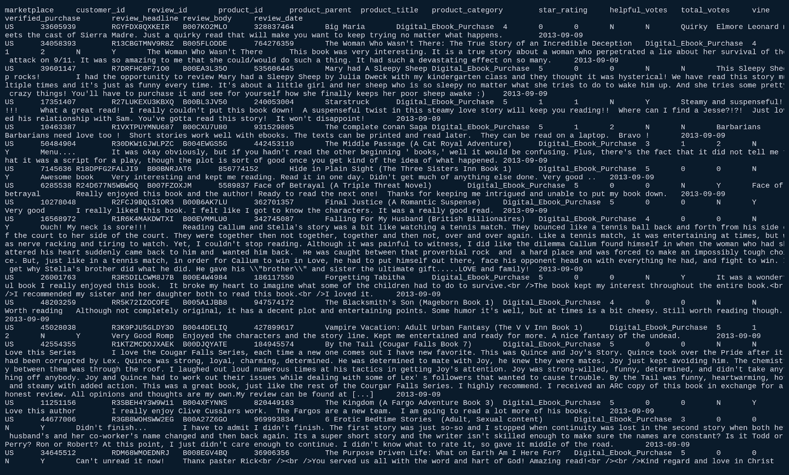
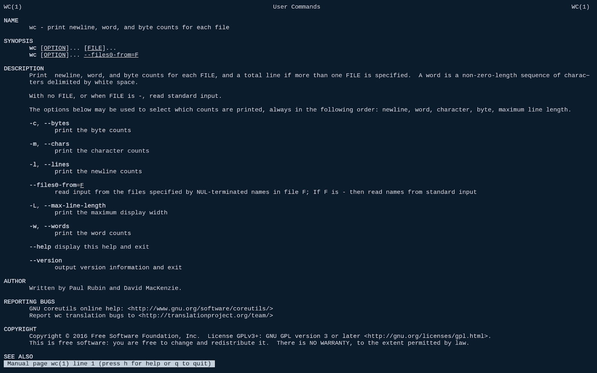
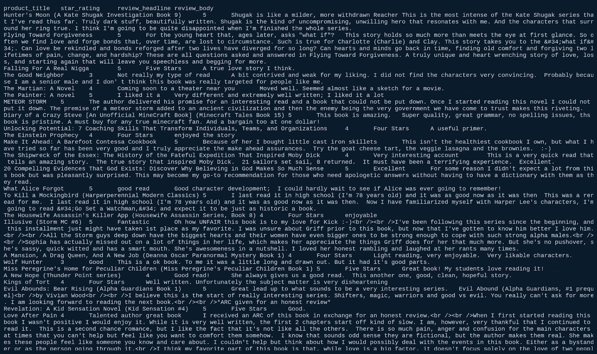
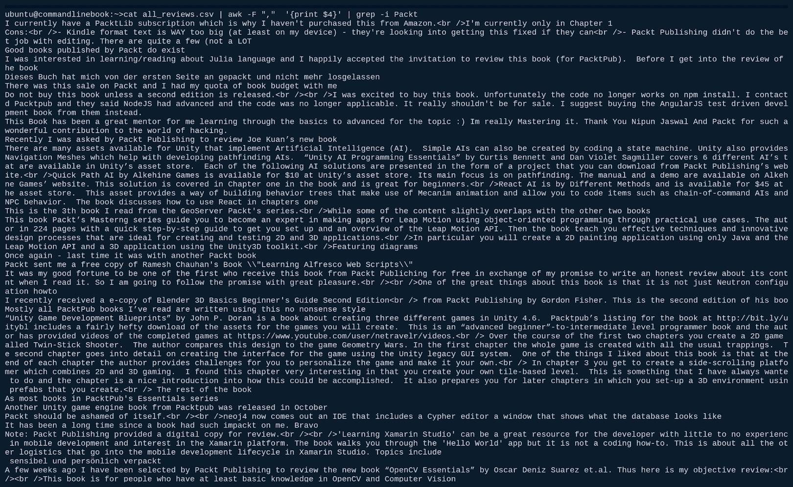
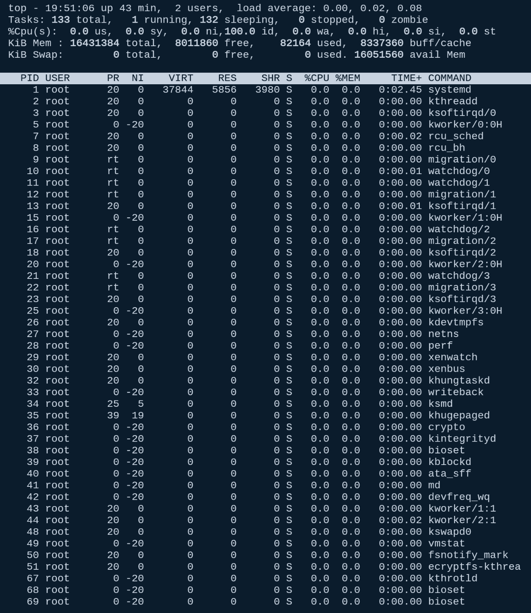
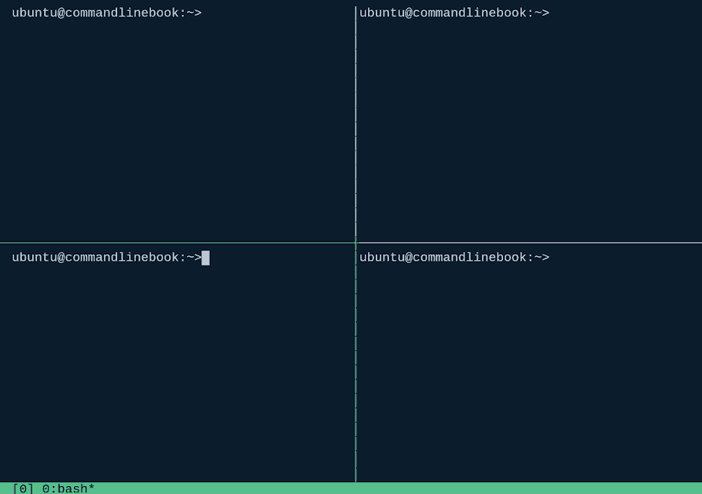

# 三、Shell 工作流、数据采集和信息处理

在这一章中，我们将使用一个实际的数据集并做一些基本的分析。我们将学习如何直接从命令行下载文件，确定文件的类型，并使用一些命令解析数据。我们还将介绍如何执行非交互式分离处理，并回顾一些常见的终端多路复用器，它们使我们能够美化命令行并组织分离处理。

在本章中，我们将讨论以下主题:

*   如何使用命令行下载数据集
*   使用内置工具检查数据及其类型
*   如何在 bash 中进行字数统计
*   使用一些简单的命令分析数据集
*   分离处理
*   终端复用器


# 下载数据

现在我们已经了解了命令行，让我们用它来做一些很酷的事情吧！假设我们有一对充满亚马逊书评的数据集，我们只想查看关于 Packt Publishing 的评论。首先，让我们继续获取数据(如果您使用 Docker 容器，数据位于`/data`):

```sh
curl -O https://s3.amazonaws.com/amazon-reviews-pds/tsv/amazon_reviews_us_Digital_Ebook_Purchase_v1_00.tsv.gz && curl -O https://s3.amazonaws.com/amazon-reviews-pds/tsv/amazon_reviews_us_Digital_Ebook_Purchase_v1_01.tsv.gz
```

您应该看到以下内容:


我们在这里引入了一些新的命令和特性来下载文件。首先，我们调用`curl`命令来下载文件。您可以运行`curl --help`来查看所有可用的选项，或者运行`man curl`，但是我们想要下载一个远程文件并将其保存为原始文件名，所以我们使用了`-O`选项。第二，注意双&符号(`&&`)？因为我们希望同时下载两个文件(没有错误)，所以双&符号允许我们将两个命令组合在一起。如果第一个命令失败，第二个命令将不会运行。

现在您可能会问自己，“如果我想运行多个命令，而我不在乎第一个命令是否失败，我希望它无论如何都要运行！”嗯，你很幸运！如果您用分号`ecoh "this isn't a command" ; echo "but this is"`替换双&符号，您应该看到以下内容:


如果你输错了一个命令，Ubuntu 会提供一个很好的小助手，并推荐你应该输入什么命令。如果您在另一个系统上运行它，您可能看不到它，但是您会看到 ecoh: command not found。


# 使用文件命令

一旦数据下载完成，让我们看看我们得到了什么。继续运行`ls -al amazon*`以确保文件确实下载了:


如果这个目录中还有其他名为`amazon`的东西，它也会显示出来。现在文件已经下载完毕，让我们引入一个新命令，名为`file`。继续运行下面的`file amazon*`命令:


哇，在没有设置任何参数的情况下，`file`命令能够判断出这是一个压缩的归档文件。您将经常使用`file`命令来确定您正在处理的文件的类型。让我们把这些文件解压缩，这样我们就可以使用它们了。这可能需要一点时间，取决于您的系统速度。

为此，请运行以下命令:

```sh
zcat amazon_reviews_us_Digital_Ebook_Purchase_v1_00.tsv.gz >> amazon_reviews_us_Digital_Ebook_Purchase_v1_00.tsv && zcat amazon_reviews_us_Digital_Ebook_Purchase_v1_01.tsv.gz >> amazon_reviews_us_Digital_Ebook_Purchase_v1_01.tsv
```

继续对新数据集再次运行`file`命令。注意到什么不同了吗？查看以下内容:


非常酷！`file`命令能够验证我们正在处理的是文本文件，看起来有很多很长的文本行。让我们来看一看其中一个数据集并对其进行采样，看看我们正在处理什么。为此，我们可以使用`more`命令:

```sh
more amazon_reviews_us_Digital_Ebook_Purchase_v1_01.tsv
```

我们将只对下载的第一个文件进行采样:



确实很长的队伍！你可以继续按空格键来查看文件(可能需要一段时间来阅读全部内容)，如果你想退出，只需按下 *Q* 键。别忘了点击`man more`了解更多信息。


# 进行字数统计

现在我们已经有了一些要处理的数据，让我们将这两个文件合并成一个文件。为此，请执行以下操作:

```sh
cat *.tsv > reviews.tsv
```

运行上述命令后，您应该会看到以下内容:


非常好。假设我们想要计算这个文件中有多少单词或行数。下面介绍一下`wc`命令。`wc`是(你猜对了)字数的简称。让我们快速的`man wc`来看看可用的选项:



看起来`wc`可以计算文件的行数和字数。让我们看看我们的文件实际有多少行:

```sh
wc -l reviews.tsv
```

运行上述命令后，您应该会看到以下内容:


台词真多啊！文字呢？运行以下命令:

```sh
wc -w reviews.tsv
```


这看起来是一个很好的数据集。无论如何，这都不是大数据，但我们可以用它做很多很酷的事情。例如，您注意到前面文件中的标题了吗？这有点难以看清，因为屏幕上显示了大量数据。让我们只去掉标题，看看我们有什么:

```sh
head -n1 reviews.tsv
```

运行上述命令后，您应该会看到以下内容:


很好，现在我们有了一个可以使用的头文件列表。让我们清理一下。假设我们只对`produce_title`、`star_rating`、`review_headline`和`review_body`列感兴趣。复制和粘贴整个文件需要几个小时，所以让我们引入一个叫做`cut`的新命令。


# 切割简介

在运行命令之前，让我们先把它分解一下。`cut`命令从文件的每一行删除部分。`-d`参数告诉`cut`我们正在使用一个 **tsv** ( **制表符分隔值**)，而`-f`参数告诉`cut`我们对哪些字段感兴趣。由于`product_title`是我们文件中的第六个字段，我们从它开始:

```sh
cut -d$'\t' -f 6,8,13,14 reviews.tsv | more
```

与大多数程序不同，cut 从 1 而不是 0 开始。

让我们看看结果:



好多了！让我们将它另存为一个新文件:

```sh
cut -d$'\t' -f 6,8,13,14 reviews.tsv > stripped_reviews.tsv
```

运行上述命令后，您应该会看到以下内容:


让我们看看单词`Packt`在这个数据集中出现了多少次:

```sh
grep -i Packt stripped_reviews.tsv | wc -w
```

运行上述命令后，您应该会看到以下内容:


让我们将它从`.tsv`转换到`.csv`，这样我们就有更多的结构可以使用了:

```sh
cat stripped_reviews.tsv | tr "\\t" "," > all_reviews.csv
```

运行上述命令后，您应该会看到以下内容:


现在让我们过滤掉所有包含单词`Packt`的评论:

```sh
cat all_reviews.csv | awk -F ","  '{print $4}' | grep -i Packt
```

运行上述命令后，您应该会看到以下内容:



有意思！使用您刚刚学习的命令，继续使用这个数据集。

我们会在[第五章](df05c890-510b-4e7e-8cc2-200f68f2febf.xhtml)、*循环、函数、字符串处理*中多讲讲`tr`命令；现在，不要担心它。


# 分离处理

分离处理在后台运行命令。这意味着当分离的进程在后台运行时，终端控制立即返回到 Shell 进程。有了作业控制，这些后台进程可以在前台恢复或直接终止。


# 如何设置流程的背景

还记得我们使用双&符号有条件地执行两个相继运行的命令吗？通过使用单个&符号，您可以在后台派生一个进程并让它运行。让我们使用命令保存到一个新文件并在后台运行:

```sh
cat all_reviews.csv | awk -F ","  '{print $4}' | grep -i Packt > background_words.txt &
```

这将采用前面的示例，但在后台运行，如下所示:


注意`<output> [1] 1504</output>`已打印(避免所有输出！)这表明作业已在后台成功运行。您可以运行`tail -F background_words.txt`在后台实时查看数据:


要将作业从**背景** ( **背景**)带回来，键入`fg`，您将流程带回到前台，如下所示:


继续在后台运行几个命令。您可以使用`jobs`命令查看它们。输入`man jobs`查看更多选项，随意查看`jobs`命令的手册页。


# 忽略 SIGHUP

默认情况下，命令附加到它们的控制命令行终端。当命令行终止时，子进程(后台或非后台)将被发送一个 SIGHUP，并且应该终止。假设您想要运行一个命令，并在注销后保持运行。这很方便，尤其是如果你在远程系统上工作，需要注销，或者你担心你与服务器的连接一直断开(我正看着你，美国国家铁路客运公司 WiFi)。

继续运行我们之前运行的命令，但是在开头添加`nohup`,就像这样:

```sh
nohup cat all_reviews.csv | awk -F ","  '{print $4}' | grep -i Packt > background_words.txt &
```

现在，通过键入`logout`或使用`control-d`退出 shell，然后重新启动 shell 并运行`tail` `-f background_words.txt`。您会注意到该命令仍然在后台运行，并且文件正在更新。您可能试图通过发出`fg`命令来恢复该命令，但发现它不起作用。请记住，该命令将一直运行，直到完成或失败，或者直到您完成该过程。通过做一个`man kill`随意检查`kill`的手册页，因为有很多选项可供选择。


# 终端复用器

现在让我们来看看`screen`命令，它将赋予你做许多不同事情的能力，我们将在下一节看到。


# 屏幕简介

到目前为止，您已经学会了如何在后台运行命令，并且已经掌握了`nohup`。现在该说说`screen`命令了。`screen`使您能够动态地附加和分离会话，即使在网络中断的情况下也能保持 Shell 活动，从多个位置断开和重新连接 Shell，与远程用户共享 Shell，以及在不保持活动会话的情况下保持长期运行的进程运行。

首先，让我们确保您已经安装了`screen`和`tmux`(我们稍后将使用`tmux`)。在 Ubuntu 中，运行以下命令:

```sh
 sudo apt install -y screen tmux
```

你可能已经安装了它(取决于你运行的是哪个版本的 Ubuntu)，但是安全总比后悔好。现在，让我们开始启动`screen`:

```sh
screen
```

您应该看到以下内容:


继续给团队送些披萨和啤酒(真的，这些人很棒！)并按空格键继续。你会注意到...嗯，其实什么都没变。命令提示符还是一样的，只是出现了一些关于版权和往哪里寄啤酒钱的信息。让我们继续运行一个名为`top`的新命令。顶部的命令(进程表)显示了当前正在运行的所有进程。来吧，试一试！

您的输出看起来会略有不同。

执行`top`:

```sh
top
```

运行`top`时:



佩服`top`的牛逼。如果您想知道什么占用了大量系统资源，这是一个非常有用的命令。

当`top`正在运行时，让我们继续从`screen`分离。键入以下内容:

```sh
<key>Ctrl+a</key> d
```

请注意，屏幕回到了一个干净的 Shell:


要检查`screen`会话是否仍处于活动状态，让我们继续运行`screen -r`。注意,`top`命令没有消失——它在一个屏幕会话中运行。最棒的是，您可以注销该会话，重新连接，并像什么都没发生一样附加`screen`会话。这对于从笔记本或任何需要断开连接的地方运行长流程非常有用。

继续运行多个`screen`会话。您可以通过运行`screen -list`来查看它们。


# 在多个用户之间共享屏幕会话

我们都有过这样的经历:当你看不到正在发生的事情时，试图远程解决某人的代码问题是一个非常痛苦的过程。用户可以通过执行以下操作来创建共享会话:

```sh
screen -d -m -S shared_screen
```

当您登录到同一台机器时，继续键入以下内容:

```sh
screen -x shared_screen
```


# tmux 简介

是最新的终端多路复用器，它有很多很棒的特性来增强你的命令行技能，并且提供了很多超越标准 shell 的特性。让我们启动它并检查一下:

```sh
tmux
```

当您运行`tmux`时，您应该会看到类似这样的内容:


tmux 命令的输出

需要记住的一点是，默认情况下，所有的`tmux`命令都需要前缀 *Ctrl* + *B* ，然后才能运行`tmux`命令。例如，让我们尝试几个。有一个 shell 窗口很好，但是有两个呢？


带有两个 shells 的 tmux 命令的输出

再来两个怎么样，但是在底部？

```sh
<key>Ctrl+b</key> “
<key>Ctrl+b</key> <key></key>
<key>Ctrl+b</key> “
```



很棒，对吧？继续根据您的喜好定制您的`tmux`会话。在`man`页面的`man tmux`中有很多选项可供选择。我们个人最喜欢的是`<key>Ctrl+b</key> : setw``<key>enter</key>`的`synchronize-panes`。现在，继续输入`top`。你注意到所有的窗格都是一样的吗？当您登录到多台服务器，并且需要在它们之间手动运行命令时，这就很方便了。


# 摘要

在这一章中，我们仅仅触及了命令行的皮毛。我们能够下载数据集，保存它，检查文件类型，并执行一些简单的分析。字数统计示例被认为是数据科学的“Hello，World ”,我们看到了在 bash 中执行它是多么容易。

然后，我们通过使用终端多路复用器和后台进程将您的 shell 定制提升到了一个新的水平。把它想象成使用 IDE，但是对于命令行。这将使 bash 的工作变得更加容易。

能够控制流程和工作流将提高生产率。分离处理确保程序可以不间断地完成。终端多路复用器提供了一种最大化利用屏幕空间的方法，同时还提供了一个独立的处理环境，这对所有人来说都是双赢的。

在下一章，我们将探索可重用的 shell bash 脚本和函数。