# 二、关键表现指标和可视化

当你开展营销活动或任何其他营销活动时，你很可能想知道每项活动的表现如何，并了解你每项营销活动的优缺点。在这一章中，我们将讨论常用的**关键表现指标**(**KPI**)来帮助你追踪营销工作的表现。更具体地说，我们将涵盖销售收入、**每次收购成本** ( **CPA** )、数字营销 KPI 和网站流量等 KPI。我们将了解这些 KPI 如何帮助您朝着营销目标前进。

在讨论了一些常用的 KPI 之后，我们将学习如何使用 Python 和/或 R 来计算这些 KPI 并构建这些 KPI 的可视化。在本章中，我们将使用一个银行营销数据集，展示金融机构营销活动的真实案例。对于 Python 项目，我们将学习如何使用`pandas`和`matplotlib`库来分析数据和构建可视化。对于 R 项目，我们将引入`dplyr`和`ggplot2`库来分析和操作数据并构建可视化。

特别是，我们将在本章中讨论以下主题:

*   KPI 用于衡量不同营销工作的表现
*   使用 Python 计算和可视化 KPI
*   使用 R 计算和可视化 KPI


# KPI 用于衡量不同营销工作的表现

每一次营销努力都会给公司带来成本。当你通过电子邮件开展营销活动时，发送每封电子邮件都要花费一些钱。当你在社交网络服务或广播媒体上进行营销时，也需要一些资本。由于每一项营销努力都与一些成本相关，因此关注营销活动的表现并跟踪营销活动的投资回报至关重要。我们将在这一部分主要讨论如何跟踪销售收入、CPA 和数字营销 KPI。


# 销货收入

很明显，所有营销努力的目标都是为公司创造和增加更多的收入。没有一家公司愿意花在营销上的钱超过它的收入。为了正确报告销售收入，您需要清楚地定义您希望如何将销售归因于您的每项营销工作。一些销售可能来自电子邮件营销活动，而另一些可能来自电视或公共交通上的广告。有些销售甚至会自然而然地出现，与你的营销活动没有任何关系。

为了正确地报告每一次营销活动带来的销售收入，你必须清楚地定义每一次营销活动的销售规则。例如，如果你是一家电子商务公司，并通过电子邮件和电视营销活动推广特价商品，你可能希望在电子邮件中放置不同于电视广告中的 URL。这样，你就可以识别和区分电子邮件营销活动的销售和电视营销活动的销售。

根据您的需要，您可能还希望报告时序销售收入数据。您可以用电子表格格式报告，如下所示:

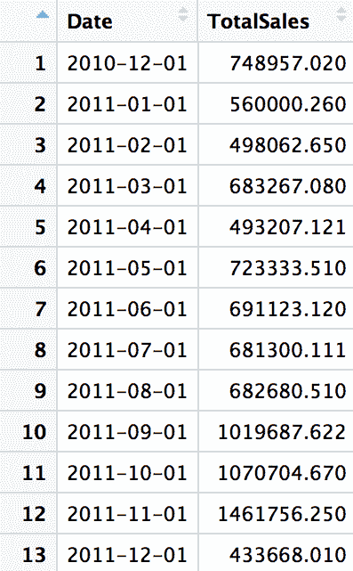

您还可以在折线图中报告时序销售收入数据，如下所示:

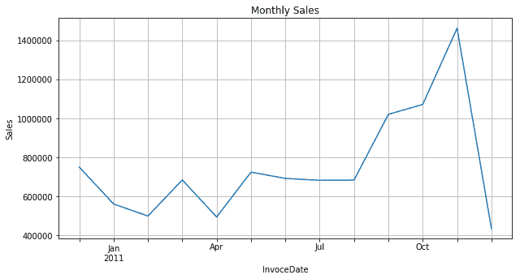

当我们在本章末尾完成 Python 和 R 练习时，我们将更多地讨论可用于报告 KPI 的不同类型的图表和数据可视化。


# 每次收购成本

另一种方式来看看你的营销工作的有效性是注册会计师。此 KPI 指标告诉您通过营销努力获得一个客户需要多少成本。高 CPA 意味着获得一个新客户的成本更高，而低 CPA 显然意味着获得一个新客户的成本更低。根据业务类型，你仍然可以用高 CPA 进行非常有利可图的营销活动。例如，如果你在销售一种非常豪华和高端的产品，目标客户群很小，获得这些客户的成本更高，你的 CPA 可能很高，但你获得的每个客户的价值可能更高，从而导致有利可图的营销活动。

我们将看看下面的假设情况:


如果你看看这张电子表格，就总成本和 CPA 而言，**欢乐时光活动**是最昂贵的营销活动。然而，它创造了最多的**销售额**和**每客户销售额**；因此，这是最有价值的运动。另一方面，**广播广告**是 CPA 营销活动中成本最低的，尽管总成本是第二高的，因为它帮助企业获得了最多的客户。然而，这些客户的总销售额并没有超过此次活动的总成本，并给公司带来了净亏损。

即使这是一个假设的情况，类似的情况也可能在现实生活中发生。营销努力，如**欢乐时光活动**和**网络研讨会**比**广播广告**有更好的目标客户。通过高针对性营销活动获得的客户质量比无针对性营销活动好很多倍。

现在，我们已经了解了如何分解营销活动结果以更深入地分析成本效益，接下来我们将了解一些数字营销常用的 KPI。


# 数字营销 KPI

随着营销渠道的选择进入在线空间，如社交网络服务、博客和搜索引擎，报告数字营销工作的表现变得越来越重要。之前讨论的 KPI、销售收入和每次收购的成本也适用于数字营销领域。

例如，基于个人归因逻辑，你可以分析通过不同的社交网络服务产生了多少销售额，例如脸书、LinkedIn 和 Instagram。还可以分析通过这样的营销渠道获得了多少客户，看看单个数字营销活动的 CPAs 和产生的价值是多少。让我们讨论一些更多的数字营销 KPI:

*   **点击率** ( **点击率**)是数字营销工作中另一个常用的关键表现指标。点击率是浏览过你的广告，然后继续点击广告的人的百分比。该公式如下所示:


点击率是数字营销渠道中的一个重要指标，因为它衡量的是你的在线营销为你的网站带来流量的效率。

*   然后，你可以用 **lead ratio** 来衡量有多少网站流量可以转化为 lead。通常情况下，只有网站流量的子集是一个很好的适合成为你的客户。这些**营销合格的潜在客户** ( **MQL** )是准备好营销的潜在客户，并且满足特定业务标准，根据他们的特征成为可能购买的客户。当你开始营销这些合格的线索，你也应该看看转化率。
*   **转化率**是潜在客户转化为活跃客户的百分比。你可以根据你的营销目标来定义什么应该被认为是转化。如果您的目标是查看有多少百分比的潜在客户成为了付费客户，那么您可以使用类似于下面的公式来计算转换率:


如果您的目标是查看在您的网站上注册的销售线索的百分比，那么您可以按照以下公式计算转换率:


到目前为止，我们已经查看了各种 KPI，并讨论了这些 KPI 如何帮助您跟踪营销工作的进展和表现。我们现在将看看如何使用 Python 和/或 R 来计算这样的 KPI 并构建可视化。如果您计划使用本书中使用的两种编程语言之一，Python 和 R，您可以跳到您想学习的部分。


# 使用 Python 计算和可视化 KPI

在本节中，我们将讨论如何使用 Python 来计算和可视化我们在前面几节中讨论过的 KPI。我们将主要关注使用银行营销数据分析转换率。对于那些想在这个练习中使用 R 的读者，您可以跳到下一节。我们将使用 Python 中的`pandas`和`matplotlib`库来操作和分析数据，并构建各种图表来准确报告营销工作的进展和表现。

在本部分的练习中，我们将使用*https://archive.ics.uci.edu/ml/datasets/bank+marketing 的*的银行营销数据集，可通过以下链接找到该数据集。你可以点击左上角的`Data Folder`链接，跟随这个链接下载数据。在这个练习中，我们下载了`bank-additional.zip`数据，我们将在这个压缩文件中使用`bank-additional-full.csv`文件。

当您打开这个`bank-additional-full.csv`文件时，您会注意到分号(`;`)被用作分隔符，而不是逗号(`,`)。为了加载这些数据，可以使用下面的代码将这些数据读入一个`pandas` `DataFrame`:

```py
import pandas as pd

df = pd.read_csv('../data/bank-additional-full.csv', sep=';')
```

从这段代码中可以看出，我们正在导入别名为`pd`的`pandas`库，并且我们正在使用`read_csv`函数来加载数据。对于逗号以外的分隔符，您可以使用`read_csv`函数中的`sep`参数定义一个自定义分隔符。

如果您查看数据下载页面中的字段描述([https://archive.ics.uci.edu/ml/datasets/bank+marketing](https://archive.ics.uci.edu/ml/datasets/bank+marketing))，输出变量`y`包含关于客户是否已订阅定期存款的信息，编码为`'yes'`或`'no'`。为了简化我们的转换率计算，我们将把这个变量编码为代表`'yes'`的`1`和代表`'no'`的`0`。您可以使用以下代码进行编码:

```py
df['conversion'] = df['y'].apply(lambda x: 1 if x == 'yes' else 0)
```

正如您在这段代码中看到的，我们使用`apply`函数将变量`y`的`'yes'`编码为`1`，将`'no'`编码为`0`，然后将编码后的数据添加为新列`conversion`。Jupyter 笔记本中的代码和加载的数据如下所示:

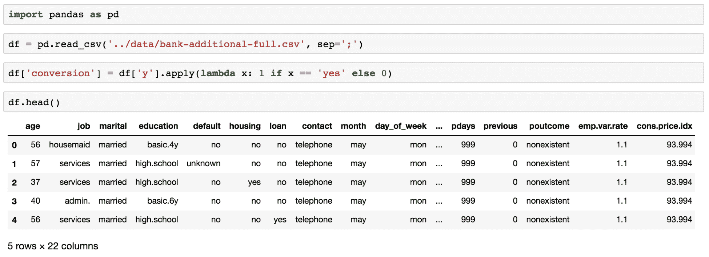

现在我们已经成功地将数据读入到`pandas` `DataFrame`中，我们将开始研究如何使用各种方法和图表来分析和可视化转化率。


# 总转换率

首先，我们要看看总转换率。我们可以通过将订阅定期存款的客户总数除以数据中的客户总数来计算这一指标。由于我们已经在名为`conversion`的列中为已经转换的人将输出变量编码为`1`，为没有转换的人将输出变量编码为`0`，因此我们可以简单地对该列求和以获得转换的总数。

以下代码片段显示了我们如何对`conversion`列求和，并获得数据中的客户端总数:

```py
# total number of conversions
df.conversion.sum()
# total number of clients in the data (= number of rows in the data)
df.shape[0]
```

下面是我们在 Jupyter 笔记本中计算转换率的代码:


正如您在 Jupyter 笔记本中看到的代码输出，我们已经从总共`41188`家银行客户中转化了`4640`家客户，这表明总转化率为`11.27%`。在下一节中，我们将分析这些转换率是如何随着不同的年龄组而变化的。


# 按年龄分列的转换率

总转化率告诉我们营销活动的整体表现。然而，它并没有给我们太多的洞察力。当我们报告和跟踪营销工作的进展时，我们通常希望更深入地研究数据，将客户群细分为多个细分市场，并计算各个细分市场的 KPI。我们将首先通过`age`把我们的数据分成更小的部分，看看不同年龄组的转换率有什么不同。

我们将首先看下面的代码:

```py
conversions_by_age = df.groupby(
    by='age'
)['conversion'].sum() / df.groupby(
    by='age'
)['conversion'].count() * 100.0
```

从这段代码中可以看出，我们使用了`groupby`函数来计算每个年龄的转换率。

我们首先按变量名`age`分组，并使用`sum`函数对`conversion`列求和，以获得每个年龄的转换总数。然后，我们再次按`age`分组，并使用`count`函数计算每个`age`组中的记录数。

使用这两个计算，我们可以计算每个`age`的转换率，如代码所示。每个`age`的部分计算转换率如下:

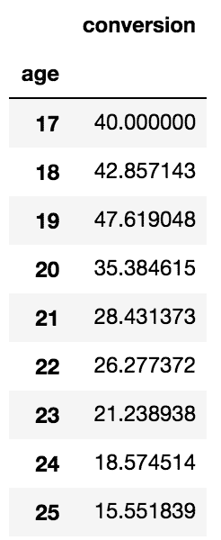

另一种查看不同年龄客户转化率的方法是绘制一个折线图，如下图所示:

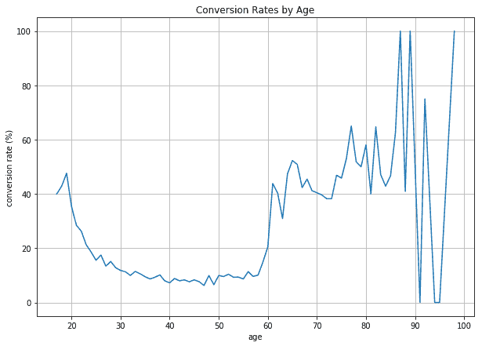

显示不同年龄之间转换率的代码如下所示:

```py
ax = conversions_by_age.plot(
    grid=True,
    figsize=(10, 7),
    title='Conversion Rates by Age'
)

ax.set_xlabel('age')
ax.set_ylabel('conversion rate (%)')

plt.show()
```

如这段代码所示，我们使用之前构建的`conversions_by_age`变量和用于折线图的`plot`函数。正如您在这段代码中看到的，您可以通过一个名为`figsize`的参数和一个名为`title`的参数来改变图形的大小。为了改变 *x* 轴和 *y* 轴的标签，可以使用`set_xlabel`和`set_ylabel`功能。

在之前的折线图中有一点值得注意，那就是老年群体中似乎有很多噪音。那些年龄在`70`或以上的人的转化率变化很大，如果你看看数据，这主要是因为与其他年龄组相比，这个年龄组的客户数量相对较少。

为了减少这种不必要的噪音，我们可以将多个年龄组合在一起。在本练习中，我们根据银行客户的年龄将他们分为六个不同的组——在`18`和`30`之间，在`30`和`40`之间，`40`和`50`之间，`50`和`60`之间，`60`和`70`之间，以及`70`以上。以下代码可用于将客户端分组到相应的组中:

```py
df['age_group'] = df['age'].apply(
    lambda x: '[18, 30)' if x < 30 else '[30, 40)' if x < 40 \
        else '[40, 50)' if x < 50 else '[50, 60)' if x < 60 \
        else '[60, 70)' if x < 70 else '70+'
)
```

看看这段代码，我们在列`age`上使用了`apply`函数，将客户分成六个不同的年龄组，并将这些数据添加到一个名为`age_group`的新列中。为了计算这些新创建的年龄组的转换率，我们可以使用以下代码:

```py
conversions_by_age_group = df.groupby(
    by='age_group'
)['conversion'].sum() / df.groupby(
    by='age_group'
)['conversion'].count() * 100.0
```

与前面的例子类似，我们使用`groupby`、`sum`和`count`函数来计算这六个不同年龄组的转换率。结果数据如下图所示:

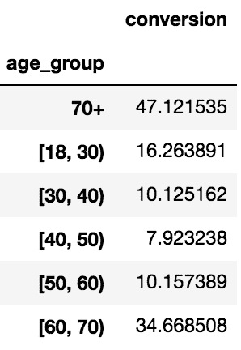

从这里可以看出，每个年龄组的差异比以前小得多，尤其是在老年组。我们可以使用条形图来显示这些数据，如下面的屏幕截图所示:

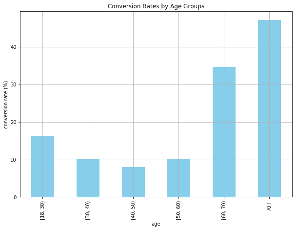

构建该条形图的代码如下所示:

```py
ax = conversions_by_age_group.loc[
    ['[18, 30)', '[30, 40)', '[40, 50)', '[50, 60)', '[60, 70)', '70+']
].plot(
    kind='bar',
    color='skyblue',
    grid=True,
    figsize=(10, 7),
    title='Conversion Rates by Age Groups'
)

ax.set_xlabel('age')
ax.set_ylabel('conversion rate (%)')

plt.show()
```

正如您在这段代码中看到的，我们使用了之前构建线图时使用的相同的`plot`函数。唯一的区别是`kind`参数，通过它我们可以定义我们想要构建的不同类型的地块。这里，我们给这个`kind`参数一个`bar`值来构建一个柱状图。

可以在下面的资源库中找到完整代码:[https://github . com/Yoon hwang/hands-on-data-science-for-marketing/blob/master/ch . 2/python/conversion rate . ipynb](https://github.com/yoonhwang/hands-on-data-science-for-marketing/blob/master/ch.2/python/ConversionRate.ipynb)。


# 转换与非转换

我们可以关注的另一件事是转化客户和非转化客户之间的人口统计学差异。这种类型的分析可以帮助我们在营销活动中识别转化群体与非转化群体的区别，并帮助我们更好地了解我们的目标客户以及哪种类型的客户对我们的营销工作有更好的反应。在这个练习中，我们将比较转化组和非转化组的婚姻状况分布。

我们将首先统计每种婚姻状况的转换和不转换的数量。下面的代码显示了我们如何使用`pandas`函数来计算:

```py
pd.pivot_table(df, values='y', index='marital', columns='conversion', aggfunc=len)
```

从这段代码中可以看出，我们使用了`pandas`库中的`pivot_table`函数。我们按列`marital`和`conversion`分组，其中`marital`将成为索引，`conversion`将成为新`DataFrame`的列。使用`aggfunc`参数，我们可以提供想要执行的聚合类型。这里，我们使用`len`函数简单地计算每个组的客户端数量。结果数据如下图所示:

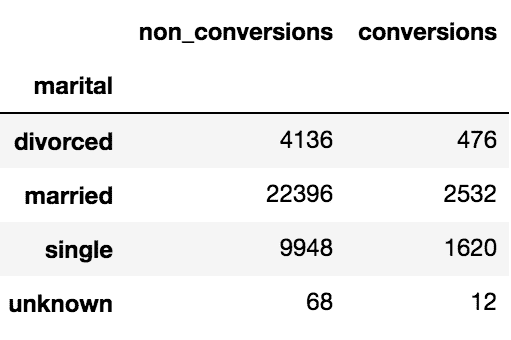

表示这些数据的另一种方式是使用饼图，如下所示:

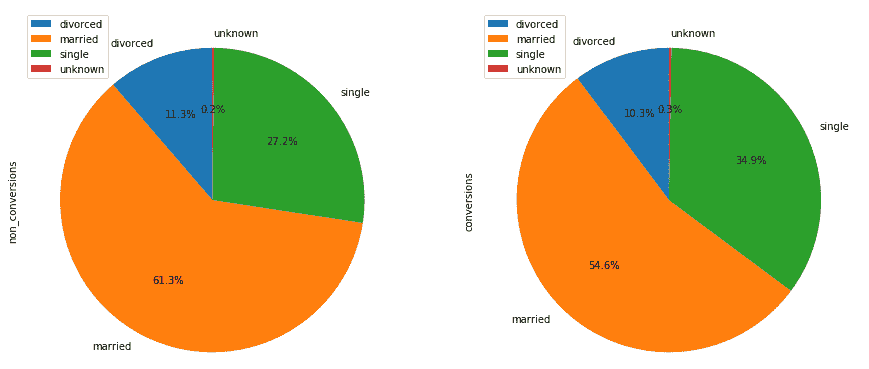

以下代码显示了我们如何构建这些饼图:

```py
conversions_by_marital_status_df.plot(
    kind='pie',
    figsize=(15, 7),
    startangle=90,
    subplots=True,
    autopct=lambda x: '%0.1f%%' % x
)

plt.show()
```

正如您从这段代码中看到的，我们使用了与之前相同的`plot`函数，但是使用了`pie`作为我们想要构建的绘图类型。您可以使用`autopct`参数来格式化饼图中每个组的标签。

与数据输出的表格格式相比，饼图更容易理解数据的总体分布。通过饼状图，我们可以很容易地看到，`married`组在转化组和非转化组中所占的比例最大，而`single`组次之。使用饼图，我们可以很容易地看到两组之间的相似之处和不同之处。


# 按年龄和婚姻状况的转换

到目前为止，我们已经根据一个标准汇总了我们的数据。但是，在某些情况下，您希望按多列对数据进行分组。在本节中，我们将讨论如何通过多个标准来分析和报告转化率。作为练习，我们将使用在上一节中建立的年龄组和婚姻状况作为分组依据的两列。

让我们先来看看代码:

```py
age_marital_df = df.groupby(['age_group', 'marital'])['conversion'].sum().unstack('marital').fillna(0)

age_marital_df = age_marital_df.divide(
    df.groupby(
        by='age_group'
    )['conversion'].count(), 
    axis=0
)
```

从这段代码中可以看出，我们按照两列`age_group`和`marital`对数据进行分组，并对转换次数进行求和。然后，我们将其除以每组中的客户端总数。结果数据如下图所示:

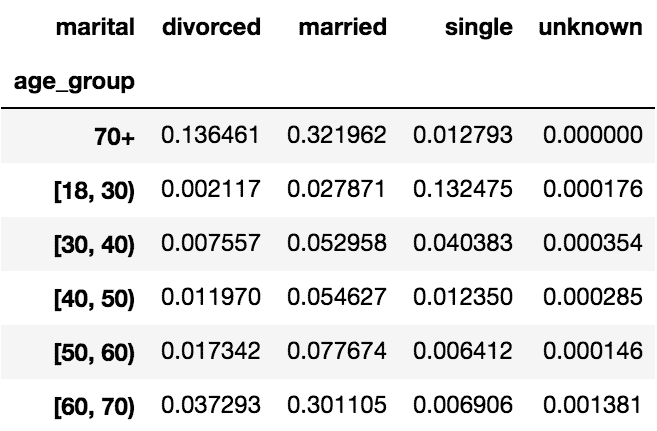

正如你从这个数据中看到的，我们现在可以看到基于两个标准的转化率分布，年龄组和婚姻状况。比如单身且年龄在 **18** 到 **30** 之间的客户转化率为 13.25%，而已婚且年龄在 **60** 到 **70** 之间的客户转化率为 30.11%。可视化该数据的另一种方法是使用如下所示的条形图:

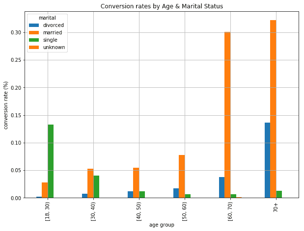

在这个条形图中，我们可以很容易地看到每个年龄和婚姻状况组的转换率分布。我们用来构建该条形图外观的代码如下所示:

```py
ax = age_marital_df.loc[
    ['[18, 30)', '[30, 40)', '[40, 50)', '[50, 60)', '[60, 70)', '70+']
].plot(
    kind='bar', 
    grid=True,
    figsize=(10,7)
)

ax.set_title('Conversion rates by Age & Marital Status')
ax.set_xlabel('age group')
ax.set_ylabel('conversion rate (%)')

plt.show()
```

与前面的例子类似，我们使用了`pandas`库的`plot`函数，并将`bar`传递给函数的`kind`参数。由于`DataFrame`、`age_marital_df`对于每种婚姻状况有四列，并且是按年龄组索引的，因此`plot`函数为每个年龄组的每种婚姻状况构建了一个具有四个条形图的条形图。

如果您想要为每个年龄组堆叠这四个条形图，那么您可以使用以下代码来构建堆叠条形图:

```py
ax = age_marital_df.loc[
    ['[18, 30)', '[30, 40)', '[40, 50)', '[50, 60)', '[60, 70)', '70+']
].plot(
    kind='bar', 
    stacked=True,
    grid=True,
    figsize=(10,7)
)

ax.set_title('Conversion rates by Age & Marital Status')
ax.set_xlabel('age group')
ax.set_ylabel('conversion rate (%)')

plt.show()
```

正如您在这段代码中看到的，唯一的区别是我们在这段代码中使用的参数`stacked`。当该参数设置为`True`时，它将构建一个堆积条形图，如下所示:

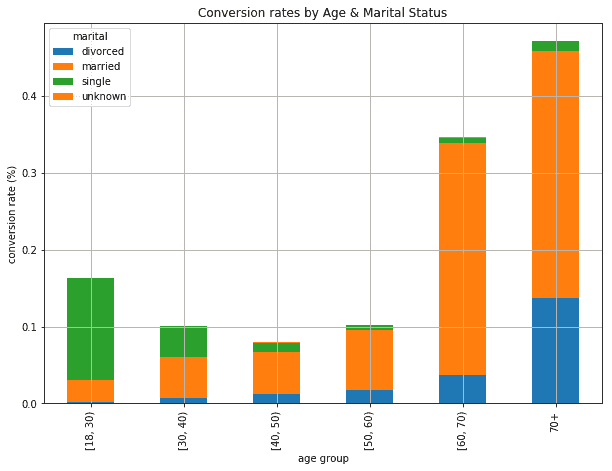

从这个堆积条形图中可以看出，每个年龄组的不同婚姻状况相互叠加。这样，我们不仅可以很容易地看到不同年龄组转化率的总体趋势，还可以看到每个年龄组中不同婚姻状况的转化客户的比例。

我们在这个 Python 练习中使用的完整代码和 Jupyter 笔记本可以在下面的存储库中找到:[https://github . com/Yoon hwang/hands-on-data-science-for-marketing/blob/master/ch . 2/Python/conversion rate . ipynb](https://github.com/yoonhwang/hands-on-data-science-for-marketing/blob/master/ch.2/python/ConversionRate.ipynb)。


# 使用 R 计算和可视化 KPI

在这一节中，我们将讨论如何使用 R 来计算和可视化我们在前面几节中讨论过的 KPI。我们将主要关注使用银行营销数据分析转换率。对于那些想使用 Python 做这个练习的读者，可以在前一节中找到 Python 练习。我们将使用 R 中的`dplyr`和`ggplot2`库来操作和分析数据，并构建各种图表来准确报告营销工作的进展和表现。`dplyr`库为数据科学和机器学习任务的数据操作提供了各种功能。

在本部分的练习中，我们将使用**https://archive.ics.uci.edu/ml/datasets/bank+marketing[的**银行营销数据集**。你可以点击左上角的`Data Folder`链接，跟随这个链接下载数据。在这个练习中，我们下载了`bank-additional.zip`数据，我们将在这个压缩文件中使用`bank-additional-full.csv`文件。](https://archive.ics.uci.edu/ml/datasets/bank+marketing)**

当您打开这个`bank-additional-full.csv`文件时，您会注意到分号(`;`)被用作分隔符，而不是逗号(`,`)。为了加载这些数据，您可以使用下面的代码将这些数据读入一个`DataFrame`:

```py
conversionsDF <- read.csv(
  file="~/Documents/data-science-for-marketing/ch.2/data/bank-additional-full.csv", 
  header=TRUE, 
  sep=";"
)
```

从这段代码中可以看出，我们使用了`read.csv`函数来加载数据。对于逗号以外的分隔符，您可以使用`read.csv`函数中的`sep`参数定义一个自定义分隔符。如果您的数据文件包含标题行，您可以将参数`header`设置为`TRUE`。另一方面，如果您的数据文件不包含标题行，并且数据从第一行开始，您可以将其设置为`FALSE`。

如果您查看数据下载页面中的字段描述([https://archive.ics.uci.edu/ml/datasets/bank+marketing](https://archive.ics.uci.edu/ml/datasets/bank+marketing))，输出变量`y`包含关于客户是否已订阅定期存款的信息，编码为`'yes'`或`'no'`。为了简化我们的转换率计算，我们将把这个变量编码为代表`'yes'`的`1`和代表`'no'`的`0`。您可以使用以下代码进行编码:

```py
# Encode conversions as 0s and 1s
conversionsDF$conversion <- as.integer(conversionsDF$y) - 1
```

正如您在这段代码中看到的，我们使用`as.integer`函数将变量`y`的`'yes'`编码为`1`，将`'no'`编码为`0`，然后将编码后的数据添加为新列`conversion`。由于默认情况下`as.integer`函数将使用`1`和`2`进行`'no'`和`'yes'`编码，所以我们用`1`减去这些值。在我们的 RStudio 中，数据现在如下所示:


现在我们已经成功地将数据读入`R` `DataFrame`，我们将开始研究如何使用各种方法和图表来分析和可视化转换率。


# 总转换率

首先，我们要看的是总转化率。我们可以通过将订阅定期存款的客户总数除以数据中的客户总数来计算这一指标。由于我们已经在一个名为`conversion`的列中将已经转换的输出变量编码为 1，将没有转换的输出变量编码为 0，因此我们可以简单地对该列求和以获得转换的总数。以下代码片段显示了我们如何对`conversion`列求和，并获得数据中的客户端总数:

```py
# total number of conversions
sum(conversionsDF$conversion)

# total number of clients in the data (= number of records in the data)
nrow(conversionsDF)
```

正如您在这段代码中看到的，我们使用 R 中的`sum`函数计算转换总数，使用`nrow`函数计算数据集中的行数。另外，与`nrow`一样，您可以使用`ncol`函数来计算`DataFrame`的列数。

下面的屏幕截图显示了 RStudio 上的代码:


从 RStudio 中的代码输出可以看出，我们已经从总共`41188`个银行客户中转化了`4640`个客户，这表明总转化率为`11.27%`。在下一节中，我们将分析这些转换率是如何随着不同的年龄组而变化的。我们使用`sprintf`函数用整数和浮点数格式化一个字符串。


# 按年龄分列的转换率

总转化率告诉我们营销活动的整体表现。然而，它并没有给我们太多的洞察力。当我们报告和跟踪营销工作的进展时，我们通常希望更深入地研究数据，将客户群细分为多个细分市场，并计算各个细分市场的 KPI。我们首先将我们的数据按年龄细分，看看不同年龄组的转换率有什么不同。

我们将首先看下面的代码:

```py
conversionsByAge <- conversionsDF %>% 
  group_by(Age=age) %>% 
  summarise(TotalCount=n(), NumConversions=sum(conversion)) %>%
  mutate(ConversionRate=NumConversions/TotalCount*100.0)
```

在这段代码中，管道操作符`%>%`是您可以顺序应用不同函数的方式。在这段代码中，我们将`conversionDF`传递给一个`group_by`函数，然后将这个`group_by`函数的结果传递给`summarise`函数，最后传递给`mutate`函数。

在`group_by`函数中，我们通过列`age`对`DataFrame`进行分组。然后，对于每个年龄组，我们通过使用函数`n()`，并将其命名为`TotalCount`，来计算每个组中的记录数量。同样，我们通过使用`sum`函数对每个年龄组的列`conversion`求和，并将其命名为`NumConversions`。

最后，我们使用`mutate`函数来计算每个年龄组的转换率，该函数在保留原来的`DataFrame`的同时添加了新的变量。正如你所看到的，我们简单地将`NumConversion`除以`TotalCount`，再乘以`100.0`，就可以得到转换率。

结果数据如下面的屏幕截图所示:

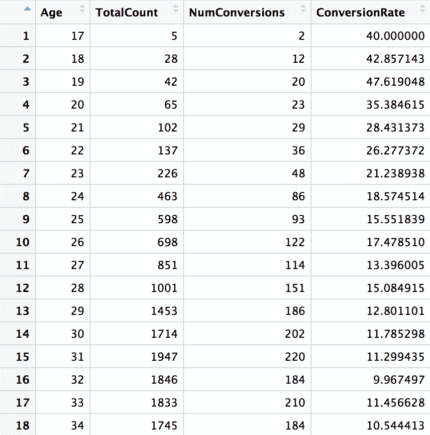

另一种查看不同年龄客户转化率的方法是绘制一个折线图，如下图所示:

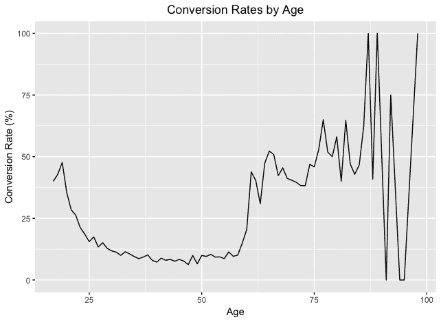

显示不同年龄之间转换率的代码如下所示:

```py
# line chart
ggplot(data=conversionsByAge, aes(x=Age, y=ConversionRate)) +
  geom_line() +
  ggtitle('Conversion Rates by Age') +
  xlab("Age") +
  ylab("Conversion Rate (%)") +
  theme(plot.title = element_text(hjust = 0.5))
```

从这段代码中可以看出，我们使用了`ggplot`函数来初始化一个`ggplot`对象，将`conversionsByAge`作为数据，将`Age`列作为 *x* 轴，将`ConversionRate`列作为 *y* 轴。

然后，我们使用`geom_line`函数连接观察值并创建一个折线图。通过使用`ggtitle`功能，您可以更改图的标题。此外，您可以使用`xlab`和`ylab`功能分别重命名 x 轴标签和 y 轴标签。

在之前的折线图中有一点值得注意，那就是老年群体中似乎有很多噪音。对于 70 岁或以上的人来说，转换率变化很大，如果你看一下数据，这主要是因为与其他年龄组相比，这个年龄组的客户数量相对较少。

为了减少这种不必要的噪音，我们可以将多个年龄组合在一起。在本练习中，我们根据银行客户的年龄将他们分为六个不同的组——在`18`和`30`之间，在`30`和`40`之间，`40`和`50`之间，`50`和`60`之间，`60`和`70`之间，以及`70`以上。以下代码可用于将客户端分组到相应的组中:

```py
# b. by age groups
conversionsByAgeGroup <- conversionsDF %>% 
  group_by(AgeGroup=cut(age, breaks=seq(20, 70, by = 10)) ) %>% 
  summarise(TotalCount=n(), NumConversions=sum(conversion)) %>%
  mutate(ConversionRate=NumConversions/TotalCount*100.0)

conversionsByAgeGroup$AgeGroup <- as.character(conversionsByAgeGroup$AgeGroup)
conversionsByAgeGroup$AgeGroup[6] <- "70+"
```

和前面的例子一样，我们使用`group_by`函数按照`age`列对`conversionsDF`数据进行分组。这里的区别是我们如何使用`cut`函数为每个年龄组创建年龄范围。

`breaks`参数定义了`cut`函数分割`DataFrame`的点。参数`seq(20, 70, by = 10)`意味着我们将创建一个从`20`到`70`的序列，增量为`10`。数据一旦按这几个年龄段分组，剩下的就和以前一样了。我们使用`summarise`和`mutate`函数来计算`TotalCount`、`NumConversions`和`ConversionRate`列。

产生的`DataFrame`如下面的截图所示:

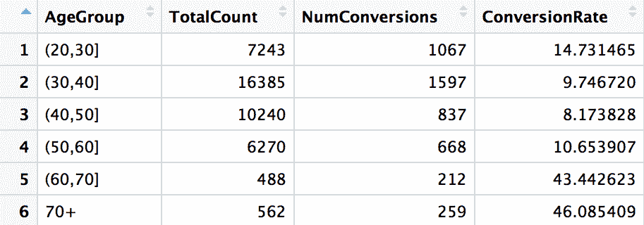

从这里可以看出，每个年龄组的差异比以前小得多，尤其是在老年组。我们可以使用条形图来直观显示这些数据，如下所示:

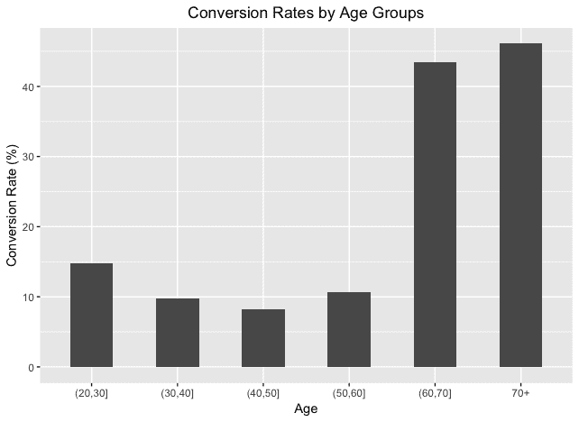

构建该条形图的代码如下所示:

```py
# bar chart
ggplot(conversionsByAgeGroup, aes(x=AgeGroup, y=ConversionRate)) +
  geom_bar(width=0.5, stat="identity") +
  ggtitle('Conversion Rates by Age Groups') +
  xlab("Age") +
  ylab("Conversion Rate (%)") +
  theme(plot.title = element_text(hjust = 0.5)) 
```

从这段代码中可以看出，我们将`conversionsByAgeGroup`数据传递给了`ggplot`对象，其中`AgeGroup`列作为 *x* 轴，而`ConversionRate`列作为 *y* 轴。我们正在使用`geom_bar`函数来构建一个条形图。

`width`参数定义条形图中每个条形的宽度。与前面的折线图类似，您可以使用`ggtitle`来重命名绘图的标题，使用`xlab`和`ylab`函数来重命名 *x* 轴和 *y* 轴的标签。

您可以在以下资源库中找到完整代码:[https://github . com/Yoon hwang/hands-on-data-science-for-marketing/blob/master/ch . 2/R/conversion rate。R](https://github.com/yoonhwang/hands-on-data-science-for-marketing/blob/master/ch.2/R/ConversionRate.R) 。


# 转换与非转换

我们可以关注的另一件事是转化客户和非转化客户之间的人口统计学差异。这种类型的分析可以帮助我们在营销活动中识别转化群体与非转化群体的区别，并帮助我们更好地了解我们的目标客户以及哪种类型的客户对我们的营销工作有更好的反应。在这个练习中，我们将比较转化组和非转化组的婚姻状况分布。

我们将首先统计每种婚姻状况的转换和不转换的数量。下面的代码显示了我们如何使用`R`函数来计算:

```py
conversionsByMaritalStatus <- conversionsDF %>% 
 group_by(Marital=marital, Conversion=conversion) %>% 
 summarise(Count=n())
```

从这段代码中可以看出，我们在`dplyr`包中使用管道操作符`%>%`，将`DataFrame`、`conversionsDF`传递给`group_by`函数，然后传递给`summarise`函数。在`group_by`函数中，我们通过两列`marital`和`conversion`进行分组。在`summarise`函数中，我们只是通过使用`n`函数来计算每个组中的记录数。

结果数据如下面的屏幕截图所示:

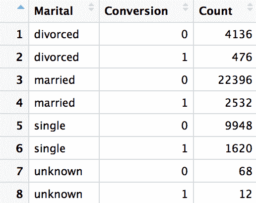

表示这些数据的另一种方式是使用饼图:

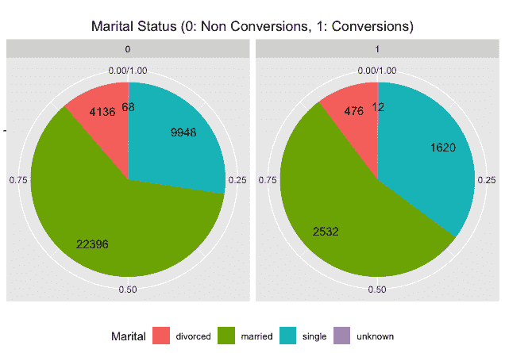

下面的代码展示了我们如何在 R 中构建这些饼图:

```py
# pie chart
ggplot(conversionsByMaritalStatus, aes(x="", y=Count, fill=Marital)) + 
  geom_bar(width=1, stat = "identity", position=position_fill()) +
  geom_text(aes(x=1.25, label=Count), position=position_fill(vjust = 0.5)) +
  coord_polar("y") +
  facet_wrap(~Conversion) +
  ggtitle('Marital Status (0: Non Conversions, 1: Conversions)') +
  theme(
    axis.title.x=element_blank(),
    axis.title.y=element_blank(),
    plot.title=element_text(hjust=0.5),
    legend.position='bottom'
  )
```

为了在 R 中构建饼图，我们使用相同的`geom_bar`函数，就像我们在构建条形图一样。这里的区别是`coord_polar("y")`，将条形图转化为饼状图。然后，我们使用`facet_wrap`函数按列`Conversion`创建两列饼图。这构建了两个饼图，一个用于转化率组，另一个用于非转化率组。

与数据输出的表格格式相比，饼图更容易理解数据的总体分布。通过饼状图，我们很容易看到`married`组在转化组和非转化组中所占的比例最大，而`single`组次之。使用饼图，我们可以很容易地看到两组之间的相似之处和不同之处。


# 按年龄和婚姻状况的转换

到目前为止，我们已经根据一个标准汇总了我们的数据。但是，在某些情况下，您希望按多列对数据进行分组。在本节中，我们将讨论如何通过多个标准来分析和报告转化率。作为练习，我们将使用在上一节中建立的年龄组和婚姻状况作为分组依据的两列。

让我们先来看看代码:

```py
#### 5\. Conversions by Age Groups & Marital Status ####
conversionsByAgeMarital <- conversionsDF %>% 
  group_by(AgeGroup=cut(age, breaks= seq(20, 70, by = 10)), Marital=marital) %>% 
  summarise(Count=n(), NumConversions=sum(conversion)) %>%
  mutate(TotalCount=sum(Count)) %>%
  mutate(ConversionRate=NumConversions/TotalCount)

conversionsByAgeMarital$AgeGroup <- as.character(conversionsByAgeMarital$AgeGroup)
conversionsByAgeMarital$AgeGroup[is.na(conversionsByAgeMarital$AgeGroup)] <- "70+"
```

类似于我们构建定制年龄组时，我们使用`group_by`中的`cut`函数来创建从`20`到`70`的年龄组，以`10`为增量。但是，我们这次也是按列`marital`分组。

然后，我们使用`summarise`函数来计算每个组`Count`中的记录数，以及每个组`NumConversions`中的转换数。然后，使用`mutate`函数，我们计算每个年龄组的总计数，命名为`TotalCount`，以及每个年龄组的转化率，命名为`ConversionRate`。

结果数据如下面的屏幕截图所示:

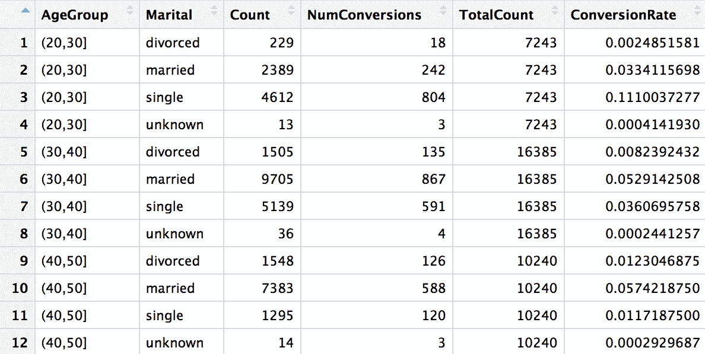

正如你从这个数据中看到的，我们现在可以看到基于两个标准的转化率分布，年龄组和婚姻状况。例如，单身且年龄在 **20** 至 **30** 之间的客户转化率为 11.10%，而已婚且年龄在 **40** 至 **50** 之间的客户转化率为 5.74%。

可视化该数据的另一种方法是使用条形图:

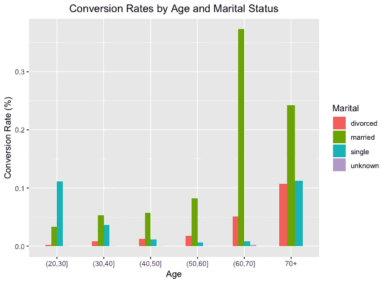

在这个条形图中，我们可以很容易地看到每个年龄和婚姻状况组的转换率分布。我们用于构建该条形图的代码如下所示:

```py
# bar chart
ggplot(conversionsByAgeMarital, aes(x=AgeGroup, y=ConversionRate, fill=Marital)) + 
  geom_bar(width=0.5, stat="identity", position="dodge") +
  ylab("Conversion Rate (%)") +
  xlab("Age") +
  ggtitle("Conversion Rates by Age and Marital Status") +
  theme(plot.title=element_text(hjust=0.5))
```

这里，我们用`conversionsByAgeMarital`数据创建一个`ggplot`对象。我们使用`AgeGroup`表示 *x* 轴，使用`ConversionRate`表示 *y* 轴，而我们使用`Marital`列来表示不同类型的婚姻状况。然后，我们使用`geom_bar`函数构建一个条形图。使用这种配置，`ggplot`构建了一个按婚姻状况细分的年龄组转换率柱状图，我们在前面的柱状图中看到过。

如果您想要为每个年龄组堆叠这四个条形图，那么您可以使用以下代码来构建堆叠条形图:

```py
# stacked bar chart
ggplot(conversionsByAgeMarital, aes(x=AgeGroup, y=ConversionRate, fill=Marital)) + 
  geom_bar(width=0.5, stat="identity", position="stack") +
  ylab("Conversion Rate (%)") +
  xlab("Age") +
  ggtitle("Conversion Rates by Age and Marital Status") +
  theme(plot.title=element_text(hjust=0.5))
```

从这段代码中可以看出，唯一的区别是`geom_bar`函数中的代码`position="stack"`。如果您将值`"dodge"`传递给`geom_bar`函数的这个`position`参数，它将创建一个未堆叠的条形图。然而，如果您将值`"stack"`传递给`geom_bar`函数的这个`position`参数，它将构建一个堆积条形图，如下所示:


从这个堆积条形图中可以看出，每个年龄组的不同婚姻状况相互叠加。这样，我们不仅可以很容易地看到不同年龄组转化率的总体趋势，还可以看到每个年龄组中不同婚姻状况的转化客户的比例。

我们在这个 R 练习中使用的完整代码可以在下面的存储库中找到:[https://github . com/Yoon hwang/hands-on-data-science-for-marketing/blob/master/ch . 2/R/conversion rate。R](https://github.com/yoonhwang/hands-on-data-science-for-marketing/blob/master/ch.2/R/ConversionRate.R) 。


# 摘要

在本章中，我们讨论了如何使用描述性分析来报告和分析营销工作的进展和表现。我们已经讨论了市场营销中经常使用的各种 KPI 来跟踪营销活动的进展。我们已经了解到，观察每种营销策略产生的销售收入有多重要。在分析销售收入指标时，我们发现从不同的角度进行分析非常重要。您可能不仅要查看总销售收入，还要查看时间序列(每月、每季度或每年)的销售收入。您可能还想查看每个营销活动的销售额，以及每个营销活动为您的公司带来的收入。我们还讨论了 CPA 指标，用它你可以说出你的营销策略的成本效益。我们还学习了用于分析数字营销渠道的各种指标，如点击率、线索比率和转化率。正如我们在 Python 和 R 练习中所看到和实验的，我们可以深入这些 KPI 指标的多个层次。

在下一章，我们将学习如何应用数据科学和机器学习技术进行解释性分析。更具体地说，我们将讨论如何使用回归分析和模型来理解营销参与背后的驱动因素。我们还将在下一章介绍如何解释回归分析的结果。