# 十、数据驱动的客户细分

在市场营销中，我们经常试图理解特定客户群的行为。特别是在定向营销中，营销人员试图通过某些方式细分客户群，并专注于每个目标细分市场或客户群。这种对特定目标客户群的关注导致了更好的表现，因为目标群体中这些客户的需求和兴趣与企业的产品、服务或内容更好地协调和匹配。

在这一章中，我们将深入探讨客户细分的概念。我们将讨论什么是客户细分，充分了解客户群的不同细分的重要性和好处，以及如何将客户细分分析结果用于不同的营销策略。除了更传统的细分客户群的方法(包括查看客户某些属性的关键统计数据，并手动将客户群划分为多个细分市场)之外，我们还可以使用机器学习来让机器找到最佳方法，将客户群划分为所需数量的细分市场。在本章中，我们将学习如何使用 k-means 聚类算法根据历史数据建立客户细分。

在本章中，我们将讨论以下主题:

*   客户细分
*   聚类算法
*   用 Python 细分客户
*   用 R 细分客户


# 客户细分

鉴于当今市场竞争激烈，了解客户的不同行为、类型和兴趣至关重要。尤其是在目标营销中，对客户的了解和分类是形成有效营销策略必不可少的一步。通过细分客户群，营销人员可以一次专注于一部分客户。这也有助于营销人员一次为一个特定的受众量身定制营销信息。客户细分是成功的目标市场营销的基础，通过客户细分，您可以利用不同的定价选项、促销和产品放置来锁定特定的客户群体，从而以最具成本效益的方式抓住目标受众的兴趣。

任何企业或行业都可以从更好地了解不同的客户群中受益。例如，在美国各地播放的销售冬装(如皮大衣、雪地靴和帽子)的外衣品牌的电视广告就不那么划算。居住在从不真正寒冷的地区的人，如佛罗里达、南加州或夏威夷，很可能对购买冬装不感兴趣。然而，居住在冬季寒冷地区的人，如阿拉斯加、明尼苏达或北达科他，最有可能想买保暖的衣服。因此，对于这个外套品牌来说，与其向所有客户发送营销邮件或电子邮件，不如根据他们的地理信息，瞄准那些生活在比其他客户更需要冬装的地方的客户群。

再举一个例子，如果你在一所大学附近拥有一栋租赁大楼，你可能希望根据客户的年龄和教育程度来锁定他们。营销给 20 到 30 岁之间的客户，以及在周边大学就读的客户，会比营销给其他人有更高的回报。对于酒店业务，你可能想针对那些即将举行周年纪念浪漫套餐交易的夫妇。使用社交媒体平台，如脸书或 Instagram，你可以瞄准这部分客户。

正如我们在这三个案例中简要讨论的那样，了解您的客户以及哪个细分市场最能描述他们，可以帮助您制定有效且高效的营销策略。将客户群细分为子群时，可以使用某些特征及其统计数据，如[第七章](72e8f4ee-7f95-4acc-928d-d33c9fc31bd6.xhtml)、*客户行为探索性分析*所示。然而，当你试图用多种属性对你的客户进行细分时，难度会成倍增加。在下面的章节中，我们将讨论如何使用机器学习进行客户细分。


# 聚类算法

**聚类算法**常用于市场营销中的客户细分。这是一种无监督学习的方法，从数据中学习群体之间的共性。与监督学习不同，监督学习有一个目标和一个您想要预测的标记变量，无监督学习从没有任何目标或标记变量的数据中学习。在众多的聚类算法中，我们将在本章中探讨 k-means 聚类算法的用法。

k-means 聚类分析算法将数据中的记录分成预定义数量的聚类，其中每个聚类中的数据点彼此接近。为了将相似的记录分组在一起，k-means 聚类算法试图找到质心，即聚类的中心或均值，以最小化数据点和聚类内质心之间的距离。目标等式(来自[https://sci kit-learn . org/stable/modules/clustering . html # k-means](https://scikit-learn.org/stable/modules/clustering.html#k-means))看起来是这样的:

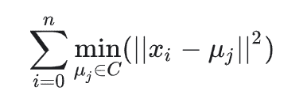

这里 *n* 是数据集中的记录数，*x[I]是第 *i* 个数据点， *C* 是聚类数， *[j]* 是第 *j* 个质心。*

使用 k-means 聚类进行客户细分的一个缺点或困难是，您需要事先知道聚类的数量。但是，通常情况下，您不知道要创建的集群的最佳数量。轮廓系数可用于评估并帮助您决定分割问题的最佳聚类数。简而言之，轮廓系数衡量的是与其他聚类相比，数据点与其聚类的接近程度。等式如下所示:

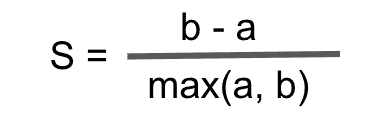

这里`b`是一个点与其最近的聚类之间的平均距离，而`a`是同一聚类内的数据点之间的平均距离。轮廓系数值的范围从-1 到 1，其中值越接近 1 越好。在下面的编程练习中，我们将使用 k-means 聚类算法和剪影系数从数据集中分割客户群。


# 用 Python 细分客户

在本节中，我们将讨论如何使用 Python 中的聚类算法将客户群划分为子群。在本节结束时，我们将使用 k-means 聚类算法构建一个客户细分模型。我们将主要使用`pandas`、`matplotlib`和`scikit-learn`包来分析、可视化和构建机器学习模型。对于那些想在这个练习中使用 R 而不是 Python 的读者，您可以跳到下一节。

在这个练习中，我们将使用来自 UCI 机器学习库的一个公开可用的数据集，可以在这个链接找到:[http://archive.ics.uci.edu/ml/datasets/online+retail](http://archive.ics.uci.edu/ml/datasets/online+retail)。你可以点击这个链接下载这些数据，这些数据是 XLSX 格式的，命名为`Online Retail.xlsx`。下载完这些数据后，您可以通过运行以下命令将其加载到 Jupyter 笔记本中:

```py
import pandas as pd

df = pd.read_excel('../data/Online Retail.xlsx', sheet_name='Online Retail')
```

数据帧`df`如下所示:


正如你所注意到的，在前面的章节中我们已经使用过这个数据集几次了。您可能还记得前面的章节，在继续之前，我们需要清理一些东西。


# 数据清理

在开始构建聚类模型之前，我们需要完成五项任务来清理数据并为建模做准备。清理步骤如下:

1.  **删除取消的订单**:我们将删除带有负数`Quantity`的记录，使用以下代码:

```py
        df = df.loc[df['Quantity'] > 0]
```

2.  **删除没有`CustomerID`** 的记录:有`133,361`条没有`CustomerID`的记录，我们将删除那些代码如下的记录:

```py
        df = df[pd.notnull(df['CustomerID'])]
```

3.  **排除不完整的月份**:您可能还记得前面的章节，2011 年 12 月的数据是不完整的。您可以使用以下代码排除这些数据:

```py
        df = df.loc[df['InvoiceDate'] < '2011-12-01']
```

4.  **从** **的数量和单价列**计算总销售额:在我们的分析中，我们需要总销售额，所以我们将两个`Quantity`和`UnitPrice`列相乘，得到总销售额，如下面的代码所示:

```py
          df['Sales'] = df['Quantity'] * df['UnitPrice']
```

5.  **每个客户的数据**:为了分析客户群，我们需要转换我们的数据，以便每个记录代表单个客户的购买历史。看一下下面的代码:

```py
        customer_df = df.groupby('CustomerID').agg({
            'Sales': sum,
            'InvoiceNo': lambda x: x.nunique()
        })

        customer_df.columns = ['TotalSales', 'OrderCount']
        customer_df['AvgOrderValue'] =     
        customer_df['TotalSales']/customer_df['OrderCount']
```

从这段代码中可以看出，我们将`DataFrame`、`df`和`CustomerID`分组，并计算每个客户的总销售额和订单数量。然后，我们还通过将`TotalSales`列除以`OrderCount`列来计算平均每订单值`AvgOrderValue`。结果如以下截图所示:

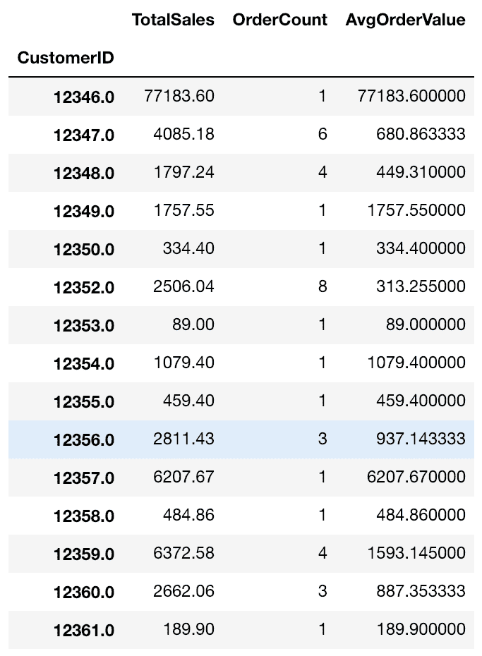

现在，从这个数据中可以看到，`TotalSales`、`OrderCount`和`AvgOrderValue`这三列有不同的刻度。`TotalSales`可以取`0`到`26,848`之间的任意值，`OrderCount`取`1`到`201`之间的值。聚类算法受数据规模的影响很大，因此我们需要将数据标准化到相同的规模。我们将采取两个步骤来规范化这些数据。首先我们要对数据进行排序，使每一列的值从`1`到`4298`不等，也就是记录的总数。看一下下面的代码:

```py
rank_df = customer_df.rank(method='first')
```

结果如以下截图所示:

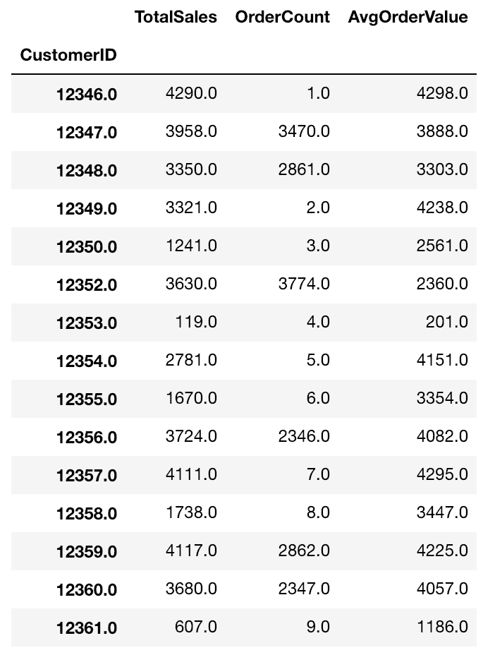

接下来，我们将对这些数据进行归一化处理，使其以平均值为中心，平均值为`0`，标准差为`1`。看一下下面的代码:

```py
normalized_df = (rank_df - rank_df.mean()) / rank_df.std()
```

结果如以下截图所示:

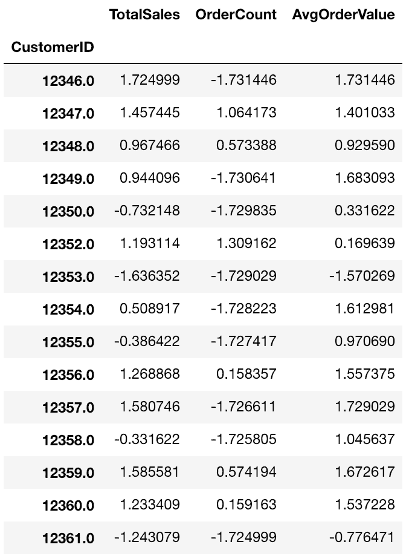

看一下这些列的统计数据，如下面的屏幕截图所示:

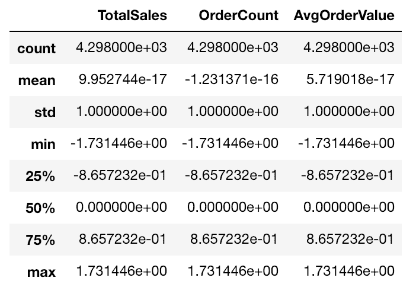

您可以看到这些值以`0`为中心，标准偏差为`1`。我们将使用这些数据进行下面的聚类分析。


# k 均值聚类

**k-means 聚类**算法是一种常用的算法，用于洞察数据中的结构和分离。在市场营销中，它通常用于建立客户群并了解这些不同客户群的行为。让我们深入研究如何用 Python 构建集群模型。

为了在`scikit-learn`包中使用 k-means 聚类算法，我们需要导入`kmeans`模块，如下面的代码所示:

```py
from sklearn.cluster import KMeans
```

然后，您可以使用以下代码构建并拟合 k-means 聚类模型:

```py
kmeans = KMeans(n_clusters=4).fit(normalized_df[['TotalSales', 'OrderCount', 'AvgOrderValue']])
```

从这段代码中可以看出，我们正在构建一个聚类模型，将数据分成四个部分。您可以使用`n_clusters`参数更改所需的集群数量。使用`fit`函数，您可以训练一个 k-means 聚类算法来学习拆分给定的数据。在这段代码中，我们基于`TotalSales`、`OrderCount`和`AvgOrderValue`值构建了四个集群。经过训练的模型对象`kmeans`将分类的标签和中心存储在模型对象的`labels_`和`cluster_centers_`属性中。您可以检索这些值，如下面的代码所示:

```py
kmeans.labels_
kmeans.cluster_centers_
```

现在我们已经构建了第一个聚类模型，让我们来可视化这些数据。首先，看一下下面的代码:

```py
four_cluster_df = normalized_df[['TotalSales', 'OrderCount', 'AvgOrderValue']].copy(deep=True)
four_cluster_df['Cluster'] = kmeans.labels_
```

我们将每个记录的聚类标签信息存储到新创建的数据帧`four_cluster_df`中。有了这个`DataFrame`，我们可以使用下面的代码来可视化集群:

```py
plt.scatter(
    four_cluster_df.loc[four_cluster_df['Cluster'] == 0]['OrderCount'], 
    four_cluster_df.loc[four_cluster_df['Cluster'] == 0]['TotalSales'],
    c='blue'
)

plt.scatter(
    four_cluster_df.loc[four_cluster_df['Cluster'] == 1]['OrderCount'], 
    four_cluster_df.loc[four_cluster_df['Cluster'] == 1]['TotalSales'],
    c='red'
)

plt.scatter(
    four_cluster_df.loc[four_cluster_df['Cluster'] == 2]['OrderCount'], 
    four_cluster_df.loc[four_cluster_df['Cluster'] == 2]['TotalSales'],
    c='orange'
)

plt.scatter(
    four_cluster_df.loc[four_cluster_df['Cluster'] == 3]['OrderCount'], 
    four_cluster_df.loc[four_cluster_df['Cluster'] == 3]['TotalSales'],
    c='green'
)

plt.title('TotalSales vs. OrderCount Clusters')
plt.xlabel('Order Count')
plt.ylabel('Total Sales')

plt.grid()
plt.show()
```

从这段代码中可以看出，我们使用散点图来可视化数据。结果如以下截图所示:

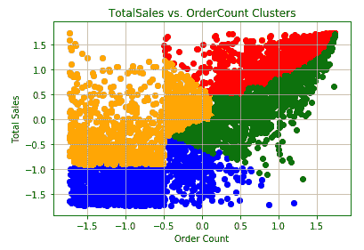

让我们仔细看看这个情节。蓝色的聚类是低价值客户群，他们没有太多地购买我们的产品。另一方面，红色的聚类是高价值客户群，他们购买的数量最多，并且经常购买产品。我们还可以使用其他变量，从不同的角度来观察集群。看一下下面的情节:

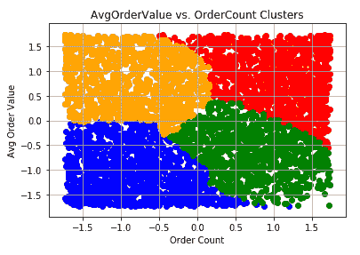 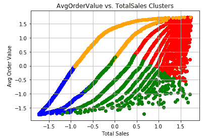

第一个图显示了基于`AvgOrderValue`和`OrderCount`的可视化集群。另一方面，第二个图显示了基于`AvgOrderValue`和`TotalSales`可视化的集群。从这些图中可以看出，蓝色的聚类具有最低的平均每订单值和最低的订单数。但是，红色聚类具有最高的平均每订单值和最多的订单数。可视化集群有助于您更轻松、更清晰地了解不同集群的特征。


# 选择最佳的聚类数

通常，我们不知道在构建 k-means 聚类模型时使用的最佳聚类数是多少。正如本章前面部分所讨论的，我们可以使用轮廓系数来确定分割数据的最佳聚类数。在`scikit-learn`包中，您可以使用`sklearn.metrics`模块中的`silhouette_score`函数来计算轮廓得分和测量聚类质量。看一下下面的代码:

```py
from sklearn.metrics import silhouette_score

for n_cluster in [4,5,6,7,8]:
    kmeans = KMeans(n_clusters=n_cluster).fit(
        normalized_df[['TotalSales', 'OrderCount', 'AvgOrderValue']]
    )
    silhouette_avg = silhouette_score(
        normalized_df[['TotalSales', 'OrderCount', 'AvgOrderValue']], 
        kmeans.labels_
    )

    print('Silhouette Score for %i Clusters: %0.4f' % (n_cluster, silhouette_avg))
```

从这段代码中可以看出，我们正在试验五种不同数量的集群:`4`、`5`、`6`、`7`和`8`。对于每个聚类数量，我们将测量轮廓得分，并选择得分最高的聚类数量。这段代码的输出如下所示:


在我们的例子中，在我们实验的五个不同数量的聚类中，具有最高轮廓分数的最佳数量的聚类是`4`。在接下来的部分中，我们将使用`4`作为聚类的数量，以展示我们如何解释聚类分析的结果。


# 解读客户群

在这一节中，我们将讨论从前面的聚类分析结果中获得洞察力的不同方法。我们先建立一个包含四个聚类的 k-means 聚类模型。您可以使用以下代码:

```py
kmeans = KMeans(n_clusters=4).fit(
    normalized_df[['TotalSales', 'OrderCount', 'AvgOrderValue']]
)

four_cluster_df = normalized_df[['TotalSales', 'OrderCount', 'AvgOrderValue']].copy(deep=True)
four_cluster_df['Cluster'] = kmeans.labels_
```

正如您在这段代码中看到的，我们正在用基于三个属性的`4`聚类来拟合 k-means 聚类模型:`TotalSales`、`OrderCount`和`AvgOrderValue`。然后，我们将聚类标签信息存储到数据帧`four_cluster_df`中。该数据帧如下面的屏幕截图所示:


我们首先要看的是每个集群的中心。您可以使用以下代码获得聚类中心:

```py
kmeans.cluster_centers_
```

下面的屏幕截图显示了这段代码的输出:


让我们仔细看看这个。第四个分类的所有三个属性的数字都最低。这表明第四个分类包含销售额最小、订单数量最少和平均每订单价值最低的客户。这类客户属于低价值客户。另一方面，第三类在所有三个属性上都有最高的数字。第三个分类中的客户具有最大的销售额、最大的订单数和最高的平均单价值。因此，第三个集群中的这些客户购买昂贵的商品，给企业带来最高的收入。你通常会想把你的营销努力集中在这部分客户身上，因为这将带来最高的回报。

第二个集群中的客户很有趣。他们相对频繁地进行购买，因为他们对`OrderCount`具有中到高的聚类中心值，但是他们的平均每订单值较低，因为`AvgOrderValue`的聚类中心较低。这些是经常购买低值物品的顾客。因此，向这部分顾客推销单价低的商品是再好不过的了。第一个集群中的客户也很有趣。从这个集群的中心来看，他们对收入和订单数量的贡献处于中低水平。然而，它们的平均每订单价值很高。这些顾客很少购买昂贵的商品。因此，向这部分顾客推销昂贵的商品是完美的。

从这个例子中可以看出，查看聚类中心有助于我们了解不同类型和细分的客户，以及如何以不同的方式定位他们。最后，我们还可以找出每个客户群中最畅销的商品。看一下下面的代码:

```py
high_value_cluster = four_cluster_df.loc[four_cluster_df['Cluster'] == 2]

pd.DataFrame(
    df.loc[
        df['CustomerID'].isin(high_value_cluster.index)
    ].groupby('Description').count()[
        'StockCode'
    ].sort_values(ascending=False).head()
)
```

正如我们之前所看到的，第三个集群是高价值客户群，我们将了解该群体的前五大畅销商品。这段代码的输出如下:

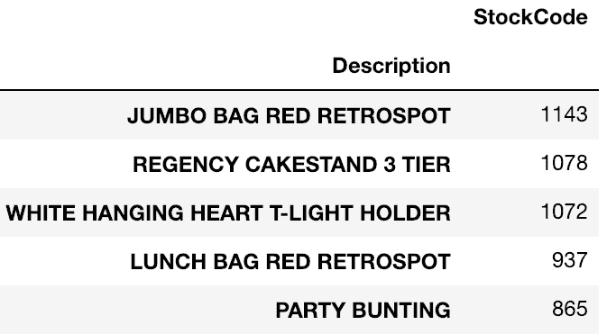

对于这个高价值部分，最畅销的商品是`JUMBO BAG RED RETROSPOT`，第二畅销的商品是`REGENCY CAKESTAND 3 TIER`。当你瞄准这个客户群时，你可以在营销策略中利用这些信息。在您的营销活动中，您可以向这部分客户推荐与这些畅销商品相似的商品，因为他们对这些类型的商品最感兴趣。

您可以在以下存储库中找到本练习的完整代码:[https://github . com/Yoon hwang/hands-on-data-science-for-marketing/blob/master/ch . 10/python/customer segmentation . ipynb](https://github.com/yoonhwang/hands-on-data-science-for-marketing/blob/master/ch.10/python/CustomerSegmentation.ipynb)。


# 用 R 细分客户

在本节中，我们将讨论如何使用 r 中的聚类算法将客户群划分为子群。在本节结束时，我们将使用 k-means 聚类算法构建一个客户细分模型。对于那些想在这个练习中使用 Python 而不是 R 的读者，请参阅上一节。

在这个练习中，我们将使用来自 UCI 机器学习库的一个公开可用的数据集，可以在这个链接找到:[http://archive.ics.uci.edu/ml/datasets/online+retail](http://archive.ics.uci.edu/ml/datasets/online+retail)。你可以点击这个链接下载这些数据，这些数据是 XLSX 格式的，命名为`Online Retail.xlsx`。下载完这些数据后，您可以通过运行以下命令将其加载到 RStudio 中:

```py
library(readxl)

#### 1\. Load Data ####
df <- read_excel(
  path="~/Documents/data-science-for-marketing/ch.10/data/Online Retail.xlsx", 
  sheet="Online Retail"
)
```

数据帧`df`如下图所示:

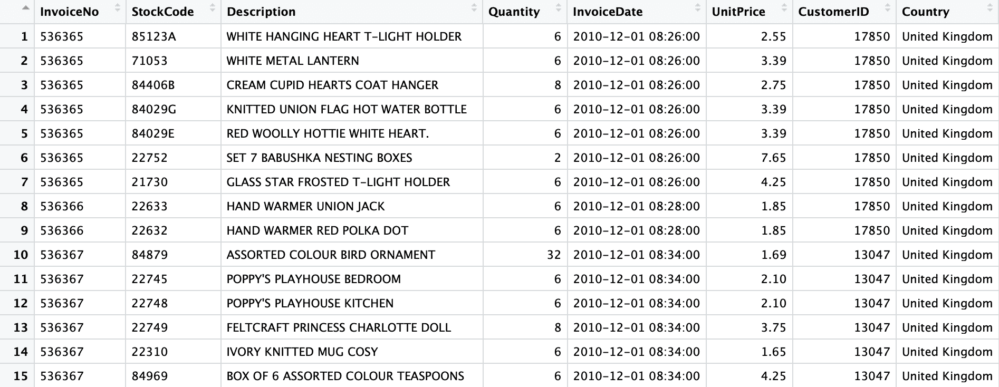

您可能已经注意到，在前面的章节中，我们已经使用过这个数据集几次。您可能还记得前面的章节，在继续之前，我们需要清理一些东西。


# 数据清理

在开始构建聚类模型之前，我们需要完成五项任务来清理数据并为建模做准备。清理步骤如下:

1.  **删除取消的订单**:我们将删除带有负数`Quantity`的记录，使用以下代码:

```py
        df <- df[which(df$Quantity > 0),]
```

2.  **删除没有 CustomerID** 的记录:存在没有`CustomerID`的`133,361`条记录，我们将删除具有以下代码的那些记录:

```py
        df <- na.omit(df)
```

3.  **排除不完整的月份**:您可能还记得前面的章节，2011 年 12 月的数据是不完整的。您可以使用以下代码排除这些数据:

```py
        df <- df[which(df$InvoiceDate < '2011-12-01'),]
```

4.  **从数量和单价列**计算总销售额:对于我们的分析，我们需要总销售额，因此我们将把`Quantity`和`UnitPrice`列相乘，以获得总销售额，如下面的代码所示:

```py
        df$Sales <- df$Quantity * df$UnitPrice
```

5.  **每个客户的数据**:为了分析客户群，我们需要转换我们的数据，以便每个记录代表单个客户的购买历史。看一下下面的代码:

```py
        # per customer data
        customerDF <- df %>% 
          group_by(CustomerID) %>% 
          summarize(TotalSales=sum(Sales),      
        OrderCount=length(unique(InvoiceDate))) %>%
          mutate(AvgOrderValue=TotalSales/OrderCount)
```

从这段代码中可以看出，我们将数据帧`df`按`CustomerID`分组，并计算每个客户的总销售额和订单数。然后，我们还通过将`TotalSales`列除以`OrderCount`列来计算每订单的平均价值`AvgOrderValue`。结果如以下截图所示:

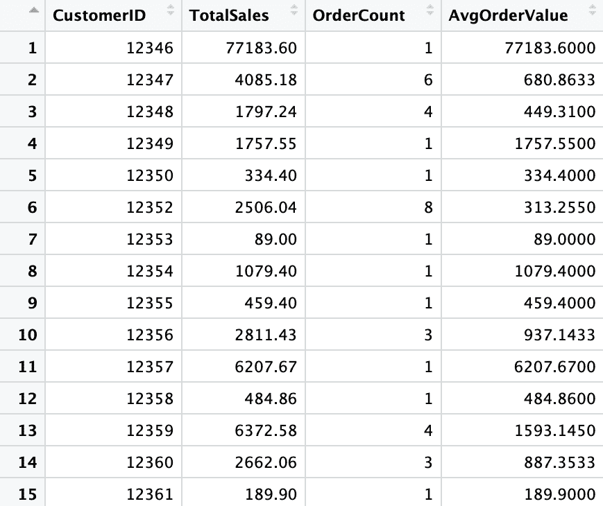

现在，正如您从这些数据中看到的，`TotalSales`、`OrderCount`和`AvgOrderValue`列有不同的刻度。`TotalSales`可以取`0`到`26,848`之间的任意值，`OrderCount`取`1`到`201`之间的值。聚类算法受数据规模的影响很大，因此我们需要将数据标准化到相同的规模。我们将采取两个步骤来规范化这些数据。首先我们要对数据进行排序，使每一列的值从`1`到`4298`不等，也就是记录的总数。看一下下面的代码:

```py
rankDF <- customerDF %>%
  mutate(TotalSales=rank(TotalSales), OrderCount=rank(OrderCount, ties.method="first"), AvgOrderValue=rank(AvgOrderValue))
```

结果如以下截图所示:

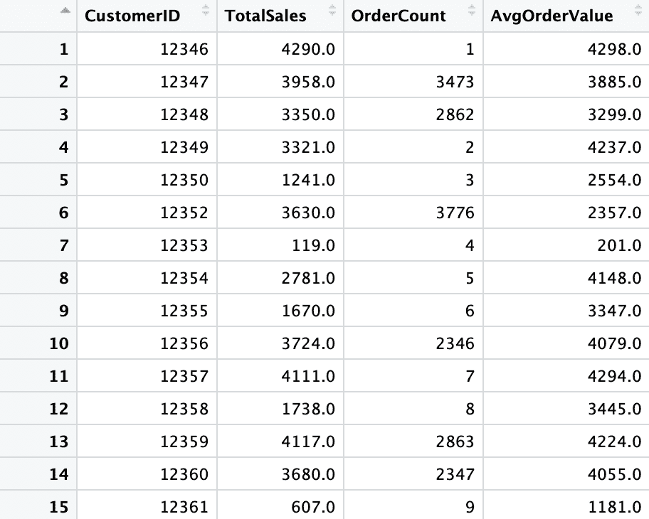

接下来，我们将使用 r 中的`scale`函数将这些数据归一化，使其以平均值为中心，并具有平均值`0`和标准偏差`1`。请看下面的代码:

```py
normalizedDF <- rankDF %>%
  mutate(TotalSales=scale(TotalSales), OrderCount=scale(OrderCount), AvgOrderValue=scale(AvgOrderValue))
```

结果如以下截图所示:

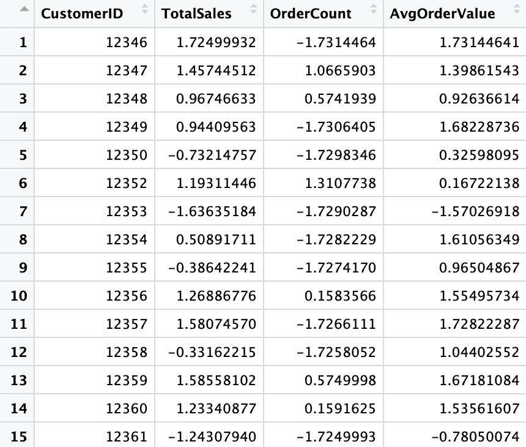

看一下这些列的统计数据，如下面的屏幕截图所示:

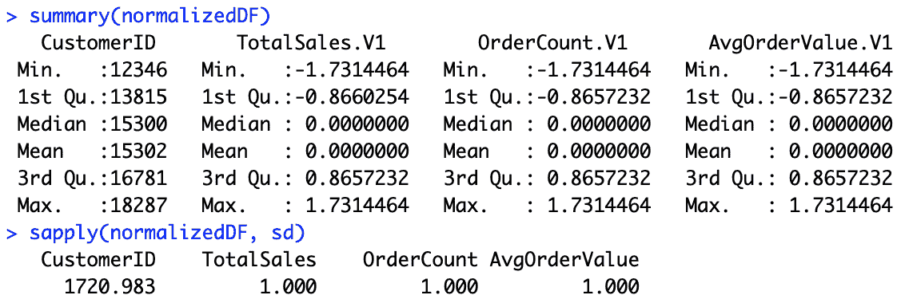

您可以看到这些值以`0`为中心，标准偏差为`1`。我们将使用这些数据进行下面的聚类分析。


# k 均值聚类

**k-means 聚类**算法是一种常用的算法，用于洞察数据中的构造和分离。在市场营销中，它通常用于建立客户群并了解这些不同客户群的行为。让我们深入研究在 r 中构建集群模型。

您可以使用以下代码构建和拟合 k 均值聚类模型:

```py
cluster <- kmeans(normalizedDF[c("TotalSales", "OrderCount", "AvgOrderValue")], 4)
```

从这段代码中可以看出，我们正在构建一个聚类模型，将数据分成`4`段。`kmeans`函数的第一个参数是用于 k 均值聚类的数据，第二个参数是定义期望的聚类数。在这段代码中，我们将基于`TotalSales`、`OrderCount`和`AvgOrderValue`值构建`4`集群。经过训练的 k 均值聚类模型对象`cluster`，将聚类的标签和中心存储在模型对象的`cluster`和`centers`变量中。您可以检索这些值，如下面的代码所示:

```py
cluster$cluster
cluster$centers
```

现在我们已经构建了第一个聚类模型，让我们来可视化这些数据。首先，我们将把分类标签作为一个单独的列存储在变量`normalizedDF`中，名为`Cluster`，如下面的代码所示:

```py
# cluster labels
normalizedDF$Cluster <- cluster$cluster
```

然后，我们可以使用以下代码来可视化集群:

```py
ggplot(normalizedDF, aes(x=AvgOrderValue, y=OrderCount, color=Cluster)) +
  geom_point()
```

从这段代码中可以看出，我们使用散点图来可视化数据。结果如下面的屏幕截图所示:

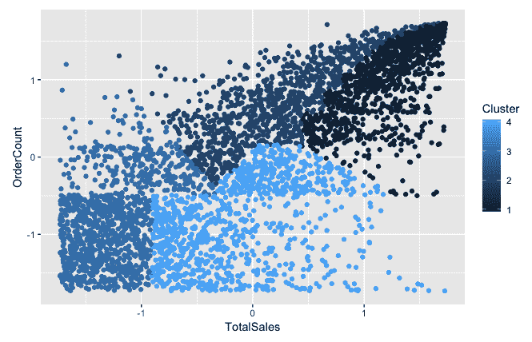

让我们仔细看看这个情节。左下方的集群是低价值客户群，他们没有购买我们的产品太多。另一方面，右上角颜色最深的聚类是高价值客户群，他们购买的数量最多，并且经常购买产品。我们还可以使用其他变量，从不同的角度来观察集群。看一下下面的情节:

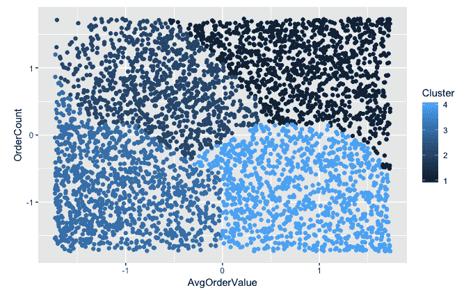

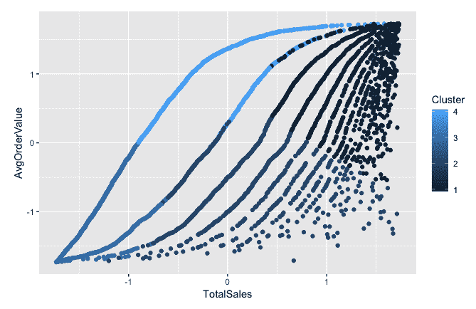

第一个图显示了基于`AvgOrderValue`和`OrderCount`的可视化集群。另一方面，第二个基于`AvgOrderValue`和`TotalSales`绘制可视化的集群。从这些图中可以看出，左下角颜色第二浅的分类具有最低的平均每订单值和最低的订单数。但是，右上角颜色最深的分类具有最高的平均每订单值和最大的订单数。可视化集群有助于您更轻松、更清晰地了解不同集群的特征。


# 选择最佳的聚类数

在构建 k-means 聚类模型时，我们常常不知道最佳的聚类数是多少。正如本章前面部分所讨论的，我们可以使用轮廓系数来确定分割数据的最佳聚类数。在 R 中，你可以使用`cluster`库中的`silhouette`函数来计算剪影得分，衡量聚类的质量。看一下下面的代码:

```py
# Selecting the best number of cluster
library(cluster)

for(n_cluster in 4:8){
  cluster <- kmeans(normalizedDF[c("TotalSales", "OrderCount", "AvgOrderValue")], n_cluster)

  silhouetteScore <- mean(
    silhouette(
      cluster$cluster, 
      dist(normalizedDF[c("TotalSales", "OrderCount", "AvgOrderValue")], method = "euclidean")
    )[,3]
  )
  print(sprintf('Silhouette Score for %i Clusters: %0.4f', n_cluster, silhouetteScore))
}
```

从这段代码中可以看出，我们正在试验五种不同数量的集群:`4`、`5`、`6`、`7`和`8`。对于每个聚类数，我们将测量轮廓得分，并选择得分最高的聚类数。下面的屏幕截图显示了这段代码的输出:


在我们的例子中，在我们实验的五个不同数量的聚类中，具有最高轮廓分数的最佳数量的聚类是`4`。在下一节中，我们将使用`4`来表示聚类的数量，以展示我们如何解释聚类分析的结果。


# 解读客户群

在这一节中，我们将讨论从前面的聚类分析结果中获得洞察力的不同方法。我们先用`4`个聚类建立一个 k-means 聚类模型。您可以使用以下代码:

```py
# Interpreting customer segments
cluster <- kmeans(normalizedDF[c("TotalSales", "OrderCount", "AvgOrderValue")], 4)
normalizedDF$Cluster <- cluster$cluster
```

从这段代码中可以看出，我们正在根据三个属性:`TotalSales`、`OrderCount`和`AvgOrderValue`，用`4`个集群拟合 k-means 聚类模型。然后，我们将聚类标签信息存储到数据帧`normalizedDF`中。该数据帧如下面的屏幕截图所示:

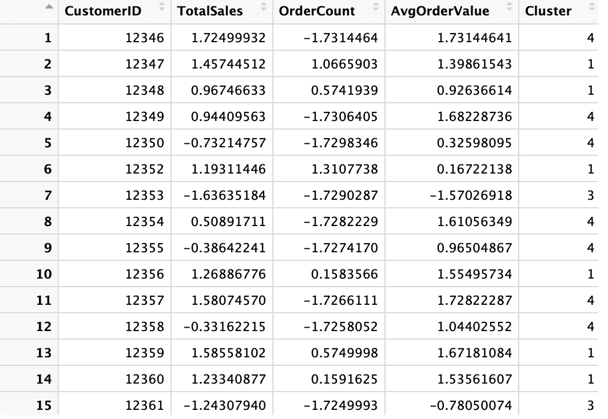

我们首先要看的是每个集群的中心。您可以使用以下代码获得聚类中心:

```py
# cluster centers
cluster$centers
```

下面的屏幕截图显示了这段代码的输出:

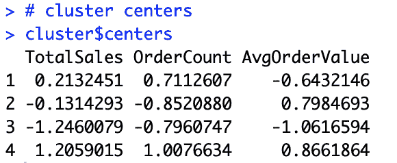

让我们仔细看看这个。第三个分类的所有三个属性的数字都最低。这表明第三个分类包含销售额最低、订单数量最少和每订单平均价值最低的客户。这群客户是一群低价值客户。另一方面，第四类在所有三个属性上都有最高的数字。第四个分类中的客户具有最高的销售额、最高的订单数和最高的平均每订单价值。这表明第四个集群中的这些客户购买了昂贵的物品，并给企业带来了最高的收入。你通常会想把你的营销努力集中在这部分客户身上，因为这将带来最高的回报。

第一个集群中的客户很有趣。他们购买相对频繁，因为他们对`OrderCount`具有中到高的聚类中心值，但是他们的平均每订单值较低，因为`AvgOrderValue`的聚类中心较低。这些是经常购买低值物品的顾客类型。因此，向这部分顾客推销单价低的商品是再好不过的了。第二个集群中的客户也很有趣。从这个集群的中心来看，他们对收入和订单数量的贡献很低。然而，它们的平均每订单价值很高。这类顾客很少购买昂贵的商品。因此，向这部分顾客推销昂贵的商品是完美的。

从这个例子中可以看出，查看聚类中心有助于我们了解不同类型和细分的客户，以及如何以不同的方式定位他们。最后，我们还可以找出每个客户群中最畅销的商品。看一下下面的代码:

```py
# High value cluster
highValueCustomers <- unlist(
  customerDF[which(normalizedDF$Cluster == 4),'CustomerID'][,1], use.names = FALSE
)

df[which(df$CustomerID %in% highValueCustomers),] %>%
  group_by(Description) %>%
  summarise(Count=n()) %>%
  arrange(desc(Count))
```

正如我们之前看到的，第四个聚类是高价值客户群，我们将了解该群体的最畅销商品。下面的屏幕截图显示了这段代码的输出:

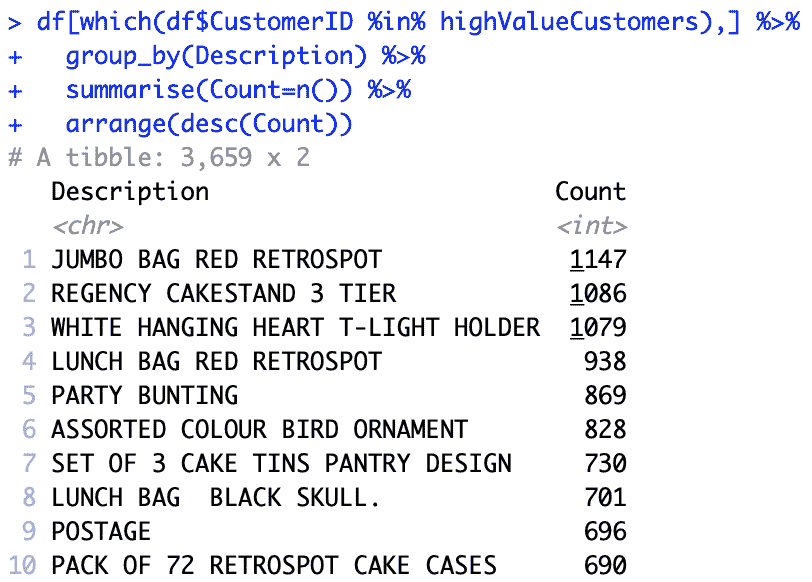

对于这一高价值细分市场，最畅销的商品是 **JUMBO BAG RED RETROSPOT** ，第二畅销的商品是 **REGENCY CAKESTAND 3 TIER** 。当你瞄准这个客户群时，你可以在营销策略中利用这些信息。在您的营销活动中，您可以向这部分客户推荐与这些畅销商品相似的商品，因为他们对这些类型的商品最感兴趣。

您可以在以下存储库中找到本练习的完整代码:[https://github . com/Yoon hwang/hands-on-data-science-for-marketing/blob/master/ch . 10/R/customer segmentation。R](https://github.com/yoonhwang/hands-on-data-science-for-marketing/blob/master/ch.10/R/CustomerSegmentation.R) 。


# 摘要

在本章中，我们了解了更多关于客户细分的知识。我们研究了三个简单的场景，客户细分如何帮助不同的企业形成更好、更具成本效益的营销策略。我们已经讨论了如何很好地了解不同的客户群、不同客户群的行为方式以及他们的需求和兴趣所在，从而帮助您更好地锁定目标受众。我们还学习了 k-means 聚类算法，这是客户细分中最常用的聚类算法之一。为了评估聚类的质量，我们已经展示了如何使用剪影系数。

在编程练习中，我们尝试了如何在 Python 和 R 中构建 k-means 聚类模型。在 Python 中，我们可以使用`scikit-learn`包中的`KMeans`模块，在 R 中，我们可以使用`kmeans`函数来构建聚类模型。使用 Python 中的`silhouette_score`函数和 R 中的`silhouette`函数，我们已经看到了如何使用轮廓系数来评估聚类的质量，以及查看轮廓分数如何帮助我们确定最佳的聚类数量。最后，我们讨论了如何使用散点图和聚类中心来解释聚类分析结果，我们还看到了如何为每个客户群找出最畅销的商品。

在下一章，我们将讨论面临流失风险的客户以及如何留住这些客户。我们将一起用 Python 和 R 构建神经网络模型，使用`keras`包，来识别那些有可能流失的客户。