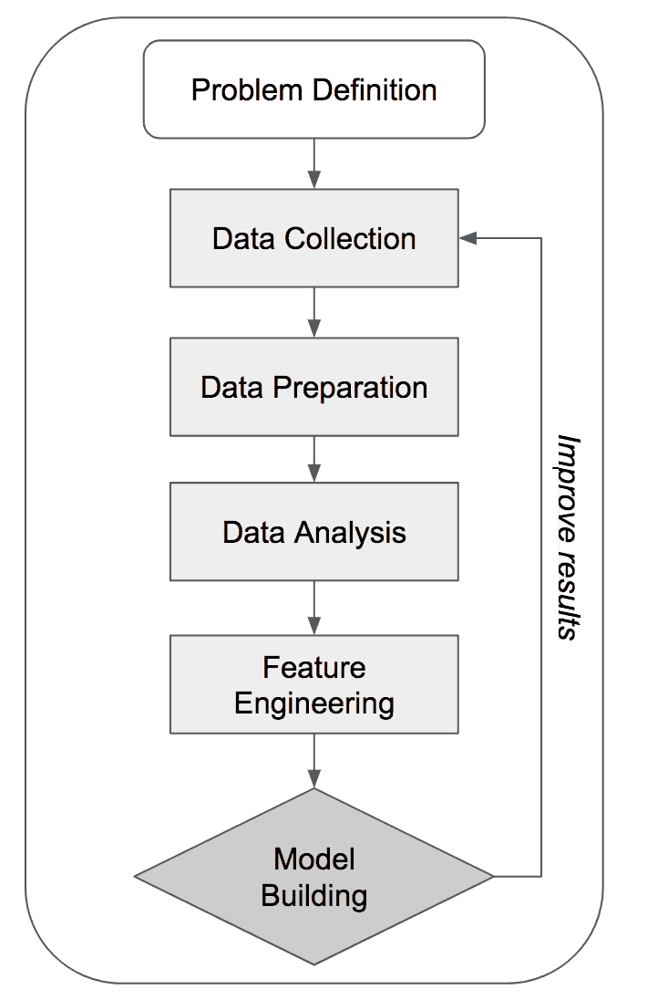

# 十三、下一步是什么？

我们已经走了很长的路。我们从数据科学的基础及其在市场营销中的应用入手，研究了数据科学在市场营销中的大量用例。一路走来，我们进行了描述性分析，使用数据科学技术来分析和可视化数据，以识别模式。我们还进行了解释性分析，其中我们使用机器学习模型从数据中提取洞察力，例如找到某些客户活动背后的驱动因素以及客户属性和他们的行动之间的相关性。最后，我们还研究了预测分析，我们训练了各种机器学习算法来预测客户的某些行为。

我们在整本书中涉及的主题并不琐碎，而且是针对数据科学在市场营销中的实际应用。每一章都旨在展示如何在实际营销用例中使用数据科学和机器学习技术，并指导您如何将所讨论的概念应用到您的具体业务案例中。随着营销分析领域的发展和范围的扩大，我们希望利用这一章来告知您可能面临的一些潜在挑战，并了解一些其他常用技术，以及回顾我们在本书中讨论的主题。

在本章中，我们将讨论以下主题:

*   概述本书涵盖的主题
*   现实生活中的数据科学挑战
*   更多机器学习模型和软件包


# 概述本书涵盖的主题

从本书开始，我们已经涵盖了大量材料，从讨论营销趋势以及数据科学和机器学习如何成为建立营销战略的关键部分，到建立各种预测性机器学习模型以实现更有效的营销。在我们合上书之前，回顾一下我们到目前为止所学的内容并刷新一下我们的记忆是值得的。


# 营销趋势

您可能还记得，我们在[第 1 章](c169428b-e0db-4624-896c-24316e9b29cc.xhtml)、*数据科学和营销*中讨论的第一件事是营销的最新趋势。重要的是，要努力理解并跟上你所从事的行业的发展趋势。尤其是在营销领域，人们非常需要更多的数据驱动和量化营销，以及使用最新和最智能的技术来制定更具成本效益的营销策略。

根据 2018 年 2 月的 CMO 调查([https://www . Forbes . com/sites/Christine moorman/2018/02/27/marketing-analytics-and-marketing-technology-trends-to-watch/# 4 EC 8 a 8431 b 8 a](https://www.forbes.com/sites/christinemoorman/2018/02/27/marketing-analytics-and-marketing-technology-trends-to-watch/#4ec8a8431b8a))，在过去 5 年中，对营销分析的依赖度从 30%上升到 42%。很容易观察到的市场营销的三个主要趋势如下:

*   **数字营销日益重要**:许多营销活动现在更多地发生在数字渠道上，如搜索引擎、社交媒体、电子邮件和网站，而不是更传统的大众媒体，如电视、广播和公交车站的横幅广告。随着各种数字营销渠道作为营销渠道的选择越来越受欢迎，很好地了解受众定位在社交网络(如脸书和 Instagram)上的工作方式，或者如何在搜索引擎和视频流媒体服务(如谷歌和 YouTube)上投放广告变得越来越重要。
*   **营销分析**:营销分析是一种监控和量化过去营销努力的结果和表现的方法。在[第 2 章](1fb7a852-d8fa-43f6-9807-6e3292dfa280.xhtml)、*关键表现指标和可视化*中，我们了解了各种**关键表现指标**(**KPI**)，我们可以用它们来跟踪和量化各种营销工作的回报。营销分析不仅仅停留在分析 KPI。它也可以应用于产品和客户分析，我们在[第 5 章](73a716c6-6a84-4785-b04e-87651d0a29d1.xhtml)、*产品分析*和[第 7 章](72e8f4ee-7f95-4acc-928d-d33c9fc31bd6.xhtml)、*客户行为探索性分析*中讨论过。

*   **个性化和目标营销**:随着数据科学和机器学习的可访问性变得更加容易，市场营销的另一个趋势出现了:个人层面的目标营销。使用预测分析，我们现在可以预测个人客户会喜欢什么类型的产品，我们已经在[第 6 章](d3ba7047-2873-4b03-9a44-4c1d55b84178.xhtml)、*推荐合适的产品*中讨论过。在第 11 章、*留住客户*中，我们也看到了如何通过建立预测性机器学习模型来锁定那些可能流失的客户。由于目标营销会带来更高的投资回报率，因此有许多**软件即服务** ( **SaaS** )公司，如 Sailthru 和 Oracle，提供个性化和目标营销的平台。

随着新策略和技术的发展，趋势注定会改变。我们在本书中讨论的趋势可能在 20-30 年后不再适用。作为一名营销专业人员，跟踪和了解同行业中的其他人在做什么，以及正在开发和使用哪些其他方法或技术来实现更高的投资回报率是至关重要的。


# 数据科学工作流程

作为一名营销专业人士或一名有抱负的营销数据科学家，确定从哪里开始数据科学项目可能是一项挑战。在[第 1 章](c169428b-e0db-4624-896c-24316e9b29cc.xhtml)、*数据科学和营销*中，我们讨论了数据科学项目的典型工作流程。在您着手未来的营销数据科学项目之前，有必要回顾一下这些步骤。您应该熟悉以下工作流程图:



让我们更详细地谈谈这六个步骤:

1.  **问题定义**:任何数据科学和机器学习项目都应该有明确的问题定义。你需要对问题本身、项目范围以及解决方案的方法有深入的了解。在这里，您可以集思广益，决定使用何种类型的分析和数据科学技术。
2.  **数据收集**:正如任何数据科学项目一样，拥有数据是成功的关键。在此步骤中，您需要收集数据科学项目所需的所有数据。通常，您需要为内部数据实施数据收集流程，购买第三方数据，或者从不同的网站收集数据。根据具体情况，数据收集步骤可能是琐碎的，也可能是繁琐的。
3.  **数据准备**:有了数据收集步骤的数据，下一步就是清理和准备数据。正如我们在本书中看到的，我们的编程练习总是从数据清理和准备开始。在数据准备步骤中，我们处理缺失值、编码分类变量或转换其他变量，以便机器学习算法可以理解这些数据。
4.  **数据分析**:你可能还记得，在整本书的编程练习中，我们已经从这个数据分析步骤中发现了有用的见解。通过分析数据，我们可以更好地了解不同变量的总体分布，而且用不同的图来可视化数据以识别任何明显的模式通常是一个好主意。
5.  **特征工程**:正如我们在整本书中看到和讨论的，有许多不同的方法来为机器学习模型设计特征。对于货币价值，我们应用了对数转换。在某些情况下，我们对数据进行了标准化处理，以使变量具有相同的尺度。我们还使用了一键编码来编码分类变量。特征工程是建立机器学习模型的最重要步骤之一，因为算法将试图从这些特征中学习，以正确预测目标。
6.  **模型构建**:典型数据科学工作流程的最后一步当然是模型构建。利用我们在前面步骤中构建的干净数据和功能，这是您训练机器学习模型的地方。在本书中，我们讨论了如何评估模型。对于分类模型，我们经常使用准确度、精确度、召回率、ROC 曲线和 AUC。对于回归模型，我们使用 MSE、 *R* ² ，或预测值和实际值的散点图进行模型评估。

在我们的编程练习中，我们的工作流看起来与我们刚刚讨论的工作流几乎相同。当不确定下一步该做什么时，我们希望这个工作流程图能给你一些后续步骤的提示。


# 机器学习模型

您可能还记得，我们在本书中构建了许多机器学习模型。例如，在 [第八章](4f5163a1-c34a-495f-bc5f-e02f9b2a2052.xhtml)，*预测营销参与的可能性*中，我们训练了一个随机森林模型来预测每个客户参与营销电话的可能性。在[第十一章](3d5c7798-6874-40e9-b7e9-6fe39592cc2a.xhtml)、*留住客户*中，我们使用了一个**人工神经网络** ( **ANN** )模型来识别哪些客户可能会从业务中流失。在本节中，我们将回顾我们在本书中使用的机器学习模型:

*   **逻辑回归**:在[第三章](ce2c2775-9817-4b18-972c-db8e8c629b74.xhtml)、*营销参与背后的驱动因素*中，我们使用了逻辑回归模型来提取关于哪些因素使客户更有可能参与营销活动的见解。在 Python 中，我们使用`statsmodels`包来构建逻辑回归模型，训练逻辑回归模型的代码如下所示:

```py
        import statsmodels.formula.api as sm

        logit = sm.Logit(
            target_variable, 
            features
        )

        logit = logit.fit()
```

从这个训练好的模型中，我们可以通过运行`logit_fit.summary()`来查看特征和目标变量之间的细节和相关性。另一方面，在 R 中，我们使用以下命令来训练逻辑回归模型:

```py
        logit.fit <- glm(Target ~ ., data = DF, family = binomial)
```

类似于我们在 Python 中使用`summary`函数的方式，我们可以运行`summary(logit.fit)`命令来获得逻辑回归拟合的细节以及特征和目标变量之间的相关性。

*   **随机森林**:你可能还记得，我们在[第八章](4f5163a1-c34a-495f-bc5f-e02f9b2a2052.xhtml)、*预测营销参与的可能性*中使用了随机森林算法，来预测哪些客户可能会响应营销电话。在 Python 中，我们使用`scikit-learn`包来构建随机森林模型。训练随机森林模型的代码如下所示:

```py
        from sklearn.ensemble import RandomForestClassifier

        rf_model = RandomForestClassifier()

        rf_model.fit(X=x_train, y=y_train)
```

您可能还记得，有许多超参数可以用随机森林算法来调整。我们已经讨论了如何微调森林中估计器的数量、`n_estimators`、树的最大深度、`max_depth`以及能够分裂成分支所需的最小样本数、`min_samples_split`。另一方面，在 R 中，我们使用了`randomForest`库来构建随机森林模型。在 R 中训练随机森林模型的代码如下所示:

```py
        library(randomForest)

        rfModel <- randomForest(x=trainX, y=factor(trainY))
```

使用`randomForest`包，您可以微调超参数。您可以使用`ntree`来调整森林中的树的数量，`sampsize`来调整为训练每棵树而绘制的样本的大小，以及`maxnodes`来定义树中终端节点的最大数量。

*   **安**:您可能还记得，在[第 11 章](3d5c7798-6874-40e9-b7e9-6fe39592cc2a.xhtml)、*留住客户*中，我们使用了一个人工神经网络模型来预测可能会流失的客户。为了构建一个人工神经网络模型，我们对 Python 和 r 都使用了`keras`包。

```py
        from keras.models import Sequential
        from keras.layers import Dense

        model = Sequential()
        model.add(Dense(16, input_dim=
                        len(features), activation='relu'))
        model.add(Dense(8, activation='relu'))
        model.add(Dense(1, activation='sigmoid'))

        model.compile(loss='binary_crossentropy', 
                      optimizer='adam', metrics=['accuracy'])

        model.fit(X_train, y_train, epochs=50, batch_size=100)
```

您应该已经知道，我们首先必须向模型添加输入、隐藏和输出层。然后，我们可以编译和训练一个人工神经网络模型。在 R 中，概念是相同的，但是语法看起来有点不同。使用`keras`包训练人工神经网络模型的 R 代码如下所示:

```py
        library(keras)

        model <- keras_model_sequential() 
        model %>% 
          layer_dense(units = 16, kernel_initializer =
          "uniform", activation = 'relu', input_shape=ncol(train)-1) %>% 
          layer_dense(units = 8, kernel_initializer = 
          "uniform", activation = 'relu') %>%
          layer_dense(units = 1, kernel_initializer =
                      "uniform", activation = 'sigmoid') %>% 
          compile(optimizer = 'adam',
            loss = 'binary_crossentropy',
            metrics = c('accuracy')
          )

        history <- model %>% fit(
          trainX, 
          trainY, 
          epochs = 50, 
          batch_size = 100, 
          validation_split = 0.2
        )
```

*   **k-means 聚类**:在[第十章](5955002d-2a75-4d5a-aa6a-86710a3bf00e.xhtml)、*数据驱动的客户细分*中，我们使用了 k-means 聚类算法，以编程方式构建不同的客户细分。我们已经看到，分析这些不同客户群的属性可以帮助我们了解客户的不同行为，并找到更好的方法来瞄准不同的客户群。在 Python 中，我们可以使用`scikit-learn`包来构建 k-means 聚类算法。代码如下所示:

```py
        from sklearn.cluster import KMeans

        kmeans = KMeans(n_clusters=4)
        kmeans = kmeans.fit(data)
```

您可能还记得，您需要使用`n_clusters`参数来定义您希望从数据中构建的集群的数量。为了获得每个记录的分类标签和分类质心，我们可以使用`kmeans.labels_`和`kmeans.cluster_centers_`。类似地，在 R 中，我们使用了`kmeans`函数来构建一个聚类模型，如下面的代码所示:

```py
        cluster <- kmeans(data, 4)
```

为了得到标签和聚类中心，我们可以使用`cluster$cluster`和`cluster$centers`。

通过这些算法，我们能够轻松地为营销中的不同用例建立各种机器学习模型。我们希望这些对构建这些机器学习模型的语法的简要回顾有助于刷新您的记忆。


# 现实生活中的数据科学挑战

如果我们能够针对不同的营销用例构建和使用各种机器学习模型，那么在营销中应用数据科学和机器学习将会是非常迷人和完美的。然而，通常情况并非如此。很多时候，端到端的机器学习模型构建过程可能会很乏味，路上有很多障碍和瓶颈。我们将讨论现实生活中最常出现的一些数据科学挑战，包括以下内容:

*   数据挑战
*   基础设施方面的挑战
*   选择正确模式的挑战


# 数据挑战

将数据科学和机器学习用于营销的最具挑战性的因素之一是获得正确的数据。对你来说可能听起来很明显，没有数据，就没有数据科学或机器学习。而且，如果数据质量不好，那么你训练出来的机器学习质量也是要差的。

在本节中，我们将讨论许多数据科学家在获取正确数据时面临的一些常见挑战:

*   **数据的存在**:有时你可能会想到一个应用数据科学技术来解决你在营销中遇到的一个问题的好主意。然而，您需要的数据可能根本不存在。例如，假设您的想法是确定流行的 web 内容，例如哪些网页被用户查看得最多、最喜欢。但是，如果您的网站上没有实现网页跟踪功能，您可能没有网页浏览数据。在这种情况下，您需要在您的网站中实现跟踪功能，以跟踪哪些用户查看或喜欢哪些内容。然后，只有在一段时间后，当你收集了足够的数据来进行分析时，才有可能实现你的想法。这种情况发生得相对频繁，因此很好地了解您跟踪用户活动的情况以及您遗漏了哪些部分是至关重要的。如果可能，获取第三方数据也是一种选择，当数据不存在于内部时。有很多数据供应商出售你可能需要的数据。如果使用第三方数据供应商是一种选择，那么当您的项目没有数据时，这可能是一个很好的解决方案。此外，还有很多公开的数据可以免费使用。看看你需要的数据是否公开是值得的。
*   **数据的可访问性**:数据可访问性可能是数据科学项目的一个障碍。尤其是在大公司，对某些数据集的访问被严格限制在选定的小组中。在这种情况下，即使所需的数据集存在，数据科学家或营销专业人员也很难甚至不可能访问和使用这些数据。生成数据的位置也会导致数据可访问性问题。例如，如果数据在没有存储或归档的情况下流入其他应用，那么这些数据在流入后可能会丢失。数据文件的位置也可能成为访问所需数据的障碍。如果数据无法通过网络共享，或者如果您无法到达数据所在的位置，那么这也会阻止您使用这些数据。这就是为什么数据工程和数据工程师的责任和重要性在上升。数据工程师与其他数据科学家或软件开发人员合作，专门构建数据管道，通过这些管道，存在可访问性问题的数据可以移动到业务的其他部分。如果您正面临数据可访问性的问题，首先找出障碍是什么并考虑与数据工程师一起构建数据管道以使数据可用于您未来的项目是至关重要的。

*   **杂乱的数据**:你可以假设现实生活中的数据科学项目中你将面临的大部分数据都是杂乱的。它可能是一种你不容易理解的格式。它可以被分割成更小的部分，这些部分不容易相互连接。或者，数据中可能有太多缺失值或太多重复记录。数据集的混乱程度会显著增加清理原始数据并使其可用所需的时间。对这些杂乱的数据进行深入的数据分析对于使这些数据可用于未来的步骤至关重要。有时，与数据工程师合作修复导致数据混乱的根源，并使未来的数据更加清晰，这可能是值得的。


# 基础设施方面的挑战

当使用不同的数据集来应用数据科学技术并将机器学习模型用于市场营销中的不同项目时，您可能会在用于开发的系统基础架构中面临一些挑战。通常情况下，数据集太大，不适合你的笔记本或计算机。随着数据的规模每天都在变得越来越大，将来的某个时候，您甚至可能会在笔记本上开发数据科学模型时遇到问题，即使您目前没有这个问题。

在从事数据科学项目时，有两个主要因素会降低您的速度:CPU 或处理能力不足以及 RAM 或内存不足。如果您没有足够的处理能力，您的分析可能需要很长时间。尤其是在训练机器学习模型的时候，模型训练需要几天、几周，甚至几个月的情况并不少见。另一方面，如果您没有足够的内存，您可能会在运行您的分析时得到`Out of Memory`错误。例如，基于树的模型(如决策树或随机森林)会占用大量内存，训练这种模型可能会因为内存不足而在训练数小时后失败。

随着云计算的兴起和发展，这些问题已经有了解决方案。使用云计算服务提供商之一，比如 AWS、谷歌或微软 Azure，理论上，你可以获得无限量的计算能力和内存。当然，任何事情都是有代价的。如果您没有正确规划，在这些云平台上运行大型数据科学工作可能会花费一大笔钱。处理大型数据集时，明智的做法是考虑成功运行任务所需的处理能力和内存量。


# 选择正确模式的挑战

为给定的数据科学项目选择机器学习算法比听起来更困难。有些算法更像一个黑盒，你不知道算法是如何做出预测或决策的。例如，很难理解一个经过训练的随机森林模型如何根据输入对输出进行预测。决策是从数百个不同的决策树中做出的，其中每个树根据不同的决策标准以不同的方式工作，这使得数据科学家很难完全理解输入和输出之间发生了什么。

另一方面，线性模型，如逻辑回归模型，准确地告诉我们他们是如何做决定的。一旦训练了逻辑回归模型，我们就知道了赋予每个特征的系数，并且从这些系数中，我们可以推断出预测的输出将会是什么。根据您的用例，您可能需要这种可解释性，您需要能够解释每个特性是如何工作的，以及如何影响您的业务伙伴的预测输出。通常，更高级的模型更像是一个黑匣子，你需要在预测准确性和可解释性之间做出权衡。


# 更多机器学习模型和软件包

在本书中，我们主要使用了以下五种适合并最适合我们营销用例的机器学习算法:逻辑回归、随机森林、人工神经网络、k 均值聚类和协同过滤。然而，有许多更容易获得的机器学习算法，您可能会发现对您未来的数据科学和机器学习项目有用。我们将讨论一些其他常用的机器学习算法，在 Python 和 R 中使用什么包，以及在哪里可以找到关于这些算法的更多信息。

在您未来的项目中要考虑的一些其他机器学习算法如下:

*   **最近邻**:这是一个机器学习算法，寻找预定义数量的最接近新数据点的样本。尽管这种算法的概念听起来很简单，但最近邻算法已经成功地用于各种领域，包括图像识别。在 Python 的`scikit-learn`包中，可以使用`neighbors`模块中的`KNeighborsClassifier`类构建分类模型，也可以使用`KNeighborsRegressor`类构建回归模型。有关用法的更多详细信息，我们建议您查看以下文档页面:[https://scikit-learn.org/stable/modules/neighbors.html](https://scikit-learn.org/stable/modules/neighbors.html)。另一方面，在 R 中，你可以使用`class`库中的`knn`函数。关于 R 中这个函数的文档，可以参考这个文档页:[https://www . rdocumentation . org/packages/class/versions/7.3-15/topics/KNN](https://www.rdocumentation.org/packages/class/versions/7.3-15/topics/knn)。
*   **支持向量机** ( **SVM** ): SVM 是另一个你可能会觉得有用的机器学习算法。SVM 算法试图找到一个超平面，它能最好地将数据分成类或组。在高维空间特别有效。`scikit-learn`包中有用 Python 实现的用于分类和回归模型的`SVC`和`SVR`类。文档页面可在以下链接找到:[https://scikit-learn.org/stable/modules/svm.html](https://scikit-learn.org/stable/modules/svm.html)。在 R 中，`e1071`库有`svm`函数，可以用来训练 SVM 模型。更多关于其用法的文档可以在这里找到:[https://www . rdocumentation . org/packages/e 1071/versions/1.7-0.1/topics/SVM](https://www.rdocumentation.org/packages/e1071/versions/1.7-0.1/topics/svm)。
*   **梯度提升树** ( **GBT** ): GBT 是基于树的机器学习算法之一。与随机森林算法不同，GBT 算法按顺序学习和训练每棵树，每棵树都从前面的树所犯的错误中学习。它因其预测准确性和稳健性而广为人知并被频繁使用。在 Python 中，可以使用`scikit-learn`包的`ensemble`模块中的`GradientBoostingClassifier`类处理分类问题，使用`GradientBoostingRegressor`类处理回归问题。关于 GBT 在`scikit-learn`的更多细节可以在这里找到:[https://sci kit-learn . org/stable/modules/ensemble . html # gradient-tree-boosting](https://scikit-learn.org/stable/modules/ensemble.html#gradient-tree-boosting)。类似地，在 R 中，`gbm`包实现了用于分类和回归问题的 GBT 算法。你可以使用`gbm`包中的`gbm`函数来训练一个 GBT 模型。更多信息可在以下链接找到:[https://www . rdocumentation . org/packages/GBM/versions/2 . 1 . 5/topics/GBM](https://www.rdocumentation.org/packages/gbm/versions/2.1.5/topics/gbm)


# 摘要

在这一章中，我们回顾了本书中讨论过的主题。我们简要介绍了营销行业中可以观察到的趋势，以及数据科学和机器学习在营销中变得越来越重要的原因。然后，我们回顾了一个典型的数据科学工作流程，从问题定义开始，然后转移到数据收集、准备和分析，最后转移到功能工程和模型构建。在从事未来的数据科学项目时，将我们看到的工作流程图放在脑海中是值得的，当遇到下一步该做什么的问题时，请回头参考此图以获取思路。我们还分享了您在使用真实数据集时可能会面临的一些挑战。我们讨论的三个主要挑战是数据问题、基础设施问题和选择正确的模型。更具体地说，我们讨论了可解释性和模型准确性之间的权衡。我们针对这些挑战提出了一些变通方法和解决方案，因此我们希望它们能在您面临类似挑战时有所帮助。最后，我们讨论了一些其他常用的机器学习模型，您可能会发现这些模型对您未来的项目很有用。我们已经简要地展示了每个模型使用哪些 Python 和 R 包，以及在哪里可以找到关于这些模型用法的更多信息。

在本书的 13 个章节中，我们涵盖了各种可以在营销中使用的数据科学和机器学习技术，重点是实用性。由于您在本书中已经研究了大量不同营销用例的示例，我们希望您在应用数据科学技术和构建机器学习模型以开发更加智能和高效的营销策略方面获得了更多信心。我们希望你在本书中的旅程是有价值的，有收获的，并且你已经获得了许多新的有用的技能。