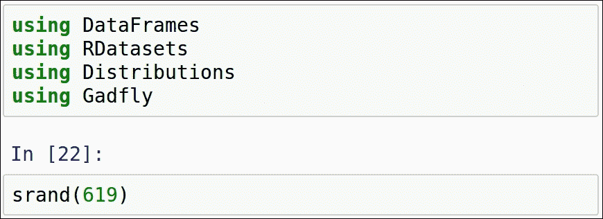
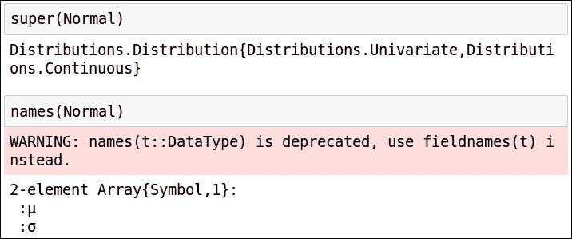
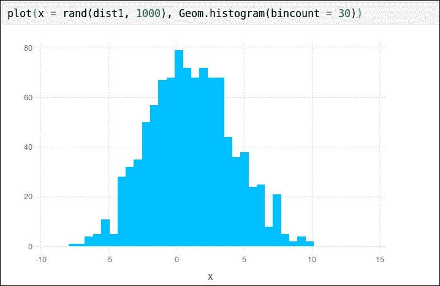
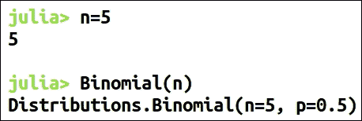
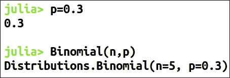
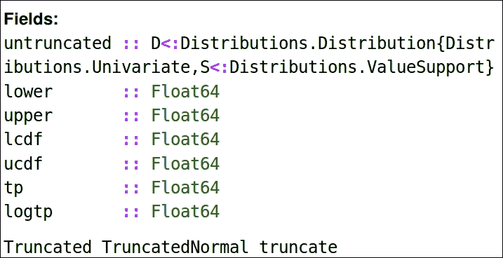
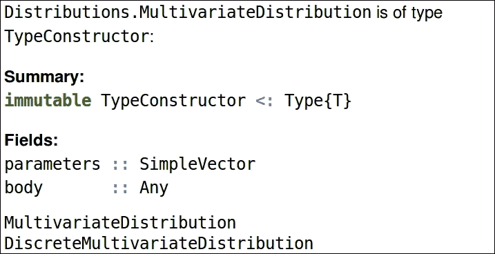
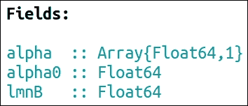
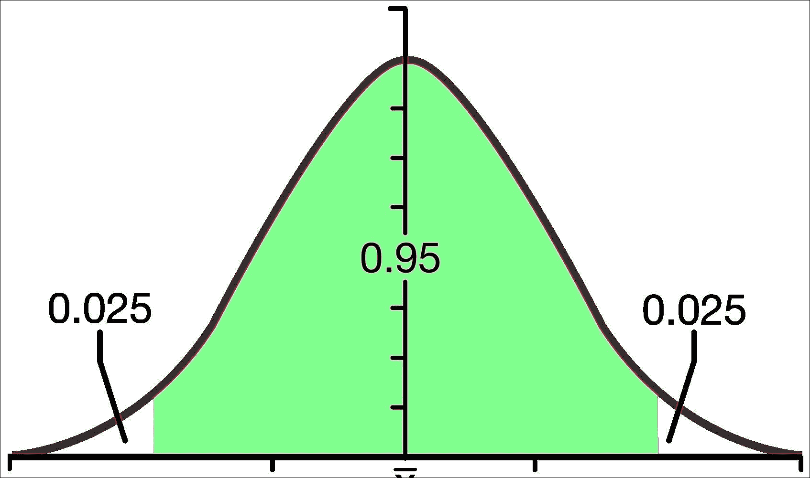
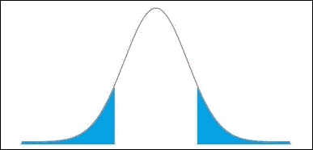

# 四、深入探究推断统计学

我们的世界是一台大数据生成机器。这些日常活动由随机和复杂的事件组成，可以用来更好地理解多元分布:正态分布、伽玛分布、二项式分布。为了实现这一点，我们将努力更深入地了解这些过程。

**推断统计学**是在从样本数据中获得的证据和推理的基础上得出一个结论，该样本数据是针对总体而言的。推断统计学认为会有一些抽样误差，这意味着我们从总体中抽取的样本可能不能完全代表总体。

推理统计包括:

*   估计
*   假设检验

样本和总体有什么区别？群体是我们想要获得知识的所有事件或观察的集合。但是它的规模可能是如此之大，以至于分析这种观察的每个事件并不总是方便或可行的。在这种情况下，我们选择一个子集，这个子集很好地定义了我们想要分析的人群。我们称这个子集为总体样本。

在上一章中，我们讨论了描述统计学。虽然推断统计和描述统计都是对同一组数据进行的，但它们是完全不同的。我们可以只对这个样本数据应用描述性统计，但是推断统计利用这个样本数据和其他样本数据来作出对更大人群有效的概括。

因此，描述性统计以数字或图形的形式提供了数据的概要。它只帮助我们理解我们所拥有的数据，但是我们不能使用这些结果来形成一个适用于所有人群的结论。

通过推理统计，我们试图建立一个适用于全体人口的结论。但是推断统计学受到两个主要条件的限制:

*   我们的样本数据是否真的代表了人口
*   我们为使样本数据代表总体而形成的计算假设是否正确

总有一定程度的不确定性，即从总体中提取的样本数据可能会也可能不会完美地代表总体。因此，我们做出一些估计或假设来处理这种不确定性，这种不确定性又会对我们生成的结果产生影响。

在 Julia 中，我们有各种包，用于推断统计。一个这样的包是`Distributions.jl`，它提供了与概率分布相关的函数。`Distributions.jl`涵盖以下统计方法:

*   分布的性质-均值、方差、偏度、峰度(矩)和熵
*   概率密度/质量函数
*   特征函数
*   最大似然估计
*   **最大后验概率估计**

# 安装

`Distributions.jl`是一个已注册的 Julia 包，因此可以使用:

```jl
julia> Pkg.add("Distributions") 

```

接下来的部分需要安装软件包。因此，我们假设您现在已经添加了这个包。


# 了解抽样分布

抽样分布是从随机抽取的总体样本中收集所有可能的统计数据的可能性。在不完全了解总体的情况下，利用抽样分布可以得到有用的信息。假设我们正在计算样本均值，但我们不知道总体。尽管如此，我们可以假设样本均值在总体均值的一定数量的标准差范围内。


# 了解正态分布

正态分布是推断统计的核心。它就像一条钟形曲线(也称为高斯曲线)。大多数复杂的过程都可以用正态分布来定义。

让我们看看正态分布是什么样的。首先，我们将导入必要的包。我们现在包括 RDatasets，但以后会使用它:



我们首先设置种子，然后研究普通函数:



根据给出的警告，我们也可以用`fieldnames`代替`names`。建议只使用新版 Julia 的`fieldnames`。

这里，我们可以看到正态函数在分布包中，具有单变量和连续的特性。`normal()`函数的构造函数接受两个参数:

*   平均值(μ)
*   标准偏差(σ)

让我们举例说明一个正态分布。我们将保持平均值(μ)为 1.0，标准偏差(σ)为`3.0`:


我们可以检查我们保存的平均值和标准偏差:


使用这个正态分布对象，我们现在可以使用随机函数创建一个分布:


为了更好地理解这个函数，让我们使用牛虻绘制一个直方图:



## 参数估计

这是用来找出什么样的分布是最好的描述。为此，我们可以使用`fit`函数:


我们使用`[1.0, 3.0]`来创建`x`，我们可以看到估计值非常接近。


# 在 Distributions.jl 中键入层次

`Distributions.jl`中提供的功能遵循层次结构。让我们浏览一下，以了解该软件包的功能。

## 了解样品

Sampleable 是一个抽象类型，包括采样器和分布，从中可以提取样本。其定义如下:


可以抽取的样本种类由两种参数类型定义:

*   VariateForm:

    *   单变量:标量数
    *   多元:数字向量
    *   Matrixvariate:数字矩阵

*   ValueSupport:

    *   离散:整数
    *   连续:浮动 64

我们可以提取关于 Sampleable 对象生成的样本的信息。根据变量的形式，一个数组可以包含多个样本。我们可以使用各种函数来获取信息(假设`sampobj`是可采样对象):

*   `length(sampobj)`:顾名思义，它给出样本的长度，当对象为单变量时为 1
*   `size(sampobj)`:返回样品的形状
*   `nsamples(sampobj, X)`:返回 X 中的样本数
*   `eltype(sampobj)`:返回样本中元素的默认类型
*   `rand(sampobj, x)`: This returns x number of samples taken from the sample:

    *   对于`sampobj=univariate`，返回长度为 x 的向量
    *   对于`sampobj=multivariate`，返回 x 列的矩阵
    *   对于`sampobj=matrix-variate`，返回一个样本矩阵的数组

### 表示概率分布

为了更好地表示概率分布，使用了分布，它是可抽样的一个子类型:


为了便于使用，我们通常使用`typealias`来表示常用的发行版:

```jl
julia> typealias UnivariateDistribution{S<:ValueSupport}   Distribution{Univariate,S} 

julia> typealias MultivariateDistribution{S<:ValueSupport} Distribution{Multivariate,S} 

julia> typealias MatrixDistribution{S<:ValueSupport}       Distribution{Matrixvariate,S} 

```


# 单变量分布

每个样本都是标量的分布是单变量分布。我们可以根据它们支持的价值将它们进一步分为两个发行版:

*   一元连续分布
*   单变量离散分布

抽象类型:

```jl
julia> typealias UnivariateDistribution{S<:ValueSupport} Distribution{Univariate,S} 

julia> typealias DiscreteUnivariateDistribution   Distribution{Univariate, Discrete} 
julia> typealias ContinuousUnivariateDistribution Distribution{Univariate, Continuous} 

```

包中为单变量分布实现了许多方法，提供了必要的功能。

## 检索参数

*   `params(distributionX)`:这将返回一组参数
*   `succprob(distributionX)`:返回成功的概率
*   `failprob(distributionX)`:返回失败的概率
*   `dof(distributionX):`这返回了自由度
*   `ncategories(distributionX)`:返回类别数
*   `ntrials(distributionX)`:返回试验次数

## 统计功能

常见的统计函数如`mean()`、`median()`、`mode()`、`std()`、`var()`等都适用于这些分布。

## 概率评估

除了各种统计函数，Julia 还提供了评估概率的函数:

*   `pdf(distributionX)` : `pdf`指概率密度函数。它返回`distributionX`的概率向量。一系列值也可以作为函数的第二个参数以`a:b`的形式提供。
*   `cdf(distributionX)` : `cdf`指累积分布函数。
*   `insupport(distributionX,x)`:支持函数返回`distributionX, x`是否支持。

## 单变量分布中的抽样

我们之前已经讨论过随机数生成。它还可用于从分布中抽取样本:

```jl
julia> rand(distributionX)

```

这将从`distributionX`抽取一个样本。它使用多重分派，我们可以根据需要提供其他参数:

```jl
Julia> rand(distributionX,n) 

```

这将从`distributionX`返回 n 个独立样本的向量。

## 了解离散单变量分布和类型

离散单变量分布是这些分布的超类型，从这些分布中抽取的样本是一个整数。

### 伯努利分布

伯努利分布是一种离散分布。它有两种可能的结果，假设它们是 *n=0* 和 *n=1* 。这里，如果我们把 *n=1* 作为成功，其概率为 *p* ，那么 *n=0* 为失败，概率为 *q=1-p* 其中 *0 < p < 1* 。

在 Julia 中，伯努利分布实现如下:

```jl
julia> Bernoulli(p) 

```

这里，`p`是成功率(概率)。

### 二项分布

二项式分布是另一种离散概率分布。它由 *P [p] (n|N)* 给出，即在 N 次伯努利试验中获得 N 次成功。在一系列独立试验之后，获得的成功数是二项分布:


这是一个二项式分布，试验次数=1，成功率，`p=0.5`:



这里我们已经指定了`trials=5`的编号。成功率保持默认:



我们也可以定义成功率。因此，这将返回一个分布，其中试验次数=5，成功率为`p=0.3`。

## 连续分布

连续单变量分布是所有连续单变量分布的超类型，从连续单变量分布中抽取的每个样本都属于`Float64`类型。

### 柯西分布

柯西分布也叫洛伦兹分布。这是一个描述共振行为的连续分布:


这给出了标准柯西分布(位置= 0.0，比例= 1.0):


我们可以传递参数。这张图给出了位置为`u`和规模为`s`的柯西分布。

### 驰分布

k 自由度的卡方分布是卡方随机变量的平方根形成的分布，卡方随机变量是正态分布的 k 个自变量的平方和。

在 Julia 中，它是这样实现的:

```jl
julia> Chi(k) 

```

这将形成具有`k`个自由度的 Chi 分布。

它用于通过除以卡方分布的平均值，在正态分布的标准偏差的无偏估计中产生校正因子。

### 卡方分布

自由度为 *k* 的卡方分布是 *k* 个独立标准正态随机变量的平方和的分布。

在 Julia 中，它是这样实现的:

```jl
julia> Chisq(k) 

```

这里，`k`是自由度。

卡方检验中常用的卡方分布的意义是:

*   它用于获得观察分布的拟合优度
*   在正态分布中，它用于从样本标准差中获得总体标准差的置信区间估计
*   它还用于获得定性数据分类标准的独立性


# 截断分布

有时需要将分布限制在特定的域或范围内，限制分布的结果称为截断分布。当我们只能记录指定范围内的事件或给定阈值时，这些选项非常有用:


当它被限制在两个常数之间时，这就是截断分布。在 Julia 中，它是这样实现的:


1.  非截尾情况:∞ = a，b = +∞。
2.  下截尾情况:∞ < a，b = +∞。
3.  上截断情形:∞ = a，b < +∞。
4.  双重截断情形:∞ < a，b < +∞



。

然而，一些适用于单变量分布的统计函数也适用于一般的截断分布。这些函数不可用的原因是，由于截断，计算变得复杂。

## 截尾正态分布

这是一种特殊类型的分布，其中截断分布形成正态分布。

可以使用专用构造函数`TruncatedNormal`或通过将普通构造函数作为参数提供给截断构造函数来实现:

```jl
Julia> TruncatedNormal(mu, sigma, l, u) 

```

由于这是正态分布，一般截尾分布不可用的统计函数可用于截尾正态分布。


# 了解多元分布

多元概率分布是包含一个以上随机变量的分布。这些随机变量之间可能有也可能没有任何相关性。从这个分布中抽取的样本是一个向量。`Distributions.jl`实现了常用的多元函数——*多项式*，多元*常态，*和*狄利克雷。*它们的实现方式如下:



其类型别名如下所示:

```jl
julia> typealias MultivariateDistribution{S<:ValueSupport} Distribution{Multivariate,S} 

julia> typealias DiscreteMultivariateDistribution   Distribution{Multivariate, Discrete} 
julia> typealias ContinuousMultivariateDistribution Distribution{Multivariate, Continuous} 

```

适用于单变量分布的大多数方法也适用于多元分布。

## 多项式分布

这推广了二项分布。假设在分类分布的大小为 k 的有限集上，我们进行 *n* 次独立抽取。

我们把这个表示为: *X = X [1] ，X [2] ，............x[k]。*

那么这个 *X* 代表一个多项式分布，它的每个样本都是一个 k 维整数向量，总和为 *n* 。

在 Julia 中，它是这样实现的:

```jl
julia> Multinomial(n, p) 

```

这里，p 代表概率向量，我们用 n 次试验来创建分布。

## 多元正态分布

这是正态分布的多维概括:


多元正态分布重要的原因:

*   数学简单性:使用这种分布更容易
*   **中心极限定理**的多元版本:如果我们有一组独立且同分布的随机向量 *X [1] ，X [2] ，…，X [n]* ，那么样本均值向量 X 对于大样本来说将近似为多元正态分布
*   它被用于许多自然现象的建模


实现了三种类型的协方差矩阵:

*   完全协方差。
*   对角协方差。
*   各向同性协方差。

```jl
julia> typealias FullNormal MvNormal{PDMat,    Vector{Float64}} 
julia> typealias DiagNormal MvNormal{PDiagMat, Vector{Float64}} 
julia> typealias IsoNormal  MvNormal{ScalMat,  Vector{Float64}} 

julia> typealias ZeroMeanFullNormal MvNormal{PDMat,    ZeroVector{Float64}} 
julia> typealias ZeroMeanDiagNormal MvNormal{PDiagMat, ZeroVector{Float64}} 
julia> typealias ZeroMeanIsoNormal  MvNormal{ScalMat,  ZeroVector{Float64}} 

```

平均向量是`Vector{Float64}`的一个实例，或者`ZeroVector{Float64}.ZeroVector{Float64}`是用零填充的向量。

多元正态分布通过以下方式构建:

*   `MvNormal(mu, sig)` : `mu`指均值，sig 指协方差
*   我们没有通过平均值，因此平均值将为零
*   `MvNormal(d,sig)` : `d`这里指的是尺寸

## 狄利克雷分布

狄利克雷分布表示多项式分布之前的共轭。这是指如果多项式参数的先验分布是狄利克雷分布，则后验分布也是狄利克雷分布的条件:


这告诉我们，狄利克雷是多元族的一部分，是一个连续分布:



狄利克雷方法接受一些参数。这被用作:

```jl
julia> Dirichlet(alpha) 

```

这里α是一个矢量:

```jl
julia> Dirichlet(k, a) 

```

在此，`a`是一个正标量。


# 了解矩阵变量分布

这是一个分布，从中抽取的任何样本都属于矩阵类型。许多可用于单变量和多变量分布的方法也可用于矩阵变量分布。

## Wishart 配送

这是一种矩阵变量分布，是卡方分布对两个或更多变量的推广。它是由同分布、独立、零均值的多元正态随机向量的内积相加而成的。它被用作多元正态随机数据的样本协方差矩阵分布的模型，在按样本大小缩放后:

```jl
julia> Wishart(v, S) 

```

这里，`v`是指自由度，`S`是基矩阵。

## 逆 Wishart 分布

这是多元正态分布协方差矩阵之前的共轭。在 Julia 中，它是这样实现的:

```jl
julia> InverseWishart(v, P) 

```

这代表了具有`v`自由度和基础矩阵`P`的逆 Wishart 分布。


# 分布拟合

分布拟合是对一系列数据进行概率分布的拟合，以预测某一区间内变量现象发生的概率。我们可以从分布中得到很好的预测，它与数据非常接近。根据分布和现象的特征，一些可以与数据更接近地拟合:

```jl
julia> d = fit(Distribution_type, dataset) 

```

这使类型`Distribution_type`的分布符合给定的数据集；`dataset.x`为数组类型，包含所有样本。拟合函数找到拟合分布的最佳方法。

## 配送选择

通过数据相对于平均值的对称性或偏斜度来选择分布。

### 对称分布

对于倾向于具有钟形曲线的对称分布，正态分布和逻辑分布是最合适的。当峰度较高时，这些值远离中心分布，然后也可以使用学生的 t 分布。

### 向右倾斜分布

也称为正偏度，这是指较大值与平均值的距离大于较小值与平均值的距离。在这些情况下，对数正态分布和对数逻辑分布最适合。此外，指数分布、威布尔分布、帕累托分布和冈贝尔分布也适用于某些情况。

### 向左倾斜分布

负偏斜或向左偏斜是指较小值与平均值的距离大于较大值与平均值的距离。对于这样的数据，平方正态分布、Gompertz 分布和反转或镜像 Gumbel 分布是合适的。

## 最大似然估计

**极大似然估计** ( **MLE** )是对给定的统计量进行参数估计的过程，使给定的分布达到最大值。这是一个分析性的最大化过程。

例如，我们有一个总体样本，但由于某种原因，我们无法测量整个总体。我们想知道这个群体的一些统计数据；这可以通过假设数据是正态分布的最大似然估计来完成。最大似然法将根据我们拥有的数据和给定的模型给出概率最高的参数值。

mle 的样本属性:

*   无偏最小方差估计量(大样本)
*   置信界限可以通过计算近似正态分布和近似样本方差来生成
*   可以用来测试关于模型和参数的假设

mle 的缺点:

*   少数故障的 MLEs 可能很重(大样本量无法克服这一点)
*   计算最大似然估计需要求解复杂的非线性方程

MLE 通过为定义的统计模型和给定的数据集选择一组模型参数值来最大化似然函数。对于大样本量(趋于无穷大)，最大似然估计具有以下特征:

*   **效率**:MLE 的渐近均方误差是所有相合估计量中最低的
*   **渐近正态性**:随着样本量的增加，MLE 分布趋于高斯分布
*   **一致性**:序列的概率收敛于估计值
*   在对偏差进行校正之后，它具有二阶效率

在 Julia 中，我们有一个最大似然估计函数，`fit_mle`。这使用了多次派单:

```jl
julia> fit_mle(Distribution, dataset) 

```

*   `dataset`可以是一元分布的数组。
*   `dataset`是多元分布的矩阵:

```jl
 julia> fit_mle(Distribution, weights, dataset)

```

*   这包括一个额外的参数 weights，它是一个长度为`n`的数组。`n`等于数据集中包含的样本数。

在撰写本文时，`fit_mle`已经在以下最常用的发行版中实现:

*   **单变量分布**:正态分布、伽玛分布、二项式分布、伯努利分布、分类分布、均匀分布、拉普拉斯分布、指数分布、几何分布等等
*   **多元分布**:多项式、多元正态和狄利克雷分布

如前所述，`fit_mle`使用了多个分派。一些发行版的实现与其他发行版有很大的不同。

至于二项分布:

*   `fit_mle(BinomialDistribution, numOfTrials, dataset, weights)`:试验次数是一个附加参数，代表每次试验的次数。`weights`是可选参数。

至于分类分布:

*   `fit_mle(CategoricalDistribution, spaceSize, dataset, weights)` : `spaceSize`是表示不同值的数量的附加参数。`weights`是可选参数。

## 充分统计

Julia 提供了一个函数，可以用来生成估计，然后应用最大似然估计(`fit_mle`)。

用法:

```jl
julia> gensuffstats = suffstats(Distribution, dataset, weights) 

```

这里，`weights`是可选参数。这生成了数据集的足够统计数据，现在我们可以应用`fit_mle`:

```jl
julia>  fit_mle(Distribution, gensuffstats) 

```

使用充分统计函数的原因是因为它更有效。

## 最大后验估计

这也被称为能量最小化。待估计的参数，虽然是未知的，但被认为是固定的，不像 MLE，它被认为是一个随机变量。

在贝叶斯分析中，对于我们想要估计的物理过程的参数，我们可能具有先验信息，这些信息可能来自经验证据或其他科学知识。这些信息可以编码在待估计参数的**概率分布函数** ( **pdf** )中:

```jl
julia> posterior(priori, suffst) 

```

这将返回后验分布，该分布基于由充分统计提供的数据，并且与先验分布(先验分布)具有相同的类型。

您可以生成最大后验概率估计，如下所示:

```jl
julia> fit_map(priori, G, dataset[, weights]) 

```

这里的`G`是似然模型(或分布)。

您可以按如下方式生成完整的分配:

```jl
julia> complete(priori, G, params) 

```

这将给出给定参数 param 和似然模型 g 的完整分布。


# 置信区间

这描述了在估计的总体值范围内与未知总体参数相关的不确定性的数量。



## 解释置信区间

假设给定总体均值大于 100 小于 300，置信区间为 95%。

一般认为，人口平均数落在 100 和 300 之间的可能性是 95%。这是错误的，因为总体均值不是一个随机变量，而是一个常数，不会改变，它落在任何指定范围内的概率是 0 到 1。

与取样方法相关的不确定性水平由置信水平描述。假设选择不同的样本，并为每个样本计算不同的区间估计，我们使用相同的采样方法。真实的总体参数将包含在一些区间估计中，但不是所有的区间估计中。

因此，95%的置信水平意味着总体参数包含在 95%的区间估计中。

以下是构建置信区间的步骤:

*   识别样本统计
*   选择置信水平
*   Calculate the margin of error:

    *误差幅度=统计的标准偏差(误差)×临界值*

*   Describe the confidence level:

    *置信区间=误差幅度+样本统计量*

在 Julia 中，使用`ci`函数计算置信区间。通用函数`ci`有 12 种方法:

```jl
ci(x::HypothesisTests.Btest) 
ci(x::HypothesisTests.BTest, alpha::Float64)

ci(x::HypothesisTests.BinomialTest) 
ci(x::HypothesisTests.BinomialTest, alpha::Float64)

ci(x::HypothesisTests.SignTest) 
ci(x::HypothesisTests.SignTest, alpha::Float64)

ci(x::HypothesisTests.FisherExactTest) 
ci(x::HypothesisTests.FisherExactTest, alpha::Float64)
ci(x::HypothesisTests.TTest) 
ci(x::HypothesisTests.TTest, alpha::Float64)

ci(x::HypothesisTests.PowerDivergenceTest) 
ci(x::HypothesisTests.PowerDivergenceTest, alpha::Float64) 

```

### 用法

为了得到二项式比例的置信区间，其使用如下:

```jl
julia> ci(test::BinomialTest,alpha=0.05; tail=:both,method=:clopper_pearson) 

```

这将计算覆盖范围为 1-alpha 的置信区间。使用的方法是 clopper pearson。

Other methods can also be used:

*   沃尔德间隔(`:wald`)
*   威尔逊评分区间(`:wilson`)
*   杰弗里斯区间(`:jeffrey`)
*   Agresti Coull 区间(`:agresti_coull`)

为了得到多项式比例的置信区间，其使用如下:

```jl
julia> ci(test::PowerDivergenceTest, alpha=0.05; tail=:both, method=:sison_glaz) 

```

除`sison_glaz`以外的其他方法:

*   引导区间(`:bootstrap`)
*   克森伯里，赫斯特区间(`:quesenberry_hurst`
*   黄金区间(`:gold`)


# 了解 z 值

z 得分是指元素远离平均值的标准偏差。

它由以下公式给出:


这里`X`代表元素的值，σ是标准差，μ是总体均值。

## 解释 z 分数

*   `z-score<0`:元素小于平均值
*   `z-score>0`:元素大于平均值
*   `z-score=0`:元素等于平均值
*   `z-score=0.5`:该元素比平均值大 0.5 SD

在 Julia 中，它是这样实现的:

```jl
julia> zscore(X,  μ, σ) 

```

μ和σ是可选的，因为它们可以通过函数计算。


# 理解 P 值的意义

即使被证明为真，无效假设被拒绝的概率就是 p 值。当两个测度之间没有差异时，这个假设就被称为零假设。

例如，如果有一个假设，在足球比赛中，每个踢满 90 分钟的球员都会进球，那么这个无效假设就是踢满 90 分钟和进球之间没有关系。

另一个例子是假设 A 型血的人比 b 型血的人血压高。在无效假设中，没有差异，也就是说，血型和血压之间没有关系。

显著性水平由(α)给出，如果 p 值等于或小于它，则宣布零假设不一致或无效。这样的假设被拒绝。

## 单尾和双尾检验

下图显示了用于假设检验的两条尾巴。



在 Julia 中，计算如下:

```jl
julia> pvalue(test::HypothesisTest; tail=:both) 

```

这将返回双尾检验的 p 值。使用`tail=:left`或`tail=:right`获得单尾测试的 p 值。


# 总结

在这一章中，我们深入研究了推断统计学，了解了 Julia 中处理不同类型数据集的各种概念和方法。我们从理解正态分布开始，这是处理统计数据时必须的。与此同时，我们开始探索 Distributions.jl 和 Julia 提供的各种方法。然后我们继续讨论单变量分布，并理解为什么它们如此重要。我们还研究了其他一些分布，如卡方分布、卡方分布和柯西分布。在本章的后面，我们学习了 z 值、p 值、单尾和双尾检验的内容。学习完本章后，我们应该能够理解数据集并应用推理统计来获得洞察力，以及使用 z 得分和 p 值来接受或拒绝我们的假设。


# 参考文献

*   [http://docs.julialang.org/en/release-0.4/manual/](http://docs.julialang.org/en/release-0.4/manual/)
*   [https://github.com/JuliaStats/Distributions.jl](https://github.com/JuliaStats/Distributions.jl)
*   [https://people . sc . FSU . edu/~ jburkardt/presentations/truncated _ normal . pdf](https://people.sc.fsu.edu/~jburkardt/presentations/truncated_normal.pdf)
*   [https://onlinecourses.science.psu.edu/](https://onlinecourses.science.psu.edu/)