# 一、Jupyter和数据科学

Jupyter 产品源自 IPython 项目。IPython 项目用于提供对 Python 的交互式在线访问。随着时间的推移，以同样的方式与其他编程语言(如 R)交互变得非常有用。从 Python 中分离出来后，这个工具发展成了目前的 Jupyter。IPython 仍然是一个可用的活跃工具。

Jupyter 是一个适用于各种平台的 web 应用。它还可以在您的台式机/笔记本上通过多种安装方式使用。在本书中，我们将探索在 Windows PC 上使用 Jupyter，以及通过互联网为其他提供商使用 Jupyter。


# Jupyter 概念

Jupyter 是围绕几个基本概念组织的:

*   **笔记本**:语句集合(用一种语言)。例如，这可能是一个完整的 R 脚本，它加载数据、分析数据、生成图表并在其他地方记录结果。
*   **Cell**:Jupyter 笔记本中可以使用的最小颗粒:
    *   **当前单元格**:当前正在编辑的单元格或选中的单元格
*   **内核**:每个笔记本都与一个特定的语言实现相关联。Jupyter 中处理特定语言的部分叫做内核。


# jupiter 用户界面的初步观察

我们可以直接进去看看朱庇特能提供什么。Jupyter 屏幕看起来像这样:

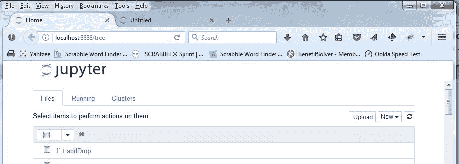

因此，Jupyter 被部署为一个可以在您的机器上访问的网站(或者可以像互联网上的任何其他网站一样被访问)。

我们看到页面的 URL，`http://localhost:8888/tree`。`localhost`是您机器上运行的 web 服务器的别名。我们在网络服务器上访问的网站是在一个*树*显示中。这是默认显示。这符合 Jupyter 中项目的显示。Jupyter 以树状布局显示对象，很像 Windows 文件资源管理器。主页列出了许多项目；每个项目都有自己的子目录，并包含对每个项目内容的进一步描述。根据 Jupyter 的启动位置，当前目录的现有内容也会显示出来。


# 详细介绍 Jupyter 选项卡

在网页上，我们有即将熟悉的 Jupyter 徽标和三个选项卡:

*   文件
*   运转
*   簇

“文件”选项卡列出了 Jupyter 可用的对象。Jupyter 使用的文件作为常规文件存储在您的磁盘上。Jupyter 提供了上下文管理器，知道如何处理你正在使用的不同类型的文件和程序。当您使用 Windows 资源管理器查看文件内容时，可以看到 Jupyter 文件(文件扩展名为`.ipynb`)。您还可以在 Jupyter 窗口中看到非 Jupyter 文件。

“正在运行”选项卡列出了已经启动的笔记本。Jupyter 会跟踪哪些笔记本正在运行。此选项卡允许您随时控制哪些笔记本正在运行。

Clusters 选项卡适用于使用多台机器运行 Jupyter 的环境。

Jupyter 的集群实现是一个值得专门讨论的话题。


# 我可以用 Jupyter 做什么动作？

接下来，我们看到:

*   提示选择要执行操作的项目
*   上传按钮
*   新的下拉菜单和
*   刷新图标

提示告诉您可以选择多个项目，然后对所有项目执行相同的操作。以下大多数操作(在菜单中)可以在单个项目或一组选定的项目上执行。

“上传”按钮将提示您选择要上传到 Jupyter 的文件。这通常用于将数据文件移动到项目中，以便在 Jupyter 作为网站在远程位置运行的情况下进行访问，在这种情况下，您不能将文件复制到 Jupyter 运行的磁盘上。

新的下拉菜单提供了不同种类的 Jupyter 项目(内核)的列表:

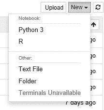

我们可以看到 Jupyter 知道如何创建的对象列表:

*   文本文件:创建在该文件夹中使用的文本文件。例如，如果笔记本要导入文件，您可以使用此功能创建文件。
*   文件夹:是的，就像在 Windows 文件资源管理器中一样。
*   终端不可用:灰显，此功能可在 Nix 环境中使用。
*   笔记本:灰显，-这不是一个真正的文件类型，但这个安装知道如何创建不同类型的笔记本的标题。
*   Julia 0.4.5:创建一个 Julia 笔记本，其中的代码是用 Julia 语言编写的。
*   Python 3:创建一个用 Python 语言编码的笔记本。这是默认值。
*   R:创建一个用 R 语言编码的笔记本。
*   根据您在安装中安装的内核，您可能会看到列出的其他笔记本类型。


# Jupyter 可以操纵哪些物体？

如果我们启动其中一个笔记本(它将在 Jupyter 对象列表中被自动选中),现在查看针对所选对象的下拉操作，我们将看到如下显示:

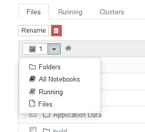

我们看到菜单操作已经更改为重命名，因为这是最有可能对一个文件采取的操作，我们还有一个图标来删除项目(垃圾桶图标)。

项目计数现在是 1(我们在列表中选择了一个对象)，一个项目的图标是一个填充的蓝色正方形(表示它是一个正在运行的项目)，一个熟悉的主页图标将我们带回上一个屏幕截图中显示的 Jupyter 主页。

该对象的菜单有以下选项:

*   文件夹:选择可用的文件夹
*   所有笔记本:选择 Jupyter 笔记本
*   跑步:选择跑步笔记本
*   文件:选择目录中的文件

如果我们向下滚动对象显示，我们会在可用对象列表中看到稍微不同的信息。列出的每个对象都有一个类型(由关联的图标形状表示)和一个用户在创建时分配的名称。

每个对象都是一个 Jupyter 项目，可以单独访问、共享和移动。每个项目都有一个完整的名称，由创建项目的用户输入，还有一个图标将这个条目描述为一个项目。我们将看到对应于其他项目组件的其他 Jupyter 图标，如下所示:


# 查看 Jupyter 项目显示

如果我们下拉新菜单并选择 Python 3，Jupyter 将创建一个新的 Python 笔记本并显示其内容。我们将看到如下所示的显示:


我们制作了一款新的 Jupyter 笔记本，正在展示中。标志在那里。标题默认为`Untitled`，我们可以点击更改。有一个(自动保存)标记，告诉你 Jupyter 已经自动将你的笔记本保存到磁盘上(并且会在你工作时继续定期这样做)。

我们现在有一个菜单栏和一个表示，这个笔记本使用 Python 3 作为它的源语言。菜单选项包括:

*   文件:标准文件操作
*   编辑:用于编辑单元格内容(更多内容请见下文)
*   查看:更改笔记本的显示
*   插入:在笔记本中插入单元格
*   单元格:更改单元格的格式和用法
*   内核:调整笔记本使用的内核
*   帮助:调出 Jupyter 的帮助系统


# 文件菜单

“文件”菜单有以下选项:

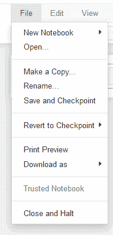

*   新笔记本:类似于从主页下拉。
*   打开...:打开笔记本。
*   复制一份...:抄一个本子。
*   重新命名...:重命名笔记本。
*   保存和检查点:在检查点保存当前笔记本。检查点是笔记本历史记录中的特定点，如果您改变了对最近一组更改的想法，可以保留这些点以返回到检查点。
*   打印预览:类似于您在其他情况下使用的任何打印预览。
*   下载方式:允许您以多种格式存储笔记本。最值得注意的格式是 PDF 或 Excel，这将允许你与无法访问 Jupyter 的用户共享笔记本。
*   可信笔记本:(该功能灰显)。当用户打开笔记本时，服务器使用用户的密钥计算签名，并将其与存储在笔记本元数据中的签名进行比较。如果签名匹配，笔记本中的 HTML 和 JavaScript 输出将在加载时被信任，否则不被信任。
*   关闭并暂停:关闭当前笔记本并停止它在 Jupyter 系统中的运行。


# 编辑菜单

“编辑”菜单有以下选项:

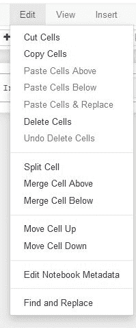

*   切割细胞:典型的切割操作。
*   复制单元格:假设您习惯于将单元格复制到内存缓冲区，然后粘贴到笔记本中的另一个位置的 GUI 操作。
*   在上方粘贴单元格:如果您已经选择了一个单元格，并且您已经复制了一个单元格，此选项将不会灰显，并且会在当前单元格上方粘贴缓冲单元格。
*   在下面粘贴单元格:类似于上一个选项。
*   删除单元格:将删除选定的单元格。
*   撤消删除单元格。
*   分割单元格:这里有一个样式问题，即在一个单元格中放多少条语句。很多时候，您会从一个包含许多语句的单元格开始，然后多次拆分该单元格，将单个或一组语句拆分到它们自己的单元格中。
*   合并上方单元格:将当前单元格与其上方的单元格合并。
*   合并下面的单元格:类似于上一个选项。
*   上移单元格:将当前单元格移动到其上一个单元格之前。
*   向下移动单元格。
*   编辑笔记本元数据:供高级用户修改 Jupyter 为您的笔记本使用的内部编程语言。
*   查找和替换:定位单元格中的特定文本，并可能替换。


# 查看菜单

“视图”菜单有以下选项:

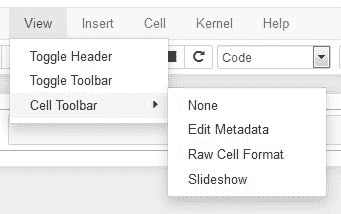

*   切换标题:切换 Jupyter 标题的显示
*   切换工具栏:切换 Jupyter 工具栏的显示
*   单元格工具栏:更改正在编辑的单元格的显示项目:
    *   无:不显示单元格工具栏
    *   编辑元数据:直接编辑单元格元数据
    *   原始单元格格式:编辑 Jupyter 使用的原始单元格格式
    *   幻灯片放映:以幻灯片放映的方式浏览单元格


# 插入菜单

“插入”菜单有以下选项:

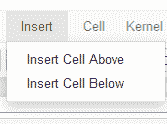

*   在上方插入单元格:在当前单元格之前插入复制的缓冲单元格
*   在下面插入单元格:与上一个相同


# 单元格菜单

单元格菜单有以下选项:

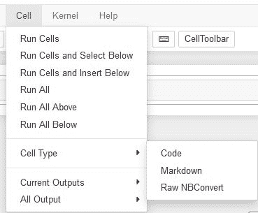

*   运行单元格:运行笔记本中的所有单元格
*   运行单元格并选择下方:运行单元格并选择当前下方的所有单元格
*   运行单元格并插入下方:运行单元格并添加空白单元格
*   全部运行:运行所有单元格
*   运行全部以上:运行当前以上的所有单元格
*   运行所有以下内容:运行当前以下的所有单元格
*   单元格类型:将选定单元格的类型更改为:
    *   代码:这是默认设置—单元格应该有语言语句
    *   Markdown:单元格包含 HTML markdown，-通常用于以最佳方式显示笔记本(因为它是一个网站，所以所有的 HTML 都可用)
    *   Raw NBConvert:这是一种内部 Jupyter 格式，基本上是纯文本
*   当前输出:是清除还是继续单元格的输出
*   所有输出


# 内核菜单

内核菜单用于控制笔记本使用的底层语言引擎。菜单选项如下。我认为菜单中的许多选项很少使用:


*   中断:暂时停止底层语言引擎，然后让它继续
*   Restart:重新启动底层语言引擎
*   重启并清除输出
*   全部重启并运行
*   重新连接:如果您要中断内核，那么您需要重新连接以再次开始运行
*   更改内核:将笔记本中使用的语言更改为您的安装中可用的语言


# 帮助菜单

“帮助”菜单显示 Jupyter 和语言上下文选项的帮助选项。例如，在我们的 Python 笔记本中，我们看到了可能使用的常见 Python 库的选择:

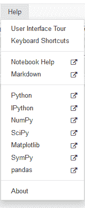

# 图标工具栏

在常规菜单的正下方是一个图标工具栏，其中包含许多常用的菜单项，以便更快地使用，如下图所示:


图标对应于之前的菜单选项(按出现的顺序排列):

*   归档/保存当前笔记本
*   在下面插入单元格
*   剪切当前单元格
*   复制当前单元格
*   在下面粘贴单元格
*   向上移动选定的单元格
*   下移选定的单元格
*   从所选单元格向下运行
*   中断内核
*   重启内核
*   我们可以应用于当前单元格的格式列表
*   用于打开带有描述性名称的命令选项板的图标
*   用于打开单元格工具栏的图标


# 当我们执行脚本时，它看起来怎么样？

如果我们为笔记本提供一个名称，输入一个简单的 Python 脚本，并执行笔记本单元格，我们将看到如下显示:


剧本是:

```jl
name = "Dan Toomey"
state = "MA"
print(name + " lives in " + state)
```

我们给 name 和 state 变量赋值，然后打印出来。

如果你注意到了，我把这些语句放在了两个不同的单元格中。这只是为了可读性。他们可能都在同一个牢房或三个不同的牢房。

每个单元格都分配有行号。对于第一个单元格，编号总是从 1 开始，然后随着您四处移动单元格，编号可能会增加(如您所见，第一个单元格在显示中被标记为单元格 2)。

在第二个单元格下面，我们有不可编辑的显示结果。Jupyter 总是显示其下一个单元格的相应输出。这也可能包括错误信息。


# 行业数据科学应用

这本书是关于 Jupyter 和数据科学的。我们介绍了朱庇特。现在，我们可以看看数据科学实践，然后看看这两个概念是如何协同工作的。

数据科学应用于许多行业。有趣的是，我们注意到了工业界所涉及的主要技术和使用的算法。我们可以在 Jupyter 中看到同样的技术。

数据科学的一些较大用户行业包括:

| **行业** | **大数据科学使用** | **技术/算法** |
| 金融 | 对冲基金 | 计算机编程语言 |
| 投机 | 确定赔率 | 稀有 |
| 保险 | 衡量和定价风险 | 多米诺骨牌 |
| 小额银行业务 | 风险，客户分析，产品分析 | 稀有 |
| 采矿 | 智能探索，产量优化 | 计算机编程语言 |
| 消费品 | 定价和分销 | 稀有 |
| 卫生保健 | 药物发现和试验 | 计算机编程语言 |

所有这些数据科学研究都可以在 Jupyter 中完成，因为使用的语言得到了完全的支持。


# 现实生活中的例子

在本节中，我们将看到几个取自当前行业焦点的示例，并将它们应用于 Jupyter 以确保其实用性。


# 金融，Python -欧式看涨期权估价

在 https://www . safari books online . com/library/view/Python-for-Finance/9781491945360/ch03 . html 中有一个这样的例子，它摘自 Yves Hilpisch 的书 *Python for Finance* 。所使用的模型对于财务工作来说是相当标准的。

我们想得出看涨期权的理论价值。看涨期权是在一定时间范围内以特定(执行)价格购买证券的权利，如 IBM 股票。期权的定价基于证券相对于执行价格和当前价格的风险或波动性。这个例子使用了一个只能在到期时执行的欧式期权，这简化了问题集。

该示例使用 Black-Scholes 模型进行期权估价，其中我们有:

*   初始股指水平 *S [0] = 100*
*   欧式看涨期权的执行价格 *K = 105*
*   到期时间 *T = 1 年*
*   恒定的无风险短期利率 *r = 5%*
*   恒定波动率 *σ = 20%*

这些元素组成以下公式:


使用的算法如下:

1.  从标准正态分布中抽取 *I* (伪)随机数。
2.  计算上式中给定的 *z* ( *i* )在到期日*S[T](*I*)的所有结果指数水平。计算期权到期时的所有内部价值为*h[T]*(*I*)= max(*S[T]*(*I*)-*K*，0)。*
3.  通过以下等式中给出的蒙特卡洛估算法估算期权现值:


剧本如下。我们用`numpy`来表示所用的密集数学。其余的代码是典型的:

```jl
from numpy import * # set parameters S0 = 100. K = 105. T = 1.0 r = 0.05 sigma = 0.2 # how many samples we are using I = 100000 random.seed(103) z = random.standard_normal(I) ST = S0 * exp((r - 0.5 * sigma ** 2) * T + sigma * sqrt(T) * z) hT = maximum(ST - K, 0) C0 = exp(-r * T) * sum(hT) / I # tell user results print ("Value of the European Call Option %5.3f" % C0)
```

Jupyter 下的结果如下截图所示:

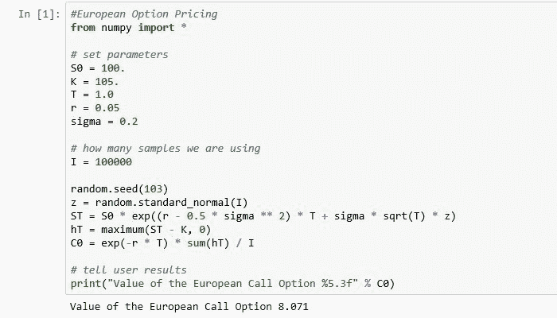

由于所用随机数的差异，`8.071`值与公布的预期值 *8.019* 一致。(我正在播种随机数生成器，以获得可重复的结果)。


# 金融，Python -蒙特卡罗定价

另一种普遍使用的算法是蒙特卡罗模拟。在蒙特卡洛，正如赌博胜地的名字所暗示的，我们模拟了一个场景中的许多机会，在这个场景中，我们知道不同结果的百分比结果，但不知道在下一个 *N* 机会中将会发生什么。我们可以在[http://www . codeandfinance . com/pricing-options-Monte-Carlo . html](http://www.codeandfinance.com/pricing-options-monte-carlo.html)看到这个模型正在使用。在本例中，我们再次使用 Black-Scholes，但采用了不同的直接方法，我们可以看到各个步骤。

编码如下。Jupyter 的 Python 编码风格与直接在 Python 中使用的略有不同，这可以从代码顶部附近更改的导入中看出。您不只是从库中提取您想要的函数，而是提取整个库，并且编码使用所需的内容:

```jl
import datetime import random # import gauss import math #import exp, sqrt random.seed(103) def generate_asset_price(S,v,r,T):
 return S * exp((r - 0.5 * v**2) * T + v * sqrt(T) * gauss(0,1.0)) def call_payoff(S_T,K):
 return max(0.0,S_T-K) S = 857.29 # underlying price v = 0.2076 # vol of 20.76% r = 0.0014 # rate of 0.14% T = (datetime.date(2013,9,21) - datetime.date(2013,9,3)).days / 365.0 K = 860. simulations = 90000 payoffs = [] discount_factor = math.exp(-r * T) for i in xrange(simulations):
 S_T = generate_asset_price(S,v,r,T) payoffs.append( call_payoff(S_T, K) ) price = discount_factor * (sum(payoffs) / float(simulations)) print ('Price: %.4f' % price)
```

Jupyter 下的结果如下所示:

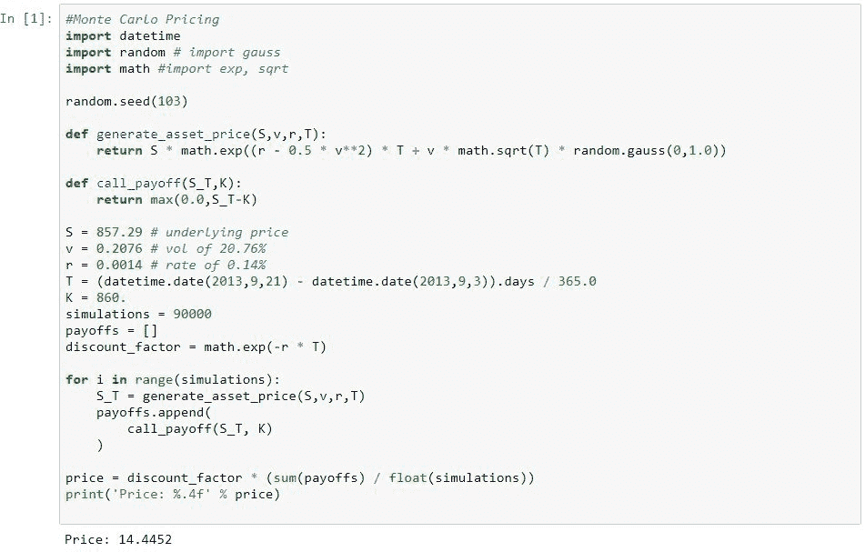

`14.4452`的结果价格接近公布值 *14.5069* 。


# 赌博，R -投注分析

有些赌博游戏真的是掷硬币，有 50%的成功机会。按照这些思路，我们编写了来自 http://forumserver . two plus two . com/25/probability/flipping-coins-getting-3-row-1233506/的代码，它决定了在掷硬币时一系列正面或反面的概率，如果您知道硬币/游戏偏向于一个结果或另一个结果，可以使用触发器。

我们有以下脚本:

```jl
##############################################
# Biased/unbiased  recursion of heads OR tails
##############################################
import numpy as np
import math

N = 14     # number of flips
m = 3      # length of run (must be  > 1 and <= N/2)
p = 0.5   # P(heads)

prob = np.repeat(0.0,N)
h = np.repeat(0.0,N)
t = np.repeat(0.0,N)

h[m] = math.pow(p,m)
t[m] = math.pow(1-p,m)
prob[m] = h[m] + t[m]

for n in range(m+1,2*m):
 h[n] = (1-p)*math.pow(p,m)
 t[n] = p*math.pow(1-p,m)
 prob[n] = prob[n-1] + h[n] + t[n]

for n in range(2*m,N):
 h[n] = ((1-p) - t[n-m] - prob[n-m-1]*(1-p))*math.pow(p,m)
 t[n] = (p - h[n-m] - prob[n-m-1]*p)*math.pow(1-p,m)
 prob[n] = prob[n-1] + h[n] + t[n]

prob[N-1]  
```

前面的代码在 Jupyter 中产生以下输出:

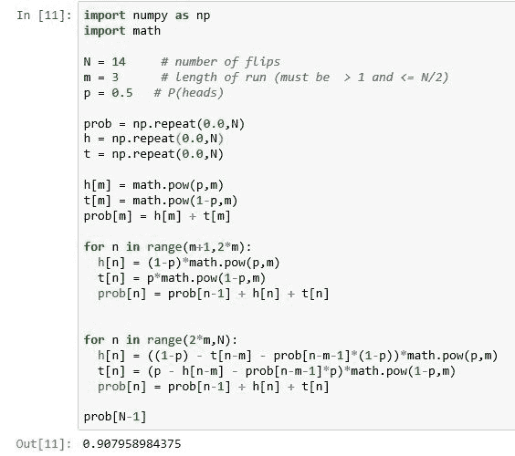

我们最终得到的是在一个不偏不倚的游戏中连续获得三个头像的概率。在这种情况下，有 92%的可能性(在我们已经运行了 14 次翻转的测试范围内)。


# 保险，R -非人寿保险定价

我们有一个使用 R 来为非生命产品定价的例子，特别是轻便摩托车，在[http://www . cybaea . net/journal/2012/03/13/R-code-for-Chapter-2-of-Non _ Life-Insurance-Pricing-with-GLM/](http://www.cybaea.net/journal/2012/03/13/R-code-for-Chapter-2-of-Non_Life-Insurance-Pricing-with-GLM/)。该代码首先创建一个可用于产品线的统计表，然后将定价与实际使用的统计表进行比较。

累积数据的代码的第一部分如下:

```jl
con <- url("http://www2.math.su.se/~esbj/GLMbook/moppe.sas") data <- readLines(con, n = 200L, warn = FALSE, encoding = "unknown") close(con) ## Find the data range data.start <- grep("^cards;", data) + 1L data.end   <- grep("^;", data[data.start:999L]) + data.start - 2L table.1.2  <- read.table(text = data[data.start:data.end],
 header = FALSE, sep = "", quote = "", col.names = c("premiekl", "moptva", "zon", "dur",
 "medskad", "antskad", "riskpre", "helpre", "cell"), na.strings = NULL, colClasses = c(rep("factor", 3), "numeric", rep("integer", 4), "NULL"), comment.char = "") rm(con, data, data.start, data.end) # Remainder of Script adds comments/descriptions comment(table.1.2) <-
 c("Title: Partial casco moped insurance from Wasa insurance, 1994--1999", "Source: http://www2.math.su.se/~esbj/GLMbook/moppe.sas", "Copyright: http://www2.math.su.se/~esbj/GLMbook/") ## See the SAS code for this derived field table.1.2$skadfre = with(table.1.2, antskad / dur) ## English language column names as comments: comment(table.1.2$premiekl) <-
 c("Name: Class", "Code: 1=Weight over 60kg and more than 2 gears", "Code: 2=Other") comment(table.1.2$moptva)   <-
 c("Name: Age", "Code: 1=At most 1 year", "Code: 2=2 years or more") comment(table.1.2$zon)      <-
 c("Name: Zone", "Code: 1=Central and semi-central parts of Sweden's three largest cities", "Code: 2=suburbs and middle-sized towns", "Code: 3=Lesser towns, except those in 5 or 7", "Code: 4=Small towns and countryside, except 5--7", "Code: 5=Northern towns", "Code: 6=Northern countryside", "Code: 7=Gotland (Sweden's largest island)") comment(table.1.2$dur)      <-
 c("Name: Duration", "Unit: year") comment(table.1.2$medskad)  <-
 c("Name: Claim severity", "Unit: SEK") comment(table.1.2$antskad)  <- "Name: No. claims" comment(table.1.2$riskpre)  <-
 c("Name: Pure premium", "Unit: SEK") comment(table.1.2$helpre)   <-
 c("Name: Actual premium", "Note: The premium for one year according to the tariff in force 1999", "Unit: SEK") comment(table.1.2$skadfre)  <-
 c("Name: Claim frequency", "Unit: /year") ## Save results for later save(table.1.2, file = "table.1.2.RData") ## Print the table (not as pretty as the book) print(table.1.2)
```

该表的前 10 行如下所示:

```jl
       premiekl moptva zon    dur medskad antskad riskpre helpre    skadfre
    1         1      1   1   62.9   18256      17    4936   2049 0.27027027
    2         1      1   2  112.9   13632       7     845   1230 0.06200177
    3         1      1   3  133.1   20877       9    1411    762 0.06761833
    4         1      1   4  376.6   13045       7     242    396 0.01858736
    5         1      1   5    9.4       0       0       0    990 0.00000000
    6         1      1   6   70.8   15000       1     212    594 0.01412429
    7         1      1   7    4.4    8018       1    1829    396 0.22727273
    8         1      2   1  352.1    8232      52    1216   1229 0.14768532
    9         1      2   2  840.1    7418      69     609    738 0.08213308
    10        1      2   3 1378.3    7318      75     398    457 0.05441486
```

然后，我们仔细检查每个产品/统计数据，以确定某个产品的定价是否与其他产品一致。注意，`install.packages`语句中的`repos =`子句是 R:

```jl
# make sure the packages we want to use are installed install.packages(c("data.table", "foreach", "ggplot2"), dependencies = TRUE, repos = "http://cran.us.r-project.org") # load the data table we need if (!exists("table.1.2"))
 load("table.1.2.RData") library("foreach") ## We are looking to reproduce table 2.7 which we start building here, ## add columns for our results. table27 <-
 data.frame(rating.factor = c(rep("Vehicle class", nlevels(table.1.2$premiekl)), rep("Vehicle age",   nlevels(table.1.2$moptva)), rep("Zone",          nlevels(table.1.2$zon))), class = c(levels(table.1.2$premiekl), levels(table.1.2$moptva), levels(table.1.2$zon)), stringsAsFactors = FALSE) ## Calculate duration per rating factor level and also set the ## contrasts (using the same idiom as in the code for the previous ## chapter). We use foreach here to execute the loop both for its ## side-effect (setting the contrasts) and to accumulate the sums. # new.cols are set to claims, sums, levels new.cols <-
 foreach (rating.factor = c("premiekl", "moptva", "zon"), .combine = rbind) %do% {
 nclaims <- tapply(table.1.2$antskad, table.1.2[[rating.factor]], sum) sums <- tapply(table.1.2$dur, table.1.2[[rating.factor]], sum) n.levels <- nlevels(table.1.2[[rating.factor]]) contrasts(table.1.2[[rating.factor]]) <- contr.treatment(n.levels)[rank(-sums, ties.method = "first"), ] data.frame(duration = sums, n.claims = nclaims) } table27 <- cbind(table27, new.cols) rm(new.cols) #build frequency distribution model.frequency <-
 glm(antskad ~ premiekl + moptva + zon + offset(log(dur)), data = table.1.2, family = poisson) rels <- coef( model.frequency ) rels <- exp( rels[1] + rels[-1] ) / exp( rels[1] ) table27$rels.frequency <-
 c(c(1, rels[1])[rank(-table27$duration[1:2], ties.method = "first")], c(1, rels[2])[rank(-table27$duration[3:4], ties.method = "first")], c(1, rels[3:8])[rank(-table27$duration[5:11], ties.method = "first")]) # note the severities involved model.severity <-
 glm(medskad ~ premiekl + moptva + zon, data = table.1.2[table.1.2$medskad > 0, ], family = Gamma("log"), weights = antskad) rels <- coef( model.severity ) rels <- exp( rels[1] + rels[-1] ) / exp( rels[1] ) ## Aside: For the canonical link function use ## rels <- rels[1] / (rels[1] + rels[-1]) table27$rels.severity <-
 c(c(1, rels[1])[rank(-table27$duration[1:2], ties.method = "first")], c(1, rels[2])[rank(-table27$duration[3:4], ties.method = "first")], c(1, rels[3:8])[rank(-table27$duration[5:11], ties.method = "first")]) table27$rels.pure.premium <- with(table27, rels.frequency * rels.severity) print(table27, digits = 2)
```

结果显示如下:

```jl
       rating.factor class duration n.claims rels.frequency rels.severity
    1  Vehicle class     1     9833      391           1.00          1.00
    2  Vehicle class     2     8825      395           0.78          0.55
    11   Vehicle age     1     1918      141           1.55          1.79
    21   Vehicle age     2    16740      645           1.00          1.00
    12          Zone     1     1451      206           7.10          1.21
    22          Zone     2     2486      209           4.17          1.07
    3           Zone     3     2889      132           2.23          1.07
    4           Zone     4    10069      207           1.00          1.00
    5           Zone     5      246        6           1.20          1.21
    6           Zone     6     1369       23           0.79          0.98
    7           Zone     7      148        3           1.00          1.20
       rels.pure.premium
    1               1.00
    2               0.42
    11              2.78
    21              1.00
    12              8.62
    22              4.48
    3               2.38
    4               1.00
    5               1.46
    6               0.78
    7               1.20
```

在这里，我们可以看到一些车辆类别(`2`、`6`)的定价与该车辆的统计数据相比非常低，而其他车辆类别(`12`、`22`)的定价过高。


# 消费品，R -营销效果

我们以我在[www . dantoomeysoftware . com/Using _ R _ for _ Marketing _ research . pptx](http://www.dantoomeysoftware.com/Using_R_for_Marketing_Research.pptx)上做的一个演示为例，看看不同的葡萄果汁广告活动的效果。

代码如下:

```jl
#library(s20x)
library(car)

#read the dataset from an existing .csv file
df <- read.csv("C:/Users/Dan/grapeJuice.csv",header=T)

#list the name of each variable (data column) and the first six rows of the dataset
head(df)

# basic statistics of the variables
summary(df)

#set the 1 by 2 layout plot window
par(mfrow = c(1,2))

# boxplot to check if there are outliers
boxplot(df$sales,horizontal = TRUE, xlab="sales")

# histogram to explore the data distribution shape
hist(df$sales,main="",xlab="sales",prob=T)
lines(density(df$sales),lty="dashed",lwd=2.5,col="red")

#divide the dataset into two sub dataset by ad_type
sales_ad_nature = subset(df,ad_type==0)
sales_ad_family = subset(df,ad_type==1)

#calculate the mean of sales with different ad_type
mean(sales_ad_nature$sales)
mean(sales_ad_family$sales)

#set the 1 by 2 layout plot window
par(mfrow = c(1,2))

# histogram to explore the data distribution shapes
hist(sales_ad_nature$sales,main="",xlab="sales with nature production theme ad",prob=T)
lines(density(sales_ad_nature$sales),lty="dashed",lwd=2.5,col="red")

hist(sales_ad_family$sales,main="",xlab="sales with family health caring theme ad",prob=T)
lines(density(sales_ad_family$sales),lty="dashed",lwd=2.5,col="red")  
```

带输出(几个部分):

(来自文件的原始数据，前 10 行):

|  | **销售额** | **价格** | **ad_type** | **价格 _ 苹果** | **价格 _ 饼干** |
| one | Two hundred and twenty-two | Nine point eight three | Zero | Seven point three six | Eight point eight |
| Two | Two hundred and one | Nine point seven two | one | Seven point four three | Nine point six two |
| three | Two hundred and forty-seven | Ten point one five | one | Seven point six six | Eight point nine |
| four | One hundred and sixty-nine | Ten point zero four | Zero | Seven point five seven | Ten point two six |
| five | Three hundred and seventeen | Eight point three eight | one | Seven point three three | Nine point five four |
| six | Two hundred and twenty-seven | Nine point seven four | Zero | Seven point five one | Nine point four nine |

数据统计如下:

```jl
    sales           price           ad_type     price_apple 
    Min.   :131.0   Min.   : 8.200   Min.   :0.0   Min.   :7.300 
    1st Qu.:182.5   1st Qu.: 9.585   1st Qu.:0.0   1st Qu.:7.438 
    Median :204.5   Median : 9.855   Median :0.5   Median :7.580 
    Mean   :216.7   Mean   : 9.738   Mean   :0.5   Mean   :7.659 
    3rd Qu.:244.2   3rd Qu.:10.268   3rd Qu.:1.0   3rd Qu.:7.805 
    Max.   :335.0   Max.   :10.490   Max.   :1.0   Max.   :8.290 
    price_cookies 
    Min.   : 8.790 
    1st Qu.: 9.190 
    Median : 9.515 
    Mean   : 9.622 
    3rd Qu.:10.140 
    Max.   :10.580 
```

数据显示了每场运动的效果。家庭销售更有效:

*   *186.66666666666//自然销售平均值*
*   *246.66666666666//家庭销售均值*

差异在直方图显示中更加明显:

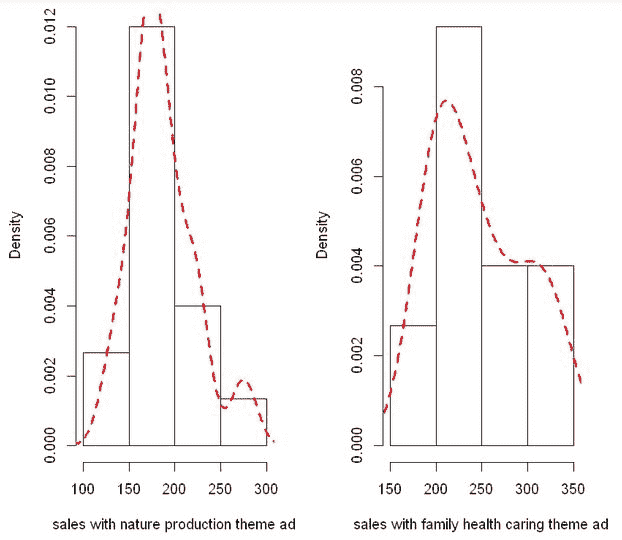

# 使用 docker 和 jupiter

Docker 是一种机制，允许您在一台机器上拥有一个应用的许多完整的虚拟实例。许多软件公司都使用 Docker 来提供完全可扩展的服务实现，并根据需要支持尽可能多的并发用户。

用于处理多个实例的现有机制共享公共资源(例如磁盘地址空间)。在 Docker 下，每个实例都是一个独立于所有其他实例的完整实体。

在 Docker 环境中实现 Jupyter 允许多个用户访问他们自己的 Jupyter 实例，而不必担心干扰其他人的计算。

Docker 的关键特性是允许随时使用不同数量的笔记本实例。Docker 控制系统可以设置为每个访问您笔记本的用户创建新的实例。所有这些都是 Docker 内置的，无需编程；只需使用用户界面来决定如何创建实例。

有两种方法可以使用 Docker:

*   来自公共服务部门
*   在机器上安装 Docker


# 使用公共 Docker 服务

外面有好几种服务。我认为它们的工作方式差不多:注册服务，上传你的笔记本，监控使用情况(Docker 控制程序会自动跟踪使用情况)。例如，如果我们使用[https://hub.docker.com/](https://hub.docker.com/)，我们实际上是在为我们的笔记本使用一个版本库。版本控制在软件开发中用于跟踪随着时间的推移所做的更改。这也允许多个用户访问权限:

1.  首先，报名。这为服务供应商提供了身份验证。
2.  创建一个存储库，用于保存您的笔记本版本。
3.  您需要在您的机器上安装 Docker，以便从/向您的存储库提取/推送笔记本。

安装 Docker 依赖于操作系统。前往[https://www.docker.com/](https://www.docker.com/)主页，获取机器说明。

4.  将您的 Jupyter 图像上传(推送)到您的存储库。
5.  访问存储库中的笔记本。您可以在 Docker 的控制下与他人共享您笔记本的地址(URL ),为不同的用户指定特定的访问权限。
6.  从那时起，它将像在本地运行一样工作。


# 在机器上安装 Docker

除非你安装 Docker 的机器可以被其他人访问，否则你本地机器上的 Docker 只是在公共 Docker 服务上发布的先驱。

另一个选择是在你的机器上安装 Docker。它的工作方式与前一种情况完全一样，只是您要管理 Docker 图像空间。


# 如何与他人分享笔记本

有几种方法可以与他人共享 Jupyter 笔记本:

*   电子邮件
*   放在 Google Drive 上
*   在 GitHub 上分享
*   在 web 服务器上存储为 HTML
*   在 web 服务器上安装 jupiter


# 你能用电子邮件发送笔记本吗？

为了通过电子邮件发送您的笔记本，笔记本必须转换为纯文本格式，作为附件发送给收件人，然后收件人必须将其转换回“二进制”笔记本格式。

电子邮件附件通常被转换成定义明确的 **MIME** ( **多用途互联网邮件扩展**)格式。有一个可以转换笔记本格式的程序，`nb2mail`，可以将笔记本转换成笔记本 MIME 格式。该节目将在[https://github.com/nfultz/nb2mail](https://github.com/nfultz/nb2mail)播出。

用法如下:

*   使用`pip`命令安装`nb2mail`(见网站)
*   将您选择的笔记本转换为 MIME 格式
*   发送给收件人
*   收件人 MIME 转换过程将以正确的方式存储文件(假设他们也安装了`nb2mail`)


# 在 Google Drive 上共享笔记本

Google Drive 可以用来存储您的笔记本个人资料信息。当与之前通过电子邮件将笔记本发送给另一个用户结合使用时，可以使用此功能。收件人可以使用 Google Drive 配置文件，这将阻止任何没有配置文件信息的人与笔记本进行交互。

使用`pip`和`python -m`安装 python 扩展(来自[https://github.com/jupyter/jupyter-drive](https://github.com/jupyter/jupyter-drive))。从那时起，你就可以用谷歌硬盘档案来访问笔记本，就像`ipython notebook -profile <profilename>`一样。


# 在 GitHub 上分享

GitHub(和其他公司)允许你在他们的服务器上放置一个笔记本，一旦有了，可以直接使用 nbviewer 访问。服务器已经安装了支持您的笔记本所需的 Python(和其他语言)编码。nbviewer 是笔记本的只读用途，不是交互式的。

nbviewer 在 https://github.com/jupyter/nbviewer 有售。该站点包括需要添加到`ipython notebook`命令的特定参数，例如启动查看器的命令。


# 在 web 服务器上存储为 HTML

笔记本的一个内置功能是将笔记本导出为不同的格式。其中之一就是 HTML。通过这种方式，您可以将笔记本导出为 HTML，并在进行更改时将文件复制到您的 web 服务器上。

命令是`jupyter nbconvert <notebook name>.ipynb --to html`。

同样，这将是一个非交互式的只读版本的笔记本。


# 在 web 服务器上安装 jupiter

Jupyter 是作为 web 应用部署的。如果您可以直接访问 web 服务器，您可以在 web 服务器上安装 Jupyter，在该 web 服务器上创建笔记本，然后其他人就可以完全动态地使用这些笔记本。

作为 web 服务器，您还可以控制对 web 服务器的访问，因此可以控制谁可以访问您的笔记本。

这是一种高级互动，需要与您的网站管理员一起确定正确的方法。


# 如何保护笔记本？

Jupyter 笔记本的安全性有两个方面:

*   确保只有特定用户可以访问您的笔记本
*   确保您的笔记本不被用于存放恶意代码


# 访问控制

虽然 Jupyter 的许多用途仅仅是为了教育他人，但在某些情况下，所访问的信息是保密的，并且应该保密。Jupyter 允许你以几种方式设置进入你的笔记本的障碍。

当我们识别用户时，我们正在验证该用户。这通常是通过在允许进入之前提供登录质询来完成的，用户必须输入用户名和密码。

如果 Jupyter 托管实例，您的笔记本安装在 web 服务器上，您可以使用 web 服务器的访问控制来限制对您笔记本的访问。此外，大多数支持笔记本托管的供应商都提供了限制特定用户访问的机制。


# 恶意内容

安全的另一个方面是确保笔记本的内容没有恶意。您应该确保您的笔记本安全，如下所示:

*   确保 HTML 被净化(寻找恶意的 HTML 编码并破坏它)
*   不允许您的笔记本执行外部 JavaScript
*   在服务器环境中检查可能是恶意的单元内容
*   净化单元输出，以免对用户机器产生不必要的影响


# 摘要

在这一章中，我们研究了 Jupyter 用户界面的细节:它与什么对象一起工作，Jupyter 可以采取什么动作，显示告诉我们关于数据的什么，以及有什么工具可用？接下来，我们看了一些来自行业的真实例子，展示了几个行业的 R 和 Python 编码。然后，我们看到了与其他用户共享笔记本的一些方法，以及相应地，如何使用不同的安全机制来保护我们的笔记本。

在下一章，我们将会看到在 Jupyter 笔记本中使用 Python 能走多远。