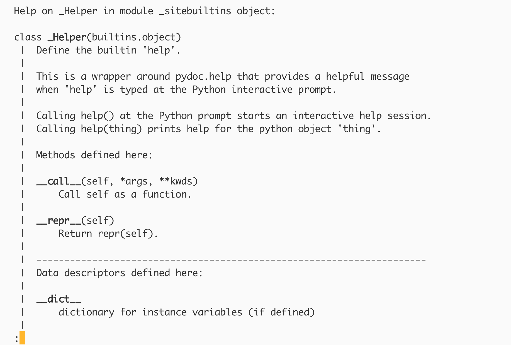
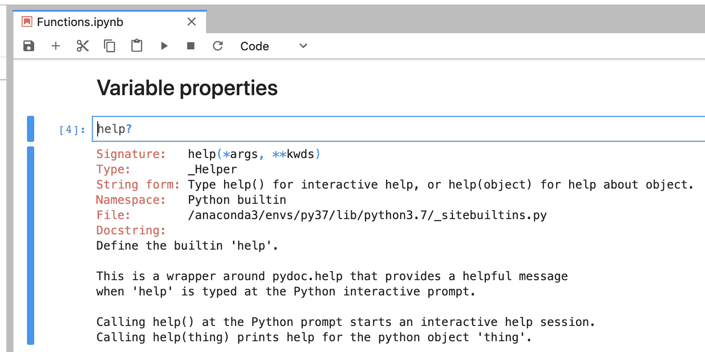
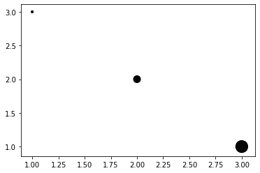

        

# 三、函数

在前一章的结尾，我们解决了一个简单的转换问题，虽然问题解决了，但可以说我们使用的代码并不完全完美；当然，它允许我们更改变量名(例如，更新酒店价格)，但是它仍然难以阅读并且容易出错。此外，代码的某些特定元素是重复的，因为我们对不同的值执行相同的操作。

这与程序员使用的一种代码质量衡量标准完全相反— **不要重复你自己！** ( **)干**)代码——没有重复部分的代码。换句话说，我们多次使用的操作应该一次表达和定义一次。这将允许我们保持代码简短、简洁和有表现力。它将更容易维护、调试和在需要时更改。但这如何实现呢？首先，要用函数。

在本章中，我们将理解函数的概念，回顾 Python 中内置的那些函数，并学习如何构建我们自己的函数，包括通常严格的技术要求、通用设计模式和通用约定。在这个过程中，我们将重写第二章、*中的解决方案——变量和数据类型*,并练习其他实际例子。

特别是，我们将涵盖以下主题:

*   内置函数
*   定义函数
*   重构预算代码
*   匿名(λ)函数
*   递归

        

# 技术要求

本章不需要安装额外的软件包。所有代码都可以在 GitHub 上的`Chapter03`文件夹中找到，[https://GitHub . com/packt publishing/Learn-Python-by-Building-Data-Science-Applications](https://github.com/PacktPublishing/Learn-Python-by-Building-Data-Science-Applications)。

要访问和运行本章和其他章节的示例笔记本，请在 VS 代码中打开从 GitHub 克隆的文件夹，然后切换到它的终端窗口(这样，您就可以保证在正确的文件夹中)并键入`jupyter lab`。运行时，应用将在默认浏览器中打开一个 JupyterLab 笔记本，或者打印一个链接。通过这个链接，进入`Chapter03`文件夹，运行`Functions`笔记本。笔记本运行后，您就可以开始工作了！

        

# 理解函数

函数到底是什么？在编程中，函数是封装了特定任务的命名代码段，可以相对独立于周围的代码使用。大多数(但不是全部)函数是无状态的——它们的结果完全取决于函数的显式输入。

函数在 Python 代码中无处不在。事实上，我们已经使用了一些函数；`print`就是一个例子。这些函数是 Python 默认内置函数库中的一部分。现代Pandas共有 69 个内置函数。在我们开始自己编写函数之前，让我们先回顾一下这些内置函数。

在接下来的章节中，我们将只讨论在整本书中经常用到的几个函数；其他的我们稍后会讨论。我们根据主题将所有函数分为四组，从界面开始。

        

# 界面函数

这里，我们将两个函数放在一起，帮助我们以更方便的方式与代码交互。

        

# 输入函数

基本上与`print`相反的函数是`input`。这个函数将某种问题/陈述作为参数，打印出来，并要求用户给出答案——这个答案将作为函数的结果返回。它确实在 Jupyter 中工作，但是主要用于独立的脚本中。

让我们看看下面的例子:

```jl
>>> name = input('Your name?')
Your name? Guido 
>>> name
Guido
```

如您所见，当我们运行`input`函数时，它会暂停整个计算，等待操作者键入值；一旦添加了一个值，程序就会恢复。

        

# eval 函数

`eval`函数将一个字符串作为参数，并试图将其作为 Python 代码进行解析和执行。如果您从外部来源获得代码，就可以使用这种方法(尽管从安全的角度来看这是有潜在危险的)。

这里有一个例子:

```jl
>>> problem = "2 + 2">>> answer = int(input(problem + ' = '))2 + 2 = 4>>> eval(problem) == answerTrue
```

这里发生了什么事？首先，我们将操作`"2 + 2"`存储为一个字符串。在下一行，我们使用该字符串，连接等号，向用户询问答案。一旦接收到输入，该值就被转换成整数。最后，我们评估这个字符串，就像它是一个 Python 代码一样，并检查结果是否与输入的答案匹配。

使用这种方法，...

        

# 可变属性

正如我们已经知道的，变量是任何代码的关键部分。然而，有时它们会令人困惑，因为我们不确定别名背后隐藏着什么类型的值，以及它有什么属性。下面几节中解释的函数帮助我们检查这些值，查看文档，并探索它们的类型、方法和属性。

        

# 帮助函数

最明显的，也可能是对新手最有用的,`help`函数提供了关于给定值类型、函数或其他实体的信息。让我们得到 meta，看看`help`函数本身是如何工作的。如果你输入`help(help)`，这将是你在 VS 代码中得到的结果(按`q`退出):



在 Jupyter 中，有一个类似的内置命令——问号(`?`)。下面是一个在 Jupyter 中使用问号的例子— `help?`:



一般来说，`help`提供了更长的描述，在任何地方都适用，但是问号作用于变量...

        

# 类型函数

`type`函数返回传递给它的变量的类型。如下例，对于字符串变量，它会返回`str`；对于数字变量，`int`或`float`，以此类推:

```jl
>>> type(‘Hello world')
str
```

这里，该函数返回`Hello world`值的类型，它是一个字符串。这个函数允许我们区分值，即使这不是很清楚。看一下下面的例子:

```jl
>>> type(101)
int

>> type('101')str
```

这里，`type`表示相似的值是一个整数和一个字符串。然而，通常我们不需要知道值的具体类型，而是需要知道值是否属于某种类型(并相应地调整我们的方法)。为此，有`isinstance`。

        

# isinstance 函数

类似于`type`，`isinstance`检查变量是否属于特定的数据类型、结构或类。这对于测试非常有用，或者如果您想要检查参数的正确类型:

```jl
>>> isinstance('Hello world', str)True
```

这里，我们检查了值是否是一个字符串——事实上它是！我们还可以传递多个变量类型，在这种情况下，如果值匹配任何给定的类型，`isinstance`将返回`True`:

```jl
>>> isinstance(1, (int, float))True
```

注意第二个括号，它包围了我们传入的两个值类型。这个括号代表一个元组，一种数据结构，我们将在下一章讨论。

最后，还有`dir`，如果我们需要使用 obscure，...

        

# 目录

运行时，`dir`将返回所有对应的值和方法，连接到给定的对象，作为一个字符串数组。这是一种向下钻取并研究特定变量的所有方法和值的便捷方式:

```jl
>>> dir('Hello world')

['__add__',
 '__class__',
 '__contains__',
 '__delattr__',
 '__dir__',

...

 'rsplit',
 'rstrip',
 'split',
 'splitlines',
 'startswith',
 'strip',
 'swapcase',
 'title',
 'translate',
 'upper',
 'zfill']
```

我们删除了一些行，以便在前面的代码中节省一些空间。你可以随意自己执行这个函数。正如你所看到的，这个列表包括了我们在前一章中描述的所有方法——包括`title`、`upper`和`zfill`，以及其他许多方法。

现在让我们来看看内置的数学函数。

        

# 数学

当然，也有一些函数专门用于数学。事实上，相当一部分存储在专用的`math`和`statistics`内置库中。然而，最常见的是直接融入语言中。让我们在下面的章节中讨论它们。

        

# 丙烯腈-丁二烯-苯乙烯

`abs`函数的名字代表*绝对*。如您所料，它通过删除负号(如果有)返回所传递数字的绝对(正)表示。例如，如果我们将`-1`或`1`作为参数传递，我们将得到`1`作为结果，如下面的代码所示:

```jl
>>> abs(-1)
1

>>> abs(1)
1
```

另一个函数是`round`，也很容易猜到这是做什么的

        

# 圆形函数

`round`函数接受一个浮点数和一个整数作为它的参数。第二个值定义小数点后所需的位数。第二个值是可选的—如果没有传递任何内容，函数将返回一个整数作为结果。以下是`round`函数的一个例子:

```jl
>>> round(3.14159265359, 2)3.14>>> round(3.14159265359)3
```

根据标准程序，如果下一个数字等于`5`或以上，该函数将数值向上舍入；否则，它会向下舍入。

下一节重点介绍使用 iterables 的函数，iterables 是由多个值组成的集合。

        

# 可重复的

我们将在下一章讨论可迭代的和其他的数据结构。现在，您可以将 iterables 想象成由许多值组成的集合。以下函数对这些集合进行操作。

        

# 透镜函数

`len`函数期望一个集合作为输入，并返回这个集合的长度——换句话说，它由多少个元素组成。

我们在下面的代码中测量 string 对象的长度，它也是可迭代的——您可以将它视为字符的集合:

```jl
>>> len('Hello')5
```

的确，这个字有五个字！

        

# 排序函数

这个函数将一个 iterable 作为输入，并返回它，排序。该函数可以接受两个额外的参数— `reverse`(布尔值)和`key`(可迭代)。`reverse`参数允许我们以从大到小的逆序获取值。`key`，如果指定，预计与第一个长度相同，将用于排序。

让我们看看下面的例子:

```jl
>>> sorted('Hi there!')
[' ', 'H', 'e', 'e', 'h', 'i', 'r', 't']

>>> sorted('Hi there!', reverse=True)
['t', 'r', 'i', 'h', 'e', 'e', 'H', '!', ' ']
```

下一个函数不期望您传递一个 iterable，而是生成一个 iterable。

        

# 范围函数

函数生成一个整数序列。它需要一到三个参数，每个参数都应该是一个整数。如果只定义了一个，它将被视为范围的右侧限制，不会包括在内。如果定义了两个，第一个将是左边的限制，并包含在范围内，而第二个将充当右边的限制。如果指定了第三个值，它将被用作一个步长—默认步长等于`1`。

range 函数返回一个生成器，这是一种特殊类型的可动态计算值的 iterable。这就是为什么，为了看到实际的结果，我们需要把它转换成一个列表。

让我们看看下面的例子。这里，我们生成一个范围...

        

# 所有和任何函数

`all`和`any`都以一个数组作为输入，是`&`和`|`对于两个以上变量的逻辑扩展。本质上，它们等于对数组的所有元素重复`&`或`|`。这里有一个例子:

```jl
>>> all((True, False, True))
False

>>> any((True, False, False))
True
```

在第一种情况下，函数返回`False`，因为 iterable 中至少有一个`False`实例。在第二种情况下，至少有一个`True`实例，所以该函数也返回`True`。

        

# 最大、最小和求和函数

`max`、`min`和`sum`函数都接受一个数字数组，并返回最大值、最小值或总和值作为结果。以下是一些例子:

```jl
>>> T = 1,2,3>>> min(T)1>>> max(T)3>>> sum(T)6
```

如你所见，一个元组可以被赋给一个没有任何括号的变量。所有三个结果都是预期的——值`1`、`2`和`3`、`1`是最小值、`3`是最大值，并且这三个值的总和等于`6`。

现在我们知道了什么是函数及其性质，让我们看看如何定义它们，以及为什么定义是重要的。

        

# 定义函数

现在我们已经回顾了内置函数，您可能对作为消费者如何使用它们有了一些了解。但是如何创建自定义函数呢？很简单！你只需要观察下面的结构:

```jl
def function_name(arguments):
   ‘''Documentation string'''  
    # code inside, using arguments
    return  result

```

我们来分析一下。这里，`def`是一个保留的关键字，告诉 Python 我们将要创建一个函数。之后是函数名——遵循与变量相同的规则。该名称后跟一个括号。如果函数需要任何参数，我们应该在这里用名称来表示它们(你可以把它们看作新的变量)。如果你不希望有任何争论，括号应该是空的。

函数确实可以访问外部的变量和函数——因此，您可以使用在函数中其他地方定义的变量，即使没有将它们定义为参数。上下文将被保留—即使导入到另一个上下文中，函数也将使用这些变量。然而，这种方法被认为是一种不好的实践，因为它降低了代码的可读性和透明性。

括号后的冒号标记函数内部范围的开始。请注意，当您点击 *Enter* 时，Jupyter 和 VS 代码都会在下一行添加四个空格的缩进——坚持下去！这种缩进很重要；与其他语言不同，在 Python 中，它是语法的一部分，直接影响计算。同一个缩进中的所有东西都在同一个范围内，例如，在我们的例子中——一个函数的内部级别。在这里赋值的变量，包括函数参数，一旦我们离开这个缩进，就会被删除。

在函数内部作用域的第一行，我们通常定义 docstring——一个关于函数实现什么以及如何使用它的小注释。docstring 不是必需的，但是我们真的真的建议你把它们写出来；你以后会感谢自己的。

`help`和`?`都打印出该函数的 docstring。VS 代码将在工具提示中显示 docstring，只要您开始键入函数名，如果函数是在这个空间中声明的。

最后，我们可以编写函数的实际代码，同时保留缩进。在这段代码中，我们可以使用函数的参数作为变量，即使它们还没有值。

要退出函数并返回一个值，使用`return`关键字——它将返回后面声明的任何变量。一旦函数执行了`return`，Python 就退出函数，永远不会执行`return`语句之后的任何代码。当然，函数不一定要返回任何东西。例如，在 Python 中，在文件系统上创建新文件夹的函数不需要返回任何结果。

这里有一个例子。假设我们想要计算一个负值`v`的`p`次方。我们应该这样定义我们的函数:

```jl
def negative_power(v, p):
    '''Return negative value v in to the power of p'''
    return -1 * (v**p)
```

这里，我们首先用`def`关键字声明函数。接下来，我们陈述函数的名称— `negative_power`。然后，我们声明两个必需的参数— `v`和`p`。在下一行，我们定义一个 docstring，解释这个函数的含义。最后，我们定义该函数运行的实际代码——在这种情况下，它将返回负值的`v`的`p`次方。

让我们试试这个函数。`2`的值乘以`3`的幂，乘以`-1`，就是`-8`。这似乎是正确的，`3`的`2`次方也是如此——结果是`-9`:

```jl
>>> negative_power(2, 3)
-8

>>>negative_power(3, 2)
-9
```

到目前为止，Python 已经按顺序分配了`v`和`p`。我们也可以通过将它们指定为参数来显式指定它们。这样，顺序就无关紧要了。下面的例子说明了这一点——我们以相反的顺序分配参数，一切正常:

```jl
>>> negative_power(p=2, v=3)
-9
```

命名的(显式的)赋值可能更可取，因为这样代码更容易阅读，也更容易出现人为错误。

实际上，函数总是会返回一些东西。即使你在函数中不使用`return`，它也只会返回`None`。Jupyter 不打印或显示`None`，因此，似乎没有返回任何内容，但是如果您愿意，可以将它存储在变量中。

在许多情况下，函数需要大量的参数，其中许多参数是可选的，并且在每次函数调用时重复这些参数会很繁琐。为了避免这种情况，有一种方法可以说明参数的默认值。在下一节中，我们将介绍如何做到这一点。

        

# 默认值

在某些情况下，为特定的参数设置一个默认值是很方便的，这样我们就不需要每次都显式地声明它。例如，我们可以假设大多数情况下，我们需要得到一个负的平方根(当然这取决于具体情况)，每次都显式定义`p=2`会很浪费时间。在这种情况下，我们将不得不通过括号内的`p=2`对我们的代码进行一点修改。下面是代码的显示方式:

```jl
def negative_power(v, p=2):    ‘''Return negative value v in power p'''    return -1 * (v**p)
```

我们仍然必须每次都定义`v`，但是`p`现在是可选的——如果我们不明确声明，它将被假定为等于`2`。下面的代码说明了这种情况。一旦我们不明确地...

        

# 变量位置和变量关键字

在某些情况下，我们事先不知道将传递给函数的参数的确切数量。例如，`print`函数将接受并打印任意数量的参数。使用`*args`可以对我们的自定义函数进行同样的操作。在这种情况下，`args`本身并不是一个关键字，而是所有这些多重值的一个约定俗成的名称，从技术上讲，你可以使用任何你想要的名称。所有的实际工作都由星号来完成——它表示所有传递的值都将被打包到一个元组中(我们将在[第 4 章](9a022822-e79e-4132-808b-4e569046e0a7.xhtml)、*数据结构*中讨论元组)。在函数范围内，您可以使用`args`作为元组变量，或者使用相同的星号传递它。

类似地，在某些情况下，这些多个值被命名为。为了传递多个名称参数，使用`**kwargs`(代表*关键字参数*)。和`args`一样，名字本身只是一个约定；所有繁重的工作都由双星号来完成，它将这些参数组织到一个字典中(另一种数据结构将在下一章中解释)。在函数内，`kwargs`可以作为单个实体(字典)使用，或者使用类似的双星号传递下去。`args`和`kwargs`都应该在所有正常参数之后定义。考虑这个例子:

```jl
def f(a, b, *args, **kwargs):
 return a + b
```

这个函数简单地添加了两个参数。但是，它将接受任意数量的附加参数，而不会对结果产生任何影响。这里有一个例子。

这里，我们传递两个第一参数，分别为`1`和`2`。之后，我们经过`10`。最后，我们再传递一个，命名的参数。由于我们在函数中指定了`*args`和`**kwargs`，这两个参数在执行时都不会产生任何错误。事实上，它们将被完全忽略，因为我们在函数代码中既不使用`args`也不使用`kwargs`，如下所示:

```jl
f(1,2, 10, other_argument=0)
>>> 3
```

`args`和`kwargs`确实很有用。一个经常遇到的情况是当你的函数在你的代码中运行一个外部函数，带有大量的可选参数。不用在你的函数中再一次声明它们，你只需要传递`kwargs`。这样，代码将保持简洁和灵活(同样，如果外部函数的接口发生变化，您也不需要更改代码)。考虑下面的例子:

```jl
# sets up plotting in jupyter
%matplotlib inline 

import pylab as plt

def draw_scatter(x, y, color='k', **kwargs):
    plt.scatter(x, y, color=color, **kwargs)
```

在前面的代码中，我们使用了数据可视化库`matplotlib`的接口之一`pylab`。像大多数可视化函数一样，`plt.scatter`(你猜，这里是用来绘制散点图的)有几十个可选参数，定义标题、标题字体、标题大小、 *x* 轴标题和 *y* 轴标题也是如此，还有颜色、形状、不透明度、大小、市场位置以及其他许多参数。在代码中复制所有这些选项(以及它们的文档)是疯狂的。相反，我们可以将`kwargs`作为一组参数传递给`scatter`函数。

下面是一个函数用法的例子。正如您所看到的，我们可以传递原始`scatter`函数接受的任何变量——它将被传递和使用:

```jl
draw_scatter([1,2,3], [3,2,1], s=[10, 100, 300])
```

结果，我们得到下面的图表。显然，数据是有意义的，但是我们传递的大小参数反映在结果图表中:



在前面的例子中，我们导入了`pylab`库，这是`matplotib`绘图语言的一个接口。导入行中的粒子`import pylab AS plt`，允许我们定义库的别名。虽然别名的名称是任意的，可以是您想要的任何名称，但是大多数流行的库，包括`pylab`，都广泛采用了接近标准的别名。坚持使用流行的代码使代码更容易阅读和理解是有意义的。其他一些具有众所周知别名的库有`pandas` ( `pd`)、`numpy` ( `np`)和`seaborn` ( `sns`)。我们将在接下来的章节中深入讨论导入。

        

# 文档字符串

与命名一样，文档字符串可能看起来是个小问题——但事实并非如此。始终在代码中添加 docstring 它会让你的生产力翻倍！此外，这将有助于你与同事和客户保持良好的关系。

正如我们之前提到的，文档字符串是绑定到特定模块(`.py`文件)、函数或类的简短解释文本。你所需要做的就是把它作为一个字符串写在相应作用域的开头——文件、函数或类的开头。在执行时，那些字符串被存储为一个`__docs__` 变量。更重要的是，所有的编码环境，包括 VS Code 和 Jupyter，都理解 docstrings 以及如何处理它们。

正如我们之前提到的，在朱庇特，...

        

# 键入注释

从 3.6 版本开始，Python 引入了类型注释——这些注释暗示了函数期望获得什么数据类型，以及它将返回什么数据类型。

让我们看看下面的例子。这是我们已经声明过的负幂函数。但是，这一次，我们为函数参数和结果都添加了类型注释:

```jl
def negative_power(v:int, p:int)-> int: 
    '''Return negative value v in power p'''
    return -1 * (v**p)
```

首先，那些额外的字符*不会直接影响代码的执行。这些是类型注释——仅仅是对存储在函数中的参数和返回值的预期数据类型的提示——与 docstrings 一样。*

虽然对代码本身没有影响，但是这些注释可以用于测试目的，如果函数被提供了错误的数据，就会引发错误。最流行的测试工具叫做`mypy`，由 Dropbox 开发。一旦安装完毕，`mypy`就可以运行您的代码，并测试是否有任何带有数据类型注释的操作使用不当。

还有其他的用例。例如，我们将在本书的[第 18 章](e1d8b121-e8db-45da-9dbf-a034664926fa.xhtml)、*使用 RESTful API* 服务模型中使用的 FastAPI web 框架，使用类型注释来验证入站 API 调用，而我们将在[第 20 章](d6c1c88b-c429-4bc7-873a-2d91334a2689.xhtml)、*最佳实践和 Python 性能*中讨论的 Cython 和 Numba，可以使用类型注释来高效地将 Python 编译成优化的 C 代码。

类型注释也不绑定到基本变量类型。您可以使用标准的`typing`包来描述更复杂的需求；例如，您可以使用`Any`类显式描述*任何类型*，或者声明您期望一个填充了字符串变量的元组。然而，类型注释是最近才出现的现象，没有被广泛采用，并且在整个库中支持有限。在本书中，我们将只在[第 18 章](e1d8b121-e8db-45da-9dbf-a034664926fa.xhtml)、*使用 RESTful API* 服务模型时使用它们。

这包括了编写有效函数所需的主要信息。考虑到所有这些，让我们重新看看我们的预算示例！

        

# 重构温度转换

在[第 2 章](5fea535c-b144-4c8b-b20b-0a0ee1c1f157.xhtml)、*编码的第一步——变量和数据类型*中，我们做了一个简单的练习，将华氏温度和摄氏温度相互转换。这种方法类似于我们如何使用计算器，除了我们能够预先存储参数，然后重新运行新输入的计算。在这一点上，你可能会看到这是一个单独函数的好例子。因此，让我们将代码重构为一对函数:

```jl
def fahrenheit_to_celsius(temp):    CONST, RATIO = 32, 5/9    return (temp – CONST) * RATIOdef celsius_to_fahrenheit(temp):    CONST, RATIO = 32, 5/9    return (temp/RATIO) + CONST
```

现在让我们按如下方式测试这些函数:

```jl
>>> fahrenheit_to_celsius(100) ...
```

        

# 了解匿名(λ)函数

在某些情况下，就地声明简单的一次性函数很方便；为此，我们可以使用 lambdas——匿名函数(它们是匿名的，因为你不会将它们存储在内存中，所以它们没有名字)。Lambdas 使用简化的语法:

```jl
lambda <arguments>: <code> 
```

注意这里没有`return` 关键字——`lambda`会自动返回代码的结果。它也不接受多行代码。

看一下这个例子:

```jl
models = [
    ‘Bimbus-3000',
    ‘Nimbus-1000',
    ‘Timbus-2000'
]

sort(models, key=lambda x: x[-4:])
```

上述代码的输出如下所示:

```jl
>>> [‘Nimbus-1000',‘Timbus-2000', ‘Bimbus-3000']
```

这里，字符串数组被排序——然而，字符串的字母数字顺序只适用于最后四个字符，因为我们使用`lambda`将它们作为键返回。

从技术上来说，你可以将`lambda`存储到一个变量中，然后作为一个常规函数来使用。不要这样做！这真是不好的做法。

在学习了匿名函数及其工作原理之后，让我们继续学习递归对函数的意义。

        

# 理解递归

递归是内部嵌套重复的过程。递归的一个众所周知的例子是分形，例如 Sierpiński 地毯——当你不断放大时，形状会重复出现。在编程环境中，递归表示函数从自身调用自身的能力。在某些情况下，这使您的代码更短，更具表现力，因为您可以将复杂的问题分成几组(俄罗斯娃娃？)的简单的。

考虑一个阶乘函数的例子( *N！*在数学上)。一个值的阶乘是从 *1* 到给定数字的乘积——例如，对于 *3，*它将是 *6: 1 * 2 * 3* 。下面是通过递归计算阶乘的一种方法:

```jl
def factorial(n): if n == ...
```

        

# 摘要

在这一章中，我们学习了代码的主要支柱之一——函数。函数允许我们编写可以多次重用的简洁而富有表现力的代码。函数是我们程序的构建模块——无论是报告生成、与 API 的交互，还是训练模型。我们讨论了如何声明标准函数和匿名函数，如何设置参数及其默认值，以及如何使用`args`和`kwargs`进行更灵活的接口设计。我们还学习了如何编写高质量的文档字符串和添加类型注释。最后，我们确实使用函数重写了前一章的代码，这使得代码更具表现力，也更容易出错。

在上一节中，我们定义了递归——一种从函数内部调用函数的方法，它允许我们用简单的链式代码片段解决相当复杂的任务。

在下一章，我们将讨论数据结构。数据结构是程序将许多数据值组成集合的方式。有很多不同的方法来组织你的数据——一些变体适用于一般用途的情况，而另一些则更适用于特定的任务。了解数据结构是编程的重要部分。

        

# 问题

1.  什么是函数，我们应该什么时候使用它们？
2.  如何将数据提供给函数？
3.  缩进是什么意思？需要吗？
4.  docstring 函数应该包含哪些内容？如何读取 docstring 函数？
5.  什么时候使用类型注释会有用？
6.  如果我事先不知道参数的确切数目或它们的名称，如何设计一个函数？
7.  *匿名函数*是什么意思？什么时候应该使用它们？

        

# 进一步阅读

*   *函数式 Python 编程-第二版*，作者 Steven F. Lott，由 Packt 出版([https://www . packtpub . com/application-development/Functional-Python-Programming-Second-Edition](https://www.packtpub.com/application-development/functional-python-programming-second-edition))
*   *Python 中的函数式编程*，作者 Sebastiaan Mathô，由 Packt 出版([https://www . packtpub . com/application-development/Functional-Programming-Python-video](https://www.packtpub.com/application-development/functional-programming-python-video))
*   *Python 类型检查*，盖尔·阿恩·Hjelle(【https://realpython.com/python-type-checking/】T2)