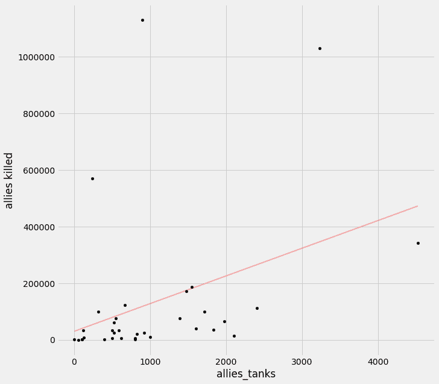

        

# 十三、训练机器学习模型

正如我们在上一章所了解的，数据总是包含有价值的见解。使用统计数据、过滤器和图表进行探索是一个很好的工具。然而，数据还有另一个内在价值——它的预测能力；它可以用于拟合算法(机器学习模型)，然后能够预测感兴趣的值并解释其判断。

**机器学习** ( **ML** )是一个庞大而复杂的话题，显然超出了本书的范围。事实上，构建一个先进而复杂的模型需要深入的特定领域的理论知识以及大量的时间和探索。然而，一些 ML 模型非常简单并且容易理解，并且基本的底层原理都是相同的。许多 ML 模型没有提供好的解释——但是在这里，我们将使用那些提供好的解释的模型。

在本章中，我们将讨论最大似然的基础知识，并在二战数据集上训练一些基本的最大似然模型。我们将进一步解释他们的行为和警告，以及如何减轻一些问题。特别是，我们将涵盖以下内容:

*   ML 基础
*   使用 k-means 算法的无监督学习(聚类)
*   基于 k 近邻和线性模型的监督学习

        

# 技术要求

本章的代码需要两个包— `scikit-learn`和`pydotplus`。像往常一样，你可以在资源库的`Chapter13`文件夹中找到所有的代码。

        

# 了解 ML 的基础知识

顾名思义，**机器学习** ( **ML** )是构建可以从数据中学习的机器(算法)的科学。换句话说，这类算法基于它们从训练数据中推断的关系生成特定的结果(预测)，而不是从硬编码的预定规则中推断的。通常，ML 被描述为有两个主要分支——监督的和非监督的 ML。

无监督模型试图在数据本身中找到结构，而无需关注任何给定的*监督*或*目标*。通常的任务是找到相似记录的集群(例如，用户)，以理解底层的**潜在的**逻辑(例如，使用目标受众和服务的相应用例)。

监督学习就是通过向模型输入成对的*独立特征*和感兴趣的目标变量的正确值作为训练集来*训练*模型。例如，在给定用户操作的情况下，监督式 ML 用于检测欺诈活动，或者获得某个值的估计值(例如，房子的价格)，所有这些都是通过从包含目标变量的训练数据集推断结果来实现的。

许多模型使用复杂的数学，需要巨大的计算能力，但情况并不总是如此——其中一些非常简单易用，易于理解。最重要的是，ML 仅仅运行在数学上；尽管它可能非常有用，可以增强能力，但它永远无法取代常识和批判性思维。

现在让我们四处看看如何训练不同的监督和非监督模型，并用于分析我们的二战数据集。

        

# 探索无监督学习

首先，让我们试试*聚类*我们的数据*。*聚类是一种无监督学习，其目标是仅根据记录的特征对记录进行分组。它通常用于在构建监督模型之前更好地理解数据，或者作为探索性分析的一部分。它也可以单独使用。一个常见的任务是定义服务或产品的目标受众。在我们的例子中，这应该揭示了数据集之间的战斗的相似性。

对于 1 维或 2 维(一列或两列)数据集来说，这项任务似乎很简单——事实上，我们的眼睛和大脑非常擅长视觉上找到聚类。然而，当维度的数量...

        

# 转向监督学习

现在，让我们试试监督学习。正如我们之前讨论的，监督模型被设计用来预测或估计目标变量——或者是连续值(**回归问题**)或者是特定类别(**分类问题**)。其他类型的问题(标记、语义分割等等)可以定义为这两种类型之一。现在让我们浏览一套相对简单的模型。

一个简单但通常非常高效的模型是 **k 近邻** ( **KNN** )算法**。**它非常类似于 k-means，因为它也在欧几里得空间中执行。

        

# k 近邻

**KN** **N** 既可解释又快速，适用于中小型数据集(对于大型数据集，有一个可扩展的修改—近似 KNN)。它还有一个重要的属性——类似于 k-means，它对距离起作用，因此可以看到特征之间的*交互*，这是许多其他算法无法做到的。

KNN 背后的逻辑非常简单——对于它预测的每条记录，它会找到与训练集中给定记录最相似(在特征空间中接近)的 *k* 条最近记录(邻居——因此得名),并从中推断数据。该算法可用于分类(在这种情况下，将采用*邻居*的最频繁类)或回归(计算为邻居值的加权平均值)。...

        

# 线性回归

最后，让我们回顾一下另一种模式——可以说是全世界最成熟、最流行的模式。线性回归实际上是一种历史悠久的统计模型。线性回归背后的思想如下。

假设变量具有线性关系，自变量不相关，特征存在一定的方差，就可以估计自变量和目标变量之间的线性关系。因此，我们的模型将呈现为一组系数，每个特征一个系数(独立变量)，外加一个偏差系数:


这里， *i* 代表记录索引， *p* 代表特征的索引。ε代表模型无法解释的误差。这样，为了计算我们对记录(row) *i* *，*的 *y* 的估计，我们只需将该行中的每个特征乘以相应的系数，并将它们与偏差(β0)相加。所有系数都是通用的，并且是在模型训练期间预先计算的。请看下图:



前面是盟军伤亡的散点图，根据盟军在每场战斗中拥有的坦克数量绘制。这里的(红色)线代表一个线性模型-它由一个偏差(其在 *X=0* 处的 *Y* 坐标)定义，斜率(我们特征的系数)代表坦克的数量。如你所见，这里的直接相关性是正的；趋势是上升的，这并不奇怪——更多的坦克意味着双方更大的军队，因此总的伤亡人数更多。请注意三个异常值记录，它们对模型有重大影响。

线性模型具有独特的属性，尤其是:

*   线性模型很容易解释。本质上，它们为每个特性定义了一个可解释的影响系数。假设我们预测公寓的价格:它会附上一个价格标签，以美元为单位，每平方英尺的价格就是该平方英尺的平均价格。
*   它们不需要缩放。
*   假设非共线性(要素之间不相关)，这些系数独立于其他要素，例如，一平方英尺的价格将独立于位置进行平均估算。
*   线性模型很容易训练，也很容易推断(甚至手动推断)，因为它可以归结为几个数字的简单乘法。
*   与 KNN 相反，线性回归推广到绝对值——你得到的是一组系数，每个特征一个系数(加上**偏差**常数),每个系数回答这个特征对目标变量的平均影响。这很有用，也很容易理解——但是没有比这更深入的了。

同时，由于其线性性质，该算法无法解释数据中的复杂细微差别，并且通常作为预测模型表现不佳。它对异常值也不稳健-如果数据集中有异常值，最好在训练模型之前删除它们。

让我们尝试在数据集上建立一个线性模型。这里，我们需要预测一个连续值，所以让我们试着预测一下盟军的伤亡人数:

1.  首先，让我们准备数据集:

```jl
cols = [
    'allies_infantry', 'axis_infantry',
    'allies_tanks', 'axis_tanks',
    'allies_guns', 'axis_guns',
    'start_num'
]

mask = data[cols + ['allies killed']].isnull().any(1)
```

2.  现在，我们可以划分特性并准备训练集和测试集:

```jl
y = data.loc[~mask, 'allies killed']
X = data.loc[~mask, cols]

Xtrain, Xtest, ytrain, ytest = train_test_split(X, 
                                                y, 
                                                test_size=0.3, 
                                                random_state=2019)
```

3.  最后，我们可以训练数据，看看它的表现如何。
4.  在下面的代码中，我们启动线性回归模型并对其进行定型。最后，我们预测测试的值，并将它们存储在`ypred`变量中:

```jl
from sklearn.linear_model import LinearRegression
from sklearn.metrics import median_absolute_error

model = LinearRegression()
model.fit(Xtrain, ytrain)

ypred = model.predict(Xtest)
```

但是应该如何衡量模型的性能呢？模型本身通常使用平方误差的平均值，但为了解释，我们可以使用中值(或平均值)绝对误差，因为它将保留单位-在我们的情况下，是伤亡人数。事实上，我们的模型并没有表现得非常好——它的中值误差为`42584`人，如下所示:

```jl
>>> median_absolute_error(ytest, ypred)
42584.419274116095
```

由于测试数据集非常小，我们可以打印错误并手动检查它们。

这里，我们计算误差，如下所示:

```jl
>>> (ypred - ytest)

111    4.934710e+04
27    -3.582174e+04
42     2.148667e+04
106   -1.191980e+03
54    -1.007381e+06
49    -9.226890e+05
Name: allies killed, dtype: float64Summary
```

您可以看到 *y* 的正确值和预测值之间的差异。如你所见，除了两个案例，其他案例都低估了真实的伤亡人数。嗯，我们并不期望它是完美的；尽管误差很大，这个线性模型可以给我们一个趋势的*鸟瞰图* *视图*——一些容易消化和讨论的东西。让我们来看看代表每个特征对伤亡的影响的系数:

```jl
>>> pd.Series(model.coef_, index=X.columns)

allies_infantry   0.024922
axis_infantry     0.079912
allies_tanks     -25.215543
axis_tanks       -19.178557
allies_guns       3.797002
axis_guns         0.387496
start_num        -50.093280
dtype: float64
```

在该表中，每个系数代表与每个特征的一个单元相关的平均死亡数。例如，我们看到盟军的每辆坦克都会减少`-25`的伤亡。如果这是一个因果关系，这个数字将是一个可供将军和政府考虑的可操作点。然而，相关性不是因果关系！如果你看下面，每辆轴心国坦克都会减少伤亡人数。不是应该反过来吗？目前还不清楚，但也许我们知道答案:更大的坦克部队可能意味着城市以外的战斗，我们可以想象这些通常涉及更少的步兵——因此，更少的伤亡。一个值得讨论的趋势是，伤亡人数随着时间的推移而减少。

        

# 决策树

最后，我们到达本章的最后一个模型:决策树。与线性模型类似，决策树是分散的，很适合解释，尽管不容易理解。树背后的核心思想与线性模型非常不同，但很容易理解。为了估计结果，该模型生成了一棵二叉树(一种类似树的图表)，其中每个音符(交叉点)代表一个基于已知特征的单个问题，并给出是/否答案。通常是类似于*的伤亡人数小于 1000*的情况。在每个分支的末尾，都附有相应的估算。生成该树是为了最大化预测的平均准确度。

由于树的深度可以变化，决策...

        

# 摘要

在这一章中，我们学习了机器学习的两个分支——监督学习和非监督学习——并练习了构建四个机器学习模型，每个模型都有其优缺点。这些模型中的每一个都可以直接用于创建评估或分析，以了解最重要的特征或趋势。在许多情况下，后者比估计本身更重要、更有用。虽然这些模型不像其他模型(咳咳，神经网络)那样热门和复杂，但它们在任何地方都被广泛采用和使用——在医疗保健、军事、工程、城市规划、政策分析、物流和运营管理中——很可能其中一个模型正在以某种形式运行在你口袋里的设备或你桌子上的计算机上。

我们在本章中训练的特定模型具有默认设置，并使用我们从维基百科收集的原始特征。

在下一章中，我们将学习如何改进模型——通过设计更好的功能集、优化超参数或切换到更复杂的模型。以这个过程为起点，我们还将学习运行计算实验，跟踪代码和数据，并确保可重复的结果。

        

# 问题

1.  什么是机器学习？
2.  有监督和无监督学习有什么区别？
3.  k-means 聚类有什么弊端？为什么我们需要使用定标器？
4.  KNN 模式是如何运作的？这种模式的好处和局限性是什么？
5.  为什么线性回归给出的解释更多？在这种情况下，我们需要缩放数据吗？
6.  与我们描述的其他模型相比，决策树是如何工作的？

        

# 进一步阅读

更多信息，你可以访问以下链接:[https://www.packtpub.com/tech/machine-learning](https://www.packtpub.com/tech/machine-learning)。