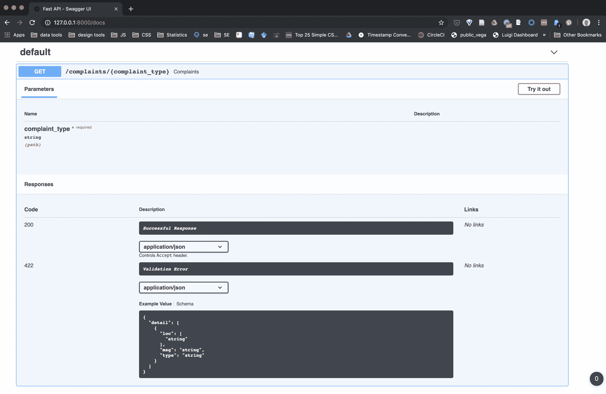
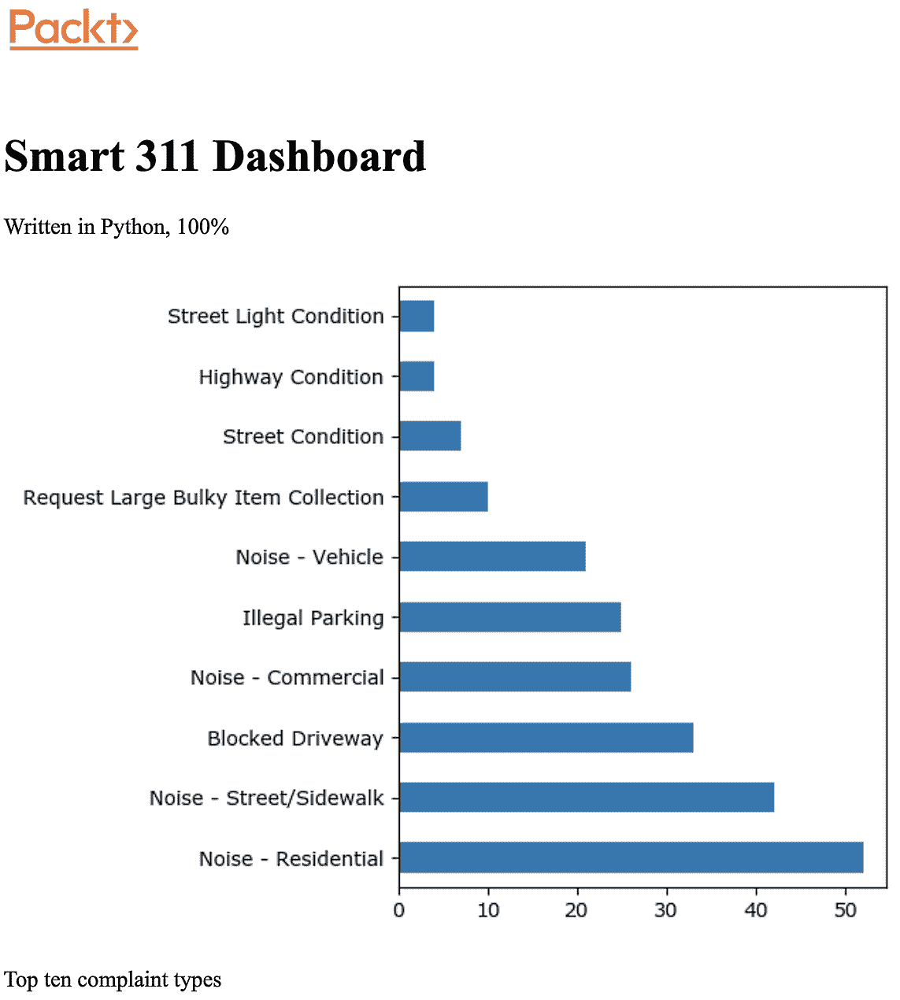
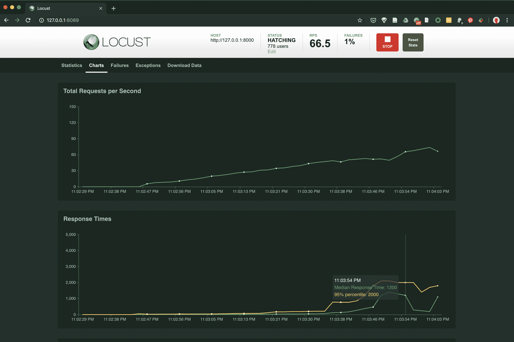

        

# 十八、使用 RESTful API 将模型变成服务

在前一章中，我们讨论了如何创建仪表板。我们采用的一种方法是构建一个静态的、无服务器的 web 页面，而另一种方法需要服务器和应用程序的客户端部分。在这一章中，我们将讨论下一个逻辑步骤:通过 RESTful API 提供对你的数据和/或算法的编程访问——类似于我们在[第 9 章](b8ecbb4e-2220-425e-a65b-0ee129cf2f2f.xhtml)、 *Shell、Git、Conda 等等中使用的——在你的命令下*。API 可以说是交付服务的最普遍、最方便的方式；它对消费者的要求很少(本质上是一个互联网连接)，易于发布和分发，并且可以不断改进。知道如何构建自己的 API 是开发人员的一项基本技能。

本章将涵盖以下主题:

*   什么是 RESTful API？
*   构建基本的 API 服务
*   构建网页
*   通过异步调用加速
*   使用 Locust 包部署和测试您的 API 服务负载

        

# 技术要求

在本章中，我们将使用以下库:

*   FastAPI
*   `pydantic`
*   `uvicorn`
*   `locust`

如果您还没有安装它们，请务必安装它们。为了测试我们的 API，我们将使用`curl`命令行工具。在 Windows 上，你可以安装`curl`或者使用内置的`Invoke-Webrequest`工具，别名为`wget`。

或者，你可以使用邮差，[https://www.getpostman.com](https://www.getpostman.com/)，这是一个独立的免费应用程序，通过一个漂亮的图形界面来测试和探索 web APIs。要安装 Postman，请访问网站并点击“开始”，然后选择“下载”。Postman 有 Windows 和 Linux 版本。它的界面相当干净，简单易学，这里就不赘述了。

所有代码都可以在 GitHub 存储库中找到，在

        

# 什么是 RESTful API？

我们以前在第九章、 *Shell、Git、Conda 等等——在你的命令下*、*、*作为客户使用过 API。因此，假设我们对 API 有所了解是足够安全的:它只是一个允许我们与服务交换数据的接口。从技术上讲，API 可以使用任何协议或通信方式，并且有大量的应用程序具有各种类型的接口。然而，如今，当人们说 API 时，他们可能指的是 RESTful API。这里，**静止**部分代表**再现状态 T** **转移**。REST 基于六个指导性架构原则，但对我们来说更重要的是它基于 HTTP 请求，类似于我们输入 URL 时浏览器执行的请求。

每个 RESTful API 背后都有一个服务器——或者更可能是一组服务器——准备执行命令；这个命令可以服务于整个丰富的 HTML 页面，或者——在 API 的情况下——一些信息，可以是二进制或其他类型的数据结构——最流行的是 XML 和 JSON。

每个 API 背后的服务器运行相应的应用程序。Python 是创建这种应用程序的绝佳语言！像往常一样，有一些设计用来帮助制作 API 的包。由于任务的复杂性，这些工具往往比你的普通库更主动，更能参与到过程中，所以它们通常被称为**框架**。事实上，正如人们常说的，库是你在代码中使用的东西，框架是你将代码放入的东西。让我们在下一节看看可以使用的 Python web 框架的分类。

        

# Python web 框架

Web 框架作为 web 应用程序的主干以及 web 服务器和您的自定义代码之间的中介，扮演着重要的角色。多亏了 web 框架，你可以编写少量的函数和类，并通过 URL 和 web 接口让你的客户访问它们；路由、协议、错误处理和安全预防措施的所有内部工作都由框架负责。

Python 有各种各样的 web 框架，适合任何口味和规模。最受欢迎的是金字塔，姜戈，和烧瓶。Pyramid 和 Django 对于大型复杂的应用程序来说都是很好的选择，并且结合了许多有用的特性，包括 CMS、认证机制和许多其他特性...

        

# 构建基本的 API 服务

一个好的实践是从简单的东西开始，在那里我们不会冒险在我们的代码中出现问题——所以我们可以首先测试框架。让我们从一个简单的 *hello world* 应用程序开始。

让我们深入研究一下，从一个简单的 hello world 风格的应用程序开始，它将返回预定义的值，完全不需要计算:

1.  首先，我们需要导入库并初始化主应用程序对象:

```py
from fastapi import FastAPI
app = FastAPI()
```

2.  接下来，让我们定义我们的玩具数据库:

```py
db = {'noise': 24,
      'broken hydrant': 2}
```

3.  我们现在定义将为每个 URL 请求执行的函数，并返回值:

```py
def complaints(complaint_type: str, hour:int) -> dict:
    return {"complaint_type": complaint_type, "hour": hour, "q": db.get(complaint_type, None)}
```

注意，我们对参数使用了类型注释。对于 FastAPI，这一点很重要——这些类型提示用于验证和自动生成的文档中。

4.  最后，我们需要使用装饰器将我们的函数注册为应用程序的端点:

```py
@app.get("/complaints/{complaint_type}")
def complaints(complaint_type: str, hour:int) -> dict:
    return {"complaint_type": complaint_type, "hour": hour, "q": db.get(complaint_type, None)}
```

注意，我们通过`app.get`方法(类似于 requests 库的方法)指定请求的类型，并将一个变量`complaint_type`编码为 URL 的一部分，就像 f 字符串一样。框架会处理剩下的事情。

5.  现在，我们可以在本地运行服务器:

```py
uvicorn hello_world:app --reload
```

通过这样做，我们触发`uvicorn`和`ASGI server`运行，从`hello_world.py`文件本地服务`app`。

6.  一旦应用程序准备就绪，`uvicorn`将打印一行指向正确的 IP 地址，如下所示:

```py
INFO: Uvicorn running on http://127.0.0.1:8000 (Press CTRL+C to quit)
```

现在，这个链接本身不会做任何事情——没有直接在根上提供的应用程序。

7.  为了测试我们的应用程序，我们需要指定一个资源，添加我们在装饰器中使用的路径，并指定投诉类型，如下例所示:

```py
http://127.0.0.1:8000/complaints/noise?hour=12
>>> {"complaint_type":"noise","hour":12, "q":24}
```

8.  让我们检查一下应用程序是否真的是活动的——写一些明显错误的东西作为投诉类型，不要传递值，看看会发生什么:

```py
http://127.0.0.1:8000/complaints/wrong
>>> {"detail":[{"loc":["query","hour"],"msg":"field required","type":"value_error.missing"}]}

http://127.0.0.1:8000/complaints/wrong?hour=2
>>> {"complaint_type":"wrong","hour":2,"q":null}
```

现在让我们来讨论引擎盖下发生了什么。在我们的函数中，我们声明了两个参数:`complaint_type`和`hour`，每个参数都有特定的类型。前者是在我们提供的路线内定义的；后者没有指定，因为 FastAPI 假定它将作为参数提供。再者，URL 中的一切都是字符串；由于 FastAPI 知道从类型注释中可以得到什么，它将尝试适当地解析我们的值——注意，在响应中，一个小时是一个整数，它没有用引号括起来。

当我们传递一个不正确的 URL 时，首先触发的是没有小时参数；因此，FastAPI 提出了一个方案验证问题；一旦一个小时过去了，请求就被认为是成功的(当然，除了没有值之外)，因为 FastAPI 不知道哪些值对于`complaint_type`(和`hour`)是可接受的。那么，接下来会发生什么？

        

# 使用 OpenAPI 探索服务

现在，暂时不要停止服务器；将`/docs`添加到给定的 IP 地址，您将打开一个 OpenAPI 服务:



如您所见，它显示了我们拥有的一个(也是唯一的)API 端点。这个页面是交互式的，您可以打开端点的选项卡，编写自己的参数(例如，`broken hydrant`)，执行请求，并检查结果。似乎这还不够，还有替代文档——要访问它，只需用`/redoc`替换`/docs`。

一旦完成，让我们继续完成第一次迭代。

        

# 完成我们天真的第一次迭代

假设我们正在为 311 呼叫中心构建一个服务。目标是估计结束投诉所需的预期时间。我们将从一个非常幼稚的模型开始——一个为给定类型的投诉返回中值的模型。因此，它本质上是一个预先计算的查找，类似于我们前面使用的查找；计算中值是琐碎的，所以我们不会涉及它。如果需要，代码会存储在存储库中。因此，我们有一个具有简单键值结构的 JSON 文件；对于每种类型的投诉，它存储了平均时间。

现在，让我们修改现有的 API 来使用这些数据:

1.  首先复制文件，命名为`311v1.py`。现在，让我们使用查找数据创建一个类似于`scikit-learn`模型的简单类:

```py
class naive_model:
    data = None

    def __init__(self, path='./data/model.json'):

        with open(path, 'r') as f:
            self.data = json.load(f)

    def predict(self, type_):
        return self.data.get(type_, None)
```

为什么我们把它做得和`scikit-learn`模型相似？因为那样的话，以后就更容易换成真的了！

2.  现在，我们只需要在加载时初始化模型，并用模型预测的`expected_time`替换硬编码的`hour`值:

```py
app = FastAPI()
model = naive_model()

@app.get("/complaints/time/{complaint_type}")
def complaints(complaint_type: str):
    return {"complaint_type": complaint_type,
            "expected_time": model.predict(complaint_type)}
```

3.  再次通过 Uvicorn 运行它:

```py
uvicorn 311v1:app --reload
```

4.  指定投诉的类型，如下例所示:

```py
$ http://127.0.0.1:8000/complaints/time/noise
{"complaint_type":"water quality","expected_time":19.29}
```

接下来，让我们看看如何验证这些数据。

        

# 数据有效性

我们当前的实现有一个令人讨厌的问题:很容易拼错投诉类型 API 不会让我们知道任何问题；相反，它将把它传递给模型，模型将返回一个空值，因为它找不到相应的投诉类型。

为了使行为更加透明和易于操作，并且不在无效请求上花费任何计算，我们需要验证所有输入。为了做到这一点，让我们使用`Enum`库预先定义我们拥有的投诉类型；与`str`混合允许 FastAPI 将其合并到模式中，如下所示:

```py
class ComplaintType(str, Enum):    other = "other"    commercial = "commercial"    park = "park"    residential = "residential"    street = "street" vehicle ...
```

        

# 通过 POST 请求发送数据

一直以来，我们都使用`@app.get`方法，它代表了预期的 HTTP `GET`请求。顾名思义，这个命令是用来检索信息的，因此被设计用来存储数据的小片段。这个数据可以作为`resource`——URL 的一部分，就像前面例子中的`complaint_type`——或者作为参数附加，就像我们第一个例子中的`hour`。

但是，在某些情况下，您需要传递一个重要的数据结构作为请求的一部分。为此，还有另一个命令:`POST`。你看，从技术上讲，每个请求都有三种传递信息的方式:

*   `URL`，可以包含资源和参数
*   `BODY`，可以存储任意数据
*   `HEADERS`，元数据的一小部分，描述期望的服务器行为，不应该用于 API 行为

最重要的是，HTTP 规范建议不要对`GET`请求使用主体部分，因为这违背了语义。底线是:如果你需要传递一个丰富的数据结构给一个 API，使用`POST`方法并把这个数据结构保存在它的主体中。

让我们想象一下，由于某种原因，我们的应用程序现在需要处理新投诉的输入。每个投诉都存储多条信息:位置、时间、投诉类型、一些描述等等。当然，对于每种数据类型，什么值是可接受的也有一些规则。

为了处理数据结构和验证，FastAPI 使用了另一个包:`pydantic`。让我们把我们期望的结构描述为一个`pydantic`对象。因为我们必须指定投诉类型，所以我们将重用前面例子中的`Enum`对象:

```py
from pydantic import BaseModel
from datetime import datetime

class Complaint(BaseModel):
    complaint_type:ComplaintType
    timestamp:datetime = datetime.now()
    lat:float
    lon:float
    description:str

@app.post("/input/")
def enter_complaint(body: Complaint):
    return body.dict() # for the sake of simplicity just returns value back

```

这里，我们声明了一个`Complaint`对象，它包括投诉类型`Enum`和其他四个参数。当我们用`post`方法包装函数时，路径中没有定义的变量被假定为主体。根据定义，我们将这个参数定义为`Complaint`对象。

        

# 向我们的服务添加功能

此时，我们的 API 有两个`GET`调用和一个`POST`调用。`GET`呼叫根据每类呼叫的历史中值，估计每类投诉结束所需的时间。然而，这种方法显然非常幼稚——它既不考虑地点、时间，也不考虑同一地区排队等候的类似投诉的数量。为了提高我们的估计，让我们使用一个 ML 模型，训练来预测一个给定的投诉类型，地点和时间。你可以在`311model.ipynb`笔记本中找到模特训练的所有细节。重要的是，训练好的模型被存储为 Pickle 文件，并期望四个特征(我们之前收集的):投诉类型、纬度、经度和时间...

        

# 构建网页

虽然 FastAPI 侧重于 API，但它也完全有可能服务于 HTML 页面。该代码将与前面的代码几乎相同——除了我们的函数需要返回这个 HTML 代码。

在 Python 中生成 HTML 的最常见方法是使用 Jinja2 模板引擎——这样，您可以将模板编写为带有一些 Python 注入的 HTML 代码，然后通过提供变量来呈现它们；Jinja 将执行并隐藏注入，返回结果页面。

然而，为了构建一个简单的例子，我们将使用另一个包:VDOM，它允许我们用 Python 生成 **VDOMs** (虚拟文档对象模型的缩写)**，然后将它们转换成 HTML。Flask 非常适合小型项目，但不适合大型复杂的应用程序。**

为了将此页面与主 API 分开，让我们创建一个单独的文件，如下所示:

1.  将其添加到主应用程序中。为此，我们将使用路由器:

```py
# webpage.py
from fastapi import APIRouter
router = APIRouter()
```

2.  现在，我们可以创建一个新的端点，使用路由器，就像它是一个应用程序对象一样:

```py
@router.get('/dashboard', tags=["dashboard"])
def get_dashboard():
    pass
```

3.  现在，让我们生成一个非常简单的 VDOM 对象。为了让它更有趣一点，让我们使用一些预先生成的图像:

```py
image_url = "https://pbs.twimg.com/profile_img/775676979655929856/jn13Vq3D.jpg"
barplot_url = "https://github.com/PacktPublishing/Learn-Python-by-Building-Data-Science-Applications/blob/master/Chapter18/barchart-01.png"
from vdom.helpers import b, div, h1, img, p, span

def dashboard():
    return div(
        span(img(src=image_url, style=dict(width='100', 
                                           heigth='100')), 
             h1('Smart 311 Dashboard')),
        img(width='400', src=barplot_url),
        p('Written in Python, 100%')
    )
```

这里，我们使用多个`vdom.helpers`对象。它们都表示相应的 HTML 标记，并接受 class、ID 和所有其他相应的属性，比如图像对象的`source`，以及一个`style`参数，该参数期望接收一个包含字符串形式的键和值的字典。目前，这个对象仍然是一个 Python 对象。在 Jupyter 笔记本中，可以使用`IPython.display.display`方法进行渲染。对于 FastAPI，我们可以使用`to_html`方法将其转换为原始 HTML。

现在，一个障碍是，默认情况下，FastAPI 使用`starlette`的内置 JSON 响应方法将所有返回值转换为 JSON，底层服务器 FastAPI 就建立在这个方法之上。为了防止它这样做，我们可以显式地使用另一个响应，一个为服务 HTML 而构建的响应。

让我们调整一下我们之前编写的方法，返回包装在 HTML 中的仪表板。考虑下面的代码:

```py
from starlette.responses import HTMLResponse

@router.get('/dashboard', tags=["dashboard"])
def get_dashboard():
    content = dashboard().to_html()
    return HTMLResponse(content=content)

```

最后，我们需要将我们的`router`实体连接回主应用程序，以便它们可以共存；添加路由器是将更多端点添加到应用程序而不是将它们存储在同一个文件中的正确方法。打开`311v2.py`并添加这两行:

```py
import webpage # here, webpage is the file with the router
app.include_router(webpage.router, prefix='/dashboard')
```

现在，您可以检查仪表板是否正在加载:



太棒了。正如我们提到的，FastAPI 专注于 API，因此在 web 页面的上下文中没有什么可提供的，但是它仍然可以以这种方式使用。例如，如果两者都需要，使用相同的服务来支持 API 和某种仪表板是有意义的。

现在让我们讨论 FastAPI 支持的另一个有趣的特性:异步执行。

        

# 通过异步调用加速

现在，让我们转向性能问题。偶尔，我们的应用程序需要不断地被监控，如果需要的话，还需要进行扩展和优化。有一些方法可以逐步加快速度，例如，安装`ujson`包，它的工作方式与内置的`json`完全一样，但是性能更高(因为它是用 C 编写的)。在这种情况下，FastAPI 将自动切换到使用这个库。

潜在的，更显著的性能提升内置于 FastAPI、Uvicorn，并基于 Python 3.4 及以后版本的新特性，*异步调用*。我们确实在[第三章](4ee8a15a-87bb-40c8-8c44-9cd7270b0f21.xhtml)、*功能*中花了一些时间讨论这个特性。简而言之，我们通常使用的所有代码...

        

# 用 Locust 部署和测试您的 API 负载

一旦部署了应用程序，但在公开发布或使用它之前，估计它可以处理多少请求是一个好主意。通常，您可以通过估计高峰期需要执行的请求数量、这些时间段有多长、服务的响应速度有多快等等来大致预测服务的需求。一旦你明确了需求，你就需要测试加载你的应用程序。

测试负载应该在实际部署的服务器上执行，而不是在您的本地主机上。在这里，我们跳过了部署模型的整个主题。我们也没有使用 ngnix 或任何类似的网关服务器，它们会缓存请求，从而显著提高 API 的性能。应用程序的部署值得单独编写一本书，并且可以通过多种方式实现，这取决于您现有的基础设施和资源以及应用程序的重要性。一种流行的方法是生成 Docker 容器，然后任何云基础设施平台都可以提取和部署该容器。我们将在第 20 章、*最佳实践和 Python 性能*中触及容器。

为了运行测试负载，Locust 需要一个简单的 Python 脚本，他们称之为 locustfile。让我们看看如何使用它:

1.  以下代码是我们为 311 API 编写的文件:

```py
from locust import HttpLocust, TaskSet, task

class WebsiteTasks(TaskSet):

    @task
    def preduct(self):
        self.client.get("/predict/residential?latitude=40.675719430504&longitude=-73.860535138411&created_date=2019-06-14T00%3A02%3A11.000")

    @task
    def preduct_async(self):
        self.client.get("/predict_async/residential?latitude=40.675719430504&longitude=-73.860535138411&created_date=2019-06-14T00%3A02%3A11.000")

    @task
    def dashboard(self):
        self.client.get("/dashboard/dashboard")

class WebsiteUser(HttpLocust):

    task_set = WebsiteTasks
    min_wait = 5000
    max_wait = 15000
```

这里，我们以两个预测端点和一个仪表板为目标，保持所有参数不变。

2.  对于更严格的测试，每次生成随机的请求参数是一个好主意，但是现在，让我们保持简单。有了文件，让我们开始吧`locust`:

```py
locust --host=http://127.0.0.1:8000
```

3.  现在，前往`http://127.0.0.1:8089`。
4.  在 Locust 初始表单中，指定所需的用户数量和增长(其他参数可在`locustfile.py`中设置)来模拟并点击 Run。对于下面的截图，我们设置最大用户数为 5000，每秒增长 10。

5.  模拟开始后，您可以通过 Locust 仪表板实时监控结果性能，以及故障和抛出的异常:



在运行时，Locust 将为您提供一个攻击计划:要模仿多少用户以及以什么样的增长率。一旦定义了值，它将开始加载流量，并向您实时显示结果。现在由您来监控和分析结果，并给出最终结论:您的应用程序通过测试了吗？

构建 web 端点是这项工作的一个激动人心的阶段。事实上，你正在让全世界都可以使用你的作品。不要着急，跳过测试部分！确保你的应用程序写得高效、快速并能满足流量负载，可能会节省你大量的时间和精力。

        

# 摘要

在本章中，我们构建了自己的 API，并部署了一个 ML 模型来发送预测作为端点。使用 FastAPI 的内置特性，我们能够生成交互式文档并定义一个模式来验证输入和输出。我们进一步创建了一个简单的 HTML 仪表板，根据请求生成图表，并且我们学习了如何利用异步功能来调优 API 的性能。最后，我们使用开源工具 Locust 在我们的系统上模拟了一个流量负载。

通过这样做，我们快速完成了 API 开发的整个周期:选择框架、添加业务逻辑和测试。如果您想获得灵活性、可伸缩性和丰富性，我们在这个过程中学到的技能是有用的...

        

# 问题

1.  什么是 RESTful API？
2.  哪些 Python 包可以用来构建 RESTful API？
3.  FastAPI 框架的关键特性是什么？
4.  Why OpenAPI (Swagger)?
5.  为什么我们需要 Uvicorn 或 Gunicorn 服务器？
6.  蝗虫包测量什么指标？

        

# 进一步阅读

*   *用 Python 构建 REST API*Wayne Merry 著，Packt 出版([https://www . packtpub . com/we b-development/Building-REST-API-Python-video](https://www.packtpub.com/web-development/building-rest-apis-python-video))
*   *构建 RESTful Python Web 服务*作者 Gaston C. Hillar，由 Packt 出版([https://www . packtpub . com/application-development/Building-RESTful-Python-Web-Services](https://www.packtpub.com/application-development/building-restful-python-web-services))