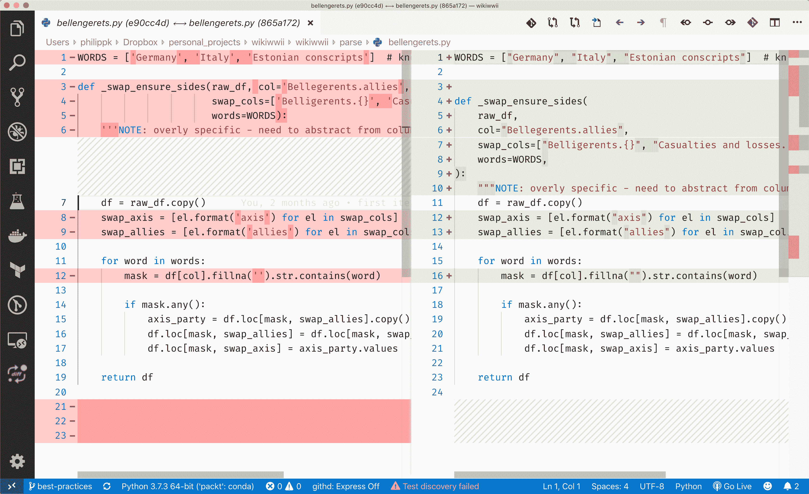
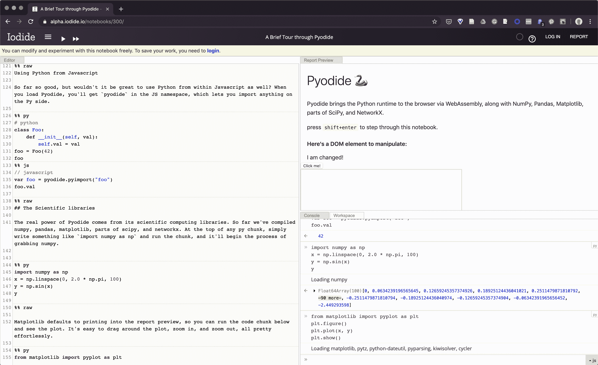

        

# 二十、最佳实践和 Python 性能

在浏览了前面的章节并学习了关于 Python 的各种知识之后，我们来到了最后一章。在这里，我们想讨论一些您可以实现的通用策略，以及如何编写工作更快、更干净、更易于维护的代码。这些方法可以用于面向数据的代码，或者任何其他类型的代码。

本章分为三个部分。第一部分将讨论如何分析和加速代码，第二部分将介绍维护代码的最佳实践，以便您能够更快、更干净地编写代码，在第三部分也是最后一部分，我们将简要概述您可能会发现的非 Python 技术...

        

# 技术要求

本章的代码可以在本书的 GitHub 资源库([https://GitHub . com/packt publishing/Learn-Python-by-Building-Data-Science-Applications](https://github.com/PacktPublishing/Learn-Python-by-Building-Data-Science-Applications))中找到，该资源库存储在`Chapter20`文件夹中。该代码要求安装一系列软件包，包括:

*   `numpy`
*   `scipy`
*   `numba`
*   `dask`
*   `black`
*   `wily`
*   `hypothesis`
*   `line_profiler`
*   `python-graphviz`和`graphviz`

        

# 加速您的 Python 代码

在前一章中，我们讨论了提高代码性能的不同的最佳实践、方法和途径。作为性能的玩具示例，我们将构建自己的 KNN 模型，我们在[第 13 章](c6bd4bea-7b67-46bf-bdf9-761f8b400f75.xhtml)、*训练机器学习模型*中使用了该模型。提醒一下，KNN 是一个简单的 ML 模型，它通过识别训练集中的 *K* 个最接近的记录来预测目标变量，然后采用目标变量的模式(用于分类)或加权平均(用于回归)。显然，已经有相当多的 KNN 实现，所以我们将使用其中一个作为例子。

首先，让我们编写一个简单的实现；通过使用 NumPy 命令，它已经得到了很好的优化。首先，让我们导入所有...

        

# 用 NumPy 重写代码

NumPy 是一个用于快速数值计算的库，是 Python 科学生态系统的基础。它也是 SciPy 和熊猫的脊柱。由于我们有缓慢的数字代码，NumPy 是一个开始优化尝试的好地方。

该算法大部分已经用 NumPy 编写好了——我们无法在`pandas`中执行真正的最近 T4 N 搜索，因为它不支持多维索引。然而，有一个唾手可得的果实:我们的简单模型使用`argsort`来挑选 *N* 条最接近的记录，这确实对整个数据集进行了排序。我们不需要排序，即使是那些最接近的元素——更不用说其他元素了。在这里，我们可以将`np.argsort`方法与`np.argpartition`方法互换。这个函数做的正是我们想要的——它将第 *N* 个最小的距离放在最前面(不管顺序如何),并将所有其他的放在右边:

```
def _closest_N2(X1, X2, N=1):
    matrix = euclidean_distances(X1, X2)
    return np.argpartition(matrix, kth=N, axis=1)[:, :N]
```

为了确保函数可以互换，让我们编写一个简单的测试函数:

```
def _test_closest(f):
    x1 = pd.DataFrame({'a':[1,2], 'b':[20,10]})
    x2 = pd.DataFrame({'a':[2,1, 0], 'b':[10,20, 25]})

    answer = np.array([[1,0, 0]]).T
    assert np.all(f(x2, x1, N=1) == answer)

_test_closest(_closest_N2)
```

随意添加更多的测试用例(这是您可以利用 PyTest 套件的地方)！

现在，我们可以使用这个新函数创建新版本的 KNN:

```
class numpyNearestNeighbour(NearestNeighbor):

    def predict(self, X):
            closest = _closest_N2(X, self.X, N=self.N)
            return np.mean(np.take(ytrain.values, closest), axis=1)
```

注意，我们还去掉了`pd.Series`。这将加快算法的速度，但您可能需要将值包装到外部的序列中。让我们让我们的客户决定这一点。

现在，让我们看看该版本在相同数据集上的表现如何:

```
>>> numpyKNN = numpyNearestNeighbour(N=5)
>>> numpyKNN.fit(Xtrain.values, ytrain.values)

>>> %%timeit
>>> _ = numpyKNN.predict(Xtv)

448 ms ± 14.3 ms per loop (mean ± std. dev. of 7 runs, 1 loop each)
```

我们从 1.43 秒提高到 448 毫秒，提高了 69%！让我们按行来看分布情况:

```
>>> %lprun -f _closest_N2 numpyKNN.predict(Xtv)

Timer unit: 1e-06 s

Total time: 0.440021 s
File: <ipython-input-134-29fa1851d880>
Function: _closest_N2 at line 1

Line # Hits  Time        Per Hit   % Time    Line Contents
==============================================================
 1                                      def _closest_N2(X1, X2, N=1):
 2 1     212103.0    212103.0  48.2         matrix = euclidean_distances(X1, X2)
 3 1     227918.0    227918.0  51.8         return np.argpartition(matrix, kth=N, axis=1)[:, :N]
```

这一次，矩阵和分区花费的时间似乎差不多(不过，对于较大的数据集，这种情况会有所改变)。总的来说，用 NumPy 对代码进行矢量化让我们的计算速度提高了 68%——同时让我们的代码更简洁、更有表现力。对于大多数任务，NumPy 仍然是第一个尝试的解决方案——通常，结果已经足够好了。

NumPy 本质上是 Python 数值计算的基础和行业标准。很多库都是基于 NumPy 或者与之交互的。事实上，现代 NumPy 做了大量定义接口的工作，允许其他库插入实际的计算并可互换。这方面的一个例子是 CuPy——一种基于 GPU 的 NumPy 替代品，具有几乎相同的接口。

如果您想更深入地了解基于 NumPy 的计算，请查看以下资源:

*   *“NumPy”方法*，作者詹姆斯·鲍威尔:【https://www.youtube.com/watch?v=8jixaYxo6kA
    
*   *NumPy Essentials* ，作者 Leo (Liang-Huan) Chin 和 Tanmay Dutta:[https://www . packtpub . com/big-data-and-business-intelligence/NumPy-Essentials](https://www.packtpub.com/big-data-and-business-intelligence/numpy-essentials)

        

# 专门的数据结构和算法

另一种(一般来说，可以说是最好的)提高性能的方法是利用正确的数据结构和算法——换句话说，我们需要更好地设计我们的代码，并首先使用正确的工具来完成工作。在我们的例子中，任何空间查询，尤其是大型数据集，都会从空间索引的使用中获益。本质上，这创建了一个基于空间分布本身的层次索引。它允许它在一个小的记录子集内测量距离。让我们尝试在我们的模型中使用它:

```
from scipy.spatial import cKDTreeclass kdNearestNeighbor:    _kd = None    y = None        def __init__(self, N=3):        self.N=N        def fit(self, X, y): self._kd = cKDTree(X, ...
```

        

# Dask

到目前为止，我们运行的所有东西都是在一个 CPU 上顺序运行的——除了一些 ML 模型和转换，它们支持作业的数量(并行执行器)；例如，如果需要的话，`cKDTree`支持多处理。

这里需要注意的是开销——为了运行多核进程，需要分配大量额外的内存，并且需要复制数据；它本质上是一种固定成本。正因为如此，我们运行的大多数任务都无法从多核中获益，除非数据量非常大且计算相当并行。另一方面，一旦我们在多个内核上运行一个任务，将它分布到多个机器上就很简单了。

虽然 Dask 要处理的最典型的任务是在多个内核或机器上进行繁重的计算，但它也允许您对不适合计算机内存的数据进行很好的计算(通过加载和操作大块数据，每次一个内核)。因此，理论上，它可以用于在小型物联网设备上运行一些分析——特别是考虑到它还支持流媒体。

大多数情况下，使用多个内核或多台机器不会提高您能够在本地机器上运行的计算，而是将所有数据加载到内存中。然而，如果你的数据足够大，你必须使用块，计算将需要几个小时来运行。因此，使用分布式计算可能是您唯一的选择(显然，假设瓶颈不是糟糕的代码)。

为此，我们需要引入 Dask——一个允许您在一台机器的多个内核或一个机器集群上运行大型数据集的繁重计算的系统。Dask 最好的部分(对我们来说)是它在表面上模仿了熊猫或 NumPy 的行为。在许多情况下，Dask 的数据帧可以像熊猫数据帧一样使用——除了它分布在内核和机器上。使用 Dask 的一个很大的区别是，在你要求它计算之前，不会执行任何计算。

让我们试着使用我们用于 311 预测的相同数据。由于 Dask 旨在用于大型数据集和多个文件，它可以处理路径模式——我们不需要显式地 glob(而且，它可以在 S3 桶上 glob 并从那里读取)。为此，我们将导入`dask`数据帧，指定一个路径`pattern`，使用星号(通配符)来标识路径中不同的部分。最后，我们将使用`read_csv`方法来读取它们，就像我们使用`pandas`一样(我们这样做是因为 Dask 在这里运行 Pandas 的`read_csv`方法)。在这里将`blocksize`设置为`None`会显式地让 Dask 为每个文件使用一个 worker (core)。我们还明确设置 Dask 使用进程(多核)调度器。代码如下所示:

```
from dask import dataframe as dd
import dask
dask.config.set(scheduler='processes')
```

您会注意到，代码执行起来不会花很长时间——这是因为它实际上没有运行任何东西。目前，`df`只是一个调度对象，一旦我们调用了`compute()`方法，它就会执行。让我们继续编码，就像它是一个数据帧一样:

```
df = df[df.complaint_type.str.lower().str.contains('noise')]
cols = ['x_coordinate_state_plane', 'y_coordinate_state_plane', 'created_date', 'closed_date', 'complaint_type', 'open_data_channel_type']

df = dg.dropna(subset=cols)

X = df[['x_coordinate_state_plane', 'y_coordinate_state_plane']]
X['dow'] = df['created_date'].dt.dayofweek
X['hour'] = df['created_date'].dt.dayofweek
X['doy'] = df['created_date'].dt.dayofyear
```

和以前一样，出于同样的原因，代码没有花很长时间就执行了。然而，这些任务正在结合，并且正在形成一个有向图。我们可以交叉检查图表，如下所示:

```
X.visualize(filename='chart.png')
```

这是我们将得到的:


这里，每个单独的图代表一个可以在单独的 CPU 上运行的程序块，而每个节点代表一个操作。交叉检查那些图形非常有用，尤其是对于复杂的操作(想想`groupby`和`similar`)。一旦你准备好了，点击`compute`:

```
data = X.compute()
```

最棒的是，虽然前面的代码将在本地机器上执行，但在云上部署一个机器集群是很容易的。完成后，Dask 可以配置为将您的计算分散到这些机器上，而不需要对 Dask 端的代码进行任何更改(显然，它将受益于将数据存储在集群中所有机器都可以访问的存储中)。

Dask 是一个基于 Python 的大数据计算框架。它更著名的替代品是 Spark 和 Python 的 PySpark 包。Spark 是一个很好的工具，可以轻松扩展。同时，这项技术的核心代码是用 Java 编写的，所以您必须准备好调试 Java 代码。另一方面，Dask 是 100% Python，有熟悉的 API，所以不需要修改太多代码。

有关 Dask 的更多信息，请查看 Mohammed Kashif 的*可扩展数据分析与 Dask*:[https://www . packtpub . com/we b-development/Scalable-Data-Analysis-python-Dask-video](https://www.packtpub.com/web-development/scalable-data-analysis-python-dask-video)

        

# Dask-ML

Dask 不一定是扩大模型训练的好方法——大多数模型需要交互，因此应该留在一台机器内。同时，大多数`sklearn`型号可以在多个 CPU 上独立工作，因此 Dask 不是必需的。

也就是说，在很多情况下，使用 Dask 是有益的。为此，Dask 之上还有一个附加层—Dask-ML。Dask-ML 帮助将 Dask 连接到`sklearn`和其他 ML 库(例如，XGBoost 和 TensorFlow)，从而允许您运行一些可并行化的模型(例如，线性模型，或者一些聚类算法)，使用在不同服务器上执行的不同超参数执行超参数搜索，或者连接分布式数据集...

        

# Numba

在这最后一小节，我们想谈谈 Numba。这可能是在几乎不做任何修改的情况下加速 Python 代码的最热门的方法之一。Numba 使用 LLVM 将 Python 代码——普通 Python 或基于 NumPy 的代码——编译成 C 代码。通过这样做——并在此过程中利用一套优化——它极大地提高了代码的速度，尤其是在您使用大量循环和 NumPy 数组的情况下。

Numba 的伟大之处在于，在最好的情况下，它会通过在函数或类上添加一个简单的装饰来改进代码——如果你幸运的话。如果不是，您将不得不通读文档和一些晦涩的错误消息，并尝试使用数据类型注释。在某些情况下，Numba 可能比 NumPy 更有性能！如果这还不够，Numba 还可以为 CUDA 编译您的代码，利用 GPU 的强大性能——它通常比 CPU 快一个数量级！

这里有一个简单的例子。`compute_distances`函数类似于`euclidean_distances`的行为，表现相当好:

```
def distance(p1, p2):
    distance = 0
    for c1, c2, in zip(p1,p2):
        distance += (c2-c1)**2

    return np.sqrt(distance)

def compute_distances(points1, points2):
    A = np.zeros(shape=(len(points1), len(points2)))

    for i, p1 in enumerate(points1):
        for j, p2 in enumerate(points2):
                 A[i, j] = distance(p1, p2)

    return A

%timeit compute_distances([(0, 0)]*100, [(1,1)]*200)
```

上述代码片段的性能(输出)如下所示:

```
>>> 43.8 ms ± 1.46 ms per loop (mean ± std. dev. of 7 runs, 10 loops each)
```

然而，一旦我们为每个函数添加了一个装饰器，性能就会提高十倍以上:

```
@jit()
def distance(p1, p2):

    distance = 0
    for c1, c2, in zip(p1,p2):
        distance += (c2-c1)**2

    return np.sqrt(distance)

@jit()
def compute_distances(points1, points2):
    A = np.zeros(shape=(len(points1), len(points2)))

    for i, p1 in enumerate(points1):
        for j, p2 in enumerate(points2):
                 A[i, j] = distance(p1, p2)

    return A

%timeit compute_distances([(0, 0)]*100, [(1,1)]*200)
```

上述代码片段的性能(输出)如下所示:

```
>>> 3.02 ms ± 101 µs per loop (mean ± std. dev. of 7 runs, 1 loop each) 
```

在那次运行中，Numba 显示了一个弃用警告——未来的版本将要求指定一个列表类型；在目前的版本中，它是这样工作的。

根据我们的经验，Numba 非常适合非平凡的多嵌套计算，在这种情况下，用纯 Python 编写(并用 Numba 优化)比用 NumPy 更容易。同时，它不是非常成熟的代码(NumPy 是)，API 中的不同变化经常发生。

在本节中，我们介绍了几种提高 Python 代码性能的方法。从一个简单、缓慢但容易的算法实现开始，我们从不同的角度出发，以使其更快，例如使用基于 C 的矢量化循环、对任务有效的特定数据结构、在多个内核或多台机器上运行操作，以及使用现代编译器。其中一些解决方案可以而且应该结合起来。所有这些都有自己的好处、限制和要求——更大的内存、更多的 CPU 和计算机、特定的知识等等。在确定需要之前，不要急于实施任何优化。但是，一旦你确定了，就有很多种可能性。

Numba 并不是将 Python 编译成更高性能的 C 版本的唯一方法。事实上，还有很多其他方法可以做到这一点。其中最受欢迎的是 Cython。这个包背后的思想有点类似于 Numba，但没有涉及 LLVM，代码直接编译成 C——通过这样做，您可以存储和使用编译后的代码。另外，Numba 可以编译成 CUDA，在 GPU 上运行！

有关 Numba 的更多信息，请查看以下资源:

*   *Numba——告诉那些 C++恶霸滚开，SciPy 2017 教程，吉尔·福塞斯和洛雷纳·巴尔巴*:【https://www.youtube.com/watch?v=1AwG0T4gaO0】T2
*   *用 Numba JIT 编译器加速 Python，SciPy 2015，Stanley Seibert*:【https://www.youtube.com/watch?v=eYIPEDnp5C4 

现在，让我们来讨论一个到目前为止我们忽略的重要话题——并发性。

        

# 并发性和并行性

并发是多段代码的同时执行。理论上，并发可以显著提高代码执行的速度，在软件中被广泛使用。例如，需要某种大循环来多次执行完全相同的操作，并且这些操作之间没有交互的任务(例如，对数据集列的矢量化操作)通常被称为令人尴尬的并行**和呈现并发执行的良好目标。也就是说，它有其局限性，并且比其他任务更适合一些任务(例如，许多任务彼此独立)——阅读关于*阿姆达尔定律*的一些理论背景。**

        

# 不同类型的并发

Python 中实现并发有多种方式，包括线程、任务、进程等等。首先，虽然我们*说*一个并发任务同时发生，但情况并非总是如此。事实上，线程和任务并不真正并发运行——相反，CPU 可以在不同的线程之间快速切换，以便它们看起来并行运行，但它总是一次执行一个线程。这是由 Python 解释器的一部分保证的，称为**全局解释器锁**，或 **GIL** 。线程仍然可以提高代码的执行速度，当 CPU 等待从网络加载数据时，它会切换到其他线程，我们稍后会谈到这一点。

即便如此，在一个 CPU 上执行代码也有多种方式。Python 内置的`threading`库允许操作系统停止线程并在它们之间切换——代码本身不需要做任何事情。一般来说，线程化的问题是操作系统可以在任何时候停止线程——甚至在写入或计算数据的过程中——所以在线程之间共享任何数据时都应该非常小心，并且在所有计算完成之前不要在任何地方使用它。共享数据的问题通常被称为**线程安全**。

另一个内置库`asyncio`(一个允许异步函数的库，我们在[第 18 章](e1d8b121-e8db-45da-9dbf-a034664926fa.xhtml)、*用 REST API* 服务模型中提到过)，工作方式略有不同——同步任务声明它们已经完成或被阻塞，在这种情况下，另一个任务将开始(或继续)运行。因此，在流程发生时，任务不能被切换，除非您允许在任务中进行切换。

然而，您可以真正并行地运行部分代码(这个特性通常被称为**并行** *)。*有两种方法可以做到。首先，我们可以利用您机器上的其他 CPU——许多现代计算机至少有两个或四个 CPU。为了做到这一点，您可以使用内置的`multiprocessing`库，或者在其上构建的任何代码/库(例如，Dask 可以在一台机器的多个 CPU 上运行)。虽然这种方法允许您实际上并行运行，但是它在复制数据和编排流程方面有很大的开销。由于这种固定成本，多处理通常没有意义，除非是计算量很大的操作。

最后，还有一个选择是在许多机器上同时运行代码。即使在几年前，这种选择对于普通开发人员来说也是不可行的，但是随着我们拥有的现代基于云的基础设施和 Kubernetes(我们将在后面讨论)等软件工具的普及和相对便宜，这是可能的。这方面没有内置的库，但是像 Dask 和 PySpark 这样的框架可以提供帮助。在多台机器上运行与多处理有着十次方的相同问题——部署机器、加载数据、编排任务，然后将结果汇集在一起是一笔巨大的开销！但是，不管是好是坏，对于不适合一台机器的内存的大型数据集的巨大计算来说，根本没有替代方案。好消息是，一旦运行了集群，您就可以在需要时轻松地添加越来越多的机器——几乎没有限制(当然，除了价格)。

        

# 两类问题

现在，让我们回到手头的任务。并发可以解决两种常见类型的问题——CPU 受限的任务和 I/O 受限的任务。正如你从它们的名字中可以猜到的，CPU 密集型任务需要的计算能力超过了一个 CPU 所能提供的。由于显而易见的原因，这种问题不能通过线程或异步执行来解决，因此多处理和集群计算是我们唯一的选择。

第二种类型，I/O-bound，受到输入/输出的限制(例如，它必须等待数据库或网络)。网络资源通常比 CPU 慢很多，所以在这种情况下，我们的计算机只是等待数据的到来。这就是线程和异步执行的亮点。

        

# 在开始重写代码之前

现在还不要急于以并发的方式重写代码。有很多理由*不*写并发代码。让我们来看看几个原因:

*   首先，如果*不需要*这样的提升，就不要这样做——任何类型的并发都会增加代码的复杂性，使调试变得更加困难。
*   其次，许多特定的计算密集型任务的代码已经编写完成。例如，多个`sklearn`模型支持多核执行——您只需要指定要使用的 CPU 数量。一些解决方案，如 Numba，可以释放特定操作的 GIL，而不需要进行大的代码更改。
*   一些重要的包不支持并发操作——特别是异步执行——比如`sqlalchemy`和大多数数据库访问工具。

总而言之，在投入时间和精力之前，确保你真的需要代码并发或并行运行。虽然听起来很酷，但是并发代码是出了名的困难，开发、优化和维护要花费更多的时间。

如果您想更深入地了解 Python 中的并发性(这是一个非常广泛的主题)，我们可以推荐以下资源:

*   *关于协同程序和并发性的奇妙课程*，作者大卫·比兹利:【https://www.youtube.com/watch?v=Z_OAlIhXziw】T2
*   *并发执行*(【https://docs.python.org/3/library/concurrency.html】T2)

PEP 554(目前处于草案状态)建议使用子解释器(独立的实例，由主解释器进程控制)来实现更好的多重处理，而不会受到 GIL 的影响。要了解有关该提案的更多信息，请阅读 PEP:[https://www . python . org/dev/peps/PEP-0554/# about-subinterpreters](https://www.python.org/dev/peps/pep-0554/#about-subinterpreters)。

说到维护，我们来谈谈同一个性能硬币的另一面——除了代码性能，还有*编码*性能。在许多情况下，更快地编写代码、快速地添加更改、引入更少的错误的能力甚至比代码本身的速度更有价值。因此，让我们来谈谈编码和工具方面的最佳实践，它们将帮助您成为更好的开发人员。

        

# 在项目中使用编码的最佳实践

在这一节中，我们将切换到另一个相邻的主题——维护高质量代码的最佳实践。在这里，我们将从广义上定义“好”——干巴巴的、简洁的、富于表现力的、易于阅读的、易于改变的、易于建立的。为了说明这个主题，我们将回顾我们在[第 15 章](eb2254cc-485d-4603-9d17-7a442aa5e3b8.xhtml)、*用Poetry和 PyTest* 打包和测试中构建的`wikiwwii`包。

本章中我们对包所做的所有修改都存储在本书的 GitHub 库的`best-practices`分支中。

        

# 黑色代码格式

首先说一下格式化。这听起来可能是一个小问题——通常都是这样——但是格式化不会影响您的代码性能。然而，在团队中，格式很重要。它提高了可读性，并允许更快地阅读代码；良好的格式突出了代码中典型的和重要的部分，有助于浏览琐碎的部分，关注重要的部分。与此同时，如果不是自动化的，格式化需要时间，并可能在团队中引起争论，因为 PEP8 在任何一个方面都没有严格的规则，而且总是有味道的问题。

现在，有相当多的工具可以帮助格式化——并静态地发现代码中的潜在问题——包括错误的语法、未使用的变量等等。这些工具被称为棉绒。可以说 Python 最流行的 linter 是 **flake8** 。在发动机罩下，它结合了三种短绒:

*   PyFlake 8
*   `pycodestyle`(原 PEP8)
*   麦凯布

另一个受欢迎的是`pylama`，它在引擎盖下结合了七个棉绒，包括前面的棉绒(它也有助于林挺文件串！).除此之外，还有 **Bandit** 、 **Radon** 和 **MyPy** ，它们专门针对给定的类型提示检查代码。好消息是，许多 ide 和代码编辑器支持在后台运行 linters，在您编码时突出潜在的错误。为了在 VS 代码中使用一个，只需进入命令面板并输入`select linter`——VS 代码会给你一个支持的列表，并且会安装并开始运行所选择的一个。

你绝对应该用棉绒！然而，它们被设计成*通知*你，并且可以配置(例如，忽略特定的错误)。为了进一步自动化这个过程——并使团队中的每个人都遵循相同的格式规则——我们将引入`black`。

`black`被设计成一个确定性的自动化格式化程序。很容易设置为预提交挂钩(换句话说，它将在每次 Git 提交之前自动运行)。因此，您不需要改变您的个人格式化习惯(或缺乏习惯)——一旦代码准备好提交，`black`将接管并处理一切。最好的部分是`black`是不可配置的，所以团队中没有争论哪种格式风格是最好的空间。

让我们检查一下是否可以提高我们的`wikiwwii`包的可读性。`black`有一个`diff`选项，将显示哪些文件将被改变而不改变它们。让我们先运行这个:

1.  在存储库根文件夹中，在终端中键入以下内容:

```
black ./wikiwwii --diff
```

相当多的行受到了影响— `black`用双引号替换所有的单引号，确保注释符号用两个空格与代码隔开，等等。在可能的情况下，它会将元素保持在同一行上，否则，它会将每个参数保持在同一缩进级别。

2.  让我们在不使用`--diff`重新格式化代码的情况下运行它。请随意通过 VS 代码修改所有更改:



前面是文件在黑色格式化前后的`diff`可视化(可通过 GIT 选项卡获得)(在左边，红色的线和行号附近带有减号的字符被删除/修改，而右边带有加号的绿色线被添加或更改)。

我想你会同意这些变化是有意义的——其中一些比另一些更重要，但它看起来肯定比以前更好。

3.  现在，我们如何设置它自动运行呢？最简单的方法是利用另一个处理 GitHub 挂钩的包，名为`pre-commit`。为了使用它，我们将在存储库的根目录下创建一个新文件，并将其命名为`.pre-commit-config.yaml`。在内部，键入以下设置:

```
repos:
-   repo: https://github.com/python/black
    rev: stable
    hooks:
    - id: black
      language_version: python3.7
```

设置就绪后，我们可以运行`pre-commit install`，这将把前面的设置“部署”到一个钩子中。

4.  最后，我们可以设置几个`black`接受的设置。根据开发人员的建议，最好通过`pyproject.toml`文件来设置:

```
[tool.black]
line-length = 88
target-version = ['py37', 'py38']
exclude = '''
/(
    \.eggs
  | \.git
  | \.hg
  | \.mypy_cache
  | \.tox
  | \.venv
  | \.dvc
  | _build
  | buck-out
  | build
  | dist
)/
'''
```

现在，一切都应该就位了。让我们尝试提交更改。

对于第一次运行，黑钩将需要几秒钟的时间来下载和运行。从现在开始，如果代码在 Git 提交时没有格式化，它将被重新格式化，提交过程将停止(以便您可以检查提交结果)。一旦你觉得可以继续了，再来一次，你就没事了。最棒的是，一旦这些代码出现在 GitHub 上，每个合作者都必须用这些精确的设置进行格式化！

最后，我们希望将`black`添加到`pyproject.toml`文件中的开发依赖项中，这样我们的开发伙伴就可以自动将`black`作为他们开发环境的一部分:

```
[tool.poetry.dev-dependencies]
pytest = "^3.0"
pytest-cov = "^2.7"
pytest-azurepipelines = "^0.6.0"
black = "^19.3"
```

不要忘记运行`poetry add black`和`poetry update`。关于`black`(或者更确切地说，背后的动机)的更多信息，请查看来自 PyCon 2019 的视频，由`black`:[https://www.youtube.com/watch?v=ia19n_yK4Qs](https://www.youtube.com/watch?v=ia19n_yK4Qs)的创作者 ukasz Langa 制作。

良好的代码格式很重要，在团队中确定一种风格更是如此。但是好代码的其他方面是什么呢？更重要的是，我们如何衡量它们？这就是我们将在下一节讨论的内容。

        

# 用 Wily 度量代码质量

到目前为止，我们已经知道了如何保持代码的格式，但是这是代码质量的唯一因素吗？当然不是；事实上，当涉及到代码质量时，有大量的抽象指标需要考虑，例如:

*   代码行(代码行越少，bug 就越少)。
*   圈复杂度，计算代码中逻辑分支的数量；对于每个`if` / `else`循环，或者另一个缩进块，复杂度增加 1。
*   可维护性指数——一种混合了圈复杂度、代码行数和变量数量的度量。

但是这些指标有什么用呢？每个任务都是不同的，有些问题需要...

        

# 用假设编写测试

最后，我们将回到我们已经讨论过的主题——单元测试。单元测试非常重要；他们会让你在开发过程中安心——你真的不想和你的 bug 玩打地鼠游戏。

现在，测试大量数据的应用程序是很困难的。根据复杂的数据集，数据结构会让我们接触到几十种罕见但可能出现的怪癖和边缘情况。通常，我们甚至不需要考虑这些可能性，而是专注于我们手头的数据集。例如，任何对数据帧进行操作的函数都应该(以某种方式)处理空数据帧、错误数据类型的数据帧、NumPy 数组、空值的数据帧等等。

缓解这个问题的一种方法是使用预先生成的测试套件，这些套件集中于特定数据结构的异常和可能的问题。

为了用一个例子来说明这个想法，让我们使用`hypothesis`，如下所示:

1.  让我们在 Jupyter 笔记本的沙盒环境中进行游戏。我们将从导入所有必需的部件开始:

```
from hypothesis.strategies import integers, randoms, composite
from hypothesis.extra.pandas import series
from hypothesis import given, strategies as st 
```

2.  现在，我们将定义一个定制策略(一个样本生成器)。考虑下面的代码。在这里，我们综合创建了一系列类似于维基百科条目的字符串——它们确实有数字和关键字要解析:

```
units = [
    ' men',
    ' guns',
    ' tanks',
    ' airplanes',
    ' captured'
]

def generate_text(values, r):
    r.shuffle(units)
    result = ''
    for i, el in enumerate(values):
        result += str(el)
        result += (units[i] + ' ')

    return (values, result.strip())

StrSintetic = st.builds(generate_text, 
                 st.lists(st.integers(min_value=1, max_value=2000), 
                          min_size=1, max_size=5), 
                          st.randoms()) 

SyntSeries = series(StrSintetic)
```

3.  现在，我们可以传递`SyntSeries`作为测试的样本值:

```
@given(SyntSeries)
def test_parse_casualties_h(s):
    from wikiwwii.parse.casualties import _parse_casualties

    values = _parse_casualties(s)
    assert ( values.sum(1) > 0).all(), values
```

每次都会生成一个新的样本。然而，它不会是完全随机的——策略会记住以前的例子和失败的测试——并且会从以前运行失败的值开始，如果以前的一切都通过了，则会有新的例子。这个特殊的测试已经通过了。

4.  只是为了说明，让我们添加一个空字符串的显式情况—它将被引发。解析空字符串将导致和值为零:

```
@given(SyntSeries)
@example(pd.Series(["", ""]))
def test_parse_casualties_h(s):
    from wikiwwii.parse.casualties import _parse_casualties
    values = _parse_casualties(s)
```

添加空字符串的显式情况时的输出如下:

```
> assert (values.sum(1) > 0).all(), values.to_string()
E AssertionError: killed wounded captured tanks airplane guns ships submarines
E 0 0.0 0 0 0 0 0 0 0
E 1 0.0 0 0 0 0 0 0 0
E assert False
```

如我们所见，这失败了。请注意，如果您第二次运行代码，它会更快失败—假设将首先运行相同的失败样本。这些被称为策略的生成器是这套方案的主要超级力量。由于这一点，假设确保代码不仅在一些手工挑选的情况下表现良好，而且在使用合成数据集时也表现良好。我们添加的测试可能看起来不太有用(我们以前测试过这个函数)，但是如果我们错误地中断了解析，它会很快被发现——并且会在下一次运行时从失败的情况开始，检查代码是否被修复。它还有一套为最流行的数据类型构建的智能策略。

假设是数据驱动测试的一个很好的工具，因为它会自动生成大多数边缘案例，并使我们覆盖我们甚至没有想过的边缘案例。正因为如此，它被证明是任何数据密集型应用程序的宝贵资产。

        

# 本书之外——需要关注的包和技术

在本书中，我们分享了大量用于数据驱动开发的 Python 框架和库。然而，有一些工具我们不能适应，但你需要知道。我们将在这里讨论其中的一些。特别是，我们希望涵盖三个有联系的主题——Python 风格、Docker 容器和 Kubernetes。

        

# 不同的 Python 风格

在 *Numba* 部分，我们向您展示了如何使用 Numba 来加速 Python 代码。为此，Numba 使用了一个现代的编译引擎。这是通过利用 Python 的 C 语言特性实现的。另一个项目 Cython 做了同样的事情——它使用稍微不同的方法将 Python 代码编译成 C。

第三个(或者按时间顺序，第一个)选项是 PYPY(不要与 PYPI 混淆)，这是一个完全独立的 Python 语言解释器。与 Numba 和 Cython 相比，PYPY 不需要对代码本身进行任何修改——所有的优化都在解释器中完成。虽然这很方便，但问题是 PYPY 需要做一些工作，因为它需要正确安装 Numpa、`sklearn`和基本上任何其他超越简单 Python 的包，所以它很少用于数据密集型应用程序。

但是还有很多其他的选择！例如，Jython(从名字就可以猜到)是一个基于 Java 的 Python 解释器，如果您想将 Python 代码集成为更广泛的 Java 代码或应用程序的一部分，它会派上用场。另一个叫做 Brython，是一个基于 JavaScript 的解释器，你可以用它来用 Python 编写网站的后端和前端。事实上，有一个名为`vue.py`([https://stefanhoelzl.github.io/vue.py/](https://stefanhoelzl.github.io/vue.py/))的包，基于 Brython 和 Vue 前端框架，试图同时涵盖后端和前端 web 开发。当然，我们应该注意到，虽然 Numba 和 Cython 试图让 Python 更快，但 Brython 的目标是通过 Python 接口运行 JavaScript。因此，性能会慢很多。

与其他项目不同的是碘化 PyIodide 项目。它不模仿任何其他语言中的 Python。相反，它将它编译成 WebAssembly 格式——一种特殊类型的二进制格式，可以在浏览器中执行，因此你可以在任何地方打开浏览器——无论是手机、平板电脑还是智能冰箱。它还可以在任何主流浏览器上与类似 JavaScript 的网页进行交互！虽然有点慢，但这种方法很有效，很有前途。

例如，Pyodide 提供了一个笔记本风格的应用程序来进行测试(【https://github.com/iodide-project/pyodide】)——它看起来几乎像 Jupyter——只是这次没有 Python 服务器——所有东西(例如，`matplotlib`、`sklearn`等等)都在你的机器上运行。它看起来是这样的:



类似地，py 碘化物包可以在浏览器中运行其他语言——Rust、Go 等等，不需要安装。想了解更多关于 py 碘化物的信息，请查看迈克尔·德罗伊特博姆为 2018 年纽约 PyData 拍摄的视频:[https://www.youtube.com/watch?v=iUqVgykaF-k](https://www.youtube.com/watch?v=iUqVgykaF-k)。

py 碘化物(以及一般的 WebAssembly)的另一个牵强但非常有趣的应用是作为打包的通用语言，这样您就不必担心添加依赖项、Python 等——只需下载文件并运行它。但这都是远景——目前，我们有 Docker 容器来做这件事。

        

# Docker 容器

Docker 容器允许开发人员将某些代码和周围操作系统的某些部分隔离并打包为二进制文件。然后，这个文件可以在任何其他具有类似操作系统的机器上运行，不需要任何修改。因为 Docker 映像不包括整个操作系统，所以它们相对较小(只有几千兆字节大小),可以通过互联网获取。同时，它们相当孤立，可以在很少暴露的情况下运行。多个容器可以同时在同一台机器上运行。使用 Docker 软件，可以将一个图像编译成一组层，类似于类如何相互继承。对于这个编译，您应该使用一个简短的文本文件，通常称为`Dockerfile`，它便于...

        

# 库伯内特斯

Kubernetes(也称为 K8S)是一个编排引擎，在一个物理或虚拟的机器池中运行，可以动态地生成和关闭容器。从技术上讲，任何容器技术都可以使用，但是 Docker 是目前最流行的一种。

例如，通常在 Kubernetes 上使用 Dask 在这种情况下，Kubernetes 将在您需要时产生更多的工作机，并且可以在您完成后关闭它们或切换到其他用户——所有这些都无需您的干预。类似地，它可以保留执行不同角色的容器组合——例如，web API 的负载平衡器，然后它会将请求重定向到不同的工作人员，这些工作人员可能在一个或多个数据库服务器上操作——所有这些都在 Kubernetes 服务器的控制和协调之下。

对于初学者和小型服务来说，这似乎是一种过于庞大和复杂的方法，但是这种方法更容易操作您的服务:您不需要记录和手动设置特定的容器。许多技术，包括负载平衡器、数据库等等，都已经预先生成了映像。事实上，在默认情况下，您甚至可以找到并重用关于如何作为一个整体开始运行系统(包括多个服务器)的预定义指令。

有关这项技术的更多背景信息，请查看关于*使用 Kubernetes 进行机器学习模型部署*的视频，作者 Niels Zeilemaker，PyData Amsterdam，2017:【https://www.youtube.com/watch?v=f3I0izerPvc】T2。

作为一名开发人员意味着不断学习新的东西。我可以保证，明年至少会有几个新的、很酷的包，每个开发人员都应该了解一下。新技术通常会提高生产力，简化开发过程。高效学习的秘密是理解你实际需要的范围和要求——不要仅仅因为它很酷就去尝试一个新的很酷的东西。

        

# 摘要

在最后一章中，我们讨论了关于代码性能和质量的多个主题，并讨论了 Python 之外的一些重要技术。特别是，我们讨论了高效代码、对需求的更好理解以及对适当数据结构的巧妙使用的结合如何显著提高代码的性能——在我们的例子中，性能提高了 100 倍！然后，我们讨论了如何通过在多个 CPU 或集群中的多台机器上并行计算来处理大数据。

在本章的第二部分，我们讨论了一些控制代码质量的方法——通过运行复杂的非确定性测试套件，自动化代码格式化，以及跟踪代码的可维护性。

两个代码...

        

# 问题

1.  我们如何衡量代码中哪一行花了最多的时间来完成？
2.  NumPy 跑得比熊猫快吗？
3.  什么时候应该使用 Numba？使用 Numba 有什么挑战和好处？
4.  我们应该什么时候使用 Dask？
5.  代码格式重要吗？为什么黑色比棉绒好？
6.  假设如何帮助你测试你的代码？

        

# 进一步阅读

Anand Balachandran Pillai:[https://www . packtpub . com/application-development/Architectural-Patterns-and-Best-Practices-Python-video](https://www.packtpub.com/application-development/architectural-patterns-and-best-practices-python-video)