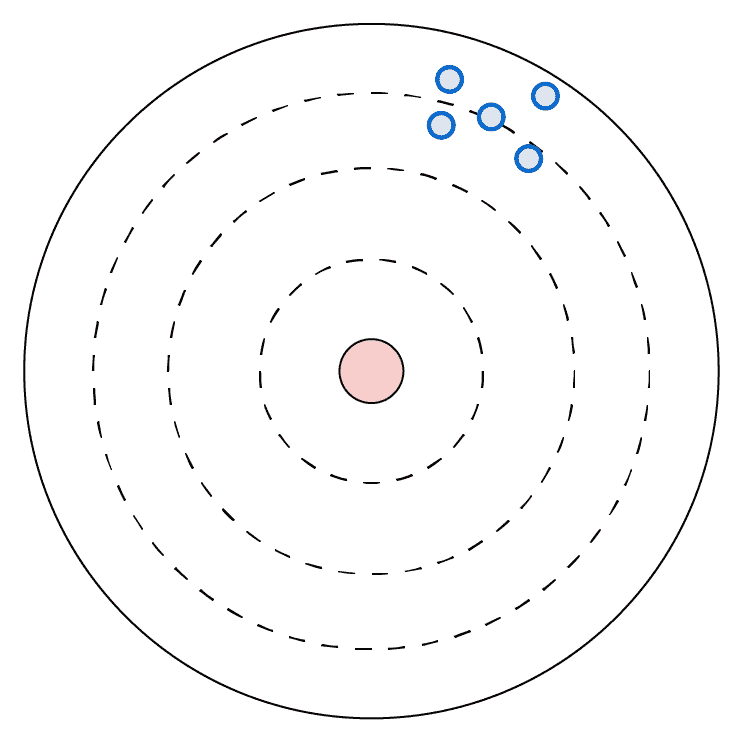
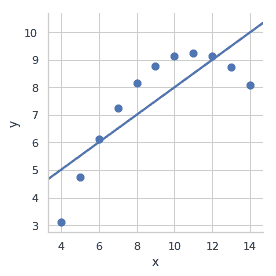
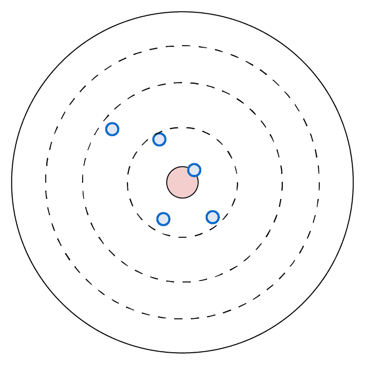
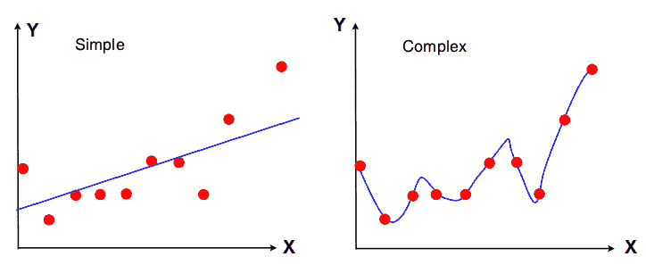
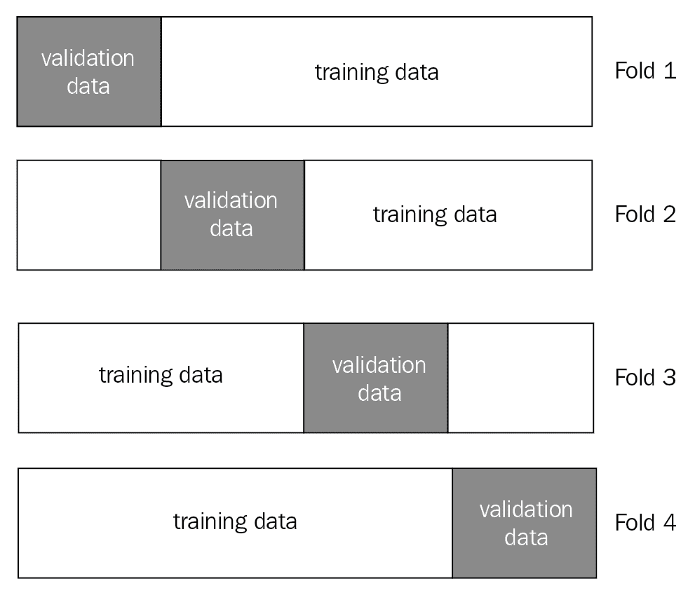
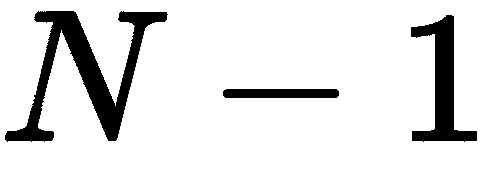
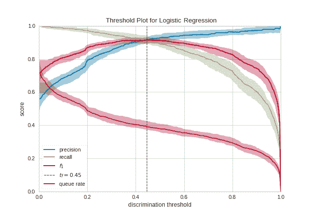

  

# 二、测试您的模型

如果不使用好的测试方法，想出一个完美的机器学习模型并不简单。这个看似完美的模型在你部署的那一刻就会失效。测试模型的性能不是一件容易的事情，但它是每个数据科学项目的重要组成部分。没有适当的测试，您就不能确定您的模型是否会像预期的那样工作，并且您也不能选择最佳的方法来解决手头的任务。

本章将探索模型测试的各种方法，并查看不同类型的度量标准，使用数学函数来评估预测的质量。我们还将介绍一组测试分类器模型的方法。

在本章中，我们将讨论以下主题:

*   离线模型测试
*   在线模型测试

  

# 离线模型测试

离线模型测试包括在模型部署之前执行的所有模型评估过程。在详细讨论在线测试之前，我们必须首先定义模型误差以及计算它们的方法。

  

# 了解模型误差

每个模型都可能出错，因为收集的数据和模型本身会对问题的性质产生影响。一个好的工作模式的最好例子是在你的大脑里。你实时使用建模——大脑通过解释眼睛记录的电磁脉冲来呈现你看到的一切。虽然这幅世界图景并不完美，但它是有用的，因为我们通过视觉通道接收了超过 90%的信息。最后的 10%来自听觉、触觉和其他感官。因此，每个模型， **M** ，通过猜测， **Y** ， [] 试图预测真实值。

真实值和模型近似值之间的差异构成了模型误差:

对于回归问题，我们可以用模型预测的数量来衡量误差。例如，如果我们使用机器学习模型预测房价，并对实际价格为 35 万美元的房子做出 30 万美元的预测，我们可以说误差为 35 万美元-30 万美元= 5 万美元。

对于最简单设置中的分类问题，我们可以将猜测的误差度量为 0，错误答案的误差度量为 1。例如，对于猫/狗识别器，如果模型预测狗照片中有猫，我们给出的误差为 1，如果给出正确答案，我们给出的误差为 0。

  

# 分解误差

你不会找到一个完美地解决你的问题而不犯任何错误的机器学习模型，不管有多小。因为每个模型都会犯错误，所以了解它们的本质是至关重要的。假设我们的模型做了一个预测，我们知道真实值。如果这个预测是不正确的，那么在预测和真实值之间有一些差异:

这个误差的另一部分来自我们数据的不完美，还有一部分来自我们模型的不完美。我们的模型再复杂，也只能减少建模误差。不可约误差是我们无法控制的，因此得名。

让我们用下面的公式来看一下:

并非所有可约误差都是相同的。我们可以进一步分解可约误差。例如，请看下图:

每个目标的红色中心代表我们的目标(真实值)，蓝色镜头代表模型预测。在目标中，模型的目标是关闭的——所有预测都很接近，但都远离目标。这种误差称为**偏差**。我们的模型越简单，偏差就越大。对于一个简单的模型，偏差分量可能会占主导地位:

在前面的图中，我们试图用一条简单的线来模拟变量之间的复杂关系。这种模型有很大的偏差。

模型误差的第二个组成部分是**方差**:

所有的预测似乎都聚集在真正的目标周围，但是分布太广了。这个误差的来源来自于模型对数据波动的敏感性。如果模型有很高的方差，测量中的随机性会导致非常不同的预测。

到目前为止，我们已经将模型误差分解为以下三个数字:

偏差和方差在同一个公式中紧密相连，这并不是巧合。他们之间是有关系的。预测模型显示了一种称为**偏差-方差** **权衡**的属性——模型偏差越大，误差的方差分量越低。反之，方差越大，偏差越小。这一重要事实将成为构建集合模型的游戏规则改变者，我们将在[第三章](eb2995e4-1a9a-43d9-b162-557a4664069b.xhtml)、*理解 AI* 中探索。

通常，在数据中强加某种结构的模型具有很高的偏差(它们假设数据符合某些规律)。只要数据不与模型的基本逻辑相矛盾，有偏差的模型就能很好地工作。为了给你一个这样的模型的例子，想一个简单的行。例如，我们将住房价格预测为其平方英尺大小的线性函数:

请注意，如果我们将平方英尺改变一点，比如说 0.1，那么预测不会改变太多。因此，该模型具有低方差。当模型对其输入的变化敏感时，其方差将超过偏差。方差分量将随着模型复杂性的增加和参数总数的增加而增加。在下图中，您可以看到两个不同的模型如何拟合同一数据集。第一个简单模型具有低方差，第二个复杂模型具有高方差:

在上图中， **X** 的微小变化都会导致 **Y** 的大幅波动。方差高的模型是稳健的，意味着数据的结构化程度要低得多。

  

# 理解过度拟合

偏差-方差权衡与机器学习中一个非常重要的问题密切相关，这个问题叫做**过拟合**。如果你的模型过于简单，会造成较大的误差。太复杂的话，会把数据背得太好。过度拟合的模型会很好地记住数据，就像数据库一样。假设我们的住房数据集包含一些幸运的交易，由于数据中没有捕捉到的情况，以前的房子价格较低。一个过度拟合的模型会过于紧密地记住这些例子，并根据看不见的数据预测不正确的价格值。

现在，理解了错误分解之后，我们可以把它作为设计模型测试管道的垫脚石吗？

我们需要确定如何测量模型误差，以使其与看不见的数据上的真实模型性能相对应。答案来自问题本身。我们将所有可用的数据分成两组:一组训练集和一组测试集，如下面的屏幕截图所示:

我们将使用训练集中的数据来训练模型。测试集作为看不见的数据，您不应该在训练过程中使用该测试集。当模型的训练完成时，您可以将测试数据输入到您的模型中。现在，您可以计算所有预测的误差。该模型在训练期间不使用测试数据，因此测试集错误表示模型在看不见的数据上的错误。这种方法的缺点是，您需要大量的数据(通常高达 30%)用于测试。这意味着较少的训练数据和较低的模型质量。还有一个警告——如果你过多地使用你的测试集，错误度量将会开始说谎。例如，假设您执行了以下操作:

1.  训练一个模特
2.  测量测试数据的误差
3.  更改您的模型以改进指标
4.  重复步骤 1-3 十次
5.  将模型部署到生产中

很可能你的模型质量会比预期的低很多。为什么会这样？我们再仔细看看*第三步*。您查看了一个分数，并连续几次更改了您的模型或数据处理代码。其实你手动做了几次学习迭代。通过反复提高测试分数，您间接地向您的模型透露了关于测试数据的信息。当测试集上测量的度量值偏离真实数据上测量的度量值时，我们说测试数据已经泄漏到我们的模型中。众所周知，数据泄露在造成损害之前很难被发现。为了避免它们，您应该始终注意泄漏的可能性，批判性地思考，并遵循最佳实践。

我们可以使用单独的数据来防止测试集泄漏。数据科学家使用验证集来调整模型参数，并在选择最佳模型之前比较不同的模型。然后，测试数据仅用作最终检查，告知您关于看不见的数据的模型质量。在您测量了测试度量分数之后，剩下的唯一决定就是模型是否将在真实场景中进行测试。

在下面的屏幕截图中，您可以看到数据集的训练/验证/测试分割示例:

不幸的是，当我们使用这种方法时，存在以下两个问题:

*   在多次迭代之后，关于我们的测试集的信息仍然可能泄漏到我们的解决方案中。当您使用验证集时，测试集泄漏不会完全消失，它只是变得更慢了。为了克服这一点，不时地改变你的测试数据。理想情况下，为每个模型部署周期创建一个新的测试集。
*   由于用于调整模型的训练-测量-变化反馈循环，您可能会很快过度拟合您的验证数据。

为了防止过度拟合，可以从每个实验的数据中随机选择训练集和验证集。随机打乱所有可用数据，然后根据您选择的比例将数据分成三部分，从而选择随机训练和验证数据集。

对于应该使用多少训练、验证和测试数据，没有通用的规则。通常，更多的训练数据意味着更准确的模型，但这意味着您将拥有更少的数据来评估模型的性能。中型数据集(多达 100，000 个数据点)的典型划分是使用 60-80%的数据来训练模型，并使用其余数据进行验证。

对于大型数据集，情况会发生变化。如果数据集有 10，000，000 行，使用 30%进行测试将包含 3，000，000 行。这个数额很可能是大材小用。增加测试和验证测试的规模会产生递减的回报。对于某些问题，您可以通过 100，000 个测试示例获得良好的结果，这相当于 1%的测试规模。你拥有的数据越多，用于测试的比例就应该越低。

往往是数据太少。在这些情况下，提取 30%-40%的数据进行测试和验证可能会严重降低模型的准确性。在数据匮乏的情况下，您可以应用一种称为交叉验证的技术。有了交叉验证，就不需要创建单独的验证或测试集。交叉验证按以下方式进行:

1.  您选择一些固定的迭代次数——例如，三次。
2.  将数据集分成三部分。
3.  对于每次迭代，交叉验证使用数据集的 2/3 作为训练数据，1/3 作为验证数据。
4.  三个训练验证集对中每一个的训练模型。
5.  使用每个验证集计算指标值。
6.  通过平均所有指标值，将指标聚合成一个数字。

下面的屏幕截图直观地解释了交叉验证:

交叉验证有一个主要缺点:它需要更多的计算资源来评估模型质量。在我们的例子中，为了进行一次评估，我们需要拟合三个模型。对于常规的训练/测试分割，我们将只训练一个模型。此外，交叉验证的准确性会随着您使用的迭代次数(也称为折叠)而增加。所以交叉验证允许你使用更多的数据进行训练，同时需要更多的计算资源。我们如何在项目的交叉验证和训练验证测试分割之间进行选择？

在交叉验证中， [] 是由数据科学家设置的可变参数。最低可能值是 1，相当于简单的训练/测试分割。 [] 的最大极值等于数据集中的数据点数。这意味着，如果数据集中有 [] 个点，那么模型将被训练和测试 [] 次。这种特殊的交叉验证被称为**留一交叉验证**。理论上，更多的折叠意味着交叉验证将返回更准确的指标值。虽然留一交叉验证是理论上最准确的方法，但由于计算量大，在实践中很少使用。实际上， [] 的值范围是 3 到 15 倍，这取决于数据集的大小。你的项目可能需要使用更多，所以把这当作建议，而不是规则。

下表总结了一种普遍的思维方式:

|  | **模型训练需要低到中等的计算资源和时间** | **模型训练需要大量的计算资源并且花费很长时间** |
| **中小型数据集** | 交叉验证 | 也 |
| **大型数据集** | 也 | 培训/验证/测试分割 |

与模型测试相关的另一个重要方面是如何分割数据。您的拆分逻辑中的一个小错误可能意味着您所有的测试努力都是徒劳的。如果数据集中的所有观测值都是独立的，则拆分很容易。然后你可以使用随机数据分割。但是如果我们正在解决股票价格预测问题呢？当我们的数据行与时间捆绑在一起时，我们不能将它们视为独立的值。今天的股票价格取决于它们过去的价值。如果这不是真的，价格会从 0 美元随机跳到 1000 美元。在这种情况下，假设我们有两年的股票数据，从 2017 年 1 月到 2018 年 12 月。如果使用随机拆分，有可能我们的模型在 2018 年 9 月训练，2017 年 2 月测试。这毫无意义。我们必须始终考虑您的观察结果之间的因果关系和依赖性，并确保检查您的验证程序是否正确。

接下来，我们将学习度量，这是我们可以用来总结验证和测试错误的公式。度量将允许我们比较不同的模型，并选择最佳候选产品用于生产。

  

# 使用技术指标

每个模型，无论多么复杂和精确，都会出错。在解决一个特定的问题时，期望某些模型比其他模型更好是很自然的。目前，我们可以通过比较单个模型预测和地面真实情况来测量误差。将它们总结成一个数字来衡量模型的性能是很有用的。我们可以使用一个度量来做到这一点。有很多种适合不同机器学习问题的度量。

特别是，对于回归问题，最常见的度量是**均方根误差**，或 **RMSE** :

让我们检查一下这个公式的元素:

*   *N* 是数据点的总数。
*   *预测-实际*测量地面真实值和模型预测值之间的误差。
*   公式开头的适马符号表示总和。

另一种测量回归误差的流行方法是**平均绝对误差** ( **MAE** ):

请注意，梅与 RMSE 非常相似。与 MAE 相比，RMSE 有一个平方根，而不是绝对值，它平方误差。虽然梅和 RMSE 可能看起来相同，但他们之间有一些技术差异。数据科学家可以为问题选择最佳指标，知道他们的权衡和缺点。你不需要全部学会，但是我想强调一个不同之处，让你对思维过程有个大概的感觉。RMSE 对重大失误的处罚力度超过了 MAE。这个属性来自于 RMSE 使用平方误差，而 MAE 使用绝对值。举例来说，4 的误差在 MAE 中是 4，但是在 RMSE，由于平方的原因，它将变成 16。

对于分类问题，度量计算过程更加复杂。假设我们正在构建一个二元分类器，用于估计一个人患肺炎的概率。为了计算模型的准确性，我们可以用正确答案的总数除以数据集中的行数:

这里， [] 是正确预测的数量， [] 是预测的总数。准确性很容易理解和计算，但它有一个重大缺陷。我们假设患肺炎的平均概率是 0.001%。也就是说，十万分之一的人患有这种疾病。如果您收集了 200，000 人的数据，那么您的数据集可能只包含两个阳性案例。想象一下，你让一个数据科学家建立一个机器学习模型，根据病人的数据估计肺炎概率。你说过你只接受不低于 99.9%的准确度。假设有人创建了一个总是输出零的伪算法。

该模型没有实际价值，但它对我们数据的准确性会很高，因为它只会产生两个错误:

问题是准确性只考虑了答案的整体部分。当一个类别的数量超过其他类别时，准确性会输出误导性的值。

让我们通过构建一个混淆表来更详细地查看模型预测:

|  | **模型预测:****得了肺炎** | **模型预测:****没有肺炎** |
| **真实结果:****得了肺炎** | Zero | Two |
| **真实结果:****没有肺炎** | Zero | One hundred and ninety-nine thousand nine hundred and ninety-eight |

看了这张表之后，我们可以看到，虚拟模型对任何人都没有帮助。它没有确认两个人的病情呈阳性。我们称这些错误为**漏报** ( **FN** )。该模型还能正确识别所有没有肺炎或**真阴性** ( **TN** )的患者，但它未能正确诊断患病患者。

现在，假设您的团队已经构建了一个真实的模型，并获得了以下结果:

|  | **模型预测:****得了肺炎** | **模型预测:****没有肺炎** |
| **真实结果:****得了肺炎** | Two | Zero |
| **真实结果:****没有肺炎** | Thirty | One hundred and ninety-nine thousand nine hundred and sixty-eight |

该模型正确识别了两种情况，做出了两个**真阳性** ( **TP** )预测。这比前一次迭代有了明显的改进。然而，该模型也确定了 30 个人患有肺炎，而他们实际上并没有生病。我们称这样的错误为**假阳性** ( **FP** )预测。有 30 个假阳性是一个显著的缺点吗？这取决于医生如何使用这个模型。如果所有受试者都被自动开出有副作用的大剂量药物，那么假阳性就很关键。

如果我们把一个阳性模型仅仅看作是一种患病的可能性，它可能就不那么严重了。如果一个肯定的模型答案只是表明患者必须经历一套特定的诊断程序，那么我们可以看到一个好处:为了实现相同水平的肺炎识别，治疗师将只诊断 32 名患者，而以前他们必须调查 200，000 例。如果我们没有使用混淆表，我们可能会错过会对人们的健康产生负面影响的危险模式行为。

接下来，你的团队做了另一个实验并创建了一个新模型:

|  | **模型预测:****得了肺炎** | **模型预测:****没有肺炎** |
| **真实结果:****得了肺炎** | Zero | Two |
| **真实结果:****没有肺炎** | One hundred thousand | Ninety-nine thousand nine hundred and ninety-eight |

这种模式表现更好吗？该模型可能会遗漏一名需要治疗的患者，并将 10 万名健康人分配到一个治疗组，从而让医生做不必要的工作。事实上，只有在向将使用该模型的人展示结果之后，您才能做出最终决定。他们可能对什么是最好的有不同的看法。最好是在项目的第一阶段，通过与该领域的专家合作，创建一个模型测试方法文档来定义这一点。

你在任何地方都会遇到二进制分类问题，因此很好地理解术语是很重要的。

您可以看到下表中总结的所有新概念:

|  | **模型预测:****1(阳性病例)** | **模型预测:****0(否定情况)** |
| **真实结果:****1(阳性病例)** | 东帝汶的网络域名代号 | 【数学】函数 |
| **真实结果:****0(否定情况)** | 冰点 | 长吨 |

请注意，您可以控制单个模型的假阳性和假阴性响应的数量，这一点非常重要。分类器输出数据点属于一个类别的概率。也就是说，模型预测是介于 0 和 1 之间的数字。通过将预测与阈值进行比较，您可以决定该预测属于积极类还是消极类。例如，如果阈值是 0.5，则任何大于 0.5 的模型预测将属于类别 1，否则属于类别 0。

通过改变阈值，可以改变混淆表中单元格之间的比例。通过选择大的阈值，如 0.9，假阳性响应的量将减少，但假阴性响应将增加。阈值选择对于二值分类问题至关重要。一些环境，如数字广告，对误报更宽容，而在其他环境，如医疗保健或保险，你可能会发现它们是不可接受的。

混淆表提供了对分类问题的深刻见解，但需要您的注意力和时间。当您想要做大量实验和比较许多模型时，这可能会有所限制。为了简化这一过程，统计学家和数据科学家设计了许多指标来总结分类器的性能，而不会像准确性指标那样遇到问题。首先，让我们研究一些总结混淆表行和列的方法。从那里，我们将探索如何将其压缩成一个单一的统计数据。

在下表中，您可以看到两个用于总结不同类型错误的新指标，即精度和召回率:

|  | **模型预测:****1** ( **阳性病例**) | **模型预测:****0** ( **负案**) | **组合指标** |
| **真实结果:****1** ( **阳性病例**) | 正确肯定 | 假阴性 |  |
| **真实结果:****0** ( **负案**) | 假阳性 | 正确否定 |  |
| **组合指标** | ，也叫**真阳性率** ( **TPR** ) |  |  |

Precision 测量您的模型已经识别的肯定(相关)事例的比例。如果您的模型预测了 10 个阳性病例，而 2 个阳性预测实际上是阴性的，那么它的精度将是 0.8。回忆表示正确预测阳性病例的概率。如果在 10 个阳性病例中，模型正确预测了所有 10 个病例(10 个真阳性)，并将 5 个阴性病例标记为阳性(5 个假阳性)，则它的召回率将是 0.67。0.67 的召回意味着如果我们的模型预测一个阳性病例，它将在 100 次中有 67 次是正确的。

对于二进制分类，精度和召回将我们必须处理的度量数量减少到两个。这样更好，但不理想。我们可以通过使用一个叫做 **F1-score** 的指标，将所有事情总结成一个数字。您可以使用以下公式计算 F1:

F1 对于完美的分类器是 1，对于最差的分类器是 0。因为它同时考虑了精确度和召回率，所以它不会遭受与精确度相同的问题，并且是分类问题的更好的默认度量。

  

# 关于不平衡班级的更多信息

在前面的示例中，您可能已经注意到，许多预测问题都存在一种现象，即一个类比其他类出现得更频繁。识别癌症等疾病、估计信用违约概率或发现金融交易中的欺诈都是不平衡问题的例子——正面案例比负面案例少得多。在这种情况下，估计分类器的性能变得棘手。准确性等指标开始显示出过于乐观的景象，因此您需要求助于更高级的技术指标。F1 分数在这个设置中给出了更真实的值。但是，F1 分数是根据类别分配(在二进制分类的情况下为 0 或 1)而不是类别概率(在二进制分类的情况下为 0.2 和 0.95)计算的。

大多数机器学习模型输出的是一个例子属于某个类别的概率，而不是直接的类别分配。特别是，癌症检测模型可以基于输入数据输出 0.32 (32%)的疾病概率。然后我们必须决定这个病人是否会被贴上癌症的标签。为此，我们可以使用一个阈值:所有低于或等于该阈值的值将被标记为 0(没有癌症)，所有大于该阈值的值将被视为 1(有癌症)。阈值会极大地影响生成的模型的质量，尤其是对于不平衡的数据集。例如，较低的阈值可能会导致更多的 0 标签，但是，这种关系不是线性的。

为了说明这一点，让我们采用一个经过训练的模型并为测试数据集生成预测。如果我们通过采用许多不同的阈值来计算类分配，然后计算这些分配中每一个的精度、召回率和 F1 分数，我们可以在单个图中描绘每个精度和召回率值:

前面的图是使用`yellowbrick`库制作的，该库包含许多用于模型选择和解释的有用可视化工具。你可以在这里看到这个库的能力:[https://www.scikit-yb.org/en/latest/index.html](https://www.scikit-yb.org/en/latest/index.html)。

在上图中，您可以看到介于 0 和 1 之间的每个阈值的精度(蓝色)、召回(绿色)和 F1(红色)值。根据这个图，我们可以看到，许多机器学习库中的默认值 0.5 可能不是最佳选择，而类似 0.45 的值会产生更优的度量值。

图中显示的另一个有用的概念是队列速率(用洋红色表示)，它显示了测试数据集中标记为正的实例的比例。对于阈值 0.45(在图中用虚线表示)，可以看到队列速率是 0.4。这意味着大约 40%的案例将被标记为欺诈。根据使用该模型的业务流程，阳性案例可能需要人工进一步调查。在某些情况下，手动检查会花费大量的时间或资源，但是为了更低的队列速率，错误地分类一些积极的实例是可以的。在这种情况下，您可能希望选择队列速率较低的模型，即使它们的性能较低。

所有关于精度、召回和阈值的信息可以进一步总结成一个数字，称为精度-召回曲线 ( **PR AUC** )下的**面积。该指标可用于对大量不同的模型进行快速判断，而无需对不同阈值的模型质量进行手动评估。另一个经常用于二元分类器评估的度量被称为** **接收器操作特性曲线** ( **ROC AUC** )下的**面积。一般来说，您会希望对不平衡数据集使用 PR AUC，对平衡数据集使用 ROC AUC。

不同之处在于计算这些指标的方式，但为了简洁起见，我们将省略技术细节。计算 AUC 指标比本章介绍的其他指标要复杂一些。更多信息请查看[https://www . chi oka . in/differences-between-roc-AUC-and-pr-AUC/](https://www.chioka.in/differences-between-roc-auc-and-pr-auc/)和[https://en . Wikipedia . org/wiki/Receiver _ operating _ character istic](https://en.wikipedia.org/wiki/Receiver_operating_characteristic)。**

为精确度、召回率、F1 和队列速率选择合适的平衡没有单一的规则。应该根据业务流程仔细研究这些价值。仅仅依靠技术指标来选择模型可能会导致灾难，因为最适合客户的模型并不总是最准确的模型。在某些情况下，高精度可能比召回率更重要，而对于其他情况，排队率将是最重要的。在这一点上，我们需要引入另一种度量，作为技术度量和业务需求之间的桥梁:业务度量。

  

# 应用业务指标

虽然技术指标在模型开发过程中可能是必不可少的，但它们并不是商业语言。一堆 F1 分数的混淆表很少会给你的客户或利益相关者留下深刻印象。他们更关心模型将解决的问题，而不是它的内部。他们不会对假阳性率感兴趣，但当你谈论该模型在下一季度能为他们节省多少钱时，他们会倾听。因此，设计一个业务指标是很重要的。您的项目将需要一个对所有关键利益相关者都非常清楚的质量度量，无论他们是否有数据科学方面的经验。如果你在商业环境中，一个好的开始将是查看你试图使用机器学习来改善的业务流程的**关键绩效指标** ( **KPI** )。您可能会发现一个现成的业务指标。

至此，我们结束了对技术指标的介绍。测试分类和回归模型的方法还有很多，各有利弊。列举和描述它们本身就需要一本书，而且没有必要，因为我们已经实现了我们的目标。有了本章的新概念，你现在理解了在真实世界条件下测试之前如何评估机器学习模型的一般流程。现在，您可以在部署模型之前使用离线模型测试来检查模型的质量。接下来，我们将探索在线测试，以完成您对模型质量评估的理解。

  

# 在线模型测试

即使一个很好的离线模型测试管道也不能保证模型在生产中的表现完全相同。总有一些风险会影响您的模型性能，例如:

*   人类:我们可能会犯错误，在代码中留下 bug。
*   **数据收集**:选择偏差和不正确的数据收集程序可能会破坏真实的指标值。
*   **变化**:真实世界的数据可能会发生变化并偏离您的训练数据集，从而导致意外的模型行为。

在不久的将来确定模型性能的唯一方法是进行现场测试。根据环境的不同，这种测试可能会带来很大的风险。例如，评估飞机引擎质量或患者健康的模型在我们对它们的性能有信心之前，可能不适合真实世界的测试。

当进行现场测试时，您会希望在做出统计有效结论的同时将风险降至最低。令人欣慰的是，有一个用于这个目的的统计框架，称为假设检验。当执行假设检验时，您通过收集数据和执行统计检验来检查一些想法(假设)的有效性。想象一下，你需要检查你的新广告模式是否增加了广告服务的收入。为了做到这一点，你将所有的客户随机分成两组:一组使用旧的广告算法，而其他人则看到新算法推荐的广告。收集了足够多的数据后，您可以比较两组数据并测量它们之间的差异。你可能会问，为什么我们需要为统计数据费心？

因为我们只有在统计数据的帮助下才能回答以下问题:

*   我应该如何将个人分类(取样)到每个组中？我的取样过程会扭曲测试结果吗？
*   每组的最小客户数量是多少？数据的随机波动会影响我的测量吗？
*   我应该运行测试多长时间才能得到一个自信的答案？
*   我应该用什么公式来比较各组的结果？

假设检验的实验设置故意将测试目标分成两组。我们可以尝试使用单个组来代替。例如，我们可以用旧模型进行一组测量。在实验的第一部分完成后，我们就可以部署新的算法并测试其效果。然后，我们一个接一个地比较两次测量。什么会出错？事实上，我们得到的结果没有任何意义。在我们的测量过程中，许多事情可能会发生变化，例如:

*   用户首选项
*   一般用户情绪
*   我们服务的受欢迎程度
*   平均用户配置文件
*   用户或企业的任何其他属性

所有这些隐藏的影响都可能以不可预测的方式影响我们的测量，这就是为什么我们需要两组:测试组和对照组。我们必须以这样的方式选择这些组，它们之间的唯一区别是我们的假设。它应该存在于测试组中，而在对照组中缺失。举例来说，在医学试验中，对照组是那些得到安慰剂的人。假设我们想测试一种新止痛药的积极效果。以下是一些糟糕的测试设置示例:

*   对照组仅由女性组成。
*   测试组和对照组位于不同的地理位置。
*   你用有偏见的采访来预选实验对象。

创建组最简单的方法是随机选择。真正的随机选择在现实世界中可能很难做到，但如果你处理互联网服务，这是很容易的。在那里，你可以随机决定每个活跃用户使用哪个版本的算法。请务必与经验丰富的统计学家或数据科学家一起设计实验设置，因为众所周知，正确的测试很难执行，尤其是在离线设置下。

统计测试检查零假设的有效性，即你得到的结果是偶然的。相反的结果叫做替代假设。例如，下面是我们广告模型测试的假设集:

*   **零假设**:新模式不影响广告服务收入。
*   **替代假设**:新模式影响广告服务收入。

通常，统计测试衡量的是零假设为真的概率。如果几率很低，那么另一个假设就是真的。否则，我们接受零假设。根据统计测试，如果新模型不影响服务收入的概率是 5%，我们可以说我们在 95%的置信水平上接受了替代假设。这意味着该模型以 95%的概率影响广告服务收入。拒绝零假设的显著性水平取决于你想要承担的风险水平。对于 ad 模型，95%的显著性可能就足够了，而对于测试患者健康状况的模型，不低于 99%的显著性是令人满意的。

最典型的假设检验是比较两种方法。如果我们在广告模型示例中使用这个测试，我们将测量使用和不使用新排名算法的平均收入。当实验结束时，我们可以使用检验统计量来接受或拒绝零假设。

进行假设检验需要收集的数据量取决于几个因素:

*   **置信度**:你需要的统计置信度越大，就需要越多的数据来支持证据。
*   **统计功效**:测量检测到显著差异的概率，如果存在的话。测试的统计能力越强，假阴性反应的几率就越低。
*   **假设差异和总体方差**:如果您的数据有较大的方差，您需要收集更多的数据来检测显著差异。如果两个平均值之间的差值小于总体方差，则需要更多的数据。

您可以在下表中看到不同的测试参数如何决定它们的数据渴求:

| **置信度** | **统计功效** | **假设差异**  | **人口方差** | **推荐样本量** |
| 95% | 90% | $10 | $100 | 22 次客户广告演示 |
| 99% | 90% | $10 | $100 | 30 次客户广告演示 |
| 99% | 90% | $1 | $100 | 2，976 次客户广告演示 |

假设检验虽然强大，但也有局限性:你需要等到实验结束后才能应用其结果。如果你的模型是坏的，你将无法在不损害测试程序的情况下减少损害。另一个限制是，用一个假设检验一次只能检验一个模型。

在你可以为了速度和风险规避而牺牲统计精确性的情况下，有一种替代方法叫做**多臂强盗** ( **MABs** )。为了理解 mab 是如何工作的，想象你自己在一个有很多老虎机的赌场里。你知道有些机器比其他机器收益更高。你的任务是用最少的尝试次数找到最好的吃角子老虎机。因此，你尝试不同(多)分支的吃角子老虎机(强盗)来最大化你的奖励。你可以将这种情况扩展到测试多个广告模型:对于每个用户，你必须找到一个最有可能增加你广告收入的模型。

最流行的 MAB 算法被称为ε贪婪强盗。尽管名称如此，该方法的内部工作很简单:

1.  选择一个叫做**ε**的小数字。假设我们选择了 0.01。
2.  在 0 和 1 之间选择一个随机数。这个数字将决定 MAB 是否会探索或利用一系列可能的选择。
3.  如果数字小于或等于 epsilon，则随机选择一个，并在做出与您的选择相关的动作后记录奖励。我们称这个过程为探索——MAB 以低概率随机尝试不同的行为，以找出它们的平均回报。
4.  如果你的数字大于 epsilon，根据你收集的数据做出最佳选择。我们称这一过程为开发——MAB 利用其收集的知识来执行一项具有最佳预期回报的行动。MAB 通过平均每个选择的所有记录奖励来选择最佳行动，并选择具有最大奖励预期的选择。

通常，我们从较大的ε值开始，然后将其减小到较小的值。通过这种方式，MAB 在开始探索许多随机选择，并在最后开发最有利可图的行动。探索频率逐渐减少，接近于零。

当你第一次启动 MAB 时，它会从随机行动中收集奖励。久而久之，你会看到所有选择的平均回报都汇聚到它们的真实价值。单克隆抗体的主要好处是它们可以实时改变自己的行为。当有人在等待假设检验结果时，MAB 给你一个不断变化的画面，同时涵盖最佳选择。土匪是最基本的强化学习算法之一。尽管简单，但它们可以提供良好的结果。

我们现在有两种新的测试方法可以使用。我们如何在它们之间做出选择？不幸的是，没有简单的答案。假设检验和单克隆抗体对数据、采样过程和实验条件有不同的限制。最好在决定之前咨询有经验的统计学家或数据科学家。数学约束不是影响选择的唯一因素；环境也很重要。单克隆抗体很容易应用于在整个群体中的随机个体上测试不同选择的情况。这在为大型在线零售商测试模型时可能非常方便，但对于临床试验来说是不可能的，在临床试验中，您最好应用假设检验。让我们看看在单克隆抗体和假设检验之间进行选择的经验法则:

*   mab 更适合需要用有限的资源测试许多替代方案的环境。当使用单克隆抗体时，你牺牲了统计的严谨性来换取效率。单克隆抗体可能需要很长时间才能收敛，随着时间的推移会逐渐改善。
*   如果你只有一个选择，如果你的试验涉及很大的风险，或者如果你需要一个统计上严格的答案，你应该应用假设检验。假设检验需要固定的时间和资源来完成，但比单克隆抗体带来更大的风险。

虽然在在线环境中测试模型对于确保您的离线测试结果在部署阶段后保持真实是极其重要的，但是仍然有一个我们没有涉及到的危险区域。数据的突然和意外变化会严重影响甚至破坏已部署的模型，因此监控传入数据的质量也很重要。

  

# 在线数据测试

即使在执行了成功的在线测试之后，您也不能完全防范 ModelOps 中的意外问题。机器学习模型对输入数据很敏感。好的模型具有一定程度的泛化能力，但是数据或生成数据的底层流程的重大变化可能会使模型预测误入歧途。如果在线数据明显偏离测试数据，在执行在线测试之前，您无法确定模型的性能。如果测试数据与训练数据不同，那么您的模型就不会像预期的那样工作。

为了克服这一点，您的系统需要监控所有传入的数据，并即时检查其质量。以下是一些典型的检查:

*   必填数据字段中缺少值
*   最小值和最大值
*   分类数据字段的可接受值
*   字符串数据格式(日期、地址)
*   目标变量统计(分布检查、平均值)

  

# 摘要

在这一章中，我们回答了一个非常重要的问题:一个模型正确工作意味着什么？我们探索了错误的本质，并研究了可以量化和测量模型错误的度量标准。我们在离线和在线模型测试之间画了一条线，并为这两种类型定义了测试过程。我们可以使用训练/验证/测试数据分割和交叉验证来执行离线模型测试。对于在线测试，我们可以在假设检验和单克隆抗体之间进行选择。

在下一章，我们将探究数据科学的内部工作原理。我们将深入研究机器学习和深度学习背后的主要概念，直观地了解机器如何学习。