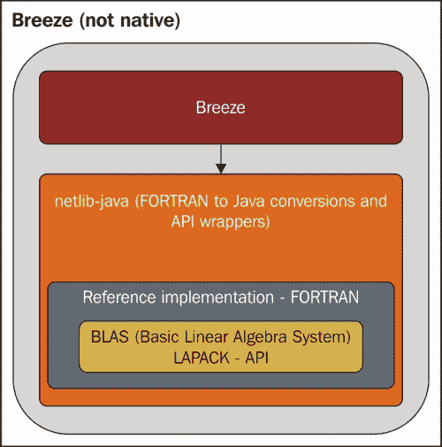
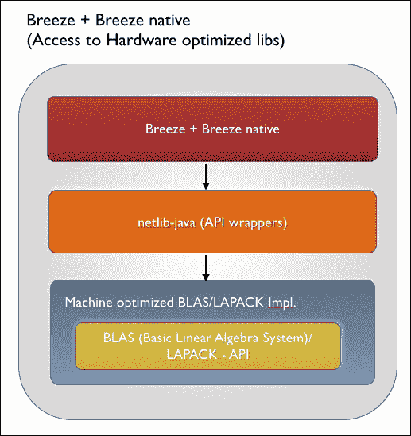
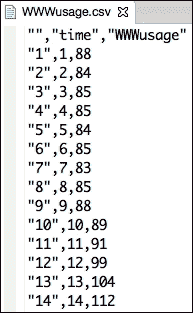
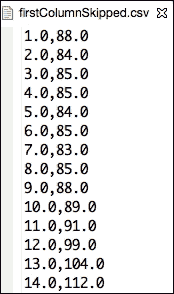

# 一、开始使用 Breeze

在本章中，我们将介绍以下配方:

*   获取 Breeze 线性代数库
*   使用向量
*   使用矩阵
*   值随机分布的向量和矩阵
*   读取和写入 CSV 文件

# 简介

本章简要介绍了 Scala 中最流行的数据分析库之一，如何获得它们，以及它们最常用的函数和数据结构。

在第一章中，我们将重点介绍 Breeze，它是最流行、最强大的线性代数库之一。我们将在后续章节中看到的 Spark MLlib 构建在 Breeze 和 Spark 之上，为可扩展的机器学习提供了一个强大的框架。


# 获取 Breeze–线性代数库

简单来说，Breeze([http://www.scalanlp.org](http://www.scalanlp.org))是一个 Scala 库，它扩展了 Scala 集合库，除了提供一大堆支持向量和矩阵操作的函数之外，还提供了对向量和矩阵的支持。我们可以用 Python 语言将 Breeze 比作NumPy([http://www.numpy.org/](http://www.numpy.org/))。Breeze 构成了 MLlib 的基础 Spark 中的机器学习库，我们将在后面的章节中探讨。

在第一个配方中，我们将看到如何使用 **Scala 构建工具** ( **SBT** )将 Breeze 库引入我们的项目。我们还将看到 Breeze 的简史，以便更好地理解为什么它可以被认为是 Scala 中的“首选”线性代数库。

### 注意

对于我们所有的菜谱，我们将同时使用 Scala 2.10.4 和 Java 1.7。我使用 Scala IDE 编写了示例，但是请随意使用您最喜欢的 IDE。

## 怎么做...

让我们将 Breeze 依赖项添加到我们的`build.sbt`中，以便我们可以在后续的食谱中开始使用它们。Breeze 依赖项只有两个——T1(核心)和 T4(T2)和 T5。

1.  在一个全新的文件夹下(这将是我们的项目根目录)，创建一个名为`build.sbt`的新文件。
2.  接下来，将`breeze`库添加到项目依赖项:

    ```java
    organization := "com.packt"

    name := "chapter1-breeze"

    scalaVersion := "2.10.4"

    libraryDependencies  ++= Seq(

      "org.scalanlp" %% "breeze" % "0.11.2",

      //Optional - the 'why' is explained in the How it works section

      "org.scalanlp" %% "breeze-natives" % "0.11.2"

    )
    ```

3.  From that folder, Issue a `sbt compile` command in order to fetch all your dependencies.

    ### Note

    After installing the `sbteclipse` plug-in [https://github.com/ After [of typesafehub/sbteclipse/, you can use `sbt eclipse` to import the project into your Eclipse. For IntelliJ IDEA, you only need to point to the root folder where your `build.sbt` file is located to import the project.](https://github.com/typesafehub/sbteclipse/)

## 还有更多...

让我们详细了解一下我们添加的`breeze`和`breeze-native`库依赖项给我们带来了什么。

### org . scalan LP . breeze 依赖关系

Breeze 有着悠久的历史，因为它不是用 Scala 从头开始编写的。由于没有原生依赖，Breeze 利用了`netlib-java`的强大功能，它拥有 BLAS/LAPACK 的 FORTRAN 参考实现的 Java 编译版本。`netlib-java`还提供了 Java 编译库的温和包装器。这意味着我们仍然可以在没有本机依赖的情况下工作，但性能不会很好，因为我们可以利用的这个 FORTRAN 翻译库的最佳性能是 FORTRAN 参考实现本身的性能。然而，对于具有最佳性能的严肃的数字处理，我们也应该添加`breeze-natives`依赖。



### org.scalanlp.breeze-natives 包

Breeze 利用其原生附加功能，寻找 BLAS/LAPACK 库的特定于机器的实现。好消息是，大多数流行的处理器和 GPU 都有开源和(供应商提供的)商业实现。最受欢迎的开源实现包括ATLAS(【http://math-atlas.sourceforge.net】[)和](http://math-atlas.sourceforge.net)OpenBLAS([【http://www.openblas.net/】](http://www.openblas.net/))。



如果你运行的是一台 Mac，你很幸运——Mac 上自带的本地 BLAS 库。在 Ubuntu / Debian 上安装 NativeBLAS 只需要运行以下命令:

```java

sudo apt-get install libatlas3-base libopenblas-base

sudo update-alternatives --config libblas.so.3

sudo update-alternatives --config liblapack.so.3

```

### Tip

**下载示例代码**

您可以从您在[http://www.packtpub.com](http://www.packtpub.com)的账户下载您购买的所有 Packt Publishing 书籍的示例代码文件。如果你在其他地方购买了这本书，你可以访问 http://www.packtpub.com/support 的[并注册，让文件直接通过电子邮件发送给你。](http://www.packtpub.com/support)


对于 Windows，请参考[https://github.com/xianyi/OpenBLAS/wiki/Installation-Guide](https://github.com/xianyi/OpenBLAS/wiki/Installation-Guide)上的安装说明。


# 使用矢量

Breeze vectors 和 Scala 自身的`scala.collection.Vector`之间存在微妙而强大的差异。正如我们将在本食谱中看到的，Breeze vectors 有许多线性代数特有的函数，这里需要注意的更重要的一点是，Breeze 的 vector 是对`netlib-java`的 Scala 包装，大多数对 vector API 的调用都委托给它。

矢量是 Breeze 的核心组件之一。它们是同质数据的容器。在这个菜谱中，我们将首先看到如何创建向量，然后转到各种数据操作函数来修改这些向量。

在这份食谱中，我们将研究向量的各种运算。该配方由以下子配方组成:

*   创建向量:

    *   从值创建向量
    *   创建零向量
    *   从函数中创建向量
    *   创建线性间隔值的向量
    *   创建具有特定范围内的值的向量
    *   创建具有单个值的完整向量
    *   从较大向量中切割子向量
    *   从标量向量中创建微风向量

*   矢量运算:

    *   标量运算
    *   计算一个矢量的点积
    *   将两个矢量相加创建一个新矢量

*   追加向量并将一种类型的向量转换为另一种:

    *   连接两个向量
    *   将 int 的向量转换为 double 的向量

*   计算基本统计:

    *   均值和方差
    *   标准差
    *   求最大值
    *   求向量中所有值的和、平方根和对数

## 准备就绪

为了运行代码，你可以使用 Scala 或者使用 Eclipse Scala 插件(或者 Scala IDE)或者 IntelliJ IDEA 中的工作表特性。之所以建议使用这些选项，是因为它们的周转时间很快。

## 怎么做...

我们来详细看看上面的每个子菜谱。为了便于参考，还显示了相应命令的输出。这个配方中使用的所有类都来自于`breeze.linalg`包。因此，在你的文件顶部加上一个`"import breeze.linalg._"`语句将是完美的。

### 创建矢量

让我们来看看构建载体的各种方法。这些构造机制大多是通过 vector 的`apply`方法。有两种不同风格的向量——`breeze.linalg.DenseVector`和`breeze.linalg.SparseVector`——向量的选择取决于用例。一般的经验法则是，如果你有至少 20%的数据是零，你最好选择`SparseVector`，但是这 20%也是一个变量。

### 从值构建向量

*   **从值**创建一个密集向量:从值创建一个`DenseVector`只是一个将值传递给`apply`方法的问题:

    ```java

     val dense=DenseVector(1,2,3,4,5)

     println (dense) //DenseVector(1, 2, 3, 4, 5)

    ```

*   **从值**创建稀疏向量:从值创建`SparseVector`也是通过将值传递给`apply`方法:

    ```java

     val sparse=SparseVector(0.0, 1.0, 0.0, 2.0, 0.0)

     println (sparse) //SparseVector((0,0.0), (1,1.0), (2,0.0), (3,2.0), (4,0.0))

    ```

注意`SparseVector`是如何根据索引存储值的。

显然，有更简单的方法来创建一个向量，而不是将所有数据都放入它的方法中。

#### 创建零矢量

调用向量的`zeros`函数将创建一个零向量。数字类型将返回一个`0`，对象类型将返回`null`，布尔类型将返回`false`:

```java
  val denseZeros=DenseVector.zeros[Double](5)  //DenseVector(0.0, 0.0, 0.0, 0.0, 0.0)

  val sparseZeros=SparseVector.zeros[Double](5)  //SparseVector()
```

毫不奇怪，`SparseVector`不会为 vector 的内容分配任何内存。然而，`SparseVector`对象本身的创建是在内存中进行的。

### 从函数中创建一个向量

向量中的`tabulate`函数是一个有趣且有用的函数。它接受一个大小参数，就像`zeros`函数一样，但是它也接受一个函数，我们可以用它来填充向量的值。该函数可以是从随机数生成器到基于简单索引的生成器，我们已经在这里实现了。注意函数的返回值(`Int`)是如何通过使用`type`参数转换成矢量`Double`的:

```java
val denseTabulate=DenseVector.tabulate[Double](5)(index=>index*index) //DenseVector(0.0, 1.0, 4.0, 9.0, 16.0)
```

### 创建线性间隔值的向量

`breeze.linalg`中的`linspace`函数创建两个任意数字之间线性间隔值的新`Vector[Double]`。毫不奇怪，它接受三个参数——开始、结束和我们想要生成的值的总数。请注意，开始值和结束值在生成时是包含在内的:

```java
val spaceVector=breeze.linalg.linspace(2, 10, 5)

//DenseVector(2.0, 4.0, 6.0, 8.0, 10.0)
```

### 用特定范围内的值创建矢量

向量中的`range`函数有两个变量。普通函数接受起始值和结束值(包括起始值):

```java
val allNosTill10=DenseVector.range(0, 10)

//DenseVector(0, 1, 2, 3, 4, 5, 6, 7, 8, 9)
```

另一种变体是接受“步长”值的重载函数:

```java
val evenNosTill20=DenseVector.range(0, 20, 2)

// DenseVector(0, 2, 4, 6, 8, 10, 12, 14, 16, 18)
```

就像`range`函数将所有参数作为整数一样，还有一个`rangeD`函数将开始、停止和步长参数作为`Double`:

```java
val rangeD=DenseVector.rangeD(0.5, 20, 2.5)

// DenseVector(0.5, 3.0, 5.5, 8.0, 10.5, 13.0, 15.5)
```

### 用一个值创建一个完整的向量

用相同的值填充整个向量是小菜一碟。我们只需要知道这个向量有多大，以及它的值是多少。就是这样。

```java
val denseJust2s=DenseVector.fill(10, 2)

// DenseVector(2, 2, 2, 2, 2, 2 , 2, 2, 2, 2)
```

### 从一个更大的向量中切割出一个子向量

从前一个向量中选择一部分向量只是对更大的向量调用 slice 方法的问题。要传递的参数是起始索引、结束索引和一个可选的“步长”参数。step 参数为每次迭代添加步长值，直到到达结束索引。注意，末端索引被排除在子向量之外:

```java
val allNosTill10=DenseVector.range(0, 10)

//DenseVector(0, 1, 2, 3, 4, 5, 6, 7, 8, 9)

val fourThroughSevenIndexVector= allNosTill10.slice(4, 7)

//DenseVector(4, 5, 6)

val twoThroughNineSkip2IndexVector= allNosTill10.slice(2, 9, 2)

//DenseVector(2, 4, 6)
```

### 从 Scala 向量创建 Breeze 向量

Breeze vector 对象的 `apply`方法甚至可以接受一个 Scala vector 作为参数，并用它构造一个 Vector:

```java
val vectFromArray=DenseVector(collection.immutable.Vector(1,2,3,4))

// DenseVector(Vector(1, 2, 3, 4))
```

### 矢量算术

现在让我们看一下我们可以用标量和向量对向量做的基本运算。

### 标量运算

使用标量的操作就像我们预期的那样工作，将值传播到 vector 中的每个元素。

向向量的每个元素添加一个标量是使用`+`函数完成的(惊喜！):

```java
val inPlaceValueAddition=evenNosTill20 +2

//DenseVector(2, 4, 6, 8, 10, 12, 14, 16, 18, 20)
```

类似地，其他基本算术运算——减法、乘法和除法——涉及调用以普遍接受的符号(`-`、`*`和`/`)命名的相应函数:

```java
//Scalar subtraction

val inPlaceValueSubtraction=evenNosTill20 -2

//DenseVector(-2, 0, 2, 4, 6, 8, 10, 12, 14, 16)

 //Scalar multiplication

val inPlaceValueMultiplication=evenNosTill20 *2

//DenseVector(0, 4, 8, 12, 16, 20, 24, 28, 32, 36)

//Scalar division

val inPlaceValueDivision=evenNosTill20 /2

//DenseVector(0, 1, 2, 3, 4, 5, 6, 7, 8, 9)
```

### 计算两个向量的点积

每个 vector 对象都有一个名为`dot`的函数，它接受另一个相同长度的向量作为参数。

让我们将`2s`填入一个新的长度为`5`的向量:

```java
val justFive2s=DenseVector.fill(5, 2)

 //DenseVector(2, 2, 2, 2, 2)
```

我们将创建另一个从`0`到`5`的向量，步长值为`1`(从`0`到`4`的一种奇特说法):

```java
 val zeroThrough4=DenseVector.range(0, 5, 1)

 //DenseVector(0, 1, 2, 3, 4)
```

下面是`dot`函数:

```java
 val dotVector=zeroThrough4.dot(justFive2s)

 //Int = 20
```

如果我们传入一个不同长度的向量作为点积的参数，函数会抱怨——如果我们这样做，Breeze 会抛出一个`IllegalArgumentException`。完整的异常消息是:

```java
Java.lang.IllegalArgumentException: Vectors must be the same length!
```

### 通过将两个向量相加来创建一个新的向量

函数`+`被重载以接受一个向量，而不是我们之前看到的标量。该操作执行相应的逐元素加法，并创建一个新的向量:

```java
val evenNosTill20=DenseVector.range(0, 20, 2)

//DenseVector(0, 2, 4, 6, 8, 10, 12, 14, 16, 18)

val denseJust2s=DenseVector.fill(10, 2)

//DenseVector(2, 2, 2, 2, 2, 2, 2, 2, 2, 2)

val additionVector=evenNosTill20 + denseJust2s

// DenseVector(2, 4, 6, 8, 10, 12, 14, 16, 18, 20)
```

不过，附加功能中包含了一个有趣的行为。假设您尝试添加两个不同长度的向量，如果第一个向量较小，第二个向量较大，则得到的向量将是第一个向量的大小，而第二个向量中的其余元素将被忽略！

```java
val fiveLength=DenseVector(1,2,3,4,5)

//DenseVector(1, 2, 3, 4, 5)

val tenLength=DenseVector.fill(10, 20)

//DenseVector(20, 20, 20, 20, 20, 20, 20, 20, 20, 20)

fiveLength+tenLength

//DenseVector(21, 22, 23, 24, 25)
```

另一方面，如果第一个向量较大，第二个向量较小，将导致`ArrayIndexOutOfBoundsException`:

```java
tenLength+fiveLength

// java.lang.ArrayIndexOutOfBoundsException: 5
```

### 追加矢量并将一种类型的矢量转换成另一种类型的矢量

让我们简单地看看如何追加两个向量并将一个数字类型的向量转换成另一个。

### 连接两个载体

串联有两种变体。有一个`vertcat`函数可以垂直连接任意数量的向量——向量的大小增加到所有向量大小的总和:

```java
val justFive2s=DenseVector.fill(5, 2)

 //DenseVector(2, 2, 2, 2, 2)

 val zeroThrough4=DenseVector.range(0, 5, 1)

 //DenseVector(0, 1, 2, 3, 4)

val concatVector=DenseVector.vertcat(zeroThrough4, justFive2s)

//DenseVector(0, 1, 2, 3, 4, 2, 2, 2, 2, 2)
```

这并不奇怪。还有也是`horzcat`方法，将第二个向量水平放置在第一个向量旁边，从而形成一个矩阵。

```java

val concatVector1=DenseVector.horzcat(zeroThrough4, justFive2s)

//breeze.linalg.DenseMatrix[Int]

0  2

1  2

2  2

3  2

4  2

```

### 注意

在处理不同长度的向量时，`vertcat`函数愉快地将第二个向量排列在第一个向量的底部。毫不奇怪，`horzcat`函数抛出了一个异常:

`java.lang.IllegalArgumentException`，意味着所有向量的大小必须相同！

#### 将整型向量转换为双精度型向量

在 Breeze 中，从一种类型的向量到另一种类型的转换不是自动的。但是，有一个简单的方法可以实现这一点:

```java
val evenNosTill20Double=breeze.linalg.convert(evenNosTill20, Double)
```

#### 计算基本统计数据

除了我们之前看到的创建和算术运算，库中还有一些有趣的汇总统计操作。现在让我们来看看它们:

### 注意

需要导入`breeze.linalg._`和`breeze.numerics._`。其他操作部分中的操作旨在模拟 NumPy 的`UFunc`或通用功能。

现在，让我们简单看看如何计算一个向量的一些基本的汇总统计量。

#### 均值和方差

计算一个向量的均值和方差可以通过调用`breeze.stats`包中的`meanAndVariance`通用函数来实现。注意，这需要一个`Double`的向量:

```java
meanAndVariance(evenNosTill20Double)

//MeanAndVariance(9.0,36.666666666666664,10)
```

### 注意

您可能已经猜到，将一个`Int`向量转换成一个`Double`向量并计算该向量的均值和方差可以合并成一行代码:

```java
meanAndVariance(convert(evenNosTill20, Double))
```

### 标准偏差

在一个`Double`向量上调用 `stddev`可以给出标准偏差:

```java
stddev(evenNosTill20Double)

//Double = 6.0553007081949835
```

### 找出向量中的最大值

`breeze.linalg`包中的`max` 通用函数将帮助我们找到向量中的最大值:

```java
val intMaxOfVectorVals=max (evenNosTill20)

//18
```

### 求向量中所有值的和、平方根和对数

与T0 相同，`breeze.linalg`包中的`sum` 通用函数计算矢量的`sum`:

```java
val intSumOfVectorVals=sum (evenNosTill20)

//90
```

`breeze.numerics`包中的函数`sqrt`、`log`和各种其他通用函数计算向量中所有单个元素的平方根和对数值:

#### Sqrt 函数

```java
val sqrtOfVectorVals= sqrt (evenNosTill20)

// DenseVector(0.0, 1\. 4142135623730951, 2.0, 2.449489742783178, 

2.8284271247461903, 3.16227766016 83795, 3.4641016151377544, 3.7416573867739413, 4.0, 4.242640687119285)
```

#### 日志功能

```java
val log2VectorVals=log(evenNosTill20)

// DenseVector(-Infinity , 0.6931471805599453, 1.3862943611198906, 1.791759469228055, 2.079441541679 8357, 2.302585092994046, 2.4849066497880004, 2.6390573296152584, 2.77258872 2239781, 2.8903717578961645)
```


# 使用矩阵

正如我们在*中讨论的使用向量*方法，你可以使用 Eclipse 或 IntelliJ IDEA Scala 工作表来获得更快的周转时间。

## 怎么做...

矩阵中有各种各样的函数。在这个食谱中，我们将围绕以下几个方面来看一些细节:

*   创建矩阵:

    *   从值创建矩阵
    *   创建零矩阵
    *   从函数创建矩阵
    *   创建单位矩阵
    *   从随机数创建矩阵
    *   从 Scala 集合创建

*   矩阵算术:

    *   加法
    *   乘法(也是逐元素)

*   追加与转换:

    *   纵向串联矩阵
    *   横向串联矩阵
    *   将 Int 矩阵转换为 Double 矩阵

*   数据操作操作:

    *   获取列向量
    *   获取行向量
    *   获取矩阵内部的值
    *   获取矩阵的逆和转置

*   计算基本统计:

    *   均值和方差
    *   标准差
    *   求最大值
    *   求矩阵中所有值的和、平方根和对数
    *   计算一个矩阵的特征向量和特征值

### 创建矩阵

我们先来看如何创建矩阵。

#### 从数值中创建矩阵

创建矩阵的最简单方法是将值按行传递给矩阵对象的`apply`函数:

```java

val simpleMatrix=DenseMatrix((1,2,3),(11,12,13),(21,22,23))

//Returns a DenseMatrix[Int]

 1   2   3

11  12  13

21  22  23

```

矩阵还有一个稀疏版本—**压缩稀疏列矩阵** ( **CSCMatrix** ):

```java

val sparseMatrix=CSCMatrix((1,0,0),(11,0,0),(0,0,23))

//Returns a SparseMatrix[Int]

(0,0) 1

(1,0) 11

(2,2) 23

```

### 注意

Breeze 的稀疏矩阵是关键字(**)表示的**字典，其中(行，列)映射到值。****

#### **创建零矩阵**

**创建一个零矩阵只需要调用矩阵的`zeros`函数。第一个整数参数表示行，第二个参数表示列:**

```java
 **val denseZeros=DenseMatrix.zeros[Double](5,4)**

**//Returns a DenseMatrix[Double]**

**0.0  0.0  0.0  0.0**

**0.0  0.0  0.0  0.0**

**0.0  0.0  0.0  0.0**

**0.0  0.0  0.0  0.0**

**0.0  0.0  0.0  0.0**

**val compressedSparseMatrix=CSCMatrix.zeros[Double](5,4)**

**//Returns a CSCMatrix[Double] = 5 x 4 CSCMatrix** 
```

### **注意**

**注意`SparseMatrix`没有为零值矩阵中的值分配任何内存。**

#### **从函数中创建矩阵**

**矩阵中的`tabulate`函数非常类似于 vector 的版本。它接受一个行和列大小的元组(在示例中为`(5,4)`)。它还接受一个函数，我们可以用它来填充矩阵的值。在我们的示例中，我们通过将行索引和列索引相乘来生成矩阵的值:**

```java
 **val denseTabulate=DenseMatrix.tabulate[Double](5,4)((firstIdx,secondIdx)=>firstIdx*secondIdx)**

**Returns a DenseMatrix[Double] =**

**0.0  0.0  0.0  0.0**

**0.0  1.0  2.0  3.0**

**0.0  2.0  4.0  6.0**

**0.0  3.0  6.0  9.0**

**0.0  4.0  8.0  12.0** 
```

**只有当你想将矩阵的类型从`Int`转换成`Double`时，才需要`type`参数。因此，以下不带参数的调用将只返回一个`Int`矩阵:**

```java
 **val denseTabulate=DenseMatrix.tabulate(5,4)((firstIdx,secondIdx)=>firstIdx*secondIdx)**

**0  1  2  3**

**0  2  4  6**

**0  3  6  9**

**0  4  8  12** 
```

#### **创建单位矩阵**

**矩阵的`eye`函数将生成给定维数的单位方阵(在本例中为`3`):**

```java
 **val identityMatrix=DenseMatrix.eye[Int](3)**

**Returns a DenseMatrix[Int]**

**1  0  0**

**0  1  0**

**0  0  1** 
```

#### **用随机数创建矩阵**

**矩阵中的`rand`函数将生成一个给定维数的矩阵(在我们的例子中是 4 行* 4 列),随机值在`0`和`1`之间。我们将在随后的食谱中深入研究随机数生成的向量和矩阵。**

```java
 **val randomMatrix=DenseMatrix.rand(4, 4)**

**Returns DenseMatrix[Double]**

**0.09762565779429777   0.01089176285376725  0.2660579009292807 0.19428193961985674**

**0.9662568115400412    0.718377391997945    0.8230367668470933 0.3957540854393169**

**0.9080090988364429    0.7697780247035393   0.49887760321635066 0.26722019105654415**

**3.326843165250004E-4  0.447925644082819    0.8195838733418965 0.7682752255172411** 
```

#### **从 Scala 集合创建**

**我们也可以用 Scala 数组创建一个矩阵。矩阵的构造函数接受三个参数——行、列和一个包含维度值的数组。请注意，从数组中提取数据以按列优先顺序构建矩阵:**

```java
 **val vectFromArray=new DenseMatrix(2,2,Array(2,3,4,5))**

**Returns DenseMatrix[Int]**

**2  4**

**3  5** 
```

**如果值的数量超过矩阵维数所需的值的数量，其余的值将被忽略。注意`(6,7)`在数组中是如何被忽略的:**

```java
 **val vectFromArray=new DenseMatrix(2,2,Array(2,3,4,5,6,7))**

**DenseMatrix[Int]**

**2  4**

**3  5** 
```

**但是，如果数组中出现的值比矩阵维数所需的值少，那么构造函数调用将抛出一个`ArrayIndexOutOfBoundsException`:**

```java
 **val vectFromArrayIobe=new DenseMatrix(2,2,Array(2,3,4))**

**//throws java.lang.ArrayIndexOutOfBoundsException: 3** 
```

### **矩阵运算**

**现在让我们来看看用矩阵可以做的基本运算。**

**让我们考虑一个简单的 3*3 `simpleMatrix`和一个相应的单位矩阵:**

```java
 **val simpleMatrix=DenseMatrix((1,2,3),(11,12,13),(21,22,23))**

**//DenseMatrix[Int]**

**1   2   3**

**11  12  13**

**21  22  23**

**val identityMatrix=DenseMatrix.eye[Int](3)**

**//DenseMatrix[Int]**

**1  0  0**

**0  1  0**

**0  0  1** 
```

#### **添加**

**将两个矩阵相加将得到一个矩阵，其对应的元素相加。**

```java
 **val additionMatrix=identityMatrix + simpleMatrix**

**// Returns DenseMatrix[Int]**

**2   2   3**

**11  13  13**

**21  22  24** 
```

#### **乘法**

**现在，如你所料，将一个矩阵和它的单位相乘会得到矩阵本身:**

```java
 **val simpleTimesIdentity=simpleMatrix * identityMatrix**

**//Returns DenseMatrix[Int]**

**1   2   3**

**11  12  13**

**21  22  23** 
```

**Breeze 也有替代的逐元素运算，其格式是在运算子前面加上冒号，例如，`:+`、`:-`、`:*`等等。看看当我们对单位矩阵和简单矩阵进行逐元素乘法时会发生什么:**

```java
 **val elementWiseMulti=identityMatrix :* simpleMatrix**

**//DenseMatrix[Int]**

**1  0   0**

**0  12  0**

**0  0   23** 
```

### **追加和转换**

**让我们简单看看如何追加两个矩阵并将一种数值类型的矩阵转换成另一种。**

#### **纵向连接矩阵**

**与向量类似，matrix 有一个函数`vertcat`，它垂直连接任意数量的矩阵——矩阵的行大小增加到所有矩阵的行大小之和:**

```java
 **val vertConcatMatrix=DenseMatrix.vertcat(identityMatrix, simpleMatrix)**

**//DenseMatrix[Int]**

**1   0   0**

**0   1   0**

**0   0   1**

**1   2   3**

**11  12  13**

**21  22  23** 
```

**尝试连接不同列的矩阵会引发一个`IllegalArgumentException`:**

```java
java.lang.IllegalArgumentException: requirement failed: Not all matrices have the same number of columns
```

#### **水平连接矩阵**

**毫不奇怪，`horzcat`函数水平连接矩阵——矩阵的列大小增加到所有矩阵的列大小之和:**

```java
 **val horzConcatMatrix=DenseMatrix.horzcat(identityMatrix, simpleMatrix)**

**// DenseMatrix[Int]**

**1  0  0  1   2   3**

**0  1  0  11  12  13**

**0  0  1  21  22  23** 
```

**与垂直连接类似，试图连接不同行大小的矩阵会抛出一个`IllegalArgumentException`:**

```java
java.lang.IllegalArgumentException: requirement failed: Not all matrices have the same number of rows
```

#### **将 Int 矩阵转换为 Double 矩阵**

**Breeze 不会自动将一种类型的矩阵转换成另一种类型。但是，有一个简单的方法可以实现这一点:**

```java
 **import breeze.linalg.convert**

**val simpleMatrixAsDouble=convert(simpleMatrix, Double)**

**// DenseMatrix[Double] =**

**1.0   2.0   3.0**

**11.0  12.0  13.0**

**21.0  22.0  23.0** 
```

### **数据操作操作**

**让我们创建一个简单的 2*2 矩阵，用于本节的剩余部分:**

```java
 **val simpleMatrix=DenseMatrix((4.0,7.0),(3.0,-5.0))**

**//DenseMatrix[Double] =**

**4.0  7.0**

**3.0  -5.0** 
```

#### **从矩阵中获取列向量**

**第一列向量可以通过传入列参数`0`并使用`::`来检索，以表明我们对所有行都感兴趣。**

```java
val firstVector=simpleMatrix(::,0)

//DenseVector(4.0, 3.0)
```

**通过传递正确的零索引列号，可以获得第二个列向量，依此类推:**

```java
val secondVector=simpleMatrix(::,1)

//DenseVector(7.0, -5.0)
```

**或者，您可以显式传入要提取的列:**

```java
val firstVectorByCols=simpleMatrix(0 to 1,0)

//DenseVector(4.0, 3.0)
```

**在明确说明范围时(如`0`到`1`，我们必须小心不要超过矩阵的大小。例如，下面选择 2 * 2 矩阵上的 3 列(`0`到`2`)的尝试将抛出一个`ArrayIndexOutOfBoundsException`:**

```java
val errorTryingToSelect3ColumnsOn2By2Matrix=simpleMatrix(0,0 to 2)

//java.lang.ArrayIndexOutOfBoundsException
```

#### **从矩阵中获取行向量**

**如果我们想要获得行向量，我们需要做的就是再次使用行和列参数。正如所料，它会给出一个列向量的转置，这只是一个行向量。**

**像列向量一样，我们可以显式地声明我们的列，或者传入一个通配符(`::`)来覆盖整个列范围:**

```java
val firstRowStatingCols=simpleMatrix(0,0 to 1)

//Transpose(DenseVector(4.0, 7.0))

val firstRowAllCols=simpleMatrix(0,::)

//Transpose(DenseVector(4.0, 7.0))
```

**获取第二个行向量是通过传递该向量中的第二行(1)和所有列(`::`)实现的:**

```java
val secondRow=simpleMatrix(1,::)

//Transpose(DenseVector(3.0, -5.0))
```

#### **获取矩阵内部的值**

**假设我们只对矩阵中的值感兴趣，传入矩阵的确切行和列号。为了获得矩阵的第一行和第一列，只需传入行号和列号:**

```java
val firstRowFirstCol=simpleMatrix(0,0)

//Double = 4.0
```

#### **求矩阵的逆矩阵和转置矩阵**

**在 Breeze 中获取矩阵的逆矩阵和转置矩阵有点反直觉。让我们考虑我们之前处理过的同一个矩阵:**

```java
val simpleMatrix=DenseMatrix((4.0,7.0),(3.0,-5.0))
```

**一方面，`transpose`是矩阵对象本身上的一个函数，就像这样:**

```java
 **val transpose=simpleMatrix.t**

**4.0  3.0**

**7.0  -5.0** 
```

**另一方面，`inverse`是`breeze.linalg`包下的通用功能:**

```java
 **val inverse=inv(simpleMatrix)**

**0.12195121951219512  0.17073170731707318**

**0.07317073170731708  -0.0975609756097561** 
```

**让我们对它的逆矩阵做一个矩阵乘积，并确认它是否是一个单位矩阵:**

```java
 **simpleMatrix * inverse**

**1.0  0.0**

**-5.551115123125783E-17  1.0** 
```

**不出所料，在做浮点运算时，结果确实是一个有舍入误差的单位矩阵。**

### **计算基本统计数据**

**现在，就像向量一样，让我们简单看看如何计算一个矩阵的一些基本汇总统计量。**

### **Tip**

**这需要导入`breeze.linalg._`、`breeze.numerics._`和`breeze.stats._`。“其他操作”部分的操作旨在模拟 NumPy 的`UFunc`或通用功能。**

#### **均值和方差**

**计算一个矩阵的均值和方差可以通过调用`breeze.stats`包中的`meanAndVariance`通用函数来实现。注意，这需要一个`Double`矩阵:**

```java
meanAndVariance(simpleMatrixAsDouble)

// MeanAndVariance(12.0,75.75,9)
```

**或者，将一个`Int`矩阵转换成一个`Double`矩阵并计算该矩阵的均值和方差可以合并成一行代码:**

```java
meanAndVariance(convert(simpleMatrix, Double))
```

#### **标准偏差**

**将上的`stddev`称为`Double`向量可以给出标准偏差:**

```java
stddev(simpleMatrixAsDouble)

//Double = 8.703447592764606
```

**接下来，让我们看看一些基本的聚合操作:**

```java
val simpleMatrix=DenseMatrix((1,2,3),(11,12,13),(21,22,23))
```

#### **寻找矩阵中的最大值**

**`breeze.linalg`包中的(`apply`方法) `max`对象(一个通用函数)将帮助我们做到这一点:**

```java
val intMaxOfMatrixVals=max (simpleMatrix)

//23
```

#### **求矩阵中所有值的和、平方根和对数**

**与`max`相同，`breeze.linalg`包中的 `sum`对象计算所有矩阵元素的和:**

```java
val intSumOfMatrixVals=sum (simpleMatrix)

//108
```

**`breeze.numerics`包中的函数`sqrt`、`log`和各种其他对象(通用函数)计算矩阵中所有单个值的平方根和对数。**

#### **Sqrt**

```java
 **val sqrtOfMatrixVals= sqrt (simpleMatrix)**

**//DenseMatrix[Double] =**

**1.0              1.4142135623730951  1.7320508075688772**

**3.3166247903554   3.4641016151377544  3.605551275463989**

**4.58257569495584  4.69041575982343    4.795831523312719** 
```

#### **日志**

```java
 **val log2MatrixVals=log(simpleMatrix)**

**//DenseMatrix[Double]**

**0.0                 0.6931471805599453  1.0986122886681098**

**2.3978952727983707  2.4849066497880004  2.5649493574615367**

**3.044522437723423   3.091042453358316   3.1354942159291497** 
```

#### **计算矩阵的特征向量和特征值**

**在 Breeze 中，计算特征向量非常简单。让我们从上一节来考虑我们的`simpleMatrix`:**

```java
val simpleMatrix=DenseMatrix((4.0,7.0),(3.0,-5.0))
```

**在矩阵上调用`breeze.linalg.eig`通用函数会返回一个`breeze.linalg.eig.DenseEig`对象，该对象封装了特征向量和特征值:**

```java
val denseEig=eig(simpleMatrix)
```

**这行代码返回以下内容:**

```java
 **Eig(**

**DenseVector(5.922616289332565, -6.922616289332565),**

**DenseVector(0.0, 0.0)**

**,0.9642892971721949   -0.5395744865143975  0.26485118719604456 0.8419378679586305)** 
```

**我们可以通过调用返回的`Eig`引用上的相应函数来提取特征向量和特征值:**

```java
 **val eigenVectors=denseEig.eigenvectors**

**//DenseMatrix[Double] =**

**0.9642892971721949   -0.5395744865143975**

**0.26485118719604456  0.8419378679586305** 
```

**对应于两个`eigenvectors`的两个`eigenValues`可以使用`Eig`对象上的`eigenvalues`函数捕获:**

```java
 **val eigenValues=denseEig.eigenvalues**

**//DenseVector[Double] = DenseVector(5.922616289332565, -6.922616289332565)** 
```

**让我们验证特征值和向量:**

1.  **让我们把矩阵乘以第一个特征向量:

    ```java
    val matrixToEigVector=simpleMatrix*denseEig.eigenvectors (::,0)

    //DenseVector(5.7111154990610915, 1.568611955536362)
    ``` 
2.  **然后让我们把第一个特征值乘以第一个特征向量。在进行浮点运算时，得到的向量将是相同的，并带有边际误差:

    ```java
    val vectorToEigValue=denseEig.eigenvectors(::,0) * denseEig.eigenvalues (0)

    //DenseVector(5.7111154990610915, 1.5686119555363618)
    ``` 

## **它是如何工作的...**

**与向量一样，Breeze 矩阵的初始化是通过`apply`方法或矩阵的`Object`类中的各种方法之一来实现的。其他各种操作通过`breeze.numeric`、`breeze.linalg`和`breeze.stats`包中的多态函数提供。**

**

# 具有随机分布值的向量和矩阵

`breeze.stats.distributions`包补充了内置在 Scala 中的随机数生成器。Scala 的默认生成器只是提供了使用“next”方法逐个获取随机值的能力。Breeze 中的随机数生成器提供了利用这些生成器构建矢量和矩阵的能力。在这个食谱中，我们将简要地看到三种最常见的随机数分布。

在本配方中，我们将介绍以下子配方:

*   *用均匀分布的随机值创建向量*
*   *用正态分布的随机值创建向量*
*   *创建具有泊松分布的随机值的向量*
*   *创建具有均匀随机值的矩阵*
*   *用正态分布的随机值创建矩阵*
*   *创建具有泊松分布的随机值矩阵*

## 它是如何工作的...

在我们深入研究如何用随机数创建向量和矩阵之前，让我们创建最常见的随机数分布的实例。所有这些发电机都在`breeze.stats.distributions`包装下:

```java
//Uniform distribution with low being 0 and high being 10

val uniformDist=Uniform(0,10)

//Gaussian distribution with mean being 5 and Standard deviation being 1

val gaussianDist=Gaussian(5,1)

//Poission distribution with mean being 5

val poissonDist=Poisson(5)
```

我们实际上可以直接从这些发电机中取样。给定我们之前创建的任何分布，我们可以对单个值或一系列值进行采样:

```java
//Samples a single value

println (uniformDist.sample())

//eg. 9.151191360491392

//Returns a sample vector of size that is passed in as parameter

println (uniformDist.sample(2))

//eg. Vector(6.001980062275654, 6.210874664967401)
```

### 用均匀分布的随机值创建向量

在没有生成器参数的情况下，`DenseVector.rand`方法接受一个参数作为要返回的向量的长度。结果是一个向量(长度为`10`)，其值在`0`和`1`之间均匀分布:

```java

val uniformWithoutSize=DenseVector.rand(10)

println ("uniformWithoutSize \n"+ uniformWithoutSize)

//DenseVector(0.1235038023750481, 0.3120595941786264, 0.3575638744660876, 0.5640844223813524, 0.5336149399548831, 0.1338053814330793, 0.9099684427908603, 0.38690724148973166, 0.22561993631651522, 0.45120359622713657)

```

`DenseVector.rand`方法可选地接受一个分布对象，并使用该输入分布生成随机值。下面的代码生成一个向量，包含在`0`和`10`范围内的`10`个均匀分布的随机值:

```java

val uniformDist=Uniform(0,10)

val uniformVectInRange=DenseVector.rand(10, uniformDist)

println ("uniformVectInRange \n"+uniformVectInRange)

//DenseVector(1.5545833905907314, 6.172564377264846, 8.45578509265587, 7.683763574965107, 8.018688137742062, 4.5876187984930406, 3.274758584944064, 2.3873947264259954, 2.139988841403757, 8.314112884416943)

```

### 用正态分布的随机值创建向量

代替`uniformDist`生成器，我们也可以传递之前创建的高斯生成器，它被配置为产生一个平均值为`5`且标准偏差为`1`的分布:

```java

val gaussianVector=DenseVector.rand(10, gaussianDist)

println ("gaussianVector \n"+gaussianVector)

//DenseVector(4.235655596913547, 5.535011377545014, 6.201428236839494, 6.046289604188366, 4.319709374229152,

4.2379652913447154, 2.957868021601233, 3.96371080427211, 4.351274306757224, 5.445022658876723)

```

### 创建具有泊松分布的随机值的向量

类似地，通过传递之前创建的泊松随机数生成器，可以生成平均值为`5`的值向量:

```java

val poissonVector=DenseVector.rand(10, poissonDist)

println ("poissonVector \n"+poissonVector)

//DenseVector(5, 5, 7, 11, 7, 6, 6, 6, 6, 6)

```

我们看到了创建一个随机值的向量是多么容易。现在，让我们继续创建一个随机值矩阵。类似于用随机值生成向量的`DenseVector.rand`，我们将使用`DenseMatrix.rand`函数生成一个随机值矩阵。

### 创建具有均匀随机值的矩阵

在给定行和列参数的情况下，`DenseMatrix.rand`默认为均匀分布，并生成一个随机值矩阵。但是，如果我们希望在一个范围内进行分布，那么就像在向量中一样，我们可以使用可选参数:。

```java

//Uniform distribution, Creates a 3 * 3 Matrix with random values from 0 to 1

val uniformMat=DenseMatrix.rand(3, 3)

println ("uniformMat \n"+uniformMat)

0.4492155777289115  0.9098840386699856    0.8203022252988292

0.0888975848853315  0.009677790736892788  0.6058885905934237

0.6201415814136939  0.7017492438727635    0.08404147915159443

//Creates a 3 * 3 Matrix with uniformly distributed random values with low being 0 and high being 10

val uniformMatrixInRange=DenseMatrix.rand(3,3, uniformDist)

println ("uniformMatrixInRange \n"+uniformMatrixInRange)

7.592014659345548  8.164652560340933    6.966445294464401

8.35949395084735   3.442654641743763    3.6761640240938442

9.42626645215854   0.23658921372298636  7.327120138868571

```

### 用正态分布的随机值创建矩阵

就像在 vectors 中一样，代替`uniformDist`生成器，我们也可以将之前创建的高斯生成器传递给`rand`函数，以生成一个随机值矩阵，其平均值为`5`，标准差为`1`:

```java

//Creates a 3 * 3 Matrix with normally distributed random values with mean being 5 and Standard deviation being 1

val gaussianMatrix=DenseMatrix.rand(3, 3,gaussianDist)

println ("gaussianMatrix \n"+gaussianMatrix)

5.724540885605018   5.647051873430568  5.337906135107098

6.2228893721489875  4.799561665187845  5.12469779489833

5.136960834730864   5.176410360757703  5.262707072950913

```

### 创建具有泊松分布的随机值矩阵

类似地，通过传递之前创建的泊松随机数生成器，可以生成平均值为`5`的随机值矩阵:

```java

//Creates a 3 * 3 Matrix with Poisson distribution with mean being 5

val poissonMatrix=DenseMatrix.rand(3, 3,poissonDist)

println ("poissonMatrix \n"+poissonMatrix)

4  11  3

6  6   5

6  4   2

```


# 读取和写入 CSV 文件

在 Breeze 中读写一个 CSV 文件真是轻而易举。我们只是在`breeze.linalg`包中有两个函数可以使用。它们被非常直观地命名为`csvread`和`csvwrite`。

在本食谱中，您将了解如何:

1.  将 CSV 文件读入矩阵
2.  将矩阵的选定列保存到新矩阵中
3.  将新创建的矩阵写入 CSV 文件
4.  从矩阵中提取一个向量
5.  将向量写入 CSV

## 它是如何工作的...

为了从 CSV 文件中读取数据和向其中写入数据，我们只需要记住两个函数。函数的签名也非常简单:

```java
csvread(file, separator, quote, escape, skipLines)

csvwrite(file, mat, separator, quote, escape, skipLines)
```

让我们按照重要性顺序来看看这些参数:

*   `file` : `java.io.File`:表示文件位置。
*   `separator`:默认为逗号，表示 CSV。需要时可以被覆盖。
*   `skipLines`:这是读取文件时要跳过的行数。一般如果有头标，我们就传一个`skipLines=1`。
*   `mat`:在写的时候，这是正在写的矩阵对象。
*   `quote`:默认为双引号。它是一个字符，表示里面的值是一个单一的值。
*   `escape`:默认为退格。它是用于转义特殊字符的字符。

让我们来看看这些是如何运作的。为了清楚起见，在调用`csvread`和`csvwrite`函数时，我跳过了引号和转义参数。对于这个食谱，我们将做三件事:

*   将 CSV 文件作为矩阵读取
*   从读取的矩阵中提取一个子矩阵
*   写矩阵

将 CSV 作为矩阵阅读:

1.  让我们用 `csvread`函数将一个 CSV 文件读入一个 100*3 的矩阵。我们也将在阅读时跳过标题，打印 5 行作为示例:

    ```java

    val usageMatrix=csvread(file=new File("WWWusage.csv"), separator=',', skipLines=1)

    //print first five rows

    println ("Usage matrix \n"+ usageMatrix(0 to 5,::))

    Output :

    1.0  1.0  88.0

    2.0  2.0  84.0

    3.0  3.0  85.0

    4.0  4.0  85.0

    5.0  5.0  84.0

    6.0  6.0  85.0

    ```

2.  Extract a sub-matrix out of the read matrix:

    为了生成子矩阵，让我们跳过第一列，将的第二列和第三列保存到一个新矩阵中。姑且称之为`firstColumnSkipped`:

    ```java

    val firstColumnSkipped= usageMatrix(::, 1 to usageMatrix.cols-1)

    //Sample some data so as to ensure we are fine

    println ("First Column skipped \n"+ firstColumnSkipped(0 to 5, ::))

    Output :

    1.0  88.0

    2.0  84.0

    3.0  85.0

    4.0  85.0

    5.0  84.0

    6.0  85.0

    ```

3.  Write the matrix:

    最后一步，让将`firstColumnSkipped`矩阵写入一个名为`firstColumnSkipped.csv`的新 CSV 文件:

    ```java
    //Write this modified matrix to a file

    csvwrite(file=new File ("firstColumnSkipped.csv"), mat=firstColumnSkipped, separator=',')
    ```

    **