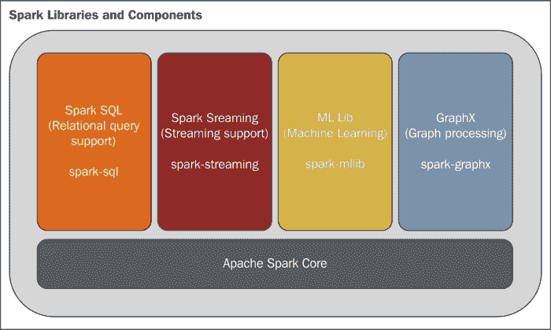
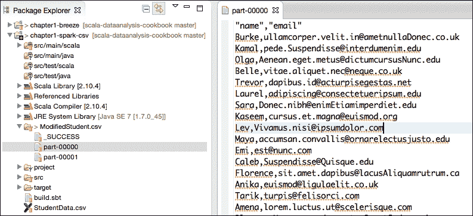

# 二、Apache Spark 数据帧入门

在本章中，我们将介绍以下配方:

*   获得 Apache Spark
*   从 CSV 创建数据帧
*   操作数据帧
*   从 Scala case 类创建数据帧

# 简介

Apache Spark 是一个集群计算平台，据称运行速度比 Hadoop 快 10 倍左右。总的来说，我们可以把它看作是一种在海量数据上以惊人的速度运行复杂逻辑的手段。Spark 的另一个好处是，我们编写的程序比我们为 Hadoop 编写的典型 MapReduce 类要小得多。因此，不仅我们的程序运行得更快，而且编写它们也花费更少的时间。

Spark 在 Spark 核心之上构建了四个主要的更高级别的工具:Spark Streaming、Spark MLlib(机器学习)、Spark SQL(用于访问数据的 SQL 接口)和 GraphX(用于图形处理)。Spark核心是Spark的心脏。Spark 在 Scala、Java 和 Python 中为数据表示、序列化、调度、度量等提供了更高级别的抽象。

冒着显而易见的风险，数据帧是数据分析中使用的主要数据结构之一。它们就像一个 RDBMS 表，将所有属性组织成列，将所有观察结果组织成行。这是存储和处理异构数据的好方法。在本章中，我们将讨论 Spark 中的数据帧。



# 获得阿帕奇Spark

在这个菜谱中，我们将看看如何将 Spark 引入我们的项目(使用 **SBT** )以及 Spark 如何在内部工作。

### 注意

这个食谱的代码可以在[https://github . com/arun ma/scaladata analysis cookbook/blob/master/chapter 1-spark-CSV/build . SBT](https://github.com/arunma/ScalaDataAnalysisCookbook/blob/master/chapter1-spark-csv/build.sbt)找到。

## 怎么做...

现在让我们把一些 Spark 依赖关系放到我们的文件中，这样我们就可以在随后的食谱中使用它们。现在，我们只关注其中的三个:Spark Core、Spark SQL 和 Spark MLlib。随着本书的深入，我们将会看到许多其他的 Spark 依赖项:

1.  在一个全新的文件夹下(这将是您的项目根目录)，创建一个名为`build.sbt`的新文件。
2.  接下来，让我们将 Spark 库添加到项目依赖项中。
3.  注意 Spark 1.4.x 需要 Scala 2.10.x，这就成了我们`build.sbt` :

    ```java
    organization := "com.packt"

    name := "chapter1-spark-csv"

    scalaVersion := "2.10.4"

    val sparkVersion="1.4.1"

    libraryDependencies ++= Seq(

      "org.apache.spark" %% "spark-core" % sparkVersion,

      "org.apache.spark" %% "spark-sql" % sparkVersion,

      "org.apache.spark" %% "spark-mllib" % sparkVersion

    )
    ```

    的第一节


# 从 CSV 创建数据帧

在这个菜谱中，我们将看一下如何从一个由分隔符分隔的值文件中创建一个新的数据帧。

### 注意

这个菜谱的代码可以在[https://github . com/arun ma/scaladataanalysiskook/blob/master/chapter 1-spark-CSV/src/main/Scala/com/packt/Scala data/spark/CSV/data frame CSV . Scala](https://github.com/arunma/ScalaDataAnalysisCookbook/blob/master/chapter1-spark-csv/src/main/scala/com/packt/scaladata/spark/csv/DataFrameCSV.scala)找到。

## 怎么做...

这个配方包括四个步骤:

1.  为我们的项目添加`spark-csv`支持。
2.  创建一个 Spark Config 对象，它给出了我们运行 Spark 的环境的信息。
3.  创建一个 Spark 上下文，作为 Spark 的入口点。然后，我们继续从 Spark 上下文创建一个`SQLContext`。
4.  使用`SQLContext`加载 CSV。
5.  CSV support isn't first-class in Spark, but it is available through an external library from Databricks. So, let's go ahead and add that to our `build.sbt`.

    添加完`spark-csv`依赖项后，我们完整的`build.sbt`如下所示:

    ```java
    organization := "com.packt"

    name := "chapter1-spark-csv"

    scalaVersion := "2.10.4"

    val sparkVersion="1.4.1"

    libraryDependencies ++= Seq(

      "org.apache.spark" %% "spark-core" % sparkVersion,

      "org.apache.spark" %% "spark-sql" % sparkVersion,

    "com.databricks" %% "spark-csv" % "1.0.3"

    )
    ```

6.  `SparkConf`保存运行这个 Spark“集群”所需的所有信息对于这个配方，我们在本地运行，并且我们打算在机器中只使用两个内核— `local[2]`。关于这个的更多细节可以在这个食谱的*还有…* 部分找到:

    ```java
    import org.apache.spark.SparkConf

     val conf = new SparkConf().setAppName("csvDataFrame").setMaster("local[2]")
    ```

    ### 注意

    当我们说这次运行的主机是"本地的"时,我们的意思是我们在独立模式下运行Spark.我们将在*还有更多……* 部分看到"独立"模式是什么意思
7.  Initialize the Spark context with the Spark configuration. This is the core entry point for doing anything with Spark:

    ```java
    import org.apache.spark.SparkContext

    val sc = new SparkContext(conf)
    ```

    在 Spark 中查询数据最简单的方法是使用 SQL 查询:

    ```java
    import org.apache.spark.sql.SQLContext

    val sqlContext=new SQLContext(sc)
    ```

8.  现在，让我们加载管道分隔的文件。`students`的类型为`org.apache.spark.sql.DataFrame` :

    ```java
    import com.databricks.spark.csv._

    val students=sqlContext.csvFile(filePath="StudentData.csv", useHeader=true, delimiter='|')
    ```

## 它是如何工作的...

`sqlContext`的`csvFile`函数接受待加载文件的完整`filePath`。如果 CSV 有标题，那么`useHeader`标志会将第一行作为列名读取。分隔符标志默认为逗号，但是您可以根据需要覆盖该字符。

除了使用`csvFile`函数，我们还可以使用`SQLContext`中的`load`函数。`load`函数接受文件的格式(在我们的例子中，它是 CSV)和选项作为`Map`。我们可以使用`Map`指定之前指定的相同参数，如下所示:

```java
val options=Map("header"->"true", "path"->"ModifiedStudent.csv")

val newStudents=sqlContext.load("com.databricks.spark.csv",options)
```

## 还有更多……

正如我们前面看到的，我们现在以独立模式运行 Spark 程序。在独立模式下， **驱动程序**(大脑)和 **工作器**节点都被塞进一个 JVM 中。在我们的例子中，我们将`master`设置为`local[2]`，这意味着我们打算在独立模式下运行 Spark，并请求它只使用机器中的两个内核。

Spark 可以在三种不同的模式下运行:

*   单独的
*   独立集群，使用其内置的集群管理器
*   使用外部集群管理器，比如 Apache Mesos 和 YARN

在[第 6 章](ch20.html "Chapter 6. Scaling Up")、*扩展*中，我们有关于如何在 Mesos 和 YARN 的内置集群模式上运行 Spark 的专门解释和方法。在集群环境中，Spark 运行一个驱动程序和许多工作节点。顾名思义，驱动程序是程序的大脑，也就是我们的主程序。工作节点拥有数据并对其执行各种转换。


# 操纵数据帧

在上一个食谱中，我们看到了如何创建数据帧。创建数据帧后，下一步自然是处理其中的数据。除了帮助我们完成这项工作的众多函数之外，我们还发现了其他一些有趣的函数，可以帮助我们对数据进行采样、打印数据的模式等等。在这个食谱中，我们将一个一个地看它们。

### 注意

这个食谱的代码和样本文件可以在[https://github . com/arun ma/scaladataanalysiskook/blob/master/chapter 1-spark-CSV/src/main/Scala/com/packt/Scala data/spark/CSV/data frame CSV . Scala](https://github.com/arunma/ScalaDataAnalysisCookbook/blob/master/chapter1-spark-csv/src/main/scala/com/packt/scaladata/spark/csv/DataFrameCSV.scala)找到。

## 怎么做...

现在，让我们看看如何使用以下子副本来操作数据帧:

*   打印数据帧的模式
*   数据帧中的采样数据
*   选择数据帧中的特定列
*   按条件过滤数据
*   对框架中的数据进行排序
*   重命名列
*   将数据帧视为关系表来执行 SQL 查询
*   将数据帧保存为文件

### 打印数据帧的模式

在从各种来源创建了 DataFrame 之后，我们显然希望快速检查它的模式。`printSchema`函数让我们做到了这一点。它将我们的列名和数据类型打印到默认输出流:

1.  让我们从`StudentData.csv`文件加载一个样本数据帧:

    ```java
    //Now, lets load our pipe-separated file

      //students is of type org.apache.spark.sql.DataFrame

      val students=sqlContext.csvFile(filePath="StudentData.csv", useHeader=true, delimiter='|')
    ```

2.  Let's print the schema of this DataFrame:

    ```java

    students.printSchema

    ```

    输出

    ```java

    root

     |-- id: string (nullable = true)

     |-- studentName: string (nullable = true)

     |-- phone: string (nullable = true)

     |-- email: string (nullable = true)

    ```

### 采样数据帧中的数据

我们想要做的下一件合乎逻辑的事情是检查我们的数据是否被正确地加载到数据帧中。有几种方法可以对新创建的数据帧中的数据进行采样:

*   Using the `show` method. This is the simplest way. There are two variants of the `show` method, as explained here:

    *   一个带有整数参数，指定要采样的行数。
    *   第二个没有整数参数。其中，行数默认为 20。

    与对数据进行采样的其他函数相比，`show`方法的独特之处在于，它显示行和标题，并将输出直接打印到默认输出流(控制台):

    ```java

    //Sample n records along with headers

     students.show (3)

     //Sample 20 records along with headers

     students.show ()

    //Output of show(3)

    +--+-----------+--------------+--------------------+

    |id|studentName|         phone|               email|

    +--+-----------+--------------+--------------------+

    | 1|      Burke|1-300-746-8446|ullamcorper.velit...|

    | 2|      Kamal|1-668-571-5046|pede.Suspendisse@...|

    | 3|       Olga|1-956-311-1686|Aenean.eget.metus...|

    +--+-----------+--------------+--------------------+

    ```

*   Using the `head` method. This method also accepts an integer parameter representing the number of rows to be fetched. The `head` method returns an array of rows. To print these rows, we can pass the `println` method to the `foreach` function of the arrays:

    ```java

     //Sample the first 5 records

     students.head(5).foreach(println)

    ```

    如果你不是`head`的忠实粉丝，你可以使用`take`函数，这是所有 Scala 序列通用的。`take`方法只是`head`方法的别名，它将所有调用委托给`head`:

    ```java

     //Alias of head

     students.take(5).foreach(println)

    //Output

    [1,Burke,1-300-746-8446,ullamcorper.velit.in@ametnullaDonec.co.uk]

    [2,Kamal,1-668-571-5046,pede.Suspendisse@interdumenim.edu]

    [3,Olga,1-956-311-1686,Aenean.eget.metus@dictumcursusNunc.edu]

    [4,Belle,1-246-894-6340,vitae.aliquet.nec@neque.co.uk]

    [5,Trevor,1-300-527-4967,dapibus.id@acturpisegestas.net]

    ```

### 选择数据帧列

正如您已经看到的，所有 DataFrame 列都有名称。`select`函数帮助我们从先前存在的数据帧中挑选特定的列，并从中形成一个全新的列:

*   Selecting a single column: Let's say that you would like to select only the `email` column from a DataFrame. Since DataFrames are immutable, the selection returns a new DataFrame:

    ```java

     val emailDataFrame:DataFrame=students.select("email")

    ```

    现在，我们有了一个名为`emailDataFrame`的新数据帧，它只有电子邮件作为其内容。让我们抽样检查一下这是不是真的:

    ```java

     emailDataFrame.show(3)

    //Output

    +--------------------+

    |               email|

    +--------------------+

    |ullamcorper.velit...|

    |pede.Suspendisse@...|

    |Aenean.eget.metus...|

    +--------------------+

    ```

*   Selecting more than one column: The `select` function actually accepts an arbitrary number of column names, which means that you can easily select more than one column from your source DataFrame:

    ```java

    val studentEmailDF=students.select("studentName", "email")

    ```

    ### 注意

    唯一的要求是指定的字符串参数必须是有效的列名。否则，抛出一个`org.apache.spark.sql.AnalysisException`异常。`printSchema`函数作为列名的快速参考。

    让我们取样并检查我们是否确实选择了新数据帧中的`studentName`和`email`列:

    ```java

    studentEmailDF.show(3)

    ```

    输出

    ```java

    +-----------+--------------------+

    |studentName|               email|

    +-----------+--------------------+

    |      Burke|ullamcorper.velit...|

    |      Kamal|pede.Suspendisse@...|

    |       Olga|Aenean.eget.metus...|

    +-----------+--------------------+

    ```

### 按条件过滤数据

现在我们已经看到了如何从数据帧中选择列，让我们看看如何根据条件过滤数据帧中的行。对于基于行的过滤，我们可以将 DataFrame 视为普通的 Scala 集合，并根据条件过滤数据。在所有这些例子中，为了清楚起见，我在最后添加了`show`方法:

1.  Filtering based on a column value:

    ```java

    //Print the first 5 records that has student id more than 5

     students.filter("id > 5").show(7)

    ```

    输出

    ```java

    +--+-----------+--------------+--------------------+

    |id|studentName|         phone|               email|

    +--+-----------+--------------+--------------------+

    | 6|     Laurel|1-691-379-9921|adipiscing@consec...|

    | 7|       Sara|1-608-140-1995|Donec.nibh@enimEt...|

    | 8|     Kaseem|1-881-586-2689|cursus.et.magna@e...|

    | 9|        Lev|1-916-367-5608|Vivamus.nisi@ipsu...|

    |10|       Maya|1-271-683-2698|accumsan.convalli...|

    |11|        Emi|1-467-270-1337|        est@nunc.com|

    |12|      Caleb|1-683-212-0896|Suspendisse@Quisq...|

    +--+-----------+--------------+--------------------+

    ```

    注意，即使`id`字段被推断为字符串类型，它也能正确地进行数值比较。另一方面，`students.filter("email > 'c'")`会返回所有以大于`'c'`的字符开头的电子邮件 id。

2.  Filtering based on an empty column value. The following filter selects all students without names:

    ```java

    students.filter("studentName =''").show(7)

    ```

    输出

    ```java

    +--+-----------+--------------+--------------------+

    |id|studentName|         phone|               email|

    +--+-----------+--------------+--------------------+

    |21|           |1-598-439-7549|consectetuer.adip...|

    |32|           |1-184-895-9602|accumsan.laoreet@...|

    |45|           |1-245-752-0481|Suspendisse.eleif...|

    |83|           |1-858-810-2204|sociis.natoque@eu...|

    |94|           |1-443-410-7878|Praesent.eu.nulla...|

    +--+-----------+--------------+--------------------+

    ```

3.  Filtering based on more than one condition. This filter shows all records whose student names are empty or student name field has a `NULL` string value:

    ```java

    students.filter("studentName ='' OR studentName = 'NULL'").show(7)

    ```

    输出

    ```java

    +--+-----------+--------------+--------------------+

    |id|studentName|         phone|               email|

    +--+-----------+--------------+--------------------+

    |21|           |1-598-439-7549|consectetuer.adip...|

    |32|           |1-184-895-9602|accumsan.laoreet@...|

    |33|       NULL|1-105-503-0141|Donec@Inmipede.co.uk|

    |45|           |1-245-752-0481|Suspendisse.eleif...|

    |83|           |1-858-810-2204|sociis.natoque@eu...|

    |94|           |1-443-410-7878|Praesent.eu.nulla...|

    +--+-----------+--------------+--------------------+

    ```

    我们只是使用`show(7)`函数将输出限制为七条记录。

4.  Filtering based on SQL-like conditions.

    该过滤器获取姓名以字母`'M'`开头的所有学生的条目。

    ```java

    students.filter("SUBSTR(studentName,0,1) ='M'").show(7)

    ```

    输出

    ```java

    +--+-----------+--------------+--------------------+

    |id|studentName|         phone|               email|

    +--+-----------+--------------+--------------------+

    |10|       Maya|1-271-683-2698|accumsan.convalli...|

    |19|    Malachi|1-608-637-2772|Proin.mi.Aliquam@...|

    |24|    Marsden|1-477-629-7528|Donec.dignissim.m...|

    |37|      Maggy|1-910-887-6777|facilisi.Sed.nequ...|

    |61|     Maxine|1-422-863-3041|aliquet.molestie....|

    |77|      Maggy|1-613-147-4380| pellentesque@mi.net|

    |97|    Maxwell|1-607-205-1273|metus.In@musAenea...|

    +--+-----------+--------------+--------------------+

    ```

### 对帧中的数据进行排序

使用`sort`函数，我们可以按照特定的列对数据帧进行排序:

1.  Ordering by a column in descending order:

    ```java

     students.sort(students("studentName").desc).show(7)

    ```

    输出

    ```java

    +--+-----------+--------------+--------------------+

    |id|studentName|         phone|               email|

    +--+-----------+--------------+--------------------+

    |50|      Yasir|1-282-511-4445|eget.odio.Aliquam...|

    |52|       Xena|1-527-990-8606|in.faucibus.orci@...|

    |86|     Xandra|1-677-708-5691|libero@arcuVestib...|

    |43|     Wynter|1-440-544-1851|amet.risus.Donec@...|

    |31|    Wallace|1-144-220-8159| lorem.lorem@non.net|

    |66|      Vance|1-268-680-0857|pellentesque@netu...|

    |41|     Tyrone|1-907-383-5293|non.bibendum.sed@...|

    | 5|     Trevor|1-300-527-4967|dapibus.id@acturp...|

    |65|      Tiger|1-316-930-7880|nec@mollisnoncurs...|

    |15|      Tarik|1-398-171-2268|turpis@felisorci.com|

    +--+-----------+--------------+--------------------+

    ```

2.  Ordering by more than one column (ascending):

    ```java

    students.sort("studentName", "id").show(10)

    ```

    输出

    ```java

    +--+-----------+--------------+--------------------+

    |id|studentName|         phone|               email|

    +--+-----------+--------------+--------------------+

    |21|           |1-598-439-7549|consectetuer.adip...|

    |32|           |1-184-895-9602|accumsan.laoreet@...|

    |45|           |1-245-752-0481|Suspendisse.eleif...|

    |83|           |1-858-810-2204|sociis.natoque@eu...|

    |94|           |1-443-410-7878|Praesent.eu.nulla...|

    |91|       Abel|1-530-527-7467|    urna@veliteu.edu|

    |69|       Aiko|1-682-230-7013|turpis.vitae.puru...|

    |47|       Alma|1-747-382-6775|    nec.enim@non.org|

    |26|      Amela|1-526-909-2605| in@vitaesodales.edu|

    |16|      Amena|1-878-250-3129|lorem.luctus.ut@s...|

    +--+-----------+--------------+--------------------+

    ```

或者，可以使用`sort`函数的`orderBy`别名来实现这一点。此外，可以使用 DataFrame 的`apply`方法指定多个列的顺序:

```java

students.sort(students("studentName").desc, students("id").asc).show(10)

```

### 重命名列

如果我们不喜欢源数据帧的列名,并希望将它们改为更好、更有意义的名称，我们可以在选择列时使用`as`函数。

在本例中，我们将`"studentName"`列重命名为`"name"`，并保留`"email"`列的名称:

```java

val copyOfStudents=students.select(students("studentName").as("name"), students("email"))

copyOfStudents.show()

```

输出

```java

+--------+--------------------+

|    name|               email|

+--------+--------------------+

|   Burke|ullamcorper.velit...|

|   Kamal|pede.Suspendisse@...|

|    Olga|Aenean.eget.metus...|

|   Belle|vitae.aliquet.nec...|

|  Trevor|dapibus.id@acturp...|

|  Laurel|adipiscing@consec...|

|    Sara|Donec.nibh@enimEt...|

```

### 将数据帧视为关系表

DataFrames 的真正强大之处在于，我们可以像对待关系表一样对待它，并使用 SQL 进行查询。这包括两个简单的步骤:

1.  将`students`数据帧注册为名为`"students"`(或任何其他名称):

    ```java

    students.registerTempTable("students")

    ```

    的表格
2.  Query it using regular SQL:

    ```java

    val dfFilteredBySQL=sqlContext.sql("select * from students where studentName!='' order by email desc")

     dfFilteredBySQL.show(7)

    id studentName phone          email

    87 Selma       1-601-330-4409 vulputate.velit@p

    96 Channing    1-984-118-7533 viverra.Donec.tem

    4  Belle       1-246-894-6340 vitae.aliquet.nec

    78 Finn        1-213-781-6969 vestibulum.massa@

    53 Kasper      1-155-575-9346 velit.eget@pedeCu

    63 Dylan       1-417-943-8961 vehicula.aliquet@

    35 Cadman      1-443-642-5919 ut.lacus@adipisci

    ```

    ### Note that the life cycle of

    temporary tables is associated with the life cycle of `SQLContext` used to create data frames.

### 连接两个数据帧

既然我们已经看到了如何将一个数据帧注册为一个表，那么让我们看看如何在数据帧上执行类似 SQL 的连接操作。

#### 内部连接

内部连接是默认连接，当给定一个条件时，它只给出在两个数据帧上匹配的结果:

```java

val students1=sqlContext.csvFile(filePath="StudentPrep1.csv", useHeader=true, delimiter='|')

val students2=sqlContext.csvFile(filePath="StudentPrep2.csv", useHeader=true, delimiter='|')

val studentsJoin=students1.join(students2, students1("id")===students2("id"))

studentsJoin.show(studentsJoin.count.toInt)

```

输出如下:


#### 右外部连接

右外部连接显示了右手侧数据框中可用的所有额外的不匹配行。我们可以从下面的输出中看到，现在显示了右侧数据帧中 ID 为 999 的条目:

```java

val studentsRightOuterJoin=students1.join(students2, students1("id")===students2("id"), "right_outer")

studentsRightOuterJoin.show(studentsRightOuterJoin.count.toInt)

```


#### 左外连接

与右外连接类似，左外连接不仅返回匹配行，还返回左侧数据帧的其他不匹配行:

```java

 val studentsLeftOuterJoin=students1.join(students2, students1("id")===students2("id"), "left_outer")

 studentsLeftOuterJoin.show(studentsLeftOuterJoin.count.toInt)

```

### 将数据帧保存为文件

下一步，让我们将数据帧保存在文件存储中。我们在前面的配方中使用的`load`函数有一个与相似的对应函数，叫做`save`。

这包括两个步骤:

1.  Create a map containing the various options that you would like the `save` method to use. In this case, we specify the filename and ask it to have a header:

    ```java

    val options=Map("header"->"true", "path"->"ModifiedStudent.csv")

    ```

    为了保持有趣，让我们从源数据帧中选择列名。在这个例子中，我们选择了`studentName`和`email`列，并将`studentName`列的名称改为`name`。

    ```java

    val copyOfStudents=students.select(students("studentName").as("name"), students("email"))

    ```

2.  最后，将这个新的数据帧和标题保存在一个名为`ModifiedStudent.csv` :

    ```java

    copyOfStudents.save("com.databricks.spark.csv", SaveMode.Overwrite, options)

    ```

    的文件中

第二个论点有点意思。我们可以选择`Overwrite`(就像我们在这里做的那样)`Append`、`Ignore`或`ErrorIfExists`。`Overwrite`——顾名思义——如果文件已经存在就覆盖它，`Ignore`如果文件存在就忽略写入，`ErrorIfExists`抱怨文件已经存在，`Append`从最后一个编辑位置继续写入。引发错误是默认行为。

`save`方法的输出如下所示:



# 从 Scala 案例类创建数据帧

在这个菜谱中，我们将看到如何从 Scala case 类中创建一个新的 DataFrame 。

### 注意

这个食谱的代码可以在[https://github . com/arun ma/scaladata analysis cookbook/blob/master/chapter 1-spark-CSV/src/main/Scala/com/packt/Scala data/spark/CSV/dataframefromcaseclasses . Scala](https://github.com/arunma/ScalaDataAnalysisCookbook/blob/master/chapter1-spark-csv/src/main/scala/com/packt/scaladata/spark/csv/DataFrameFromCaseClasses.scala)找到。

## 怎么做...

1.  We create a new entity called `Employee` with the `id` and `name` fields, like this:

    ```java

    case class Employee(id:Int, name:String)

    ```

    类似于前面的配方，我们创建了`SparkContext`和`SQLContext`。

    ```java

    val conf = new SparkConf().setAppName("colRowDataFrame").setMaster("local[2]")

    //Initialize Spark context with Spark configuration.  This is the core entry point to do anything with Spark

    val sc = new SparkContext(conf)

    //The easiest way to query data in Spark is to use SQL queries.

    val sqlContext=new SQLContext(sc)

    ```

2.  我们可以从各种来源获取这些 employee 对象，比如 RDBMS 数据源，但是为了这个例子，我们构造一个雇员列表，如下:

    ```java

     val listOfEmployees =List(Employee(1,"Arun"), Employee(2, "Jason"), Employee (3, "Abhi"))

    ```

3.  The next step is to pass the `listOfEmployees` to the `createDataFrame` function of `SQLContext`. That's it! We now have a DataFrame. When we try to print the schema using the `printSchema` method of the DataFrame, we will see that the DataFrame has two columns, with names `id` and `name`, as defined in the `case` class:

    ```java

     //Pass in the Employees into the `createDataFrame` function.

     val empFrame=sqlContext.createDataFrame(listOfEmployees)

     empFrame.printSchema

    ```

    输出:

    ```java

    root

     |-- id: integer (nullable = false)

     |-- name: string (nullable = true)

    ```

    正如您可能已经猜到的，DataFrame 的模式是使用反射从 case 类推断出来的。

4.  We can get a different name for the DataFrame—other than the names specified in the `case` class—using the `withColumnRenamed` function, as shown here:

    ```java

     val empFrameWithRenamedColumns=sqlContext.createDataFrame(listOfEmployees).withColumnRenamed("id", "empId")

     empFrameWithRenamedColumns.printSchema

    ```

    输出:

    ```java

    root

    |-- empId: integer (nullable = false)

    |-- name: string (nullable = true)

    ```

5.  让我们使用 Spark 一流的 SQL 支持来查询数据帧。然而，在此之前，我们必须将 DataFrame 注册为一个表。正如我们在前面的食谱中看到的，`registerTempTable`帮助我们实现了这一点。使用下面的命令，我们将 DataFrame 注册为一个名为`"employeeTable"`

    ```java

     "employeeTable"

     empFrameWithRenamedColumns.registerTempTable("employeeTable")

    ```

    的表
6.  Now, for the actual query. Let's arrange the DataFrame in descending order of names:

    ```java

    val sortedByNameEmployees=sqlContext.sql("select * from employeeTable order by name desc")

     sortedByNameEmployees.show()

    ```

    输出:

    ```java

    +-----+-----+

    |empId| name|

    +-----+-----+

    |    2|Jason|

    |    1| Arun|

    |    3| Abhi|

    +-----+-----+

    ```

## 它是如何工作的...

`createDataFrame`函数接受一系列的`scala.Product`。Scala case 类从`Product`扩展而来，因此符合预算。也就是说，我们实际上可以使用元组序列来创建数据帧，因为元组也实现了`Product`:

```java

val mobiles=sqlContext.createDataFrame(Seq((1,"Android"), (2, "iPhone")))

 mobiles.printSchema

 mobiles.show()

```

输出:

```java

//Schema

root

|-- _1: integer (nullable = false)

|-- _2: string (nullable = true)

//Data

+--+-------+

|_1|     _2|

+--+-------+

| 1|Android|

| 2| iPhone|

+--+-------+

```

当然，您可以使用 `withColumnRenamed`来重命名列。