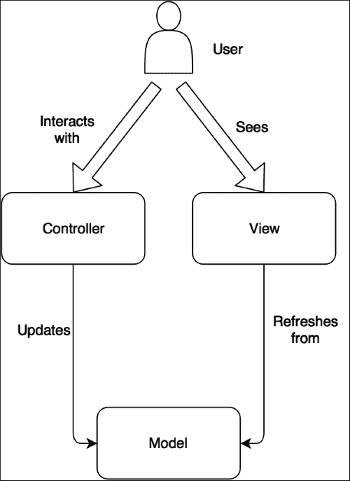
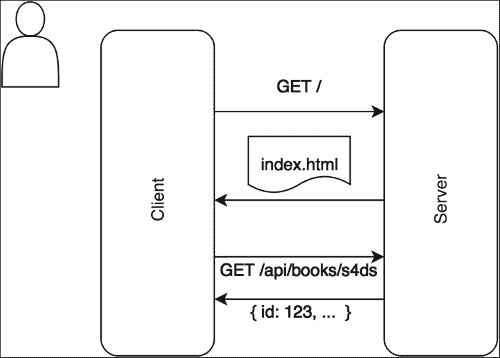
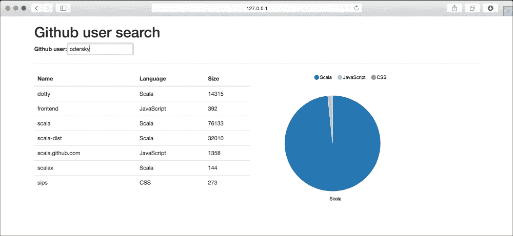

# 十三、Play 和 Web APIs

在本书的前 12 章中，我们为任何想要构建数据科学应用程序的人介绍了基本工具和库:我们学习了如何与 SQL 和 MongoDB 数据库交互，如何使用 Spark 构建快速批处理应用程序，如何使用 MLlib 应用最先进的机器学习算法，以及如何在 Akka 中构建模块化并发应用程序。

在本书的最后几章中，我们将扩展到一个 web 框架: *Play* 。您可能想知道为什么 web 框架会出现在数据科学书籍中；当然，这样的话题最好留给软件工程师或网络开发者。然而，数据科学家很少存在于真空中。他们经常需要与利益相关者交流结果或见解。尽管 ROC 曲线对于精通统计学的人来说可能很有说服力，但对于不太懂技术的人来说，它可能没有那么重要。事实上，当洞察力伴随着引人入胜的视觉效果时，销售洞察力会容易得多。

许多现代交互式数据可视化应用程序是在 web 浏览器中运行的 web 应用程序。通常，这些涉及 **D3.js** ，一个用于构建数据驱动网页的 JavaScript 库。在这一章和下一章，我们将会看到 D3 和 Scala 的集成。

编写 web 应用程序是一项复杂的工作。我们将在本章和下一章中分担这项任务。在这一章中，我们将学习如何编写一个 REST API，我们可以用它作为我们的应用程序的后端，或者查询本身。在下一章中，我们将看看如何将前端代码与 Play 集成起来，以查询后端公开的 API，并使用 D3 显示它。我们假设你至少对本章中的 HTTP 有一个基本的了解:你至少应该已经阅读过[第 7 章](ch07.html "Chapter 7. Web APIs")、*Web API*。

许多数据科学家或有抱负的数据科学家不太可能熟悉 web 技术的内部工作原理。学习如何构建复杂的网站或 web APIs 可能会令人望而生畏。因此，本章从动态网站和 web 应用程序架构的一般讨论开始。如果你已经熟悉了服务器端编程和 web 框架，你可以很容易地跳过前几节。

# 客户端-服务器应用程序

一个网站是通过两台计算机之间的交互来工作的:客户端和服务器。如果你在网络浏览器中输入网址[www.github.com/pbugnion/s4ds/graphs](http://www.github.com/pbugnion/s4ds/graphs)，你的浏览器会查询一个 GitHub 服务器。服务器将在它的数据库中寻找您感兴趣的关于存储库的信息。它会将这些信息以 HTML、CSS 和 JavaScript 的形式提供给你的计算机。然后，您的浏览器负责以正确的方式解释这个响应。

如果您查看有问题的 URL，您会注意到该页面上有几个图表。拔掉你的互联网连接，你仍然可以与图形互动。当你加载网页时，所有与图形交互的必要信息都以 JavaScript 的形式传输了。当你玩图形时，进行这些改变所必需的 CPU 周期是花在你的电脑上，而不是 GitHub 服务器上。代码在*客户端*执行。相反，当您请求关于新存储库的信息时，该请求由 GitHub 服务器处理。据说是在*服务器端*处理的。

像 Play 这样的 web 框架可以用在服务器上。对于客户端代码，我们只能使用客户端浏览器能够理解的语言:HTML 用于布局，CSS 用于样式和 JavaScript，或者可以编译成 JavaScript 的语言用于逻辑。


# web 框架简介

这一部分简要介绍了现代网络应用程序是如何设计的。如果你已经习惯了编写后端代码，那就跳过它吧。

不严格地说，web 框架是一组用于构建 web 应用程序的工具和代码库。为了理解 web 框架提供了什么，让我们后退一步，想想如果没有 web 框架，你需要做些什么。

您希望编写一个程序，监听端口 80，并将 HTML(或 JSON 或 XML)发送回请求它的客户机。如果您向每个客户端提供相同的文件，这很简单:只需在启动服务器时从文件中加载 HTML，并将其发送给请求它的客户端。

到目前为止，一切顺利。但是，如果您现在想根据客户机请求定制 HTML，该怎么办呢？您可以根据客户端放入浏览器的 URL 的一部分，或者根据 HTTP 请求中的特定元素，选择不同的响应。例如，[Amazon.com](http://amazon.com)上的产品页面与支付页面不同。您需要编写代码来解析 URL 和请求，然后将请求路由到相关的处理程序。

现在，您可能希望根据请求的特定元素来自定义动态返回的 HTML。在[Amazon.com](http://amazon.com)上的每个产品的页面都遵循相同的轮廓，但是具体的元素是不同的。为每个产品存储完整的 HTML 内容是一种浪费。更好的方法是将每个产品的详细信息存储在数据库中，当客户请求该产品的信息时，将它们注入 HTML 模板。你可以用一个*模板处理器*来做这件事。当然，编写一个好的模板处理器是困难的。

您可能会部署您的 web 框架，并意识到它无法处理定向到它的流量。您决定响应客户端请求的处理程序应该异步运行。您现在必须处理并发性。

web 框架本质上提供了将所有东西绑定在一起的线路。除了绑定 HTTP 服务器之外，大多数框架都有一个路由器，根据 URL 自动将请求路由到正确的处理程序。在大多数情况下，处理程序将异步运行，为您提供更好的可伸缩性。许多框架都有一个模板处理器，可以让您直观地编写 HTML(有时是 JSON 或 XML)模板。一些 web 框架还提供了访问数据库、解析 JSON 或 XML、制定 HTTP 请求以及本地化和国际化的功能。


# 模型-视图-控制器架构

许多 web 框架强加了程序架构:如果不对这些组件做一些假设，很难提供将不同组件绑定在一起的线路。**模型-视图-控制器** ( **MVC** )架构在网络上特别流行，这也是 Play 框架采用的架构。让我们依次看看每个组件:

*   模型是应用程序的基础数据。例如，我希望 GitHub 下的应用程序有用户、存储库、组织、拉请求等模型。在 Play 框架中，模型通常是 case 类的一个实例。模型的核心职责是记住应用程序的当前状态。
*   视图是屏幕上一个模型或一组模型的表示。
*   控制器处理客户端交互，可能会改变模型。例如，如果你在 GitHub 上*开始*一个项目，控制器将更新相关的模型。控制器通常携带很少的应用程序状态:记住事情是模型的工作。

    MVC 架构：应用程序的状态由模型提供。视图向用户提供模型的可视化表示,控制器处理逻辑：当用户按下按钮或提交表单时做什么. .

MVC 框架工作得很好，因为它将用户界面从底层数据中分离出来，并构建了动作流:控制器可以更新模型状态或视图，模型可以向视图发送信号，告诉它进行更新，而视图只是显示这些信息。该模型不携带与用户界面相关的信息。这种关注点的分离产生了一个更简单的信息流心智模型，更好的封装和更大的可测试性。


# 单页应用

客户机-服务器的二元性给优雅的 MVC 架构增加了一定程度的复杂性。模型应该驻留在哪里？控制器呢？传统上，模型和控制器几乎完全在服务器上运行，服务器只是将相关的 HTML 视图推送到客户端。

客户端 JavaScript 框架(如 AngularJS)的增长导致了向在客户端放置更多代码的逐渐转变。控制器和模型的临时版本通常都在客户端运行。服务器的功能就像一个 web API:例如，如果用户更新了模型，控制器将向服务器发送一个 HTTP 请求，通知它这个变化。

然后，将运行服务器端的程序和运行客户端的程序视为两个独立的应用程序是有意义的:例如，服务器将数据保存在数据库中，并为这些数据提供编程接口，通常作为返回 JSON 或 XML 数据的 web 服务。客户端程序维护它自己的模型和控制器，并且每当它需要一个新模型时，或者每当它需要通知服务器应该改变模型的持久视图时，轮询服务器。

在极端情况下，这种导致了**单页面应用**。在单页面应用程序中，客户端第一次向服务器请求页面时，会收到构建整个应用程序框架所需的 HTML 和 JavaScript。如果客户端需要来自服务器的更多数据，他将轮询服务器的 API。这些数据以 JSON 或 XML 的形式返回。

这在理论上看起来有点复杂，所以让我们考虑一下 Amazon 网站如何作为一个单页应用程序来构建。我们只关心这里的产品页面，因为这已经够复杂了。让我们假设你在主页上，你点击了一个特定产品的链接。运行在你电脑上的应用程序知道如何展示产品，例如通过一个 HTML 模板。JavaScript 也有模型的原型，例如:

```java
{

    product_id: undefined,

    product_name: undefined,

    product_price: undefined,

    ...

}
```

它目前缺少的是知道在你刚刚选择的产品的那些字段中放什么数据:当网站加载时，这些信息不可能被发送到你的计算机，因为没有办法知道你可能会点击什么产品(发送每个产品的信息会非常昂贵)。因此，Amazon 客户机向服务器发送一个请求，请求关于该产品的信息。Amazon 服务器回复一个 JSON 对象(或者可能是 XML)。然后，客户端使用该信息更新其模型。更新完成后，将触发一个事件来更新视图:



单页面应用程序中的客户端-服务器通信:当客户端第一次访问网站时，它会收到包含应用程序全部逻辑的 HTML、CSS 和 JavaScript 文件。从那时起，客户端只在请求额外数据时使用服务器作为 API。运行在用户 web 浏览器上的应用程序和运行在服务器上的应用程序几乎是独立的。唯一的耦合是通过服务器公开的 API 结构。


# 构建应用程序

在本章和接下来的中，我们将构建一个单页应用程序，它依赖于 Play 中编写的 API。我们将建立一个类似这样的网页:



用户在 GitHub 上输入某人的名字，就可以查看他们的库列表和总结他们所用语言的图表。您可以找到在`app.scala4datascience.com`部署的应用程序。去吧，试一试。

要一瞥的内部，输入`app.scala4datascience.com/api/repos/odersky`。这会返回一个 JSON 对象，如下所示:

```java
[{"name":"dotty","language":"Scala","is_fork":true,"size":14653},

{"name":"frontend","language":"JavaScript","is_fork":true,"size":392},

{"name":"legacy-svn-scala","language":"Scala","is_fork":true,"size":296706},

...
```

我们将在本章构建 API，在下一章编写前端代码。


# 游戏框架

Play 框架是建立在 Akka 之上的一个 web 框架。它在业界有着良好的记录，因此是构建可伸缩 web 应用程序的可靠选择。

Play 是一个固执己见的 web 框架:它希望你遵循 MVC 架构，并且对你应该使用的工具有强烈的看法。它捆绑了自己的 JSON 和 XML 解析器，自己的访问外部 API 的工具，以及如何访问数据库的建议。

Web 应用程序比我们在本书中开发的命令行脚本复杂得多，因为有更多的组件:后端代码、路由信息、HTML 模板、JavaScript 文件、图像等等。Play 框架对项目的目录结构做出了强有力的假设。从头开始构建这个结构既无聊又容易出错。幸运的是，我们可以使用 **类型安全激活器**来引导项目(你也可以从[https://github.com/pbugnion/s4ds](https://github.com/pbugnion/s4ds)的 Git 库下载代码，但是我鼓励你从一个基本的激活器结构开始项目，并使用完成的版本作为例子)。

Typesafe activator 是 SBT 的一个定制版本，包含了让 Scala 程序员快速启动和运行的模板。要安装 activator，你可以从 https://www.typesafe.com/activator/download 的[下载](https://www.typesafe.com/activator/download)一个 JAR，或者在 Mac OS 上，通过自制软件:

```java

$ brew install typesafe-activator

```

然后，您可以从终端启动 activator 控制台。如果您下载了 activator:

```java

$ ./path/to/activator/activator new

```

或者，如果您通过自制软件安装:

```java

$ activator new

```

这将在当前目录中启动一个新项目。它从问你想从什么模板开始开始。选择`play-scala`。然后它会询问您的应用程序的名称。我选择了`ghub-display`，但是继续吧，发挥你的创造力！

让我们研究一下新创建的项目结构(我只保留了最重要的文件):

```java

├── app

│   ├── controllers

│   │   └── Application.scala

│   └── views

│       ├── main.scala.html

│       └── index.scala.html

├── build.sbt

├── conf

│   ├── application.conf

│   └── routes

├── project

│   ├── build.properties

│   └── plugins.sbt

├── public

│   ├── images

│   │   └── favicon.png

│   ├── javascripts

│   │   └── hello.js

│   └── stylesheets

│       └── main.css

└── test

 ├── ApplicationSpec.scala

 └── IntegrationSpec.scala

```

让我们运行应用程序:

```java

$ ./activator

[ghub-display] $ run

```

前往您的浏览器并导航至 URL `127.0.0.1:9000/`。加载该页面可能需要几秒钟时间。一旦加载完毕，您应该会看到一个默认页面，上面写着**您的应用程序已经就绪**。

在我们修改之前，让我们看看这是如何发生的。当您请求浏览器将您带到`127.0.0.1:9000/`时，浏览器会向监听该地址的服务器发送一个 HTTP 请求(在本例中，是与 Play 捆绑在一起的 Netty 服务器)。该请求是对路由`/`的 GET 请求。游戏框架在`conf/routes`中查看是否有满足`/`的路线:

```java
$ cat conf/routes

# Home page

GET     /                           controllers.Application.index

...
```

我们看到,`conf/routes`文件包含 GET 请求的路由`/`。那一行的第二部分，`controllers.Application.index`，是一个处理该路由的 Scala 函数的名称(稍后会详细介绍)。我们来实验一下。将路线终点改为`/hello`。刷新浏览器而不更改 URL。这将触发应用程序的重新编译。您现在应该会看到一个错误页面:


错误页面告诉您应用程序不再有路线`/`的操作。如果您导航到`127.0.0.1:9000/hello`，您应该会再次看到登录页面。

除了学习一些路由的工作原理，我们还学习了两件关于开发 Play 应用程序的事情:

*   在开发模式下，当您刷新浏览器时，代码会被重新编译，并且会发生代码更改
*   编译和运行时错误会传播到网页

我们把路线改回`/`吧。关于路由还有很多要说的，但是可以等到我们开始构建应用程序的时候再说。

`conf/routes`文件告诉 Play 框架使用方法`controllers.Application.index`来处理对`/`的请求。让我们看看`app/controllers`中的`Application.scala`文件，这里定义了`index`方法:

```java
// app/controllers/Application.scala

package controllers

import play.api._

import play.api.mvc._

class Application extends Controller {

  def index = Action {

    Ok(views.html.index("Your new application is ready."))

  }

}
```

我们看到`controllers.Application.index`引用了类`Application`中的方法`index`。该方法具有返回类型`Action`。一个`Action`只是一个将 HTTP 请求映射到响应的函数。在更详细地解释这一点之前，让我们将操作改为:

```java
def index = Action {

  Ok("hello, world")

}
```

刷新您的浏览器，您应该会看到登录页面被替换为`"hello world"`。通过让我们的操作返回`Ok("hello, world")`，我们请求 Play 返回一个 HTTP 响应，其状态代码为 200(表示请求成功)并且主体为`"hello world"`。

让我们回到`index`的原文内容:

```java
Action {

  Ok(views.html.index("Your new application is ready.")) 

}
```

我们可以看到，这调用了方法`views.html.index`。这可能看起来很奇怪，因为任何地方都没有`views`包。但是，如果你查看`app/views`目录，你会注意到有两个文件:`index.scala.html`和`main.scala.html`。这些是模板，在编译时，它们被转换成 Scala 函数。我们来看看`main.scala.html`:

```java
// app/views/main.scala.html

@(title: String)(content: Html)

<!DOCTYPE html>

<html lang="en">

    <head>

        

        <!-- not so important stuff -->

    </head>

    <body>

        @content

    </body>

</html>
```

在编译时，这个模板被编译成包`views.html`中的函数`main(title:String)(content:Html)`。注意，函数包和名称来自模板文件名，函数参数来自模板的第一行。模板包含嵌入的`@title`和`@content`值，它们由函数的参数填充。让我们在 Scala 控制台中试验一下:

```java

$ activator console

scala> import views.html._

import views.html._

scala> val title = "hello"

title: String = hello

scala> val content = new play.twirl.api.Html("<b>World</b>")

content: play.twirl.api.Html = <b>World</b>

scala> main(title)(content)

res8: play.twirl.api.HtmlFormat.Appendable =

<!DOCTYPE html>

<html lang="en">

 <head>

 

 <!-- not so important stuff -->

 </head>

 <body>

 <b>World</b>

 </body>

</html>

```

我们可以调用`views.html.main`，就像我们调用普通的 Scala 函数一样。我们传入的参数嵌入到正确的位置，如`views/main.scala.html`中的模板所定义的。

这就结束了我们对游戏的介绍。让我们简单回顾一下我们所学的:当一个请求到达 Play 服务器时，服务器读取 URL 和 HTTP 动词，并检查这些是否存在于它的`conf/routes`文件中。然后，它会将请求传递给控制器为该路由定义的`Action`。这个`Action` 返回一个 HTTP 响应，该响应被反馈给浏览器。在构造响应时，`Action`可以利用模板，就其而言，该模板只是函数`(arguments list) => String`或`(arguments list) => HTML`。


# 动态路由

正如我们所见，路由是 HTTP 请求到 Scala 处理程序的映射。路线存储在`conf/routes`中。路由由一个 HTTP 动词定义，后面是端点，再后面是一个 Scala 函数:

```java
// verb   // end-point              // Scala handler

GET       /                         controllers.Application.index
```

我们学会了通过在`routes`文件中添加行来添加新的路线。然而，我们并不局限于静态路由。Play 框架允许我们在路线中包含通配符。通配符的值可以作为参数传递给控制器。为了了解这是如何工作的，让我们创建一个以人名作为参数的控制器。在`app.controllers`中的`Application`对象中，添加:

```java
// app/controllers/Application.scala

class Application extends Controller {

  ...

  def hello(name:String) = Action {

    Ok(s"hello, $name")

  }

}
```

我们现在可以定义一个由该控制器处理的路由:

```java
// conf/routes

GET  /hello/:name             controllers.Application.hello(name)
```

如果你现在将浏览器指向`127.0.0.1:9000/hello/Jim`，你会看到**你好，吉姆**出现在屏幕上。

在`:`和后面的`/`之间的任何字符串都被视为通配符:它将匹配任何字符组合。通配符的值可以传递给控制器。请注意，通配符可以出现在 URL 中的任何位置，并且可以有多个通配符。以下是所有有效的路线定义，例如:

```java
GET /hello/person-:name        controllers.Application.hello(name)

// ... matches /hello/person-Jim

GET /hello/:name/picture  controllers.Application.pictureFor(name)

// ... matches /hello/Jim/picture

GET /hello/:first/:last controllers.Application.hello(first, last)

// ... matches /hello/john/doe
```

还有许多其他选择路由和传递参数给控制器的选项。有关路由可能性的完整讨论，请参考 Play 框架的文档:[https://www . Play framework . com/documentation/2.4 . x/Scala routing](https://www.playframework.com/documentation/2.4.x/ScalaRouting)。

### Tip

**URL 设计**

通常认为让 URL 尽可能简单是最佳实践。URL 应该反映网站信息的层次结构，而不是底层实现。GitHub 就是一个很好的例子:它的 URL 有直观的意义。例如，这本书的存储库的 URL 是:

[https://github.com/pbugnion/s4ds](https://github.com/pbugnion/s4ds)

要访问该存储库的问题页面，请将`/issues`添加到路线中。要访问第一个问题，请将`/1`添加到该路线。这些被称为**语义 URL**([https://en.wikipedia.org/wiki/Semantic_URL](https://en.wikipedia.org/wiki/Semantic_URL))。


# 行动

我们已经讨论了路线，以及如何将参数传递给控制器。现在让我们来谈谈我们可以用控制器做什么。

路由中定义的方法必须返回一个`play.api.mvc.Action`实例。`Action`类型是围绕`Request[A] => Result`类型的一个薄薄的包装器，其中`Request[A]`标识一个 HTTP 请求，`Result`是一个 HTTP 响应。

## 撰写回应

正如我们在第 7 章*Web API*中[看到的，HTTP 响应由以下部分组成:](ch07.html "Chapter 7. Web APIs")

*   状态代码(如 200 表示响应成功，404 表示页面丢失)
*   响应头，指示与响应相关的元数据的键值列表
*   响应正文。这可以是网页的 HTML、JSON、XML 或纯文本(或许多其他格式)。这通常是我们真正感兴趣的部分。

Play 框架定义了一个代表响应的`play.api.mvc.Result`对象。该对象包含一个带有状态代码和标题的`header`属性，以及一个包含主体的`body`属性。

生成`Result`的最简单方法是使用`play.api.mvc.Results`中的一个工厂方法。我们已经看到了`Ok`方法，它生成一个状态码为 200 的响应:

```java
def hello(name:String) = Action {

  Ok("hello, $name")

}
```

让我们后退一步，打开一个 Scala 控制台，这样我们就能理解它是如何工作的:

```java

$ activator console

scala> import play.api.mvc._

import play.api.mvc._

scala> val res = Results.Ok("hello, world")

res: play.api.mvc.Result = Result(200, Map(Content-Type -> text/plain; charset=utf-8))

scala> res.header.status

Int = 200

scala> res.header.headers

Map[String,String] = Map(Content-Type -> text/plain; charset=utf-8)

scala> res.body

play.api.libs.iteratee.Enumerator[Array[Byte]] = play.api.libs.iteratee.Enumerator$$anon$18@5fb83873

```

我们可以看到`Results.Ok(...)`如何创建一个状态为`200`的`Result`对象，以及(在本例中)一个表示内容类型的标题。主体稍微复杂一点:它是一个枚举器，可以在需要时推到输出流上。在本例中，枚举器包含传递给`Ok` : `"hello, world"`的参数。

`Results`中有很多工厂方法用于返回不同的状态码。一些比较相关的是:

*   `Action { Results.NotFound }`
*   `Action { Results.BadRequest("bad request") }`
*   `Action { Results.InternalServerError("error") }`
*   `Action { Results.Forbidden }`
*   `Action { Results.Redirect("/home") }`

关于`Result`工厂的完整列表，请查阅结果的 API 文档([https://www . play framework . com/documentation/2.4 . x/API/Scala/index . html # play . API . MVC . Results](https://www.playframework.com/documentation/2.4.x/api/scala/index.html#play.api.mvc.Results))。

到目前为止，我们一直局限于传递字符串作为`Ok`结果的内容:`Ok("hello, world")`。然而，我们并不局限于传递字符串。我们可以传递一个 JSON 对象:

```java

scala> import play.api.libs.json._

import play.api.libs.json._

scala> val jsonObj = Json.obj("hello" -> "world")

jsonObj: play.api.libs.json.JsObject = {"hello":"world"}

scala> Results.Ok(jsonObj)

play.api.mvc.Result = Result(200, Map(Content-Type -> application/json; charset=utf-8))

```

当我们开始构建 API 时，我们将更详细地讨论与 JSON 的交互。我们也可以传递 HTML 作为内容。这是返回视图时最常见的情况:

```java

scala> val htmlObj = views.html.index("hello")

htmlObj: play.twirl.api.HtmlFormat.Appendable =

<!DOCTYPE html>

<html lang="en">

 <head>

...

scala> Results.Ok(htmlObj)

play.api.mvc.Result = Result(200, Map(Content-Type -> text/html; charset=utf-8))

```

注意`Content-Type` 头是如何根据传递给`Ok`的内容类型设置的。`Ok`工厂使用`Writeable`类型类将其参数转换成响应的主体。因此，`Writeable`类型类存在的任何内容类型都可以用作`Ok`的参数。如果你不熟悉类型类，你可能想阅读第五章[、 *Scala 和 SQL 通过 JDBC* 中的*与类型类*的松散耦合部分。](ch05.html "Chapter 5. Scala and SQL through JDBC")

## 理解和解析请求

我们现在知道如何制定(基本)回应。等式的另一半是 HTTP 请求。回想一下，`Action`只是一个函数映射`Request => Result`。我们可以使用以下方式访问请求:

```java
def hello(name:String) = Action { request => 

  ...

}
```

需要引用请求的原因之一是为了访问查询字符串中的参数。让我们修改我们之前编写的`Hello, <name>`示例，可以选择在查询字符串中包含一个标题。因此，URL 可以被格式化为`/hello/Jim?title=Dr`。`request`实例公开了用于访问查询字符串中特定键的`getQueryString`方法。如果关键字出现在查询中，这个方法返回`Some[String]`，否则返回`None`。我们可以将我们的`hello`控制器重写为:

```java
def hello(name:String) = Action { request =>

  val title = request.getQueryString("title")

  val titleString = title.map { _ + " " }.getOrElse("")

  Ok(s"Hello, $titleString$name")

}
```

通过在浏览器中访问 URL `127.0.0.1:9000/hello/Odersky?title=Dr`来尝试一下。浏览器应该显示`Hello, Dr Odersky`。

到目前为止，我们一直专注于 GET 请求。这些没有身体。其他类型的 HTTP 请求，最常见的是 POST 请求，确实包含一个主体。Play 让用户在定义动作时通过*身体解析器*。请求体将通过体解析器传递，解析器将它从字节流转换成 Scala 类型。举个非常简单的例子，让我们定义一个接受 POST 请求的新路由:

```java
POST      /hello            controllers.Application.helloPost
```

我们将把预定义的`parse.text`主体解析器应用于传入的请求主体。这会将请求的主体转换为字符串。`helloPost`控制器看起来像:

```java
def helloPost = Action(parse.text) { request =>

  Ok("Hello. You told me: " + request.body)

}
```

### Tip

您无法在浏览器中轻松测试 POST 请求。可以用 cURL 代替。cURL 是一个用于分派 HTTP 请求的命令行实用程序。它默认安装在 Mac OS 上，应该可以通过 Linux 发行版上的软件包管理器获得。下面将发送一个主体中带有`"I think that Scala is great"`的 POST 请求:

```java
$ curl --data "I think that Scala is great" --header "Content-type:text/plain"  127.0.0.1:9000/hello
```

这会将以下行打印到终端:

`Hello. You told me: I think that Scala is great`

有几种类型的内置正文解析器:

*   `parse.file(new File("filename.txt"))`将尸体保存到一个文件中。
*   将把主体解析为 JSON(我们将在下一节学习更多关于与 JSON 交互的内容)。
*   `parse.xml`将把正文解析为 XML。
*   `parse.urlFormEncoded`将通过提交 HTML 表单来解析返回的正文。属性是从`String`到`Seq[String]`的 Scala 映射，将每个表单元素映射到它的值。

要获得 body 解析器的完整列表，最好的资源是 Scala API 文档 for `play.api.mvc.BodyParsers.parse`，可从以下网址获得:[https://www . play framework . com/documentation/2.5 . x/API/Scala/index . html # play . API . MVC . body parsers $ parse $](https://www.playframework.com/documentation/2.5.x/api/scala/index.html#play.api.mvc.BodyParsers$parse$)。


# 与 JSON 交互

正如我们在前几章中所发现的，JSON 正在成为通过 HTTP 传递结构化数据的事实上的语言。如果您开发一个 web 应用程序或 web API，很可能您必须使用或发出 JSON，或者两者都使用。

在[第七章](ch07.html "Chapter 7. Web APIs")、*Web API*中，我们学习了如何通过`json4s`解析 JSON。Play 框架包括自己的 JSON 解析器和发射器。幸运的是，它的行为方式与`json4s`非常相似。

假设我们正在构建一个总结 GitHub 库信息的 API。当查询特定用户时，我们的 API 将发出一个 JSON 数组，列出用户的存储库(很像 GitHub API，但只有一个字段子集)。

让我们从定义存储库的模型开始。在 Play 应用程序中，模型通常存储在文件夹`app/models`中，在`models`包中:

```java
// app/models/Repo.scala

package models

case class Repo (

  val name:String,

  val language:String,

  val isFork: Boolean,

  val size: Long

)
```

让我们为我们的应用程序添加一条路由，为特定用户提供一系列回购。在`conf/routes`中，添加以下一行:

```java
// conf/routes

GET   /api/repos/:username       controllers.Api.repos(username)
```

现在让我们实现控制器的框架。我们将为我们的 API 创建一个新的控制器，想象一下叫做`Api`。现在，我们只是让控制器返回虚拟数据。代码看起来是这样的(我们将很快解释细节):

```java
// app/controllers/Api.scala

package controllers

import play.api._

import play.api.mvc._

import play.api.libs.json._

import models.Repo

class Api extends Controller {

  // Some dummy data.

  val data = List[Repo](

    Repo("dotty", "Scala", true, 14315),

    Repo("frontend", "JavaScript", true, 392)

  )

  // Typeclass for converting Repo -> JSON

  implicit val writesRepos = new Writes[Repo] {

    def writes(repo:Repo) = Json.obj(

      "name" -> repo.name,

      "language" -> repo.language,

      "is_fork" -> repo.isFork,

      "size" -> repo.size

    )

  }

  // The controller

  def repos(username:String) = Action {

    val repoArray = Json.toJson(data) 

    // toJson(data) relies on existence of 

    // `Writes[List[Repo]]` type class in scope

    Ok(repoArray)

  }

}
```

如果您将 web 浏览器指向`127.0.0.1:9000/api/repos/odersky`，您应该会看到下面的 JSON 对象:

```java
[{"name":"dotty","language":"Scala","is_fork":true,"size":14315},{"name":"frontend","language":"JavaScript","is_fork":true,"size":392}]
```

这段代码唯一棘手的部分是从`Repo`到 JSON 的转换。我们在`data`上调用`Json.toJson`，一个类型`List[Repo]`的实例。`toJson`方法依赖于传递给它的类型`T`的类型类`Writes[T]`的存在。

Play 框架大量使用类型类来定义如何将模型转换成特定的格式。回想一下，我们学习了如何在 SQL 和 MongoDB 的上下文中编写类型类。Play 框架的期望非常相似:对于在类型为`Repo`的实例上工作的`Json.toJson`方法，必须有一个可用的`Writes[Repo]`实现来指定如何将`Repo`对象转换为 JSON。

在 Play 框架中，`Writes[T]`类型类定义了一个方法:

```java
trait Writes[T] {

  def writes(obj:T):Json

}
```

用于内置简单类型和集合的方法已经内置到 Play 框架中，所以我们不需要担心定义`Writes[Boolean]`。

`Writes[Repo]`实例通常要么直接在控制器中定义，如果它只用于那个控制器，要么在`Repo`伴随对象中定义，在那里它可以跨几个控制器使用。为简单起见，我们只是将其嵌入控制器中。

注意类型类是如何允许关注点分离的。该模型只定义了`Repo`类型，没有附加任何行为。`Writes[Repo]`类型类只知道如何从`Repo`实例转换成 JSON，但是不知道使用它的上下文。最后，控制器只知道如何创建 JSON HTTP 响应。

恭喜，您刚刚定义了一个返回 JSON 的 web API！在下一节中，我们将学习如何从 GitHub web API 获取数据，以避免不断返回相同的数组。


# 查询外部 API 和使用 JSON

到目前为止，我们已经学习了如何为用户提供一个虚拟的 JSON 库数组来响应对`/api/repos/:username`的请求。在这一节中，我们将用用户从 GitHub 下载的实际存储库替换虚拟数据。

在[第 7 章](ch07.html "Chapter 7. Web APIs")、*Web API*中，我们学习了如何使用 Scala 的`Source.fromURL`方法和`scalaj-http`查询 GitHub API。Play 框架实现了自己的库来与外部 web 服务交互，这并不奇怪。

让我们编辑`Api`控制器，从 GitHub 获取关于用户存储库的信息，而不是使用虚拟数据。当使用用户名作为参数调用时，控制器将:

1.  向 GitHub API 发送一个 GET 请求，获取用户的存储库。
2.  解释响应，将主体从 JSON 对象转换为`List[Repo]`。
3.  从`List[Repo]`转换成 JSON 数组，形成响应。

在详细解释更棘手的部分之前，我们先给出完整的代码清单:

```java
// app/controllers/Api.scala

package controllers

import play.api._

import play.api.mvc._

import play.api.libs.ws.WS // query external APIs

import play.api.Play.current

import play.api.libs.json._ // parsing JSON

import play.api.libs.functional.syntax._

import play.api.libs.concurrent.Execution.Implicits.defaultContext

import models.Repo

class Api extends Controller {

  // type class for Repo -> Json conversion

  implicit val writesRepo = new Writes[Repo] {

    def writes(repo:Repo) = Json.obj(

      "name" -> repo.name,

      "language" -> repo.language,

      "is_fork" -> repo.isFork,

      "size" -> repo.size

    )

  }

  // type class for Github Json -> Repo conversion

  implicit val readsRepoFromGithub:Reads[Repo] = (

    (JsPath \ "name").read[String] and

    (JsPath \ "language").read[String] and

    (JsPath \ "fork").read[Boolean] and

    (JsPath \ "size").read[Long]

  )(Repo.apply _)

  // controller

  def repos(username:String) = Action.async {

    // GitHub URL

    val url = s"https://api.github.com/users/$username/repos"

    val response = WS.url(url).get() // compose get request

    // "response" is a Future

    response.map { r =>

      // executed when the request completes

      if (r.status == 200) {

        // extract a list of repos from the response body

        val reposOpt = Json.parse(r.body).validate[List[Repo]]

        reposOpt match {

          // if the extraction was successful:

          case JsSuccess(repos, _) => Ok(Json.toJson(repos))

          // If there was an error during the extraction

          case _ => InternalServerError

        }

      }

      else {

        // GitHub returned something other than 200

        NotFound

      }

    }

  }

}
```

如果你已经写了所有这些内容，例如，将你的浏览器指向`127.0.0.1:9000/api/repos/odersky`来查看 Martin Odersky 拥有的存储库列表:

```java
[{"name":"dotty","language":"Scala","is_fork":true,"size":14653},{"name":"frontend","language":"JavaScript","is_fork":true,"size":392},...
```

这个代码样本很难理解，所以让我们把它分解一下。

## 调用外部 web 服务

查询外部 API 的第一个步骤是导入`WS`对象，它定义了创建 HTTP 请求的工厂方法。这些工厂方法依赖于对名称空间中隐式播放应用程序的引用。确保这一点的最简单方法是导入`play.api.Play.current`，一个对当前应用程序的引用。

现在让我们忽略`readsRepoFromGithub`类型类，直接跳到控制器主体。我们希望用 GET 请求命中的 URL 是`"https://api.github.com/users/$username/repos"`，并为`$username`赋予适当的值。我们用`WS.url(url).get()`创建一个 GET 请求。我们还可以向现有的请求添加标题。例如，要指定内容类型，我们可以编写:

```java
WS.url(url).withHeaders("Content-Type" -> "application/json").get()
```

我们可以使用头来传递 GitHub OAuth 令牌，方法是:

```java
val token = "2502761d..."

WS.url(url).withHeaders("Authorization" -> s"token $token").get()
```

要制定 POST 请求，而不是 GET 请求，请用`.post(data)`替换最后的`.get()`。在这里，`data`可以是 JSON、XML 或者一个字符串。

添加`.get`或`.post`触发请求，返回一个`Future[WSResponse]`。现在，你应该对未来很熟悉了。通过编写`response.map { r => ... }`，我们指定了在未来结果返回时要执行的转换。转换验证响应的状态，如果响应的状态代码不是 200，则返回`NotFound`。

## 解析 JSON

如果状态码是 200，回调将响应体解析为 JSON，并将解析后的 JSON 转换为`List[Repo]`实例。我们已经知道如何使用`Writes[Repo]`类型类从`Repo`对象转换成 JSON。相反，从 JSON 到一个`Repo`对象，则更具挑战性，因为我们必须考虑格式不正确的 JSON。为此，Play 框架在 JSON 对象上提供了`.validate[T]`方法。该方法试图将 JSON 转换成类型为`T`的实例，如果 JSON 格式良好，则返回`JsSuccess`，否则返回`JsError`(类似于 Scala 的`Try`对象)。方法依赖于类型类的存在。让我们用一个 Scala 控制台做实验:

```java

$ activator console

scala> import play.api.libs.json._

import play.api.libs.json._

scala> val s = """ 

 { "name": "dotty", "size": 150, "language": "Scala", "fork": true }

"""

s: String = "

 { "name": "dotty", "size": 150, "language": "Scala", "fork": true }

"

scala> val parsedJson = Json.parse(s)

parsedJson: play.api.libs.json.JsValue = {"name":"dotty","size":150,"language":"Scala","fork":true}

```

使用`Json.parse`将字符串转换为`JsValue`的实例，这是 JSON 实例的超类型。我们可以使用类似 XPath 的语法访问`parsedJson`中的特定字段(如果您不熟悉类似 XPath 的语法，您可能想阅读[第 6 章](ch06.html "Chapter 6. Slick – A Functional Interface for SQL")，*Slick——SQL 的函数接口*):

```java

scala> parsedJson \ "name"

play.api.libs.json.JsLookupResult = JsDefined("dotty")

```

类似 XPath 的查找返回类型为`JsLookupResult`的实例。这需要两个值:如果路径有效，则为`JsDefined`，如果路径无效，则为`JsUndefined`:

```java

scala> parsedJson \ "age"

play.api.libs.json.JsLookupResult = JsUndefined('age' is undefined on object: {"name":"dotty","size":150,"language":"Scala","fork":true})

```

为了以类型安全的方式从`JsLookupResult`实例转到字符串，我们可以使用`.validate[String]`方法:

```java

scala> (parsedJson \ "name").validate[String]

play.api.libs.json.JsResult[String] = JsSuccess(dotty,) 

```

如果`JsDefined`实例可以成功转换为`T`，则`.validate[T]`方法返回`JsSuccess`，否则返回`JsError`。为了说明后者，让我们试着将它验证为一个`Int`:

```java

scala> (parsedJson \ "name").validate[Int]

dplay.api.libs.json.JsResult[Int] = JsError(List((,List(ValidationError(List(error.expected.jsnumber),WrappedArray())))))

```

在类型为`JsUndefined`的实例上调用`.validate`也会返回一个`JsError`:

```java

scala> (parsedJson \ "age").validate[Int]

play.api.libs.json.JsResult[Int] = JsError(List((,List(ValidationError(List('age' is undefined on object: {"name":"dotty","size":150,"language":"Scala","fork":true}),WrappedArray())))))

```

为了从`JsResult[T]`的实例转换到类型`T`的实例，我们可以使用模式匹配:

```java

scala> val name = (parsedJson \ "name").validate[String] match {

 case JsSuccess(n, _) => n

 case JsError(e) => throw new IllegalStateException(

 s"Error extracting name: $e")

}

name: String = dotty

```

我们现在可以使用`.validate`以类型安全的方式将 JSON 转换为简单类型。但是，在代码示例中，我们使用了`.validate[Repo]`。假设一个`Reads[Repo]`类型的类在命名空间中是隐式可用的，那么这个方法是有效的。

定义`Reads[T]`类型类最常见的方式是通过`import play.api.libs.functional.syntax._`中提供的 DSL。DSL 的工作原理是将返回`JsSuccess`或`JsError`的操作链接在一起。讨论 DSL 如何工作超出了本章的范围(例如，参见 JSON combinators 上的 Play framework 文档页面:[https://www . Play framework . com/documentation/2.4 . x/scalajsoncombinator](https://www.playframework.com/documentation/2.4.x/ScalaJsonCombinators))。我们将继续讨论语法。

```java

scala> import play.api.libs.functional.syntax._

import play.api.libs.functional.syntax._

scala> import models.Repo

import models.Repo

scala> implicit val readsRepoFromGithub:Reads[Repo] = (

 (JsPath \ "name").read[String] and

 (JsPath \ "language").read[String] and

 (JsPath \ "fork").read[Boolean] and

 (JsPath \ "size").read[Long]

)(Repo.apply _)

readsRepoFromGithub: play.api.libs.json.Reads[models.Repo] = play.api.libs.json.Reads$$anon$8@a198ddb

```

`Reads`类型类分两个阶段定义。第一种将`read[T]`方法和`and`联系在一起，结合成功和错误。第二步使用 case 类(或`Tuple`实例)的伴生对象的 apply 方法来构造对象，前提是第一步成功完成。现在我们已经定义了类型类，我们可以在一个`JsValue`对象上调用`validate[Repo]`:

```java

scala> val repoOpt = parsedJson.validate[Repo]

play.api.libs.json.JsResult[models.Repo] = JsSuccess(Repo(dotty,Scala,true,150),)

```

然后我们可以使用模式匹配从`JsSuccess`实例中提取`Repo`对象:

```java

scala> val JsSuccess(repo, _) = repoOpt

repo: models.Repo = Repo(dotty,Scala,true,150)

```

到目前为止，我们只讨论了验证单一回购。Play 框架为集合类型定义了类型类，因此，如果定义了`Reads[Repo]`，那么也将定义`Reads[List[Repo]]`。

现在我们已经了解了如何从 JSON 中提取 Scala 对象，让我们回到代码上来。如果我们成功地将存储库转换成一个`List[Repo]`，我们将再次以 JSON 的形式发出它。当然，从 GitHub 的 JSON 存储库表示转换到 Scala 对象，以及从 Scala 对象直接转换到我们的 JSON 对象表示，可能看起来有些复杂。然而，如果这是一个真正的应用程序，我们将有额外的逻辑。对于实例，我们可以将回购存储在缓存中，并尝试从缓存中读取，而不是查询 GitHub API。尽早从 JSON 转换到 Scala 对象，将我们编写的代码从 GitHub 返回存储库的方式中分离出来。

## 异步动作

代码样本的最后一位是对`Action.async`的调用，而不仅仅是对`Action`的调用。回想一下，`Action`实例是围绕`Request => Result`方法的一个薄薄的包装。然而，我们的代码返回了一个`Future[Result]`，而不是一个`Result`。在这种情况下，使用`Action.async`来构造动作，而不是直接使用`Action`。使用`Action.async`告诉 Play 框架创建`Action`的代码是异步的。


# 使用 Play 创建 API:概述

在上一节中，我们部署了一个响应 GET 请求的 API。由于这需要理解很多内容，所以让我们总结一下如何创建 API:

1.  在 `/conf/routes`中定义适当的路线，根据需要在 URL 中使用通配符。
2.  在 `/app/models`中创建 Scala case 类来表示 API 使用的模型。
3.  创建`Write[T]`方法来将模型写入 JSON 或 XML，以便它们可以被 API 返回。
4.  将路线绑定到控制器。如果控制器需要做的不仅仅是琐碎的工作，那就把工作放在以后，以免阻塞服务器。

您可能需要 Play 框架中更多有用的组件，例如，如何使用 Slick 访问 SQL 数据库。遗憾的是，我们没有时间在本简介中涵盖这些内容。Play 框架有大量编写良好的文档，可以填补本教程中的空白。


# Rest APIs:最佳实践

随着互联网的成熟，REST(表述性状态转移)API 逐渐成为 web APIs 最可靠的设计模式。如果一个 API 遵循以下指导原则，它就被描述为 RESTful :

*   API 被设计为一组资源。例如，GitHub API 提供关于用户、存储库、追随者等的信息。每个用户或存储库都是一个特定的资源。每个资源都可以通过不同的 HTTP 端点来寻址。
*   URL 应该简单，并且应该清楚地标识资源。例如，`api.github.com/users/odersky`很简单，它清楚地告诉我们应该期待关于用户 Martin Odersky 的信息。
*   没有包含系统所有信息的*世界资源*。相反，顶级资源包含指向更专业资源的链接。例如，GitHub API 中的用户资源包含指向该用户的存储库和追随者的链接，而不是将所有信息直接嵌入用户资源中。
*   该 API 应该是可发现的。对特定资源请求的响应应该包含相关资源的 URL。当您在 GitHub 上查询用户资源时，响应包含用于访问该用户的关注者、存储库等的 URL。客户端应该使用 API 提供的 URL，而不是试图在客户端构建它们。这使得客户端不容易受到 API 变化的影响。
*   应该尽可能少地在服务器上维护状态。例如，当查询 GitHub API 时，我们必须为每个请求传递认证令牌，而不是期望我们的认证状态在服务器上被*记住*。让每个交互独立于历史提供了更好的可伸缩性:如果任何交互都可以由任何服务器处理，负载平衡就容易得多。


# 总结

在本章中，我们介绍了 Play 框架作为构建 web APIs 的工具。我们构建了一个 API，它返回用户 GitHub 存储库的 JSON 数组。在下一章中，我们将在这个 API 的基础上构建一个单页应用程序来图形化地表示这些数据。


# 参考文献

*   这个维基百科页面给出了语义 url 的信息:[https://en.wikipedia.org/wiki/Semantic_URL](https://en.wikipedia.org/wiki/Semantic_URL)和[http://apiux . com/2013/04/03/URL-design-restful-web-services/](http://apiux.com/2013/04/03/url-design-restful-web-services/)。
*   关于游戏框架的更深入的讨论，我推荐由*朱利安·理查德-福伊*撰写的*游戏框架要点*。
*   *实践中的 REST:超媒体和系统架构*，作者*吉姆·韦伯*，*萨瓦斯·帕拉斯特迪斯*和*伊恩·罗宾逊*描述了如何构建 REST APIs。