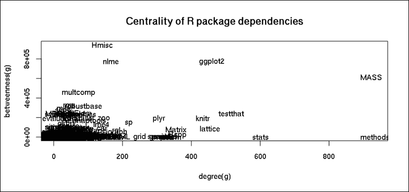
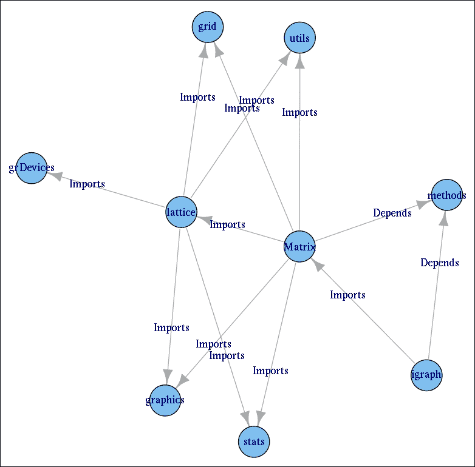
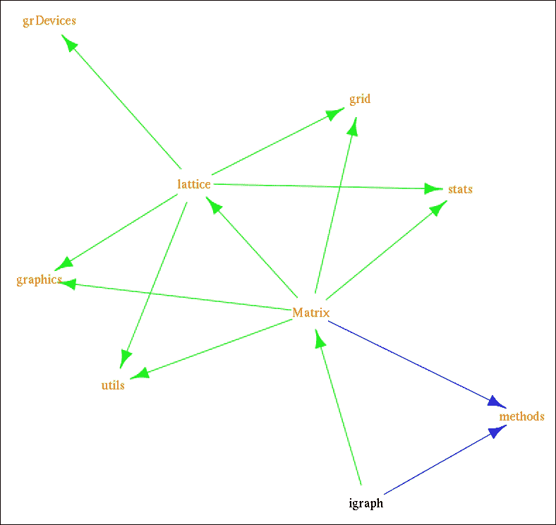
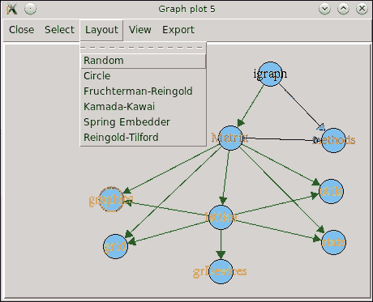
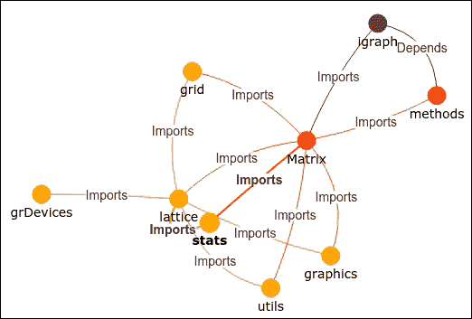
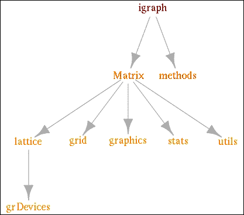
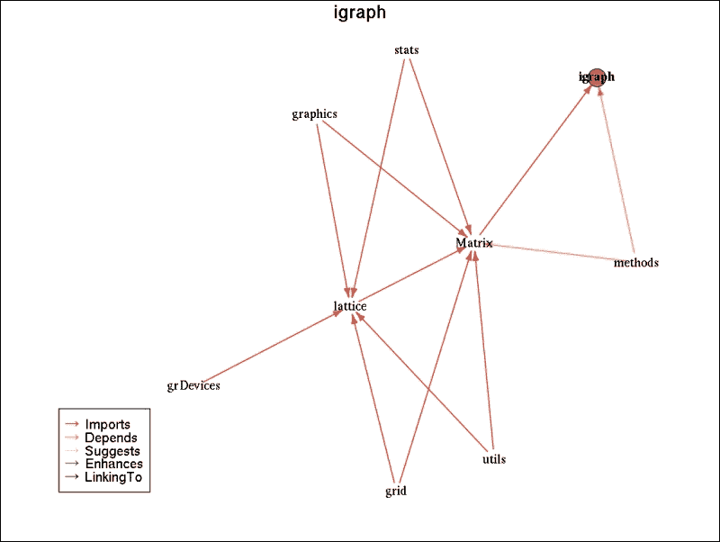

# 十一、R 生态系统的社会网络分析

虽然社交网络的概念有相当长的历史，但从上世纪初开始，**社交网络分析** ( **SNA** ) 只是在最近十年才变得极其流行，这可能是由于大型社交媒体网站的成功和相关数据的可用性。在这一章中，我们将看看如何检索和加载这样的数据，然后使用`igraph`包通过大量的来分析和可视化这样的网络。

`Igraph`是 Gábor Csárdi 制作的开源网络分析工具。该软件附带了多种网络分析方法，也可以在 R、C、C++和 Python 中使用。

在本章中，我们将通过一些关于 R 生态系统的示例来讨论以下主题:

*   加载和处理网络数据
*   网络中心性度量
*   可视化网络图

# 加载网络数据

在 R 生态系统上检索网络风味信息的最简单方法可能是分析 R 包如何相互依赖。基于[第 2 章](ch02.html "Chapter 2. Getting Data from the Web")，*获取数据*，我们可以尝试通过对 CRAN 镜像的 HTTP 解析来加载这些数据，但是幸运的是，R 有一个内置函数来返回 CRAN 中所有可用的 R 包以及一些有用的元信息:

### Tip

CRAN 上托管的包裹数量与日俱增。由于我们使用的是实时数据，您看到的实际结果可能会略有不同。

```

> library(tools)

> pkgs <- available.packages()

> str(pkgs)

 chr [1:6548, 1:17] "A3" "abc" "ABCanalysis" "abcdeFBA" ...

 - attr(*, "dimnames")=List of 2

 ..$ : chr [1:6548] "A3" "abc" "ABCanalysis" "abcdeFBA" ...

 ..$ : chr [1:17] "Package" "Version" "Priority" "Depends" ...

```

因此，我们有一个超过 6500 行的矩阵，第四列包括逗号分隔列表中的依赖项。与其解析这些字符串并从包版本和其他相对不重要的字符中清除数据，不如让我们使用工具包中的另一个方便的函数来完成这项脏工作:

```

> head(package.dependencies(pkgs), 2)

$A3

 [,1]      [,2] [,3] 

[1,] "R"       ">=" "2.15.0"

[2,] "xtable"  NA   NA 

[3,] "pbapply" NA   NA 

$abc

 [,1]       [,2] [,3] 

[1,] "R"        ">=" "2.10"

[2,] "nnet"     NA   NA 

[3,] "quantreg" NA   NA 

[4,] "MASS"     NA   NA 

[5,] "locfit"   NA   NA 

```

因此,`package.dependencies`函数返回一个长的命名矩阵列表:每个 R 包一个，其中包括安装和加载引用的包所需的包名和版本。此外，这个函数还可以通过`depLevel`参数检索其他人导入或建议的包列表。我们将使用这些信息来构建一个更丰富的数据集，在 R 包之间有不同类型的连接。

下面的脚本创建了`data.frame`，其中每一行代表两个 R 包之间的一个连接。`src`列显示哪个 R 包指的是`dep`包，标签描述的是连接类型:

```

> library(plyr)

> edges <- ldply(

+   c('Depends', 'Imports', 'Suggests'), function(depLevel) {

+     deps <- package.dependencies(pkgs, depLevel = depLevel)

+     ldply(names(deps), function(pkg)

+         if (!identical(deps[[pkg]], NA))

+             data.frame(

+                 src   = pkg,

+                 dep   = deps[[pkg]][, 1],

+                 label = depLevel,

+                 stringsAsFactors = FALSE))

+ })

```

虽然这个代码片段乍一看似乎很复杂，但我们只是查找每个包的依赖项(就像在一个循环中)，返回一行`data.frame`，并将其嵌套在另一个循环中，该循环遍历前面提到的所有 R 包连接类型。最终的 R 对象非常容易理解:

```

> str(edges)

'data.frame':  26960 obs. of  3 variables:

 $ src  : chr  "A3" "A3" "A3" "abc" ...

 $ dep  : chr  "R" "xtable" "pbapply" "R" ...

 $ label: chr  "Depends" "Depends" "Depends" "Depends" ...

```


# 网络的中心性度量

因此，我们已经确定了 6500 个包之间的近 30000 个关系。是稀疏网络还是密集网络？换句话说，在所有可能的包依赖关系中，我们有多少个连接？如果所有的包都依赖于其他的包呢？我们真的不需要任何功能丰富的软件包来计算:

```

> nrow(edges) / (nrow(pkgs) * (nrow(pkgs) - 1))

[1] 0.0006288816

```

这是一个相当低的百分比，与维护一个密集的 R 软件网络相比，这使得 R 系统管理员的生活相当容易。但是谁是这场游戏的核心玩家呢？最依赖的 R 包有哪些？

我们还可以计算一个相当简单的指标来回答这个问题，而不需要任何 SNA 知识，因为这可以定义为“在 edges 数据集的`dep`列中哪个 R 包被提到的次数最多”？或者，用简单的英语说:“哪个包有最多的反向依赖？”

```

> head(sort(table(edges$dep), decreasing = TRUE))

 R  methods     MASS    stats testthat  lattice 

 3702      933      915      601      513      447

```

似乎有将近 50%的软件包依赖于 r 的最小版本。为了不扭曲我们的有向网络，让我们去掉这些边:

```

> edges <- edges[edges$dep != 'R', ]

```

现在是时候将我们的连接列表转换成一个真正的图形对象，以计算更高级的指标，并可视化数据:

```

> library(igraph)

> g <- graph.data.frame(edges)

> summary(g)

IGRAPH DN-- 5811 23258 -- 

attr: name (v/c), label (e/c)

```

加载包后，`graph.data.frame`函数将各种数据源转换成一个`igraph`对象。这是一个非常有用的类，支持多种方法。摘要只是打印了顶点和边的数量，这表明大约 700 个 R 包没有依赖关系。让我们用`igraph`来计算前面讨论的和手工计算的指标:

```

> graph.density(g)

[1] 0.0006888828

> head(sort(degree(g), decreasing = TRUE))

 methods     MASS    stats testthat  ggplot2  lattice 

 933      923      601      516      459      454

```

看到即`methods`包在列表的顶部并不奇怪，因为在具有复杂的`S4`方法和类的包中经常需要它。`MASS` 和`stats`包包含了大多数常用的统计方法，但是其他的呢？ `lattice`和`ggplot2`包是非常智能和功能全面的图形引擎，而`testthat` 是 R；在向中央 CRAN 服务器提交新的软件包之前，必须在软件包说明中提到这一点。

但是`degree`只是社交网络可用的中心性指标之一。不幸的是，计算紧密度(显示每个节点与其他节点之间的距离)在涉及到依赖性时并没有真正的意义，但是`betweenness`与前面的结果相比是一个非常有趣的比较:

```

> head(sort(betweenness(g), decreasing = TRUE))

 Hmisc     nlme  ggplot2     MASS multcomp      rms 

943085.3 774245.2 769692.2 613696.9 453615.3 323629.8

```

此指标显示每个程序包在其他程序包之间的最短路径中充当桥(两个其他程序包之间的唯一连接节点)的次数。所以这不是有很多依赖包的问题；相反，它从一个更加全球化的角度展示了这些方案的重要性。试想一下，如果一个高`betweenness`的包被弃用并从 CRAN 中移除；不仅直接依赖的包，而且依赖树中的所有其他包都会处于相当尴尬的境地。


# 可视化网络数据

为了比较这两个指标，让我们画一个简单的散点图，通过`degree`和`betweenness`显示每个 R 包:

```

> plot(degree(g), betweenness(g), type = 'n',

+   main = 'Centrality of R package dependencies')

> text(degree(g), betweenness(g), labels = V(g)$name)

```



放松；我们很快就能在几分钟内创作出更加壮观、更有教育意义的情节！但是前面的图表明，有一些直接依赖数量相当少的包仍然对全局 R 生态系统有很大的影响。

在我们继续之前，让我们通过构建`igraph`包的依赖关系树来过滤我们的数据集和图形，以包括更少的顶点，包括依赖的或从其导入的所有包:

### Tip

以下是 2015 年 4 月生成的`igraph`依赖项的简短列表。从那以后，由于从`magrittr`和`NMF`包中导入，一个主要的新版本`igraph`已经发布，有了更多的依赖项，所以在您的计算机上重复下面的例子将返回一个更大的网络和图形。出于教育目的，我们在以下输出中显示了较小的网络。

```

> edges <- edges[edges$label != 'Suggests', ]

> deptree <- edges$dep[edges$src == 'igraph']

> while (!all(edges$dep[edges$src %in% deptree] %in% deptree))

+   deptree <- union(deptree, edges$dep[edges$src %in% deptree])

> deptree

[1] "methods"   "Matrix"    "graphics"  "grid"      "stats"

[6] "utils"     "lattice"   "grDevices"

```

所以我们需要前面提到的八个包才能使用`igraph`包。请注意，并非所有这些都是直接依赖关系；有些依赖于其他包。为了绘制这个依赖关系树的可视化表示，让我们创建相关的 graph 对象并绘制它:

```

> g <- graph.data.frame(edges[edges$src %in% c('igraph', deptree), ])

> plot(g)

```



嗯，`igraph`包实际上只依赖于一个包，尽管它也从`Matrix`包中导入了一些函数。前面提到的所有其他包都是后者的依赖项。

为了更直观地描述前面的图表，我们可以考虑去掉依赖标签，用颜色来表示这个方面，我们也可以用`vertex`的颜色来强调`igraph`的直接依赖。我们可以通过`V`和`E`函数修改顶点和边的属性:

```

> V(g)$label.color <- 'orange'

> V(g)$label.color[V(g)$name == 'igraph'] <- 'darkred'

> V(g)$label.color[V(g)$name %in%

+        edges$dep[edges$src == 'igraph']] <- 'orangered'

> E(g)$color <- c('blue', 'green')[factor(df$label)]

> plot(g, vertex.shape = 'none', edge.label = NA)

```



好多了！我们的中心主题， `igraph`包用深红色突出显示，的两个直接依赖项用深橙色标记，所有其他依赖项用浅橙色标记。类似地，与绝大多数其他导入连接相比，我们用蓝色强调了`Depends`关系。

## 互动网络剧情

如果您不喜欢前面图中顶点的顺序该怎么办？随意重新运行最后一个命令以产生新的结果，或者使用`tkplot`绘制动态图，在这里您可以通过拖放顶点来设计您的自定义布局:

```

> tkplot(g, edge.label = NA)

```



我们能做得更好吗？虽然这个结果非常有用，但它缺乏当前流行的、JavaScript 支持的交互情节的直接吸引力。所以让我们用 JavaScript 重新创建这个交互情节，就从 R！`htmlwidgets`和`visNetwork`包，在[第 13 章](ch13.html "Chapter 13. Data Around Us")、*我们身边的数据*中有更详细的讨论，可以帮助我们完成这个任务，即使没有任何 JavaScript 知识。只需将提取的节点和边数据集传递给`visNetwork`函数:

```

> library(visNetwork)

> nodes <- get.data.frame(g, 'vertices')

> names(nodes) <- c('id', 'color')

> edges <- get.data.frame(g)

> visNetwork(nodes, edges)

```



## 自定义绘图布局

或者，我们也可以通过绘制这个定向图的分母树，以编程方式生成这样的分层图:

```

> g <- dominator.tree(g, root = "igraph")$domtree

> plot(g, layout = layout.reingold.tilford(g, root = "igraph"), 

+   vertex.shape = 'none')

```



## 分析 R 包与 R 包的依赖关系

由于我们使用 R，一个统计的编程环境，其最令人兴奋和有用的特性是它的社区，我们可能更喜欢为这项研究寻找其他已经实现的解决方案。在谷歌上快速搜索，并在 StackOverflow 上查找一些问题或在[http://www.r-bloggers.com/](http://www.r-bloggers.com/)上发布，很容易找到 Revolution Analytics `miniCRAN`包，它有一些相关且有用的功能:

```

> library(miniCRAN)

> pkgs <- pkgAvail()

> pkgDep('igraph', availPkgs = pkgs, suggests = FALSE,

+   includeBasePkgs = TRUE)

[1] "igraph"    "methods"   "Matrix"    "graphics"  "grid"

[6] "stats"     "utils"     "lattice"   "grDevices"

> plot(makeDepGraph('igraph', pkgs, suggests = FALSE,

+   includeBasePkgs = TRUE))

```



不过还是回到原问题:我们如何分析网络数据？


# 进一步网络分析资源

除了令人印象深刻和有用的数据可视化，`igraph`包还提供了更多的东西。不幸的是，这短短的一章不能提供一个像样的网络分析理论的介绍，但我建议你浏览软件包文档，因为它附带有用的，不言自明的例子和良好的参考。

简而言之，网络分析提供了各种方法来计算中心性和密度度量，就像我们在本章开始时所做的那样，并且还提供了识别网桥和模拟网络变化的方法；也有非常强大的方法来分割网络中的节点。

例如，在我与人合著的《量化金融的 R 简介一书*的*金融网络*一章中，我们开发了 R 脚本，根据银行间拆借市场的交易级网络数据，识别匈牙利的**系统重要性金融机构** ( **SIFI** ) 。这个数据集和网络理论有助于我们对未来的金融危机进行建模和潜在预测，还可以模拟中央干预的效果。*

在芝加哥举行的 R/Finance 2015 大会[上，一份关于这项研究的更详细、可免费获得的摘要被提交给了 http://www . rin Finance . com/agenda/2015/talk/gergelydaroczi . pdf](http://www.rinfinance.com/agenda/2015/talk/GergelyDaroczi.pdf)，还有一个闪亮的应用[https://bit.ly/rfin2015-hunbanks](https://bit.ly/rfin2015-hunbanks)，一个相关的、基于模拟的感染模型也在*Mastering R for Quantitative Finance*一书的*系统风险*章节中进行了描述。

这项联合研究背后的主要思想是根据银行间借贷交易形成的网络来识别核心、外围和半外围金融机构。节点是银行，边被定义为这些银行之间的借贷事件，因此我们可以将外围节点之间的桥解释为较小银行之间的中间银行，这些银行通常不直接相互借贷。

在解决了数据集的一些技术问题后，有趣的问题是模拟如果中介银行违约会发生什么，以及这一不幸事件是否也会影响其他金融机构。


# 总结

这一简短的章节以图形数据集的形式介绍了一种新的数据结构，我们用各种 R 包可视化了小型网络，包括静态和交互式方法。在接下来的两章中，我们将熟悉另外两种常用的数据类型:首先我们将分析时态数据，然后是空间数据。