# 十三、我们身边的数据

空间数据，也称为地理空间数据，标识地理位置，如我们周围的自然或人工特征。虽然所有观测都有一些空间内容，如观测的位置，但由于空间信息的复杂性质，这超出了大多数数据分析工具的范围；或者，在给定的研究主题中，空间性可能不那么有趣(乍一看)。

另一方面，分析空间数据可以揭示数据的一些非常重要的底层结构，花时间可视化远近数据点之间的差异和相似性是非常值得的。

在本章中，我们将对此提供帮助，并将使用各种 R 包来:

*   从互联网检索地理空间信息
*   可视化地图上的点和多边形
*   计算一些空间统计数据

# 地理编码

正如在前面的章节中，我们将使用`hflights`数据集来演示如何处理承载空间信息的数据。为此，让我们汇总我们的数据集，就像我们在[第 12 章](ch12.html "Chapter 12. Analyzing Time-series")、*分析时间序列*中所做的那样，但是我们不生成每日数据，而是查看机场的汇总特征。出于性能考虑，我们将再次使用`data.table`包，如[第 3 章](ch03.html "Chapter 3. Filtering and Summarizing Data")、*过滤和汇总数据*和[第 4 章](ch04.html "Chapter 4. Restructuring Data")、*重组数据*中所介绍:

```r

> library(hflights)

> library(data.table)

> dt <- data.table(hflights)[, list(

+     N         = .N,

+     Cancelled = sum(Cancelled),

+     Distance  = Distance[1],

+     TimeVar   = sd(ActualElapsedTime, na.rm = TRUE),

+     ArrDelay  = mean(ArrDelay, na.rm = TRUE)) , by = Dest]

```

因此，我们已经加载了数据集`hfights`并立即将其转换为对象`data.table`。同时，我们按航班的目的地进行汇总计算:

*   行数
*   被取消的航班数量
*   距离
*   飞行时间的标准偏差
*   延迟的算术平均值

产生的 R 对象看起来像这样:

```r

> str(dt)

Classes 'data.table' and 'data.frame': 116 obs. of 6 variables:

 $ Dest     : chr  "DFW" "MIA" "SEA" "JFK" ...

 $ N        : int  6653 2463 2615 695 402 6823 4893 5022 6064 ...

 $ Cancelled: int  153 24 4 18 1 40 40 27 33 28 ...

 $ Distance : int  224 964 1874 1428 3904 305 191 140 1379 862 ...

 $ TimeVar  : num  10 12.4 16.5 19.2 15.3 ...

 $ ArrDelay : num  5.961 0.649 9.652 9.859 10.927 ...

 - attr(*, ".internal.selfref")=<externalptr>

```

所以我们在世界各地有 116 个观察值和五个变量来描述它们。虽然这似乎是一个空间数据集，但我们没有计算机本身可以理解的地理空间标识符，所以让我们通过 `ggmap`包从谷歌地图 API 获取这些机场的和*地理编码*。首先，让我们看看当我们寻找休斯顿的地理坐标时它是如何工作的:

```r

> library(ggmap)

> (h <- geocode('Houston, TX'))

Information from URL : http://maps.googleapis.com/maps/api/geocode/json?address=Houston,+TX&sensor=false

 lon      lat

1 -95.3698 29.76043

```

所以`geocode`函数可以返回我们发送给 Google 的字符串的匹配的纬度和经度。现在让我们对所有航班目的地做同样的事情:

```r

> dt[, c('lon', 'lat') := geocode(Dest)]

```

嗯，这花了一些时间，因为我们必须对谷歌地图 API 进行 116 次单独的查询。请注意，谷歌限制你每天在没有认证的情况下进行 2500 次查询，所以不要在大型数据集上运行。包里有一个 helper 函数，叫`geocodeQueryCheck`，可以用来查询当天的免费查询剩余次数。

我们计划在本章后面的一些章节中使用的一些方法和函数不支持`data.table`，所以让我们回到传统的`data.frame`格式并打印当前对象的结构:

```r

> str(setDF(dt))

'data.frame':  116 obs. of  8 variables:

 $ Dest     : chr  "DFW" "MIA" "SEA" "JFK" ...

 $ N        : int  6653 2463 2615 695 402 6823 4893 5022 6064 ...

 $ Cancelled: int  153 24 4 18 1 40 40 27 33 28 ...

 $ Distance : int  224 964 1874 1428 3904 305 191 140 1379 862 ...

 $ TimeVar  : num  10 12.4 16.5 19.2 15.3 ...

 $ ArrDelay : num  5.961 0.649 9.652 9.859 10.927 ...

 $ lon      : num  -97 136.5 -122.3 -73.8 -157.9 ...

 $ lat      : num  32.9 34.7 47.5 40.6 21.3 ...

```

这真是又快又简单，不是吗？现在我们有了所有机场的经度和纬度值，我们可以尝试在地图上显示这些点。


# 可视化空间点数据

第一次，让我们保持简单，加载一些打包的多边形作为底图。为此，我们将使用`maps`包。加载后，我们使用`map`函数渲染美利坚合众国的多边形，添加一个标题，然后为机场和休斯顿添加一些点，并稍加修改符号:

```r

> library(maps)

> map('state')

> title('Flight destinations from Houston,TX')

> points(h$lon, h$lat, col = 'blue', pch = 13)

> points(dt$lon, dt$lat, col = 'red', pch = 19)

```

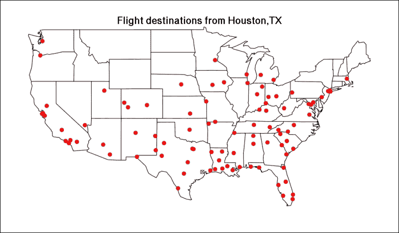

在地图上显示机场名称也很容易:我们可以使用 base `graphics`包中众所周知的函数。让我们将三个字符名称作为标签传递给文本函数，并稍微增加 *y* 值，以将之前的文本移动到之前呈现的数据点:

```r

> text(dt$lon, dt$lat + 1, labels = dt$Dest, cex = 0.7)

```

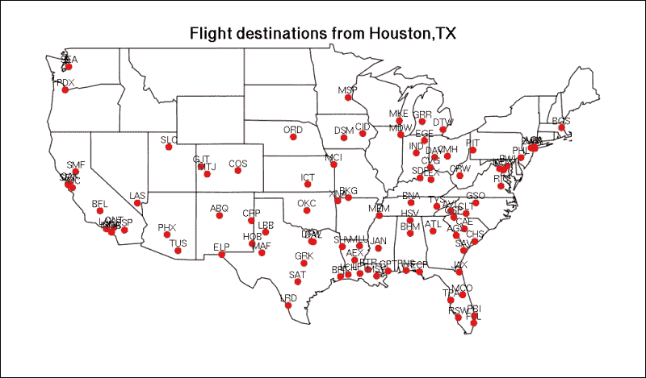

现在，我们还可以指定要渲染的点的颜色。此功能可用于绘制我们第一张有意义的地图，以突出显示 2011 年飞往美国不同地区的航班数量:

```r

> map('state')

> title('Frequent flight destinations from Houston,TX')

> points(h$lon, h$lat, col = 'blue', pch = 13)

> points(dt$lon, dt$lat, pch = 19,

+   col = rgb(1, 0, 0, dt$N / max(dt$N)))

> legend('bottomright', legend = round(quantile(dt$N)), pch = 19, 

+   col = rgb(1, 0, 0, quantile(dt$N) / max(dt$N)), box.col = NA)

```

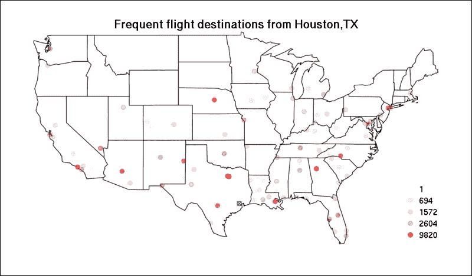

所以红色的强度表示到达给定点(机场)的航班数量；值的范围从 1 到大约 10，000。在州一级计算这些值可能更有意义，因为有许多机场，彼此距离很近，在更高的行政区域级别进行汇总可能更好。为此，我们加载州的多边形，将感兴趣的点(机场)与叠加的多边形(州)匹配，并将多边形渲染为专题地图，而不是点，就像我们在前面几页中所做的那样。


# 寻找点数据的多边形覆盖

我们已经有了识别每个机场的母州所需的所有数据。`dt`数据集包括位置的地理坐标，我们设法用`map`函数将状态渲染为多边形。实际上，后一个函数可以返回底层数据集，而无需绘制图形:

```r

> str(map_data <- map('state', plot = FALSE, fill = TRUE))

List of 4

 $ x    : num [1:15599] -87.5 -87.5 -87.5 -87.5 -87.6 ...

 $ y    : num [1:15599] 30.4 30.4 30.4 30.3 30.3 ...

 $ range: num [1:4] -124.7 -67 25.1 49.4

 $ names: chr [1:63] "alabama" "arizona" "arkansas" "california" ...

 - attr(*, "class")= chr "map"

```

因此，我们有大约 16，000 个点来描述美国各州的边界，但这个地图数据比我们实际需要的更详细(例如，参见以华盛顿开头的多边形的名称):

```r

> grep('^washington', map_data$names, value = TRUE)

[1] "washington:san juan island" "washington:lopez island"

[3] "washington:orcas island"    "washington:whidbey island"

[5] "washington:main"

```

简而言之，一个状态的个非连接部分被定义为个独立的多边形。为此，让我们保存一个不带冒号后的字符串的州名列表:

```r

> states <- sapply(strsplit(map_data$names, ':'), '[[', 1)

```

从现在开始，我们将使用这个列表作为聚合的基础。让我们将这个`map`数据集转换成另一个对象类，这样我们就可以使用`sp`包的强大特性。我们将使用和`maptools`包来完成这个转换:

```r

> library(maptools)

> us <- map2SpatialPolygons(map_data, IDs = states,

+    proj4string = CRS("+proj=longlat +datum=WGS84"))

```

### 注意

获取状态多边形的另一种方法可能是直接加载它们，而不是像前面描述的那样从其他数据格式进行转换。为此，你可能会发现`raster`包对通过`getData`功能从`gadm.org`下载免费地图**形状文件** 特别有用。虽然这些地图对于这样一个简单的任务来说太详细了，但是你总是可以简化它们——例如，用`rgeos`包的`gSimplify`功能。

所以我们刚刚创建了一个名为`us`的对象，它包含了给定 **投影**的每个状态的`map_data`多边形。这个物体可以像我们之前做的那样显示在地图上，尽管你应该使用一般的`plot`方法而不是`map`函数:

```r

> plot(us)

```

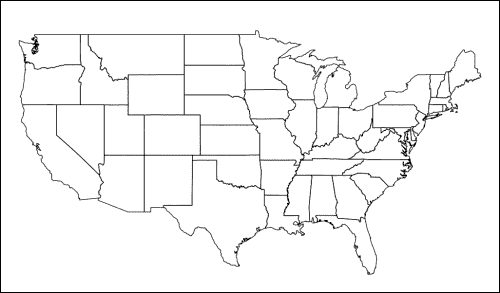

然而除此之外，`sp`包支持这么多强大的功能！以为例，通过`over`函数很容易识别出所提供点的叠加多边形。由于这个函数名与`grDevices`包中的名字冲突，最好用双冒号来引用函数和名称空间:

```r

> library(sp)

> dtp <- SpatialPointsDataFrame(dt[, c('lon', 'lat')], dt,

+   proj4string = CRS("+proj=longlat +datum=WGS84"))

> str(sp::over(us, dtp))

'data.frame':  49 obs. of  8 variables:

 $ Dest     : chr  "BHM" "PHX" "XNA" "LAX" ...

 $ N        : int  2736 5096 1172 6064 164 NA NA 2699 3085 7886 ...

 $ Cancelled: int  39 29 34 33 1 NA NA 35 11 141 ...

 $ Distance : int  562 1009 438 1379 926 NA NA 1208 787 689 ...

 $ TimeVar  : num  10.1 13.61 9.47 15.16 13.82 ...

 $ ArrDelay : num  8.696 2.166 6.896 8.321 -0.451 ...

 $ lon      : num  -86.8 -112.1 -94.3 -118.4 -107.9 ...

 $ lat      : num  33.6 33.4 36.3 33.9 38.5 ...

```

这里发生了什么？首先，我们将坐标和整个数据集传递给`SpatialPointsDataFrame`函数，该函数将我们的数据存储为具有给定经度和纬度值的空间点。接下来，我们调用`over`函数将`dtp`的值左连接到美国各州。

### 注意

识别给定机场状态的另一种方法是从 Google Maps API 请求更详细的信息。通过更改`geocode`函数的默认`output`参数，我们可以获得匹配的空间对象的所有地址成分，当然也包括状态。例如，请看下面的代码片段:

```r

geocode('LAX','all')$results[[1]]$address_components

```

基于此，您可能希望获得所有机场的类似输出，并根据州的简称过滤列表。`rlist`包在这个任务中非常有用，因为它提供了一些非常方便的方法来操作 r 中的列表。

这里唯一的问题是我们只匹配了一个机场到美国，这肯定不行。例如，参见前面输出中的第四列:它显示`LAX`是`California`的匹配机场(由`states[4]`返回)，尽管那里还有许多其他机场。

要克服这个问题，我们至少可以做两件事。首先，我们可以使用`over`函数的`returnList`参数返回`dtp`的所有匹配行，然后我们将对这些数据进行后处理:

```r

> str(sapply(sp::over(us, dtp, returnList = TRUE),

+   function(x) sum(x$Cancelled)))

 Named int [1:49] 51 44 34 97 23 0 0 35 66 149 ...

 - attr(*, "names")= chr [1:49] "alabama" "arizona" "arkansas" ...

```

所以我们创建并调用了一个匿名函数，该函数将在由`over`返回的列表的每个元素中`data.frame`的`Cancelled`值`sum`递增。

另一种可能更简洁的方法是重新定义`dtp`只包含相关的值，并将一个函数传递给`over`来进行汇总:

```r

> dtp <- SpatialPointsDataFrame(dt[, c('lon', 'lat')],

+    dt[, 'Cancelled', drop = FALSE],

+    proj4string = CRS("+proj=longlat +datum=WGS84"))

> str(cancels <- sp::over(us, dtp, fn = sum))

'data.frame':  49 obs. of  1 variable:

 $ Cancelled: int  51 44 34 97 23 NA NA 35 66 149 ...

```

无论哪种方式，我们都有一个向量可以合并回美国的州名:

```r

> val <- cancels$Cancelled[match(states, row.names(cancels))]

```

并将的所有缺失值更新为零(因为在没有任何机场的状态下取消的航班数不是缺失数据，但确实为零):

```r

> val[is.na(val)] <- 0

```


# 绘制专题地图

现在我们有了一切来创建我们的第一张*专题*地图。让我们将`val`向量传递给之前使用的`map`函数(或使用`us`对象的`plot`),指定一个绘图标题，为休斯顿添加一个蓝点，然后创建一个图例，显示被取消航班总数的分位数作为参考:

```r

> map("state", col = rgb(1, 0, 0, sqrt(val/max(val))), fill = TRUE)

> title('Number of cancelled flights from Houston to US states')

> points(h$lon, h$lat, col = 'blue', pch = 13)

> legend('bottomright', legend = round(quantile(val)),

+   fill = rgb(1, 0, 0, sqrt(quantile(val)/max(val))), box.col = NA)

```

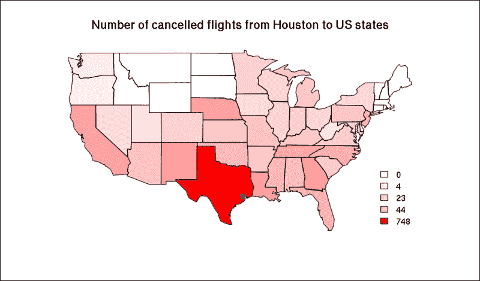

请注意，我们决定计算相对值的平方根来定义填充颜色的强度，而不是线性标度，这样我们可以直观地突出各状态之间的差异。这是必要的，因为大多数航班取消发生在德克萨斯州(`748`)，而在任何其他州取消的航班都不超过 150 个(平均约为 45 个)。

### 注意

你也可以很容易地将 ESRI 形状文件或其他地理空间矢量数据格式以点或多边形的形式加载到 R 中，包括一些已经讨论过的包和其他一些包，比如`maptools`、`rgdal`、`dismo`、`raster`或`shapefile`包。

另一种，可能是更简单的，生成国家级专题地图，尤其是 choropleth 地图的方式，是加载安迪·索斯制作的`rworldmap`包，依靠便捷的`mapCountryData`函数。


# 渲染点周围的多边形

除了专题地图，另一种真正有用的呈现空间数据的方式是根据数据值在数据点周围绘制人造多边形。如果没有可用于生成专题地图的多边形形状文件，这尤其有用。

水平图、等高线图或等值线图可能是旅游地图上已经熟悉的设计，其中山脉的高度由在完全相同的水平上围绕山的中心绘制的线来表示。这是一个非常聪明的方法，让地图呈现山的高度——将第三维投影到二维图像上。

现在让我们试着复制这个设计，把我们的数据点看作平面地图上的山脉。我们已经知道这些山丘(机场)几何中心的高度和精确地理坐标；这里唯一的挑战是画出这些物体的实际形状。换句话说:

*   这些*山*有联系吗？
*   *山坡*有多陡？
*   我们应该考虑数据中潜在的空间效应吗？换句话说，我们真的可以把这些渲染成 3D 形状的*山*而不是在空间中绘制独立的点吗？

如果最后一个问题的答案是肯定的，那么我们可以开始通过微调绘图参数来尝试回答其他问题。现在，让我们简单地假设在底层数据中存在空间效应，并且以这样的方式可视化数据是有意义的。稍后，我们将有机会通过分析生成的地块或通过构建一些地理空间模型来反驳或支持这种说法，其中一些将在稍后的*空间统计*部分中讨论。

## 等高线

首先，让我们用和`fields`包将我们的数据点扩展成一个矩阵。生成的 R 对象的大小是任意定义的，但是对于给定的行数和列数，256 是一个好的开始，为了生成更高分辨率的图像，行数和列数应该高得多:

```r

> library(fields)

> out <- as.image(dt$ArrDelay, x = dt[, c('lon', 'lat')],

+   nrow = 256, ncol = 256)

```

`as.image`函数生成一个特殊的 R 对象，简而言之，它包括一个类似三维矩阵的数据结构，其中 *x* 和 *y* 轴分别代表原始数据的经度和纬度范围。为了进一步简化，我们有一个 256 行和 256 列的矩阵，其中每一行都代表一个均匀分布在纬度和经度的最低值和最高值之间的离散值。在 *z* 轴上，我们有`ArrDelay`值，这在大多数情况下当然是缺失的:

```r

> table(is.na(out$z))

FALSE  TRUE 

 112 65424

```

这个矩阵长什么样？最好看看我们目前拥有的:

```r

> image(out)

```

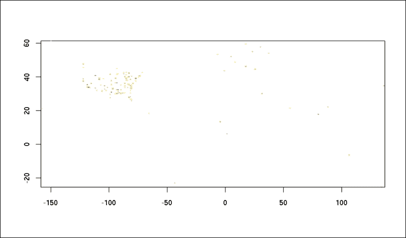

嗯，这个好像一点用都没有。那里放映什么？我们在这里用 *z* 颜色渲染了矩阵的 *x* 和 *y* 维度，由于 *z* 中大量的缺失值，这张地图的大部分图块都是空的。此外，现在非常简单，数据集也包括美国以外的许多机场。如果我们只关注美国，情况会怎样？

```r

> image(out, xlim = base::range(map_data$x, na.rm = TRUE),

+            ylim = base::range(map_data$y, na.rm = TRUE))

```

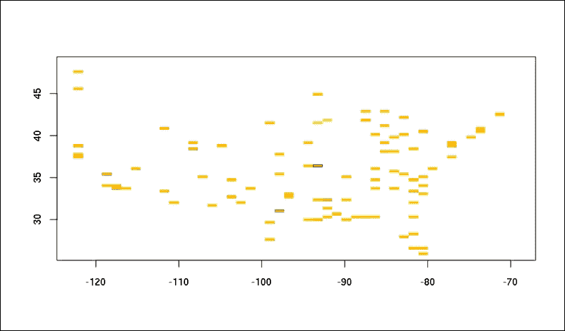

### 注意

另一种更好的方法是，在实际创建`out` R 对象之前，从数据库中删除非美国机场。尽管我们出于教学目的将继续使用这个示例，但对于真实数据，请确保您将注意力集中在数据的目标子集上，而不是试图平滑和模拟不相关的数据点。

好多了！我们已经有了数据点，现在让我们试着确定这些山峰的坡度，以便能够在未来的地图上呈现它们。这可以通过平滑矩阵来实现:

```r

> look <- image.smooth(out, theta = .5)

> table(is.na(look$z))

FALSE  TRUE 

14470 51066

```

从前面的表中可以看出，该算法成功地从矩阵中消除了许多缺失值。`image.smooth`函数基本上重用了相邻图块中的初始数据点值，并为冲突覆盖计算了某种平均值。这种平滑算法会产生以下任意地图，该地图不考虑任何政治或地理边界:

```r

> image(look)

```

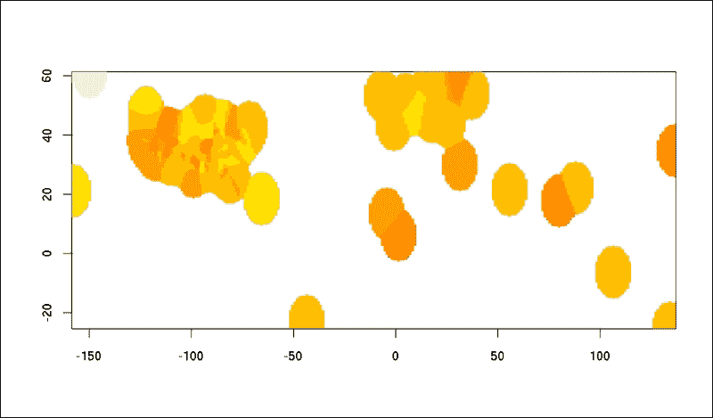

将这些人工多边形与行政边界一起绘制出来会非常好，所以让我们清除所有不属于美国领土的单元格。我们将使用 `sp`包中的`point.in.polygon`函数来实现:

```r

> usa_data <- map('usa', plot = FALSE, region = 'main')

> p <- expand.grid(look$x, look$y)

> library(sp)

> n <- which(point.in.polygon(p$Var1, p$Var2,

+  usa_data$x, usa_data$y) == 0)

> look$z[n] <- NA

```

简而言之，我们已经加载了没有任何子行政区域的美国主多边形，并验证了我们在`look`对象中的单元格，如果这些单元格与多边形重叠的话。如果没有，我们就简单地重置单元格的值。

下一步是渲染美国的边界，绘制我们的平滑等高线图，然后在美国各州和主要兴趣点机场的方式中添加一些视觉糖果:

```r

> map("usa")

> image(look, add = TRUE)

> map("state", lwd = 3, add = TRUE)

> title('Arrival delays of flights from Houston')

> points(dt$lon, dt$lat, pch = 19, cex = .5)

> points(h$lon, h$lat, pch = 13)

```

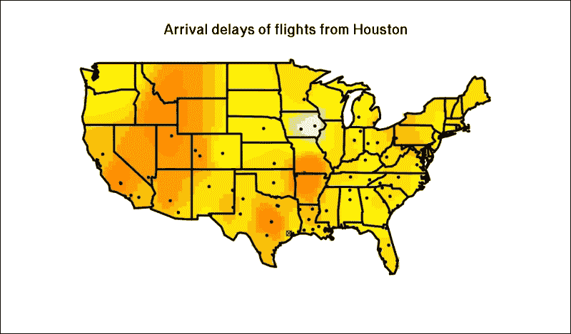

这很棒，不是吗？

## 芙诺以图

用多边形可视化点数据的另一种方法是在它们之间生成 T2 Voronoi 单元。简而言之，Voronoi 图通过将图的所有部分与一个区域对齐来将空间划分为数据点周围的区域，以最小化与中心数据点的距离。这很容易解释，也很容易用 r 实现。`deldir`包为 Delaunay 三角剖分提供了一个同名的函数:

```r

> library(deldir)

> map("usa")

> plot(deldir(dt$lon, dt$lat), wlines = "tess", lwd = 2,

+   pch = 19, col = c('red', 'darkgray'), add = TRUE)

```

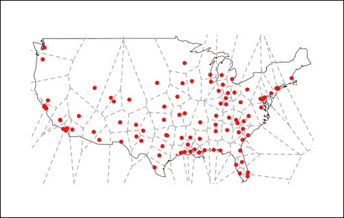

在这里，我们用红点表示机场，就像我们之前做的那样，但也添加了狄利克雷镶嵌(Voronoi 单元),呈现为深灰色虚线。有关如何微调结果的更多选项，请参见`plot.deldir`方法。

在下一节，让我们看看如何通过添加一个更详细的背景图来改善这个情节。


# 卫星地图

CRAN 上有许多 R 包可以从谷歌地图、Stamen、Bing 或 OpenStreetMap 获取数据——甚至我们之前在本章中使用的一些包，如 `ggmap`包，也可以做到这一点。类似地，`dismo`包也带有地理编码和谷歌地图 API 集成功能，还有一些其他包专注于后者，如的`RgoogleMaps`包。

现在我们将使用`OpenStreetMap`包，主要是因为它不仅支持令人敬畏的 OpenStreetMap 数据库后端，还支持许多其他格式。例如，我们可以通过 Stamen 渲染非常好的地形图:

```r

> library(OpenStreetMap)

> map <- openmap(c(max(map_data$y, na.rm = TRUE),

+                  min(map_data$x, na.rm = TRUE)),

+                c(min(map_data$y, na.rm = TRUE),

+                  max(map_data$x, na.rm = TRUE)),

+                type = 'stamen-terrain')

```

于是我们定义了我们需要的地图的左上角和右下角，还指定了地图样式为卫星地图。由于默认情况下数据来自带有墨卡托投影的远程服务器，我们首先必须将其转换为 WGS84(我们以前使用过)，这样我们就可以在获取的地图顶部渲染点和多边形:

```r

> map <- openproj(map,

+   projection = '+proj=longlat +ellps=WGS84 +datum=WGS84 +no_defs')

```

表演时间终于到了:

```r

> plot(map)

> plot(deldir(dt$lon, dt$lat), wlines = "tess", lwd = 2,

+   col = c('red', 'black'), pch = 19, cex = 0.5, add = TRUE)

```

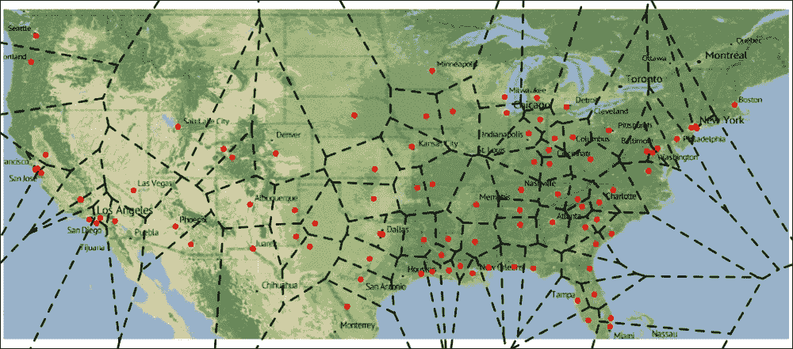

与我们之前创建的轮廓地图相比，似乎要好得多。现在你也可以尝试一些其他的地图风格，比如`mapquest-aerial`，或者一些非常好看的`cloudMade`设计。


# 互动地图

除了能够使用网络服务为 R 中创建的地图的背景下载地图块，我们还可以依赖其中的一些来生成真正交互式的地图。最著名的相关服务之一是 Google Visualization API，它提供了一个托管社区制作的可视化的平台；您还可以使用它来与他人共享您创建的地图。

## 查询谷歌地图

在 R 中，你可以通过由 Markus Gesmann 和 Diego de Castillo 编写和维护的`googleVis`包访问这个 API 。该包的大多数函数生成 HTML 和 JavaScript 代码，我们可以通过`base`绘图函数在 Web 浏览器中直接查看这些代码作为`SVG`对象；或者，我们可以将它们集成到网页中，例如通过 IFRAME HTML 标签。

`gvisIntensityMap`函数采用带有国家 ISO 或美国州代码的`data.frame`和实际数据来创建简单的亮度图。我们将使用我们在*寻找点数据的多边形叠加*部分创建的`cancels`数据集，但在此之前，我们必须做一些数据转换。让我们将州名作为一个新列添加到`data.frame`中，并用零替换丢失的值:

```r

> cancels$state <- rownames(cancels)

> cancels$Cancelled[is.na(cancels$Cancelled)] <- 0

```

现在是时候加载包并传递数据和一些额外的参数，表明我们想要生成一个州级的 US 地图:

```r

> library(googleVis)

> plot(gvisGeoChart(cancels, 'state', 'Cancelled',

+                   options = list(

+                       region      = 'US',

+                       displayMode = 'regions', 

+                       resolution  = 'provinces')))

```

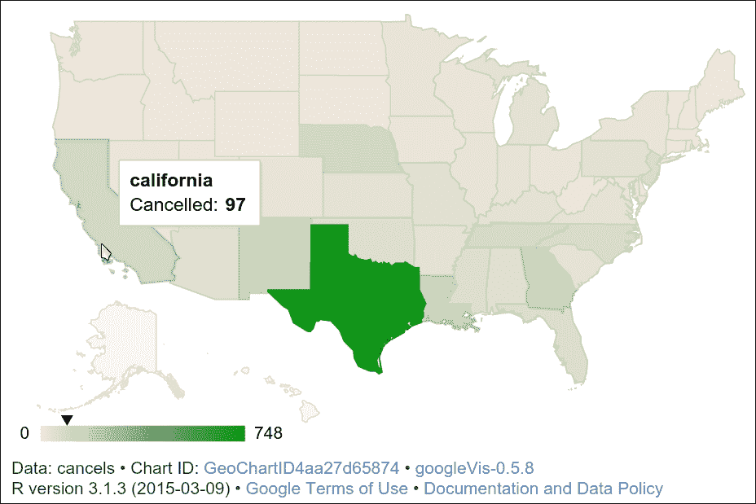

该软件包还提供了通过`gvisMap`函数查询谷歌地图 API 的机会。我们将使用此功能将来自`dt`数据集的机场渲染为 Google 地图上的点，并自动生成变量的工具提示。

但是首先，像往常一样，我们必须再次进行一些数据转换。`gvisMap`函数的 location 参数采用由冒号分隔的纬度和经度值:

```r

> dt$LatLong <- paste(dt$lat, dt$lon, sep = ':')

```

我们还必须生成工具提示作为一个新变量，这可以通过调用`apply`轻松完成。我们将用 HTML 换行符将变量名和实际值连接起来:

```r

> dt$tip <- apply(dt, 1, function(x)

+                  paste(names(dt), x, collapse = '<br/ >'))

```

现在我们将这些参数传递给一个即时交互式地图的函数:

```r

> plot(gvisMap(dt, 'LatLong', tipvar = 'tip'))

```

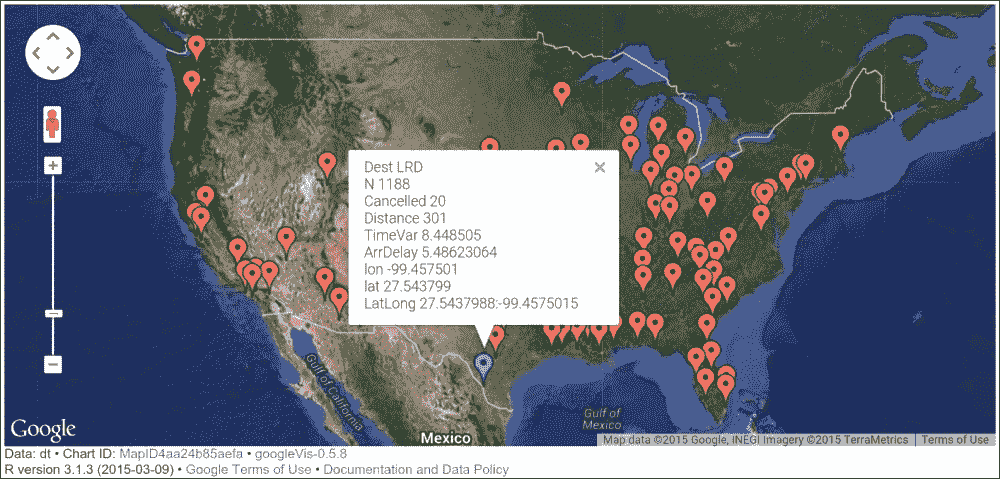

`googleVis`包的另一个漂亮的特性是，您可以通过使用`gvisMerge`函数轻松地将不同的可视化合并成一个。这个函数的使用非常简单:指定你想要合并的任意两个`gvis`对象，以及它们是水平放置还是垂直放置。

## JavaScript 映射库

趋势 JavaScript 数据可视化库的巨大成功部分归功于它们出色的设计。我怀疑其他因素也有助于这种工具的普遍传播:创建和部署成熟的数据模型非常容易，特别是自从 Mike Bostock 的 D3.js 发布并正在开发以来。

虽然也有许多真正有用和智能的 R 包可以直接与 D3 和 topojson 交互(例如参见我在 http://bit.ly/countRies[的 R 用户活动汇编](http://bit.ly/countRies))。现在我们将只关注如何使用 fleet——可能是交互式地图中使用最多的 JavaScript 库。

我真正喜欢的是 R 中有许多包装其他工具的包，因此 R 用户可以只依赖一种编程语言，我们可以轻松地使用 C++程序和 Hadoop MapReduce 作业或构建 JavaScript 驱动的仪表板，而无需实际了解底层技术。说到小叶，更是如此！

至少有两个非常好的包可以从 R 控制台生成传单情节，而不需要一行 JavaScript 代码。`rCharts`包的`Leaflet`引用类是由 Ramnath Vaidyanathan 开发的,包括一些创建新对象、设置视口和缩放级别、向地图添加一些点或多边形，然后将生成的 HTML 和 JavaScript 代码渲染或打印到控制台或文件的方法。

不幸的是，这个包还不在 CRAN 上，所以你必须从 GitHub 安装它:

```r

> devtools::install_github('ramnathv/rCharts')

```

举个简单的例子，让我们生成一个带有工具提示的机场传单地图，就像我们在上一节中对 Google Maps API 所做的那样。由于`setView`方法期望数字地理坐标作为地图的中心，我们将使用堪萨斯城的机场作为参考:

```r

> library(rCharts)

> map <- Leaflet$new()

> map$setView(as.numeric(dt[which(dt$Dest == 'MCI'),

+   c('lat', 'lon')]), zoom = 4)

> for (i in 1:nrow(dt))

+     map$marker(c(dt$lat[i], dt$lon[i]), bindPopup = dt$tip[i])

> map$show()

```

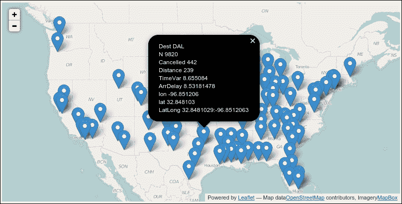

同样，RStudio 的`leaflet`包和更通用的`htmlwidgets`包也提供了一些简单的方法来生成 JavaScript 支持的数据可视化。让我们加载这个库，并使用`magrittr`包中的管道操作符逐个定义步骤，这对于所有由 RStudio 或 Hadley Wickham 创建或启发的包来说都是非常标准的:

```r

> library(leaflet)

> leaflet(us) %>%

+   addProviderTiles("Acetate.terrain") %>%

+   addPolygons() %>%

+   addMarkers(lng = dt$lon, lat = dt$lat, popup = dt$tip)

```

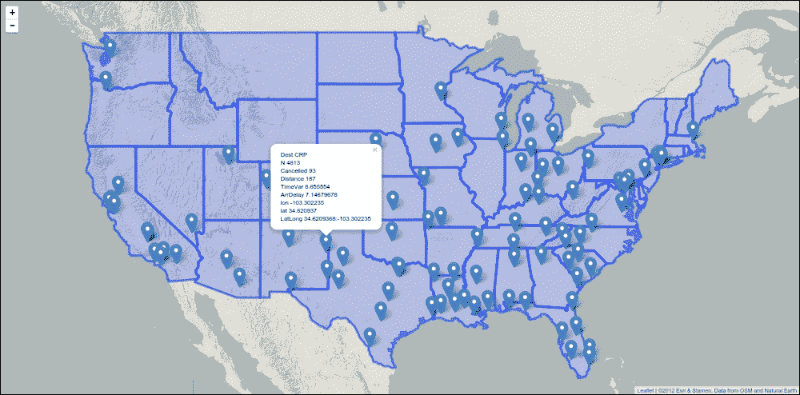

我特别喜欢这个前置地图，因为我们可以在后台加载第三方卫星地图，然后将各州渲染为多边形；我们还用一行 R 命令在同一张地图上添加了原始数据点和一些有用的工具提示。我们甚至可以根据我们在前面几节中计算的聚合结果来给状态多边形着色！有没有试过用 Java 做同样的事情？


# 备选地图设计

除了能够使用第三方工具，我倾向于使用 R 完成所有数据分析任务的另一个主要原因是 R 在创建定制数据探索、可视化和建模设计方面非常强大。

例如，让我们根据我们的数据创建一个流程图，其中我们将根据实际和取消的航班数量突出显示从休斯顿出发的航班。我们将使用线和圆在二维地图上呈现这两个变量，并且我们还将基于平均时间延迟在背景中添加等值线图。

但是，像往常一样，让我们先做一些数据转换！为了将流量保持在最低水平，让我们最终摆脱美国以外的机场:

```r

> dt <- dt[point.in.polygon(dt$lon, dt$lat,

+                           usa_data$x, usa_data$y) == 1, ]

```

我们将需要`diagram`包(渲染从休斯顿到目的地机场的弯曲箭头)和`scales`包来创建透明的颜色:

```r

> library(diagram)

> library(scales)

```

然后，让我们渲染在*等高线*部分描述的等高线图:

```r

> map("usa")

> title('Number of flights, cancellations and delays from Houston')

> image(look, add = TRUE)

> map("state", lwd = 3, add = TRUE)

```

然后添加一条从休斯顿到每个目的地机场的曲线，其中线的宽度代表取消航班的数量，目标圆的直径显示实际航班的数量:

```r

> for (i in 1:nrow(dt)) {

+   curvedarrow(

+     from       = rev(as.numeric(h)),

+     to         = as.numeric(dt[i, c('lon', 'lat')]),

+     arr.pos    = 1,

+     arr.type   = 'circle',

+     curve      = 0.1,

+     arr.col    = alpha('black', dt$N[i] / max(dt$N)),

+     arr.length = dt$N[i] / max(dt$N),

+     lwd        = dt$Cancelled[i] / max(dt$Cancelled) * 25,

+     lcol       = alpha('black',

+                    dt$Cancelled[i] / max(dt$Cancelled)))

+ }

```

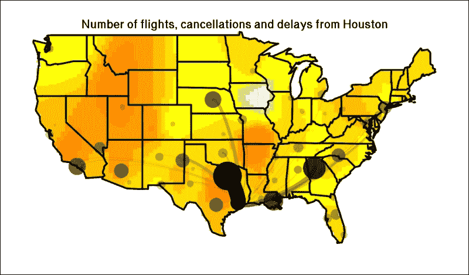

嗯，这一章最后是关于可视化空间数据，而不是通过拟合模型、过滤原始数据和寻找空间效果来分析空间数据。在本章的最后一节，让我们看看如何开始使用空间数据的分析方法。


# 空间统计

大多数处理空间数据的探索性数据分析项目都是从寻找和过滤空间自相关开始的。简单来说，这意味着我们在数据中寻找空间效应——例如，一些数据点的相似性可以(部分)由它们之间的短距离来解释；进一步的观点似乎有很大的不同。这种说法没有什么奇怪的；可能你们都同意这一点。但是我们如何用分析工具在真实数据上测试这一点呢？

*莫兰 I 指数*是一个众所周知的指标，通常用于测试感兴趣的变量中是否存在空间自相关。这是一个非常简单的统计测试，假设数据集中没有空间自相关。

利用我们现有的数据结构，计算 Moran 的 I 的最简单方法可能是加载 `ape`包，并将相似性矩阵和感兴趣的变量一起传递给`Moran.I`函数。首先，让我们通过欧几里德距离矩阵的逆矩阵来计算相似性矩阵:

```r

> dm <- dist(dt[, c('lon', 'lat')])

> dm <- as.matrix(dm)

> idm <- 1 / dm

> diag(idm) <- 0

> str(idm)

 num [1:88, 1:88] 0 0.0343 0.1355 0.2733 0.0467 ...

 - attr(*, "dimnames")=List of 2

 ..$ : chr [1:88] "1" "3" "6" "7" ...

 ..$ : chr [1:88] "1" "3" "6" "7" ...

```

然后，让我们替换`TimeVar`列中所有可能的缺失值(因为航班数也可以是 1，导致方差为零),让我们看看航班实际经过时间的方差中是否存在任何空间自相关:

```r

> dt$TimeVar[is.na(dt$TimeVar)] <- 0

> library(ape)

> Moran.I(dt$TimeVar, idm)

$observed

[1] 0.1895178

$expected

[1] -0.01149425

$sd

[1] 0.02689139

$p.value

[1] 7.727152e-14

```

这很容易，不是吗？基于返回的`P`值，我们可以拒绝零假设，并且`0.19` Moran 的 I 表明飞行时间的变化受目的地机场的位置影响，可能是由于距离非常不同。

作为前面提到的`sp`包的反向依赖,`spdep`包也可以计算这个索引，尽管我们必须首先将相似性矩阵转换成一个列表对象:

```r

> library(spdep)

> idml <- mat2listw(idm)

> moran.test(dt$TimeVar, idml)

 Moran's I test under randomisation

data:  dt$TimeVar 

weights: idml 

Moran I statistic standard deviate = 1.7157, p-value = 0.04311

alternative hypothesis: greater

sample estimates:

Moran I statistic       Expectation          Variance 

 0.108750656      -0.011494253       0.004911818

```

虽然测试结果类似于之前的运行，并且我们可以拒绝数据中零空间自相关的零假设，但是莫兰 I 指数和`P`值并不相同。这主要是因为`ape`包使用权重矩阵进行计算，而`moran.test`函数旨在用于多边形数据，因为它需要数据的邻居列表。因为我们的例子包括点数据，这不是一个简单的解决方案。这两种方法之间的另一个主要区别是`ape`包使用正态近似，而`spdep`实现随机化。但是这个差距还是太大了，不是吗？

阅读函数文档会发现我们可以改进`spdep`方法:当将`matrix`转换成`listw`对象时，我们可以指定原始矩阵的实际类型。在我们的例子中，由于我们使用的是逆距离矩阵，行标准化的样式似乎更合适:

```r

> idml <- mat2listw(idm, style = "W")

> moran.test(dt$TimeVar, idml)

 Moran's I test under randomisation

data:  dt$TimeVar 

weights: idml 

Moran I statistic standard deviate = 7.475, p-value = 3.861e-14

alternative hypothesis: greater

sample estimates:

Moran I statistic       Expectation          Variance 

 0.1895177587     -0.0114942529      0.0007231471

```

现在这个结果和`ape`结果之间的差异在可接受的范围内，对吗？

不幸的是，这一节不能涵盖相关的问题或其他处理空间数据的统计方法，但有许多真正有用的书籍致力于这一主题。请务必查看本书末尾的*附录*，以获得一些建议的标题。


# 总结

恭喜你，你刚刚完成了本书最后一个系统章节！在这里，我们主要关注如何使用数据可视化工具来分析空间数据。

现在让我们看看如何将前面几章学到的方法结合起来。在本书的最后部分，我们将使用各种数据科学工具来分析 R 社区。如果你喜欢这一章，我相信你也会喜欢最后一章。