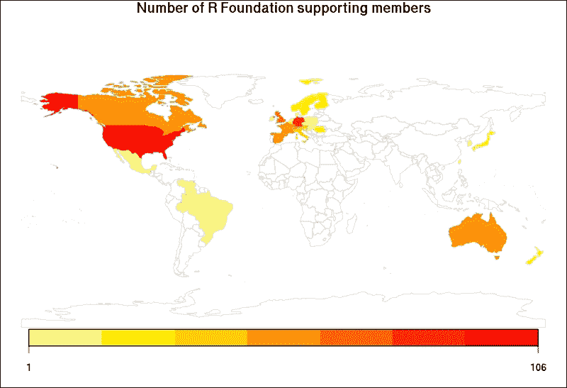
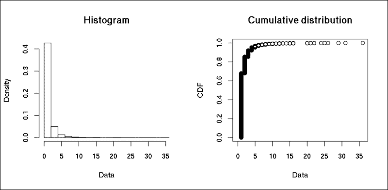
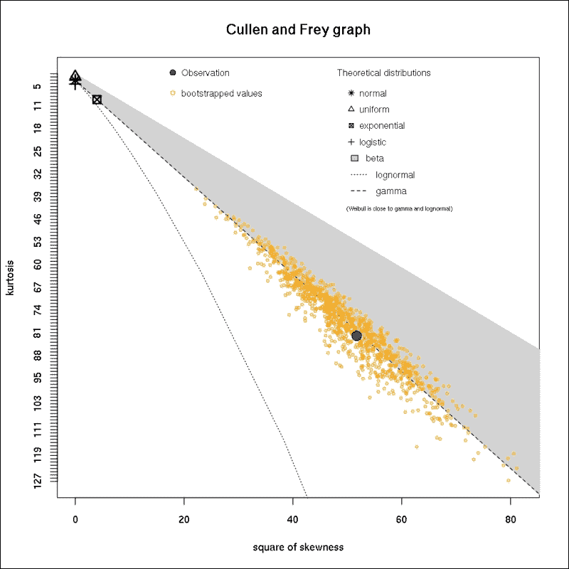
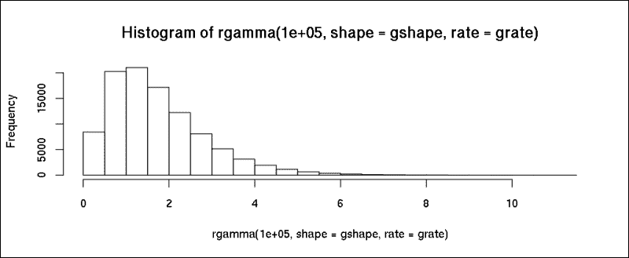
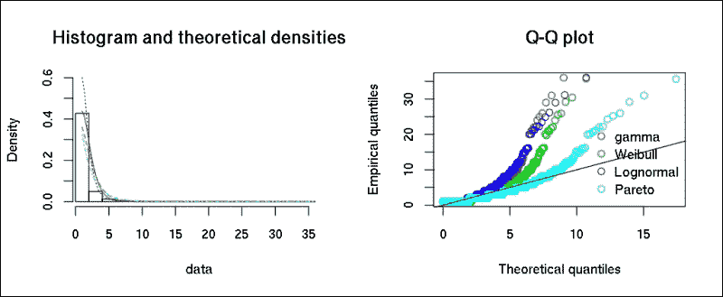
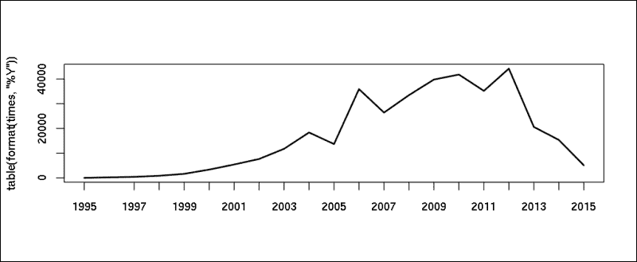
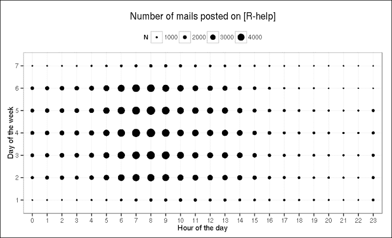
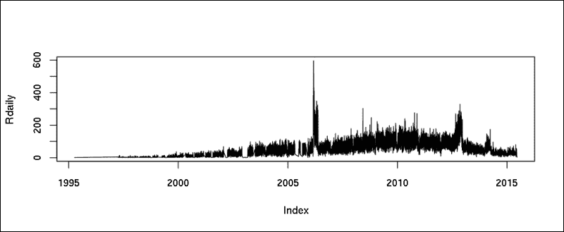
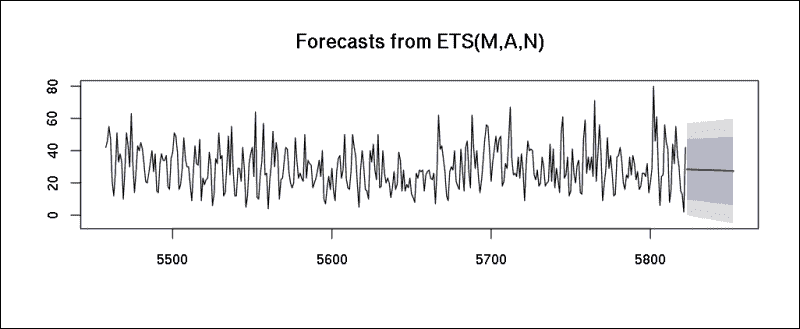

# 十四、分析 R 社区

在这最后一章，我将试着总结你在过去 13 章中学到的东西。为此，我们将创建一个实际的案例研究，独立于之前使用的`hflights`和`mtcars`数据集，现在将尝试估计 R 社区的规模。这是一个相当困难的任务，因为没有全世界 R 用户的名单；因此，我们将不得不在一些部分数据集上建立一些预测模型。

为此，我们将在本章中做以下工作:

*   从互联网上的不同数据源收集实时数据
*   清理数据并将其转换为标准格式
*   运行一些快速描述性的、探索性的分析方法
*   可视化提取的数据
*   基于一个独立的名字列表，对 R 个用户的数量建立一些对数线性模型

# R 基金会成员

我们能做的最简单的事情之一是计算 R 基金会的成员——协调核心 R 计划发展的组织。由于基金会的普通成员只包括*研发核心团队*，我们最好检查一下支持成员。任何人都可以通过支付象征性的年费成为该基金会的支持成员——顺便说一句，我强烈建议你这么做。这个列表可以在[http://r-project.org](http://r-project.org)站点上获得，我们将使用这个`XML`包(更多细节，请参见[第 2 章](ch02.html "Chapter 2. Getting Data from the Web")、*从 Web 获取数据*)来解析 HTML 页面:

```

> library(XML)

> page <- htmlParse('http://r-project.org/foundation/donors.html')

```

现在我们已经将 HTML 页面加载到 R 中，我们可以使用 XML Path 语言来提取基金会支持成员的列表，方法是读取`Supporting members`头之后的列表:

```

> list <- unlist(xpathApply(page,

+     "//h3[@id='supporting-members']/following-sibling::ul[1]/li", 

+     xmlValue))

> str(list)

 chr [1:279] "Klaus Abberger (Germany)" "Claudio Agostinelli (Italy)" 

```

形成这个包含 279 个名称和国家的字符向量，让我们分别提取支持成员和国家的列表:

```

> supporterlist <- sub(' \\([a-zA-Z ]*\\)$', '', list)

> countrylist   <- substr(list, nchar(supporterlist) + 3,

+                               nchar(list) - 1)

```

因此，我们首先通过删除字符串中从左括号开始的所有内容来提取姓名，然后通过根据姓名和原始字符串中的字符数计算出的字符位置来匹配国家。

除了 R 基金会的 279 名支持成员的名单之外，我们还知道成员的国籍或居住地的比例:

```

> tail(sort(prop.table(table(countrylist)) * 100), 5)

 Canada Switzerland          UK     Germany         USA 

 4.659498    5.017921    7.168459   15.770609   37.992832 

```

## 可视化世界各地的支持成员

也许这并不奇怪，大多数支持者来自美国，一些欧洲国家也在这个名单的顶端。让我们保存这个表，以便在一些快速数据转换之后，我们可以根据这个计数数据生成一个映射:

```

> countries <- as.data.frame(table(countrylist))

```

在[第十三章](ch13.html "Chapter 13. Data Around Us")、*身边的数据*中提到，`rworldmap`包可以非常轻松的渲染国家级地图；我们只需要用一些多边形来映射这些值。在这里，我们将使用`joinCountryData2Map`功能，首先启用`verbose`选项来查看遗漏了哪些国家名称:

```

> library(rworldmap)

> joinCountryData2Map(countries, joinCode = 'NAME',

+    nameJoinColumn = 'countrylist', verbose = TRUE)

32 codes from your data successfully matched countries in the map

4 codes from your data failed to match with a country code in the map

 failedCodes failedCountries

[1,] NA          "Brasil" 

[2,] NA          "CZ" 

[3,] NA          "Danmark" 

[4,] NA          "NL" 

213 codes from the map weren't represented in your data

```

因此，我们尝试匹配存储在国家数据框中的国家名称，但对于之前列出的四个字符串，我们失败了。虽然我们可以手动修复这个问题，但在大多数情况下，最好是尽可能自动化，所以让我们将所有失败的字符串传递给 Google Maps 地理编码 API，看看它会返回什么:

```

> library(ggmap)

> for (fix in c('Brasil', 'CZ', 'Danmark', 'NL')) {

+   countrylist[which(countrylist == fix)] <-

+       geocode(fix, output = 'more')$country

+ }

```

既然我们已经在谷歌地理编码服务的帮助下固定了国家名称，让我们重新生成频率表，并用 `rworldmap`包将这些值映射到多边形名称:

```

> countries <- as.data.frame(table(countrylist))

> countries <- joinCountryData2Map(countries, joinCode = 'NAME',

+   nameJoinColumn = 'countrylist')

36 codes from your data successfully matched countries in the map

0 codes from your data failed to match with a country code in the map

211 codes from the map weren't represented in your data

```

这些结果让人满意多了！现在我们有了与国家对应的 R 基金会支持成员的数量，所以我们可以很容易地绘制这些数据:

```

> mapCountryData(countries, 'Freq', catMethod = 'logFixedWidth',

+   mapTitle = 'Number of R Foundation supporting members')

```



很明显，R 基金会的大多数支持成员都在美国、欧洲、澳大利亚和新西兰(R 20 多年前出生在那里)。

但不幸的是，支持者的数量非常少，所以让我们看看我们可以找到和利用哪些其他数据源来估计全球 R 用户的数量。


# R 包维护者

另一个类似的直接数据源可能是 R 包维护者的列表。我们可以从 CRAN 的公共页面下载软件包维护者的姓名和电子邮件地址，这些数据存储在一个非常容易解析的结构良好的 HTML 表中:

```

> packages <- readHTMLTable(paste0('http://cran.r-project.org', 

+   '/web/checks/check_summary.html'), which = 2)

```

从`Maintainer`列中提取姓名可以通过一些快速的数据清理和转换来完成，主要使用正则表达式。请注意，列名以空格开头，这就是我们引用列名的原因:

```

> maintainers <- sub('(.*) <(.*)>', '\\1', packages$' Maintainer')

> maintainers <- gsub(' ', ' ', maintainers)

> str(maintainers)

 chr [1:6994] "Scott Fortmann-Roe" "Gaurav Sood" "Blum Michael" ...

```

这个几乎有 7000 个包维护者的列表包括一些重复的名字(他们维护多个包)。让我们来看看最多产的 R 包开发者的名单:

```

> tail(sort(table(maintainers)), 8)

 Paul Gilbert     Simon Urbanek Scott Chamberlain   Martin Maechler 

 22                22                24                25 

 ORPHANED       Kurt Hornik    Hadley Wickham Dirk Eddelbuettel 

 26                29                31                36 

```

虽然在前面的列表中有一个奇怪的名字(孤立包没有维护者——值得一提的是，在 6994 个包中只有 26 个不再被积极维护，这是一个很好的比例),但是其他名字在 R 社区中确实是众所周知的，并且在许多有用的包上工作。

## 每个维护者的包数

另一方面，列表中有更多的名字与一个或几个 R 包相关联。让我们加载 `fitdistrplus`包，而不是在简单的条形图或直方图上显示每个维护者的包数量，我们将在接下来的页面中使用它来拟合这个分析数据集的各种理论分布:

```

> N <- as.numeric(table(maintainers))

> library(fitdistrplus)

> plotdist(N)

```



前面的图还显示，列表中的大多数人只保留一个，但不超过两个或三个包。如果我们对该分布的长尾/重尾程度感兴趣，我们可能希望调用`descdist`函数，该函数返回关于经验分布的一些重要描述性统计数据，并绘制不同的理论分布如何在偏度-峰度图上拟合我们的数据:

```

> descdist(N, boot = 1e3)

summary statistics

------

min:  1   max:  36 

median:  1 

mean:  1.74327 

estimated sd:  1.963108 

estimated skewness:  7.191722 

estimated kurtosis:  82.0168 

```



我们的经验分布看起来相当长尾，峰度非常高，伽马分布似乎最适合这个数据集。让我们看看这个伽玛分布的估计参数:

```

> (gparams <- fitdist(N, 'gamma'))

Fitting of the distribution ' gamma ' by maximum likelihood 

Parameters:

 estimate Std. Error

shape 2.394869 0.05019383

rate  1.373693 0.03202067

```

我们可以使用这些参数来模拟更多具有`rgamma`功能的 R 包维护者。让我们看看在 CRAN 上有多少 R 包可用，例如，有 100，000 个包维护者:

```

> gshape <- gparams$estimate[['shape']]

> grate  <- gparams$estimate[['rate']]

> sum(rgamma(1e5, shape = gshape, rate = grate))

[1] 173655.3

> hist(rgamma(1e5, shape = gshape, rate = grate))

```



很明显，这种分布不像我们的真实数据集那样长尾:即使有 100，000 次模拟，最大数量也低于 10，正如我们在前面的图中看到的；然而实际上，R 包的维护者拥有多达 20 或 30 个包，效率要高得多。

让我们根据前面的伽玛分布，通过估计不超过两个包的 R 包维护者的比例来验证这一点:

```

> pgamma(2, shape = gshape, rate = grate)

[1] 0.6672011

```

但是这个百分比在真实数据集中要高得多:

```

> prop.table(table(N <= 2))

 FALSE      TRUE 

0.1458126 0.8541874 

```

这可能意味着尝试用来拟合一个长尾分布。例如，让我们看看帕累托分布如何符合我们的数据。为此，让我们遵循分析方法，将最低值用作分布的位置，并将值的数量除以所有这些值与该位置的对数差之和作为形状参数:

```

> ploc <- min(N)

> pshp <- length(N) / sum(log(N) - log(ploc))

```

遗憾的是，基础`stats`包中没有`ppareto`函数，我们只好先加载的`actuar`或 `VGAM`包来计算分布函数:

```

> library(actuar)

> ppareto(2, pshp, ploc)

[1] 0.9631973

```

嗯，现在这个甚至比真实比例还要高！看起来前面的理论分布没有一个完全符合我们的数据——顺便说一下，这很正常。但是，让我们看看这些分布如何在一个联合图上拟合我们的原始数据集:

```

> fg <- fitdist(N, 'gamma')

> fw <- fitdist(N, 'weibull')

> fl <- fitdist(N, 'lnorm')

> fp <- fitdist(N, 'pareto', start = list(shape = 1, scale = 1))

> par(mfrow = c(1, 2))

> denscomp(list(fg, fw, fl, fp), addlegend = FALSE)

> qqcomp(list(fg, fw, fl, fp),

+   legendtext = c('gamma', 'Weibull', 'Lognormal', 'Pareto')) 

```



毕竟，帕累托分布似乎是最符合我们的长尾数据的。但更重要的是，除了之前确定的 279 R 基金会支持成员之外，我们还知道超过 4，000 个 R 用户:

```

> length(unique(maintainers))

[1] 4012

```

我们可以使用哪些其他数据源来查找 R 个用户的信息？


# R-help 邮件列表

R-help 是官方的主要邮件列表，提供关于使用 R 的问题和解决方案的一般讨论，有许多活跃用户，每天有几十封电子邮件。幸运的是，这个公共邮件列表存档在几个站点上，我们可以很容易地从例如苏黎世联邦理工学院的 R-help 存档下载压缩的每月文件:

```

> library(RCurl)

> url <- getURL('https://stat.ethz.ch/pipermail/r-help/')

```

现在，让我们通过 XPath 查询从该页面提取每月压缩档案的 URL:

```

> R.help.toc <- htmlParse(url)

> R.help.archives <- unlist(xpathApply(R.help.toc,

+      "//table//td[3]/a", xmlAttrs), use.names = FALSE)

```

现在，让我们将这些文件下载到我们的计算机上，以便将来解析:

```

> dir.create('r-help')

> for (f in R.help.archives)

+     download.file(url = paste0(url, f),

+          file.path('help-r', f), method = 'curl'))

```

### 注意

根据您的操作系统和 R 版本，我们用来通过 HTTPS 协议下载文件的`curl`选项可能不可用。在这种情况下，您可以尝试其他方法或更新查询以使用`RCurl`、`curl`或`httr`包。

下载这大约 200 个文件需要一些时间，您可能还想在循环中添加一个`Sys.sleep`调用，以免服务器过载。总之，过一段时间后，您将在`r-help`文件夹中拥有一份`R-help`邮件列表的本地副本，准备好解析一些有趣的数据:

```

> lines <- system(paste0(

+     "zgrep -E '^From: .* at .*' ./help-r/*.txt.gz"),

+                 intern = TRUE)

> length(lines)

[1] 387218

> length(unique(lines))

[1] 110028

```

### 注意

我没有将所有文本文件加载到 R 中并在那里使用`grep`，而是通过 Linux 命令行`zgrep`实用程序对文件进行预过滤，该实用程序可以高效地搜索`gzipped`(压缩)文本文件。如果您没有安装`zgrep`(Windows 和 Mac 上都有)，您可以首先提取文件，然后使用标准的`grep`方法，使用完全相同的正则表达式。

所以我们过滤了电子邮件的所有行和标题，从`From`字符串开始，在电子邮件地址和名称中包含发件人的信息。在大约 387，000 封电子邮件中，我们发现了大约 110，000 个不同的电子邮件来源。为了理解下面的正则表达式，让我们看看其中一行是怎样的:

```

> lines[26]

[1] "./1997-April.txt.gz:From: pcm at ptd.net (Paul C. Murray)"

```

现在，让我们通过删除静态前缀并提取电子邮件地址后括号中的名称来处理这些行:

```

> lines    <- sub('.*From: ', '', lines)

> Rhelpers <- sub('.*\\((.*)\\)', '\\1', lines)

```

我们可以看到最活跃的海报列表:

```

> tail(sort(table(Rhelpers)), 6)

 jim holtman     Duncan Murdoch         Uwe Ligges 

 4284               6421               6455 

Gabor Grothendieck  Prof Brian Ripley    David Winsemius 

 8461               9287              10135

```

这个名单好像是合法的吧？虽然我的第一个猜测是布莱恩·里普利教授会带着他的简短信息出现在这个列表的第一位。由于之前的一些经验，我知道匹配姓名可能会很棘手和麻烦，所以让我们验证一下我们的数据是否足够干净，教授的姓名是否只有一个版本:

```

> grep('Brian( D)? Ripley', names(table(Rhelpers)), value = TRUE)

 [1] "Brian D Ripley"

 [2] "Brian D Ripley [mailto:ripley at stats.ox.ac.uk]"

 [3] "Brian Ripley"

 [4] "Brian Ripley <ripley at stats.ox.ac.uk>"

 [5] "Prof Brian D Ripley"

 [6] "Prof Brian D Ripley [mailto:ripley at stats.ox.ac.uk]"

 [7] "         Prof Brian D Ripley <ripley at stats.ox.ac.uk>"

 [8] "\"Prof Brian D Ripley\" <ripley at stats.ox.ac.uk>"

 [9] "Prof Brian D Ripley <ripley at stats.ox.ac.uk>"

[10] "Prof Brian Ripley"

[11] "Prof. Brian Ripley"

[12] "Prof Brian Ripley [mailto:ripley at stats.ox.ac.uk]"

[13] "Prof Brian Ripley [mailto:ripley at stats.ox.ac.uk] "

[14] "          \tProf Brian Ripley <ripley at stats.ox.ac.uk>"

[15] "  Prof Brian Ripley <ripley at stats.ox.ac.uk>"

[16] "\"Prof Brian Ripley\" <ripley at stats.ox.ac.uk>"

[17] "Prof Brian Ripley<ripley at stats.ox.ac.uk>"

[18] "Prof Brian Ripley <ripley at stats.ox.ac.uk>"

[19] "Prof Brian Ripley [ripley at stats.ox.ac.uk]"

[20] "Prof Brian Ripley <ripley at toucan.stats>"

[21] "Professor Brian Ripley"

[22] "r-help-bounces at r-project.org [mailto:r-help-bounces at r-project.org] On Behalf Of Prof Brian Ripley" 

[23] "r-help-bounces at stat.math.ethz.ch [mailto:r-help-bounces at stat.math.ethz.ch] On Behalf Of Prof Brian Ripley"

```

嗯，看起来教授也使用了一些替代的地址，所以对他的消息数量更有效的估计应该是这样的:

```

> sum(grepl('Brian( D)? Ripley', Rhelpers))

[1] 10816

```

因此，使用快速、常规的表达式从电子邮件中提取姓名会返回我们感兴趣的大部分信息，但似乎我们必须花费更多的时间来获得整个信息集。像往常一样，帕累托规则适用:我们可以花大约 80%的时间准备数据，我们可以在整个项目时间线的大约 20%内获得 80%的数据。

由于篇幅的限制，我们不会在这一点上更详细地讨论这个数据集的数据清理，但是我强烈建议查看 Mark van der Loo 的 `stringdist`包，它可以计算字符串距离和相似性，例如，在这种情况下合并相似的名称。

## R-help 邮件列表的容量

但是除了发件人之外，这些电子邮件还包括一些其他真正有趣的数据。例如，我们可以提取电子邮件发送的日期和时间，以模拟邮件列表的频率和时间模式。

为此，让我们过滤压缩文本文件中的一些其他行:

```

> lines <- system(paste0(

+     "zgrep -E '^Date: [A-Za-z]{3}, [0-9]{1,2} [A-Za-z]{3} ",

+     "[0-9]{4} [0-9]{2}:[0-9]{2}:[0-9]{2} [-+]{1}[0-9]{4}' ",

+     "./help-r/*.txt.gz"),

+                 intern = TRUE)

```

与之前提取的`From`行相比，这将返回更少的行:

```

> length(lines)

[1] 360817

```

这是由于电子邮件标题中使用了各种日期和时间格式，因为有时字符串中不包括星期几，或者与绝大多数其他邮件相比，年、月和日的顺序是错误的。无论如何，我们将只专注于标准日期和时间格式的邮件的这一重要部分，但是，如果您对转换这些其他时间格式感兴趣，您可能希望检查 Hadley Wickham 的 `lubridate`包来帮助您的工作流程。但是请注意，没有通用的算法来猜测十进制年、月、日的顺序——所以你将最终为进行一些手动数据清理！

让我们看看这些线(的子集)是什么样子的:

```

> head(sub('.*Date: ', '', lines[1]))

[1] "Tue, 1 Apr 1997 20:35:48 +1200 (NZST)"

```

然后我们可以简单地去掉前缀`Date`并通过`strptime`解析时间戳:

```

> times <- strptime(sub('.*Date: ', '', lines),

+            format = '%a, %d %b %Y %H:%M:%S %z')

```

既然数据是经过解析的格式(甚至连当地时区都转换成了 UTC)，就相对容易看到，例如，每年邮件列表上的电子邮件数量:

```

> plot(table(format(times, '%Y')), type = 'l')

```



### 注意

虽然在过去的几年中，`R-help`邮件列表上的数量似乎有所减少，但这并不是因为 R 活动减少:R 用户，不管是好是坏。如今，互联网上的其他人倾向于更多地使用其他信息渠道，而不是电子邮件——例如:StackOverflow 和 GitHub(甚至是脸书和 LinkedIn)。相关研究请见 http://web.cs.ucdavis.edu/~filkov/papers/r_so.pdf[的波格丹一世·瓦西里斯库的论文。](http://web.cs.ucdavis.edu/~filkov/papers/r_so.pdf)

我们可以做得更好，对吧？让我们稍微整理一下我们的数据，并通过一个更优雅的图表(灵感来自 GitHub 的打孔卡图)来可视化基于星期几和一天中的小时的邮件频率:

```

> library(data.table)

> Rhelp <- data.table(time = times)

> Rhelp[, H := hour(time)]

> Rhelp[, D := wday(time)]

```

用`ggplot`可视化这个数据集相对简单:

```

> library(ggplot2)

> ggplot(na.omit(Rhelp[, .N, by = .(H, D)]),

+      aes(x = factor(H), y = factor(D), size = N)) + geom_point() +

+      ylab('Day of the week') + xlab('Hour of the day') +

+      ggtitle('Number of mails posted on [R-help]') +

+      theme_bw() + theme('legend.position' = 'top')

```



由于《泰晤士报》采用的是 UTC 时间，清晨的邮件可能表明大多数`R-help`发帖人居住的地方有一个正的 GMT 时差——如果我们假设大多数邮件是在工作时间写的话。嗯，至少周末的电子邮件数量较少似乎表明了这一点。

看起来 UTC、UTC+1 和 UTC+2 时区确实很常见，但是对于`R-help`海报来说，美国时区也很常见:

```

> tail(sort(table(sub('.*([+-][0-9]{4}).*', '\\1', lines))), 22)

-1000 +0700 +0400 -0200 +0900 -0000 +0300 +1300 +1200 +1100 +0530 

 164   352   449  1713  1769  2585  2612  2917  2990  3156  3938 

-0300 +1000 +0800 -0600 +0000 -0800 +0200 -0500 -0400 +0100 -0700 

 4712  5081  5493 14351 28418 31661 42397 47552 50377 51390 55696

```

## 预测未来的电子邮件数量

我们还可以使用这个相对干净的数据集来预测`R-help`邮件列表的未来数量。为此，让我们每天汇总原始数据集来统计数据，正如我们在[第三章](ch03.html "Chapter 3. Filtering and Summarizing Data")、*过滤和汇总数据*中看到的:

```

> Rhelp[, date := as.Date(time)]

> Rdaily <- na.omit(Rhelp[, .N, by = date])

```

现在让我们将这个`data.table`对象转换成一个时间序列对象，引用实际的邮件数量作为值，引用日期作为索引:

```

> Rdaily <- zoo(Rdaily$N, Rdaily$date)

```

这个每日数据集比之前渲染的年度图表要尖锐得多:

```

> plot(Rdaily)

```



但是，与其像我们在[第 12 章](ch12.html "Chapter 12. Analyzing Time-series")、*分析时间序列*中所做的那样平滑或试图分解这个时间序列，不如让我们看看如何用一些自动模型对这个邮件列表中即将出现的邮件数量提供一些快速估计(基于历史数据)。为此，我们将使用中的`forecast`包:

```

> library(forecast)

> fit <- ets(Rdaily)

```

`ets`函数实现了一种全自动的方法，可以为给定的时间序列选择最佳趋势、季节和错误类型。然后我们可以简单地调用`predict`或`forecast`函数来查看指定的估计数，在这种情况下只查看第二天的估计数:

```

> predict(fit, 1)

 Point Forecast   Lo 80    Hi 80        Lo 95    Hi 95

5823       28.48337 9.85733 47.10942 -0.002702251 56.96945

```

因此，第二天，我们的模型估计大约有 28 封电子邮件，80%的置信区间在 10 到 47 之间。通过标准的`plot`函数和一些有用的新参数，可以用一些历史数据对稍长一段时间的预测进行可视化:

```

> plot(forecast(fit, 30), include = 365)

```



# 分析我们的 R 用户列表之间的重叠

但是我们最初的想法是预测全世界 R 用户的数量而不是关注一些小的细分市场，对吗？现在我们有了多个数据源，我们可以开始构建一些模型，结合这些数据来提供对全球 R 用户数量的估计。

这种方法背后的基本思想是捕获-再捕获方法，这在生态学中是众所周知的，其中我们首先试图确定从种群中捕获一个单位的概率，然后我们使用这个概率来估计未捕获单位的数量。

在我们当前的研究中，单位将是 R 用户，样本是之前在以下网站上获取的姓名列表:

*   基金会的支持者
*   向 *CRAN* 提交了至少一个包的 r 包维护者
*   *R-help* 邮件列表电子邮件发送者

让我们用引用数据源的标签合并这些列表:

```

> lists <- rbindlist(list(

+     data.frame(name = unique(supporterlist), list = 'supporter'),

+     data.frame(name = unique(maintainers),   list = 'maintainer'),

+     data.frame(name = unique(Rhelpers),      list = 'R-help')))

```

接下来，让我们看看我们可以在一组、两组或所有三组中找到的名字的数量:

```

> t <- table(lists$name, lists$list)

> table(rowSums(t))

 1     2     3 

44312   860    40

```

所以(至少)有 40 个人支持 R 基金会，在 CRAN 上维护至少一个 R 包，自 1997 年以来至少给`R-help`发过一封邮件！我很高兴也很自豪能成为这些人的一员——尤其是我的名字中有一个重音符号，这使得字符串匹配变得更加复杂。

现在，如果我们假设这些列表指的是相同的人群，即世界各地的 R 用户，那么我们可以使用这些常见事件来预测多少 R 用户以某种方式错过了支持 R 基金会，在 CRAN 上维护一个包，以及向 R-help 邮件列表写一封邮件。虽然这个假设显然是错误的，但是让我们运行这个快速实验，稍后再回到这些突出的问题。

R 中最好的事情之一是我们有一个几乎可以解决任何问题的包。让我们加载 `Rcapture`包，它为捕获-再捕获模型提供了一些复杂但易于使用的方法:

```

> library(Rcapture)

> descriptive(t)

Number of captured units: 45212 

Frequency statistics:

 fi     ui     vi     ni 

i = 1  44312    279    157    279

i = 2    860   3958   3194   4012

i = 3     40  40975  41861  41861

fi: number of units captured i times

ui: number of units captured for the first time on occasion i

vi: number of units captured for the last time on occasion i

ni: number of units captured on occasion i 

```

第一个`fi`列中的这些数字与上表中的数字相似，代表一个、两个或所有三个列表中确定的 R 个用户的数量。更有趣的是，用一个简单的调用来拟合这些数据的一些模型，例如:

```

> closedp(t)

Number of captured units: 45212 

Abundance estimations and model fits:

 abundance     stderr  deviance df       AIC       BIC

M0              750158.4    23800.7 73777.800  5 73835.630 73853.069

Mt              192022.2     5480.0   240.278  3   302.109   336.986

Mh Chao (LB)    806279.2    26954.8 73694.125  4 73753.956 73780.113

Mh Poisson2    2085896.4   214443.8 73694.125  4 73753.956 73780.113

Mh Darroch     5516992.8  1033404.9 73694.125  4 73753.956 73780.113

Mh Gamma3.5   14906552.8  4090049.0 73694.125  4 73753.956 73780.113

Mth Chao (LB)   205343.8     6190.1    30.598  2    94.429   138.025

Mth Poisson2   1086549.0   114592.9    30.598  2    94.429   138.025

Mth Darroch    6817027.3  1342273.7    30.598  2    94.429   138.025

Mth Gamma3.5  45168873.4 13055279.1    30.598  2    94.429   138.025

Mb                 -36.2        6.2   107.728  4   167.559   193.716

Mbh               -144.2       25.9    84.927  3   146.758   181.635

```

我不得不再次强调，这些估计实际上并不是对全球所有 R 用户数量的估计，因为:

*   我们的非独立名单涉及更具体的群体
*   模型假设不成立
*   R 社区肯定不是一个封闭的群体，一些开放群体模型会更可靠
*   如上所述，我们错过了一些非常重要的数据清理步骤

## 关于扩展捕获-再捕获模型的进一步想法

尽管这个有趣的例子并没有真正帮助我们找出世界上 R 用户的数量，但是通过一些扩展，这个基本思想是完全可行的。首先，我们可以考虑以更小的块来分析源数据——例如，在不同年份的 R-help 文档中寻找相同的电子邮件地址或名称。这可能有助于估计考虑向`R-help`提交问题，但实际上并没有发送电子邮件的人数(例如，因为另一个发帖人的问题已经得到回答，或者她/他在没有外部帮助的情况下解决了问题)。

另一方面，我们也可以向模型中添加一些其他的数据来源，这样我们就可以对那些没有向 R 基金会、CRAN 或 R-help 捐款的其他 R 用户进行更可靠的估计。

在过去的两年里，我一直在从事一项类似的研究，收集以下数据:

*   r 基金会普通会员和支持会员、捐赠者和捐助者
*   2004 年至 2015 年年度 R 会议的与会者
*   2013 年和 2014 年每个包和国家的 CRAN 下载量
*   r 用户组和成员人数会议
*   2013 年的[http://www.r-bloggers.com](http://www.r-bloggers.com)游客
*   GitHub 用户至少有一个包含 R 源代码的存储库
*   R 相关术语的谷歌搜索趋势

您可以在互动地图上找到结果，在[http://rapporter.net/custom/R-activity](http://rapporter.net/custom/R-activity)找到 CSV 文件中的国家级汇总数据，以及在过去两个*用户中呈现的离线数据可视化！[http://bit.ly/useRs2015](http://bit.ly/useRs2015)的*会议。


# 社交媒体中 R 用户的数量

尝试估计 R 用户数量的另一种方法是分析社交媒体上相关术语的出现。这在脸书上相对容易，营销 API 允许我们查询所谓的目标受众的规模，我们可以用它来定义一些付费广告的目标。

实际上，我们现在对在脸书制作付费广告并不感兴趣，虽然这可以通过的`fbRads`包轻松完成，但是我们可以使用这个特性来查看对 R:

```

> library(fbRads)

> fbad_init(FB account ID, FB API token)

> fbad_get_search(q = 'rstats', type = 'adinterest')

 id                       name audience_size path description

6003212345926 R (programming language)       1308280 NULL          NA

```

当然，要运行这个简单的例子，你需要有一个(免费的)脸书开发者账户，一个注册的应用程序，和一个生成的令牌(更多细节请参见软件包文档)，但是这绝对是值得的:我们刚刚发现全球有超过 130 万用户对 R 感兴趣！这确实令人印象深刻，尽管对我来说似乎相当高，尤其是与其他一些统计软件相比，例如:

```

> fbad_get_search(fbacc = fbacc, q = 'SPSS', type = 'adinterest')

 id      name audience_size path description

1 6004181236095      SPSS        203840 NULL          NA

2 6003262140109 SPSS Inc.          2300 NULL          NA

```

话虽如此，将 R 与其他编程语言进行比较表明，受众规模实际上可能是正确的:

```

> res <- fbad_get_search(fbacc = fbacc, q = 'programming language',

+                        type = 'adinterest')

> res <- res[order(res$audience_size, decreasing = TRUE), ]

> res[1:10, 1:3]

 id                          name audience_size

1  6003030200185          Programming language     295308880

71 6004131486306                           C++      27812820

72 6003017204650                           PHP      23407040

73 6003572165103               Lazy evaluation      18251070

74 6003568029103   Object-oriented programming      14817330

2  6002979703120   Ruby (programming language)      10346930

75 6003486129469                      Compiler      10101110

76 6003127967124                    JavaScript       9629170

3  6003437022731   Java (programming language)       8774720

4  6003682002118 Python (programming language)       7932670

```

全世界有很多程序员，好像！但是他们在谈论什么，什么是热门话题？我们将在下一节讨论这些问题。


# 社交媒体上与 R 相关的帖子

从过去几天的社交媒体中收集帖子的一个选择是处理 Twitter 的全球推文数据流。这种流数据和 API 提供了大约 1%的推文访问。如果你对所有这些数据感兴趣，那么就需要一个商业 Twitter Firehouse 帐户。在下面的例子中，我们将使用免费的 Twitter 搜索 API，它提供了基于任何搜索查询的不超过 3，200 条推文的访问——但这对于在 R 用户中快速分析热门话题来说绰绰有余。

因此，让我们加载 `twitteR`包，并通过提供我们的应用令牌和秘密(在[https://apps.twitter.com](https://apps.twitter.com)生成)来初始化到 API 的连接:

```

> library(twitteR)

> setup_twitter_oauth(...)

```

现在我们可以开始使用和`searchTwitter`功能来搜索任何关键词，包括标签和提及。这个查询可以通过几个参数进行微调。`Since`、`until`和 *n* 分别设置开始和结束日期，以及返回的 tweets 的数量。语言可以用 ISO 639-1 格式的`lang`属性来设置——例如，使用`en`表示英语。

让我们搜索带有官方 R 标签的最新推文:

```

> str(searchTwitter("#rstats", n = 1, resultType = 'recent'))

Reference class 'status' [package "twitteR"] with 17 fields

 $ text         : chr "7 #rstats talks in 2014"| __truncated__

 $ favorited    : logi FALSE

 $ favoriteCount: num 2

 $ replyToSN    : chr(0) 

 $ created      : POSIXct[1:1], format: "2015-07-21 19:31:23"

 $ truncated    : logi FALSE

 $ replyToSID   : chr(0) 

 $ id           : chr "623576019346280448"

 $ replyToUID   : chr(0) 

 $ statusSource : chr "Twitter Web Client"

 $ screenName   : chr "daroczig"

 $ retweetCount : num 2

 $ isRetweet    : logi FALSE

 $ retweeted    : logi FALSE

 $ longitude    : chr(0) 

 $ latitude     : chr(0) 

 $ urls         :'data.frame':	2 obs. of  5 variables:

 ..$ url         : chr [1:2] 

 "http://t.co/pStTeyBr2r" "https://t.co/5L4wyxtooQ"

 ..$ expanded_url: chr [1:2] "http://budapestbiforum.hu/2015/en/cfp" 

 "https://twitter.com/BudapestBI/status/623524708085067776"

 ..$ display_url : chr [1:2] "budapestbiforum.hu/2015/en/cfp" 

 "twitter.com/BudapestBI/sta…"

 ..$ start_index : num [1:2] 97 120

 ..$ stop_index  : num [1:2] 119 143

```

对于不超过 140 个字符的字符串来说，这是相当可观的信息量，不是吗？除了包含实际 tweet 的文本之外，我们还获得了一些元信息——例如，作者、发布时间、其他用户喜欢或转发帖子的次数、Twitter 客户端名称、帖子中的 URL 以及缩短、扩展和显示的格式。在某些情况下，如果用户启用了该功能，tweet 的位置也是可用的。

基于这条信息，我们可以用非常不同的方式关注 Twitter R 社区。例子包括:

*   算上提到 R 的用户
*   分析社交网络或推特互动
*   邮政时间的时间序列分析
*   推文位置的空间分析
*   推文内容的文本挖掘

这些(和其他)方法的混合可能是最好的方法，我强烈建议你这样做，作为练习你在本书中学到的东西。然而，在接下来的几页中，我们将只关注最后一项。

所以首先，我们需要一些最近关于 R 编程语言的 tweets。为了搜索`#rstats`文章，我们也可以使用`Rtweets`包装函数，而不是提供相关的 hashtag(就像我们之前做的那样):

```

> tweets <- Rtweets(n = 500)

```

这个函数返回了 500 个类似于我们之前看到的引用类。我们可以计算原始推文的数量，不包括转发:

```

> length(strip_retweets(tweets))

[1] 149

```

但是，由于我们正在寻找热门话题，我们对原始推文列表感兴趣，其中转发也很重要，因为它们赋予热门帖子自然的权重。因此，让我们将引用类的列表转换成一个`data.frame`:

```

> tweets <- twListToDF(tweets)

```

这个数据集由 500 行(tweets)和 16 个变量组成，涉及帖子的内容、作者和位置，如前所述。现在，由于我们只对推文的实际文本感兴趣，让我们加载`tm`包并导入我们的语料库，如[第 7 章](ch07.html "Chapter 7. Unstructured Data")、*非结构化数据*所示:

```

> library(tm)

Loading required package: NLP

> corpus <- Corpus(VectorSource(tweets$text))

```

由于数据是正确的格式，我们可以开始从常见的英语单词中清理数据，并将所有内容转换为小写格式；我们可能还想删除任何多余的空白:

```

> corpus <- tm_map(corpus, removeWords, stopwords("english"))

> corpus <- tm_map(corpus, content_transformer(tolower))

> corpus <- tm_map(corpus, removePunctuation)

> corpus <- tm_map(corpus, stripWhitespace)

```

移除 R 标签也是明智的，因为这是所有推文的一部分:

```

> corpus <- tm_map(corpus, removeWords, 'rstats')

```

然后我们可以使用和`wordcloud`包来绘制最重要的单词:

```

> library(wordcloud)

Loading required package: RColorBrewer

> wordcloud(corpus)

```


# 总结

在过去的几页中，我试图涵盖各种数据科学和 R 编程主题，尽管由于篇幅限制，许多重要的方法和问题没有得到解决。为此，我在这本书的*参考文献*章节中整理了一份简短的阅读清单。别忘了:现在轮到你练习你在前面章节中学到的所有东西了。我祝你在这次旅行中获得很多乐趣和成功！

再次感谢你阅读这本书；希望你觉得有用。如果您有任何问题、意见或任何类型的反馈，请随时与我们联系，我期待着您的回复！