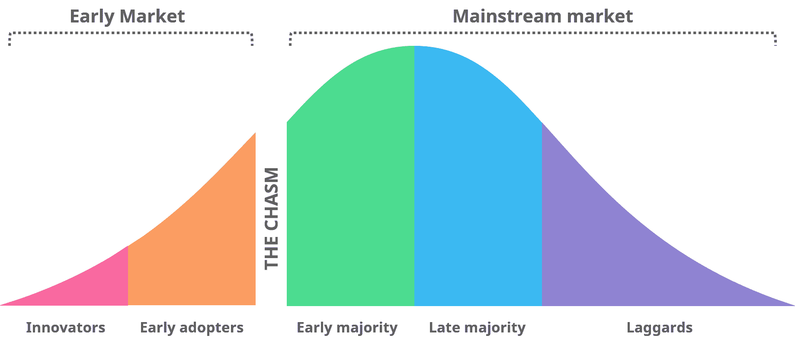
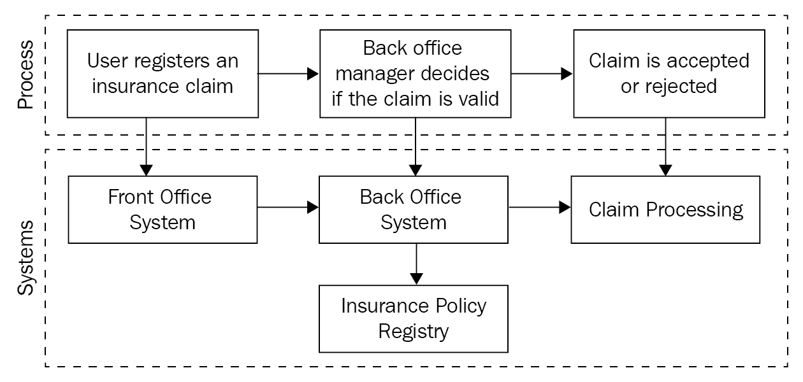

  

# 十、管理创新

在本书的*建立和维持团队*部分，我们探讨了如何创建一个能够交付数据科学解决方案的平衡团队。现在，我们将看看如何找到真正有价值的项目和问题。在本书的这一部分，我们将从更大的范围来看数据科学管理。我们正从团队领导转移到数据科学项目管理领域。我们将制定具体的战略和方法，以便我们能够发现、管理和交付对业务有价值的项目。

对于大多数公司来说，数据科学和机器学习属于创新领域。与软件开发不同，这些学科对于你的客户和商业利益相关者来说是未知的领域。如果您像对待任何其他项目一样对待数据科学项目，您将面临许多意想不到的问题。数据科学领域需要以不同的方式处理。当我们进入创新领域时，最好和好的定义发生了变化。

在本章中，我们将探索创新管理，并回答以下问题:

*   理解创新
*   为什么大组织经常失败？
*   探索创新管理
*   平衡销售、营销、团队领导和技术
*   管理大公司的创新
*   在初创公司中管理创新
*   寻找项目创意

  

# 理解创新

在我们讨论创新的失败之前，我们需要了解什么是创新。字典对创新的定义是，它是新的东西，或者是以不同的方式引入的东西；新事物或新方法的介绍。每一项创新都是暂时的。爱迪生的灯泡曾经是创新的，就像汽车一样。成功的创新像暴风雨一样侵入我们的日常生活，永远改变它们，然后变得平淡无奇。失败的创新会褪色并被遗忘。

如果我们看看历史，技术的创造并不能保证成功。汽车于 1886 年首次出现，但汽车只是在 27 年后才真正开始改变我们的生活，当时福特汽车公司于 1913 年建造了第一条移动装配线。如果用一个发明家的成功来定义创新，第一辆汽车的发明可能是一个巨大的突破。但是从商业角度来看，只有当一项创新创造了一个有稳定收入流的新市场，我们才能认为它是成功的。技术创新推动了该领域的发展，而商业创新创造了一些新的、以前无法获得的价值。这种价值有助于新市场的出现和新企业的崛起。

  

# 为什么大组织经常失败？

大公司通常将创新视为金矿。许多企业家认为，*你听说过这个新的人工智能初创公司吗？想象一下我们在这个领域能取得什么样的成就。与其他公司相比，我们的资源非常丰富。然而，历史证明并非如此，因为新兴创新技术往往诞生于小型初创企业，而非稳定的大型企业。这是违反直觉的。大公司有更多的资源、人员、时间和风险免疫力，而初创公司几乎没有。那为什么大公司在创新上失败了？*Clayton Christensen([https://www . Amazon . com/Innovators-Dilemma-revolution-Change-Business/DP/0062060244](https://www.amazon.com/Innovators-Dilemma-Revolutionary-Change-Business/dp/0062060244))的《创新者的困境*，以及杰弗里·摩尔([https://www . Amazon . com/Crossing-Chasm-3rd-Disruptive-Mainstream/DP/0062292986](https://www.amazon.com/Crossing-Chasm-3rd-Disruptive-Mainstream/dp/0062292986))的《跨越鸿沟*，讲述了一个有数据支撑的令人信服的故事。在开发的第一阶段，创新几乎不产生收入。在大公司，创新产品通常会与公司的最佳产品竞争。如果你从这个角度来看，创新在一家初创公司似乎是合法的，但与大公司现有的收入渠道不兼容。小公司努力获得收入，在发达市场与大公司竞争不是一个选择。小型初创企业没有足够的资源来提供市场需要的有竞争力的产品。因此，初创企业生存的自然方式是创新。

新技术是原始的、未经打磨的，因此它们对新市场似乎没有吸引力。克雷顿·克里斯滕森教授用小型硬盘驱动器作为例子。在大硬盘时代，大家都把它作为行业标准。较小的型号在理论上很有趣，但在实践中无法使用，因为在那个时候，硬件只支持较大的硬盘型号。更大的硬盘也有更大的容量、速度和可靠性。当个人电脑市场出现时，小型硬盘立即变得更有吸引力。功耗和尺寸是 PC 用户关心的参数。新的收入来源有助于小型硬盘的发展。一段时间后，小型号在容量、速度和可靠性方面超过了大型号。对老一代硬盘来说已经太晚了。五年前看似稳定的大公司被先进的新技术夺走了市场。

在大公司开始创新项目很容易，但完成它们很麻烦。从公司的中短期目标来看，创新似乎毫无意义，因为它们不会带来收入，而且需要大量投资。然而，给大型组织带来创新并非不可能。在本章的后面，我们将探讨如何将想法发展到小型和大型组织的业务中。

  

# 市场游戏

数据科学仍然是一个具有巨大潜力的年轻领域。许多专家表示，即使我们暂停新的研究，如果我们整合过去 10 年出现的新技术，我们仍将领先 20 至 30 年。然而，研究项目和广泛适用的技术之间存在很大差距。像硬盘驱动器一样，一个研究项目需要增加它的功能，以便超越目前的竞争对手。

数据科学使用机器学习、深度学习和统计方面的研究来交付解决现实世界问题的软件产品。为了变得可用和广泛适用，软件需要大量的时间投资。软件工程师、数据科学家和其他技术专家的时间是要花钱的。要想从你的软件中赚钱，你需要解决人们的问题。你的产品需要给人们带来有价值的东西。当这个价值大到足以维持一个恒定的需求时，你就创造了一个新的市场。这个市场是由供求法则决定的:人们和公司会用金钱来交换你的产品和服务。

在初创时期，大型机构创建了自己的市场，或者参与了现有的市场。市场会像我们一样老化和死亡，给新的市场提供生存的空间。如果一个垂死市场中的公司不转型到一个新兴市场，它们将不复存在。

  

# 创造新市场

创造新市场既复杂又有风险。如果你花太长时间，用太多资源来测试你的想法，你就会失败。风险很高，所以测试想法应该快速简单。这种测试允许你将错误转化为知识，一次又一次地改进你的产品。快速失败和通过测试想法不断学习是精益创业方法背后的关键点。公式很简单:探索尽可能多的想法，反复调整你的产品以适应市场，增加对你的服务的需求。这个过程的关键特征是速度。

大公司很少快速运作。公司规模越大，运营周期越长，组织流程越重。没有这些重要的工具，公司可能无法运营。尽管如此，创新不能容忍长周期。失败的成本随着实验时间的延长而增加，这使得创新对于大企业来说极其昂贵。

对于组织来说，数据科学仍然是一项创新，大多数利基市场尚未开发或发现。虽然创新很难，但并非不可能。在本章接下来的章节中，我们将探讨如何通过在大型和小型公司中使用创新管理来控制新技术。

  

# 探索创新管理

创新在本质上是非常混乱的。创新者呼吁实验，但他们无法预测最终结果，并努力确定最后期限。创新的这些品质使得它们很难在商业环境中实现，在商业环境中，明确定义的目标、严格的期限和有限的预算是常态。创新管理提供了一套将混乱的创新领域变得有序的技术。管理这个词与直接控制联系在一起，但对于创新来说却不是这样。自由对每一项创新都至关重要。试图微观管理不会得到任何积极的结果。创新管理是关于提供支持和将创新整合到现有业务中，以便它们提供有益的结果。

为了理解创新管理背后的主要思想，我们应该理解不同类型的创新，即持续创新和破坏性创新:

*   颠覆性创新是大多数人对创新一词的理解。这种类型的创新给市场带来了巨大的变化。它引入了一些新的技术成熟的东西，足以创造一个新的市场。iPod、iPhone、IBM PC 和电灯泡都是颠覆性的创新。
*   **持续创新**感受更多**有机**和**增量**。你最喜欢的操作系统的新版本，社交网络的用户界面变化，以及 iPhone 的升级都是持续的创新。持续创新的目标是通过引入新功能来跟上竞争对手，阻止您的客户购买竞争对手公司更具吸引力的产品。

每次持续创新都会略微扩大竞争对手之间的差距，而颠覆性创新会改变我们的生活和工作方式，从而创造新市场，淘汰旧市场。从外行观察者的角度来看，颠覆性创新可能会突然出现，但实际上，它们并不是灵光一现。*创新者的困境*包含许多在小市场中成长的颠覆性创新的例子，在这些小市场中，创新产品的特性对非常具体的用例更有吸引力。稳定的收入来源使创新技术能够发挥其潜力，而提供老一代产品的公司看不到市场上的直接竞争。当新产品扰乱市场时，已经为时已晚。

数据科学不是破坏性的，它本身也不能维持创新。这是一套工具，我们可以用来创造这两种创新。特别是，自动驾驶汽车是颠覆性技术的良好候选，而更准确的推荐引擎属于创新管理的持续创新方面。

就风险而言，创造颠覆性创新是一项危险的长期投资，而创造持续创新在任何成功的企业中都应该是一个稳定且经过充分研究的过程。

我们可以通过以下生命周期来查看这两种类型:

1.  **搜索**:在这个阶段，公司搜索一个想法进行实验。
2.  **建造**:在这里，公司建造原型，进行实验，测量结果。
3.  规模:在这个阶段，构建阶段给了我们一个有希望的工作方向，所以公司向外扩展。原型转化为市场现成的产品，并开始产生收入。

4.  **扩张**:每一项创新都饱和了它的市场。在这个阶段，公司将产品扩展到新的市场，以保持增长率不变。
5.  **维持**:在这个阶段，创新变成了稳定的业务。有些公司在维持阶段可以生存几十年。然而，这也伴随着风险。你目前在市场上的位置不是一个不可减少的固定收入来源。它可以在没有长期投资的情况下迅速饱和。每一分钟的不作为都为你的竞争对手创造了新的机会，让他们创造出颠覆性的创新，从而把你赶出这个行业。维持阶段是一个标志，表明公司需要恢复**Searc**h 阶段。

每个颠覆性创新的另一个重要方面是鸿沟。在*跨越鸿沟*中，杰弗里·摩尔展示了著名的市场采用曲线:

新技术可以在早期市场迅速找到一个看似稳定的收入来源，这个市场由愿意为有风险、未经测试、试验性但有前景的解决方案付费的公司组成。很多机构认为从早期市场到主流市场的过渡会很顺利；早期市场将产生足够的收入，以便它可以创建对主流市场有价值的新功能。然而，实际情况并非如此。早期市场和主流市场之间的差距比看起来要大得多。当早期市场饱和时，公司进入缺口。对于主流市场来说，它的产品还不够成熟和完善，因为消费者习惯于功能丰富和稳定的产品。因此，该公司被迫忍受收入流减少，而其产品需要大量投资，以便能够创造出主流市场所要求的功能。

为了找到摆脱这一鸿沟的方法，该公司必须将其努力集中在一个非常具体的应用领域，在这个领域中，其产品的最佳特性比其当前的缺陷更重要。目标是找到一个微小但可靠的利基，并专注于完善它。这创造了一个小市场，允许您通过成功故事、功能、客户推荐和新的收入流来发展势头。在小市场的持续成功会给你必要的资源和时间，这样你就可以扩展到更成熟的市场。

在下一节中，我们将看一个名为 MedVision 的虚构公司的案例研究。

  

# 案例研究——跟随 MedVision 的创新周期

作为一个例子，我们将看看 med vision——一个虚构的人工智能初创公司，它将计算机视觉技术引入医疗设备和医院。在他们的搜索阶段，他们进行了关于医学中深度学习应用的应用研究。

MedVision 专家还进行了市场研究，并确定了以下四个潜在的想法:

*   使用 X 射线图像检测肺癌。
*   分析来自可穿戴设备的数据，以检测心脏病发作和其他危险的健康状况。
*   利用患者的病史创建诊断助手，帮助治疗师在考虑患者数据的同时对疾病进行识别和分类。
*   分析瞳孔运动、脑电图扫描和大脑扫描，以识别和分类精神疾病。

所有这些想法从商业角度来看都很有前景，并且有明确的市场基础，即希望提供/获得更准确和更便宜的医疗诊断的医生和患者。

在构建阶段，MedVision 团队创建了几个原型，并向潜在买家展示。他们也加深了自己的知识，研究了每一个想法的领域。构建阶段发现了团队在搜索阶段无法发现的意外问题，如下所示:

*   癌症检测受到数据质量差的影响。许多数据集包含需要手动清理的有偏差的图像。在原型阶段，MedVision 模型在维持测试集上获得了 0.97 F1 分类分数，但在新获得的数据上测试失败。MedVision 用于模型训练的数据集包含偏见:带有癌症发病率的 X 射线图像是使用扫描仪制作的，扫描仪会在扫描上留下标记。这些模型学会了用最简单的策略对癌症进行分类:识别标记。这导致了较大的模型偏差。另一个偏差来源隐藏在时间戳中，这在所有的 X 射线中都存在。结果发现，由于医院的排班政策，癌症患者更有可能在周二和周五接受扫描。MedVision 团队现在准备在为真实客户解决癌症分类问题时处理这些问题。该团队认为偏见的问题是可以解决的，不应该成为这个想法的障碍。
*   来自可穿戴设备的数据已经被证明是心脏病发作和跌倒受伤的一个很好的预测器。不管怎样，数据可用性存在很大问题。在 MedVision 的网络中，只有十分之一的医院报告他们拥有可穿戴设备数据，只有两家医院计划在未来 5 年内为患者提供可穿戴设备。由于可穿戴设备在医疗领域的不良采用，MedVision 决定将这一想法从列表中删除。
*   由于数据收集的困难，利用患者的病史来诊断疾病被证明是一项非常具有挑战性的任务。研究三家医院的数据显示，30%的患者病历是纯纸质的。表格是标准化的，但大部分是手工填写的。为了测试他们的想法，MedVision 的团队需要建立一些可靠的手写识别技术，然后对大量的文本信息进行结构化和纠错。这个过程需要大量的时间投入和另外两名手写识别和自然语言处理方面的专家。在数据研究过程中出现了一家大公司在这个方向工作失败的新闻。MedVision 已决定不再在这一方向进行进一步投资。他们一致认为风险太高，无法继续原型构建阶段。
*   精神疾病分类让几位 MedVision 深度学习专家着迷。这个想法是新的，未经探索的，有前途的。进一步的研究表明，目前精神病学的诊断方法依赖于患者的描述和外部条件，而不是医疗设备的测量。尽管研究人员已经在这个方向取得了重大成就，但精神病学诊断手册并没有采纳这项研究。事实证明，为了解决这一任务，MedVision 还需要推进两个学科的最新发展水平:精神病学和数据科学。这个想法看起来更像是一个研究项目，而不是产品实现。他们需要吸引精神病学和心理治疗方面的长期投资、专业人士和专家。这个想法是变革性的:为了实现这一点，MedVision 需要从一个企业转变为一个研究机构。所有团队成员都认为，如果不改变公司的目标和投资者，他们将无法处理这个项目。他们记录了自己的选择，并决定如果公司的规模为长期研究项目提供足够的资源，以后再回到这个想法。

MedVision 的团队决定继续他们的癌症检测原型。他们已经确定了两家对他们的解决方案感兴趣的医院:奥克兰医院和癌症预防中心。他们还找到了一个医学研究组织，如果他们对真实病人的首次测试成功，该组织可能会提供额外的资金。

一年后，MedVision 的系统在奥克兰医院成功运行。第二个项目中途被取消，因为癌症预防中心想要开发产品的独家所有权，这大大限制了 MedVision 扩大规模和销售产品的能力。

癌症检测系统的首次工作部署使 MedVision 和奥克兰医院能够向主要新闻来源发布他们的成功故事。这让 MedVision 的团队开始了扩张。他们扩大了销售部门，并开始吸引新客户进行系统测试。无数的新功能需求开始轰炸 MedVision 的团队，因此他们聘请了一名产品经理来研究市场，并对新功能的交付进行分类、优先排序和管理。其他几个竞争对手跟随 MedVision 的成功进入市场，因此该团队转向提供持续创新，以保持他们在市场中的领先地位。

资金不断增长，因此在成功运营几年后，MedVision 的团队为他们的客户群开发了一种新产品。他们已经开始通过寻找新的想法来对他们的公司进行变革，希望找到一些合适的基础，以便他们可以开始第二个破坏性创新周期。

接下来，我们将探讨将创新融入现有业务的可能方式。

  

# 整合创新

创新需要实验。新方法经常失败，但失败并不意味着这条线的终点。失败只是意味着你必须从经验中提取精华，从错误中学习，然后尽可能快地再试一次。如果你试图在一家发达公司这样做，他们的流程和最佳实践可能会让你看起来像是疯了，你的行为可能会显得具有破坏性，并与公司的价值观和目标相矛盾。这是因为大多数企业都以持续创新为导向。现有的价值观、目标和关键绩效指标对破坏性创新的反应就像免疫系统对病毒的反应一样——采取防御行动。这就是为什么大多数**研发** ( **R & D** )部门过着艰难的公司生活的原因。他们追求的目标与他们工作的公司的价值观不一致。为了让颠覆性创新更容易融入大公司，你可以尝试在公司内部引入另一个独立的业务实体。

有不同的方法可以做到这一点:

*   收购:收购已经成功跨越鸿沟的公司。这种方法的主要挑战是整合被收购的公司。技术和组织的整合都需要小心谨慎，这样才不会对新获得的产品和团队产生不良影响。
*   **独立实体**:创建一个将从总公司获得融资的分公司。这种方法的主要挑战是巨大的成本、风险管理和抵制拥有完全控制权的冲动。诚实地评估你的公司的潜力，以创建和组织一个新的业务，其目标是颠覆性技术的长期发展。
*   **分离部门**:这是创建创新团队最难的方式。这里的主要挑战是为现有公司创建一套新的目标和价值观。

从创新的角度思考数据科学项目在很多方面都有帮助。机器学习和深度学习可以创造持续和颠覆性的创新。创新管理会给你更广阔的脉络，让你的主要策略在市场上取得成功。不整合创新的组织将被他们的竞争对手超越。人们很容易指责技术不够成熟，或者专家不如竞争对手的摇滚明星。在这样做的时候，许多公司忘记考虑他们围绕新技术形成市场的策略的有效性。数据科学解决方案需要稳定的组织基础和创收行动计划。创新管理有助于我们兼顾这两个方面。

如你所见，管理创新包括处理大量的失败。失败不是一维的，为了避免失败，你需要在不同的专业领域之间找到平衡。本章的下一节将探讨三种主要的思维方式，它们将帮助你管理数据科学项目中的风险。

  

# 平衡销售、营销、团队领导和技术

要想在数据科学管理领域取得成功，你需要在不同专业之间找到平衡。数据科学经理每天在销售、营销和优化任务之间切换。但是他们不是应该最关心数据科学吗？因为我们共同工作，所以我们倾向于交流很多。问问任何在商业环境中工作的技术专家，他们花了多少时间做实际工作。平均来说，一个软件工程师会告诉你他们花 2 到 3 个小时编码。在另外的 6 个小时里，他们参加会议，撰写或阅读文档，创建票证，并讨论技术设计。数据科学家花费大量时间讨论数据定义、指标选择以及他们正在构建的模型的业务影响。

数据科学家可以花时间研究的领域之多令人困惑:

*   开发解决方案的复杂部分
*   代码审查
*   工作计划、票证管理和任务定义
*   技术栈和工具
*   雇员
*   应用 R&D
*   绩效评估
*   辅导
*   支持成长思维，为员工制定自我发展计划
*   更适合市场的旋转技术
*   制作演示文稿
*   练习谈话
*   创作书面材料
*   扩展你的网络，检查你的技术的潜在 B2B 应用的连接
*   探索竞争对手当前的产品
*   为你的技术发现可能的支点
*   寻找新的用例并改进当前的用例

我们可以通过将每项活动移至四个常见区域之一来简化该列表:

*   **技术领导**:与数据科学、编程和开发过程组织相关的一切都属于这个主题:
    *   开发解决方案的复杂部分
    *   代码审查
    *   工作计划、票证管理和任务定义
    *   技术栈和工具员工
    *   应用 R&D

*   **团队建设**:本主题包括与您的团队相关的活动:
    *   绩效评估
    *   辅导
    *   支持成长思维，为员工制定自我发展计划

*   **销售**:每个帮助你销售更多产品或服务的项目都属于这个主题:
    *   制作演示文稿
    *   练习谈话
    *   创作书面材料
    *   扩展你的网络，检查你的技术的潜在 B2B 应用的连接

*   **营销**:每一个与市场和旋转相关的项目都放在这里:
    *   探索竞争对手当前的产品
    *   为你的技术发现可能的支点
    *   寻找新的用例并改进当前的用例

在已建立的团队中，专门的专家将处理每个管理领域。在数据科学已经产生影响的组织中，您会发现跨职能产品团队中的专家被分配了一两个角色。对于刚刚开始使用数据科学的组织或正在努力使用高级数据分析和预测建模建立业务的组织来说，情况有所不同。在这些团队中，数据科学经理更有可能掌握大部分(如果不是全部)基本管理领域。

在工作日的不同环境中进行管理不仅对新兴的数据科学团队有用。改变环境可以打开新的视角，让你知道如何继续发展你的技术、团队和业务。我们将简要介绍管理的四个关键领域，并将它们与数据科学的细节联系起来。

技术领导力和团队建设是任何数据科学经理的关键活动。您需要确保您的项目是用正确的工具实现的，并且它们是为实现客户的目标而设计的。另一方面，你需要关心你的团队的动力和长期改善。倡导增长思维和建立平衡的团队将成为构建更好技术的强大支柱。

你的团队将需要一个持续不断的工作流程。即使你的公司有专门的销售部门，你也需要先向他们推销你的想法。如果数据科学在您的公司相对较新，销售人员将熟悉公司的现有产品，但他们不知道如何向客户销售数据科学解决方案。要么你需要知道如何自己去做，要么你需要说销售语言来指导销售部门如何处理数据科学解决方案。另一种需要这些技能的情况是内部销售。例如，当数据科学部门优化内部业务流程时，这种技能组合是必要的。这是银行和互联网公司经常出现的情况。在这种情况下，数据科学经理需要找到想法，使它们有吸引力且清晰，以便能够被理解，确定利益相关方，并完成内部销售，以吸引项目预算。没有销售，即使是最好的团队和最具颠覆性的技术也会发现自己没有任何工作可做。从销售人员的角度来看你的职责，会有很多机会，所以不要错过。

如果你工作中的销售部分按计划进行，你将开始看到许多机会，每个机会都需要你的团队投入大量时间。有些机会是现实的，与你的团队的技术和专业知识相匹配，而有些机会则没有那么吸引人。是时候戴上你的营销帽子了，这样你就可以在机会的海洋中航行。从市场、需求和产品的角度来思考你的工作，会让你选择最佳的工作方向。随着每个项目的完成，你的团队的技能和你的技术将更接近一组机会，而远离其他机会。营销就是寻找最有前途的方法，并朝着你的技术能满足市场需求的方向发展，从而创造新的价值。

从不同的角度审视你的工作，对你的职业生涯和公司都有启发和益处。我们不是生活在一个一维的世界里，所以重要的是要超越我们的主要职责。从现在开始，试着在你的办公桌上看到团队管理、技术领导、销售和市场营销这四顶帽子。记住要不时地改变它们，这样你和你的团队就拥有了发现、发展和交付创新的所有必要元素。

  

# 管理大公司的创新

大多数公司已经知道数据科学的变革力量。没有人想在竞争中落败，所以公司创建了内部数据科学和 R&D 部门。在这种环境下工作很有挑战性，因为你被一些人视为创新的驱动力，而被另一些人视为令人不安的烦恼。创新通常会导致公司现有业务流程的重大变化，许多人不希望看到这些变化得以实现。

给现有企业带来颠覆性创新是一个棘手的过程；为了增加成功的机会，请确保您具备以下条件:

*   组织权力:你需要直接或间接的组织权力来实现变革。
*   **迁移计划**:您需要对现有(集成前)和未来(集成后)的业务流程有一个完整的认识。您还需要一个迁移计划来指导您从现状到未来的过程。
*   **成功标准和整合策略**:突然改变整个业务流程并快速整合创新是一个有风险的策略。您应该为您的项目制定可衡量的成功标准和风险管理策略，以便在最坏的情况下控制损失。
*   **开放的流程和清晰的解释**:受迁移影响的每个人都需要非常清楚地了解正在发生什么，以及它将如何影响他们的工作流程。
*   **参与集成**:您将需要帮助描述现有流程和迁移计划。在这方面，没有人会比已经执行了现有业务流程的人做得更好。找到参与现有流程日常执行的人员，并确保他们参与第 3 点和第 4 点中提到的流程。

接下来，我们将看一个关于零售企业创新管理流程的案例研究。

  

# 案例研究—将数据科学引入零售业务

在本案例研究中，我们将了解一位数据科学经理 Carl，他在一家虚构的零售公司工作。他和他的团队已经设计出了一个解决方案的原型，可以提高货架上商品的可用性。该解决方案将监控所有商店的商品，并通知商店工作人员，以便他们可以在货架空了时带来新货。该公司的管理层已经要求卡尔将原型发展成为一个完整的解决方案，并将其集成到现有的上架可用性流程中。

在目前的流程中，每个商店都有两到五名商品可用性经理，他们使用智能手机上的应用程序手动监控商店中的每个货架。该应用程序显示了每个货架上最新的商品位置，但经理需要手动检查商品是否存在。检查后，经理可以记下所有缺失的产品，然后去商店的仓库拿货，并将它们放在货架上。

首先，Carl 要求公司管理层将他介绍给负责所有商店当前上架情况的人。原来，管理物流、交付和商品上架可用性的执行董事之一拥有这个流程。Carl 准备了一份详细的演示文稿，描述试点项目的结果。他告诉该公司，他需要主管的帮助来准备系统的需求，以便将其集成到现有的业务流程中，因为主管具有这种组织能力。当前的业务流程有很好的文档记录，并且每个步骤都被分配给特定的业务角色。为了制定迁移计划，他们采访了执行目标流程的专家。Carl 向专家展示了当前的原型，并记录了他们对如何改进技术的想法，以便可以顺利地集成到工作流程中。每个新特性都形成了即将到来的实现项目的待办事项。随着新特性和新想法的出现，关于业务流程的变化自然而然地出现了。其中一些相互冲突且定义不清，因此 Carl 指派了一名业务分析师参与项目，将迁移计划正式化为一个连贯的文档。

在这之后，卡尔把结果呈交给主任。新系统的集成极大地改变了现有流程。以前，监控货架上商品可用性的商店经理们都是手动走遍整个商店来监控商品的可用性，但现在，使用每个货架附近的便携式摄像机，这项任务可以完全自动化。经理将通过移动应用程序接收任务通知，每个任务将包含关于货物的存储位置、数量和货架位置的精确信息。该应用程序将批量处理任务，并通过商店的存储创建最佳路线。由于所有商店的可用性经理都已经有了智能手机，集成将很简单:用户需要更新他们手机上的应用程序，并熟悉新功能。

Carl 提出的整合策略背后的关键思想是首先在一家商店测试该系统。如果商店只用一半的可用性管理人员就能处理当前的工作量，那么测试就被认为是成功的。这样，项目就有了可衡量的成功标准。如果第一次测试成功，那么系统将对更多的商店进行测试。这个过程将被重复并迁移到所有商店，因此它是该过程的未来版本。

很明显，系统整合后，每个商店需要的可用性经理将会减少。为了有公开的流程和清晰的解释，主管为系统上线后不再需要这项工作的人员设计了一个特殊的培训计划。其他部门正在努力寻找新人，因此重新分配劳动力是一个非常有吸引力的选择。卡尔的团队还创建了一个深入的现场培训课程和应用内教程，描述用户如何使用新应用。

在大型组织中，创新生命周期比一般的项目生命周期要快得多。由于试验速度快和失败风险增加，短期内成本也更高。这使得创新在大公司中难以开展。现有的中短期价值观和目标会排斥创新，就像免疫系统会排斥病毒一样。在已建立的企业中，为 R&D 和创新部门提供组织和财务支持是非常重要的。当创新团队作为一个公司内部的一个公司部署时，他们工作得最好。虽然主要业务可能在具有许多层级部门和管理链的组织结构中高效地工作，但当组织阶梯非常高，并且从员工到最高经理只有一两步时，创新才最有效。

在下一节中，我们将探讨如何在一家初创公司中管理创新。

  

# 在初创公司中管理创新

如果你在一家初创企业工作，创新会比在一家发展缓慢的大型企业感觉更自然、更容易实现。然而，初创公司和老牌公司之间有着显著的区别。初创企业不能犯太多错误。稳定的收入流允许大公司同时测试许多想法，而初创企业往往局限于同时向一个方向发展。

鸿沟的概念对初创企业很重要。初创企业的主要目标是找到一个新的市场，在那里它可以自我成长，并提供不存在的价值。将你的想法和技术与市场需求相匹配需要大量可量化的实验。使用*精益创业*和*跨越鸿沟*方法中提倡的可衡量方法很重要。

精益创业方法建议你尽早测试市场上的每一个想法和每一个功能。进行实验并获得反馈对初创企业至关重要，因为你做出的每一个选择都会限制你未来的发展。你的产品越早得到市场反馈，你就能越早改变它的进程，否则就太晚了。一家拥有良好研发实践和大量预算的公司可以测试计算机视觉、NLP 和强化学习方面的想法，以获得长期回报。他们甚至可以创建完整的分支机构，这样他们就可以测试想法。另一方面，由于利润预期较短，计算机视觉初创公司将更难转向 NLP。

初创企业需要精干、快速和敏捷才能生存。对于一个有抱负的小公司来说，从营销的角度审视你的想法是一项至关重要的技能。没有适当的经济发展，即使是最好的想法也不会存在足够长的时间。由于早期采用者和早期大多数人的期望之间的巨大差距，初创企业需要有一个狭窄的焦点，寻求满足利基客户群的需求。在本章的例子中，MedVision(参见*案例研究*–*遵循 MedVision* 的创新周期部分)已经实现了一个肺癌分类器。他们测量了几种替代品的市场需求，并确定癌症分类是最有前途和最现实的用例。在短期内，他们计划进行几次成功的部署来吸引收入和新客户。从长远来看，他们计划收集市场反馈，以将其系统的功能扩展到更多的医疗设备类型，并扩展其疾病识别列表。关键的想法是通过进行实验和收集可测量的反馈来引导你的产品走向市场满意度。

在下一节中，我们将探索不同的方法来寻找可以推动数据科学项目的想法。

  

# 寻找项目创意

在实现你的第一个原型之前，你需要找到一些有前途的想法。要产生想法，你可以从两个出发点中的一个着手:业务或数据。

  

# 在业务流程中寻找创意

如果你正在与一个已经建立的企业合作，找到想法的第一个也是最明显的方法是询问管理层他们的需求。将数据科学专业知识与深入的领域知识相结合，将使您能够找到他们的要求与您团队的能力之间的匹配。但是，您的客户很少会遇到他们知道的问题。使用这种策略时，你最有可能得到的回答是，*我们知道这个问题，我们已经在研究解决方案*。

在极少数情况下，一个问题可能会出现在你面前。如果不是这样，你就需要更深入地了解公司的业务。从他们的主要创收流程开始。自学它们是如何工作的。然后，将所有步骤标记为手动、部分自动或全自动。改进现有业务流程的两个关键领域是手工步骤的自动化和自动化步骤的改进。

对于手动步骤，研究为什么它们仍然以这种方式执行。手工劳动可以生成大量数字化数据，您可以使用这些数据来训练您的模型。表单验证、表单填写和客户支持是您可以用数据科学解决方案取代重复性手工劳动的常见情况。

对于自动化和部分自动化的步骤，研究实现这些步骤的 IT 系统。看看数据源:数据库、数据仓库和文件存储。然后，看看你可以在哪里部署一个机器学习模型，可以让这一步做得更好。评分、风险管理和算法营销算法就是这样的例子。

在分析现有业务流程时，最好的方法是找到如下步骤:

*   **生成数据**:该流程的这一步或之前的任何一步都应该不断地生成模型可以使用的数字数据。
*   **对业务至关重要**:改进应该为您的客户提供直接的业务价值。增加价值始终是一个强有力的卖点。
*   **具有数据科学的潜在应用**:你可以使用数据来构建一个算法，提供洞察力或自动化决策过程。

当您在 B2B 环境中工作时，使用现有的业务流程来为数据科学项目寻找有前途的想法是一种可靠的方法。它允许您深化您的领域专业知识，并找到最有价值的改进。

现在，让我们看看如何从数据中寻找灵感。

  

# 在数据中寻找想法

产生项目想法的另一种方法是直接查看数据:

1.  首先，您应该创建一个与您合作的公司的数据源地图。有时，这些信息随时可供您使用。如果不是，那么您的团队应该做一些研究，恢复组织的数据架构。使用此数据图，您可以确定最大和最完整的数据源。
2.  然后，根据数据量和数据质量对所有数据源进行排序，并查看不同数据库之间可能的数据合并。目标是为进一步的研究创造几个起点。
3.  最后，深入查看您选择的数据源。寻找可用于构建监督或非监督模型的数据集。在这个阶段，你不应该建立任何模型；把你所有的想法都写下来——越多越好。记下它们后，看看你的想法是否能创造新的商业价值。

这种寻找想法的方式是有风险的，耗时的，而且非常有创造性。您成功的机会比以前的方法低，但是如果您能够从数据中找到自下而上的工作思路，您更有可能偶然发现一个独特的数据科学用例，为您带来竞争优势并提供新的商业价值。第一种方法更适合寻找可持续的创新，而第二种方法可以用来挖掘破坏性的想法，即变革性的想法。

偶尔，有些人会提出真正独特的想法。可能没有任何数据，也没有商业——只有一个迷人的想法。颠覆行业的变革性想法往往融合了几个乍一看并无密切关系的学科:

*   医学+计算机视觉和机器学习=患者的自动化疾病风险分析
*   汽车+计算机视觉=自动驾驶汽车
*   呼叫中心+深度神经网络=具有语音识别和生成的全自动对话系统

如果有一个可靠的公式来创造这样的想法，它们将不再罕见和令人惊讶。增加你发现新想法的机会的唯一方法是获取不同领域的大量知识和经验。

如果你认为你已经提出了一个有前途的概念，不要急于求成。写下你的想法并开始研究它:

*   寻找已经上市的类似产品。很有可能，你会发现几个至少有些相似的产品。
*   收集并分类竞争对手的产品特征。
*   写下每个产品背后的核心商业模式。
*   将所有收集到的要素分为几个类别:
    *   **最佳特性**:这一点没人做得更好；这是该产品的显著特征。这一特性通常是决定性的购买因素。
    *   核心功能:大多数竞争对手都很好地实现了这一功能。
    *   **基本特性**:这是用基本方式实现的。许多其他竞争对手对此功能有更完整的实现。
    *   **缺少特性**:产品缺少特性。
*   开始通过描述产品的特点来充实你的想法。为你的产品创建一个简介，并思考使其与众不同的特征。
*   想想你的产品的商业模式。它与市场上的其他产品有什么关系？

如果你在市场上找不到任何竞争对手，或者你可以看到你的产品可以轻松地将竞争对手赶出市场，那么你就有机会创造一种颠覆性的技术。请记住，将颠覆性创新推向市场需要仔细的规划、专注和跨越鸿沟的策略。

接下来，我们将看一个例例研究，它是关于在一家保险公司寻找想法和管理数据科学项目的。

  

# 案例研究——在一家保险公司寻找数据科学项目创意

在本案例研究中，我们将关注虚构的 Insur Inc .公司，Rick 最近在该公司获得晋升，现在担任数据科学主管。数据科学是公司的一个新领域。他们试图制造几个原型，但没有一个能生产出来。Rick 的第一个主要任务是找到对公司有益且有利可图的数据科学用例。

Rick 已经知道公司的主要收入来源是销售保险单，而主要损失是保险索赔。保险公司提供健康、房地产和汽车保险项目。该公司最大的产品是汽车保险，占其总收入的 75%。Rick 仔细查看了汽车保险部门的流程。

首先，他查看了新保险单的流程，如下图所示:

这个过程由四个 IT 系统支持:

*   前台系统(Front Office System):这是一个保险顾问用户界面，用于所有保险公司的办公室。与**后台办公系统相比，这个系统不存储太多数据，只是一个轻量级的用户界面，功能有限。**
*   **后台系统**:管理所有与保险合同相关的数据。后台办公人员使用该系统来验证和处理新合同。
*   **评分&费率系统**:这是**后台系统**的辅助模块，该系统获取保险合同数据，并应用一套规则为该客户找到最匹配的费率。
*   **保险单注册处**:这是一个中央数据仓库，存储所有与保险合同相关的数据。

Rick 想研究盈亏周期，但是这个过程只包括周期的盈利部分。损失由另一个流程管理，即保险索赔管理:

除了**索赔处理**系统之外，这个过程中涉及的 IT 系统几乎是相同的，就像保险合同一样。专门的管理人员使用该软件来验证索赔，并分配有关受损车辆的现场调查。该系统还能识别欺诈性索赔。欺诈检测流程大多是手动的；然而，系统中也实现了一些简单的基于规则的检测器。

瑞克决定改进**计分&关税系统**。根据客户数据预测潜在索赔将改善风险识别和合同定价。风险更大的客户将会收到更高的关税。里克已经组建了一个团队，并开始使用来自**保险单登记处**、**后台办公系统**和**评分&关税系统**的数据构建新的评分算法原型。该公司正计划实现一个二元分类器，来估计每个新客户有效索赔的概率。汽车保险部门的业务人员已经熟悉了假阳性和假阴性错误的概念，因此他们使用混淆表来比较当前和新评分算法的性能。业务部门拒绝使用更复杂的指标，如 F1 分数，并建议直接从混淆表中计算利润的增加。

经过三周的原型制作，里克的团队创造了一个分类器，它优于当前基于规则的**评分&关税系统**的算法。他们把他们的预测送到业务部门进行评估。30 分钟后，业务部门要求对每个分数进行解释。原来，当前的评分系统生成了一份详细的季度报告，并将其发送给一个监管机构，该机构检查该公司使用的评分模型的有效性。该模型应该完全可以被人类解释和理解。Rick 的团队使用了具有大量参数的黑盒模型来实现高精度，因此他们的模型未能满足这一要求。像逻辑回归这样的可解释模型在这里更合适，但是它们的性能低于当前系统，不适合部署。

Rick 意识到他和他的团队损失了三周的项目时间。这对他的老板来说是个坏消息，他被要求不要两次犯同样的错误。

这一次，Rick 研究并记录了所有冲突的需求。他通过向汽车保险部门的同事询问业务流程的每一个细节来深化自己的专业知识，并清晰地记录下来。在研究过程中，他验证了欺诈检测过程更适合迁移到机器学习模型:

*   不存在政府法规和特殊报告要求。
*   索赔处理部门努力应对欺诈检测，因为这是他们的主要损失来源之一。决策过程非常耗时，每一项索赔都需要检查，因此欺诈检测的整体质量在下降。
*   在**索赔处理**数据库中收集了大量数据。

主要问题是客户需要更详细的理由来支持索赔拒绝，而不是，*我们的模型认为你的保险索赔是欺诈性的，所以我们拒绝了它*。因此，Rick 建议该公司只使用一种算法来检测欺诈。这个想法是创建一个基于机器学习的过滤器，评估索赔欺诈的可能性。如果这个概率足够高，就会触发当前的欺诈调查流程。只有 0.5%的索赔是欺诈性的，所以如果模型是准确的，它应该会大大减少检查的次数。

Rick 准备了一个解决方案架构，展示新的欺诈检测系统将如何实现，以及如何集成到现有流程中。他会见了所有的商业利益相关者来验证他的想法。每个人都同意这个方法。他们商定的评估策略与评分模式相同。之后，开始下一个原型制作阶段。该模型被证明是成功的，Rick 被要求实现完整的欺诈检测模块，该模块将被集成到现有的业务流程中。

  

# 摘要

在这一章中，我们探讨了创新，并了解了如何管理它们。良好的创新管理要求我们仔细规划自己的活动，并使用不同的观点，如销售、营销和技术领导，以使我们的想法与市场要求相匹配。

首先，我们描述了每个观点如何有助于有效的创新管理。接下来，研究了将创新融入大型组织和初创企业的复杂性。对于大多数组织来说，数据科学是一项创新活动，我们已经定义了几种策略，可以用来找到项目创意并使其发挥作用。

我们还看了三个例例研究，每个例例都与创新管理的不同主题相关。第一个，*跟随 MedVision* 的创新周期，向我们展示了创新周期如何应用于现实世界。第二个是关于*将数据科学引入零售业务，*我们探索了大型组织的创新管理。最后一个是*在保险公司寻找数据科学项目创意*，展示了使用结构化方法寻找数据科学项目创意的重要性。

在下一章中，我们将探索数据科学项目生命周期，它允许您为您的团队构建和规划任务。