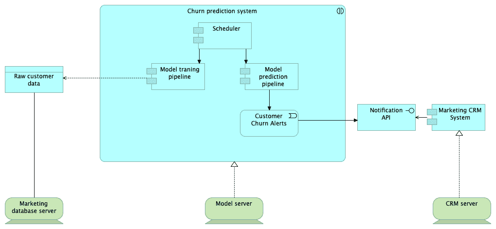

  

# 十六、构建您的技术栈

技术选择具有持久的影响。项目的技术栈决定了系统的功能性和非功能性能力，因此做出深思熟虑的选择是至关重要的。技术和需求之间的双向联系打开了一种分析方法，通过将它们的特性与项目的需求相匹配来选择不同的技术。在这一章中，我们将看到如何使用软件设计实践来形成特定于项目的技术栈，以及哪些技术应该构成在所有项目中共享的核心技术栈。我们还将探索一种比较不同技术的方法，以便您可以在看似相似的选项之间做出理性的选择。

在本章中，我们将讨论以下主题:

*   定义技术栈的元素
*   在核心技术和项目特定技术之间进行选择
*   比较工具和产品

  

# 定义技术栈的元素

技术栈是您的团队用来交付产品和完成项目的一套工具。当选择技术时，首先要定义它们的目标，并彻底记录所有的需求。从那里，你和你的团队可以看到什么技术将帮助你达到最终目标。

构建技术栈与设计软件架构是紧密相连的，因此您团队中的工程师应该从起草一份满足所有人需求的系统设计开始。软件架构是一个广泛而深入的技术话题，所以我们不会在本章中深入讨论。相反，我们将概述为实现特定目标而选择最佳技术的必要步骤。让我们开始吧:

1.  收集需求，明确目标。
2.  为您的项目选择一组架构视图。架构视图包含系统某些方面的视觉和文本描述。架构视图最突出的例子如下:
    *   **基础架构视图** : 代表系统的物理部分。该视图中记录了服务器、存储阵列和网络。
    *   **组件视图**:表示您将要构建的软件系统的逻辑组件。组件视图应该定义系统的隔离部分以及它们进行通信的接口。
    *   **部署视图**:将组件视图的逻辑表示与基础设施视图的物理现实相匹配。部署视图应该描述如何将系统组件交付给相应的硬件。
    *   **其他视图**:设计软件架构的不同方法论定义了许多有用的视图。例如，ArchiMate 2.1 规范定义了 18 个架构视图，它们对不同的利益相关者都很有用。为了简洁起见，我们将只讨论可能影响技术栈的主要视图，而忽略其他视图。
3.  根据团队提出的要求和软件设计，为系统的开发和操作定义必要的技术功能列表。不要忘记包括交叉技术，这些技术将优化你的系统的实验、开发、交付和操作。横切技术可能不会帮助您找到任何特定的功能需求，但是总体上对项目是有益的。实验跟踪框架、数据版本控制系统、**持续集成** / **持续部署** ( **CI** / **CD** )服务器都是横切技术的例子。

例如，让我们为客户流失预测系统构建一个技术栈。我们的客户已经为流失预测模块定义了以下需求列表。我们将省略技术细节，以便专注于整个过程:

1.  处理来自营销数据库的数据。这包含客户信息。数据集的大小小于 5 GB 的原始数据。
2.  每周一训练客户流失预测模型。我们应该把一个月没有购物的顾客视为被搅动的顾客。
3.  通过使用远程 API 调用通知团队潜在的客户流失。该服务应在工作日提供。

分解将每个需求分为两类:**功能需求** ( **FR** )和**非功能需求** ( **NFR** )。FRs 包括所有与影响核心用例和最终用户的系统功能相关的需求。NFRs 包括适用于系统的所有需求，并定义了系统工作的一组约束。服务级别协议和可用性要求是 nfr 的很好例子。

团队将客户需求分解为以下列表:

1.  **FR** :
    *   **FR1** :系统必须与客户的营销数据库集成。
    *   **FR2** :系统必须提供客户流失预测模型。我们可以把一个月没有购物的顾客看作是被搅动的。
    *   FR3:系统必须调用一个远程 API 来通知营销部门潜在的客户流失。
    *   **FR4** :每周一要执行模型。
2.  **NFR** :
    *   **NFR1** :系统每周应该处理 5 GB 的数据。
    *   **nfr 2**:API 应该在工作日可用。

基于这个需求列表，团队提出了以下系统设计，使用 Archi 软件([https://www.archimatetool.com/](https://www.archimatetool.com/))以 ArchiMate 2.1 符号绘制:

上图包含两个层次:基础设施和软件实现。

软件层描述了不同组件和服务之间的关系:

*   **原始客户数据:**代表流失预测系统使用的原始数据。
*   **模型训练管道:**表示一组数据处理和模型训练步骤，分组为一个软件组件。
*   **模型预测管道:**表示负责采用经过训练的模型进行流失预测并生成客户流失警报的组件。
*   **调度器:**通过根据调度运行管道来协调其他组件的工作。
*   **客户流失预警:**潜在客户流失的通知事件。
*   **营销 CRM 系统:**客户的 CRM 系统，已经在生产中部署使用。
*   **通知 API:** 允许我们在 CRM 系统中创建关于客户的通知的服务。

基础设施层描述了软件对特定硬件资源的物理分配，它有三个组成部分:

*   **营销数据库服务器**
*   **模型服务器**
*   **CRM 服务器**

为了简单起见，前面的软件架构图省略了许多技术细节，因为我们的目标是演示如何做出技术选择。以下文本的核心思想不是加深您对软件架构广阔领域的了解，而是让您对需求转化为合理的技术选择的过程有一个总体的感觉。了解这一过程可以帮助您指导您的专家团队选择高效的技术栈。对团队来说，这个项目看起来并不复杂，而且这个任务对他们来说是相当标准的。该团队决定使用一套通用的跨领域技术，作为公司标准用于每个项目:

*   作为编程语言的 Python
*   用于源代码版本控制的 Git
*   **数据版本控制**(**)用于数据版本控制**
***   GitLab CI/CD 作为 CI/CD 服务器*   用于数据分析和可视化的木星笔记本**

 **为了实现 FR，他们决定使用以下技术:

*   **FR1** :用于数据库访问的 SQLAlchemy 库。
*   **FR2**:sci kit-作为机器学习库学习。
*   FR3:对 API 调用的请求。该团队还决定使用单独的数据库来存储预测结果和模型执行日志。
*   **FR4** :团队决定使用 cron(一种流行的 Unix 调度程序，可以基于预定义的调度表运行命令)作为主要的调度解决方案。

为了实现 NFR，他们决定采取以下措施:

*   **NFR1** :执行负载测试，确定模型训练所需的最低服务器配置。根据团队以前的经验，一个具有 8 个 CPU、1 GB RAM 和 15 GB HDD 的虚拟服务器应该足够了，因此他们将此配置设置为测试的基线。
*   **NFR2** :团队已经决定请求关于 API 使用的更详细的信息，并询问他们每天可以收到多少请求。事实证明，该 API 每天会被执行多达 10 次，因此一台 API 服务器应该足以满足这一可用性要求。

在本节中，我们探讨了如何开发特定于项目的技术栈。然而，技术选择还有另一个重要方面:您团队的专业知识和技能。在下一节中，我们将看看团队和项目技术栈之间的关系。** **  

# 在核心技术和项目特定技术之间进行选择

技术选择应该有助于项目需求的实现，但是将团队的专业知识和能力以及约束考虑在内也是至关重要的。例如，如果您的团队完全由 Python 开发人员组成，选择 Julia 作为主要编程语言可能是个坏主意，即使团队认为它更适合项目:

*   所有的团队成员都将花费时间学习一门新的语言，这实际上摧毁了使用该技术所带来的所有生产力收益。
*   该团队的结论可能过于乐观，因为他们缺乏新技术的经验。

如果你的团队追求成长的心态，并不断获得新的知识，这两种风险会减少，但它们永远不会完全消失。

您团队中的核心专业知识限制了您可以在项目中使用的技术。如果你想要更多的选择，单独开发一个团队技术栈是很重要的。持续的内部研究过程应该让你的核心技术保持最新。特定于项目的技术栈可以通过调整核心技术栈来满足您的项目需求。

我们可以将内部技术研究过程视为一个独立的长期运行的项目，最好使用看板进行管理:

1.  团队中有人发现了一项潜在有用的技术。
2.  经验丰富的团队成员对这项技术进行了快速审查。如果技术看起来很有前景，他们会把它放入内部研究计划中。
3.  一旦团队经理决定在内部研究过程中投入一些时间，他们就开始一个积压工作梳理会议。在那里，团队根据**特定的、可测量的、可实现的、相关的、有时限的** ( **SMART** )标准，对待办事项中的任务进行优先级排序，并丰富它们的定义。
4.  受分配者从待办事项列表中选择一个任务，并试图尽快完成它。如果他们遇到阻塞问题，应该立即报告并解决，最好是在其他团队成员的帮助下。
5.  一旦研究完成，受托人以文档或谈话的形式报告结果，以便团队可以决定他们是否将该技术包括在核心技术栈中。
6.  如果决定是肯定的，那么为更广泛的内部技术采用创建一个教育计划是至关重要的。此任务的主要结果是准备一个研讨会、指南、指导手册或一些其他教育材料，新的和现有的团队成员可以使用它们来熟悉技术。

核心技术栈不应该包括仅适用于一小部分项目的过于具体的技术。这些内容的唯一目的是帮助您的团队形成一个技术基础，解决您的项目中出现的大多数需求。你的团队关注的范围越广，核心技术就应该越全面。如果整个团队正在构建一个特定的产品，那么特定于项目的和核心的技术栈开始合并成一个单一的实体。

将核心技术栈应用到新项目的过程如下:

1.  确定一组项目需求。
2.  看看核心技术栈满足了哪些需求。
3.  如果核心技术栈违反了一些需求，那么就寻找替代方案。
4.  如果核心技术体系不能满足某些需求，那么就寻找可以集成到核心技术体系中的附加技术。
5.  在项目结束时，评估添加到项目中的新技术，并决定它们是否适合核心技术栈。

使用这些过程，您可以将通常混乱的和欲望驱动的技术选择转变为一致的和逻辑的一系列步骤，从而导致有意义的决策。然而，即使是最谨慎的需求分解也可能会让您的团队不知道选择哪种技术，因为在不同的框架、库和平台之间有许多交集和选择。在下一节中，我们将探讨如何从各种技术中进行选择。

  

# 比较工具和产品

*应该选择 R 还是 Python？**tensor flow 和 PyTorch 哪个好？关于哪个是做 Y 最好的 X 的无休止争吵的列表在互联网上随处可见。这些讨论是无休止的，因为在技术世界里没有银弹。每个专业团队都有他们特定的用例，这使得特定的技术选择为他们工作。没有一种技术能让所有人都同样满意。*

x 对 Y 的争论经常发生在项目团队内部，这是工程师可以花时间进行的最没有产出的活动。如果您尝试从 X 与 Y 的争论过渡到寻找适合您的特定需求的技术(这些技术被清楚地陈述、分类和记录)，您将在更短的时间内获得更多有用的结果。对于数据科学家和软件工程师来说，选择最现代或最时尚的技术就像玩俄罗斯轮盘赌。让我们来探索如何对技术栈做出深思熟虑的决策。

为了做出有意义的技术选择，你需要使这个过程更加系统化。首先，您需要导出一组比较标准，允许您对不同的技术进行基准测试，并为研究活动提供一个模板。这些标准应该测试不同的维度或需求组，使技术在您的特定情况下有用。

让我们通过一个例例研究来研究比较不同技术的细节。

  

# 案例研究——预测物流公司的需求

假设我们需要为我们的项目选择一个时间序列预测框架。我们的团队主要使用 Python，必须提供一个工具来预测时间序列数据。该系统的主要目标是预测公司发运的一组给定产品的需求。该团队发现有许多不同的预测框架。

为了在这些产品中进行选择，该团队创建了以下比较标准:

| **ID** | **需求** **定义** | **证实** | **分数** | **优先级** |
| **易于开发** |
| D1 | 与 Python 兼容 | Python 是该团队的主要编程语言。 | three | 命令的 |
| D2 | 与 scikit-learn 接口兼容 | 这个团队在`scikit-learn`库中有很好的专业知识。如果时间序列预测库与`scikit-learn`兼容将是有益的。 | Two | 重要的 |
| D3 | 有很好的文档 |  | one | 补充的 |
| D4 | 预测可以用不到 10 行代码完成 |  | one | 补充的 |
| D5 | 可以将时间序列作为本机数据类型处理 | 该框架应该处理原始时间序列数据，这样团队就不会在数据集准备和特征工程上花费额外的时间。 | Two | 重要的 |
| **预测算法要求** |
| 子一代 | 不需要手动调整超参数 | 由于该库将用于大量的时间序列，手动调整模型是不实际的。该工具应支持自动超参数调整，或者在选择哪个超参数时具有鲁棒性，从而使用默认设置提供良好的预测。 | three | 命令的 |
| 第二子代 | 提供了几种预测方法 | 几种预测方法的可用性将允许我们评估几种模型，并选择最适合每个特定时间序列的模型。 | one | 补充的 |
| 第三子代 | 处理季节性时间序列 | 客户数据中的所有时间序列都有季节性模式。 | three | 命令的 |
| 法乐四联症 | 提供置信界限和预测 | 置信区间可用于为每个预测提供不确定性界限，客户认为这是一个有用的功能。 | Two | 重要的 |
| **性能和数据要求** |
| 第一亲代 | 对具有 100 个数据点的时间序列的预测可以在 15 秒内完成 | 大量的时间序列限制了我们可以在单个时间序列上花费的时间总量。 | Two | 重要的 |
| P2 | 可以处理长度可变的时间序列和空数据 | 数据质量不理想，数据中存在一些差距。有些项目比其他项目有更多的历史数据。 | Two | 重要的 |

上述比较表由以下各列组成:

*   **ID** :可以作为技术对照表中的短标识符(下面提供)。
*   **需求定义**:这应该描述感兴趣的能力。
*   替换:这应该提供需求背后的动机。
*   **得分**:这显示了需求的相对重要性，并将用于总结每个需求类别。
*   **优先级**:表示每项需求的必要性，将为每项技术提供额外的分数。

接下来，团队准备了一个框架列表进行比较，如下所示:

*   **PMMA**(【https://www.alkaline-ml.com/pmdarima/】T2)
*   **stats models . TSA**(【https://www.statsmodels.org/stable/tsa.html】T2)
*   **先知**(【https://github.com/facebook/prophet】T2)
*   **light GBM**(【https://lightgbm.readthedocs.io/en/latest/】T3[)和**ts fresh**(](https://lightgbm.readthedocs.io/en/latest/)[https://tsfresh.readthedocs.io/en/latest/](https://tsfresh.readthedocs.io/en/latest/))

该小组还提出了以下比较表:

|  |
|  | **框架** | **D1(男)** | **D2(上)** | **D3 (S)** | **D4(美国)** | **D5(上)** | **F1 (M)** | **F2 (S)** | **F3 (M)** | **F4(上)** | **P1(上)** | **P2(上)** | **pmdarima** | three | Two | Zero | Two | three | three | Zero | three | Two | Zero | Zero | **状态模型. tsa** | three | Zero | Two | Zero | three | Zero | one | three | Two | Two | Zero | **先知** | three | Zero | Two | Two | three | three | Zero | three | Two | Zero | Two | **LightGBM** 和 **tsfresh** | three | Two | Two | Zero | Zero | Zero | Zero | three | Zero | Two | Zero |  |
|  |

此表可以进一步总结，得出以下最终结果:

| **框架** | **开发难度得分** | **预测算法要求得分** | **性能和数据要求得分** | **满足强制性要求** | **满足重要要求** | **满足补充要求** |
| **pmdarima** | 10/12 | 8/9 | 0/4 | 3/3 | 3/5 | 1/3 |
| **状态模型. tsa** | 8/12 | 6/9 | 2/4 | 2/3 | 3/5 | 2/3 |
| **先知** | 10/12 | 8/9 | 2/4 | 3/3 | 3/5 | 2/3 |
| **LightGBM** 和 **tsfresh** | 7/12 | 3/9 | 2/4 | 2/3 | 2/5 | 1/3 |

如果您愿意，您可以使用加权平均值将每个框架的得分汇总成一个数字。但是，请记住，如果不正确地将复杂的决策简化为一个数字，可能会导致错误。

这些研究结果表明，根据最初的要求，Prophet 是一个更好的选择。然而，结果并不意味着 Prophet 是每个应用程序的最佳选择。技术选择应该是有偏见和固执己见的，因为没有哪种技术是最适合每个项目的。例如，如果团队考虑了期望的平均度量值，排名可能会完全不同。在这种情况下，其他框架可能会胜出，因为它们提供了更准确的模型。

  

# 摘要

在这一章中，我们已经看到了如何根据需求而不是围绕它的宣传来选择技术。我们还探索了如何构建需求，以及如何从软件架构中获得技术栈的主要元素。最后，我们讨论了核心技术和特定于项目的技术栈之间的区别，并研究了比较不同技术的分析方法。

下一章将结束这本书；恭喜你完成了！**