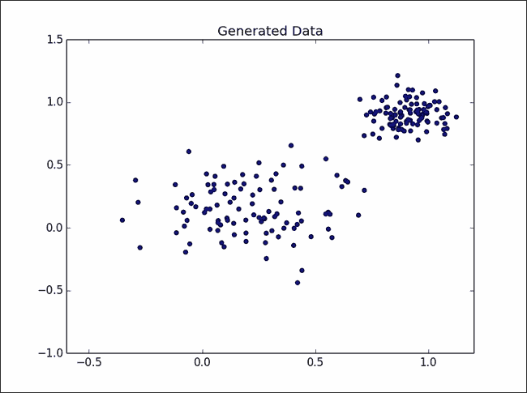
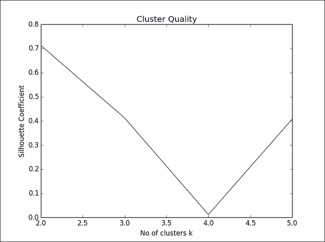
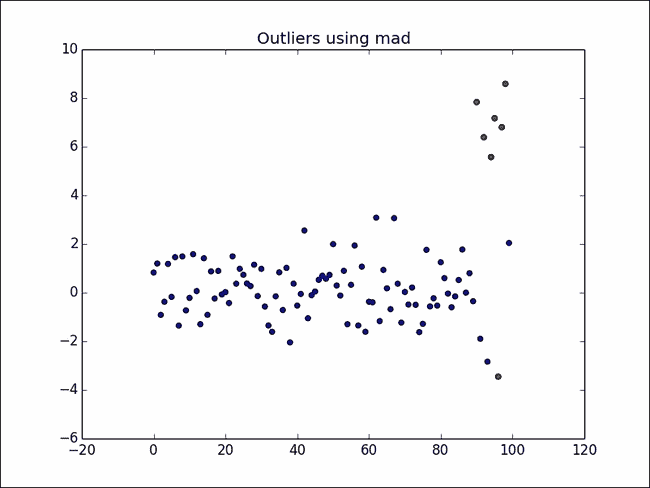
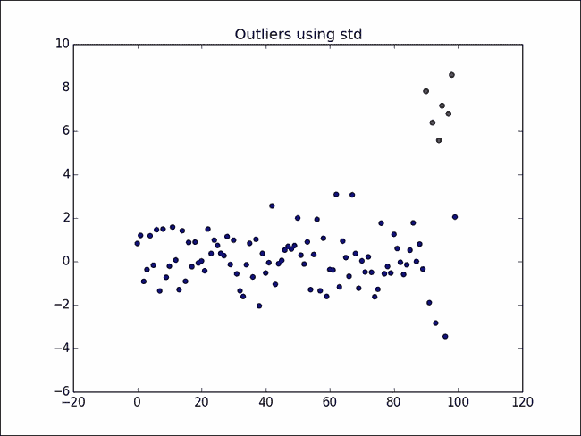
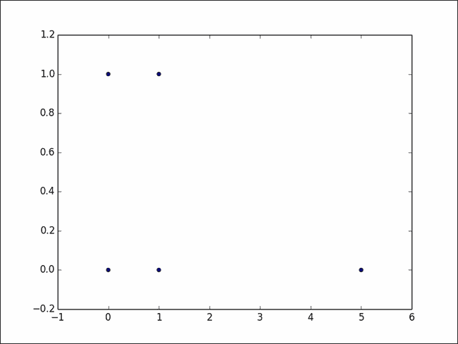

# 五、数据挖掘——大海捞针

在本章中，我们将讨论以下主题:

*   使用距离测量
*   学习和使用内核方法
*   使用 k 均值方法对数据进行聚类
*   学习矢量量化
*   发现单变量数据中的异常值
*   使用局部异常因子方法发现异常值


# 简介

在这一章中，我们将主要关注无监督的数据挖掘算法。我们将从包含各种距离测量的配方开始。构建数据科学应用程序时，理解距离度量和各种空间至关重要。任何数据集通常是一组点，这些点是属于特定空间的对象。我们可以将空间定义为一组通用的点，数据集中的点就是从这些点中提取的。最常遇到的空间是欧几里得。在欧几里得空间中，点是实数的向量。向量的长度表示维数。

然后我们有一个介绍内核方法的食谱。核方法是机器学习中一个非常重要的课题。它们帮助我们用线性方法解决非线性数据问题。我们将介绍内核技巧的概念。

我们将遵循一些聚类算法配方。聚类是将一组点划分成逻辑组的过程。例如，在超市场景中，商品被定性地分组到类别中。然而，我们将着眼于定量方法。具体来说，我们将把注意力集中在 k-means 算法上，并讨论它的局限性和优点。

我们的下一个配方是一种无监督的技术，称为学习矢量量化。它可用于聚类和分类任务。

最后，我们将看看异常值检测方法。异常值是指数据集中与该数据集中的其他观察值显著不同的那些观察值。研究这些异常值非常重要，因为它们可能表示生成数据的基础过程中的异常现象或错误。当机器学习模型拟合数据时，在将数据传递给算法之前，了解如何处理异常值是很重要的。在这一章中，我们将集中讨论一些经验性的异常值检测技术。

我们将非常依赖 Python 库、NumPy、SciPy、matplotlib 和 scikit-learn 来完成我们的大部分食谱。在这一章中，我们也将改变我们的编码风格，从编写脚本到编写过程和类。


# 使用距离测量

距离和相似性度量是各种数据挖掘任务的关键。在这个食谱中，我们将看到一些距离测量的应用。我们的下一个配方将包括相似性度量。在查看各种距离度量之前，让我们先定义一个距离度量。

作为数据科学家，我们总是面对不同维度的点或向量。数学上，一组点被定义为一个空间。这个空间中的一个距离测度定义为一个函数 d(x，y)，这个函数以这个空间中的两个点 x 和 y 作为自变量，给出一个实数作为输出。距离函数，即实数输出，应满足以下公理:

1.  距离函数输出应该是非负的，d(x，y) >= 0
2.  仅当 x = y 时，距离函数的输出应该为零
3.  距离应该是对称的，即 d(x，y) = d(y，x)
4.  距离要服从三角形不等式，即 d(x，y) <= d(x，z) + d(z，y)

仔细观察第四个公理，就会发现距离是两点之间最短路径的长度。

您可以参考下面的链接，了解关于公理的更多信息:

[http://en.wikipedia.org/wiki/Metric_%28mathematics%29](http://en.wikipedia.org/wiki/Metric_%28mathematics%29)


## 准备就绪

我们将看看欧几里德和非欧几里德空间中的距离度量。我们将从欧几里德距离开始，然后定义 Lr-范数距离。lr-范数是一族距离测度，欧氏距离测度是其中的一员。然后我们用余弦距离来跟踪它。在非欧几里得空间中，我们将看看 Jaccard 距离和 Hamming 距离。


## 怎么做……

让我们从定义计算各种距离度量的函数开始:

```
import numpy as np

def euclidean_distance(x,y):
    if len(x) == len(y):
        return np.sqrt(np.sum(np.power((x-y),2)))
    else:
        print "Input should be of equal length"
    return None

def lrNorm_distance(x,y,power):
    if len(x) == len(y):
        return np.power(np.sum (np.power((x-y),power)),(1/(1.0*power)))
    else:
        print "Input should be of equal length"
    return None

def cosine_distance(x,y):
    if len(x) == len(y):
        return np.dot(x,y) / np.sqrt(np.dot(x,x) * np.dot(y,y))
    else:
        print "Input should be of equal length"
    return None

def jaccard_distance(x,y):
    set_x = set(x)
    set_y = set(y)
    return 1 - len(set_x.intersection(set_y)) / len(set_x.union(set_y))

def hamming_distance(x,y):
    diff = 0
    if len(x) == len(y):
        for char1,char2 in zip(x,y):
            if char1 != char2:
                diff+=1
        return diff
    else:
        print "Input should be of equal length"
    return None
```

现在，让我们编写一个主例程来调用这些不同的距离测量功能:

```
if __name__ == "__main__":

    # Sample data, 2 vectors of dimension 3
    x = np.asarray([1,2,3])
    y = np.asarray([1,2,3])
    # print euclidean distance    
    print euclidean_distance(x,y)
    # Print euclidean by invoking lr norm with
    # r value of 2    
    print lrNorm_distance(x,y,2)
    # Manhattan or citi block Distance
    print lrNorm_distance(x,y,1)

    # Sample data for cosine distance
    x =[1,1]
    y =[1,0]
    print 'cosine distance'
    print cosine_distance(x,y)

    # Sample data for jaccard distance    
    x = [1,2,3]
    y = [1,2,3]
    print jaccard_distance(x,y)

    # Sample data for hamming distance    
    x =[11001]
    y =[11011]
    print hamming_distance(x,y)
```


## 它是如何工作的……

再来看主要功能。我们创建了一个样本数据集和两个三维向量，并调用了`euclidean_distance`函数。

这是最常用的距离度量，使用的是欧几里德距离。它属于 Lr-范数距离族。如果一个空间中的点是由实数组成的向量，则该空间被定义为欧几里得空间。它也被称为 L2-诺姆距离。欧几里德距离的公式如下:


正如你所看到的，欧几里得距离是通过在每个维度中寻找距离(减去相应的维度)，平方距离，最后求平方根而得到的。

在我们的代码中，我们利用 NumPy 平方根和幂函数来实现前面的公式:

```
np.sqrt(np.sum(np.power((x-y),2)))
```

欧几里德距离是严格正的。当 x 等于 y 时，距离为零。这从我们如何调用欧几里德距离应该变得清楚:

```
x = np.asarray([1,2,3])
y = np.asarray([1,2,3])

print euclidean_distance(x,y)
```

如您所见，我们定义了两个 NumPy 数组，`x`和`y`。我们一直保持不变。现在，当我们用这些参数调用`euclidean_distance`函数时，我们的输出为零。

现在让我们调用 L2 范数函数，`lrNorm_distance`。

Lr-范数距离度量来自距离度量家族，欧几里德距离是该家族的成员。当我们看到它的公式时，这个应该变得清楚了:


你可以看到我们现在有一个参数，`r`。我们用 2 代替`r`吧。这将把前面的方程变成欧几里德方程。因此，欧几里得被称为 L2 范数距离:

```
lrNorm_distance(x,y,power):
```

除了两个向量，我们还将传递第三个参数，名为`power`。这就是公式中定义的`r`。在幂值设置为 2 的情况下调用它将产生欧几里德距离。您可以通过运行以下代码来检查它:

```
print lrNorm_distance(x,y,2)
```

这将产生零结果，类似于欧几里得距离函数。

让我们定义两个样本向量，`x`和`y`，并调用`cosine_distance`函数。

在将点视为方向的空间中，余弦距离产生给定输入向量之间角度的余弦作为距离值。欧几里得空间和点是整数或布尔值的向量的空间都是可以应用余弦距离函数的候选空间。输入向量之间角度的余弦是输入向量的点积与各个输入向量的 L2 范数的乘积之比:

```
np.dot(x,y) / np.sqrt(np.dot(x,x) * np.dot(y,y))
```

让我们看看计算输入向量之间点积的分子:

```
np.dot(x,y)
```

我们将使用 NumPy dot 函数来获得点积值。两个向量`x`和`y`的点积定义如下:


现在，让我们看看分母:

```
np.sqrt(np.dot(x,x) * np.dot(y,y))
```

我们再次使用点函数来寻找输入向量的 L2 范数:

```
np.dot(x,x) is equivalent to 

tot = 0
for i in range(len(x)):
tot+=x[i] * x[i]
```

因此，我们可以计算两个输入向量之间角度的余弦值。

我们将转移到 Jaccard 的距离。与前面的调用类似，我们将定义样本向量并调用`jaccard_distance`函数。

从实值向量开始，我们来看集合。通常称为 Jaccard 系数，它是给定输入向量的交集和并集的大小之比。一减去这个值就得到 Jaccard 的距离。如您所见，在实现中，我们首先将输入列表转换为集合。这将允许我们利用 Python 集合数据类型提供的并集和交集运算:

```
set_x = set(x)
set_y = set(y)
```

最后，距离计算如下:

```
1 - len(set_x.intersection(set_y)) / (1.0 * len(set_x.union(set_y)))
```

我们必须使用`set`数据类型中可用的交集和并集功能来计算距离。

我们的最后一个距离度量是汉明距离。对于两个位向量，汉明距离计算这两个向量中有多少位不同:

```
for char1,char2 in zip(x,y):
    if char1 != char2:
        diff+=1
return diff
```

如您所见，我们使用了`zip`功能来检查每一位，并维护一个计数器，记录有多少位不同。汉明距离与分类变量一起使用。


## 还有更多...

请记住，通过从我们的距离值中减去 1，我们可以得到一个相似性值。

还有一个我们没有详细讨论，但被普遍使用的距离是曼哈顿或城市街区距离。这是 L1-诺姆距离。通过将 r 值作为 1 传递给 Lr-norm 距离函数，我们将得到曼哈顿距离。

根据放置数据的底层空间，需要选择适当的距离度量。当在算法中使用这些距离时，我们需要注意潜在的空间。例如，在 k-means 算法中，在每一步中，聚类中心被计算为彼此接近的所有点的平均值。欧几里得的一个很好的性质是，点的平均值存在并且作为同一空间中的一个点。注意，我们对 Jaccard 的距离的输入是 sets。这些集合的平均值没有任何意义。

在使用余弦距离时，我们需要检查底层空间是否是欧几里得的。如果向量的元素是实数，那么空间是欧几里得的，如果它们是整数，那么空间是非欧几里得的。余弦距离最常用于文本挖掘。在文本挖掘中，单词被认为是坐标轴，文档是这个空间中的一个向量。两个文档向量之间角度的余弦表示这两个文档有多相似。

SciPy 对列出的所有这些距离测量进行了实现，更多内容请访问:

[http://docs . scipy . org/doc/scipy/reference/spatial . distance . html](http://docs.scipy.org/doc/scipy/reference/spatial.distance.html)。

上面的 URL 列出了 SciPy 支持的所有距离度量。

另外， scikit-learn `pairwise`子模块为您提供了一个名为`pairwise_distance`的方法，可以用来从输入记录中找出距离矩阵。这可以在以下位置找到:

[http://scikit learn . org/stable/modules/generated/sk learn . metrics . pairwise . pairwise _ distances . html](http://scikitlearn.org/stable/modules/generated/sklearn.metrics.pairwise.pairwise_distances.html)。

我们提到过，汉明距离与分类变量一起使用。这里值得一提的一点是一次性编码，它通常用于分类变量。在独热编码之后，汉明距离可以用作输入向量之间的相似性/距离度量。


## 参见

*   *用随机投影降低数据维度[第四章](part0060_split_000.html#1P71O1-6b04b7c0b98f44a0b8f82924fef317ec "Chapter 4. Data Analysis – Deep Dive")、*分析数据-深度挖掘*中的*配方


# 学习和使用内核方法

在这个菜谱中，我们将学习如何使用内核方法进行数据处理。在你的方法库中拥有关于内核的知识将有助于你处理非线性问题。这份食谱是对内核方法的介绍。

通常，线性模型——可以使用直线或超平面分离数据的模型——易于解释和理解。数据中的非线性阻止我们有效地使用线性模型。如果数据可以转换到一个空间，在那里关系变成线性的，我们可以使用线性模型。然而，变换空间中的数学计算可能会变成代价高昂的操作。这就是内核函数帮助我们的地方。

核是相似性函数。它需要两个输入参数，这两个输入之间的相似度就是核函数的输出。在这个菜谱中，我们将看看 kernel 是如何实现这种相似性的。我们还将讨论什么是所谓的内核技巧。

形式上定义核 K 是相似性函数:K(x1，x2) > 0 表示 x1 和 x2 的相似性。


## 准备就绪

在查看各种内核之前，让我们先对其进行数学定义:


这里，`xi`和，`xj`是输入向量:


上述映射函数用于将输入向量变换到新的空间。例如，如果输入向量在一个 n 维空间中，则转换函数将其转换到一个新的 m 维空间中，其中 m >> n:


上图表示点积:


上图是点积，`xi`和`xj`现在被映射函数变换到一个新的空间。

在这个菜谱中，我们将看到一个简单的内核在运行。

我们的映射函数如下:


当原始数据被提供给这个映射函数时，它将输入转换到新的空间。


## 怎么做……

让我们创建两个输入向量，并定义映射函数，如前一节所述:

```
import numpy as np
# Simple example to illustrate Kernel Function concept.
# 3 Dimensional input space
x = np.array([10,20,30])
y = np.array([8,9,10])

# Let us find a mapping function to transform this space
# phi(x1,x2,x3) = (x1x2,x1x3,x2x3,x1x1,x2x2,x3x3)
# this will transorm the input space into 6 dimesions

def mapping_function(x):
    output_list  =[]
    for i in range(len(x)):
        output_list.append(x[i]*x[i])

    output_list.append(x[0]*x[1])
    output_list.append(x[0]*x[2])
    output_list.append(x[1]*x[0])
    output_list.append(x[1]*x[2])
    output_list.append(x[2]*x[1])
    output_list.append(x[2]*x[0])
    return np.array(output_list)
```

现在，让我们看看调用内核转换的主例程。在主函数中，我们将定义一个内核函数，并将输入变量传递给函数，并打印输出:


```
if __name_ == "__main__"
    # Apply the mapping function
    tranf_x = mapping_function(x)
    tranf_y = mapping_function(y)
    # Print the output
    print tranf_x
    print np.dot(tranf_x,tranf_y)

    # Print the equivalent kernel functions
    # transformation output.
    output = np.power((np.dot(x,y)),2)
    print output
```


## 它是如何工作的……

让我们从我们的主函数开始遵循这个程序。我们创建了两个输入向量，`x`和`y`。这两个矢量都是三维的。

然后我们定义了一个映射函数。映射函数使用输入向量值，并将输入向量变换到维数增加的新空间中。在这种情况下，维度的数量从三个增加到九个。

现在让我们对这些向量应用一个映射函数，以便将它们的维数增加到 9。

如果我们打印`tranf_x`，我们将得到如下结果:

```
[100 400 900 200 300 200 600 600 300]
```

如您所见，我们将输入 x 从三维转换成了一个九维向量。

现在，让我们在变换后的空间中取点积，并打印它的输出。

输出是 313600，一个标量值。

现在让我们回顾一下:我们首先将两个输入向量转换到一个更高维的空间中，然后计算点积，以便得到一个标量输出。

我们所做的是一个非常昂贵的操作，将我们的原始三维向量转换为一个九维向量，然后对它执行点积操作。

相反，我们可以选择一个核函数，它可以达到相同的标量输出，而无需显式地将原始空间转换为新空间。

我们的新内核定义如下:


有了两个输入，`x`和`y`，这个内核计算向量的点积，并对它们求平方。

打印内核的输出后，我们得到 313600。

我们从未进行转换，但仍然能够得到与转换后的空间中点积输出相同的结果。这就是所谓的内核技巧。

选择这种内核并没有什么魔力。通过扩展内核，我们可以得到我们的映射函数。有关扩展的详细信息，请参考以下参考资料:

[http://en.wikipedia.org/wiki/Polynomial_kernel](http://en.wikipedia.org/wiki/Polynomial_kernel)。


## 还有更多...

有几种类型的内核。基于我们的数据特征和算法需求，我们需要选择正确的内核。其中一些如下:

线性内核:这是最简单的内核函数。对于两个给定的输入，它返回输入的点积:


多项式核:这个定义如下:


这里，`x`和`y`是输入的向量，`d`是多项式的次数，`c`是一个常数。在我们的配方中，我们使用了二次多项式核。

下面的是线性和多项式内核的 scikit 实现:

[http://sci kit-learn . org/stable/modules/generated/sk learn . metrics . pairwise . linear _ kernel . html # sk learn . metrics . pairwise . linear _ kernel](http://scikit-learn.org/stable/modules/generated/sklearn.metrics.pairwise.linear_kernel.html#sklearn.metrics.pairwise.linear_kernel)

[http://sci kit-learn . org/stable/modules/generated/sk learn . metrics . pairwise .多项式 _ kernel . html # sk learn . metrics . pairwise .多项式 _kernel](http://scikit-learn.org/stable/modules/generated/sklearn.metrics.pairwise.polynomial_kernel.html#sklearn.metrics.pairwise.polynomial_kernel) 。


## 参见

*   *使用内核 PCA* 配方[第四章](part0060_split_000.html#1P71O1-6b04b7c0b98f44a0b8f82924fef317ec "Chapter 4. Data Analysis – Deep Dive")，*分析数据——深潜*
*   *用随机投影降低数据维度[第四章](part0060_split_000.html#1P71O1-6b04b7c0b98f44a0b8f82924fef317ec "Chapter 4. Data Analysis – Deep Dive")、*分析数据-深度挖掘*中的*配方


# 使用 k-means 方法对数据进行聚类

在这个菜谱中，我们将看看 k-means 算法。K-means 是一种无监督的中心搜索算法。它是一种迭代的非确定性方法。我们所说的迭代是指重复算法步骤，直到收敛到指定数量的步骤。不确定性意味着不同的起始值可能导致不同的最终聚类分配。该算法需要聚类数`k`作为输入。没有好的方法来选择`k`的值，必须通过多次运行算法来确定。

对于任何聚类算法，其输出的质量都是由聚类间的内聚性和聚类内的分离性决定的。同一簇中的点应该彼此靠近；不同簇中的点应该彼此远离。


## 准备就绪

在我们开始讨论如何用 Python 编写 k-means 算法之前，我们需要了解两个关键概念，这将有助于我们更好地理解我们的算法所产生的输出质量。第一个是关于所形成的聚类质量的定义，第二个是用于发现聚类质量的度量。

通过 k-means 检测到的每个聚类可以使用以下度量进行评估:

1.  **聚类位置**:这是聚类中心的坐标。K-means 以一些随机点作为聚类中心开始，并迭代地找到一个新的中心，相似的点围绕该中心进行分组。
2.  **聚类半径**:这是所有点与聚类中心的平均偏差。
3.  **簇的质量**:这是一个簇中的点数。
4.  **星团密度**:这是星团的质量与其半径的比值。

现在，我们将测量输出集群的质量。如前所述，这是一个无人监管的问题，我们没有标签来检查我们的输出，以获得精度、召回率、准确度、F1 分数或其他类似的指标。我们将用于 k-means 算法的度量标准称为轮廓系数。它的取值范围是-1 到 1。负值表示聚类半径大于聚类之间的距离，因此聚类会重叠。这表明聚类效果不佳。较大的值，即接近 1 的值，表示聚类良好。

为聚类中的每个点定义轮廓系数。对于一个簇 C 和该簇中的一个点`i`，设`xi`是该点到该簇中所有其他点的平均距离。

现在，计算点`i`与另一个聚类中所有点的平均距离，d。选择这些值中的最小值，并将其称为`yi`:


对于每个聚类，所有点的轮廓系数的平均值可以作为聚类质量的良好度量。所有数据点的轮廓系数的平均值可以作为所形成的聚类的总体质量度量。

让我们继续生成一些随机数据:

```
import numpy as np
import matplotlib.pyplot as plt

def get_random_data():
    x_1 = np.random.normal(loc=0.2,scale=0.2,size=(100,100))
    x_2 = np.random.normal(loc=0.9,scale=0.1,size=(100,100))
    x = np.r_[x_1,x_2]
    return x
```

我们从正态分布中抽取了两组数据。第一组数据的平均值为 T0，标准偏差为 T1。对于第二组，我们的平均值是`0.9`，标准偏差是`0.1`。每个数据集是一个大小为 100 * 100 的矩阵——我们有`100`个实例和`100`个维度。最后，我们使用 NumPy 的行堆叠函数将它们合并。我们最终的数据集大小为 200 * 100。

让我们做一个数据散点图:

```
x = get_random_data()

plt.cla()
plt.figure(1)
plt.title("Generated Data")
plt.scatter(x[:,0],x[:,1])
plt.show()
```

剧情如下:



虽然我们只绘制了第一个和第二个维度，但是你仍然可以清楚地看到我们有两个集群。现在让我们开始编写 k-means 聚类算法。


## 怎么做……

让我们定义一个函数，它可以对给定的数据和一个参数`k`执行 k-means 聚类。该函数拟合给定数据的聚类，并返回总体轮廓系数。

```
from sklearn.cluster import KMeans
from sklearn.metrics import silhouette_score

def form_clusters(x,k):
    """
    Build clusters
    """
    # k = required number of clusters
    no_clusters = k
    model = KMeans(n_clusters=no_clusters,init='random')
    model.fit(x)
    labels = model.labels_
    print labels
    # Cacluate the silhouette score
    sh_score = silhouette_score(x,labels)
    return sh_score
```

让我们为`k` 的不同值调用前置函数，并存储返回的轮廓系数:

```
sh_scores = []
for i in range(1,5):
    sh_score = form_clusters(x,i+1)
    sh_scores.append(sh_score)

no_clusters = [i+1 for i in range(1,5)]
```

最后，让我们画出`k`不同值的轮廓系数。

```
no_clusters = [i+1 for i in range(1,5)]

plt.figure(2)
plt.plot(no_clusters,sh_scores)
plt.title("Cluster Quality")
plt.xlabel("No of clusters k")
plt.ylabel("Silhouette Coefficient")
plt.show()
```


## 它是如何工作的……

如前所述，k-means 是一种迭代算法。大致来说，k-means 的步骤如下:

1.  将数据集中的随机点初始化为初始中心点。
2.  执行以下操作，直到收敛指定的次数:

    *   将点分配到最近的聚类中心。通常，欧几里德距离用于寻找点和聚类中心之间的距离。
    *   根据本次迭代中的赋值重新计算新的聚类中心。
    *   如果点的聚类分配与前一次迭代相同，则退出循环。这个算法已经收敛到一个最优解。

3.  我们将利用 scikit-learn 库中的 k-means 实现。我们的聚类函数将 k 值和数据集作为参数，运行 k-means 算法:

    ```
    model = KMeans(n_clusters=no_clusters,init='random')
    model.fit(x)
    ```

`no_clusters`是我们将传递给函数的参数。使用 init 参数，我们将初始中心点设置为随机的。当 init 的设置为随机时，scikit-learn 估计数据的平均值和方差，然后从高斯分布中抽取 k 个中心。

最后，我们必须调用 fit 方法在数据集上运行 k-means:

```
labels = model.labels_
sh_score = silhouette_score(x,labels)
return sh_score
```

我们得到标签，即每个点的聚类分配，并找出我们的聚类中所有点的轮廓系数。

在现实世界的场景中，当我们在数据集上开始 k-means 算法时，我们不知道数据中存在的聚类数；换句话说，我们不知道 k 的理想值。但是，在我们的示例中，我们知道 k=2，因为我们以适合两个集群的方式生成数据。因此，我们需要对不同的 k 值运行 k 均值:

```
sh_scores = []
for i in range(1,5):
sh_score = form_clusters(x,i+1)
sh_scores.append(sh_score)
```

对于每次运行，即 k 的每个值，我们存储轮廓系数。k 与轮廓系数的关系图揭示了数据集的理想 k 值:

```
no_clusters = [i+1 for i in range(1,5)]

plt.figure(2)
plt.plot(no_clusters,sh_scores)
plt.title("Cluster Quality")
plt.xlabel("No of clusters k")
plt.ylabel("Silhouette Coefficient")
plt.show()
```



正如所料，对于 k=2，我们的轮廓系数非常高。


## 还有更多...

关于 k-means 有几点需要注意。k-means 算法不能用于分类数据，而是使用 k-medoids。k-medoids 不是对一个聚类中的所有点进行平均来寻找聚类中心，而是选择一个与该聚类中所有其他点的平均距离最小的点。

分配初始集群时需要小心。如果数据非常密集，并且聚类间隔非常大，并且如果初始随机中心选择在同一个聚类中，k-means 的性能可能不会很好。

通常，如果数据具有星形凸簇，则 k-means 有效。有关星形凸形数据点的更多信息，请参考以下链接:

[http://mathworld.wolfram.com/StarConvex.html](http://mathworld.wolfram.com/StarConvex.html)

嵌套或其他复杂聚类的存在将导致 k-means 的垃圾输出。

数据中异常值的存在可能会产生不良结果。一个好的做法是在运行 k-means 之前进行彻底的数据探索，以确定数据特征。

在算法开始的期间初始化中心的另一种方法是 k-means++方法。因此，我们可以使用 k-means++来设置它，而不是将 init 参数设置为 random。k-means++参考以下论文:

*k-means++:小心播种的好处*。 *ACM-SIAM 研讨会*关于*离散算法。2007 年*


## 参见

*   *用距离度量工作*第五章[中的秘方](part0066_split_000.html#1UU541-6b04b7c0b98f44a0b8f82924fef317ec "Chapter 5. Data Mining – Needle in a Haystack")，*数据挖掘——大海捞针*


# 学习矢量量化

在这个食谱中，我们将看到一种无模型的数据点聚类方法，称为学习矢量量化，简称 LVQ。LVQ 可用于分类任务。使用这种技术，在目标变量和预测变量之间不能进行太多的推断。与其他方法不同，很难确定响应变量 Y 和预测变量 x 之间存在什么关系。在许多现实情况下，它们作为黑盒方法非常有用。


## 准备就绪

LVQ 是一种在线学习算法，每次处理一个数据点。它做出了一个非常简单的直觉。假设我们已经为数据集中出现的不同类别确定了原型向量。训练点将被相似职业的原型所吸引，并排斥其他原型。

LVQ 的主要步骤如下:

为数据集中的每个类选择 k 个初始原型向量。如果这是一个两类问题，我们决定每个类有两个原型向量，我们将最终有四个初始原型向量。初始原型向量是从输入数据集中随机选择的。

我们将开始我们的迭代。当ε值达到零或预定义的阈值时，我们的迭代将结束。我们将决定一个ε值，并在每次迭代中递减ε值。

在每次迭代中，我们将对一个输入点进行采样(替换)，并找到与该点最近的原型向量。我们将使用欧几里得距离来寻找最近的点。我们将更新最近点的原型向量，如下所示:

如果原型向量的类别标签与输入数据点相同，我们将使用原型向量和数据点之间的差异来递增原型向量。

如果类别标签不同，我们将使用原型向量和数据点之间的差异来递减原型向量。

我们将使用 Iris 数据集来演示 LVQ 是如何工作的。正如在我们以前的一些配方中一样，我们将使用 scikit-learn 提供的方便的数据加载功能来加载 Iris 数据集。Iris 是一个众所周知的分类数据集。然而，我们在这里使用它的目的只是为了展示 LVQ 的能力。LVQ 也可以使用或处理没有分类标签的数据集。由于我们将使用欧几里德距离，我们将使用最小最大缩放来缩放数据。

```
from sklearn.datasets import load_iris
import numpy as np
from sklearn.metrics import euclidean_distances

data = load_iris()
x = data['data']
y = data['target']

# Scale the variables
from sklearn.preprocessing import MinMaxScaler
minmax = MinMaxScaler()
x = minmax.fit_transform(x)
```


## 怎么做……

1.  我们先为 LVQ 声明参数:

    ```
    R = 2
    n_classes = 3
    epsilon = 0.9
    epsilon_dec_factor = 0.001
    ```

2.  定义一个类来保存原型向量:

    ```
    class prototype(object):
        """
        Class to hold prototype vectors
        """

        def __init__(self,class_id,p_vector,eplsilon):
            self.class_id = class_id
            self.p_vector = p_vector
            self.epsilon = epsilon

        def update(self,u_vector,increment=True):
            if increment:
                # Move the prototype vector closer to input vector
                self.p_vector = self.p_vector + self.epsilon*(u_vector - self.p_vector)
            else:
                # Move the prototype vector away from input vector
                self.p_vector = self.p_vector - self.epsilon*(u_vector - self.p_vector)
    ```

3.  这是函数为一个给定的向量寻找最接近的原型向量:

    ```
    def find_closest(in_vector,proto_vectors):
        closest = None
        closest_distance = 99999
        for p_v in proto_vectors:
            distance = euclidean_distances(in_vector,p_v.p_vector)
            if distance < closest_distance:
                closest_distance = distance
                closest = p_v
        return closest
    ```

4.  查找最接近的原型向量的类 ID 的方便函数如下:

    ```
    def find_class_id(test_vector,p_vectors):
        return find_closest(test_vector,p_vectors).class_id
    ```

5.  选择初始 K *类数的原型向量:

    ```
    # Choose R initial prototypes for each class        
    p_vectors = []
    for i in range(n_classes):
        # Select a class
        y_subset = np.where(y == i)
        # Select tuples for choosen class
        x_subset  = x[y_subset]
        # Get R random indices between 0 and 50
        samples = np.random.randint(0,len(x_subset),R)
        # Select p_vectors
        for sample in samples:
            s = x_subset[sample]
            p = prototype(i,s,epsilon)
            p_vectors.append(p)

    print "class id \t Initial protype vector\n"
    for p_v in p_vectors:
        print p_v.class_id,'\t',p_v.p_vector
           print
    ```

6.  执行迭代以调整原型向量，以便使用现有数据点对任何新进入的点进行分类/聚类:

    ```
    while epsilon >= 0.01:
        # Sample a training instance randonly
        rnd_i = np.random.randint(0,149)
        rnd_s = x[rnd_i]
        target_y = y[rnd_i]

        # Decrement epsilon value for next iteration
        epsilon = epsilon - epsilon_dec_factor    
        # Find closes prototype vector to given point
        closest_pvector = find_closest(rnd_s,p_vectors)

        # Update closes prototype vector
        if target_y == closest_pvector.class_id:
            closest_pvector.update(rnd_s)
        else:
            closest_pvector.update(rnd_s,False)
        closest_pvector.epsilon = epsilon

    print "class id \t Final Prototype Vector\n"
    for p_vector in p_vectors:
        print p_vector.class_id,'\t',p_vector.p_vector
    ```

7.  下面是一个验证我们方法正确性的小测试:

    ```
    predicted_y = [find_class_id(instance,p_vectors) for instance in x ]

    from sklearn.metrics import classification_report

    print
    print classification_report(y,predicted_y,target_names=['Iris-Setosa','Iris-Versicolour', 'Iris-Virginica'])
    ```


## 它是如何工作的……

在步骤 1 中，我们初始化算法的参数。我们选择 R 值为 2，也就是说，每个类标签有两个原型向量。Iris 数据集是一个三类问题，所以我们总共有六个原型向量。我们必须选择ε值和ε衰减因子。

然后，我们定义一个数据结构来保存第 2 步中原型向量的细节。我们的类为数据集中的每个点存储以下内容:

```
self.class_id = class_id
self.p_vector = p_vector
self.epsilon = epsilon
```

原型向量所属的类 id 是向量本身和ε值。它还有一个功能更新，用于更改原型值:

```
def update(self,u_vector,increment=True):
if increment:
# Move the prototype vector closer to input vector
self.p_vector = self.p_vector + self.epsilon*(u_vector - self.p_vector)
else:
# Move the prototype vector away from input vector
self.p_vector = self.p_vector - self.epsilon*(u_vector - self.p_vector)
```

在第 3 步中，我们定义了下面的函数，它将任何给定的向量作为输入，并包含所有原型向量的列表。在所有的原型向量中，该函数返回与给定向量最接近的原型向量:

```
for p_v in proto_vectors:
distance = euclidean_distances(in_vector,p_v.p_vector)
if distance < closest_distance:
closest_distance = distance
closest = p_v
```

如你所见，它遍历所有的原型向量来寻找最近的一个。它使用欧几里德距离来度量相似性。

步骤 4 是一个小函数，它可以返回与给定向量最接近的原型向量的类 ID。

现在，我们已经完成了 LVQ 算法所需的所有预处理，我们可以在步骤 5 中继续实际的算法。对于每个类，我们必须选择初始原型向量。然后我们从每个类中随机选择 R 个点。外部循环遍历每个类，对于每个类，我们选择 R 个随机样本并创建我们的原型对象，如下所示:

```
samples = np.random.randint(0,len(x_subset),R)
# Select p_vectors
for sample in samples:
s = x_subset[sample]
p = prototype(i,s,epsilon)
p_vectors.append(p)
```

在步骤 6 中，我们迭代地增加或减少原型向量。我们不断循环，直到ε值低于阈值 0.01。

然后，我们从数据集中随机取样一个点，如下所示:

```
# Sample a training instance randonly
rnd_i = np.random.randint(0,149)
rnd_s = x[rnd_i]
target_y = y[rnd_i]
```

该点及其相应的类 ID 已被检索。

然后，我们可以找到到这一点的封闭原型向量，如下所示:

```
closest_pvector = find_closest(rnd_s,p_vectors)
```

如果当前点的类 ID 与原型的类 ID 匹配，我们调用`update`方法，增量设置为`True`，否则我们调用`update`，增量设置为`False`:

```
# Update closes prototype vector
if target_y == closest_pvector.class_id:
closest_pvector.update(rnd_s)
else:
closest_pvector.update(rnd_s,False)
```

最后，我们更新最接近的原型向量的ε值:

```
closest_pvector.epsilon = epsilon
```

我们可以打印出原型向量，以便手动查看:

```
print "class id \t Final Prototype Vector\n"
for p_vector in p_vectors:
print p_vector.class_id,'\t',p_vector.p_vector
```

在第 7 步中，我们将原型向量付诸实现，进行一些预测:

```
predicted_y = [find_class_id(instance,p_vectors) for instance in x ]
```

我们可以使用`find_class_id`函数获得预测的类 ID。我们传递一个点和所有学习到的原型向量给它来获得类 ID。

最后，我们给出我们的预测输出，以便生成分类报告:

```
print classification_report(y,predicted_y,target_names=['Iris-Setosa','Iris-Versicolour', 'Iris-Virginica'])
```

分类报告功能是 scikit-learn 库提供的一个方便的功能，用于查看分类准确度分数:


你可以看到我们的分类做得相当好。请记住，我们没有保持一个单独的测试集。永远不要根据训练数据来衡量模型的准确性。总是使用训练程序看不到的测试集。我们这样做只是为了举例说明。


## 还有更多...

请记住，这种技术不像其他分类方法那样涉及任何优化标准。因此，很难判断生成的原型向量有多好。

在我们的配方中，我们将原型向量初始化为随机值。您可以使用 k-means 算法来初始化原型向量。


## 参见

*   *利用 K-Means 对数据进行聚类*第五章，*数据挖掘——大海捞针*


# 发现单变量数据中的异常值

离群值是远离数据中其他数据点的数据点。在数据科学应用中，必须小心处理它们。在你的一些算法中不知不觉地包含它们可能会导致错误的结果或结论。为了处理它们，正确地解释它们并拥有正确的算法是非常重要的。

|   | *“离群点检测是一个极其重要的问题，直接应用于广泛的应用领域，包括欺诈检测(Bolton，2002)，识别计算机网络入侵和瓶颈(Lane，1999)，电子商务中的犯罪活动和检测可疑活动(Chiu，2003)。”* |   |
|   | - *- Jayakumar 和 Thomas，基于多元异常值检测的聚类新程序(数据科学杂志 11(2013)，69-84)* |

我们将在这个食谱中查看单变量数据中异常值的检测，然后继续查看多变量和文本数据中的异常值。


## 准备就绪

在本食谱中，我们将研究以下三种用于单变量数据异常值检测的方法:

*   中位数绝对偏差
*   平均正负三个标准差

让我们看看如何利用这些方法来发现单变量数据中的异常值。在我们进入下一节之前，让我们创建一个带有异常值的数据集，以便我们可以根据经验评估我们的方法:

```
import numpy as np
import matplotlib.pyplot as plt

n_samples = 100
fraction_of_outliers = 0.1
number_inliers = int ( (1-fraction_of_outliers) * n_samples )
number_outliers = n_samples - number_inliers
```

我们将创建 100 个数据点，其中 10%是异常值:

```
# Get some samples from a normal distribution
normal_data = np.random.randn(number_inliers,1)
```

我们将使用 NumPy 的`random`模块中的`randn`函数来生成我们的内联器。这将是一个均值为零、标准差为一的分布样本。让我们验证样本的平均值和标准偏差:

```
# Print the mean and standard deviation
# to confirm the normality of our input data.
mean = np.mean(normal_data,axis=0)
std = np.std(normal_data,axis=0)
print "Mean =(%0.2f) and Standard Deviation (%0.2f)"%(mean[0],std[0])
```

我们将使用 NumPy 中的函数计算平均值和标准偏差，并打印输出。让我们检查输出:

```
Mean =(0.24) and Standard Deviation (0.90)
```

如你所见，平均值接近于零，标准差接近于一。

现在，让我们创建离群值。这将是整个数据集的 10%，即 10 个点，假设我们的样本大小为 100。如您所见，我们从-9 到 9 之间的均匀分布中抽取了异常值。在此范围内的任何点都有均等的机会被选中。我们将连接我们的内部和外部数据。在运行异常值检测程序之前，最好能看到带有散点图的数据:

```
# Create outlier data
outlier_data = np.random.uniform(low=-9,high=9,size=(number_outliers,1))
total_data = np.r_[normal_data,outlier_data]
print "Size of input data = (%d,%d)"%(total_data.shape)
# Eyeball the data
plt.cla()
plt.figure(1)
plt.title("Input points")
plt.scatter(range(len(total_data)),total_data,c='b')
```

让我们看看生成的图表:


我们的 *y* 轴是我们生成的实际值，我们的 *x* 轴是运行计数。这将是一个很好的练习标记出你认为是离群值的点。我们可以稍后将我们的程序输出与您的手动选择进行比较。


## 怎么做……

1.  先说中位数绝对偏差。然后我们将绘制我们的值，异常值用红色标记:

    ```
    # Median Absolute Deviation
    median = np.median(total_data)
    b = 1.4826
    mad = b * np.median(np.abs(total_data - median))
    outliers = []
    # Useful while plotting
    outlier_index = []
    print "Median absolute Deviation = %.2f"%(mad)
    lower_limit = median - (3*mad)
    upper_limit = median + (3*mad)
    print "Lower limit = %0.2f, Upper limit = %0.2f"%(lower_limit,upper_limit)
    for i in range(len(total_data)):
        if total_data[i] > upper_limit or total_data[i] < lower_limit:
            print "Outlier %0.2f"%(total_data[i])
            outliers.append(total_data[i])
            outlier_index.append(i)

    plt.figure(2)
    plt.title("Outliers using mad")
    plt.scatter(range(len(total_data)),total_data,c='b')
    plt.scatter(outlier_index,outliers,c='r')
    plt.show()
    ```

2.  接下来是平均正负三个标准差的，我们将绘制我们的值，异常值用红色标出:

    ```
    # Standard deviation
    std = np.std(total_data)
    mean = np.mean(total_data)
    b = 3
    outliers = []
    outlier_index = []
    lower_limt = mean-b*std
    upper_limt = mean+b*std
    print "Lower limit = %0.2f, Upper limit = %0.2f"%(lower_limit,upper_limit)
    for i in range(len(total_data)):
        x = total_data[i]
        if x > upper_limit or x < lower_limt:
            print "Outlier %0.2f"%(total_data[i])
            outliers.append(total_data[i])
            outlier_index.append(i)

    plt.figure(3)
    plt.title("Outliers using std")
    plt.scatter(range(len(total_data)),total_data,c='b')
    plt.scatter(outlier_index,outliers,c='r')
    plt.savefig("B04041 04 10.png")
    plt.show()
    ```


## 它是如何工作的……

在步骤 1 中，我们使用中位数绝对偏差来检测数据中的异常值:

```
median = np.median(total_data)
b = 1.4826
mad = b * np.median(np.abs(total_data - median))
```

我们首先使用 NumPy 的中值函数计算数据集的中值。接下来，我们声明一个值为 1.4826 的变量。这是一个常数，要乘以与中值的绝对偏差。最后，我们从中值计算每个条目的绝对偏差的中值，并将其乘以常数 b。

对于我们的方法，任何大于或小于中值绝对偏差三倍的点都被视为异常值:

```
lower_limit = median - (3*mad)
upper_limit = median + (3*mad)

print "Lower limit = %0.2f, Upper limit = %0.2f"%(lower_limit,upper_limit)
```

然后，我们计算中位数绝对偏差的下限和上限，如前所示，并将每个点分类为异常值或内值，如下所示:

```
for i in range(len(total_data)):
if total_data[i] > upper_limit or total_data[i] < lower_limit:
print "Outlier %0.2f"%(total_data[i])
outliers.append(total_data[i])
outlier_index.append(i)
```

最后，我们将所有的离群点存储在一个名为离群点的列表中。我们还必须将离群值的索引存储在一个名为 outlier_index 的单独列表中。这样做是为了方便绘图，您将在下一步中看到。

然后，我们绘制原始点和异常值。情节看起来如下:



用红色标记的点被算法归类为异常值。

在第 3 步中，我们编写了第二个算法，平均正负三个标准偏差:

```
std = np.std(total_data)
mean = np.mean(total_data)
b = 3
```

然后，我们计算数据集的标准偏差和平均值。在这里，您可以看到我们已经设置了`b = 3`。正如我们算法的名字所暗示的，我们将需要一个 3 的标准偏差，这个 b 也用于同样的情况:

```
lower_limt = mean-b*std
upper_limt = mean+b*std

print "Lower limit = %0.2f, Upper limit = %0.2f"%(lower_limit,upper_limit)

for i in range(len(total_data)):
x = total_data[i]
if x > upper_limit or x < lower_limt:
print "Outlier %0.2f"%(total_data[i])
outliers.append(total_data[i])
outlier_index.append(i)
```

我们可以用平均值减去三倍标准差来计算的下限和上限。使用这些值，我们可以在 for 循环中将每个点分类为离群点或内点。然后，我们将所有异常值及其索引添加到两个列表 outliers 和 outlier_index 中，以进行绘图。

最后，我们绘制异常值:



## 还有更多……

根据离群值的定义，给定数据集中的离群值是远离数据源中其他点的那些点。数据集的中心的估计和数据集的分布可用于检测异常值。在我们在本食谱中概述的方法中，我们使用平均值和中值作为数据中心和标准偏差的估计值，使用中值绝对偏差作为分布的估计值。价差也叫规模。

让我们对为什么我们的方法在异常值的检测中起作用做一点合理化的解释。先说标准差的使用方法。对于高斯数据，我们知道 68.27%的数据在一个标准差内，95.45%在两个标准差内，99.73%在三个标准差内。因此，根据我们的规则，任何偏离平均值超过三个标准偏差的点都被归类为异常值。然而，这种方法并不健壮。我们来看一个小例子。

让我们从正态分布中抽取八个数据点，平均值为零，标准差为一。

让我们使用`NumPy .random`中方便的函数来生成我们的数字:

```
np.random.randn(8)
```

这为我们提供了以下数字:

```
-1.76334861, -0.75817064,  0.44468944, -0.07724717,  0.12951944,0.43096092, -0.05436724, -0.23719402
```

让我们手动添加两个异常值到这个列表中，例如 45 和 69。

我们的数据集现在看起来如下:

```
-1.763348607322289, -0.7581706357821458, 0.4446894368956213, -0.07724717210195432, 0.1295194428816003, 0.4309609200681169, -0.05436724238743103, -0.23719402072058543, 45, 69
```

前面数据集的平均值为 11.211，标准偏差为`23.523`。

再来看上法则，mean + 3 * std。这就是 11.211 + 3 * 23.523 = 81.78。

现在，根据这个上限规则，45 和 69 这两个点都不是异常值！均值和标准差都是数据集中心和规模的非稳健估计量，因为它们对异常值非常敏感。如果我们用具有 n 个观测值的数据集中的极值点替换其中一个点，将会完全改变均值和标准差的估计值。估计量的这种性质称为有限样本崩溃点。

### 注意

有限样本崩溃点定义为在估计量不能准确描述数据之前，样本中可以替换的观察值的比例。

因此，对于均值和标准差，有限样本崩溃点是 0 %,因为在一个大样本中，即使替换一个点也会极大地改变估计值。

相比之下，中位数是一个更稳健的估计。中位数是按升序排序的有限观察值集中的中间观察值。为了使中位数发生剧烈变化，我们必须替换数据中远离中位数的一半观察值。这给了你一个中值的 50%有限样本崩溃点。

中位数绝对离差法归功于的下述论文:

*Leys，c .等人，检测异常值:不使用均值周围的标准差，使用中位数周围的绝对偏差，《实验社会心理学杂志》(2013)* ，【http://dx.doi.org/10.1016/j.jesp.2013.03.013】[。](http://dx.doi.org/10.1016/j.jesp.2013.03.013)


## 参见

*   *使用 Python 进行数据科学*进行[第一章](part0015_split_000.html#E9OE1-6b04b7c0b98f44a0b8f82924fef317ec "Chapter 1. Python for Data Science")、*中*配方的汇总统计和绘制


# 利用局部离群因子方法发现离群点

本地异常值因子(LOF)是一种异常值检测算法，它基于将数据实例的本地密度与其邻居进行比较来检测异常值。这样做是为了决定数据实例是否属于相似密度的区域。在聚类数目未知并且聚类具有不同密度和大小的情况下，它可以检测数据集中的异常值。它受 KNN (K 近邻)算法的启发，被广泛使用。


## 准备就绪

在之前的配方中，我们查看了单变量数据。在这一次，我们将使用多元数据，并试图找到异常值。让我们使用一个非常小的数据集来理解异常值检测的 LOF 算法。

我们将创建一个 5 X 2 的矩阵，查看数据，我们知道最后一个元组是一个离群值。让我们也将它绘制成散点图:

```
from collections import defaultdict
import numpy as np

instances = np.matrix([[0,0],[0,1],[1,1],[1,0],[5,0]])

import numpy as np
import matplotlib.pyplot as plt

x = np.squeeze(np.asarray(instances[:,0]))
y = np.squeeze(np.asarray(instances[:,1]))
plt.cla()
plt.figure(1)
plt.scatter(x,y)
plt.show()
```

情节看起来如下:



LOF 通过计算每个点的局部密度来工作。基于一个点的 k 个最近邻的距离，估计该点的局部密度。通过将该点的局部密度与其相邻点的密度进行比较，可以检测出异常值。离群值与其邻居相比密度较低。

为了理解 LOF，我们需要了解一些术语定义:

*   对象 P 的 k 距离是对象 P 与其第 k 个最近邻居之间的距离。k 是算法的一个参数。
*   P 的 k 距离邻域是所有对象 Q 的列表，这些对象与 P 的距离小于或等于 P 与其第 k 个最近的对象之间的距离。
*   从 P 到 Q 的可达性距离被定义为 P 和它的第 k 个最近邻居之间的距离的最大值，以及 P 和 Q 之间的距离。下面的符号可能有助于澄清这一点:

    ```
    Reachability distance (P ß Q) = > maximum(K-Distance(P), Distance(P,Q))
    ```

*   P 的局部可达密度(LRD(P))是 P 的 k-距离邻域与 k 及其邻域的可达距离之和的比值。
*   P 的局部离群值因子(LOF(P))是 P 的局部可达性与 P 的 k 个最近邻的局部可达性之比的平均值。


## 怎么做……

1.  让我们得到`pairwise`点之间的距离:

    ```
    k = 2
    distance = 'manhattan'

    from sklearn.metrics import pairwise_distances
    dist = pairwise_distances(instances,metric=distance)
    ```

2.  我们来计算一下 k 距离。我们将使用`heapq`并获得 k 个最近邻:

    ```
    # Calculate K distance
    import heapq
    k_distance = defaultdict(tuple)
    # For each data point
    for i in range(instances.shape[0]):
        # Get its distance to all the other points.
        # Convert array into list for convienience
        distances = dist[i].tolist()
        # Get the K nearest neighbours
        ksmallest = heapq.nsmallest(k+1,distances)[1:][k-1]
        # Get their indices
        ksmallest_idx = distances.index(ksmallest)
        # For each data point store the K th nearest neighbour and its distance
        k_distance[i]=(ksmallest,ksmallest_idx)
    ```

3.  计算k 距离邻域:

    ```
    def all_indices(value, inlist):
        out_indices = []
        idx = -1
        while True:
            try:
                idx = inlist.index(value, idx+1)
                out_indices.append(idx)
            except ValueError:
                break
        return out_indices
    # Calculate K distance neighbourhood
    import heapq
    k_distance_neig = defaultdict(list)
    # For each data point
    for i in range(instances.shape[0]):
        # Get the points distances to its neighbours
        distances = dist[i].tolist()
        print "k distance neighbourhood",i
        print distances
        # Get the 1 to K nearest neighbours
        ksmallest = heapq.nsmallest(k+1,distances)[1:]
        print ksmallest
        ksmallest_set = set(ksmallest)
        print ksmallest_set
        ksmallest_idx = []
        # Get the indices of the K smallest elements
        for x in ksmallest_set:
                ksmallest_idx.append(all_indices(x,distances))
        # Change a list of list to list
        ksmallest_idx = [item for sublist in ksmallest_idx for item in sublist]
        # For each data pont store the K distance neighbourhood
        k_distance_neig[i].extend(zip(ksmallest,ksmallest_idx))
    ```

4.  然后，计算可达性距离和 LRD:

    ```
    #Local reachable density
    local_reach_density = defaultdict(float)
    for i in range(instances.shape[0]):
        # LRDs numerator, number of K distance neighbourhood
        no_neighbours = len(k_distance_neig[i])
        denom_sum = 0
        # Reachability distance sum
        for neigh in k_distance_neig[i]:
            # maximum(K-Distance(P), Distance(P,Q))
            denom_sum+=max(k_distance[neigh[1]][0],neigh[0])
        local_reach_density[i] = no_neighbours/(1.0*denom_sum)
    ```

5.  计算 LOF:

    ```
    lof_list =[]
    #Local Outlier Factor
    for i in range(instances.shape[0]):
        lrd_sum = 0
        rdist_sum = 0
        for neigh in k_distance_neig[i]:
            lrd_sum+=local_reach_density[neigh[1]]
            rdist_sum+=max(k_distance[neigh[1]][0],neigh[0])
        lof_list.append((i,lrd_sum*rdist_sum))
    ```


## 它是如何工作的……

在步骤 1 中，我们选择距离度量为曼哈顿，k 值为 2。我们正在寻找数据点的第二近邻。

然后，我们必须继续计算元组之间的成对距离。成对相似性存储在 dist 矩阵中。如您所见，dist 的形状如下:

```
>>> dist.shape
(5, 5)
>>>
```

这是一个 5 X 5 的矩阵，其中行和列是单独的元组，单元值表示它们之间的距离。

在第 2 步中，我们接着导入`heapq`:

```
import heapq
```

`heapq`是一种数据结构，也称为优先级队列。它类似于常规队列，除了每个元素都与一个优先级相关联，并且具有高优先级的元素在具有低优先级的元素之前被服务。

有关优先级队列的更多信息，请参考维基百科链接:

[http://en.wikipedia.org/wiki/Priority_queue](http://en.wikipedia.org/wiki/Priority_queue)。

Python heapq 文档可以在[https://docs.python.org/2/library/heapq.html](https://docs.python.org/2/library/heapq.html)找到。

```
k_distance = defaultdict(tuple)
```

接下来，我们定义一个字典，其中键是元组 ID，值是元组到其第 k 个最近邻居的距离。在我们的情况下，它应该是第二个最近的邻居。

然后，我们进入 for 循环，以找到每个数据点的第 k 个最近邻的距离:

```
distances = dist[i].tolist()
```

从我们的距离矩阵中，我们提取第 I 行。正如你所看到的，第 I 行捕获了对象`i`和所有其他对象之间的距离。请记住，单元格值(`i`、`i`)保存到自身的距离。我们需要在下一步忽略这一点。为了方便起见，我们必须将数组转换为列表。我们试着用一个例子来理解这一点。距离矩阵如下所示:

```
>>> dist
array([[ 0.,  1.,  2.,  1.,  5.],
       [ 1.,  0.,  1.,  2.,  6.],
       [ 2.,  1.,  0.,  1.,  5.],
       [ 1.,  2.,  1.,  0.,  4.],
       [ 5.,  6.,  5.,  4.,  0.]]) 
```

假设我们在 for 循环的第一次迭代中，因此，我们的`i` = `0`。(记住 Python 索引是以`0`开始的)。

因此，现在我们的距离列表将如下所示:

```
[ 0.,  1.,  2.,  1.,  5.]
```

由此，我们需要第 K 个最近邻，也就是第二个最近邻，就像我们在程序开始时设置的 K = `2`一样。

观察它，我们可以看到索引 1 和索引 3 都可以是我们的第 k 个最近邻居，因为它们都具有值`1`。

现在，我们使用`heapq.nsmallest`函数。记得我们提到过`heapq`是一个普通的队列，但是每个元素都有一个优先级。在这种情况下，元素的值是优先级。当我们说给我 n 个最小的元素时，`heapq`会返回最小的元素:

```
# Get the Kth nearest neighbours
ksmallest = heapq.nsmallest(k+1,distances)[1:][k-1]
```

让我们看看`heapq.nsmallest`函数的作用:

```
>>> help(heapq.nsmallest)
Help on function nsmallest in module heapq:

nsmallest(n, iterable, key=None)
    Find the n smallest elements in a dataset.

    Equivalent to:  sorted(iterable, key=key)[:n]
```

它从给定的数据集中返回 n 个最小的元素。在我们的例子中，我们需要第二个最近的邻居。此外，我们需要避免前面提到的(`i`，`i`)。所以我们必须将 n = 3 传递给`heapq.nsmallest`。这确保了它返回三个最小的元素。然后，我们对列表进行子集化，以排除第一个元素(参见[1:]n small 函数调用后)，并最终检索第二个最近的邻居(参见`[1:]`后的`[k-1]`)。

我们还必须获得`i`的第二个最近的邻居的索引，并将其存储在我们的字典中:

```
# Get their indices
ksmallest_idx = distances.index(ksmallest)
# For each data point store the K th nearest neighbour and its distance
k_distance[i]=(ksmallest,ksmallest_idx)
```

让我们打印我们的字典:

```
print k_distance
defaultdict(<type 'tuple'>, {0: (1.0, 1), 1: (1.0, 0), 2: (1.0, 1), 3: (1.0, 0), 4: (5.0, 0)})
```

我们的元组有两个元素:距离和距离数组中元素的索引。因此，例如`0`，第二个最近的邻居是索引`1`中的元素。

计算完所有数据点的 k 距离后，我们继续寻找 k 距离邻域。

在步骤 3 中，我们为每个数据点找到 k 距离邻域:

```
# Calculate K distance neighbourhood
import heapq
k_distance_neig = defaultdict(list)
```

与上一步类似，我们导入 heapq 模块并声明一个字典，该字典将保存 k 距离邻域的详细信息。让我们回顾一下什么是 k 距离邻域:

P 的 k 距离邻域是所有对象 Q 的列表，这些对象与 P 的距离小于或等于 P 与其第 k 个最近的对象之间的距离:

```
distances = dist[i].tolist()
# Get the 1 to K nearest neighbours
ksmallest = heapq.nsmallest(k+1,distances)[1:]
ksmallest_set = set(ksmallest)
```

前两行你应该很熟悉。我们在上一步中做到了这一点。看第二行。这里，在我们的例子(K+1)中，我们使用`n=3`再次调用 n smallest，但是我们选择了输出列表中除第一个元素之外的所有元素。(猜猜为什么？答案在前一步。)

让我们通过打印这些值来看看它是如何工作的。像往常一样，在循环中，我们假设我们看到的是 i=0 的第一个数据点或元组。

我们的距离列表如下:

```
[0.0, 1.0, 2.0, 1.0, 5.0]
```

我们的 `heapq.nsmallest`函数返回如下:

```
[1.0, 1.0]
```

这些是 1 到 k 个最近邻的距离。我们需要找到它们的索引，一个简单的列表。index 函数将只返回第一个匹配，所以我们将编写`all_indices`函数来检索所有的索引:

```
def all_indices(value, inlist):
    out_indices = []
    idx = -1
    while True:
        try:
            idx = inlist.index(value, idx+1)
            out_indices.append(idx)
        except ValueError:
            break
    return out_indices
```

使用值和列表，`all_indices`将返回列表中值出现的所有索引。我们必须将 k 个最小值转换成一个集合:

```
ksmallest_set = set(ksmallest)
```

于是，[1.0，1.0]就成了集合([1.0])。现在，使用 for 循环，我们可以找到元素的所有索引:

```
# Get the indices of the K smallest elements
for x in ksmallest_set:
ksmallest_idx.append(all_indices(x,distances))
```

我们得到 1.0 的两个指数；他们是 1 和 2:

```
ksmallest_idx = [item for sublist in ksmallest_idx for item in sublist]
```

下一个 for 循环是将一个列表转换成一个 list。`all_indices`函数返回一个列表，然后我们将这个列表添加到`ksmallest_idx`列表中。因此，我们使用下一个 for 循环将其展平。

最后，我们将 k 个最小邻域添加到我们的字典中:

```
k_distance_neig[i].extend(zip(ksmallest,ksmallest_idx))
```

然后我们添加个元组，其中元组中的第一项是距离，第二项是最近邻居的索引。让我们打印 k-distance 邻域字典:

```
defaultdict(<type 'list'>, {0: [(1.0, 1), (1.0, 3)], 1: [(1.0, 0), (1.0, 2)], 2: [(1.0, 1), (1.0, 3)], 3: [(1.0, 0), (1.0, 2)], 4: [(4.0, 3), (5.0, 0)]})
```

在第四步，我们计算 LRD。LRD 是使用可达性距离计算的。让我们回顾一下这两个定义:

*   从 P 到 Q 的可达性距离被定义为 P 和它的第 k 个最近邻居之间的距离的最大值，以及 P 和 Q 之间的距离。下面的符号可能有助于澄清这一点:

    ```
    Reachability distance (P ß Q) = > maximum(K-Distance(P), Distance(P,Q))
    ```

*   P 的局部可达性密度(LRD(P))是 P 的 k-距离邻域与 k 及其邻域的可达性距离之和的比值:

    ```
    #Local reachable density
    local_reach_density = defaultdict(float)
    ```

我们将首先声明一个字典来存储 LRD:

```
for i in range(instances.shape[0]):
# LRDs numerator, number of K distance neighbourhood
no_neighbours = len(k_distance_neig[i])
denom_sum = 0
# Reachability distance sum
for neigh in k_distance_neig[i]:
# maximum(K-Distance(P), Distance(P,Q))
denom_sum+=max(k_distance[neigh[1]][0],neigh[0])
   local_reach_density[i] = no_neighbours/(1.0*denom_sum)
```

对于每个点，我们将首先找到该点的 k 距离邻域。例如，对于 i = 0，分子将是 len ( `k_distance_neig[0]`)，2。

现在，在内部 for 循环中，我们计算分母。然后，我们计算每个 k 距离邻域点的可达性距离。比率存储在`local_reach_density`字典中。

最后，在步骤 5 中，我们计算每个点的 LOF:

```
for i in range(instances.shape[0]):
lrd_sum = 0
rdist_sum = 0
for neigh in k_distance_neig[i]:
lrd_sum+=local_reach_density[neigh[1]]
rdist_sum+=max(k_distance[neigh[1]][0],neigh[0])
lof_list.append((i,lrd_sum*rdist_sum))
```

对于每个数据点，我们计算其邻居的 LRD 和以及与其邻居的可达性距离和，并将它们相乘以获得 LOF。

LOF 非常高的点被视为异常值。让我们打印`lof_list`:

```
[(0, 4.0), (1, 4.0), (2, 4.0), (3, 4.0), (4, 18.0)]
```

正如你所看到的，最后一点与其他点相比有一个非常高的 LOF，因此，它是一个异常值。


## 还有更多……

为了更好地了解 LOF，你可以参考以下文章:

*LOF:识别基于密度的局部异常值*

马库斯·布鲁尼格，汉斯-彼得·克里格尔，雷蒙德·吴，约尔格·桑德

继续进行。ACM SIGMOD 2000 国际。糖膏剂关于数据管理，达拉斯，德克萨斯州，2000 年