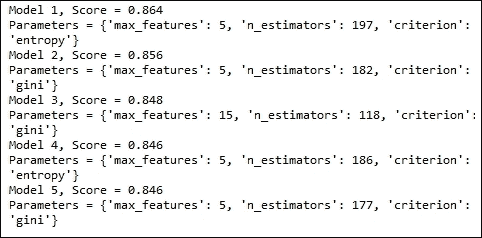
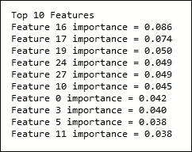
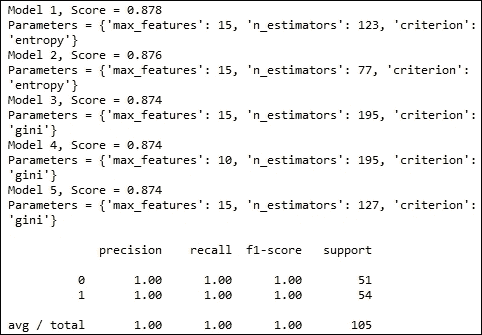

# 九、种植树木

在本章中，我们将介绍以下配方:

*   从树木到森林——随机森林
*   种植极度随机的树木
*   种植轮伐林


# 简介

在这一章中，我们将看到更多基于树型算法的打包方法。由于它们对噪声的鲁棒性和对各种问题的普遍适用性，它们在数据科学界非常受欢迎。

与其他方法相比，这些方法中的大多数方法可以在零数据准备的情况下获得非常好的结果，并且它们可以作为软件工程师手中的黑盒工具提供。

除了前面段落中的夸大其词之外，还有一些其他的优势。

通过设计，bagging 非常适合并行化。因此，这些方法可以很容易地应用于集群环境中非常大的数据集。

决策树算法在树的每一层将输入数据分成不同的区域。因此，它们执行隐式特征选择。特征选择是构建好模型的最重要的任务之一。通过提供隐含的特征选择，与其他技术相比，决策树处于有利的位置。因此，用决策树装袋带来了这个优势。

决策树几乎不需要数据准备。例如，考虑属性的缩放。属性标度对决策树的结构没有影响。此外，缺失值不会影响决策树。离群值对决策树的影响也非常小。

在我们早期的一些配方中，我们使用了仅保留交互组件的多项式特性。有了一群树，这些相互作用就被照顾到了。我们不必进行显式的功能转换来适应功能交互。

在输入数据中存在非线性关系的情况下，基于线性回归的模型会失败。我们在解释内核 PCA 配方时看到了这种效果。基于树的算法不受数据中非线性关系的影响。

对基于树的方法的主要抱怨之一是难以修剪树木以避免过度拟合。大树也倾向于适应底层数据中存在的噪声，因此导致低偏差和高方差。然而，当我们种植很多树，并且最终预测是集合中所有树的输出的平均值时，我们避免了方差的问题。

在这一章中，我们将看到三种基于树的集成方法。

我们的第一个方法是关于为分类问题实现随机森林。Leo Breiman 是这种算法的发明者。随机森林是一种集成技术，它在内部利用大量的树来生成模型，以解决任何回归或分类问题。

我们的第二个配方是关于极度随机化的树，一种与随机森林有很小不同的算法。与随机森林相比，通过在程序中引入更多的随机化，它声称可以更有效地解决方差问题。此外，它具有略微降低的计算复杂度。

我们最后的食谱是关于轮伐期森林的。前两种方法需要大量的树作为其整体的一部分，以实现良好的性能。轮换制森林声称他们可以用更少的树达到相似或更好的效果。此外，该算法的作者声称底层估计器可以是除了树之外的任何东西。通过这种方式，它被投影为用于构建类似于梯度增强的集成的新框架。


# 从树木到森林——随机森林

随机森林方法构建了许多彼此不相关的树(森林)。给定一个分类或回归问题，该方法继续构建大量的树，并且最终的预测或者是整个森林回归预测的平均值，或者是多数投票分类。

这应该提醒你装袋。随机森林是另一种打包方法。bagging 背后的基本思想是使用许多噪声估计器，通过求平均值来处理噪声，从而减少最终输出的方差。即使训练数据集中非常小的噪声也会严重影响树木。因此，作为一个噪声估计，他们是一个理想的候选人装袋。

让我们写下构建随机森林的步骤。森林中所需的树的数量是由用户指定的参数。设 T 为需要建造的树的数量:

我们从从 1 到 T 的迭代开始，也就是说，我们构建 T 树:

*   对于每棵树，从我们的输入数据集中抽取一个大小为 D 的引导样本。
*   我们继续将树 t 拟合到输入数据:

    *   随机选择 m 个属性。
    *   使用预定义的标准选择最佳属性作为分割变量。
    *   将数据集一分为二。记住，树在本质上是二元的。在树的每一层，输入数据集被一分为二。
    *   我们继续在我们分割的数据集上递归地执行前面的三个步骤。

*   最后，我们返回 T 树。

为了对一个新实例进行预测，我们在 T 中的所有树中进行多数投票来进行分类；对于回归，我们取 t 中每棵树 t 返回的平均值。

我们之前说过，随机森林会构建不相关的树。让我们看看集合中的各种树是如何相互不相关的。通过从每棵树的数据集中提取一个引导样本，我们确保数据的不同部分呈现给不同的树。这样，每棵树都试图对数据集的不同特征进行建模。因此，我们坚持在基础估计量中引入变异的总体规则。但这并不保证底层树之间完全不相关。当我们做节点分裂时，我们不选择所有的属性；相反，我们随机选择属性的子集。通过这种方式，我们试图确保我们的树彼此不相关。

与 Boosting 相比，在 Boosting 中，我们的估计器集合是弱分类器，在随机森林中，我们构建具有最大深度的树，以便它们完美地拟合自举样本，从而导致低偏差。结果是引入了高方差。然而，通过建立大量的树并使用平均原则进行最终预测，我们希望解决这个方差问题。

让我们进入随机森林的食谱。


## 准备就绪

我们将生成一些分类数据集来演示随机森林算法。我们将利用 scikit-learn 在 ensemble 模块中实现的随机森林。


## 怎么做...

我们将从开始加载所有必要的库。让我们利用来自`sklearn.dataset`模块的`make_classification`方法来生成训练数据，以演示随机森林:

```
from sklearn.datasets import make_classification
from sklearn.metrics import classification_report, accuracy_score
from sklearn.cross_validation import train_test_split
from sklearn.ensemble import RandomForestClassifier
from sklearn.grid_search import RandomizedSearchCV
from operator import itemgetter

import numpy as np

def get_data():
    """
    Make a sample classification dataset
    Returns : Independent variable y, dependent variable x
    """
    no_features = 30
    redundant_features = int(0.1*no_features)
    informative_features = int(0.6*no_features)
    repeated_features = int(0.1*no_features)
    x,y = make_classification(n_samples=500,n_features=no_features,flip_y=0.03,\
            n_informative = informative_features, n_redundant = redundant_features \
            ,n_repeated = repeated_features,random_state=7)
    return x,y
```

我们现在将编写函数`build_forest`来构建完全生长的树，并继续评估森林的性能。然后，我们将编写可用于搜索森林最佳参数的方法:

```
def build_forest(x,y,x_dev,y_dev):
    """
    Build a random forest of fully grown trees
    and evaluate peformance
    """
    no_trees = 100
    estimator = RandomForestClassifier(n_estimators=no_trees)
    estimator.fit(x,y)

    train_predcited = estimator.predict(x)
    train_score = accuracy_score(y,train_predcited)
    dev_predicted = estimator.predict(x_dev)
    dev_score = accuracy_score(y_dev,dev_predicted)

    print "Training Accuracy = %0.2f Dev Accuracy = %0.2f"%(train_score,dev_score)

def search_parameters(x,y,x_dev,y_dev):
    """
    Search the parameters of random forest algorithm
    """
    estimator = RandomForestClassifier()
    no_features = x.shape[1]
    no_iterations = 20
    sqr_no_features = int(np.sqrt(no_features))

    parameters = {"n_estimators"      : np.random.randint(75,200,no_iterations),
                 "criterion"         : ["gini", "entropy"],
                 "max_features"      : [sqr_no_features,sqr_no_features*2,sqr_no_features*3,sqr_no_features+10]
                 }

    grid = RandomizedSearchCV(estimator=estimator,param_distributions=parameters,\
    verbose=1, n_iter=no_iterations,random_state=77,n_jobs=-1,cv=5)
    grid.fit(x,y)
    print_model_worth(grid,x_dev,y_dev)

    return grid.best_estimator_

def print_model_worth(grid,x_dev,y_dev):    
    # Print the goodness of the models
    # We take the top 5 models
    scores = sorted(grid.grid_scores_, key=itemgetter(1), reverse=True) [0:5]

    for model_no,score in enumerate(scores):
        print "Model %d, Score = %0.3f"%(model_no+1,score.mean_validation_score)
        print "Parameters = {0}".format(score.parameters)
    print
    dev_predicted = grid.predict(x_dev)

    print classification_report(y_dev,dev_predicted)
```

最后，我们编写一个主函数来调用我们之前定义的函数:

```
if __name__ == "__main__":
    x,y = get_data()    

    # Divide the data into Train, dev and test    
    x_train,x_test_all,y_train,y_test_all = train_test_split(x,y,test_size = 0.3,random_state=9)
    x_dev,x_test,y_dev,y_test = train_test_split(x_test_all,y_test_all,test_size=0.3,random_state=9)

    build_forest(x_train,y_train,x_dev,y_dev)
    model = search_parameters(x,y,x_dev,y_dev)
    get_feature_importance(model)
```


## 它是如何工作的……

让我们从我们的主要功能开始。我们调用 get_data 来获取预测器属性`x`和响应属性`y`。在`get_data`内部，我们利用`make_classification`数据集为随机森林生成训练数据:

```
def get_data():
    """
    Make a sample classification dataset
    Returns : Independent variable y, dependent variable x
    """
    no_features = 30
    redundant_features = int(0.1*no_features)
    informative_features = int(0.6*no_features)
    repeated_features = int(0.1*no_features)
    x,y = make_classification(n_samples=500,n_features=no_features,flip_y=0.03,\
            n_informative = informative_features, n_redundant = redundant_features \
            ,n_repeated = repeated_features,random_state=7)
    return x,y
```

让我们看看传递给`make_classification`方法的参数。第一个参数是所需的实例数量；在这种情况下，我们说我们需要 500 个实例。第二个参数是每个实例所需的属性数量。我们说我们需要 30 个。第三个参数`flip_y`，随机交换 3%的实例。这样做是为了在我们的数据中引入一些噪声。下一个参数指定了这 30 个特征中的特征数量，这应该足以提供用于我们分类的信息。我们已经指定了 60%的特征，也就是 30 个特征中的 18 个应该是信息性的。下一个参数是关于冗余功能。这些是作为信息特征的线性组合产生的，以便在特征之间引入相关性。最后，重复特征是从信息特征和冗余特征中随机抽取的重复特征。

让我们使用`train_test_split`将数据分成训练集和测试集。我们保留 30%的数据用于测试:

```
    # Divide the data into Train, dev and test    
    x_train,x_test_all,y_train,y_test_all = train_test_split(x,y,test_size = 0.3,random_state=9)
```

我们再次利用`train_test_split`将我们的测试数据分成开发和测试:

```
    x_dev,x_test,y_dev,y_test = train_test_split(x_test_all,y_test_all,test_size=0.3,random_state=9)
```

将数据划分为构建、评估和测试模型，我们继续构建我们的模型:

```
build_forest(x_train,y_train,x_dev,y_dev)
```

我们使用训练和开发数据调用`build_forest`函数来构建随机森林模型。让我们看看这个函数的内部:

```
    no_trees = 100
    estimator = RandomForestClassifier(n_estimators=no_trees)
    estimator.fit(x,y)

    train_predcited = estimator.predict(x)
    train_score = accuracy_score(y,train_predcited)
    dev_predicted = estimator.predict(x_dev)
    dev_score = accuracy_score(y_dev,dev_predicted)

    print "Training Accuracy = %0.2f Dev Accuracy = %0.2f"%(train_score,dev_score)
```

我们需要 100 棵树，所以我们使用变量`no_trees`来定义树的数量。我们利用 scikit 中的`RandomForestClassifier`类——从头到尾学习检查和应用。如您所见，我们将所需的树的数量作为参数传递。然后，我们继续拟合我们的模型。

现在，让我们为我们的训练和开发数据找到模型准确度分数:


还不错！在我们的开发集上，我们已经达到了 83%的准确率。让我们看看我们是否能提高分数。森林还有其他参数可以调整，以获得更好的模型。关于可以调整的参数列表，请参考以下链接:

[http://sci kit-learn . org/stable/modules/generated/sk learn . ensemble . randomforestclassifier . html](http://scikit-learn.org/stable/modules/generated/sklearn.ensemble.RandomForestClassifier.html)

我们使用训练和开发数据调用函数`search_parameters`来调整随机森林模型的各种参数。

在前面的一些方法中，我们使用 GridSearchCV 在参数空间中搜索，以找到最佳的参数组合。GridSearchCV 执行非常彻底的搜索。然而，在这个食谱中，我们将使用 RandomizedSearchCV。我们为每个参数提供参数值的分布，并指定所需的迭代次数。对于每次迭代，RandomizedSearchCV 将从参数分布中选取一个样本值并拟合模型:

```
parameters = {"n_estimators" : np.random.randint(75,200,no_iterations),
"criterion" : ["gini", "entropy"],
"max_features" : [sqr_no_features,sqr_no_features*2,sqr_no_features*3,sqr_no_features+10]
}
```

我们像在 GridSearchCV 中一样提供了一个参数字典。在我们的例子中，我们想要试验三个参数。

第一个是模型中的树的数量，由`n_estimators`参数表示。通过调用 randint 函数，我们得到一个介于 75 和 200 之间的整数列表。树的大小由`no_iterations`参数定义:

```
no_iterations = 20
```

这是我们将传递给 RandomizedSearchCV 的参数，表示我们想要执行的迭代次数。从这个`20`元素的数组中，RandomizedSearchCV 将为每次迭代抽取一个值。

我们的下一个参数是标准，我们在基尼和熵之间随机选择，并在每次迭代中使用它作为分裂节点的标准。

最重要的参数`max_features`定义了算法在分割每个节点时应该选取的特征数量。在我们描述随机森林的伪代码中，我们已经指定在节点的每次分裂中我们需要随机选取 m 个属性。参数`max_features`定义了 m。这里我们给出了一个包含四个值的列表。变量`sqr_no_features`是输入数据集中可用属性数量的平方根:

```
sqr_no_features = int(np.sqrt(no_features))
```

列表中的其他值是平方根的一些变体。

让我们用这个参数分布实例化 RandomizedSearchCV:

```
grid = RandomizedSearchCV(estimator=estimator,param_distributions=parameters,\
verbose=1, n_iter=no_iterations,random_state=77,n_jobs=-1,cv=5)
```

第一个参数是我们试图优化其参数的基础估计量。这是我们的`RandomForestClassifier`:

```
estimator = RandomForestClassifier()
```

第二个参数`param_distributions`是由字典参数定义的分布。我们使用参数`n_iter`定义迭代次数，即我们想要运行 RandomForestClassifier 的次数。使用`cv`参数，我们指定了交叉验证的数量`5`交叉验证在我们的例子中。

让我们继续拟合模型，看看模型的结果如何:

```
grid.fit(x,y)
print_model_worth(grid,x_dev,y_dev)
```


正如你所看到的，我们有五个折叠，也就是说，我们希望在我们的每次迭代中进行五个折叠的交叉验证。我们总共有`20`次迭代，因此，我们将构建 100 个模型。

让我们看看函数`print_model_worth`的内部。我们将网格对象和开发数据集传递给这个函数。网格对象将它构建的每个模型的评估度量存储在一个名为`grid_scores_ of type`列表的属性中。让我们按照的降序排列这个列表，以构建最佳模型:

```
scores = sorted(grid.grid_scores_, key=itemgetter(1), reverse=True) [0:5]
```

正如您从索引中看到的，我们选择了前五个型号。我们继续打印这些型号的详细信息:

```
for model_no,score in enumerate(scores):
print "Model %d, Score = %0.3f"%(model_no+1,score.mean_validation_score)
print "Parameters = {0}".format(score.parameters)
print
```

我们首先打印评估分数，然后是模型的参数:



我们已经按照得分降序排列了模式，因此在开始时显示了最佳的模型参数。我们将选择这些参数作为我们的模型参数。属性`best_estimator_ will`返回带有这些参数的模型。

让我们使用这些参数并测试我们的开发数据:

```
dev_predicted = grid.predict(x_dev)
print classification_report(y_dev,dev_predicted)
```

预测函数将在内部使用`best_estimtor`:


太好了！我们有一个分类准确率为 100%的完美模型。


## 还有更多……

在内部，`RandomForestClassifier`使用`DecisionTreeClassifier`。请参考以下链接，了解构建决策树所传递的所有参数:

[http://sci kit-learn . org/stable/modules/generated/sk learn . tree . decision tree classifier . html](http://scikit-learn.org/stable/modules/generated/sklearn.tree.DecisionTreeClassifier.html)

我们感兴趣的一个参数是 splitter。拆分器的默认值设置为最佳。基于`max_features`属性，实现将在内部选择拆分机制。可用的拆分机制包括:

*   最佳:从由`max_features`参数定义的给定属性集中选择可能的最佳分割
*   随机:随机选择一个分割属性

您可能已经注意到，在实例化一个`RandomForestClassifier`时，这个参数是不可用的。控制的唯一方法是给`max_features`参数一个小于数据集中可用属性数量的值。

在工业中，随机森林广泛用于变量选择。在 Scikit learn 中，使用基尼系数计算变量重要性。用于节点分裂的基尼和熵标准都通过将数据集分裂成具有高杂质的子集的能力来识别分裂节点的最佳属性，以便后续分裂导致良好的分类。变量的重要性取决于它可能引入分割数据集中的杂质数量。更多详情请参考以下书籍:

> *Breiman，Friedman，“分类和回归树”，1984 年。*

我们可以编写一个小函数来打印重要的特性:

```
def get_feature_importance(model):
    feature_importance = model.feature_importances_
    fm_with_id = [(i,importance) for i,importance in enumerate(feature_importance)]
    fm_with_id = sorted(fm_with_id, key=itemgetter(1),reverse=True)[0:10]
    print "Top 10 Features"
    for importance in fm_with_id:
        print "Feature %d importance = %0.3f"%(importance[0],importance[1])
    print
```

随机森林对象有一个名为`feature_importances_`的变量。我们使用这个变量并创建一个具有特征号和重要性的元组列表:

```
    feature_importance = model.feature_importances_
    fm_with_id = [(i,importance) for i,importance in enumerate(feature_importance)]
```

我们继续按重要性降序排列，仅选择前 10 项功能:

```
    fm_with_id = sorted(fm_with_id, key=itemgetter(1),reverse=True)[0:10]
```

然后，我们打印出 10 大特征:



随机森林的另一个有趣的方面是`Out-of-Bag estimation (OOB)`。请记住，我们最初从数据集中为森林中生长的每棵树进行引导。由于引导，一些记录将不会在一些树中使用。假设记录 1 在我们森林中的 100 棵树中使用，而在 150 棵树中没有使用。然后，我们可以使用这 150 棵树来预测该记录的分类标签，以计算出该记录的分类错误。袋外估算可以用来有效地评估我们的森林质量。以下 URL 给出了如何有效使用 OOB 的示例:

[http://sci kit-learn . org/dev/auto _ examples/ensemble/plot _ ensemble _ OOB . html](http://scikit-learn.org/dev/auto_examples/ensemble/plot_ensemble_oob.html)

Scikit learn 中的 RandomForestClassifier 类派生自`ForestClassifier`。相同内容的源代码可在以下链接中找到:

[https://github . com/scikit-learn/scikit-learn/blob/a 95203 b/硬化/总成/forest.py#L318](https://github.com/scikit-learn/scikit-learn/blob/a95203b/sklearn/ensemble/forest.py#L318)

当我们调用 RandomForestClassifier 中的 predict 方法时，它在内部调用 ForestClassifier 中定义的`predict_proba`方法。这里，最终的预测不是基于投票，而是通过平均来自森林内不同树的每个类的概率，并基于最高概率决定最终的类。

Leo Breiman 关于随机森林的原始论文可从以下链接下载:

[http://link . springer . com/article/10.1023% 2FA % 3a 1010933404324](http://link.springer.com/article/10.1023%2FA%3A1010933404324)

你也可以参考利奥·布雷曼和阿黛尔·卡特勒的网站:

[https://www . stat . Berkeley . edu/~ brei man/random forests/cc _ home . htm](https://www.stat.berkeley.edu/~breiman/RandomForests/cc_home.htm)


## 参见

*   *构建决策树解决多类问题*秘方[第六章](part0073_split_000.html#25JP21-6b04b7c0b98f44a0b8f82924fef317ec "Chapter 6. Machine Learning 1")、*机器学习 I*
*   *了解系综，[第八章](part0083_split_000.html#2F4UM1-6b04b7c0b98f44a0b8f82924fef317ec "Chapter 8. Ensemble Methods")中的*配方，*模型选择与评估*
*   *了解系综，装袋方法*第八章[中的配方](part0083_split_000.html#2F4UM1-6b04b7c0b98f44a0b8f82924fef317ec "Chapter 8. Ensemble Methods")，*模型选择和评估*


# 生长极度随机化的树木

极度随机化的树，也称为额外树算法，在两个方面不同于前面配方中描述的随机森林:

1.  它不使用引导来为集合中的每棵树选择实例；相反，它使用完整的训练数据集。
2.  给定 K 作为在给定节点随机选择的属性的数量，它选择一个随机切割点，而不考虑目标变量。

正如你在前面的配方中看到的，随机森林在两个地方使用了随机化。首先，选择用于森林中的训练树的实例；使用 bootstrap 来选择训练实例。其次，在每个节点上随机选择一组属性。其中一个属性是根据基尼系数或熵标准选择的。极度随机化的树更进一步，随机选择分裂属性。

在下面的论文中提出了极度随机化的树:

p .热尔茨，d .恩斯特。，和 L. Wehenkel，“极度随机化的树”，机器学习，63(1)，3-42，2006 。

根据这篇论文，除了前面列出的技术方面之外，还有两个方面使得极度随机化的树更合适:

额外树方法背后的基本原理是，与其他方法使用的较弱随机化方案相比，与整体平均相结合的分界点和属性的显式随机化应该能够更强地减少方差。

与随机森林相比，分界点的随机化(选择在每个节点分割数据集的属性)与分界点的随机化相结合，即忽略任何标准，最后对每棵树的结果进行平均，将在未知数据集上产生更好的性能。

第二个优势与计算复杂性有关:

从计算的角度来看，假设树是平衡的，树生长过程的复杂度在学习样本大小的 N log N 的数量级上，像大多数其他树生长过程一样。然而，考虑到节点分裂过程的简单性，我们期望常数因子比其他局部优化切割点的基于集成的方法小得多

由于在识别要分割的最佳属性时不花费任何计算时间，因此该方法比随机森林的计算效率更高。

让我们写下构建极其随机的树的步骤。森林中所需的树的数量通常由用户指定。设 T 是需要建造的树的数量。

我们从从 1 到 T 的迭代开始，也就是说，我们构建 T 树:

*   对于每棵树，我们选择完整的输入数据集。
*   然后，我们继续将树 t 拟合到输入数据:

    *   随机选择 m 个属性。
    *   随机选择一个属性作为分裂变量。
    *   将数据集一分为二。记住树在本质上是二元的。在树的每一层，输入数据集被一分为二。
    *   对我们分割的数据集递归执行前面三个步骤。

*   最后，我们返回 T 树。
*   让我们来看看极度随机化的树的配方。


## 正在准备…

我们将生成一些分类数据集来展示极度随机化的树。为此，我们将利用 Scikit Learn 的极度随机化树集合模块的实现。


## 怎么做...

我们从加载所有必要的库开始。让我们利用来自`sklearn.dataset`模块的`make_classification`方法来生成训练数据:

```
from sklearn.datasets import make_classification
from sklearn.metrics import classification_report, accuracy_score
from sklearn.cross_validation import train_test_split, cross_val_score
from sklearn.ensemble import ExtraTreesClassifier
from sklearn.grid_search import RandomizedSearchCV
from operator import itemgetter

def get_data():
 """
 Make a sample classification dataset
 Returns : Independent variable y, dependent variable x
 """
 no_features = 30
 redundant_features = int(0.1*no_features)
 informative_features = int(0.6*no_features)
 repeated_features = int(0.1*no_features)
 x,y = make_classification(n_samples=500,n_features=no_features,flip_y=0.03,\
 n_informative = informative_features, n_redundant = redundant_features \
 ,n_repeated = repeated_features,random_state=7)
    return x,y
```

我们编写函数`build_forest`，在这里我们将构建完全成长的树，并继续评估森林的性能:

```
def build_forest(x,y,x_dev,y_dev):
    """
    Build a Extremely random tress
    and evaluate peformance
    """
    no_trees = 100
    estimator = ExtraTreesClassifier(n_estimators=no_trees,random_state=51)
    estimator.fit(x,y)

    train_predcited = estimator.predict(x)
    train_score = accuracy_score(y,train_predcited)
    dev_predicted = estimator.predict(x_dev)
    dev_score = accuracy_score(y_dev,dev_predicted)

    print "Training Accuracy = %0.2f Dev Accuracy = %0.2f"%(train_score,dev_score)
    print "cross validated score"
    print cross_val_score(estimator,x_dev,y_dev,cv=5)

def search_parameters(x,y,x_dev,y_dev):
    """
    Search the parameters 
    """
    estimator = ExtraTreesClassifier()
    no_features = x.shape[1]
    no_iterations = 20
    sqr_no_features = int(np.sqrt(no_features))

    parameters = {"n_estimators"      : np.random.randint(75,200,no_iterations),
                 "criterion"         : ["gini", "entropy"],
                 "max_features"      : [sqr_no_features,sqr_no_features*2,sqr_no_features*3,sqr_no_features+10]
                 }

    grid = RandomizedSearchCV(estimator=estimator,param_distributions=parameters,\
    verbose=1, n_iter=no_iterations,random_state=77,n_jobs=-1,cv=5)
    grid.fit(x,y)
    print_model_worth(grid,x_dev,y_dev)

    return grid.best_estimator_
```

最后，我们编写一个主函数来调用我们已经定义的函数:

```
if __name__ == "__main__":
    x,y = get_data()    

    # Divide the data into Train, dev and test    
    x_train,x_test_all,y_train,y_test_all = train_test_split(x,y,test_size = 0.3,random_state=9)
    x_dev,x_test,y_dev,y_test = train_test_split(x_test_all,y_test_all,test_size=0.3,random_state=9)

    build_forest(x_train,y_train,x_dev,y_dev)
    model = search_parameters(x,y,x_dev,y_dev)
```


## 它是如何工作的……

让我们从我们的主函数开始。我们调用`get_data`来获取响应属性中的预测器属性。在`get_data`中，我们利用 make_classification 数据集为我们的菜谱生成训练数据，如下所示:

```
def get_data():
    """
    Make a sample classification dataset
    Returns : Independent variable y, dependent variable x
    """
    no_features = 30
    redundant_features = int(0.1*no_features)
    informative_features = int(0.6*no_features)
    repeated_features = int(0.1*no_features)
    x,y = make_classification(n_samples=500,n_features=no_features,flip_y=0.03,\
            n_informative = informative_features, n_redundant = redundant_features \
            ,n_repeated = repeated_features,random_state=7)
    return x,y
```

让我们看看传递给`make_classification`方法的参数。第一个参数是所需实例的数量；在这种情况下，我们说我们需要 500 个实例。第二个参数是每个实例所需的属性数量。我们说我们需要 30 个。第三个参数`flip_y`，随机交换 3%的实例。这样做是为了在我们的数据中引入一些噪声。下一个参数指定了这 30 个特征中的特征的数量，这些特征应该足够丰富以用于我们的分类。我们已经指定了 60%的特征，也就是 30 个特征中的 18 个应该是信息性的。下一个参数是关于冗余功能。这些是作为信息特征的线性组合产生的，以便在特征之间引入相关性。最后，重复特征是从信息特征和冗余特征中随机抽取的重复特征。

让我们使用`train_test_split`将数据分成训练和测试集。我们保留 30%的数据用于测试:

```
    # Divide the data into Train, dev and test    
    x_train,x_test_all,y_train,y_test_all = train_test_split(x,y,test_size = 0.3,random_state=9)
```

我们再次利用 train_test_split 将我们的测试数据分成开发和测试两部分:

```
    x_dev,x_test,y_dev,y_test = train_test_split(x_test_all,y_test_all,test_size=0.3,random_state=9)
```

将数据划分为构建、评估和测试模型，我们继续构建我们的模型:

```
build_forest(x_train,y_train,x_dev,y_dev)
```

我们用我们的训练和开发数据调用`build_forest`函数来构建我们的极度随机化的树模型。让我们看看这个函数的内部:

```
no_trees = 100
    estimator = ExtraTreesClassifier(n_estimators=no_trees,random_state=51)
    estimator.fit(x,y)

    train_predcited = estimator.predict(x)
    train_score = accuracy_score(y,train_predcited)
    dev_predicted = estimator.predict(x_dev)
    dev_score = accuracy_score(y_dev,dev_predicted)

    print "Training Accuracy = %0.2f Dev Accuracy = %0.2f"%(train_score,dev_score)
    print "cross validated score"
    print cross_val_score(estimator,x_dev,y_dev,cv=5)
```

我们需要 100 棵树，所以我们使用变量 no_trees 来定义树的数量。我们利用 Scikit learn 中的`ExtraTreesClassifier`类。如您所见，我们将所需的树的数量作为参数传递。这里需要注意的一点是参数 bootstrap。有关 ExtraTreesClassifier 的参数，请参考下面的URL:

[http://sci kit-learn . org/stable/modules/generated/sk learn . ensemble . extractreesclassifier . html](http://scikit-learn.org/stable/modules/generated/sklearn.ensemble.ExtraTreesClassifier.html)

参数 bootstrap 默认设置为`False`。将其与以下 URL 给出的`RandomForestClassifier` 引导参数进行比较:

[http://sci kit-learn . org/stable/modules/generated/sk learn . ensemble . randomforestclassifier . html](http://scikit-learn.org/stable/modules/generated/sklearn.ensemble.RandomForestClassifier.html)

如前所述，森林中的每棵树都用所有的记录来训练。

我们继续拟合我们的模型，如下所示:

```
    train_predcited = estimator.predict(x)
```

然后，我们继续为我们的训练和开发数据寻找模型准确度分数:

```
    train_score = accuracy_score(y,train_predcited)
    dev_predicted = estimator.predict(x_dev)
    dev_score = accuracy_score(y_dev,dev_predicted)
```

让我们打印培训和开发数据集的分数:

```
    print "Training Accuracy = %0.2f Dev Accuracy = %0.2f"%(train_score,dev_score)
```


现在让我们做一个五重交叉验证来看看模型预测:


相当不错的结果。我们对其中一个褶皱几乎有 90%的准确率。我们可以像对随机森林那样在参数空间中进行随机搜索。让我们用我们的训练和测试数据集调用函数`search_parameters`。关于 RandomizedSearchCV 的解释，请参考前面的配方。然后我们将打印`search_parameters`函数的输出:



正如在之前的配方中，我们已经按照得分降序排列了模型，因此在开始时显示了最佳的模型参数。我们将选择这些参数作为我们的模型参数。属性`best_estimator_ will`返回带有这些参数的模型。

您接下来看到的是为最佳评估者生成的分类报告。预测函数将使用`best_estimator_ internally`。该报告由以下代码生成:

```
dev_predicted = grid.predict(x_dev)
print classification_report(y_dev,dev_predicted)
```

太好了！我们有一个分类准确率为 100%的完美模型。


## 还有更多……

极度随机化的树在时间序列分类问题中非常流行。有关更多信息，请参考以下文件:

> 热尔茨博士、布兰科·单面山博士和韦汉高博士(2005 年 a)。生物序列分类的分段组合方法。《IEEE 生物信息学和计算生物学中的计算智能研讨会论文集》, 194–201。


## 参见

*   *构建决策树解决多类问题*秘方[第六章](part0073_split_000.html#25JP21-6b04b7c0b98f44a0b8f82924fef317ec "Chapter 6. Machine Learning 1")、*机器学习 I*
*   *了解系综，装袋方法*第八章[中的配方](part0083_split_000.html#2F4UM1-6b04b7c0b98f44a0b8f82924fef317ec "Chapter 8. Ensemble Methods")，*模型选择和评估*
*   *从树木生长到森林，随机森林*配方[第九章](part0087_split_000.html#2IV0U1-6b04b7c0b98f44a0b8f82924fef317ec "Chapter 9. Growing Trees")，*机器学习 III*


# 生长轮伐期森林

随机森林和 Bagging 通过非常大的集合给出了令人印象深刻的结果；拥有大量的估计量会提高这些方法的准确性。相反，轮转式目录林设计用于较少数量的系综。

让我们写下构建轮转目录林的步骤。森林中所需的树的数量通常由用户指定。设 T 是需要建造的树的数量。

我们从从 1 到 T 的迭代开始，也就是说，我们构建 T 树。

对于每个树 t，执行以下步骤:

*   将训练集中的属性分成 K 个大小相等的非重叠子集。
*   我们有 K 个数据集，每个数据集有 K 个属性。对于 K 个数据集中的每一个，我们进行如下操作:从每个 K 个数据集中抽取 75%的数据，并使用被抽取的样本进行进一步的步骤:

    *   对 K 中的第 I 个子集运行主成分分析。保留所有主成分。对于第 k 个子集中的每个特征 j，我们有一个主分量 a。让我们将其表示为 aij，它是第 I 个子集中第 j 个属性的主分量。
    *   存储主成分子集。

*   创建一个大小为 n X n 的旋转矩阵，其中 n 是属性的总数。排列矩阵中的主要分量，使这些分量与原始训练数据集中的特征位置相匹配。
*   使用矩阵乘法将训练数据集投影到旋转矩阵上。
*   使用投影数据集构建决策树。
*   存储树和旋转矩阵。

有了这些知识，让我们跳到我们的食谱。


## 正在准备…

我们将生成一些分类数据集来演示旋转森林。据我们所知，没有可用于旋转森林的 Python 实现。因此，我们将编写自己的代码。我们将利用 Scikit Learn 的决策树分类器实现，并使用`train_test_split`方法进行引导。


## 怎么做...

我们将从加载所有必要的库开始。让我们利用来自`sklearn.dataset`模块的`make_classification`方法来生成训练数据。我们用一种叫做`gen_random_subset`的方法来选择属性的随机子集:

```
from sklearn.datasets import make_classification
from sklearn.metrics import classification_report
from sklearn.cross_validation import train_test_split
from sklearn.decomposition import PCA
from sklearn.tree import DecisionTreeClassifier
import numpy as np

def get_data():
    """
    Make a sample classification dataset
    Returns : Independent variable y, dependent variable x
    """
    no_features = 50
    redundant_features = int(0.1*no_features)
    informative_features = int(0.6*no_features)
    repeated_features = int(0.1*no_features)
    x,y = make_classification(n_samples=500,n_features=no_features,flip_y=0.03,\
            n_informative = informative_features, n_redundant = redundant_features \
            ,n_repeated = repeated_features,random_state=7)
    return x,y

def get_random_subset(iterable,k):
    subsets = []
    iteration = 0
    np.random.shuffle(iterable)
    subset = 0
    limit = len(iterable)/k
    while iteration < limit:
        if k <= len(iterable):
            subset = k
        else:
            subset = len(iterable)
        subsets.append(iterable[-subset:])
        del iterable[-subset:]
        iteration+=1
    return subsets
```

我们现在为编写一个函数`build_rotationtree_model`，在这里我们将构建完全成长的树，并使用函数`model_worth`继续评估森林的性能:

```
def build_rotationtree_model(x_train,y_train,d,k):
    models = []
    r_matrices = []
    feature_subsets = []
    for i in range(d):
        x,_,_,_ = train_test_split(x_train,y_train,test_size=0.3,random_state=7)
        # Features ids
        feature_index = range(x.shape[1])
        # Get subsets of features
        random_k_subset = get_random_subset(feature_index,k)
        feature_subsets.append(random_k_subset)
        # Rotation matrix
        R_matrix = np.zeros((x.shape[1],x.shape[1]),dtype=float)
        for each_subset in random_k_subset:
            pca = PCA()
            x_subset = x[:,each_subset]
            pca.fit(x_subset)
            for ii in range(0,len(pca.components_)):
                for jj in range(0,len(pca.components_)):
                    R_matrix[each_subset[ii],each_subset[jj]] = pca.components_[ii,jj]

        x_transformed = x_train.dot(R_matrix)

        model = DecisionTreeClassifier()
        model.fit(x_transformed,y_train)
        models.append(model)
        r_matrices.append(R_matrix)
    return models,r_matrices,feature_subsets

def model_worth(models,r_matrices,x,y):

    predicted_ys = []
    for i,model in enumerate(models):
        x_mod =  x.dot(r_matrices[i])
        predicted_y = model.predict(x_mod)
        predicted_ys.append(predicted_y)

    predicted_matrix = np.asmatrix(predicted_ys)
    final_prediction = []
    for i in range(len(y)):
        pred_from_all_models = np.ravel(predicted_matrix[:,i])
        non_zero_pred = np.nonzero(pred_from_all_models)[0]  
        is_one = len(non_zero_pred) > len(models)/2
        final_prediction.append(is_one)

    print classification_report(y, final_prediction)
```

最后，我们编写一个主函数来调用我们之前定义的函数:

```
if __name__ == "__main__":
    x,y = get_data()    
#    plot_data(x,y)

    # Divide the data into Train, dev and test    
    x_train,x_test_all,y_train,y_test_all = train_test_split(x,y,test_size = 0.3,random_state=9)
    x_dev,x_test,y_dev,y_test = train_test_split(x_test_all,y_test_all,test_size=0.3,random_state=9)

    # Build a bag of models
    models,r_matrices,features = build_rotationtree_model(x_train,y_train,25,5)
    model_worth(models,r_matrices,x_train,y_train)
    model_worth(models,r_matrices,x_dev,y_dev)
```


## 它是如何工作的……

让我们从我们的主要功能开始。我们调用`get_data`来获取响应属性中的预测器属性。在 get_data 中，我们利用 make_classification 数据集为我们的配方生成训练数据，如下所示:

```
def get_data():
    """
    Make a sample classification dataset
    Returns : Independent variable y, dependent variable x
    """
    no_features = 30
    redundant_features = int(0.1*no_features)
    informative_features = int(0.6*no_features)
    repeated_features = int(0.1*no_features)
    x,y = make_classification(n_samples=500,n_features=no_features,flip_y=0.03,\
            n_informative = informative_features, n_redundant = redundant_features \
            ,n_repeated = repeated_features,random_state=7)
    return x,y
```

让我们看看传递给 make_classification 方法的参数。第一个参数是所需的实例数量；在这种情况下，我们说我们需要 500 个实例。第二个参数是每个实例所需的属性数量。我们说我们需要 30 个。第三个参数`flip_y`，随机交换 3%的实例。这样做是为了在我们的数据中引入一些噪声。下一个参数是关于这 30 个特征中的特征的数量，它应该提供足够的信息用于我们的分类。我们已经指定了 60%的特征，也就是 30 个特征中的 18 个应该是信息性的。下一个参数是关于冗余功能。这些是作为信息特征的线性组合产生的，以便在特征之间引入相关性。最后，重复特征是从信息特征和冗余特征中随机抽取的重复特征。

让我们使用 train_test_split 将数据分成训练集和测试集。我们保留 30%的数据用于测试:

```
    # Divide the data into Train, dev and test    
    x_train,x_test_all,y_train,y_test_all = train_test_split(x,y,test_size = 0.3,random_state=9)
```

我们再次利用 train_test_split 将我们的测试数据分成开发和测试，如下所示:

```
    x_dev,x_test,y_dev,y_test = train_test_split(x_test_all,y_test_all,test_size=0.3,random_state=9)
```

将数据划分为构建、评估和测试模型，我们继续构建我们的模型:

```
    models,r_matrices,features = build_rotationtree_model(x_train,y_train,25,5)
```

我们调用`build_rotationtree_model`函数来构建我们的旋转森林。我们传递我们的训练数据、预测器`x_train`和响应变量`y_train`、要构建的树的总数(本例中为`25`)，最后是要使用的特征子集(本例中为`5`)。

让我们跳到那个函数:

```
    models = []
    r_matrices = []
    feature_subsets = []
```

我们从开始，声明三个列表来存储每一个决策树、该树的旋转矩阵，最后是在迭代中使用的特征子集。我们继续构建我们集合中的每棵树。

首先，我们引导仅保留 75%的数据:

```
        x,_,_,_ = train_test_split(x_train,y_train,test_size=0.3,random_state=7)
```

我们利用 Scikit learn 的`train_test_split`函数进行引导。然后，我们决定如下的特征子集:

```
        # Features ids
        feature_index = range(x.shape[1])
        # Get subsets of features
        random_k_subset = get_random_subset(feature_index,k)
        feature_subsets.append(random_k_subset)
```

函数`get_random_subset`以特征索引和需要 K 个子集的个数为参数，返回 K 个子集。

在函数内部，我们打乱了特征索引。特征索引是一个数字数组，从 0 开始，以训练集中的特征数结束:

```
    np.random.shuffle(iterable)
```

假设我们有 10 个特征，并且我们的 k 值是 5，这表明我们需要具有 5 个非重叠特征索引的子集；我们需要做两次迭代。我们将所需的迭代次数存储在极限变量中:

```
    limit = len(iterable)/k
    while iteration < limit:
        if k <= len(iterable):
            subset = k
        else:
            subset = len(iterable)
        iteration+=1
```

如果我们需要的子集少于属性的总数，那么我们可以使用 iterable 中的前 k 个条目。因为我们已经改变了我们的条目，我们将在不同的时间返回不同的卷:

```
        subsets.append(iterable[-subset:])
```

在选择一个子集时，我们从 iterable 中删除它，因为我们需要不重叠的集合:

```
        del iterable[-subset:]
```

准备好所有子集后，我们将旋转矩阵声明如下:

```
        # Rotation matrix
        R_matrix = np.zeros((x.shape[1],x.shape[1]),dtype=float)
```

如您所见，我们的旋转矩阵大小为 n x n，其中 n 是数据集中属性的数量。您可以看到，我们使用了 shape 属性来声明这个用零填充的矩阵:

```
        for each_subset in random_k_subset:
            pca = PCA()
            x_subset = x[:,each_subset]
            pca.fit(x_subset)
```

对于仅具有 K 个特征的 K 个数据子集中的每一个，我们继续执行主分量分析。

我们用组件值填充旋转矩阵，如下所示:

```
            for ii in range(0,len(pca.components_)):
                for jj in range(0,len(pca.components_)):
                    R_matrix[each_subset[ii],each_subset[jj]] = pca.components_[ii,jj]
```

例如，假设我们的子集中有三个属性，总共有六个属性。举例来说，假设我们的子集是:

```
2,4,6 and 1,3,5
```

我们的旋转矩阵 R 的大小是 6 x 6。假设我们想要填充第一个特征子集的旋转矩阵。我们将有三个主要组件，大小为 1 x 3 的 2、4 和 6 各有一个。

Scikit learn 的 PCA 输出是大小分量的 X 特征的矩阵。我们在 for 循环中遍历每个组件值。在第一次运行时，我们感兴趣的特征是 2，从 PCA 输出的分量矩阵中的单元(`0`，`0`)给出了特征 2 对分量 1 的贡献值。我们必须在旋转矩阵中找到这个值的正确位置。我们使用来自分量矩阵 ii 和 jj 的索引以及子集列表来获得旋转矩阵中的正确位置:

```
                    R_matrix[each_subset[ii],each_subset[jj]] = pca.components_[ii,jj]
```

`each_subset[0]`和`each_subset[0]`将把我们放在旋转矩阵的单元格(2，2)中。当我们遍历循环时，分量矩阵的单元(0，1)中的下一个分量值将被放置在旋转矩阵的单元(2，4)中，最后一个分量值被放置在旋转矩阵的单元(2，6)中。这是针对第一个子集中的所有属性进行的。让我们来看第二个子集；这里第一个属性是 1。分量矩阵的单元(0，0)对应于旋转矩阵中的单元(1，1)。

按照这种方式进行，您会注意到属性组件值的排列顺序与属性本身的顺序相同。

准备好旋转矩阵后，让我们将输入投影到旋转矩阵上:

```
        x_transformed = x_train.dot(R_matrix)
```

现在是时候适应我们的决策树了:

```
model = DecisionTreeClassifier()
model.fit(x_transformed,y_train)
```

最后，我们存储我们的模型和相应的旋转矩阵:

```
models.append(model)
r_matrices.append(R_matrix)
```

建立了我们的模型后，让我们使用`model_worth`函数来看看我们的模型在训练和开发数据方面有多好:

```
model_worth(models,r_matrices,x_train,y_train)
model_worth(models,r_matrices,x_dev,y_dev)
```

让我们来看看我们的 model_worth 函数:

```
    for i, model in enumerate(models):
        x_mod =  x.dot(r_matrices[i])
        predicted_y = model.predict(x_mod)
        predicted_ys.append(predicted_y)
```

在函数中使用我们建立的每一棵树来执行预测。然而，在预测之前，我们使用旋转矩阵来投影我们的输入。我们将所有预测输出存储在一个名为`predicted_ys`的列表中。假设我们有 100 个实例要预测，我们的树中有 10 个模型。对于每个实例，我们有 10 个预测。为了方便起见，我们将它们存储为一个矩阵:

```
predicted_matrix = np.asmatrix(predicted_ys)
```

现在，我们开始对每个输入记录进行最终分类:

```
    final_prediction = []
    for i in range(len(y)):
        pred_from_all_models = np.ravel(predicted_matrix[:,i])
        non_zero_pred = np.nonzero(pred_from_all_models)[0]  
        is_one = len(non_zero_pred) > len(models)/2
        final_prediction.append(is_one)
```

我们将把我们的最终预测存储在一个名为`final_prediction`的列表中。我们仔细检查了我们实例的每一个预测。假设我们在第一个实例中(在我们的 for 循环中 I = 0)；`pred_from_all_models`存储模型中所有树的输出。这是一个由 0 和 1 组成的数组，表示在该实例中对模型进行分类的类。

我们用它制作了另一个数组`non_zero_pred`,其中只有来自父数组的非零条目。

最后，如果这个非零数组的长度大于我们拥有的模型数量的一半，我们说对于感兴趣的实例，我们的最终预测是 1。我们在这里完成的是经典的投票方案。

让我们通过调用`classification_report`来看看我们的模型现在有多好:

```
    print classification_report(y, final_prediction)
```

以下是我们的模型在训练集上的表现:


让我们看看我们的模型在 dev 数据集上的性能:


## 还有更多……

有关轮伐林的更多信息可以从以下文章中获得:

> *旋转森林:一种新的分类器集成方法，Juan J. Rodriguez，IEEE 计算机协会成员，Ludmila I. Kuncheva，IEEE 成员，和 Carlos J. Alonso*
> 
> 该论文还声称，当在 33 个数据集上将极度随机化的树与 Bagging、AdBoost 和 Random Forest 进行比较时，极度随机化的树优于所有其他三种算法。
> 
> *与梯度推进类似，论文作者声称，极端随机化方法是一个整体框架，底层集成不一定必须是决策树。测试其他算法的工作正在进行中，如朴素贝叶斯、神经网络等。*


## 参见

*   *提取主成分*配方[第四章](part0060_split_000.html#1P71O1-6b04b7c0b98f44a0b8f82924fef317ec "Chapter 4. Data Analysis – Deep Dive")、*分析数据-深潜*
*   *通过随机投影降低数据维度[第四章](part0060_split_000.html#1P71O1-6b04b7c0b98f44a0b8f82924fef317ec "Chapter 4. Data Analysis – Deep Dive")、*分析数据-深潜*中的*配方
*   *构建决策树解决多类问题*秘方[第六章](part0073_split_000.html#25JP21-6b04b7c0b98f44a0b8f82924fef317ec "Chapter 6. Machine Learning 1")、*机器学习 I*
*   *了解系综，[第八章](part0083_split_000.html#2F4UM1-6b04b7c0b98f44a0b8f82924fef317ec "Chapter 8. Ensemble Methods")中的*配方，*模型选择与评估*
*   *从树木生长到森林，随机森林*配方[第九章](part0087_split_000.html#2IV0U1-6b04b7c0b98f44a0b8f82924fef317ec "Chapter 9. Growing Trees")，*机器学习 III*
*   *种植极度随机化的树木*食谱[第九章](part0087_split_000.html#2IV0U1-6b04b7c0b98f44a0b8f82924fef317ec "Chapter 9. Growing Trees")，*机器学习 III*