# 六、制作交互式报告

本章涵盖以下主题:

*   创建 R 降价报告
*   学习降价语法
*   嵌入 R 代码块
*   使用`ggvis`创建交互式图形
*   理解基本的句法和语法
*   控制轴和图例
*   使用秤
*   向`ggvis`图添加交互性
*   创建一个闪亮的文档
*   发布一份闪亮的报告

# 简介

完成数据分析后，记录研究结果并与他人分享发现非常重要。最常见的方法包括通过文本、幻灯片或网页记录结果。然而，这些格式通常仅限于分享结果，并不经常包括研究过程。因此，其他研究人员无法复制这项研究，很难完全理解作者是如何进行分析的。如果不知道如何复制这项研究，这项研究的真实性可能会受到质疑。

r 脚本可以用来执行数据分析和生成图表，并且可以通过将所有代码和图像复制到一个文档中来创建可再现的报告。然而，由于这是相当劳动密集型的，因此存在出错的风险。更好的解决方案是自动化文档过程。这允许用户动态地生成任何格式的报告，记录脚本和分析结果。

有多种方法可以用来创建带有 R 包的可重现报告。然而，RStudio 用户友好的 GUI 是最佳选择之一，它允许用户使用 R Markdown 创建可重复的动态报告。在这一章中，我们将介绍如何使用 R Markdown 工作流创建、记录和编译脚本。在某些情况下，从静态数字中探索数据可能很困难。为了简化这一过程，使图表交互允许用户快速调整可视属性或数据映射。因此，我们介绍如何用`ggvis`包创建一个交互式图表。最后，我们解释如何将交互式图形嵌入到闪亮的文档中，并将闪亮的文档发布给[http://www.shinyapps.io/](http://www.shinyapps.io/)。


# 创建降价报告

RStudio 内置了一个 R Markdown 工作流；我们可以使用它的 GUI 来创建 HTML、PDF、幻灯片或 Microsoft Word 格式的降价报告。在本菜谱中，我们将介绍如何使用 RStudio 构建 R Markdown 报告。

## 准备就绪

确保您已在操作系统上安装了最新版本的 R 和 RStudio。如果您尚未安装 RStudio，请访问以下 URL 下载最新版本:

[https://www.rstudio.com/products/rstudio/download/](https://www.rstudio.com/products/rstudio/download/)

## 怎么做……

请执行以下步骤来创建 R 降价报告:

1.  首先点击**文件** | **新建文件** | **R Markdown** 菜单栏上的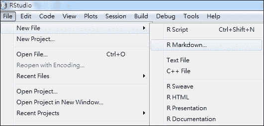

    图 1:创建一个稀有降价报告

2.  接下来，在左侧菜单中选择文档类型，然后填写**标题**和**作者**，在右侧菜单中选择输出格式: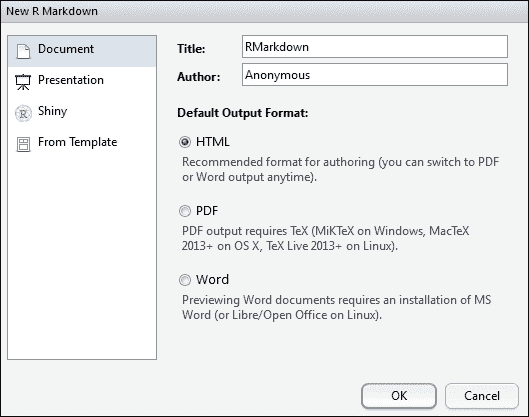

    图 2:填写 r 降价报告的元信息

3.  继续，我们现在可以看到一个带有 YAML 标题和 markdown 语法内容的 markdown 文档。您现在可以点击 **Knit HTML** 来编译和渲染一个报告: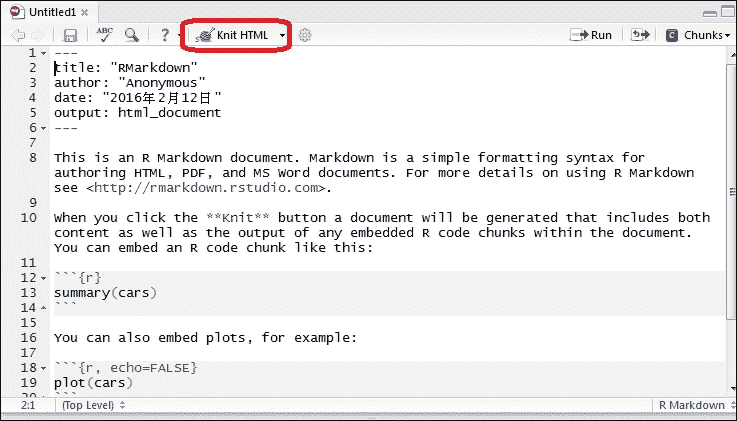

    图 3:编译一个 r 降价报告

4.  最后，系统将要求输入一个文件名。给定文件名后，RStudio 将生成一个`<filename>.rmd`和一个`<filename>.html`文件。格式化后的报表会弹出一个窗口: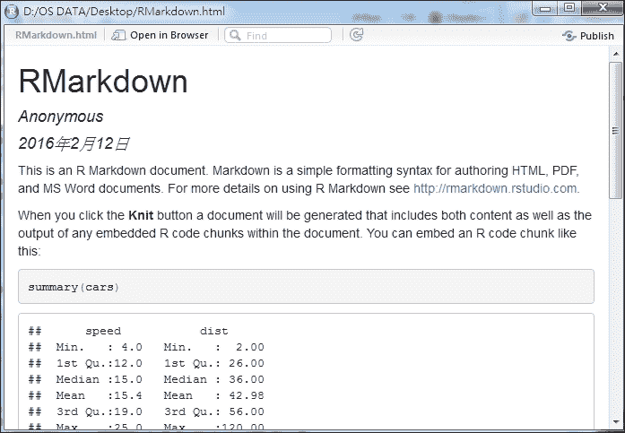

    图 4:编译后的 r 降价报告

## 它是如何工作的……

使用 RStudio 创建 R Markdown 报告是一个简单的过程。首先，确保 RStudio 安装在您的操作系统上。接下来，点击菜单栏中的 **R Markdown** 创建一个新文档。我们可以选择创建文档、演示文件、闪亮的应用程序或默认模板的文档。在这里，我们决定制定一个降价文件。接下来，我们需要填写**标题**和**作者**，并为我们的新文档选择输出格式。此时，您将看到一个新文件，其中包含 R Markdown 语法和关于如何生成 R Markdown 报告的简单说明。

在新的 R Markdown 文件中，可以找到以下格式的 YAML 标头:

```
---

title: "RMarkdown"

author: "Anonymous"

date: "2016/02/12"

output: html_document

---
```

标题、作者和输出格式是我们在创建减价报告时输入和选择的。您可以通过修改 YAML 标题来更改标题、作者和输出格式。因此，如果您想生成 PDF 文档，只需将`output`从`html_document`更改为`pdf_document`。在 YAML 头文件下面，你可以找到带有一些嵌入式 R 代码的 markdown 语法。我们可以用 markdown 语法键入报告，并在代码块之间嵌入 R 代码。

最后，用户可以点击 **Knit HTML** (或者任何以 **Knit** 开头的图标)来生成 HTML 报告。要更改输出格式，点击**旁边的倒插符号，选择另一种输出格式:**

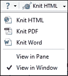

图 5:选择输出格式

## 还有更多……

要编辑文档选项，单击**针织 HTML** 旁边的齿轮图标，如下图所示。这将打开 R Markdown 文档选项面板:


图 6:打开 R Markdown 文档选项面板

用户可以在显示的控制面板中编辑输出格式、数字和一些高级功能:

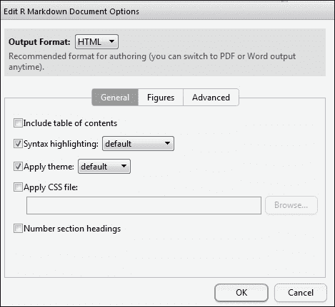

图 7:高级特性的配置


# 学习降价语法

Markdown 是一种轻量级标记语言；它允许任何人用纯文本快速创建格式化文档，而不是使用复杂的 HTML。在这个菜谱中，我们介绍如何用 markdown 语法写一个报告。

## 准备就绪

确保您已经在操作系统上安装了最新版本的 R 和 RStudio。此外，您需要在 RStudio 中创建和打开一个新的 R Markdown ( `.rmd`)文件。

## 怎么做……

请执行以下步骤来编写简单的降价语法:

1.  首先，通过在单词前面放置标签`#`来创建标题:

    | 

    降价

     | 

    试映

     |
    | --- | --- |
    | `# H1``## H2``### H3` | 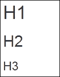 |

2.  接下来，用粗体、

    | 

    等样式强调单词降价

     | 

    试映

     |
    | --- | --- |
    | 这是计划文本:`*italics1*``_italics2_``**bold1**``__bold2__``~~Strikethrough~~` | 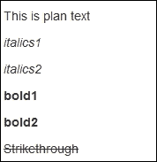`**bold1**` |

3.  对于列表项，我们可以在有序项列表或无序项列表中列出项:

    | 

    降价

    T12 | 试映 |
    | --- | --- |
    | 

    1.  第一有序列表项
    2.  第二有序列表项

        *   无序子列表

    *   无序列表项

        1.  有序子列表

        2.  有序子列表——2

     | 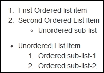

    *   而且，我们还可以使用 markdown 创建一个表格:

        &#124; 

        降价

         &#124; 

        试映

         &#124;
        &#124; --- &#124; --- &#124;
        &#124; `&#124; NAME &#124; AGE &#124; GENDER&#124;``&#124; --- &#124; :---: &#124; ---: &#124;``&#124; Andy &#124; 23 &#124; M &#124;``&#124; Brian &#124; 33 &#124; M &#124;``&#124; Judy &#124; 18 &#124; F &#124;` &#124; 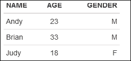`&#124; Andy &#124; 23 &#124; M &#124;` &#124;

        *   为了嵌入 R 代码，我们可以使用三个单引号来包装我们的 R 代码。RStudio 将编译代码，并在脚本下面呈现执行结果。如果没有在代码块中指定编程语言，代码块将不会突出显示任何代码语法:

        &#124; 

        降价

         &#124; 

        试映

         &#124;
        &#124; --- &#124; --- &#124;

        *   此外，还可以在 R Markdown 报告中添加链接和图片:

        &#124; 

        降价

         &#124; 

        试映

         &#124;
        &#124; --- &#124; --- &#124;
        &#124; `This is [R](https://www.r-project.org/ "Title") download link.``` &#124; 这是稀有下载链接: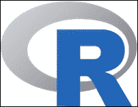 &#124;

    ## 它是如何工作的……

    减价报告最吸引人的特性是它使用户能够用纯文本和简单的标记语法创建格式良好的文档。通常，降价文件使用`.md`作为其文件扩展名。然而，由于 RStudio 需要编译 R 代码并在代码块的正下方输出结果，所以它使用`.rmd`作为其文件扩展名。因此，当我们点击 **Knit HTML** 时，RStudio 会自动编译 R 代码，并将 R 代码、执行结果、markdown 语法渲染到一个 HTML 文档中。

    在这个菜谱中，我们介绍了一些可以用来创建降价报告的基本语法。首先，我们介绍如何通过在单词前放置标签`#`来创建标题。通过使用一个 hashtag，我们可以呈现一个`H1`标题。如果我们在单词前面放置两个标签，我们可以制作一个`H2`标题。

    接下来，我们讲述了如何强调单词。如果我们在 markdown 中使用纯文本，它将呈现纯文本。但是，如果我们用星号或下划线将单词换行，它会将文本格式化为斜体。或者，如果我们用两个星号或下划线来结束单词，它会将格式改为粗体。此外，我们可以用删除线将文本格式化，方法是用波浪号将单词换行。

    接下来，我们可以将我们的观点组织成一个列表项。如果我们在一个段落的开头放置一个数字和一个点，我们可以创建一个有序的列表项。或者，如果我们在前面放置一个前导星号(`*`)，我们可以创建一个无序列表项。要创建子列表，我们需要在列表项的前面放置四个前导空格。

    我们还可以使用 markdown 语法来组织表中的数据。创建表格很容易；我们只需要用竖线(`&#124;`)符号分隔每一列，并从新的一行追加新的一行。要区分列名和数据值，只需在列名和值之间加三个破折号(`---`)。

    此外，我们可以在 R Markdown 报告中嵌入 R 代码。通过使用`knitr`包，可以编译 R 代码并在 HTML 报告中呈现执行结果。这里，我们使用三个反斜线(``)`来创建一个代码块。如果我们在代码块之间嵌入`{R}`，当我们编译代码时，R 将执行 R 脚本，并在代码块下方呈现执行结果。另一方面，如果我们没有在代码块中指定编程语言类型，`knitr`包会将代码块中的代码视为纯文本。

    最后，我们演示如何在减价报告中创建外部链接。为了实现这一点，我们用括号将链接名括起来，用圆括号将链接 URL 括起来。要呈现外部图像，我们需要在 URL 链接前添加一个前导`![alt text]`，并在括号中传递单词 display 作为第二个参数。

    ## 还有更多……

    除了使用 markdown 语法创建报告之外，还可以使用 LaTeX 语法。要用 R 生成 LaTeX 报告，可以使用`Sweave`包。与 R Markdown 类似，`Sweave`包使用户能够将 R 代码和格式化文本组合成一个可复制的文档。

    有关更多信息，请阅读`Sweave`包的文档:

    *Sweave:由 *Friedrich Leisch* 开发的使用文化数据分析的动态生成统计报告*。*计算统计学学报*作者*Wolfgang hrdle*和*Bernd ronz*，编辑，Compstat 2002，第 575-580 页。物理出版社，海德堡，2002 年。国际标准书号 3-7908-1517-9。

    

    # 嵌入 R 代码块

    在 R Markdown 报告中，可以使用`knitr`语法将 R 代码块嵌入到报告中。在这个菜谱中，我们将介绍如何使用不同的代码块配置来创建和控制输出。

    ## 准备就绪

    确保您已经在操作系统上安装了最新版本的 R 和 RStudio。此外，您需要在 RStudio 中创建和打开一个新的 R Markdown ( `.rmd`)文件。

    ## 怎么做……

    请执行以下步骤在降价报告中创建 R 代码块:

    1.  首先，用`knitr`语法创建一个基本代码块:

        &#124; 

        降价

         &#124; 

        试映

         &#124;
        &#124; --- &#124; --- &#124;
        &#124; ````py{r}``# code block``a <- 3``b <- 2``a + b`````` &#124; `# code block` &#124;

    2.  我们可以通过设置`echo=FALSE`:

        &#124; 

        来隐藏脚本降价

         &#124; 

        试映

         &#124;
        &#124; --- &#124; --- &#124;
        &#124; ````py{r, echo=FALSE}``# code block``a <- 3``b <- 2``a + b`````` &#124; `# code block` &#124;

    3.  或者，我们可以通过设置`eval=FALSE`:

        &#124; 

        来停止评估代码降价

         &#124; 

        试映

         &#124;
        &#124; --- &#124; --- &#124;
        &#124; ````py{r, eval=FALSE}``# code block``a <- 3``b <- 2``a + b`````` &#124; `# code block` &#124;

    4.  此外，我们可以通过设置`include=FALSE`:

        &#124; 

        来选择不渲染评测结果和脚本降价

        T17 &#124; 试映 &#124;
        &#124; --- &#124; --- &#124;
        &#124; ````py{r, include=FALSE}``# code block``a <- 3``b <- 2a + b`````` &#124;  &#124;

    5.  您可以通过用单个反勾号关闭代码来创建内联代码:

        &#124; 

        降价

         &#124; 

        试映

         &#124;
        &#124; --- &#124; --- &#124;
        &#124; `Inline code demo: `r a <- 3;b <- 2;a + b`` &#124; `Inline code demo: 5` &#124;

        
    6.  接下来，我们可以在减价报告中用给定的图形宽度和高度呈现一个图形:

        &#124; 

        降价

         &#124; 

        试映

         &#124;
        &#124; --- &#124; --- &#124;
        &#124; ````py{r, fig.width=6, fig.height=4}``data(iris)``plot(iris)`````` &#124; `plot(iris)` &#124;

    7.  我们可以通过设置`warning=FALSE`:

        &#124; 

        来关闭警告信息降价

        T17 &#124; 试映 &#124;
        &#124; --- &#124; --- &#124;
        &#124; ````py{r, fig.width=6, fig.height=4,warning=FALSE}``library(ggplot2)``g <- ggplot(data=iris, mapping=aes(x=Sepal.Length, y=Sepal.Width, colour=Species))``print(g + geom_point())`````` &#124; `library(ggplot2)` &#124;

    ## 它是如何工作的……

    在 R Markdown 报告中，我们可以用 `knitr`包嵌入 R 代码块。为了创建一个 R 代码块，我们首先在大括号中放置三个反勾号，后跟一个`r`。然后我们在大括号后面插入 R 代码。最后，我们用三个反勾号结束代码块。完成这些步骤后，我们可以点击`knit *`开始编写 RMD 报告。除了创建代码块，还可以用一个反勾号后跟一个`r`来开始内联代码，并用一个反勾号来结束代码行。

    当创建 R 代码块时，我们可以将参数传递到括号中来控制代码的呈现。这里我们列出了一些可以传递的参数:

    *   `eval`:决定是否执行脚本
    *   `echo`:决定是否渲染脚本
    *   `warning`:决定是否打印警告信息
    *   `include`:决定是否同时呈现代码脚本和执行结果

    我们可以通过将`fig.width`和`fig.height`传递给大括号来控制图形的宽度和高度。我们也可以用基本 R `graphics`包或`ggplot2`包在降价报告上绘制数字。

    ## 还有更多……

    为了控制代码块的全局选项，可以使用`knitr`包中的`opts_chunk`:

    ```

    ```py{r, include=FALSE}

    knitr::opts_chunk$set(fig.width=6, fig.height=4, fig.path='img/')

    ```

    ```

    

    # 使用 ggvis 创建交互式图形

    为了与报告中的图形进行交互，用户可以使用`ggvis`创建一个交互式的图形。在本食谱中，我们演示了如何从房地产数据集构建我们的第一个交互式地块。

    ## 准备就绪

    在开始这个食谱之前，你应该从下面的 GitHub 链接下载`RealEstate.csv`数据集:

    [https://github . com/yw chiu/rcookbook/blob/master/chapter 8/real estate . CSV](https://github.com/ywchiu/rcookbook/blob/master/chapter8/RealEstate.csv)

    ## 怎么做……

    请执行以下步骤，用`ggvis`创建一个交互图:

    1.  安装并加载`ggvis`包:

        ```

        > install.packages("ggvis")

        > library(ggvis)

        ```

    2.  将`RealEstate.csv`导入 R 会话:

        ```

        > house <- read.csv('RealEstate.csv', header=TRUE)

        > str(house)

        'data.frame': 781 obs. of  8 variables:

         $ MLS        : int  132842 134364 135141 135712 136282 136431 137036 137090 137159 137570 ...

         $ Location   : Factor w/ 54 levels " Arroyo Grande",..: 21 44 44 39 50 42 50 50 39 22 ...

         $ Price      : num  795000 399000 545000 909000 109900 ...

         $ Bedrooms   : int  3 4 4 4 3 3 4 3 4 3 ...

         $ Bathrooms  : int  3 3 3 4 1 3 2 2 3 2 ...

         $ Size       : int  2371 2818 3032 3540 1249 1800 1603 1450 3360 1323 ...

         $ Price.SQ.Ft: num  335 142 180 257 88 ...

         $ Status     : Factor w/ 3 levels "Foreclosure",..: 3 3 3 3 3 3 3 3 3 3 ...

        ```

    3.  接下来，我们可以创建一个散点图，将**大小** 作为 *x* 轴，将**价格**作为 *y* 轴:

        ```

        > house %>% ggvis(~Size, ~Price) %>% layer_points()

        ```

        

        图 8:房子大小与价格的散点图

    4.  而且，我们可以先使用`dplyr`的`filter`函数来子集化数据:

        ```

        > house %>% filter(Price >= 500000) %>% ggvis(~Size, ~Price) %>% layer_points()

        ```

        

        图 9:用 dplyr 函数过滤的散点图

    5.  创建一个交互式的图，允许用户从下拉菜单中选择颜色:

        ```

        > house %>% ggvis(~Size, ~Price, fill := input_select(choices = c("red", "blue", "green"), selected = "blue", label = "Color")) %>% layer_points() 

        ```

        

        图 10:允许用户改变点的颜色的交互式散点图

    ## 它是如何工作的……

    `ggvis`包用 CSS 和 JavaScript 创建了 HTML 输出。因此，人们可以将`ggvis`图形嵌入到 web 应用程序或 HTML 报告中。与仅创建静态图像的`ggplot2`不同，`ggvis`使用户能够通过 web 表单交互操作数据可视化。

    为了创建一个`ggvis`图，我们需要首先安装并加载`ggvis`库到一个 R 会话中。然后，我们可以使用`read.csv`函数将房地产数据集读入 R 数据框。我们可以使用`str`函数在房地产数据集中找到一些基本的住房特征。

    由于我们希望探索房子大小和价格之间的关系，我们需要用`ggvis`从这两个特征中做出散点图。为了创建一个基本的散点图，我们首先需要加载数据集`house`，然后使用来自`magrittr`的管道函数`%>%`将数据传输到`ggvis`函数。这里，`ggvis`函数用于创建一个基本的 plot 对象，然后我们可以通过在变量名前放置一个波浪符号(`~`)将房子大小作为 *x* 位置和房价作为 *y* 位置传递到`ggvis`函数中。最后，我们可以使用`layer_point`函数来制作散点图。

    在`dplyr`包中使用管道操作符允许我们将数据管道传输到`filter`函数，然后将过滤后的数据管道传输到`ggvis`函数。我们通过使用`input_select`功能在**填充**选项中添加一个颜色选择下拉菜单来完成我们的图形。

    ## 还有更多……

    如果您想以 SVG 格式导出`ggvis`图，您需要首先安装`vega`(一种可视化语法)运行时。有关`vega`的更多信息，请访问下面的 GitHub 页面:

    [https://github.com/vega/vega](https://github.com/vega/vega)

    

    # 理解基本句法和语法

    `ggvis`使用与`ggplot2`相似的语法和句法，我们可以使用这种基本句法来创建图形。在这本食谱中，我们将讲述如何使用`ggvis`句法和语法来构建高级情节。

    ## 准备就绪

    确保你已经安装了并将`ggvis`加载到你的 R 会话中。此外，您需要通过在 R 环境中存储`house`来完成前面的步骤。

    ## 怎么做……

    请执行以下步骤，用`ggvis`创建图:

    1.  首先，通过将**大小**映射到 *x* 轴，将**价格**映射到 *y* 轴，创建一个散点图。此外，我们可以为不同状态的点分配不同的颜色或形状:

        ```

        > house %>% ggvis(~Size, ~Price, fill=~Status, size=10, shape=~Status) %>% layer_points()

        ```

        

        图 11:不同形状和颜色的房屋状态散点图

    2.  同样，我们可以使用`add_props`功能将填充颜色改为红色:

        ```

        > house %>% ggvis(~Size, ~Price, fill=~Status, size=10, shape=~Status) %>% layer_points() %>% add_props(fill:="red") %>% layer_points() 

        ```

        

        图 12:将数据点变成红色

    3.  接下来，我们可以渲染一条带有标准误差的平滑回归线到当前点上:

        ```

        > house %>% ggvis(~Size, ~Price) %>% layer_points(fill=~Status)  %>% layer_smooths(stroke:= "red", strokeWidth:=3, se=TRUE) 

        ```

        

        图 13:将回归线绘制到散点图上

    4.  而且，我们可以在数据点上绘制一条带有标准误差带的线性回归线:

        ```

        > house %>% ggvis(~Size, ~Price) %>% layer_points(fill=~Status)  %>%   layer_model_predictions(formula= Price ~ Size, model = "lm", se = TRUE)

        ```

        

        图 14:在图上添加一条线性回归线

    5.  我们可以按照状态对数据进行分组，按照属性状态

        ```

        > house %>% ggvis(~Size, ~Price) %>% layer_points(fill=~Status)  %>% group_by(Status) %>% layer_model_predictions(model = "lm", stroke=~Status, strokeWidth:=3, se=TRUE)

        ```

        

        绘制单独的线性回归线图 15:根据住房状况添加多条回归线

    6.  继续，我们可以从房屋数据集的`Size`属性制作蓝色直方图:

        ```

        > house %>% ggvis(~Size, fill:="blue") %>% layer_histograms(width=300)

        ```

        

        图 16:从房屋数据集制作直方图

    7.  然后，我们可以创建一个条形图，将**状态**作为 *x* 轴，将**价格**作为 *y* 轴:

        ```

        > house %>% ggvis(~Status, ~Price, fill=~Status) %>% layer_bars(width=0.5)

        ```

        

        图 17:创建一个带有房价状态的柱状图

    8.  而且，我们可以绘制一个盒图**状态**为 *x* 轴，绘制**价格**为 *y* 轴:

        ```

        >house %>% ggvis(~Status, ~Price, fill=~Status)  %>% layer_boxplots()

        ```

        

        图 18:创建一个带有价格状态的箱线图

    9.  最后，我们可以制作一条以**状态**为 *x* 轴，以**价格**为 *y* 轴的

        ```

        > house %>% ggvis(~Size, ~Price) %>% layer_lines(strokeWidth:=5, stroke:="blue")

        ```

        

        的图图 19:创建大小与价格的折线图

    ## 它是如何工作的……

    在`ggvis`中，用户可以使用一个简单的层在绘图中创建线、点和其他几何对象。要构建一个`ggvis`图形，请使用以下语法格式:

    ```
    <data>  %>% 

      ggvis( ~ <x property> , ~ <y property>, fill = ~ <fill property>, ...) %>% 

      layer_<marks>() 
    ```

    对于`dplyr`或`ggplot2`用户来说，以前的语法格式可能看起来很熟悉。与`dplyr`类似，可以使用 pipe ( `%>%`)函数来构建数据管道。此外，类似于`ggplot2`，你可以用美学映射和几何对象构建一个图形。

    第一步，我们将房子大小作为`x property`和房价作为`y property`，点大小为 10，传递到`ggvis`函数中。我们还根据 status 属性变量设置了点的颜色和样式。最后，我们使用`layout_points`函数来渲染散点图。在这个例子中，我们发现可以在`ggvis`函数中修改可视属性。然而，我们也可以用`add_prop`功能改变属性。在下一步中，我们使用`:=`符号将所有数据点变成红色。

    在`ggplot2`中，一个重要的特性是用`geom_smooth`函数在绘图上添加一条回归线(我们将在[第 11 章](ch11.html "Chapter 11. Supervised Machine Learning")、*监督机器学习*中进一步讨论回归线)。在`ggvis`中，我们也可以用`layour_smooths`函数添加一条平滑回归线。这里，我们将描边颜色设置为红色，描边宽度设置为`3`，并通过设置`se`等于`TRUE`来添加标准误差带。而且，我们可以用`layer_model_predictions`函数添加一条线性回归线。但是，由于我们的数据集包含不同财产状态的房地产数据，我们需要制作单独的预测线。因此，我们可以使用`group_by`函数根据**状态**变量将数据分成不同的组。然后，我们可以根据房产的状态创建不同的预测线。

    继续，我们可以使用不同的`layer_<marks>`来创建各种图表。在示例中，我们用`layer_histograms`创建了一个直方图。接下来，我们用`layer_bars`制作了一个柱状图。然后我们用`layer_boxplots`绘制了一个箱线图。最后，我们用`layer_lines`做了一个线图。

    ## 还有更多……

    虽然`ggvis`提供了交互式的绘图，但是人们也可以通过 web 表单来控制图形。然而，`ggvis`与`ggplot`相比也有一些劣势。`ggvis`的一个明显缺点是可用的绘图类型有限。与`ggplot2`不同，`ggvis`不提供坐标，所以不能做饼状图。此外，人们不能使用`ggvis`来创建等高线图或树状图。所以`ggplot2`不能完全被`ggvis`替代。

    

    # 控制轴和图例

    除了用各种层类型制作不同的图外，还可以控制一个`ggvis`图的轴和图例。在本菜谱中，我们将演示如何设置轴和图例的外观属性。

    ## 准备就绪

    确保您已经将`ggvis`安装并加载到 R 会话中。您还需要通过在 R 环境中存储`house`来完成前面的步骤。

    ## 怎么做……

    请对`ggvis`中的控制轴和图例执行以下步骤:

    1.  首先，我们使用`add_axis`函数来控制一个`ggvis`图的轴方向和标签:

        ```

        > house %>% ggvis(~Size, ~Price) %>% layer_points() %>% 

        +   add_axis("x", title = "Real Estate Square Feet", orient="top") %>% 

        +   add_axis("y", title = "Real Estate Price", title_offset = 80)

        ```

        

        图 20:在 ggvis 图上创建一个轴

    2.  我们可以控制轴的比例:

        ```

        > house %>% ggvis(~Size, ~Price) %>% layer_points() %>% 

        +   add_axis("x", title = "Real Estate Square Feet", 

        +            subdivide = 4, values = seq(0,8000, by=1000)) %>% 

        +   add_axis("y", title = "Real Estate Price", 

        +            subdivide = 5, values = seq(0,5500000, by=1000000), title_offset = 80)

        ```

        

        图 21:控制绘图轴

    3.  再者，我们可以自定义轴的可视化属性:

        ```

        > house %>% ggvis(~Size, ~Price) %>% layer_points() %>% 

        +   add_axis("x", title = "Real Estate Square Feet", 

        +     properties = axis_props(

        +       axis = list(strokeWidth = 2),

        +       grid = list(stroke = "blue"),

        +       ticks = list(stroke = "red", strokeWidth = 2),

        +       labels = list(align = "left", fontSize = 10)

        +   )) %>% 

        +   add_axis("y", title = "Real Estate Price", title_offset = 80,

        +     properties = axis_props(

        +       axis = list(strokeWidth = 2),

        +       grid = list(stroke = "orange"),

        +       ))

        ```

        

        图 22:在图上添加网格线

    4.  继续，我们可以操控`ggvis`剧情的传说:

        ```

        > house %>% ggvis(~Status, ~Price, fill=~Status) %>% layer_bars(width=0.5)  %>%  add_legend("fill", title="Sale Status")

        ```

        

        图 23:将图例添加到图表上

    5.  同样，我们可以用`hide_legend`函数隐藏传说:

        ```

        > house %>% ggvis(~Status, ~Price, fill=~Status) %>% layer_bars(width=0.5)  %>%  hide_legend("fill")

        ```

        

        图 24:隐藏图表的图例

    ## 它是如何工作的……

    在`ggvis`中，我们可以用`*_axis and *_legend`功能控制轴和图例在`ggvis`图形中的显示方式。在这个食谱中，我们首先用`layer_point`函数制作一个散点图。然后我们使用`add_axis`功能来修改散点图的标签名称、方向和标签偏移量。接下来，我们演示如何更改轴的刻度大小和填充。这里，我们配置一个值选项来设置轴限制，并使用`subdivide`来确定每个主要刻度之间的次要刻度的数量。除了改变轴的外观，我们可以用`axis_props`功能定制更多的轴属性。在这里，我们可以更改属性，如散点图的轴、网格、刻度和标签。

    我们可以用`add_legend`功能修改图例的外观。在这一步中，我们首先根据价格信息制作一个柱状图。然后我们使用`add_legend`函数在柱状图下方添加一个图例。此功能允许我们在图例上设置`fill`点，图例标题为**销售状态**。除了控制图例的外观，一个可以用`hide_legend`功能隐藏。

    ## 还有更多……

    要修改图例的可视属性，可以用`legend_props`设置`properties`来控制样式:

    ```

    > house %>% 

    +   ggvis(~Status, ~Price, fill=~Status) %>% 

    +   layer_bars(width=0.5)  %>% 

    +   add_legend("fill", title="Sale Status", 

    +              properties = legend_props(

    +                title = list(fontSize = 14),

    +                labels = list(fontSize = 12),

    +                symbol = list(shape = "square", size = 100)

    +              ))

    ```

    

    图 25:配置图例属性

    

    # 使用秤

    除了更改轴和图例的外观，我们还可以使用缩放功能重新缩放数据的映射以及它在图上的显示方式。在这个菜谱中，我们介绍如何在`ggvis`中缩放数据。

    ## 准备就绪

    确保您已经将`ggvis`安装并加载到 R 会话中。此外，您需要通过在 R 环境中存储`house`来完成前面的步骤。

    ## 怎么做……

    请执行以下步骤重新调整`ggvis`中的数据:

    1.  首先，创建一个条形图，然后用功率标尺替换线性标尺:

        ```

        > house %>% ggvis(~Status, ~Price, fill=~Status) %>% layer_bars() %>% scale_numeric("y", trans = "pow", exponent = 0.2)

        ```

        

        图 26。调整条形图的比例

    2.  我们可以用`scale_nominal`函数改变填充颜色:

        ```

        > house %>% ggvis(~Status, ~Price, fill=~Status) %>% layer_bars() %>% scale_nominal("fill", range = c("pink", "green", "lightblue"))

        ```

        

        图 27。更改条形图的填充颜色

    ## 它是如何工作的……

    在之前的配方中，我们介绍了如何使用`add_axis`功能改变轴属性。但是，`add_axis`功能只是修改轴的外观；它不会改变映射数据。要缩放轴和绘图数据，可以使用`scale_*`功能。

    在这个例子中，我们首先用`layer_bar`函数制作一个柱状图。然后我们使用`scale_numeric`用功率秤代替线性秤。这将重新调整 *y* 轴和条形的高度。除了用`scale_numeric`函数重定连续值的比例，还可以用`scale_nominal`改变离散值的属性。在前一个配方的最后，我们演示了如何使用`scale_nominal`用一个给定的颜色向量重新填充工具条。

    ## 还有更多……

    除了`scale_nominal`和`scale_numeric`函数之外，还可以使用以下函数来重新调整`ggvis`图上的数据:

    *   `scale_datetime`:给`ggvis`对象添加一个`datetime`比例
    *   `scale_logical`:给`ggvis`对象添加一个逻辑比例
    *   `scale_ordinal`:给`ggvis`对象添加序数刻度
    *   `scale_singular`:给一个`ggvis`对象添加一个单数比例

    

    # 为 ggvis 图添加交互性

    `ggvis`最吸引人的特性之一是它可以用来创建一个交互式网页表单。这允许用户通过与 web 表单交互来选择数据子集，甚至改变绘图的可视属性。在这个菜谱中，我们介绍如何给一个`ggvis`对象添加交互性。

    ## 准备就绪

    确保您已经将`ggvis`安装并加载到 R 会话中。此外，您需要通过在 R 环境中存储`house`来完成前面的步骤。

    ## 怎么做……

    请执行以下步骤为`ggvis`添加交互性:

    1.  先用下拉菜单和颜色选项做一个柱状图:

        ```

        > house %>% 

        +     ggvis(~Status, ~Price, fill:= input_select(c("red","blue"), label="Fill Color")) %>% 

        +     layer_bars() %>%

        +     add_axis("x", title = "Status", title_offset = 40) %>%

        +     add_axis("y", title = "Price", title_offset = 80)

        ```

        

        图 28:添加带有颜色选项的下拉菜单

    2.  创建一个大小滑块和一个颜色输入文本区进行散点图:

        ```

        > house %>% 

        +     ggvis(~Size, ~Price, fill:= input_text("red",label="Fill Color"), size:=input_slider(1,10)) %>% 

        +     layer_points() %>%

        +     add_axis("x", title = "Size", title_offset = 40) %>%

        +     add_axis("y", title = "Price", title_offset = 80)

        ```

        

        图 29:在 ggvis 图上添加尺寸滑块和颜色输入文本区域

    3.  接下来，我们可以创建一个单选按钮供用户选择回归方法:

        ```

        > house %>% ggvis(~Size, ~Price) %>% 

        +     layer_points(fill=~Status)  %>% 

        +     layer_model_predictions(

        +         formula= Price ~ Size, 

        +         se = TRUE,

        +         model = input_radiobuttons(c("loess" = "loess", "Linear" = "lm"),

        +                                    label = "Model type")) %>%

        +     add_axis("x", title = "Size", title_offset = 40) %>%

        +     add_axis("y", title = "Price", title_offset = 80)

        ```

        

        图 30:在 ggvis 图上创建一个单选按钮

    4.  接下来，我们可以根据给定的销售状态:

        ```

        > sale_type <- as.character(unique(house$Status))

        > house %>%

        +     ggvis(~Size, ~Price, fill=~Status) %>%

        +     filter(Status %in% eval(input_select(sale_type)) ) %>%

        +     layer_points()  %>%

        +     add_axis("x", title = "Size", title_offset = 40) %>%

        +     add_axis("y", title = "Price", title_offset = 70)

        ```

        

        制作一个下拉菜单来过滤数据图 31:创建一个下拉菜单作为数据过滤器

    5.  同样，我们可以根据多个条件对数据进行子集化:

        ```

        > sale_type <- as.character(unique(house$Status))

        > house %>%

        +     ggvis(~Size, ~Price, fill=~Status) %>%

        +     filter(Status %in% eval(input_checkboxgroup(sale_type)) ) %>%

        +     layer_points() %>% hide_legend("fill") %>%

        +     add_axis("x", title = "Size", title_offset = 40) %>%

        +     add_axis("y", title = "Price", title_offset = 70)

        ```

        

        图 32:在 ggvis 图表上添加多个复选框

    6.  最后，我们可以给添加一个单选按钮，让用户在中选择 *x* 轴的属性:

        ```

        > house %>%

        +     ggvis(x=input_radiobuttons(c("Size", "Price"), map=as.name), 

        +           y=~Price, 

        +           fill=~Status) %>%

        +     layer_points() %>% hide_legend("fill") %>%

        +     add_axis("x", title = "Size", title_offset = 40) %>%

        +     add_axis("y", title = "Price", title_offset = 70)

        ```

        

        图 33:添加一个单选按钮来控制 x 轴

    ## 它是如何工作的……

    在前面的步骤中，我们介绍了如何给`ggvis` 情节添加交互性。第一步，我们用`layer_bars`做了一个柱状图。为了改变条形图的颜色，我们在填充选项中添加了`input_select`。然后，从渲染图中，出现一个下拉菜单，颜色选择为红色和蓝色。除了在图上添加一个交互表单，我们还可以添加多个交互控件。因此，在第二步中，我们在散点图上添加了一个下拉菜单和一个滑块。这允许用户从 web 表单中调整大小和填充颜色。我们还通过使用单选按钮使模型属性具有交互性。

    除了使用交互式元素来控制视觉属性，我们还可以通过表单交互按变量对数据进行子集划分。在第四步中，我们添加了一个下拉菜单，以便按住房状态显示数据的子集。为了启用交互属性，我们使用一个`eval`函数来计算`input_select`函数的表达式。此外，我们可以通过添加复选框来控制过滤条件，从而使用多个条件对数据进行子集划分。

    最后，我们使用单选按钮使 *x* 位置属性具有交互性。因此，在绘制`ggvis`图时，可以选择在 *x* 位置使用的变量。

    ## 还有更多……

    要浏览`ggvis`对象中每个标记的详细信息，可以使用`add_tooltip`函数向标记添加工具提示。此外，我们可以通过设置`on` 参数来控制工具提示是点击显示还是悬停显示:

    ```

    > display_val <- function(x) {

    +     if(is.null(x)) return(NULL)

    +     paste0(names(x), ": ", format(x), collapse = "<br />")

    + }

    > house %>%

    +     ggvis(~Size, ~Price, fill=~Status) %>%

    +     filter(Status %in% eval(input_checkboxgroup(sale_type)) ) %>%

    +     layer_points() %>% 

    +     add_tooltip(display_val, on="hover") %>% 

    +     add_axis("x", title = "Size", title_offset = 40) %>%

    +     add_axis("y", title = "Price", title_offset = 70)

    ```

    

    图 34。将工具提示添加到标记上

    

    # 创建一个闪亮的文档

    在介绍了如何制作一个 R Markdown 文档和`ggvis` plot 之后，我们现在可以将这两个合并到一个报告中。然而，`ggvis`的交互属性并不适用于常规的 R Markdown 报告。相反，我们只能在一个闪亮的文档中启用情节的交互性。在这个食谱中，我们介绍如何创建一个闪亮的文件。

    ## 准备就绪

    确保您已经将`ggvis`安装并加载到 R 会话中。此外，您需要通过在 R 环境中存储`house`来完成前面的步骤。

    ## 怎么做……

    请执行以下步骤创建闪亮文档:

    1.  首先点击**文件** &#124; **新建文件** &#124; **R Markdown** 菜单栏上的

        图 35:创建一个 r 降价文件

    2.  接下来，在左侧菜单中选择**闪亮**作为文档类型，然后填写**标题**和**作者**，在右侧菜单中选择输出格式:

        图 36:输入 r 降价报告的标题和作者

    3.  将生成 `ggvis`图的代码输入到 R 个块中:

        ```

        ```py{r, include=TRUE, warning=FALSE, echo=FALSE}

        library(ggvis)

        library(dplyr)

        ```

        ```py{r, warning=FALSE}

        house <- read.csv('RealEstate.csv', header=TRUE)

        housing_status <- as.character(unique(house$Status))

        house %>%

         ggvis(~Size, ~Price, fill=~Status) %>%

         filter(Status %in% eval(input_checkboxgroup(housing_status)) ) %>%

         layer_points() %>% hide_legend("fill") %>%

         add_axis("x", title = "Size", title_offset = 40) %>%

         add_axis("y", title = "Price", title_offset = 70)

        ```

        ```

    4.  点击**运行文件**编译并呈现报告:

        图 37:使用运行文档呈现报告

    5.  系统将要求输入一个文件名。给定文件名后，RStudio 将生成一个`<filename>.rmd`和`<filename>.html`文件，并在一个打开的窗口中显示格式化的报告:

        图 38:创建一个闪亮的报告

    ## 它是如何工作的……

    在我们的第一个配方中，我们介绍了如何创建 R 降价报告。然而，R Markdown 报告输出代码块和静态数字；人们不能通过网络交互进行探索性的数据分析。为了使用户能够通过 web 表单浏览数据，可以用闪亮的应用程序构建一个交互式网页。在这个菜谱中，我们介绍了如何用 Shiny 创建一个交互式 web 报告。

    我们首先点击菜单栏中的 **R Markdown** 来创建一个新的报告。然后我们从左侧菜单中选择了**闪亮的**。接下来，我们需要填写**标题**和**作者**，并为我们的新文档选择输出格式。此时，您将看到一个新文件，其中包含 R Markdown 语法和关于如何生成闪亮文档的简单说明。从 YAML 报头的开始，我们发现一行代码为`runtime: shiny`。通过这一行，我们将把我们的报告编译成一个闪亮的应用程序。另一方面，如果我们删除这一行，我们将把我们的报告编译成一个常规的 R Markdown 报告。

    我们现在可以将生成`ggvis`图的代码输入到 R 个块中。在我们完成我们的代码后，我们可以点击菜单中的**运行文档**。RStudio 将开始编译报告，并在弹出窗口中呈现报告。从报告中，用户现在可以使用 web 表单与`ggvis`图进行交互。

    ## 还有更多……

    除了用`ggvis`制作一个交互式的情节，你还可以添加一个闪亮的小部件来控制渲染。在下面的代码块中，我们演示了如何添加一个`slideInput`来调整`ggvis`散点图的大小:

    ```

    ```py{r, include=TRUE, warning=FALSE, echo=FALSE}

    library(ggvis)

    library(dplyr)

    library(shiny)

    ```

    ```py{r, echo=FALSE}

    house <- read.csv('RealEstate.csv', header=TRUE)

    sliderInput("size", label = "Point Size:",

     min = 1, max = 100, value = 1, step = 1)

    input_size <- reactive(input$size)

    house %>%

     ggvis(~Size, ~Price, fill=~Status, size:=input_size) %>%

     layer_points()%>%

     add_axis("x", title = "Size", title_offset = 40) %>%

     add_axis("y", title = "Price", title_offset = 70)

    ```

    ```

    

    图 39:向闪亮的报表添加 slideInput

    有关闪亮小工具的更多信息，请使用`help`功能查看相关文档:

    ```

    > help(package="shiny")

    ```

    

    # 发布一份闪亮的报告

    在使用闪亮的应用程序创建我们的交互式报告之后，我们可以在线发布我们的报告。在这份食谱中，我们介绍如何在网上发布一份闪亮的报告。

    ## 准备就绪

    确保您已经将`ggvis`安装并加载到 R 会话中。此外，您需要通过在 R 环境中存储`house`来完成前面的步骤。

    ## 怎么做……

    请执行以下步骤在线发布您的闪亮文档:

    1.  首先点击**发布文档**在文档右上角:

        图 40:发布闪亮的文档

    2.  如果您还没有安装所需的软件包，您应该点击**是**来安装发布闪亮文档所需的软件包:

        图 41:安装发布闪亮应用程序所需的包

    3.  点击**发布刚刚这个文档** :

        图 42:点击只发布这个文档

    4.  此时，RStudio 要求你用应用令牌连接你的 ShinyApps 账户。因此，您应该登录您的帐户来取回令牌:

        图 43: ShinyApps 需要一个登录密码

    5.  接下来，您应该创建一个帐户并登录到[https://www.shinyapps.io/](https://www.shinyapps.io/)。您将被重定向到仪表板。如果这是您第一次登录仪表板，会要求您设置帐户:

        图 44:您将被引导到 shinyapps.io 的仪表板

    6.  在仪表盘页面，点击**账户** &#124; **令牌** &#124; **显示**上的，打开账户信息窗口。点击**显示秘密**和**复制到剪贴板** :

        图 45:ShinyApps 帐户的秘密

    7.  将复制的内容粘贴到多行输入框中，点击 **OK** :

        图 46:粘贴秘密以连接到 ShinyApps

    8.  设置好文件和目的账号后，点击**发布**将闪亮文档发布到您的申请页面:

        图 47:将文档发布到 ShinyApps.io

    9.  你闪亮的文档将被发布在[http://www.shinyapps.io/](http://www.shinyapps.io/):

        主持的网页上图 48:闪亮的应用。超正析象管上托管的闪亮文档

    ## 它是如何工作的……

    除了在本地机器上托管一个闪亮的应用程序之外，我们还可以选择在线托管我们闪亮的应用程序。RStudio 提供了一项名为[http://www.shinyapps.io/](http://www.shinyapps.io/)的服务，允许任何人申请一个免费账户来上传你闪亮的应用。

    在 shinyapps.io 上发布一个闪亮的 app 很容易；你只需要在 Rstudio 上点击**发布文档**。如果这是您第一次发布文档，您将被要求安装一些必需的软件包。接下来，在选择您希望发布的报告类型后，RStudio 将打开一个窗口，要求您输入一个令牌来连接到您闪亮的应用程序帐户。

    如果这是你第一次在网上发布闪亮的文档，你需要在[http://www.shinyapps.io/](http://www.shinyapps.io/)申请一个账户。完成此操作并成功登录后，您可以从管理门户检索您的登录令牌。在这里，你需要点击**显示秘密**来解开秘密并将账户信息复制到剪贴板。然后您可以在输入框中输入账户信息，并点击**确定**。

    最后，在你确定了文件的位置和目的账户后，按下 **OK** 在线发布你的文档。一旦完成，你就可以使用链接格式`https://<account_name>.shinyapps.io/<app_name>/`在线查看你的应用。

    ## 还有更多……

    除了在[http://www.shinyapps.io/](http://www.shinyapps.io/)设置账户信息外，您还可以在线监控您的应用程序。点击门户左侧菜单中的**应用**，或使用以下链接:

    [https://www.shinyapps.io/admin/#/applications/all](https://www.shinyapps.io/admin/#/applications/all)

    

    图 49:监控在线应用

     |