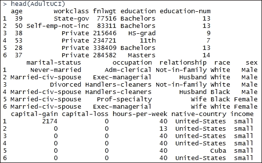
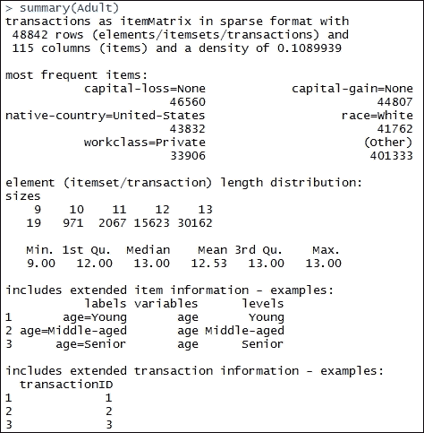
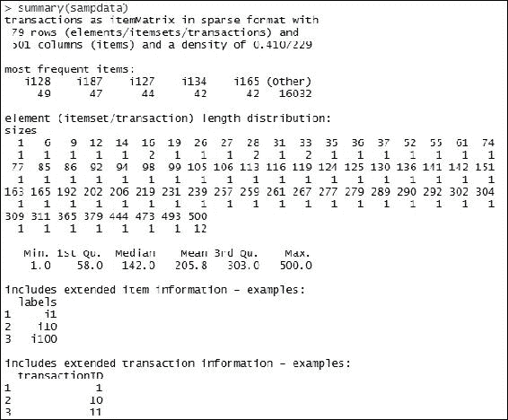

# 三、模式发现

模式发现是数据科学领域的一个重要概念。识别模式的能力是数据科学专业人员做出准确决策的一项非常重要的技能。尽管模式发现技能通常来自过去的经验、常识和直觉，但也有从数据集中提取它的方法。

了解数据集中模式的最简单方法是可视化数据，并从中寻找模式。这种方法非常适合时间序列数据了解其中隐藏的季节性和趋势。

由于我们已经在前一章中介绍了 R 中的可视化数据，我们将只关注学习相似性分析，这种分析寻找数据集中事件的同现，而仅仅通过可视化数据或浏览数据是不可能知道的。此外，我们将学习序列分析，我们将分析各种事件序列，并了解哪个事件可能导致某种后果。

本章的目的是学习如何从数据集中提取模式，从而提前对事件的发生做出预测。例如，制造公司可以使用提取的模式提前预测故障，并配备缓解计划。

本章将涉及的主题如下:

*   交易数据集
*   **一个** **先验**分析
*   支持、信心和提升
*   生成的过滤规则
*   测绘
*   顺序数据集
*   先验序列分析
*   了解结果
*   练习用例

# 交易数据集

在进入关联性分析的细节之前，我们将首先了解将用于关联性分析的数据集类型，以提取事件同现的模式。

## 使用内置数据集

首先，让我们了解一下内置的`AdultUCI`数据集，它来自`arules`包。数据采用数据框格式，因此我们将了解如何将其转换为事务性数据集:

```r
library(arules)

```

为了使用 r 执行相似性分析，这个包是必需的。现在，让我们加载这个包附带的数据集:

```r
data("AdultUCI")
class(AdultUCI)
[1] "data.frame"

```

正如您在前面的输出中所看到的，数据集采用了数据框的格式。我们需要将`AdultUCI`数据集转换成事务性数据集。在转换之前，我们将使用`head`函数查看数据集中的属性，默认情况下，它将显示前五行:

```r
head(AdultUCI)

```

上述命令的输出如下:



在前面的数据集中，我们将删除具有数值的列,仅保留具有分类值的列，因为使用 Apriori 的模式发现最适合分类数据集:

```r
AdultUCI[["fnlwgt"]] <- NULL
AdultUCI[["education-num"]] <- NULL 

```

现在，我们将其他属性转换成分类值。在下面的代码中，我们按照代码中提到的标签分割定义的值范围。类似地，我们将其他列转换为类别，如下面的代码所示:

```r
AdultUCI[[ "age"]] <- ordered(cut(AdultUCI[[ "age"]], c(15,25,45,65,100)), labels = c("Young", "Middle-aged", "Senior", "Old"))
AdultUCI[[ "hours-per-week"]] <- ordered(cut(AdultUCI[[ "hours-per-week"]], c(0,25,40,60,168)), labels = c("Part-time", "Full-time", "Over-time", "Workaholic")) 
AdultUCI[[ "capital-gain"]] <- ordered(cut(AdultUCI[[ "capital-gain"]], c(-Inf,0,median(AdultUCI[[ "capital-gain"]][AdultUCI[[ "capital-gain"]]>0]), Inf)), labels = c("None", "Low", "High")) 
AdultUCI[[ "capital-loss"]] <- ordered(cut(AdultUCI[[ "capital-loss"]], c(-Inf,0, median(AdultUCI[[ "capital-loss"]][AdultUCI[[ "capital-loss"]]>0]), Inf)), labels = c("None", "Low", "High")) 

```

前面的代码将在数据集中创建附加的分类列。使用以下代码，我们可以将数据框形式的数据转换为事务性数据集:

```r
Adult <- as(AdultUCI, "transactions") 

```

这也可以在与`arules`包相关的文件中找到。我们可以直接使用`Adult`数据集，它将保存已处理的事务数据，但是为了更好地理解，我们将数据帧转换成所需的格式:

```r
class(Adult)
[1] "transactions"
attr(,"package")
[1] "arules"

```

因此，我们将数据集转换为事务格式。为了得到数据的前景，我们可以使用`summary`函数。在这里，我们可以看到函数的输出，它显示了事务数、项目数、每个事务的平均项目数等等:

```r
summary(Adult)

```

上述命令的输出如下:



我们还可以通过将数据集转换成数据框格式并进行可视化来查看它的结构。我们使用以下代码并将其转换为数据框格式，以便我们可以可视化数据集。查看数据框格式的交易数据后，将会理解转换的目的。

```r
Adultdf<- as(Adult, "data.frame")
head(Adultdf, 2)

```

以下是前面命令的输出:


该数据集准备好应用 apriori 算法和规则生成。已经了解了如何将具有分类/分桶(处理后)列的普通数据集转换为事务性数据集，我们现在可以通过自己准备来理解类似的数据集。

## 构建数据集

用于先验分析的另一个最常见的数据集将被限制为两列。第一列是交易 ID，第二列是与交易 ID 相关的项目。例如，假设事务 ID 代表用户，在购物篮分析中，第二列可能是用户购买的商品。在社交媒体数据的情况下，它可以是用户关注/喜欢的页面，或者在电子商务示例的情况下，它可以是用户购买/查看的项目。应使用`read.transactions`函数读取数据，将上述格式的数据转换为事务数据。

可以在 r 中生成或派生上述格式的简单数据集。我们将对这两个不同的数据集进行先验分析。

我们可以使用`read.transactions`函数将 CSV 文件中的数据转换成事务数据。然后，我们可以使用`summary`函数简单了解数据，如下所示:

```r
sampdata = read.transactions(file="following.csv", rm.duplicates= FALSE, format="single",sep=",",cols =c(1,2));
summary(sampdata)

```

上述代码片段的输出如下:



因此，这两种方法足以处理大部分数据集中先验分析所需的转换。后一种方法被广泛采用，因为在大多数情况下，第二列将基于单个项目集而不是多个项目集来构建。


# 将数据转换成可用的格式

我们讨论了读取 R 中的数据、理解数据类型以及对数据执行各种操作。现在，我们将看到一些在分析或构建模型之前会用到的概念。在执行分析时，我们可能不需要研究整个数据集，我们可以只关注它的一个子集，或者，另一方面，我们可能必须组合来自多个数据源的数据。这些是本章将涉及的各种概念。

最常用的功能是从数据集中选择所需的列。在构建模型时，我们不会使用数据集中的所有列，而只是使用其中一些更相关的列。为了选择列，我们可以指定列的名称或编号，或者简单地删除不需要的列。

```r
newdata <- data[c(1,5:10)]
head(newdata)
# excluding column 
newdata <- data[c(-2, -3, -4, -11)]
head(newdata) 
 mpg drat    wt  qsec vs am gear
Mazda RX4         21.0 3.90 2.620 16.46  0  1    4
Mazda RX4 Wag     21.0 3.90 2.875 17.02  0  1    4
Datsun 710        22.8 3.85 2.320 18.61  1  1    4
Hornet 4 Drive    21.4 3.08 3.215 19.44  1  0    3
Hornet Sportabout 18.7 3.15 3.440 17.02  0  0    3
Valiant           18.1 2.76 3.460 20.22  1  0    3

```

在前面的代码中，我们首先通过列的位置来选择它。代码的第一行将从数据集中选择第一列，然后是第 5 ^列到第 10 ^列，而在最后一行，指定的两列将从数据集中删除。前面的两个命令将产生相同的结果。

我们还可能遇到需要根据条件过滤数据的情况。在构建模型时，我们不能为整个群体创建一个单一的模型，但我们应该根据群体中存在的行为创建多个模型。这可以通过子集化数据集来实现。在下面的代码中，我们将获得 mpg 超过 25 的汽车的数据:

```r
newdata <- data[ which(data$mpg > 25), ]
 mpg cyl  disp  hp drat    wt  qsec vs am gear carb
Fiat 128       32.4   4  78.7  66 4.08 2.200 19.47  1  1    4    1
Honda Civic    30.4   4  75.7  52 4.93 1.615 18.52  1  1    4    2
Toyota Corolla 33.9   4  71.1  65 4.22 1.835 19.90  1  1    4    1
Fiat X1-9      27.3   4  79.0  66 4.08 1.935 18.90  1  1    4    1
Porsche 914-2  26.0   4 120.3  91 4.43 2.140 16.70  0  1    5    2
Lotus Europa   30.4   4  95.1 113 3.77 1.513 16.90  1  1    5    2

```

我们可能还需要考虑数据集的样本。例如，在构建回归或逻辑模型时，我们需要两个数据集，一个用于训练，另一个用于测试。在这些情况下，我们需要选择一个随机样本。这可以使用以下代码来完成:

```r
sample <- data[sample(1:nrow(data), 10, replace=FALSE),]
sample
 mpg cyl  disp  hp drat    wt  qsec vs am gear carb
Honda Civic      30.4   4  75.7  52 4.93 1.615 18.52  1  1    4    2
Porsche 914-2    26.0   4 120.3  91 4.43 2.140 16.70  0  1    5    2
Merc 450SLC      15.2   8 275.8 180 3.07 3.780 18.00  0  0    3    3
Dodge Challenger 15.5   8 318.0 150 2.76 3.520 16.87  0  0    3    2
Duster 360       14.3   8 360.0 245 3.21 3.570 15.84  0  0    3    4
Fiat X1-9        27.3   4  79.0  66 4.08 1.935 18.90  1  1    4    1
Fiat 128         32.4   4  78.7  66 4.08 2.200 19.47  1  1    4    1
Lotus Europa     30.4   4  95.1 113 3.77 1.513 16.90  1  1    5    2
Toyota Corona    21.5   4 120.1  97 3.70 2.465 20.01  1  0    3    1
Mazda RX4 Wag    21.0   6 160.0 110 3.90 2.875 17.02  0  1    4    4

```

我们考虑从数据集中随机抽取 10 行作为样本。除此之外，我们可能还要合并两个不同的数据集。让我们看看这是如何实现的。我们可以按行和列的方式组合数据，如下所示:

```r
sample1 <- data[sample(1:nrow(data), 10, replace=FALSE),]
sample2 <- data[sample(1:nrow(data), 5, replace=FALSE),]
newdata <- rbind(sample1, sample2)

```

前面的代码用于合并两个共享相同列格式的数据集。然后我们可以使用`rbind`函数将它们组合起来。或者，如果两个数据集具有相同长度的数据但不同的列，那么我们可以使用`cind`或`merge`函数将它们组合起来:

```r
newdata1 <- data[c(1,5:7)]
newdata2 <- data[c(8:11)]
newdata <- cbind(newdata1, newdata2)

```

当两个不同的数据集有一个公共列时，我们可以使用`merge`函数将它们组合起来。使用`merge`时，数据集将基于公共列进行合并。

这些是为分析准备数据集所必需的基本概念，将在接下来的几章中讨论。


# 总结

在本章中，您学习了从不同的数据源导入和读取数据，例如 CSV、TXT、XLSX 和关系数据源，以及 R 中可用的不同数据类型，例如数字、整数、字符和逻辑数据类型。为了便于分析，我们讨论了用于处理异常值、缺失数据和不一致的基本数据预处理技术。

您学习了使用 R 对数据执行不同的算术运算，如加、减、乘、除、取幂和取模，还学习了使用 R 对数据执行的字符串运算，如设置字符串的子集、替换字符串、改变大小写以及将字符串拆分成字符，这有助于数据操作。最后，您了解了 R 中不同的控制结构，例如`if`、`else`、`for`、`while`、`repeat`、`break`、`next`和`return`，它们有助于递归或逻辑执行。我们还介绍了如何将数据转换成可用于分析和构建模型的格式。在下一章中，我们将看到如何使用 r 进行探索性数据分析。它将包括一些统计技术和变量分析，如单变量、双变量和多变量分析。