# 六、时间序列预测

预测是根据历史数据预测未来事件的过程。当对一个时间序列数据进行预测时，比如对一段时间间隔内发生的事件进行预测，这就叫做时间序列预测。

时间序列预测可以通过多种方式实现；它可以是历史值的简单移动平均值，也可以在考虑季节性因素和趋势因素等因素的情况下构建。季节性成分是一种具有周期性行为并在固定时间间隔内重复的成分，而趋势成分通常是短暂的，是一种逐渐变化，可以向上或向下移动值。

时间序列预测已经在多个行业中使用了一段时间；它通常用于销售预测，以便相应地采购原材料。预测的著名例子是天气预报，根据过去和最近的变化模式，可以预测未来。这些预测对于规划发电/采购非常重要，以避免不必要的电力中断或生产过剩，因为最后一分钟的采购是昂贵的，浪费是不可原谅的。此外，在供应链管理的情况下，总是需要需求预测，而在零售商的情况下，需要销售预测。

在本章中，您将学习如何从数据中提取季节性和趋势成分作为，并使用**自回归综合移动平均** ( **ARIMA** )(一种移动平均方法)和**霍尔特-温特斯**方法进行预测。

本章将涉及的主题如下:

*   使用时间序列数据集
*   提取模式
*   使用 ARIMA 进行预测
*   使用霍尔特-温特斯预测
*   探讨提高精度的方法

# 数据集

在本章中，我们将使用马萨诸塞州的温度数据集；这个公共数据集是从 http://cdiac.ornl.gov/下载的。该数据集保存了马萨诸塞州从 1980 年到 2010 年每天记录的最高温度。该数据集中的温度四舍五入为整数，缺失值表示为 NA。我们将使用该数据集来了解预测算法中涉及的技术。

### 注意

请注意，在数据表示方面已经进行了更改，以使数据集在读取和计算方面更加 R 友好。

让我们通过将数据集读取到 R 环境来看看数据集:

```
# reading the dataset
data <- read.csv("Data/msdata.csv")
head(data, 10)

```

上述代码的输出如下:

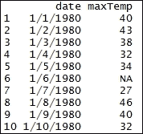

前面的数据集需要一些修改，例如必须将`date`格式更改为时序分析支持的格式，并且必须用适当的值替换数据集中缺失的值。我们将展示如何实现对数据集的这些更改。

首先，我们可以使用以下代码更改数据的格式:

```
data$date <- as.Date(data$date, "%m/%d/%Y")

```

要了解更多关于日期和时间格式的信息，请使用`strptime`命令进行检查。现在，我们需要用最合适的值替换 NA 值。实现这一点的最佳方法是以日期为基础计算平均值，因为我们有一组很好的历史数据，无论何时发现值丢失，我们都可以根据同一天数据的历史值，用特定丢失日的平均值来替换它们。这可以使用以下代码实现:

```
# create day - month column
data$dayMonth <- strftime(data$date, format="%m-%d")
# compute the average for the day - month combination
data <- transform(data, mavg =ave(maxTemp,dayMonth, FUN=function(x) mean(x,na.rm=TRUE) ))
# replace the missing value with the mean
newdata <- transform(data, maxTemp =ifelse(is.na(maxTemp),mavg,maxTemp))
head(newdata)

```

上述代码的输出如下:

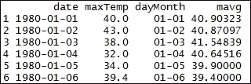

```
# selecting required data
tsdata <- data.frame(newdata$date,newdata$maxTemp)
colnames(tsdata) <- c("date","maxTemp")
head(tsdata, 10)

```

上述代码的输出如下:

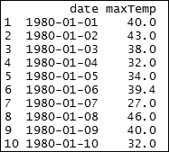

我们用相应的平均值替换了缺失值。但是，由于数据集没有捕获日期 2 月 29 日的任何数据，我们需要将其从数据集中删除。这个可以用下面的代码实现:

```
# Remove NaN values - dont use
tsdata <- tsdata[complete.cases(tsdata), ]

```

我们还可以通过计算`maxTemp`列的`mean`来检查是否有 NA 值。如果我们得到一个数值作为输出，我们就可以继续前进了:

```
mean(tsdata$maxTemp)
[1] 60.65281

```

我们根据需要设置了数据格式，现在我们将数据转换为时间序列数据集，以便构建预测模型:

```
# converting to timeseries
ts=ts(tsdata$maxTemp, start=c(1980,1),frequency=365)
head(ts)
[1] 40.0 43.0 38.0 32.0 34.0 39.4

```

让我们使用`plot`函数绘制时间序列数据:

```
plot(ts)

```

上述命令的输出如下:

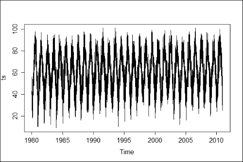

前面的图向我们展示了时间序列数据。我们有从 1980 年**到 2010 年**的数据。我们将使用之前的时间序列数据进行所有预测。****

****

# 提取图案

从上一节提到的时间序列数据图中，我们可以清楚地看到季节性模式。现在我们将看到提取季节性成分和趋势成分的方法。这可以通过使用黄土对时间序列的`stl`函数(也称为**季节性分解)来实现。这种方法使用黄土法将数据集分解为季节性、趋势性和不规则性成分。黄土是一种估计非线性关系的方法。**

首先，我们将考虑来自时间序列数据集的数据子集，以便更好地可视化组件。我们可以使用`window`函数提取数据的一个子集，该函数将时间序列数据本身以及`start`和`end`日期作为输入。在`start=c(2007,1)`参数中，2007 年是起始年，1 是 2007 年的起始月。因此，下面的代码创建了一个范围从 2007 到 2009 的子集。数据集子集化后，我们将使用`plot`函数来可视化输出:

```
newWindow = window(ts, start=c(2007,1), end=c(2009,12 ))
plot(newWindow)

```

上述命令的输出如下:

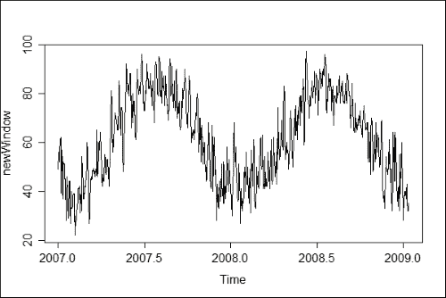

现在，从前面的子集中，我们使用`stl`函数提取季节性和趋势。我们需要将时间序列数据作为参数传递给`stl`函数，使用`s.window`参数，我们可以提取季节性成分。默认情况下，我们可以将`s.window`参数设置为周期性；或者，我们可以指定黄土窗的跨度:

```
decompose1 = stl(newWindow, s.window="periodic")
plot(decompose1)

```

上述代码的输出如下:

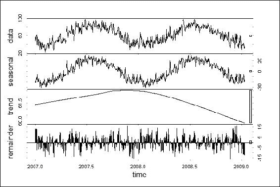

在前面的输出中，我们可以看到**季节性**、**趋势**和**剩余**成分已经分离。在定义`stl`函数时，我们只指定了季节性成分，而默认情况下会考虑其他成分。

我们现在将利用更多的参数，看看输出是如何变化的。使用下面的代码，我们定义了`t.window`参数，通过它我们定义了黄土窗的跨度以提取趋势分量。在下面的代码中，我们将趋势窗口的跨度定义为`60`。我们还将`robust`参数设置为`TRUE`，这意味着`robust`拟合将用于黄土程序:

```
decompose2 = stl(ts, s.window="periodic", t.window=60, robust=TRUE)
plot(decompose2)

```

上述命令的输出如下:

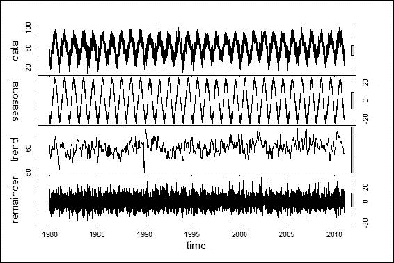

通过调整参数，我们可以清楚地看到组件发生了变化。因此，我们已经涵盖了模式提取中的重要概念。为了了解更多关于`stl`功能的参数，请参考的以下链接:

*   [https://stat . ethz . ch/R-manual/R-devel/library/stats/html/STL . html](https://stat.ethz.ch/R-manual/R-devel/library/stats/html/stl.html)
*   [https://cran.r-project.org/web/views/TimeSeries.html](https://cran.r-project.org/web/views/TimeSeries.html)
*   [https://www.otexts.org/fpp/6/5](https://www.otexts.org/fpp/6/5)

因此，您学习了提取模式的过程。我们现在将着手预测技术。为了构建预测模型，我们需要安装`forecast`包并将其加载到 R 环境中:

```
install.packages("forecast")
require("forecast")

```


# 利用 ARIMA 进行预测

我们可以使用 r 中的`arima`函数构建 ARIMA 预测模型。以下代码用于构建 ARIMA 预测模型，该模型可用于进行预测:

```
a_model=arima(as.matrix(ts), order=c(2,0,0))

```

在实现 ARIMA 技术时，我们应该知道一些重要的概念。前面的函数将时间序列数据作为输入，必须传递的另一个强制参数是顺序参数，它需要三个值`(p, d, q)`，定义如下:

*   `p`:自回归项的个数
*   `d`:平稳性所需的非季节性差异的数量
*   `r`:滞后预测误差数

我们将了解如何选择前面的值来建立预测模型。我们将详细介绍一些组合，如下所示:

*   `(1,0,0)`:该系列一般用于数据高度自相关的情况。这里，我们使用它的前一个值来预测当前值。通常，当前值将通过将前一个值乘以一个乘法因子加上一个常数来预测。
*   `(2,0,0)`:在这种情况下，根据前两个值预测当前值。
*   `(0,1,0)`:这也叫随机游走模型，既没有季节性，以前的值也不能预测现在的值。
*   `(1,1,0)`:当随机游走模型具有可由先前值定义的漂移时，使用这种情况。
*   `(0,1,1)`:当数据中没有季节性或趋势性时，可以使用这种方法。这也称为简单指数平滑法。在这种情况下，随机游走的误差被先前值的平滑所抵消。

这些是一些组合；为了详细了解每种组合，请参考以下链接:

*   [http://people.duke.edu/~rnau/411arim.htm](http://people.duke.edu/~rnau/411arim.htm)
*   [https://www.otexts.org/fpp/7/1](https://www.otexts.org/fpp/7/1)
*   [http://people.duke.edu/~rnau/411arim2.htm](http://people.duke.edu/~rnau/411arim2.htm)
*   [http://people.duke.edu/~rnau/411arim3.htm](http://people.duke.edu/~rnau/411arim3.htm)

现在我们已经建立了 ARIMA 模型，我们将使用它来预测未来的数据。我们将使用`forecast.Arima`函数来预测未来值。我们将模型本身作为参数传递给`forecast`函数，然后我们还需要传递必须预测的未来值的数量。在下面的案例中，我们基于三十年的数据预测未来十年的价值:

```
aforecast=forecast.Arima(a_model,h=3650)
plot(aforecast)

```

前一条命令的输出如下:

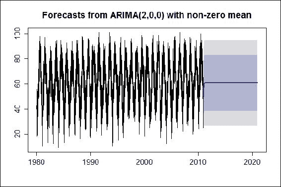

您现在可以调整用于构建模型的参数`order`,并查看对预测的影响。让我们看看简单的指数平滑模型是什么样子的:

```
a_model=arima(as.matrix(ts), order=c(0,1,1))
aforecast=forecast.Arima(a_model,h=3650)
plot(aforecast)

```

上述命令的输出如下:

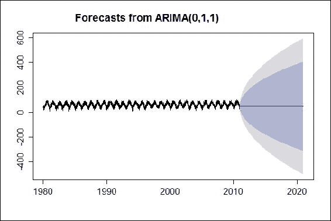

在这个例例中，我们可以清楚地看到，误差可能非常高，因为现在的范围在-500 到 500 之间，而以前的范围是 20 到 90。我们可以使用以下代码在所需的目录中打印输出:

```
dev.copy(png,filename="arimaf2.png", width=600, height=400);
dev.off ();

```

因此，您学习了使用 ARIMA 模型进行预测。在这种情况下，很难根据有限的参数控制季节性因素。我们将看到如何使用一些先进的预测算法来提高准确性，以更好地捕捉趋势和季节性。


# 使用霍尔特-温特斯进行预测

我们现在将探索使用 Holt-Winters 方法和`HoltWinters`函数构建预测模型的方法，该方法属于`forecasting`包。该函数计算给定时间序列数据的霍尔特-温特斯滤波，通过最小化预测误差的平方来确定未知参数。

除了将时间序列数据作为输入传递之外，需要传递给该函数的其他重要参数是 alpha、beta 和 gamma，如下所示:

*   `alpha`:霍尔特-温特斯滤波器的参数
*   `beta`:用于趋势分量；当设置为 false 时，该函数将进行指数平滑
*   `gamma`:用于季节性成分；当设置为 false 时，将安装非季节性组件

让我们执行下面的代码，其中趋势组件被设置为`FALSE`，因此，将对数据集执行指数平滑。我们已经将`gamma`的值设置为`0.5`:

```
h_model=HoltWinters(ts, beta=FALSE, gamma=0.5)
plot(h_model)

```

上述命令的输出如下:

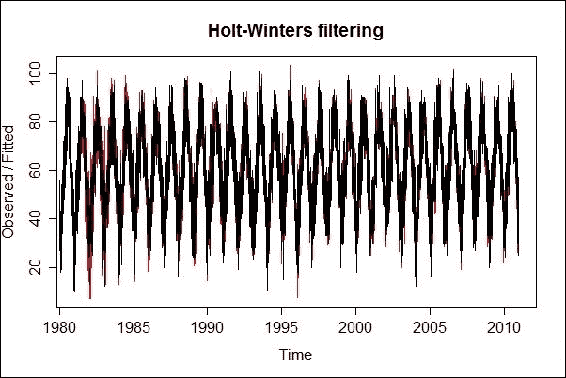

基于前面的模型，我们将使用`predict`函数预测未来。我们需要将使用 Holt-Winters 技术构建的模型传递给`predict`函数。必须传递的其他参数是周期(必须对其进行预测)、`prediction.interval`(当设置为 true 时，计算相应预测区间的下限和上限)和级别(预测的置信区间):

```
# plot forecasting with confidence interval
forecast <- predict(h_model, n.ahead = 3650, prediction.interval = T, level = 0.1)
plot(h_model, forecast)

```

上述命令的输出如下:

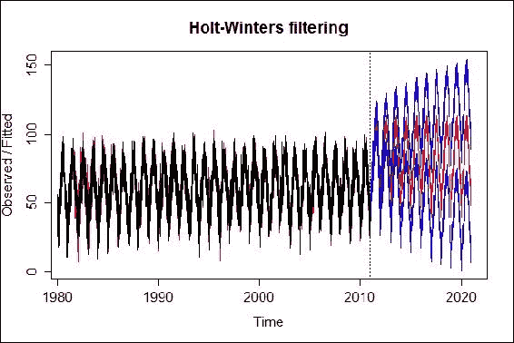

我们将改变`gamma`值，看看它如何影响预测。从下面的输出中，我们可以清楚地看到，降低`gamma`值也降低了预测范围；现在它更符合历史数据:

```
h_model=HoltWinters(ts, beta=FALSE, gamma=0.1)
forecast <- predict(h_model, n.ahead = 3650, prediction.interval = T, level = 0.1)
plot(h_model, forecast)

```

上述命令的输出如下:

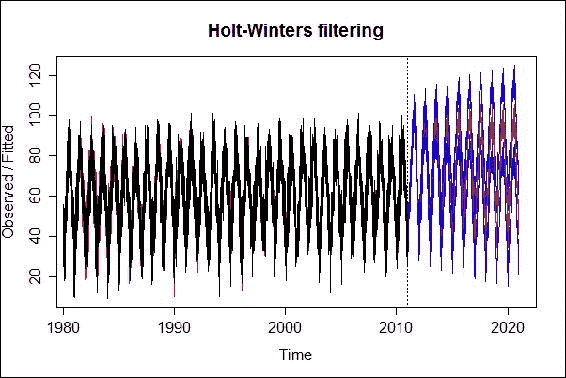

为了让看到实际预测值，我们将使用以下代码。可以使用保存预测值的向量。在下面的代码中，我们以这样一种方式格式化数据，即我们以数据帧的形式获得预测值:

```
hforecast <- as.data.frame(forecast)
predscore <- hforecast$fit
predscore <- as.data.frame(predscore)
head(predscore, 10)

```

上述命令的输出如下:

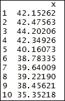

要了解关于霍尔特-温特斯算法和参数的更多信息，请参考以下链接:

[https://stat . ethz . ch/R-manual/R-patched/library/stats/html/Holt winters . html](https://stat.ethz.ch/R-manual/R-patched/library/stats/html/HoltWinters.html)


# 提高准确度的方法

有一些通用方法有助于提高预测模型的准确性。在本节中，我们将简要讨论这些方法。

广泛使用的方法是将数据集分为训练和测试。使用训练数据集构建预测模型，并使用测试数据集测试准确性。通过调整参数直到误差最小来重建预测模型。

另一种方法是结合多种算法并计算加权平均值，以达到最终预测。

由于季节性和趋势对预测模型有很大的影响，因此最好经常更新预测模型。


# 总结

在本章中，您学习了如何将数据集转换为时间序列数据集，以及如何从数据中提取季节和趋势部分。我们获得了使用 ARIMA 和霍尔特-温特斯模型建立预测模型的能力，还获得了模型中涉及的参数细节的简要介绍，以帮助调整更好的准确性。最后，我们用有助于提高整体准确性的方法完成了这一章。

在下一章，我们将介绍使用协同过滤算法的推荐系统的概念和实现。****