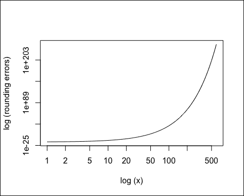
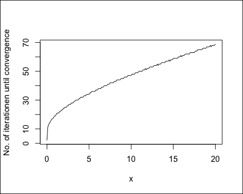

# 三、铅笔驱动理论和数据驱动计算解决方案之间的差异

在*数值数学*领域内，特别考虑了具有广泛应用的数值精度和舍入误差问题。但是统计学和数据科学也与舍入和数字精度问题纠缠在一起，数据科学家应该意识到这一点。当然，这样的问题也取决于计算机的架构。即使是以最高精度测量的数字也不能在计算机上精确地表示出来。有些问题是一般性的。例如，如果估计量的分析性质在理论上(在纸上)和实践上(在计算机上)不同，这就变得很关键。

本章的目标是提高对上述主题的认识。读者应该对机器数和舍入的概念，以及收敛问题和问题的条件敏感。这些概念不直接支持其他章节，但它们应该是任何数据科学家和统计学家的基本知识。此外，本章内容可以被视为面向计算机和数据驱动的分析的热身，这是下一章的内容。

# 机器编号和舍入问题

计算机不能精确地存储连续分布的任何值，并且连续值在精细尺度上被离散化(舍入)。应始终牢记数值的舍入和数值作为机器编号的存储；对于大多数应用程序来说，这不会导致任何问题。

“大多数”的意思是“不总是”。以下主题中显示的一些示例会让大多数没有机器编号背景知识的用户感到困惑和恼怒。

作为一个激励的例子，下面的“bug”报告(软件 R)作为一个例子:

*From: focus17@libero.it*

*至:R-bugs@biostat.ku.dk*

*主题:函数 trunc 错误*

*日期:Fri，2007 年 7 月 15:03:58 +0200 6 (CEST)*

*下面的命令会得到错误的结果:*

```r
*trunc (2.3 * 100)*
*## [1] 229*

```

回答邓肯·默多克:这是正确答案。2.3 是不可精确表示的；实际使用的值略少。

备注:`trunc()`是小数点后取值的最大整数。通常情况下，随机数不能准确地存储在浮点运算中。

因此，你不应该再对以下内容感到疑惑了:

```r
round(1.49999999999999)
## [1] 1
round(1.4999999999999999)
## [1] 2

```

`1.4999999999999999`无法在内部表示，因此四舍五入为`1.5`。当应用`round()`时，结果是`2`。由于浮点精度的限制，`1.4999999999999999`实际上被存储为`1.50000000000000`。

在下一个示例中也显示了这一点:

*出发地:wchen@stat.tamu.edu*

*至:R-bugs@biostat.ku.dk*

*主题:[Rd] match () (PR # 13135)*

日期:2008 年 10 月 7 日星期二 00:05:06

*匹配函数没有正确返回值。看看下面这个例子:*

```r
*a <- seq(0.6, 1, by = 0.01)*
*match(0.88, a)*
*## [1] 29*
*match(0.89, a)*
*## [1] NA*
*match(0.94, a)*
*## [1] 35*

```

*回答布莱恩·里普利:*

*常见问题 Q7.31 再次来袭！*

*0.89 不是 seq(0.6，1，by = 0.01)*的成员，因为 0.01 在二进制计算机中无法精确表示。*

许多用户对舍入感到疑惑。根据`round()`上的帮助页面，`round(1.5)`可能是`1`也可能是`2`。这可能与你在小学学到的和在微软 Excel 等软件中体验到的矛盾(即`1.5`总是四舍五入到`2)`，所以 R 中对`round(1.5)`也是如此，但并不适用于一般情况下对 5 的四舍五入)。从`round()`的 R 帮助中，我们得到了进一步的澄清:*对于四舍五入，预计将使用 IEC 60559 标准，“转到偶数”*。

如果你不知道的话，IEC 60559 是国际标准，而 Excel 不是。

通常，`round()`很少在 R 代码中被显式调用，因为舍入通常在打印例程中进行。

如果您想要强制舍入，例如从`0.5`到`1`，您可以将一个很小的数字加到您的值上，这样它就是一个整数:

```r
excel_round <- function (x, digits) round (x * (1 + 1e-15), digits)
round(0.5, digits = 0)
## [1] 0
excel_round(0.5, digits = 0)
## [1] 1

```

我们可以用 Kernighan 和 Plauger 1982 年的精彩句子来总结舍入问题:

> “10.0 乘以 0.1 几乎不是 1.0。”

浮点表示由以下四个参数来表征:

*   基， *b > 1* 例如，`2`
*   最小和最大指数 *emin < 0* 和 *emax > 0* 整数
*   螳螂长[t0 米]t1

因此，一个数表示如下:


这里， *e* 是指数，

如果数值的十进制表示用 *m* 位表示，最大误差等于，即，通常称为机器精度或机器ε。机器ε可以用来估计两个相邻数之间的最大距离。

## 示例–数字的 64 位表示

对于数字的 64 位二进制表示，、和，两个机器号之间的最大绝对距离表示如下:

该距离(以及更多)可以用 R 表示，如下所示:

```r
.Machine$double.eps
## [1] 2.220446e-16
.Machine$double.digits
## [1] 53
.Machine$double.xmax
## [1] 1.797693e+308

```

所有这些在实践中都有深远的影响——主要是在算法的收敛性方面。

## 确定性情况下的收敛

在术语**收敛**下，我们可以考虑这样的想法:一个随机数序列收敛到一个固定值，或者结果与某个值的相似性越来越大，或者一个抽样概率分布与某个分布越来越相似，或者通过计算结果与某个特定值的距离的期望值而形成的序列可能收敛到`0`。

迭代方法和程序的收敛性以及模拟的收敛性是统计模拟和数据科学问题中非常重要的课题。当期望值低于一个(小的和问题相关的)阈值时，我们说迭代算法已经收敛。

此外，随机变量序列收敛于某个极限随机变量是概率论中的一个基本概念，及其在统计和随机过程中的应用，(见[第六章](ch06.xhtml "Chapter 6. Probability Theory Shown by Simulation")，*概率论模拟展示*)。

下面主要讨论数列的收敛。在这种情况下，趋同的定义是:


例如，已知下列级数收敛(交替调和级数):

并且，作为发散的级数(调和级数)的例子，参考以下:

类似地，指数函数可以表示为一系列。

这些级数的收敛性可以用解析方法证明。然而，在计算机上进行计算时，这些级数的收敛并不总是如此。

## 示例–融合

让我们来看看给定的系列之一，。在 R 中，这将如下所示:

```r
masch <- function(maxit=10000){
 summe <- 0
 summeNeu <- n <- 1
 ptm <- proc.time()
 while(summe != summeNeu & n < maxit){
 summe <- summeNeu
 summeNeu <- summe + 1/n
 n <- n + 1
 }
 time <- proc.time() - ptm
 list(summe=summeNeu, time=time[3])
}
masch(10000)$summe
## [1] 10.78751
masch(1000000)$summe
## [1] 15.39273
masch(10000000)$summe
## [1] 17.69531

```

因此，你可能无法在计算机上决定这个级数是否发散(至少在计算 10 分钟后不会)。我们还可以看到，计算出的数目随着递归次数的增加而非线性增加。下表也显示了这一点。我们将迭代次数增加 10 倍:

```r
SEQ <- c(10,1000, seq(100000,10000000,length=10))
df <- cbind(SEQ, t(as.data.frame(sapply(SEQ, masch))))
df

```

|  | T2

```r
SEQ

```

 | T2

```r
sum

```

 | T2

```r
time

```

 |
|  | T2

```r
10

```

 | T2

```r
3.828968

```

 | T2

```r
0

```

 |
|  | T2

```r
1000

```

 | T2

```r
8.484471

```

 | T2

```r
0.004

```

 |
|  | T2

```r
1e+05

```

 | T2

```r
13.09014

```

 | T2

```r
0.444

```

 |
|  | T2

```r
1200000

```

 | T2

```r
15.57505

```

 | T2

```r
5.264

```

 |
|  | T2

```r
2300000

```

 | T2

```r
16.22564

```

 | T2

```r
10.164

```

 |
|  | T2

```r
3400000

```

 | T2

```r
16.6165

```

 | T2

```r
15.076

```

 |
|  | T2

```r
4500000

```

 | T2

```r
16.8968

```

 | T2

```r
19.848

```

 |
|  | T2

```r
5600000

```

 | T2

```r
17.11549

```

 | T2

```r
24.643

```

 |
|  | T2

```r
6700000

```

 | T2

```r
17.29483

```

 | T2

```r
29.573

```

 |
|  | T2

```r
7800000

```

 | T2

```r
17.44685

```

 | T2

```r
34.485

```

 |
|  | T2

```r
8900000

```

 | T2

```r
17.57878

```

 | T2

```r
39.41

```

 |
|  | T2

```r
1e+07

```

 | T2

```r
17.69531

```

 | T2

```r
44.204

```

 |

然而,系列却得出了完全不同的结论。对于`x = 1`，结果应该是无理数 *e* 。经过 19 次迭代`oldsum == newsum`，虽然 *e* 应该是无理数:

```r
x <- 1
oldsum = 0
newsum = n = term = 1
while(oldsum != newsum){
 oldsum = newsum
 term = 1/factorial(n) 
 n = n + 1
 newsum = oldsum + term
 print(paste("n = ", n, ". Diff = ", term, ". Sum = ", newsum, sep=""))
}
## [1] "n = 2\. Diff = 1\. Sum = 2"
## [1] "n = 3\. Diff = 0.5\. Sum = 2.5"
## [1] "n = 4\. Diff = 0.166666666666667\. Sum = 2.66666666666667"
## [1] "n = 5\. Diff = 0.0416666666666667\. Sum = 2.70833333333333"
## [1] "n = 6\. Diff = 0.00833333333333333\. Sum = 2.71666666666667"
## [1] "n = 7\. Diff = 0.00138888888888889\. Sum = 2.71805555555556"
## [1] "n = 8\. Diff = 0.000198412698412698\. Sum = 2.71825396825397"
## [1] "n = 9\. Diff = 2.48015873015873e-05\. Sum = 2.71827876984127"
## [1] "n = 10\. Diff = 2.75573192239859e-06\. Sum = 2.71828152557319"
## [1] "n = 11\. Diff = 2.75573192239859e-07\. Sum = 2.71828180114638"
## [1] "n = 12\. Diff = 2.50521083854417e-08\. Sum = 2.71828182619849"
## [1] "n = 13\. Diff = 2.08767569878681e-09\. Sum = 2.71828182828617"
## [1] "n = 14\. Diff = 1.60590438368216e-10\. Sum = 2.71828182844676"
## [1] "n = 15\. Diff = 1.14707455977297e-11\. Sum = 2.71828182845823"
## [1] "n = 16\. Diff = 7.64716373181982e-13\. Sum = 2.71828182845899"
## [1] "n = 17\. Diff = 4.77947733238739e-14\. Sum = 2.71828182845904"
## [1] "n = 18\. Diff = 2.81145725434552e-15\. Sum = 2.71828182845905"
## [1] „n = 19\. Diff = 1.56192069685862e-16\. Sum = 2.71828182845905"

```

我们再举一个日常工作中面临的舍入误差的例子。对于标准差的估计，存在两个数学上等价的公式(利用 Steiner 定理，可以将一种形式转化为另一种形式):

*   如在 R: 和中所做的
*   如以前版本的 Excel 所做:

如果数字是整数，用后一个公式计算标准偏差不需要计算机的帮助更容易。然而，可以看出后一个公式会导致数值不稳定(更大的舍入误差)。

让我们借助 R 来看看:

```r
## first formula for the standard deviation:
s1 <- function(x){
 s <- sum((x - mean(x))^2)
 return(sqrt(1/(length(x)-1) * s))
}
## second formula for the standard deviation:
s2 <- function(x){
#   s <- 1/(length(x)-1) * sum(x^2) - mean(x)^2
 s <- sum(x^2) - 1/length(x) * sum(x)^2
 return(sqrt(1/(length(x)-1) * s))
}
## wrapper function:
st <- function(x, type) {
 switch(type,
 precise = s1(x),
 oldexcel = s2(x)
 )
}
## generating 1000 random numbers from standard normal distribution:
x <- rnorm(1000)
## show more digits:
options(digits=16)
## results:
st(x, "precise")
## [1] 1.034835048604582
st(x, "oldexcel")
## [1] 1.034835048604582

```

两者给出相同的结果。然而，让我们尝试一个实验来显示不同之处。结果应该总是为`0.50125`，但是我们将会看到，由于数值的不稳定性，这并不总是正确的，尤其是对于第二个公式:

```r
stall <- function(x){
 c(precise=st(x, "precise"), excel=st(x, "oldexcel"))
}
## generate numbers (zeros and ones)
x <- rep(0:1,100)
stall(x)
##            precise              excel
## 0.5012547071170855 0.5012547071170855
X <- matrix(nrow=length(x), ncol=10)
X[,1] <- 1
for(n in 2:ncol(X)) X[, n] <- x + 10^(2 * (n - 1))
colnames(X) <- 2 * (1:ncol(X) - 1)
dim(X)
## [1] 200  10
## first four observations:
head(X,4)
##      0   2     4       6         8          10            12
## [1,] 1 100 10000 1000000 100000000 10000000000 1000000000000
## [2,] 1 101 10001 1000001 100000001 10000000001 1000000000001
## [3,] 1 100 10000 1000000 100000000 10000000000 1000000000000
## [4,] 1 101 10001 1000001 100000001 10000000001 1000000000001
##                   14    16    18
## [1,] 100000000000000 1e+16 1e+18
## [2,] 100000000000001 1e+16 1e+18
## [3,] 100000000000000 1e+16 1e+18
## [4,] 100000000000001 1e+16 1e+18
options(
digits=5)
apply(X, 2, stall)
##         0       2       4       6       8      10      12      14 16 18
## precise 0 0.50125 0.50125 0.50125 0.50125 0.50125 0.50125 0.50125  0  0
## excel   0 0.50125 0.50125 0.50125 0.00000 0.00000     NaN 0.00000  0  0

```

对于任何迭代来说，一个关键的一般问题是在收敛之前需要多少次迭代。我们来看看一般收敛于若 *|q| < 1* 的无穷几何级数。它具有如下公式:


让我们集中于 q 的特殊选择，q = 0.5，和 *q = 2* ，其中这些级数应该在第一种情况下发散，在第二种情况下收敛，其中对于第二种情况成立。对于 *q = 2* ，即使相对较小的 *i (i = 55)* ，级数也收敛到 2，如下所示:

```r
konv <- function(q = 2){
 s <-  0
 snew <- term <- i <- 1
 while(s != snew){
 s <- snew
 snew <-  s + q^(-i)
 i <- i + 1
 }
 list(
iteration = i, total = snew, lastterm = 2^(-i))
}
konv()
## $iteration
## [1] 55
## 
## $total
## [1] 2
## 
## $lastterm
## [1] 2.7756e-17

```

并且对于 *q = 0.5* ，它发散:

```r
konv(q = 0.5)
## $iteration
## [1] 1025
## 
## $total
## [1] Inf
## 
## $lastterm
## [1] 2.7813e-309

```

可以看出，最后几项已经小于机器号。

关于收敛的最后一个例子如下。考虑前面计算 *e* *x* 的 R 代码，我们将计算精度与`exp ()` 函数进行比较。误差有多大？

```r
expsum <- function(x){   oldsum <- 0
 newsum <- n <- term <- 1
 while( oldsum != newsum )
 {   oldsum <- newsum
 term <- term * x/n
 n <- n + 1
 newsum <- oldsum + term
 }
 list(iteration = n, summe = newsum)
}
x <- 1:1000
absError <- sapply (x, function (x) abs (exp (x) - expsum (x) $ sum))
relError <- absError / exp (x)

```

对于双精度(和 64 位)，(大约 16 位小数):

```r
roundingError <- sapply(x, function(x) 2^(-53)*exp(x))

```

在下图中，(*图 3.1* )我们可以看到舍入误差是如何随着 **x** 值的增加而爆炸的:

```r
plot(x[1: 600], roundingError[1:600], log = "xy", xlab = "log (x)", ylab = "log (rounding errors)", type = "l")

```



图 3.1:x 的变化数字和相应的舍入误差

现在考虑不同的 **x** 在收敛之前的迭代次数。迭代次数会随着 **x** 线性增加吗？以什么方式？

我们以增量`0.1`在`0`和`20`之间改变 *x* ，并在*图 3.2* 中产生和显示结果:

```r
x <- seq(0, 20, by=0.1)
iter <- sapply(x, function(x) expsum(x)$iteration)
plot(x, iter, xlab="x", ylab="No. of iterationen until convergence", type="l")

```



图 3.2:收敛不同 x 值所需的迭代次数

如果 *x > 3* 直到大的 **x** 的断点(溢出，在上图中未示出)，则给出 **x** 与收敛之前的迭代次数之间的线性关系。


# 问题的状况

其他众所周知的舍入误差问题在《计算数学基础》中有所描述。在下文中，我们考虑与矩阵运算的数值精度相关的另一个舍入问题。对于问题的条件，在大多数情况下，互反条件数是在计算机程序中估计的。条件数倒数越小(或条件数越高)，问题的条件越差。

2-范数条件数(在 R 中是`kappa()`)表示矩阵的最大与最小非零奇异值的比值，而`rcond()`计算倒数条件数的近似值；看一下细节。

例如，条件较差的问题如下:

```r
library("Matrix")
## reciprocal approximate condition number
rcond(Hilbert(9)) ## worse
## [1] 9.0938e-13
## reciprocal condition number
x1 <- cbind(1, 1:10)
head(x1, 3)
##      [,1] [,2]
## [1,]    1    1
## [2,]    1    2
## [3,]    1    3
rcond(x1) ## much better
## [1] 0.05278

```

这种不稳定性(病态问题)主要发生在回归分析中多重共线性的情况下。如果一个(或多个)预测变量可以由其他预测变量的线性组合很好地描述，则出现多重共线性。这导致了经典方法的严重数值问题，甚至经常导致无意义的估计。


# 总结

由于数值精度问题，数据科学家面临着舍入误差和不稳定性这两个问题。

在 R 中，人们应该意识到打印结果并不意味着看到精确的数字。它只是对给定的数字进行四舍五入(*默认值= 7* )，但在内部，数字以更多的数字保存。

无论如何，我们在本章看到，计算机的浮点运算不能代表所有的数，几乎每个数都四舍五入到下一个偶数。通过阅读本章，您学习了机器数字和舍入的基本知识。这些知识对于任何数据科学家和统计学家来说都是必须的，尽管这些问题在接下来的章节中扮演着次要的角色。我们在本章中也看到了收敛问题:如何观察给定问题的收敛。这将在后面的章节中继续和扩展，比如在[第四章](ch04.xhtml "Chapter 4. Simulation of Random Numbers")、*随机数的模拟*和[第五章](ch05.xhtml "Chapter 5. Monte Carlo Methods for Optimization Problems")、*最优化问题的蒙特卡罗方法*。


# 参考文献

Brian W. Kernighan 和 P.J. Plauger 编写的《编程风格的要素》第二版，1982 年，美国纽约:McGraw-Hill 公司。