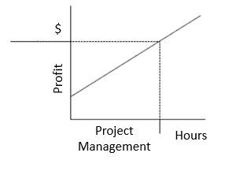
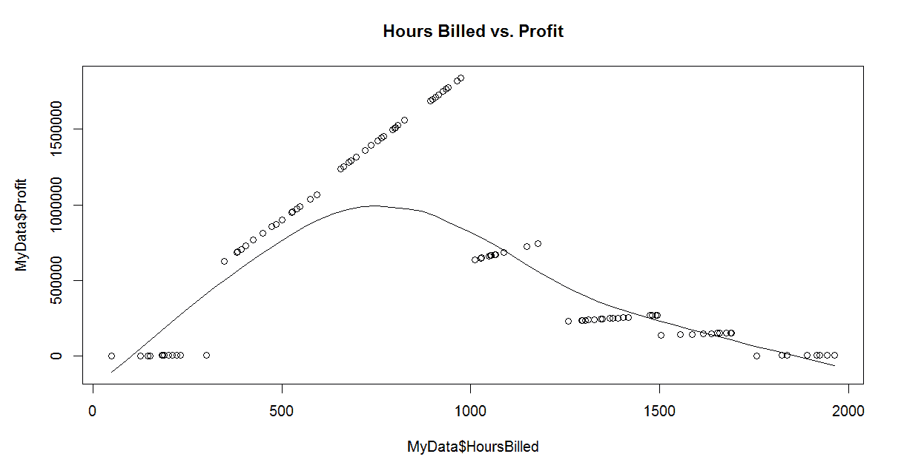
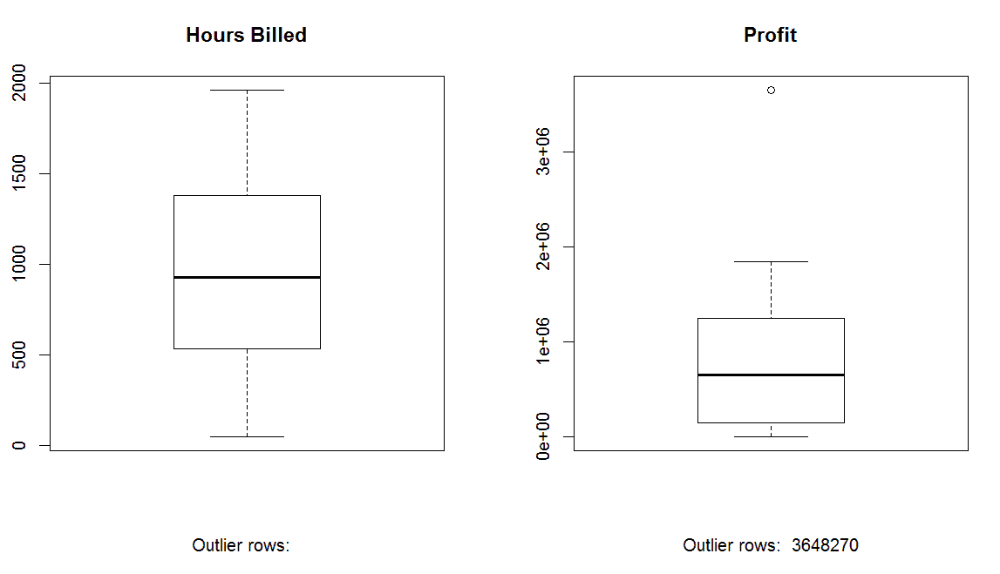
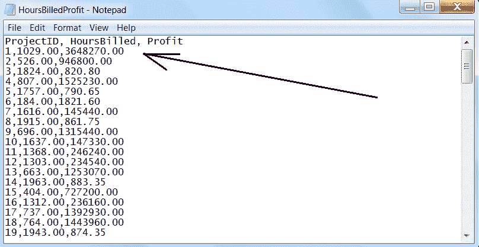
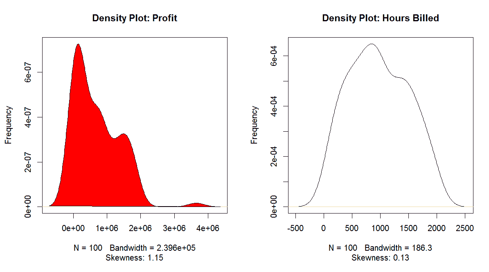
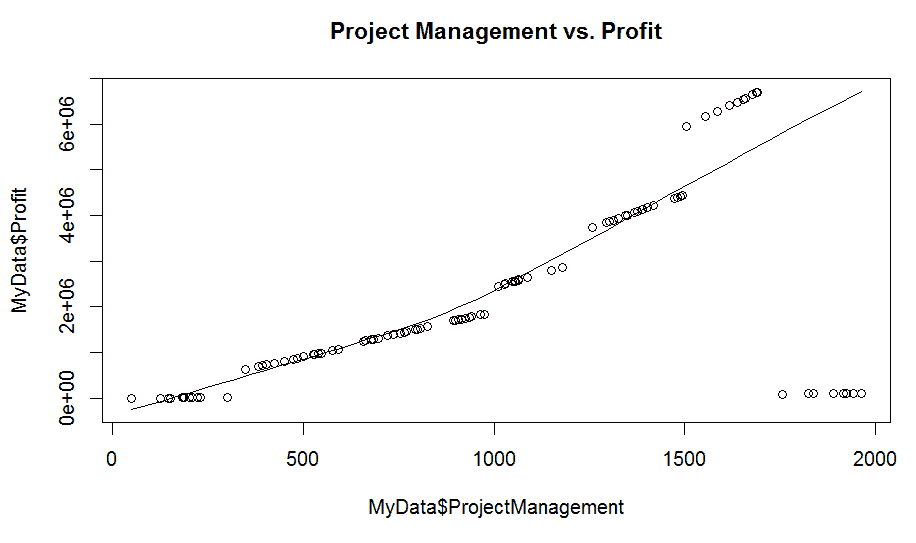
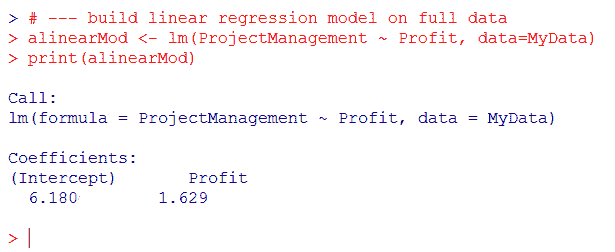
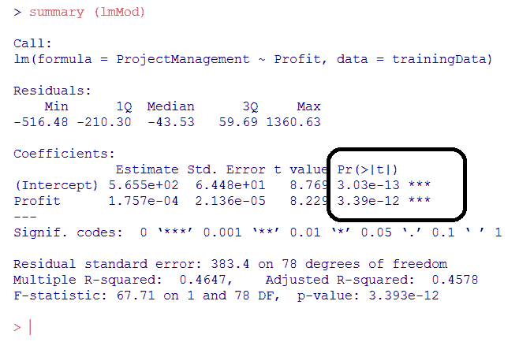

# 六、数据库进展到数据库回归

在本章中，我们首先提供(数据)统计回归的定义，然后继续讨论回归概念，并概述开发人员如何在典型的数据开发项目中使用最常见的回归技术进行预测。

在本章中，我们将信息分为以下几个部分:

*   统计回归导论
*   识别使用回归的机会的方法(在数据项目中)
*   r 和统计回归
*   一个工作实例


# 引入统计回归

正如所承诺的，让我们从本章开始，用一个章节清楚地解释什么是统计回归。

首先，统计回归通常也被称为回归分析，是一个估计变量之间关系的过程**。**这一过程包含许多变量建模和分析技术，重点是因变量和一个(或多个)自变量(或**预测器** **)之间的关系。**

因此，具体来说，回归分析是为了识别和理解当任何一个自变量(一个独立于**且不受其他变量影响的变量**)发生变化而其他自变量保持不变时，因变量(一个**依赖于**其他因素的变量)的(最佳代表)值是如何变化的。

一个简单的例子可能是，在一段时间内，花在营销上的总费用(自变量例子)如何影响总销售额(因变量例子)(营销越多，销售额越高，真的就这么简单吗？)，或者总营销费用(独立变量)、产品价格折扣(另一个独立变量)和销售额(因变量)之间可能存在关联？

请记住这一关键点，回归分析用于了解哪些自变量与因变量相关，而不仅仅是这些变量之间的关系。此外，因果关系的推断(自变量和因变量之间)是一个重要的目标。但是，这可能会导致错觉或虚假的关系，所以建议谨慎！

总的来说，回归分析可以被认为是在给定被观察的自变量的情况下，估计因变量的值的条件期望，也就是说，当自变量被设置为某些值时，努力预测因变量的平均值。我称之为杠杆效应——意思是当一个成分的值增加或减少时，它会直接影响至少另一个(变量)的值。

回归分析过程的另一个目的是建立位置参数或分布的分位数。换句话说，这个想法是确定可能是截止值的值，划分概率分布值的范围。

你会发现回归分析可以成为预测和预报的伟大工具(不仅仅是复杂的机器学习应用)。稍后我们将探索一些真实世界的例子，但是现在，让我们来看看这个过程的一些技术。


# 回归的技术和方法

你会发现各种执行回归分析的技术已经被开发和接受。

一些研究可能会显示如下顶级技术:

*   线性的
*   物流的
*   多项式
*   逐步地
*   山脉
*   套索

以下是对每一个问题的简短回答:

*   **线性回归**:线性回归是最基本的回归类型，常用于预测分析项目。事实上，当你在处理单个预测因子(变量)时，我们称之为简单线性回归，如果有多个预测因子变量，我们称之为多元线性回归。简而言之，线性回归使用线性预测函数，其值根据模型中的数据进行估计。
*   **逻辑回归**:逻辑回归是因变量为分类变量的回归模型。这意味着变量只有两个可能的值，例如，通过/失败、赢/输、活着/死了或健康/生病。如果因变量有两个以上的可能值，可以使用各种改进的逻辑回归技术，如多项式逻辑回归、有序逻辑回归等。
*   多项式回归:当我们谈到多项式回归时，这种技术的重点是将自变量和因变量之间的关系建模为 n 次 T2 多项式。
    *   多项式回归被认为是多元线性回归的特例。从基线预测值的多项式展开得到的预测值被称为**交互特征**。
*   **逐步回归**:逐步回归是一种使用某种自动化程序来连续执行逻辑步骤的技术，也就是说，在每一步中，基于某种预先指定的标准，考虑在自变量集合中增加或减少一个变量。
*   岭回归(Ridge regression):预测变量通常被认为是相互关联的。当这种情况发生时，任何一个变量的回归系数取决于模型中包括哪些其他预测变量，以及哪些变量被排除在外。岭回归是一种技术，其中一个小的偏差因素是添加到选定的变量，以改善这种情况。因此，岭回归实际上被认为是减轻预测变量之间多重共线性的补救措施。
*   **套索回归** : **套索** ( **最小绝对收缩选择算子**)回归是一种同时执行预测变量选择和正则化的技术，目的是提高其产生的结果的预测精度和可解释性。


# 选择你的技术

除了前面提到的回归技术之外，还有许多其他的技术需要考虑，很可能还会有更多。有这么多选择，选择适合您的数据和项目的技术是非常重要的。

与其说是选择正确的回归方法，不如说是选择最有效的回归方法。

通常，您使用数据来确定您将使用的回归方法。首先，为您的数据建立统计数据或配置文件。为此，你需要识别和理解不同变量的重要性、它们之间的关系、系数符号**、**及其影响。

总的来说，这里有一些从你的项目中选择正确的回归方法的好建议:

1.  复制别人做的和成功的东西。做研究。将其他项目的结果整合到你的项目中。不要多此一举。此外，即使观察到的方法不太适合它的使用，也许一些简单的调整会使它成为一个好的选择。
2.  尽可能保持你的方法简单。许多研究表明，更简单的模型通常会产生更好的预测。从简单开始，只根据需要使模型变得更复杂。模型越复杂，就越有可能是专门为数据集定制的模型，概化就会受到影响。

3.  检查你的工作。在评估方法时，检查残差图(在本章的下一节中会有更多介绍)，因为它们可以帮助您避免不适当的模型，并调整您的模型以获得更好的结果。
4.  运用你的专业知识。没有一种统计方法能像你这样理解潜在的过程或主题领域。您的知识是一个至关重要的部分，并且很可能是为您的项目确定最佳回归方法的最可靠的方式。


# 合身吗？

在选择了您认为适合与您的数据一起使用的模型(也称为确定方法是最适合的)之后，您需要验证您的选择，即确定其适合性。

拟合良好的回归模型导致预测值接近观察到的数据值。

如果没有信息性预测变量，通常会使用均值模型(使用每个预测值的均值)。因此，建议的回归模型的拟合应优于平均模型的拟合。

作为一名数据科学家，你需要仔细检查决定系数，测量估计的标准误差，分析回归参数和置信区间的显著性(将在本章后面详细讨论)。

请记住，回归模型拟合得越好，结果就可能越精确，或者更好。

事实证明，简单的模型会产生更准确的结果！当选择一种方法或技术时，请始终记住这一点，即使问题可能很复杂，也不总是必须采用复杂的回归方法。


# 识别统计回归的机会

通常成为官方统计项目的典型统计分析工作，从确定一个目标开始，然后最终确定实现该目标的正确方法。

流行的数据科学观点认为，确定一个目标就是确立统计分析工作的目的，然后将目的分为三个方面:

1.  汇总数据(也称为构建数据配置文件)
2.  揭示和探索数据中变量之间的关系
3.  检验差异的显著性(数据中变量或组之间)


# 汇总数据

如果您的统计目标是汇总数据，您可以生成描述性统计数据，如平均值、标准差、方差等。


# 探索关系

如果您的统计目标是寻找和了解数据中的关系，您首先要检查数据的形式，或者换句话说，问这样一个问题:您的数据是围绕频率还是围绕测量？由此，预测变量的数量将决定您在项目中应该使用什么样的回归(或其他)方法。


# 测试差异的显著性

如果您的统计目标涉及测试数据中发现的差异(组之间)，那么您首先要确定这两个组以及这些组的数量。数据分析涉及具有单个组(感兴趣)的数据利用(比较值)平均值，而具有多个组的数据可以使用组的数量来确定应该考虑哪种预测方法。


# 项目盈利能力

作为一个真实的例子，让我们考虑一个咨询服务组织，它收集了描述其项目工作的数据。该组织可能会签约领导各种规模和工作水平的技术和/或业务相关项目。每个项目都有支出和收入。有些项目有利可图，有些则不然。公司感兴趣的是确定哪些变量(如果有的话)是预测项目盈利能力的候选变量，换句话说，哪些变量(特别是)是因变量(在这种情况下是盈利能力)的重要预测变量？

检查数据，我们看到一个很好的变量和测量列表；其中一些列举如下:

*   分配给项目的顾问人数**全职** ( **英尺**)
*   分配到项目的顾问人数**兼职** ( **PT**
*   分配给项目的分包商数量(FT 或 PT)
*   全职分配给项目的客户资源数量
*   兼职分配给项目的客户资源数量
*   多年的项目核心技术经验
*   项目管理总时数
*   总开发时间
*   每小时收费率
*   开票总小时数
*   项目中使用的技术数量
*   项目风格(时间和材料，不超过或员工扩充)等

一般来说，当数据科学家使用回归分析时，他或她希望回答以下三个问题:

1.  一组预测变量能很好地预测一个结果变量吗？在我们的项目盈利能力的例子中，分配给一个项目的全职顾问的数量能很好地预测盈利能力吗？
2.  哪些变量(特别是)是因变量的重要预测因素？同样，在我们的项目盈利能力的例子中，我们能否确定一个重要的预测因素，如分配给项目的全职顾问的数量，或者总的项目管理时间？

3.  什么是回归方程(一些变量对其他变量的估计关系或影响),它显示了预测变量集如何用于预测结果？在我们的项目盈利能力示例中，回归方程是这样的吗？



我们的项目盈利能力示例看起来可能是回归分析的合理候选。

在本章 **'** 的下一节**、**中，我们将尝试为项目数据建立一个档案，然后使用适当的回归技术来建立它。然后，检查变量关系，并有希望根据所选的预测变量预测项目盈利能力。


# r 和统计回归

在我们开始建模之前，让我们花一点时间来验证 R 作为统计建模工具的使用。

r 是一个开放源码的统计环境，也是一种强大的编程语言，仍然是统计建模最受欢迎的选择之一。模仿 S 和 S-Plus，R 拥有不断增长的、广泛的受众，并由 R 核心开发团队(一个志愿开发人员的国际团队)很好地维护着。

r 和许多相关资源可以很容易地在网上找到，还有下载软件的详细说明、附带的软件包和其他文档来源。此外，世界各地的人们为 R 编写了大量的专用例程，并作为 R 包免费提供。

由于 R 是一种编程语言，它为您的项目带来了编程的力量，但它确实需要一些工具方面的专业知识。令人欣慰的是，它提供了一个**图形用户界面** ( **GUI** )来使事情变得更简单，并允许你从其他来源和项目中复制和粘贴。


# 一个工作实例

现在让我们回到项目盈利能力的真实例子上来！

我们知道，我们的咨询服务机构的项目结果数据描述了其所有项目工作在一段时间内的结果。我们的数据中有 100 个项目(或观察值),由两个变量组成:计费时间和利润。第一个变量是不言自明的:它是向客户收取的该项目的总时数。第二个是美元金额，等于从客户处收取的收入减去所有费用(用于项目)。

我们知道，每个项目都有支出和收入，有些项目盈利，有些项目不盈利。此外，即使是盈利的项目，其盈利水平也相差很大。同样，公司有兴趣确定哪些变量(如果有的话)是预测项目盈利能力的候选变量。

让我们开始统计分析吧！


# 建立数据配置文件

在尝试使用我们的项目结果数据来构建回归模型之前，通常会尝试分析数据，确定关键变量。最常见的情况是，您会用数据创建各种可视化效果(我们将在本节的下一部分中详细介绍),以努力理解数据中变量或组之间的因果关系。

在统计学中，这些任务通常被称为执行图形分析和相关性研究。


# 图形分析

在我们的统计分析示例中，我们希望构建一个简单的回归模型，通过建立与计费时间(对客户)(计费时间)的统计显著线性关系，我们可以使用该模型来预测项目盈利能力(利润)。因此，我们可以通过以各种方式绘制这些数据来开始我们的图形分析。

通常情况下，对于每个独立变量(预测值)，应绘制以下图表来可视化以下行为:

*   **散点图**:绘制散点图是为了显示预测值和响应之间的线性关系。
*   **箱线图**:绘制该图是为了找出变量中的任何异常值。预测值中的异常值会极大地影响预测，因为它们很容易影响最佳拟合线的方向/斜率。
*   **密度图**:绘制该图是为了查看预测变量的分布。理想情况下，接近正态分布(钟形曲线)，不向左或向右倾斜是优选的。

散点图有助于直观显示因变量(响应变量)和自变量(预测变量)之间的任何线性关系。

理想情况下，如果您正在观察多个预测变量，应该针对每个变量的响应绘制一个散点图。

以下是简单的 R 命令，这些命令使用项目结果数据中的变量`HoursBilled`和`Profit`来创建散点图可视化:

```r
# --- load our project results data 

MyData <- read.csv(file="c:/Worker/HoursBilledProfit.csv", header=TRUE, sep=",") 

# --- build our scatter plot on the relationship between our 
# --- variables 

scatter.smooth(x=MyData$HoursBilled, y=MyData$Profit, main="Hours Billed vs. Profit")  # scatterplot 
```

下图是我们生成的散点图:



**计费小时数与利润**散点图以及上图中所示的平滑线表明，项目计费总小时数与利润变量之间存在先线性增加后线性减少的关系。

请注意，线性回归中的一个基本假设是，响应变量和预测变量之间的关系是线性的和可加的，因此该数据最初看起来是合适的。

我们的下一步是寻找数据中的异常值。落在 1.5 *四分位数范围(1.5 * IQR)之外的数据点被视为异常值，其中 IQR 被计算为该变量的第 25 百分位和第 75 百分位值之间的距离。

在数据的统计分析中，箱线图通常用于通过四分位数以图形方式描绘数字数据组。这些可视化还可能有从方框垂直延伸的线条(一些数据科学家将这些线条称为胡须)，表明上下四分位数之外的可变性。箱线图非常适合识别异常值。

以下 R 命令用于生成箱线图:

```r
# --- load our project results data 

MyData <- read.csv(file="c:/Worker/HoursBilledProfit.csv", header=TRUE, sep=",") 

par(mfrow=c(1, 2))  # divide graph area in 2 columns 

# --- box plot for hours billed 

boxplot(MyData$HoursBilled, main="Hours Billed", sub=paste("Outlier rows: ", boxplot.stats(MyData$HoursBilled)$out))   

# --- box plot for Profit 

boxplot(MyData$Profit, main="Profit", sub=paste("Outlier rows: ", boxplot.stats(MyData$Profit)$out))   
```

以下是从我们的项目结果数据中生成的前述 R 命令的异常箱线图:



您可以注意到可变利润中的异常值(在上图的右侧)。**异常行 3648270** 对应于我们文件中的一个数据点；



最后，可以创建一个密度图来查看我们的响应变量(`ProjectID`、`HoursBilled`和`Profit`)与常态的接近程度。为此，我们可以使用以下 R 命令:

```r
# --- load our project results data 

MyData <- read.csv(file="c:/Worker/HoursBilledProfit.csv", header=TRUE, sep=",") 
library(e1071) 

# --- divide graph area in 2 columns 

par(mfrow=c(1, 2))   

# --- density plot for profit 
plot(density(MyData$Profit), main="Density Plot: Profit", ylab="Frequency", sub=paste("Skewness:", round(e1071::skewness(MyData$Profit), 2)))   
polygon(density(MyData$Profit), col="red") 

# --- density plot for hours billed 

plot(density(MyData$HoursBilled), main="Density Plot: Hours Billed", ylab="Frequency", sub=paste("Skewness:", round(e1071::skewness(MyData$HoursBilled), 2)))   
polygon(density(MyData$HoursBilled), col="red")
```

以下是密度图:



那么，我们是否看到了一个项目花费的时间和这个项目的利润(如果有的话)之间的相关关系？

我们确定的一个方法是建立变量之间的相关性。相关性表明成对出现的两个变量之间的线性依赖程度，就像我们认为的小时计费和(项目)利润。

如果数据科学家发现利润随着每个项目小时数的增加而增加，那么这两个变量之间会有很高的正相关性，因此，它们之间的相关性会更接近于 1。相反，相反的关系是正确的，在这种情况下，变量之间的相关性将接近于-1。

越接近 0 的值表示变量之间的关系越弱。低相关性(-0.2 < x < 0.2)可能表明响应变量(Y)的大部分变化是预测变量(X)无法解释的，在这种情况下，我们可能应该寻找更好的解释变量。

R 编程语言再次为我们提供了一种轻松实现这一点的方法:`cor`函数，它将确定我们的两个变量之间的相关性:


给定前面的输出，我们可以确定真的没有任何理由相信随着预计增加的小时数，盈利能力也会增加。有了这些信息，我们应该看看其他一些可能的预测变量。

出于时间的原因，(我们想继续我们的回归模型构建)而不是重新开始，我们将做出一个有根据的猜测，也许可变的总项目管理时间是项目盈利能力的一个很好的预测。让我们尝试使用这个变量运行相同的 cor 函数:


如前面计算的相关性所示(通过使用 R 函数`cor`再次生成)，变量`ProjectManagement`似乎与项目盈利能力具有更高的正相关性(比计费小时数)。

通常，我们会花时间使用这些数据重建我们在本节前面创建的可视化效果(例如下面的散点图)，但同样，为了节省时间，我们将继续进行:



我们可以看到(从我们的散点图:**利润管理与利润**)这一次，我们对数据进行了平滑的线性回归，因为随着项目管理时间的增加，项目的总体利润也增加了！

让我们继续前进！

因此，现在我们已经建立了(看起来)与散点图(以及上一节中的其他示例)等可视化的良好线性关系，然后通过计算正相关性(使用 R 函数`cor`)，我们可以尝试构建一个实际的线性回归模型。

R 再次为我们提供了一个相关的函数— `lm()`。`lm()`函数接受两个主要参数:

*   公式(类公式的对象)
*   数据(通常是一个`data.frame`)

下面是我们可以用来生成 R 回归模型的 R 命令:

```r
# --- build linear regression model on all of our 
# --- project results data 

alinearMod <- lm(ProjectManagement ~ Profit, data=MyData) 
print(alinearMod) 
```

以下是构建我们模型的结果:



使用前面的 R 命令建立一个线性模型，我们以项目管理(Project Management)的数学公式的形式建立了预测值(项目管理时间)和响应(项目的盈利能力)之间的关系，作为`Profit`的函数。

我们可以使用前面输出的系数(`Intercept: 6.180`和`Profit: 1.629`)来创建公式:

*项目管理= 6.180+1.629 *利润*

利用我们的线性模型和公式，如果已知相应的项目管理(总时数)，我们可以预测项目的利润值。激动人心！

尽管我们已经建立了预测(项目盈利能力)的方法，但请记住，在使用任何回归模型之前，您必须确保它在统计上是显著的。


# 用我们的线性模型预测

我们刚刚使用 R 命令和我们所有的项目结果数据创建了一个线性回归模型。在现实世界中，人们更愿意使用所谓的 **80:20 样本规则**将数据分块。这意味着 80%的数据将用于训练模型，而另外 20%可用于测试和验证。

现在让我们来看一下这个过程。


# 步骤 1:分块数据

我们可以读入我们的项目结果数据，然后使用 R sample 函数创建我们的两个数据块(如`trainingData`和`testData`)，如下面的 R 命令所示:

```r
# --- first load our project results data 
# --- from our CSV file into the object MyData 

MyData <- read.csv(file="c:/Worker/ProjectManagementProfit.csv", header=TRUE, sep=",") 

# --- next we are setting the ""sample seed"" 
# --- to reproduce results of random sampling 

set.seed(100)   
trainingRowIndex <- sample(1:nrow(MyData), 0.8*nrow(MyData))   

# --- create our ""chunk"" of  
# --- model training data 

trainingData <- MyData [trainingRowIndex,] 

# --- create our ""chunk of  
# --- test data   
testData <- MyData [-trainingRowIndex,]
```


# 步骤 2:根据训练数据创建模型

就像我们在本章前面所做的那样，我们可以使用 R 函数 lm，用我们的`trainingData`块 **:** 来创建我们的回归模型

```r
# --- Build the model on training data  

lmMod <- lm(ProjectManagement ~ Profit, data=trainingData)  
```


# 步骤 3:预测测试数据的预期利润

然后，我们使用 R 函数 predict 来创建项目预测，如以下 R 命令所示:

```r
# --- predict project profitability  

ProfitPred <- predict(lmMod, testData) 

```

以下是前面的 R 命令生成的输出:


# 步骤 4:检查模型

也许我们过程的最后一步是创建模型的总和，并检查它的统计意义。

我们可以用 R 函数总结:

```r
# --- generate the summary of the model  

summary (lmMod)
```

这将生成以下输出:



从前面生成的输出中，我们可以看到我们的模型预测值的`p`值被直观地解释为显著的，由行末的显著性星号(轮廓)表示，因此我们知道我们有一个统计上显著的模型。


# 第四步:准确性和误差

实际值(实际项目利润总额)和模型预测值(利润)之间的简单关联可用于测试我们项目利润预测的准确性。

这在以下 R 命令中进行了说明，如下所示，我们再次使用 R 函数`cor`:


高相关精度意味着实际值和预测值具有相似的方向移动，即当实际值增加时，预测值也增加，反之亦然；或者假设随着项目管理总时间的增加或减少，项目的盈利能力也以同样的方式增加或减少！


# 摘要

在这一章中，我们介绍了统计回归，指出了最常见的回归方法，并提供了一些为特定统计项目选择校正方法的建议。此外，我们提到了如何识别使用统计回归的机会，并讨论了数据汇总、探索关系和测试差异的显著性。

最后，我们总结了一个线性回归建模的工作示例，用于预测项目盈利能力。

下一章将向开发人员介绍用于改进数据模型的统计正则化的思想，以帮助理解什么是统计正则化，为什么它是重要的，以及对各种统计正则化方法感到舒适。