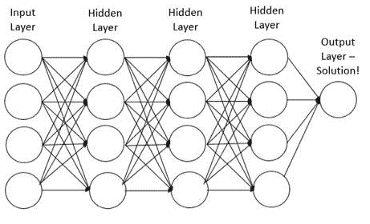
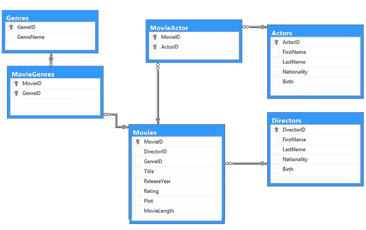
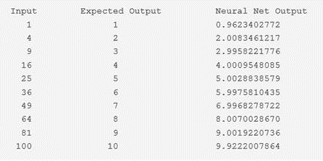
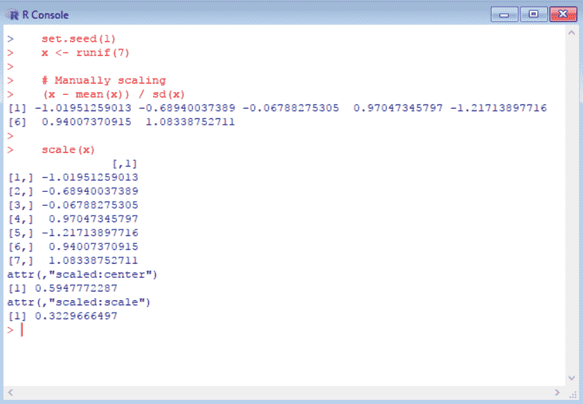

# 九、数据库和神经网络

在本章中，我们将查看并定义**人工神经网络** ( **安**)，并从数据开发人员的数据、数据库和数据模型知识中提取数据，以帮助他或她理解神经网络的目的和用途，以及为什么神经网络对数据科学和统计学如此重要。

我们将本章中的信息分为以下几个主要部分:

*   神经网络的定义
*   将神经网络模型与数据库模型相关联
*   看看基于 R 的神经网络
*   用例


# 问问任何一位数据科学家

今天，如果你问任何一位数据科学家关于统计方法的问题，(甚至几个)，你很可能会发现，在数据科学和统计行业的实践中，有两种最著名的统计方法用于预测建模。我们在第六章 *【数据库进展到数据库回归】*中介绍了这两种方法。

这两种方法如下:

*   线性回归
*   逻辑回归

**线性回归**方法可能被认为是*经典*或最常见的问题起点，其目标是预测一个数字量。**线性回归**(或 **LR** )模型基于输入特征的线性组合。

**逻辑回归**方法使用该线性特征组合的非线性变换，以限制区间[0，1]中的输出范围。这样，它预测输出属于两个类别之一的概率。因此，这是一种众所周知的分类技术。

回想一下，分类是在一组训练数据的基础上，识别一个新的或不同的观察值属于哪一组类别(或亚群体)的过程。

这两种方法各有所长，但都有一个共同的缺点，即它们都不太擅长预测是否必须处理大量输入要素的情况。

在这一章中(作为线性和逻辑回归的替代)，我们想介绍人工神经网络的概念，从技术上讲，它是一种解决回归和分类问题的非线性方法。

当处理更高维度的输入特征空间时，它们(人工神经网络)明显更健壮，并且对于分类，它们拥有一种**自然的**方式来处理两个以上的输出类。我们将在这一章的后面更多地讨论人工神经网络的优点。

人工神经网络是一种**受生物学启发的**统计方法或模型(基于生物神经网络的结构和功能)，其根源可以追溯到 20 世纪 40 年代。

另一个有趣的观点:

神经网络是一种机器学习框架，试图模仿自然生物神经网络的学习模式。何塞·波尔蒂利亚，Udemy 数据科学讲师。

从那时起，人们对人工神经网络的兴趣发生了很大的变化，主要是因为第一个人工神经网络模型非常原始，因此与当时的预期相比，在实践中受到了限制。

神经网络并不总是受欢迎的，部分原因是它们过去是，并且在某些情况下仍然是计算昂贵的，部分原因是与更简单的方法如**支持向量机** ( **支持向量机**)相比，它们似乎没有产生更好的结果。然而，神经网络再一次引起了人们的关注并变得流行起来。
——米琪·爱丽丝，2015 年 9 月。

此外，训练大型人工神经网络确实需要大量的计算资源。最近，随着分布式按需计算资源变得越来越普遍，对人工神经网络的兴趣出现了巨大的复苏，机器学习的一个重要领域，称为**深度学习**，已经非常受欢迎，并显示出巨大的前景。

时机正好！

因此，对于数据开发人员来说，现在是开始学习人工神经网络模型的大好时机。

深度学习(也称为**深度结构化学习**、**分层学习**或**深度机器学习**)是一类机器学习算法，使用级联的多层非线性处理单元进行特征提取和转换([en.wikipedia.org/wiki/Deep_learning](https://en.wikipedia.org/wiki/Deep_learning))。

我们开始吧！


# 定义神经网络

我们的方法是始终从一个可靠的定义开始。那么，人工神经网络到底是什么？或许:

模仿人脑和神经系统的计算机系统。

通俗的理解，或者，如果我们在网上查一下定义:

*在机器学习和认知科学中，人工神经网络(ann)是一系列受生物神经网络(动物的中枢神经系统，特别是大脑)启发的模型，用于估计或近似依赖于大量输入且通常未知的函数。*

因此有许多定义，但概括地说，你会发现人工神经网络的所有定义的共同主题是，它被定义为基于人脑如何工作的概念的计算机数据模型。



人工神经网络模型表示

如前面的屏幕截图所示，典型人工神经网络的构建基于以下一些因素:

*   节点
*   层
*   连接


# 节点

每一层都由许多互连的节点组成——每个节点都包含被称为**激活功能**的东西。

对于数据中存在的每个预测变量，输入图层中至少有一个结点。输入节点将输入值(要解决的**问题**)提供给(下一个)隐藏层中的每个节点。

对每个节点的输入求和以给出单个值， *x* 。然后输入到节点的激活函数，节点的输出是其激活函数的输出， *f* ( *x* )。

有许多函数可用于人工神经网络节点，包括径向基函数或简单的线性函数，但最常见的是 sigmoid 或 logistic 函数。

sigmoid 函数通常是最常见的，也可能是最容易理解的。sigmoid 函数是一个具有 S 形曲线或 sigmoid 曲线特征的数学函数。Sigmoid 函数有一个全实数域，返回值通常从 0 到 1 单调递增，或者从 1 到 1 单调递增，具体取决于惯例。([https://en.wikipedia.org/wiki/Sigmoid_function](https://en.wikipedia.org/wiki/Sigmoid_function)

人工神经网络中的节点将总是产生或计算 0 到 1 之间的值，因此节点的输出只能在 0 到 1 的集合中。


# 层

**层**是一个通用术语，用于定义在人工神经网络内特定深度一起工作的**节点**的集合。

隐藏层将具有可变数量的节点(由所使用的训练算法决定)。这些节点中的每一个都将包含许多函数，这些函数具有处理输入和计算结果的逻辑。然后将结果值传递给下一层。

图层摘要如下:

*   **输入层**:包含你的数据，每个变量一个节点
*   **隐藏层**:每一层都试图通过最小化误差/成本函数来了解数据的不同方面
*   **输出层**:这是最简单的一层，通常由分类问题的单个输出组成


# 培养

回想一下前面描述人工神经网络节点的部分，如果所有节点都以相同的方式工作，或者至少产生相同的结果(0 或 1)，网络如何区分不同的类？

它对每个节点的输入使用指定的权重。这是一个可以具有或大或小权重的特征(或数据中的变量)，这将导致变量或特征对任何节点中的*和*的贡献发生变化。

在实践中，一个变量可以被分配一个大的权重给一个节点，而一个几乎为零的权重给另一个节点，这意味着该变量对第一个节点有很大的影响，而对第二个节点几乎没有影响。

sigmoid 函数(我们在上一节中也提到过)表明，当节点的 *x* 值超过阈值时，节点的输出从 0 切换到 1。这可能以多种方式发生，例如，如果一个高权重输入具有高值，或者如果中等权重输入的集合具有高值。

训练人工神经网络是系统地发现最佳权重值以最大化分类准确度的过程。


# 解决办法

从隐藏层中的节点出来的值乘以与进行计算的节点相关联的权重，并添加到其他节点的加权值。这个总和成为人工神经网络模型的输出或解。(请注意，数据科学家使用的术语各不相同，有人称之为输出，有人称之为解决方案、结果，甚至是结果)。

同样，问题被提交给人工神经网络(通过模型的输入层)，人工神经网络将与一个或(很可能)多个隐藏层进行通信，在这些隐藏层中，通过加权连接系统进行实际处理。然后，隐藏层链接到给出解决方案的输出层。

大多数人工神经网络模型包含某种形式的算法，控制模型**如何学习**。这是我们之前讨论的算法，即**根据提交给它的(输入)问题调整节点连接的权重**的过程。

这种**调整节点权重**(有人称之为**右调整**)类似于基于经验学习识别图像(或**确定解决方案**)的想法(在这种情况下，经验可能是查看一个又一个例子)。


# 理解概念

为了理解一个新概念，在熟悉的和新的事物之间找出相似之处总是有帮助的。

就这一点而言，为了更好地理解人工神经网络的概念，将人工神经网络的概念与传统数据库算法处理数据和信息的方式(或其工作方式)进行比较将对我们有所帮助。

在下一节中，我们将比较有关人工神经网络模型的概念与常见数据或数据库模型的概念。


# 神经网络模型和数据库模型

正如我们在本章的前一节中提到的，神经网络模型是一个由处理节点组成的**系统，这些节点跨层互连，不以顺序方式处理数据。这个方案与传统的数据库模型或程序相比如何？**



传统的数据库模型表示

正如我们在本章的前一节中提到的，神经网络模型是一个由处理节点组成的**系统，这些节点跨层互连，不以顺序方式处理数据。这个方案与传统的数据库模型或程序相比如何？**

在技术行业，传统的(数据库)模型有时被称为**串行处理组件**，这意味着这种类型的模型有一个中央处理单元或 CPU(也许你可以把它想象成一个大型的中央*处理节点*，它访问原始数据和指令(已经存储在内存中)。

在传统的数据库模型中，中央处理器对输入或选定的数据执行计算或逻辑(算法)，存储计算结果(在指定的内存位置)，然后继续下一条指令(和数据)，依此类推，直到找到解决方案或结果。

这个想法有点类似于神经网络中单独处理*流*的概念:

*   节点接受或消费数据
*   节点应用逻辑
*   节点输出其结果

类似，但请记住，传统的数据库模型是串行的，它们以线性或一个接一个的方式执行每个任务(或指令)，而人工神经网络模型中的多个节点流并行执行任务。

因此，在串行系统中，计算步骤是确定的、顺序的和逻辑的，并且可以从一个操作到另一个操作跟踪给定变量的状态。相比之下，人工神经网络不是连续的，也不一定是确定的。

还有其他一些关键的区别，包括下面的概念，这些概念将在下面的小节中解释。


# 没有单一或主节点

有许多简单的节点，而不是单个复杂的中央处理器(或节点)，这些节点通常只不过是从其他节点获取它们的输入的加权和。


# 不是连续的

人工神经网络不能线性或串行地执行程序指令；它们对呈现给它们的输入做出平行的(模拟的或实际的)反应。


# 没有存储结果的内存地址

在人工神经网络模型中也没有单独的存储地址来存储数据。

相反，信息包含在模型的整体激活状态*中。**知识**因此由人工神经网络模型本身来表示，从字面上看，它不仅仅是单个组件的总和。*

最后一点，对于数据开发人员来说，人工神经网络的概念可以想象为**启动**并异步运行多个 SQL 查询。想象用一个简单的分支任务流创建一个 SQL **DTS** ( **数据转换服务**)或 **SQL Server 集成服务** ( **SSIS** )包，这样 DTS 将在单独的**spid**(**服务器进程 ID** )中启动任务。然后，每个 spidss 将与神经网络节点流的思想一致，所有 spid 并行工作以创建结果或解决方案。

关于神经网络如何工作的一个很好的解释——使用一个数据开发人员类型的实际例子——可以在 Sunil Ray 撰写的在线文章中找到。

用 Python 和 R 从零开始理解和编码神经网络，在撰写本文时，可以在[/blog/2017/05/Neural-network-from-Scratch-in-Python-and-R](https://www.analyticsvidhya.com/blog/2017/05/neural-network-from-scratch-in-python-and-r/)下的[www.analyticsvidhya.com](http://www.analyticsvidhya.com)找到。

他引用了下面的话:

如果你是一名开发人员或者看过一个作品，你就会知道如何在代码中寻找错误。您可以通过改变输入或环境来激发各种测试用例，并寻找输出。输出中的变化为您提供了在哪里查找 bug 的提示——检查哪个模块，读取哪些行。一旦你找到了，你就进行修改，然后继续练习，直到你有了正确的代码/应用程序。

神经网络的工作方式非常相似。它接受几个输入，通过来自多个隐藏层的多个神经元进行处理，并使用输出层返回结果。这个结果估计过程在技术上被称为**正向传播**。

接下来，我们将结果与实际输出进行比较。任务是使神经网络的输出尽可能接近实际(期望)输出。这些神经元中的每一个都对最终输出产生一些误差。你如何减少误差？

我们试图最小化对错误贡献更大的神经元的值/权重，这发生在返回神经网络的神经元并找到错误所在的时候。这个过程被称为**反向传播**。”

好吧，这是一个很大的挑战——但是现在，如果幸运的话，我们已经对人工神经网络及其工作原理有了相当的了解，让我们来看看 ann 和 R 编程语言。


# 基于 r 的神经网络

现在我们知道了一些关于人工神经网络的工作原理，让我们回顾一些关于如何用 R 编程语言实现人工神经网络的基本信息。


基于 r 的人工神经网络包

这里的想法不是给出如何创建复杂而强大的人工神经网络的详细的一步一步的指导手册，而是更多地展示如何使用 R 轻松地创建人工神经网络模型——实际上只需要基本的 R 技能或经验。


# 参考

是的，你会发现在互联网上有大量关于人工神经网络的值得尊敬的、容易理解的、有价值的信息和例子。

Gekko Quant([http://gekkoquant.com/author/gekkoquant/](http://gekkoquant.com/author/gekkoquant/))提供了这样一个资源，值得花些时间去查找和阅读。

这些信息提供了一个非常好的教程，可以生成一个人工神经网络，该网络接受一个输入(一个需要计算平方根的数字)并生成一个输出(数字输入的平方根)。

这个人工神经网络示例模型的输出以一种易于理解的格式很好地显示出来，我将在这里展示它，作为人工神经网络模型的结果应该是什么样子的一个很好的示例:



人工神经网络的结果

从这里显示的输出信息中，您可以看到(正如作者声明的)神经网络在寻找(每个输入数字的)平方根方面做了合理的工作。

在数据科学家开始拟合人工神经网络之前，需要完成一些重要的节省时间的基础工作，我们将在接下来的几节中讨论这些工作。

诚然，人工神经网络不容易理解、训练和调整；强烈建议先做一些准备或预处理。


# 数据准备和预处理

让我们从显而易见的数据开始吧！

数据科学家在使用 ANN 模型方面获得的经验越多，他或她就越能理解在开始尝试训练或拟合模型之前正式检查和准备数据的重要性。

我们在[第 3 章](28038646-4f2b-4b20-81cb-dfb4b531654a.xhtml) *中讨论了数据清理，这是一种开发人员进行数据清理的方法，*因此，您应该很好地理解数据清理的重要性以及数据清理的过程，因此，我们将在这里重点讨论一些与我们的人工神经网络模型主题更具体的数据准备工作。

数据科学家普遍认为，在对数据进行人工神经网络训练之前，对数据进行规范化可能是一种好的做法。根据您的数据，不执行任何数据标准化可能会导致不可用的结果，或者至少会导致非常困难的训练过程；大多数时候，算法不会在允许的最大迭代次数之前收敛——换句话说，它用完了尝试次数！

根据行业经验，如果数据没有被标准化，人工神经网络可能难以在允许的最大迭代次数之前收敛。

尽管有许多不同的方法来实现数据的规范化或标准化，但最普遍使用的方法之一是 R 内置的`scale()`函数，它可以轻松完成这项任务。

scale 函数是一个通用的 R 函数，它的默认方法是居中和/或缩放(规范化)数值矩阵的列。

我喜欢下面使用简单 R 代码语句的 scale 示例，因为它清楚地表明 scale 函数工作正常(如预期的那样？)并且比试图执行*手动*缩放有效得多，也就是说，编写 R 代码语句来缩放值。

快速浏览一下:

```
Setting up the sample data, in the object named "x":
# --- set up the data
Set.seed(1)
X <- runif(7)
Next, here is the manual scaling approach, using mean and sd:
#---manual scale method
(x - mean(x)) /sd(x)
And then the use of the R scale function:
# --- scale using the function
Scale(x)
```

最后，这里是输出，显示了手动缩放方法和缩放功能产生的相同结果:



厉害！


# 数据分割

我们预处理的下一步是*分割数据*。我们在[第八章](86f2e2b5-8cd2-4240-aa06-2c6deadb686a.xhtml)、*数据库开发和评估*中详细介绍了数据*拆分*，这里不再赘述。

但是，回想一下，数据拆分过程的目标是从原始数据集或源(基于适当的逻辑)创建数据的训练子集和数据的测试子集。

例如，我们可以通过*随机*将数据分割成一个训练集和一个测试集来完成数据分割，然后拟合一个线性回归模型，并在测试数据集上对其进行测试(或者使用我们在上一章中使用的分割方法，对数据进行 70/30 分割)。


# 模型参数

没有最佳实践或推荐的规则或策略来告诉数据科学家在人工神经网络模型中使用多少层和/或节点(尽管或多或少有几个行业接受的规则)。

通常，如果有必要的话，一个隐藏层对于大多数或者大量的人工神经网络统计应用就足够了(尽管你可能已经注意到我们在本章开始的图形图像中显示了三个隐藏层)。

就节点数量而言，该数量通常应介于输入层大小和输出层大小之间，通常为输入层大小的 2/3。

底线—当数据科学家确定他或她的人工神经网络模型中的层数和节点数时，他们将一次又一次地测试，以找到满足当前要求的最佳或最优解决方案，因为无法保证任何过去的经验或*规则*将最适合您的统计模型。


# 交叉验证

**交叉验证**是我们在[第二章](cbcc83d8-b630-4e3c-9ba6-91516cb98aec.xhtml) *中介绍的一个重要主题，宣布了目标*，我们再次回忆起，它是建立任何预测模型的一个非常重要的步骤。

虽然有许多不同种类的交叉验证方法，但基本思想是数据科学家重复以下过程多次:

**训练我，测试我，分裂我**:

1.  做火车测试分割。
2.  使模型适合列车组。
3.  在测试集上测试模型。
4.  计算并检查预测误差。
5.  重复( *n* 次)。

通过多次执行上述过程，数据科学家将能够计算出平均误差，然后用于评估统计模型的执行情况(性能是另一个重要的主题，我们在[第 8 章](86f2e2b5-8cd2-4240-aa06-2c6deadb686a.xhtml) *、数据库开发和评估*中讨论过)。


# 人工神经网络开发的 r 包

那么，一个数据科学家如何创建自己的**人工神经网络** ( **安**)？

R 编程语言提供了各种各样的包来创建各种类型的人工神经网络。这些软件包目前包括以下内容。


# 安

这个软件包提供了一个由**遗传算法** ( **GA** )优化的前馈人工神经网络。


# ANN2

这提供了使用梯度下降的一般分类和回归神经网络的训练。


# net net

由 Ripley 创建的软件包 NNET 提供了使用具有单个隐藏层的前馈神经网络和多项式对数线性模型的方法。具体来说，本书的这一章将描述 NNET 方法。这里，我们已经简要描述了所使用的方法和参数。

请注意，我是这样拆分数据的:90%的训练集和 10%的测试集随机进行 10 次。

我还使用`plyr`库初始化了一个进度条，因为神经网络的拟合可能需要一段时间，所以我想关注这个过程的状态。


# 黑盒

人工神经网络很难理解(即使对于最高级或最有经验的数据科学家来说)。解释它们的结果比解释一个简单的模型(如线性模型)的结果要困难得多。

有时，数据科学家只会在非常高的水平上理解人工神经网络模型。虽然一个人只能有这种程度的理解，但仍然能够有所作为，没有完全理解人工神经网络模型的相互作用会导致被称为 **BBU** 模型或**黑盒理解模型**或方法的情况。

黑盒模型、方法或系统是一种可以根据其输入和输出来查看的模型、方法或系统，而无需了解其内部工作原理。

因此，根据您需要的应用程序的类型，您可能希望记住，在结果有用之前，您必须正确地解释模型的结果(而不仅仅是运行模型和产生结果)，因此投入时间来获得对模型和所用方法的正确、详细的理解。


# 一个用例

有人说过(很可能不是一个数据科学家说的！)那:

一个神经网络模型无法学习任何一个相当聪明的人在给定足够时间的情况下无法从相同的数据中学习到的东西。

这句话的关键词是足够的时间。数据科学家(和普通人)几乎从来没有足够的时间——时间可能是您的组织成功和竞争的关键。

为使用人工神经网络(而不是一个*相当聪明的*人)辩护的是人工神经网络模型的以下一些额外优势:

*   做出前所未有的发现
*   找到解决方案的时间比一个团队还要短
*   以低得多的成本产生结果
*   用他们接受过培训的输入产生一致的结果，如果调整得当，应该可以很好地概括
*   NNs 从不感到无聊或分心

有了所有这些优势，让我们考虑一些人工神经网络模型的实际用例场景。


# 流行的使用案例

人工神经网络有许多用途。纵观整个行业，最成熟的人工神经网络用例是以下应用。


# 字符电子识别

神经网络可以用来识别手写字符，实时转换笔迹以控制计算机，或者用于自动车牌识别，自动读取车辆牌照。


# 图像压缩

神经网络可以同时接收和处理大量的信息，这使得它们在图像压缩中非常有用。随着大数据的爆炸，将人工神经网络应用于数字图像以降低其存储或传输成本的机会越来越多。


# 股票市场预测

由于大量因素的影响，股票市场的实时运动极其复杂。许多因素都有影响，比如高、低、开盘价和收盘价、交易量、其他证券的价格以及经济指标。由于神经网络可以快速检查大量信息，因此可以用来预测股票价格。


# 欺诈检测

近年来，新技术的发展也为犯罪分子实现欺诈提供了更多的途径。神经网络可以从样本中学习可疑模式，以检测可疑行为的近似类别、聚类或模式，并在以后使用它们来检测欺诈。


# 神经系统科学

理论和计算神经科学是对生物神经系统的理论分析和计算建模的研究。由于神经系统试图复制认知过程和行为，该领域与认知和行为建模密切相关。


# 摘要

在本章中，我们定义了神经网络，并从数据开发人员对数据库和数据模型的了解中，逐渐理解了神经网络的目的和用途，以及为什么神经网络对数据科学如此重要。我们还看了一个基于 R 的人工神经网络，并列出了一些流行的用例。

在下一章中，我们将介绍使用统计提升来更好地理解数据库中的数据。