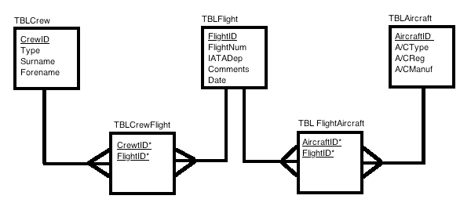
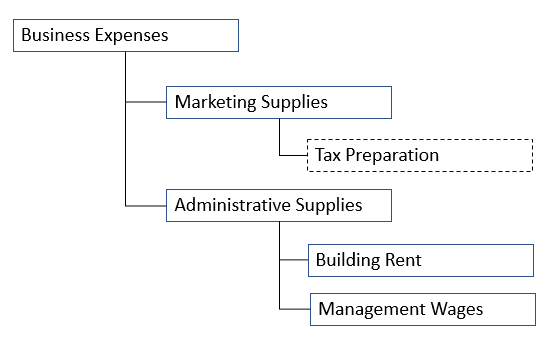
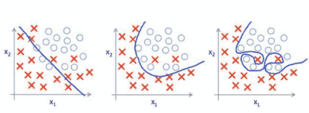
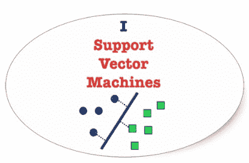
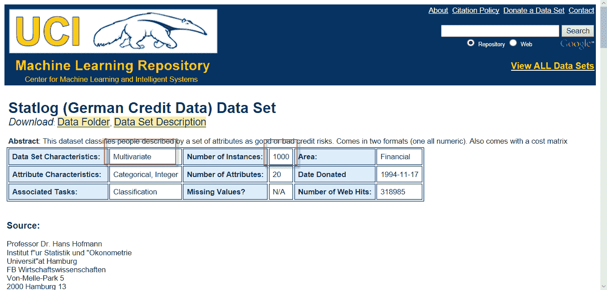
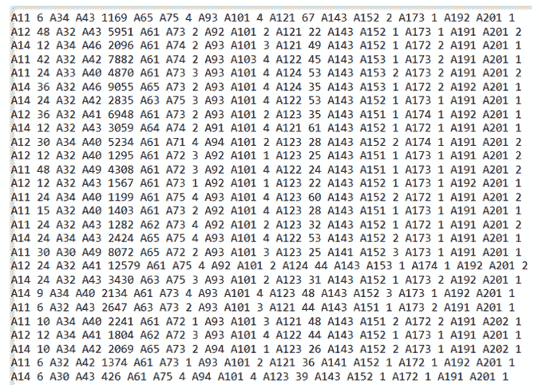

# 十一、使用支持向量机的数据库分类

在这一章中，我们将探索**支持向量机** ( **支持向量机**)，识别它们的各种应用，并浏览一个使用简单的 SVM 对数据库中的数据进行分类的例子。

在本章中，我们将再次将主题组织到以下主要领域:

*   数据库分类
*   支持向量机的定义和目的
*   常见 SVM 应用程序
*   使用 R 和 SVM 对数据库中的数据进行分类

让我们围绕一般或通用数据分类的概念展开这一章的对话。


# 数据库分类

正如我们在本书中所说的，如果读者是数据或数据库开发人员，或者有类似的背景，那么读者很可能听说过、熟悉并理解数据建模的过程。这可以(或许在高层次上)描述为分析和理解一些数据的组成和细节的努力。然后，对这些数据进行组织或分类，目的是让一个用户群体能够容易地理解和使用这些数据，这些用户可以是具名用户(已经确定的用户，如组织中的财务分析师)或匿名用户(如互联网消费者)。下图显示了根据要求进行的数据分类:



匿名访问是最常见的系统访问控制方法，至少对于网站来说是这样。

作为几乎所有数据建模开发项目的一部分，人们可能会被要求创建一个类图。该(类)图详细说明了如何将数据(或数据库)分割成离散的对象，这些对象如何相互关联，以及它们可能具有的任何已知接口或连接。类图中的每个类都可以保存数据及其用途。

因此，数据分类是将数据分类为各种类型、形式或任何其他不同类别的过程。

数据分类支持根据针对众多业务或其他目标的既定数据要求对数据进行分离和编目，以便可以开发数据计划或数据模型:



数据库或数据开发人员可能会认识或有点熟悉的一个真实世界的例子可能是为报告对财务帐户进行分类或重新分类的练习。

例如，您可能会发现，在财务报告项目期间(或者可能在典型的会计期结算期间)，一个典型的重复练习是对每个帐户进行详细审查，并合并正在使用的帐户，以报告组织的财务结果或绩效。

对于会计部门来说，术语*分类*(或重新分类)经常用于定义将一笔金额从一个**总账** ( **总账**)账户移动到另一个账户。例如，如果某项费用(如税务准备)计入营销用品而非行政用品，则更正分录可能为:

*将营销用品重新分类为行政用品*。

在这里，从会计部门的角度来看，我们谈论的是从一个总账账户中扣除一笔金额，并将该(相同)金额添加到另一个总账账户中的实际交易。从数据开发人员的角度来看，不会进行帐户交易，而是会运行一个编程更改或流程，可能会将某个特定帐户从一个父帐户(或多个帐户的合并)移至另一个父帐户。这通常被称为更新会计科目表报告层次结构，或**c**会计科目表 ( **COA** )维护。

我们会发现这些相同的概念仍然适用于统计学领域吗？

在本章的以下部分，我们将回答这个问题。


# 统计学中的数据分类

一些数据科学家或统计学家将统计数据分类定义为:

将数据分成有意义的类别进行分析。

阅读本文的数据库开发人员应该认同:



在数据科学和统计学中，分类被定义为基于包含其类别成员已经被验证的观察值(或实例)的训练数据集，识别新观察值应该被包括到哪个类别(有时称为子群体)。

数据科学家通常会自动对数据应用统计公式，以便处理大数据，为统计分析做准备。

通常情况下，在真实情况下收集的大量无组织或未分类的数据(通常称为原始数据)无法为数据科学家提供任何清晰的理解，只能提供基于不完善观点的预感。

数据分类的过程试图找出数据中的相似之处，并通过删除不必要的细节或噪声来压缩数据(我们在第十章、*中讨论过这一点，以提升你的数据库*)。分类有助于不同数据集之间的比较，清楚地显示不同的同意点和不同意点。

数据分类还有助于确定数据使用的基准。

分类使数据科学家能够研究几个特征之间的关系，并进行进一步的统计处理，如制表等。

受益于统计数据分类的一个很好的例子是一年一度的人口普查，根据性别、年龄、婚姻状况等对人口进行分类。


# 数据分类指南

指导方针(或政策)的目的是建立一个执行任务的框架。关于统计分类的最佳方式或最有效的方法，有许多学派。

在统计数据分类中，数据科学家将通过指定界限或边界来对数据进行分类。这些通常被称为**等级限制**。任何两个等级界限之间的组被称为**等级**或**等级区间**。

在你的统计旅行中，你可能也遇到了术语*决策边界*。数据科学家经常使用不同或相似的术语来指代一个概念。在涉及两个类的统计分类问题中，他们可以使用术语**决策**边界或**决策**表面来定义超曲面(超曲面是超平面概念的推广)，该超曲面将基础向量空间划分为两个集合，每个集合用于一个类。分类器会将决策边界一侧的所有点分类为属于一个类别，将另一侧的所有点分类为属于另一个类别。


# 通用指南

分类指南通常遵循以下原则:

*   对这些类别的定义不应有任何疑问

*   所有的类应该优选地具有相等的宽度或长度

*   选择分类限值时，应确保原始数据中的项目值与限值不一致

*   班级的数量最好在 10 到 20 之间，也就是说，不能太多也不能太少

*   这些类应该是详尽的，也就是说，原始数据的每个值都应该包含在其中

*   这些类应该是互斥且不重叠的，也就是说，原始数据的每一项只适合一个类

*   分类必须适合于调查的对象

*   分类应该是灵活的，每个类别中包含的项目必须一致

*   通过首先固定类间隔的数量，然后用该数量除总范围，来确定类间隔的宽度

指导原则适用于数据科学家用于分类的任何指导原则或策略。这些准则或政策必须自始至终适用于统计项目中观察到的所有数据。


# 定义

数据科学家必须了解的几个关键术语可能会影响分类方法，它们是:

*   **机密数据**通常代表任何归类为受限的数据，通常与敏感数据互换使用

*   **数据管理员**通常是高级资源，其职责包括监督一组或多组待分类数据的生命周期

*   **一个超平面**子空间；n 维欧几里得空间是平坦的，n 是该空间的一维子集，它将该空间分成两个不相连的部分

*   **特征选择**是选择相关特征(变量、预测值)的子集用于构建统计模型的行为

*   **特征空间**简单地指用于表征数据的特征集合

*   **统计分类**是识别一个新观察值应该属于哪一组类别(子群体)的问题

*   **软边界分类**是数据科学家在定义或创建分类器时允许出现一些错误的分类

*   **机构** **数据**定义为由大学维护或授权的所有数据

*   **边缘分类器**是一种分类器，能够为数据中的每个示例提供距决策边界的伴随距离

*   **非公开信息**是指根据指导方针、政策或法律被归类为私人或受限的任何信息

*   **敏感数据**通常代表分类为受限的数据，经常与机密数据互换使用

*   **属性描述符**；有时一个分类系统会采用描述符来传达给定分类的原因；例如，中年或城市是熟悉的描述

*   **互通**；当不同的应用程序使用不同的描述符，并且对于哪些属性是必需的，哪些是可选的(对于特定的分类)有不同的规则时，如何支持互操作性呢？

读者应该花一些时间研究与统计数据分类相关的许多术语，在统计领域还有许多其他数据定义术语。


# SVM 的定义和目的

我支持向量机，你呢？



在机器学习领域，支持向量机同样被认为是支持向量网络，并被定义为具有伴随学习算法的监督学习模型，该算法分析用于分类的数据。

关于支持向量机的一个重要注意事项是，它们都是关于成功执行模式识别的能力。换句话说，支持向量机提高了扩展数据中模式的能力，这些模式是:

*不能通过将原始数据变换成新的空间来进行线性分离。*

同样，您将发现和了解的关于支持向量机的一切都将与 SVM 是一种受监督的机器学习算法的想法相一致，这种算法最常用于统计中的分类或回归问题。


# 诀窍是

你会听到今天大多数数据科学家称之为“诡计”或“SVM 诡计”;他们所指的是支持向量机算法使用一种被称为**内核技巧**的方法。

内核技巧转换数据，然后基于它执行的那些转换，在可能的输出或数据点之间发现最佳边界(记住，我们在本章前面定义了分类边界)。

在统计学中，核方法是一种用于模式分析的算法。执行模式分析的总体任务是发现和研究数据中的一般类型的关系。

基本上，SVM 执行的转换是一些极其复杂的数据转换(对您的数据)，然后根据数据科学家之前定义的标签或输出(有时被认为是数据科学家定义的功能)有效地找出如何分离数据。

当涉及到支持向量机时，需要注意的另一个关键(也是发人深省的)点是，数据科学家不必担心在 SVM 执行变换时保留数据的原始维度。

因此，内核技巧获取原始数据、一些先前定义的特性、执行转换，并产生您可能不认识的输出——有点像揭开一个巨大的迷宫！

以下出自[www.yaksis.com/posts/why-use-svm.html](http://www.yaksis.com/posts/why-use-svm.html)，*为什么用 SVM？*:

“你从这个看起来无害的数据向量开始，在通过内核技巧后，它被分解并自我复合，直到现在它是一个更大的数据集，无法通过查看电子表格来理解。

但是神奇之处就在这里，在扩展数据集的过程中，现在你的类之间有了更明显的界限，SVM 算法能够计算出一个更优的超平面。"


# 特征空间和廉价计算

理解支持向量机工作原理的很大一部分是理解我们刚刚提到的技巧。正如我们所说的，这个技巧使用核方法(使用核函数)，并且能够在高维特征空间中很好地执行。

特征空间是数据变量所在的 n 维空间。核函数能够在这个高维空间中操作，而不必计算该空间中数据的坐标，而是仅仅通过计算特征空间中所有数据对的图像之间的内积。

与必须显式计算坐标相比，这个内核技巧可以更快、更有效地处理数据。这被认为是**计算成本低的**。

对于数据或数据库开发人员来说，因为数据库视图可以隐藏复杂性；想象一下，将数据库中的数据分成几个编译过的视图(而不是将所有数据作为一个数据源进行查询)的概念与 SVM 定义和使用向量的方式进行比较。


# 划清界限

描述支持向量机在努力对数据进行分类时执行的功能(或实际)步骤的一个很好的方式可能是想象支持向量机在不断努力寻找最好地分离两类数据点的线:


这里，最佳线被定义为在两个分类之间产生最大余量的线。位于此边缘的点是支持向量。

承认这些(支持)向量的伟大之处在于，我们可以将寻找最大利润超平面(最好地分离两个类别的线)的问题公式化为一个优化问题，该优化问题仅考虑 SVM 已经建立的支持向量。

这意味着 SVM 处理可以忽略绝大多数数据，使得分类过程进行得更快。

更重要的是，通过按照支持向量(所谓的**对偶形式**)来呈现问题，我们可以应用我们在本章前面定义的内核技巧来有效地将支持向量机转换为非线性分类器。

线性方法只能解决线性可分的问题(通常通过一个超平面)。非线性方法通常包括对输入数据集应用某种类型的变换。


# 不止是分类

另一个关键点是，除了分类，支持向量机还可以执行回归。

使用非线性核算法的 SVM 意味着该算法计算的边界不必是直线；这意味着 SVM 可以捕捉数据点之间更复杂的关系，而数据科学家不必手动完成所有这些困难的转换。


# 不利方面

那么，我们能找到使用支持向量机的缺点或不足吗？

是的，有时 SVM 所需的训练时间要长得多，计算量也大得多(这一点我们在本章前面已经谈到了计算成本)。


# 参考资源

关于支持向量机的一个非常容易理解的书是 NelloChristiani 和 John Shawe-Taylor 的《支持向量机和其他基于核的学习方法介绍》。

另一个值得尊敬的参考文献是西蒙·海金的*神经网络和学习机器*，它提供了支持向量机和相关类型的神经网络(称为**径向基函数网络**)之间的深刻联系，我们在*第 5 章*、*神经网络*中也提到了它。


# 预测信用评分

在本章的剩余部分，我们将尝试回顾一个基于像数据开发人员一样思考的支持向量机的例子。

这个例子可以在网上找到，并在本书的第 6 章*第二版*中详细引用。
[https://www . packtpub . com/big-data-and-business-intelligence/mastering-predictive-analytics-r-second-edition](https://www.packtpub.com/big-data-and-business-intelligence/mastering-predictive-analytics-r-second-edition)

如果你是一名数据开发人员，你可能不知道下面的网站为 http://archive.ics.uci.edu/ml/index.php 的测试数据集提供了一个非常好的资源

本例使用名为 *Statlog(德国信用数据)数据集*的特定数据集，该数据集可以在网站上的[https://archive . ics . UCI . edu/ml/datasets/Statlog+(德国+信用数据)](https://archive.ics.uci.edu/ml/datasets/statlog+(german+credit+data))下找到

该网站如下所示:



这个数据集是来自银行和金融领域的数据。数据集中的观察值是个人在银行提出的贷款申请。

该数据的目的是确定贷款申请是否构成高信贷风险。

数据或数据库开发人员很可能会注意到，与其下载数据集，不如创建一个查询来提取数据作为记录或事务，而不是实例(或观察)。

最有可能的是，如果从数据库中提取这些数据，这将不会像仅仅查询单个表那么简单，因为贷款申请很可能是以事务的形式，从多个数据库表中提取数据点。

数据开发人员应该考虑的其他要点是:

*   数据集特征-字段名称
*   属性特征-数据类型
*   捐赠日期—上次更新或添加日期

网站[https://archive . ics . UCI . edu/ml/machine-learning-databases/statlog/german/](https://archive.ics.uci.edu/ml/machine-learning-databases/statlog/german/)提供了两个关键文件；一个是实际数据，一个是数据模式:


数据模式采用 MS Word 文档(`german.doc`)的格式，用于创建以下矩阵:

| **列名** | **类型** | **定义** |
| 检查 | 绝对的 | 现有支票账户的状态 |
| 期间 | 数字的 | 几个月的时间 |
| 信用历史 | 绝对的 | 申请人的信用记录 |
| 目的 | 绝对的 | 贷款的目的 |
| 贷款 | 数字的 | 信用额度 |
| 储蓄 | 绝对的 | 储蓄账户/债券 |
| 雇用 | 绝对的 | 现任职务自 |
| 安装率 | 数字的 | 分期付款率(占可支配收入的百分比) |
| 个人的 | 绝对的 | 个人地位和性别 |
| 债务人 | 绝对的 | 其他债务人/担保人 |
| 现居地 | 数字的 | 现居地自 |
| 财产 | 绝对的 | 财产的类型 |
| 年龄 | 数字的 | 申请人的年龄(年) |
| 其他计划 | 绝对的 | 其他分期付款计划 |
| 房屋 | 绝对的 | 申请人的住房情况 |
| 现有银行信用 | 数字的 | 这家银行现有的信贷数量 |
| 工作 | 绝对的 | 申请人的工作情况 |
| 受赡养者 | 数字的 | 受抚养人的数量 |
| 电话 | 绝对的 | 申请人电话的状态 |
| 外国的 | 绝对的 | 外籍工人 |
| 危险 | 二进制的 | 信用风险(1 =好，2 =坏) |

原始数据如下所示:



# 使用 R 和 SVM 对数据库中的数据进行分类

既然我们理解了数据，我们可以继续这个特殊的统计例子。

首先，数据科学家需要将数据加载到 R 数据框对象中。这个例子称之为`german_raw.`

```
# --- load the data 
german_raw<- read.table("german.data", quote = "\"") 
```

下一步是提供与我们的数据模式表匹配的列名，如前所示:

```
names(german_raw) <- c("checking", "duration", "creditHistory", 
 "purpose", "credit", "savings", "employment", "installmentRate", 
 "personal", "debtors", "presentResidence", "property", "age", 
 "otherPlans", "housing", "existingBankCredits", "job", 
 "dependents", "telephone", "foreign", "risk") 
```

请注意，从数据模式(描述数据中的特征的表)中，我们有许多分类特征要处理。出于这个原因，数据科学家可以使用 R `dummyVars()`函数(可以用来创建一整套虚拟变量)来创建虚拟二进制变量。此外，他或她将记录`risk`变量，即输出，作为一个因子:

*   0 级=良好信用
*   1 级=不良信用

```
library(caret) 
dummies <- dummyVars(risk ~ ., data = german_raw) 
german<- data.frame(predict(dummies, newdata = german_raw),  
                       risk = factor((german_raw$risk - 1))) 
dim(german) 
[1] 1000   62 
```

由于之前的工作，我们将拥有一个包含 61 个要素的 R 数据框对象(因为几个分类输入要素有多个级别)。

接下来，数据科学家会将数据划分或拆分成两个子集:

*   训练数据集
*   测试数据集

这种分割可以使用以下 R 语句来完成:

```
set.seed(977) 
german_sampling_vector<- createDataPartition(german$risk,  
                                      p = 0.80, list = FALSE) 
german_train<- german[german_sampling_vector,] 
german_test<- german[-german_sampling_vector,] 
```

对于数据开发人员来说，也可以采用类似的方法，比如使用 from 子句选项 TABLESAMPLE。使用 TAMPLESAMPLE 选项，您可以从一个表中获得一组样本数据，而不必通读整个表或为每一行数据分配临时随机值。


# 继续前进

在(前面提到的)网站上提到的该数据集的一个特殊性是，数据来自一个场景，其中定义的两种不同类型的错误具有不同的相关成本。

具体来说，对银行来说，将高风险客户错误分类为低风险客户的成本是将低风险客户错误分类为高风险客户的五倍。这是可以理解的，因为在第一种情况下，银行会因为一笔无法偿还的贷款而损失很多钱，而在第二种情况下，银行错过了发放一笔会给银行带来利息的贷款的机会。

这是一个预测分析对组织底线产生直接影响的实际例子。

`svm()` R 函数有一个`class.weights`参数，用于指定错误分类的代价(对每个类的观察)。这就是数据科学家将不对称错误成本信息纳入模型的方式。

首先，创建一个类权重向量，注意需要指定对应于输出因子级别的名称。

然后，数据科学家使用 R `tune()`函数来训练具有径向核的各种 SVM 模型:

```
class_weights<- c(1, 5) 
names(class_weights) <- c("0", "1") 
class_weights 
0 1  
1 5 

set.seed(2423) 
german_radial_tune<- tune(svm,risk ~ ., data = german_train,  
  kernel = "radial", ranges = list(cost = c(0.01, 0.1, 1, 10, 100),  
  gamma = c(0.01, 0.05, 0.1, 0.5, 1)), class.weights = class_weights) 
german_radial_tune$best.parameters 
   cost gamma 
9  10  0.05 

german_radial_tune$best.performance 
[1] 0.26 
```

这里建议的最佳模型的成本为 10，gamma 为 0.05，并且达到了 74%的训练准确率。

接下来，我们将了解模型在测试数据集上的表现:

```
german_model<- german_radial_tune$best.model 
test_predictions<- predict(german_model, german_test[,1:61]) 
 mean(test_predictions == german_test[,62]) 
[1] 0.735 

table(predicted = test_predictions, actual = german_test[,62]) 
         actual 
predicted   0   1 
        0 134  47 
        1   6  13 
```

在测试集上的性能为 73.5%，非常接近在模型训练中看到的性能。正如预期的那样，该模型往往会犯更多的错误，将低风险客户错误分类为高风险客户。

不足为奇的是，这影响了总体分类精度，即正确分类的观察值与观察值总数的比率。事实上，如果我们要消除这种成本不平衡，从无偏分类准确性的角度来看，我们实际上会为我们的模型和我们的性能选择一组不同的参数，这样会更好:

```
set.seed(2423) 
german_radial_tune_unbiased<- tune(svm,risk ~ .,  
  data = german_train, kernel = "radial", ranges = list(  
cost = c(0.01, 0.1, 1, 10, 100), gamma = c(0.01, 0.05, 0.1, 0.5, 1))) 
german_radial_tune_unbiased$best.parameters 
  cost gamma 
3    1  0.01 
german_radial_tune_unbiased$best.performance 
[1] 0.23875 
```

当然，最后一种模式会导致大量高风险客户被错误归类为低风险客户，我们知道这是非常不可取的。我们将用两个最后的想法来结束这一部分。首先，我们对`gamma`和`cost`参数使用了相对较小的范围。

最初，当给出这个例子时，它被作为“读者的一个练习”留下来，用这两个值的更大分布重新运行分析，以查看我们是否可以获得更好的性能，这很可能导致更长的训练时间。

第二，这个特殊的数据集非常具有挑战性，因为它的基线准确率实际上是 70%。这是因为数据中 70%的客户是低风险客户(两个输出类别不平衡)。

咻！


# 摘要

在这一章中，我们用一些数据开发人员可能熟悉的例子定义了数据库和数据分类的概念。接下来，我们介绍了统计数据分类，并将这一概念与前者进行了比较。

分类指南与几个重要的相关术语一起提供。

最后，我们谈到了支持向量机，它们是如何工作的，以及它们为数据科学家提供的优势。

在下一章中，我们旨在解释机器学习的类型，并向开发人员说明如何使用机器学习过程来理解数据库映射并识别数据中的模式。